# Lec 1 Part 2 Derivatives As Linear Operator

📊 **Progress:** `13` Notes | `14` Screenshots

---
<a id="node-25"></a>

<p align="center"><kbd>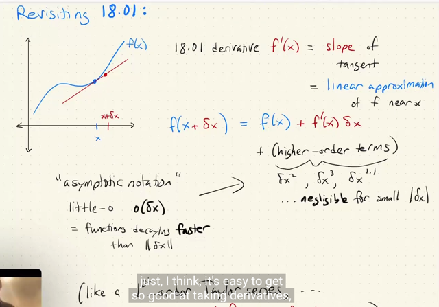</kbd></p>

> [!NOTE]
> Đầu tiên đại khái là gs lướt lại cho ta về 18.01 (lớp scalar calculus). Gs cho
> rằng ta rất giỏi tính `/` tìm đạo hàm của hàm số nhưng thường lại **quên mất
> ý nghĩa của nó**.
>
> Vậy thì **cốt lõi của derivative** là **LINEARIZATION** `-` tạm hiểu là ta**tuyến tính hóa một hàm số**, hay **xấp xỉ một hàm số f bằng một hàm tuyến
> tính.**
>
> Lấy điểm x, tại đó hàm**f có giá trị f(x)**. Thế thì khi ta **thay đổi x một
> khoảng δx** thì f(x `+` `δx)` sẽ được tính như sau:
>
> **f(x `+` `δx)` `=` f(x) `+` `f'(x)δx` `+` O((δx)^2)**
>
> Trong đó **f'(x) là độ dốc (rate of change) của tiếp tuyến** với hàm số **tại
> x**.**O((δx)^2)** chỉ **mọi higher order term của δx** cần thiết để khiến vế
> phải  bằng vế trái
>
> Thế thì ta cần hiểu rằng **DÙ `δx` LỚN THÌ PHƯƠNG TRÌNH TRÊN VẪN
> ĐÚNG** phương trình trên vẫn đúng. Bởi vì vế phải, dù phần đầu mô tả một
> hàm tuyến tính (f(x) `+` `f'(x)δx)` nhưng ta có phần `O((δx)^2)` để bù đắp cho
> mọi sai khác còn lại.
>
> Tuy nhiên nếu `δx` **RẤT NHỎ**, thì phần **HIGHER** **ORDER** **TERM**
> **CỦA** `δx` **TRỞ** **NÊN** **RẤT NHỎ,** **CÓ THỂ COI NHƯ KHÔNG
> ĐÁNG KỂ** (negligible) để rồi khi đó, **CHO PHÉP TA BỎ ĐI NHỮNG
> PHẦN ĐÓ**, và **XẤP XỈ f(x `+` `δx)` CHỈ VỚI f(x) `+` f'(x)δx**. Thì đó chính là
> cho ta công  thức của **LINEAR APPROXIMATION**
>
> **f(x `+` `δx)` `~=` f(x) `+` f'(x)δx** `(δx~=0)`
>
> Cần nhấn mạnh giá trị của `f(x+δx)` **KHÔNG CHÍNH XÁC BẰNG f(x) `+` f'
> (x)*δx**, mà **phải có thêm (higher order term of δx),**nhưng với việc các
> higher order term này rất nhỏ (khi `δx` nhỏ) thì ta có quyền bỏ đi và dùng dấu
> xấp xỉ `~=`
>
> `====`
>
> Một điểm nữa đó là trong computer science ta có big O notation, thì ở đây
> nó có cái nữa là **small o notation**. Chỉ những function mà **giảm về 0
> nhanh hơn hàm tuyến tính**.

<br>

<a id="node-26"></a>

<p align="center"><kbd>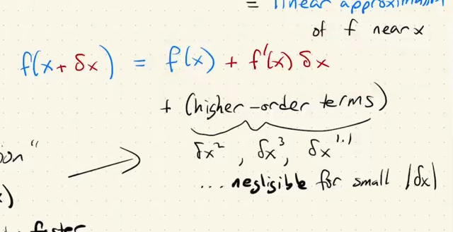</kbd></p>

> [!NOTE]
> Một điểm nữa đại khái gs nói là ta nhìn vào đây và nghĩ về **Taylor**
> series, khi sau **f'(x)δx** ta có (**1/2)f''(x)(δx)^2** `+` ....
>
> Ý gs là **ta có thể cho rằng** những phần "**higher order terms**" **tạo
> thành phần còn lại của Taylor series**.
>
> Tuy nhiên gs **nhấn mạnh rằng cách hiểu này không đúng**, vì **Taylor**
> series là một **khái niệm cao cấp**. Và **không phải function nào cũng có
> Taylor series.**

<br>

<a id="node-27"></a>

<p align="center"><kbd>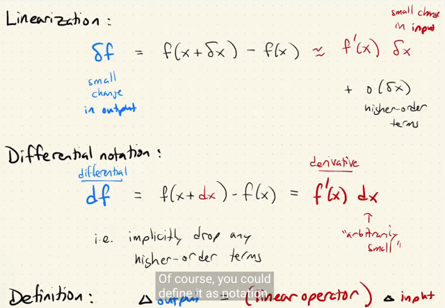</kbd></p>

> [!NOTE]
> Tiếp theo đại khái là dẫn dắt về công thức định nghĩa của đạo hàm df `=` f'(x) dx
>
> Đại khái là, quay trở lại việc thể hiện f khi x thay đổi một khoảng `δx:`
>
> ```text
> f(x+δx) = f(x) + f'(x)δx + o(δx) (mà nếu δx nhỏ ta có thể bỏ đi o(δx) và có công thức xấp xỉ
> ```
> (linearization)
>
> ```text
> Chuyển f'(x) qua bên trái, ta có f(x+δx) - f(x) = δf, phương trình trên tương đương:
> ```
>
> ```text
> δf = f'(x)δx + o(δx)
> ```
>
> Thế thì tới đây, gs nói rằng vì **sẽ bất tiện** nếu**lúc nào cũng phải mang theo o(δx).**
>
> Do đó, ta mới **thay `δx` bằng dx** ý nghĩa là khoảng thay đổi **VÔ CÙNG NHỎ của x**.
>
> Và khi đó, như đã nói, khoảng sai số giữa `f(x+dx)` và f(x) `+` f'(x)dx **coi như bằng 0** tức là `o(δx)` `=` 0
>
> Từ đó cho phép ta có **df `=` f'(x)dx**. Và đây chính là **ĐỊNH NGHĨA** của derivative 
> ```text
> đó là df/dx chính là limit của δf/δx khi δx -> 0 mà thể hiện theo vi phân thì nó là
> ```
>
> **df `=` f'(x)dx**
>
> Và df gọi là **vi phân** (**differential**), còn **f'(x)**là **đạo hàm (derivative)**Vậy có thể thấy đây giống như cách lập luận ngược lại với 1801. Nhớ lại trong **1801**, ta bắt đầu
> với việc**định nghĩa của derivative của f đối với x**, là **rate of change** giữa [khoảng thay đổi của f
> `δf]` `/` [khoảng thay đổi của x `δx]` với `δx` vô cùng nhỏ, **df/dx** (kí hiệu theo Leibniz) `=` **f'(x)** (kí hiệu
> theo Newton) `=` **lim `∆x->0` δf/δx**Thế rồi sau đó, bằng cách cho rằng**miễn là `δx` đủ nhỏ**, thì ta **có thể xấp xỉ f'(x) bằng δf/δx** để
> có công thức linear approximation: **f'(x) `~=` δf/δx** (không còn cần kí hiệu limit nữa, những phải dùng
> dấu xấp xỉ)****Vậy thì f'(x) `~=` `δf/δx` có nghĩa là, ví dụ tại x0, thì f'(x0) `~=` (f(x) `-` f(x0)) `/` (x `-` x0)**** `<=>` f(x) `~=` f(x0)
> `+` f'(x0)(x-x0)****Tại đây, nếu muốn chuyển thành dấu bằng, thì ta sẽ phải tính vào các higher order****term của ∆x.****=====****Vậy ngẫm lại một chút, một khái niệm mà ta tưởng chừng là đơn giản và thực sự cũng đơn giản
> nhưng ta đôi khi chưa thật sự triệt để hiểu nó:
>
> `-` Cần phải hiểu rằng, trong phương trình **δf `=` f'(x)δx** thì **biến số là δx**, **f'(x) LÀ HÀM TUYẾN
> TÍNH ĐỐI VỚI BIẾN SỐ δx**
>
> Và ý nghĩa của nó là, **khoảng thay đổi của hàm f**, bằng k**hoảng thay đổi của x** **SCALE LÊN
> BỞI MỘT GIÁ TRỊ QUY ĐỊNH BỞI f'(x)**.
>
> Và khi `δx` trở thành vô cùng nhỏ dx, thì ta coi như khoảng thay đổi của hàm **f, df LÀ QUAN HỆ TUYẾN
> TÍNH VỚI KHOẢNG THAY ĐỔI VÔ CÙNG NHỎ CỦA x (dx)**
>
> Đó chính là ý nghĩa của cái phương trình cuối cùng trong screen:
>
> **∆f `=` (linear operator) ∆x**
>
> **(linear operator) ∆x** ở đây phải hiểu là cái **operator** sẽ được **áp dụng lên δx**, và operator này
> là một **LINEAR OPERATOR**
>
> Gs sẽ ôn lại về linear operator ở phần sau. Nhưng hiểu đại khái là khi ghi "linear operator x" thì nó
> ám chỉ một **operator tính toán trên, áp dụng lên x.**

> [!NOTE]
> Chỗ này cần chú ý ta hiểu là ông đang ghi `δx` `~=` `f'(x)δx` (**o(δx) ở
> dưới ý là đã bỏ đi rồi) chứ còn nếu có cộng `o(δx)` thì ta có dấu
> bằng**chứ ko cần phải là `~=`
>
> ```text
> Còn nếu từ δf = f'(x) δx + o(δx) và ta cho δx -> dx mang ý nghĩa
> ```
> **VÔ CÙNG NHỎ**, thì ta có quyền bỏ luôn `o(δx)` (vẫn dùng dấu bằng), 
> vì nó trở thành 0 rồi. Khi đó ta có dạng **df `=` f'(x)dx** 
>
> Chính là cách thể hiện vi phân của đạo hàm
>
> (cách thể hiện theo định nghĩa:
>
> ```text
> f'(x) = df/dx = lim ∆x->0 ∆f/∆x)
> ```

<br>

<a id="node-28"></a>

<p align="center"><kbd>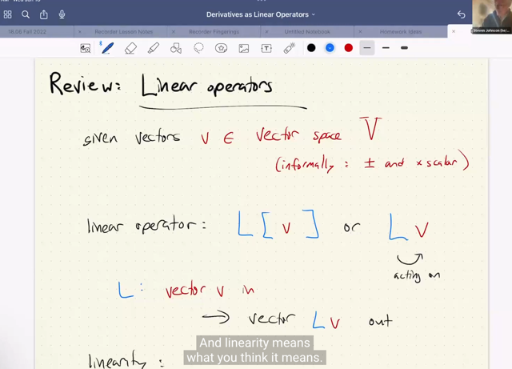</kbd></p>

> [!NOTE]
> Gs review một chút về định nghĩa của **linear operator**: Đó là, với
> vector v thuộc vector space V, **một linear operator**sẽ**biến một
> vector v thành một vector khác cũng trong vector space V** với điều
> kiện thỏa mãn hai tính chất:
>
> `-` **Addition**: **L `(u+v)` `=` L u `+` L v** nôm na là một function apply lên
> tổng hai vector sẽ cho ra kết quả giống như tổng của hai kết quả khi
> apply function lên mỗi vector.
>
> `-` **Homogeneity** `-` là tính chất **L alpha*u `=` alpha * L u**: nôm na là
> khi  apply a function lên một vector nhân với scalar thì tương đương
> apply function lên vector xong rồi mới scale với scalar.
>
> Hay hiểu theo góc nhìn khác nữa nè: Linear operator **GIỮ NGUYÊN
> LINEAR COMBINATION**: nếu v `=` `c1v1+c2v2,` tức là linear combination
> của v1, v2 với bộ hệ số c1, c2. Thì L(v) **CŨNG CHÍNH LÀ DÙNG BỘ
> HỆ SỐ NÀY ĐỂ COMBINE L(v1), L(v2)**: L(v) `=` c1L(v1) `+` c2L(v2)

<br>

<a id="node-29"></a>

<p align="center"><kbd>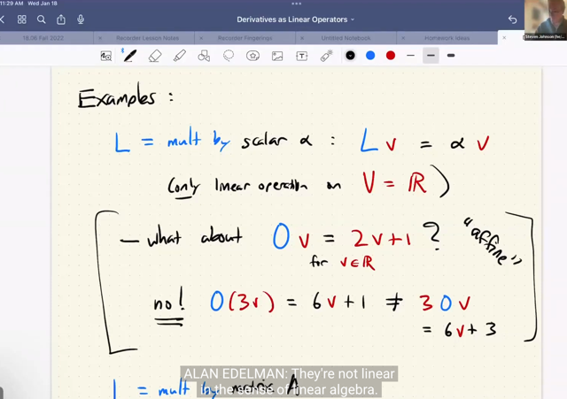</kbd></p>

> [!NOTE]
> Một ví dụ của một linear operator là: **nhân vector input với một scalar
> hoặc một matrix** L v `=` scalar*v, L v `=` Av
>
> L v `=` alpha*v, nhận input là vector và output là vector alpha*v L v `=` Av:
> nhận vào vector v, và apply cái linear operator (hay 1806 gọi là linear
> transformation) lên v, mà cái phép transformation đó chính là nhân A với
> v: Av
>
> Do đó**f'(x)δx mang ý nghĩa là** là **áp dụng linear operator  L v `=` f'(x) v
> lên δx** và tùy hoàn cảnh mà linear operator này có thể là nhân matrix
> với v hay nhân scalar với v tùy thuộc f là gì.
>
> `====`
>
> Tuy nhiên gs chú ý là **2v+1**, lại**KHÔNG PHẢI LÀ** **LINEAR
> OPERATOR**:
>
> không thỏa mãn tính chất thứ hai homogeneity: O scalar * v `=` scalar
> * O v
>
> Và nó cái tên là **AFFINE** `-` đây là cái hay gặp trong neural network,
> nhưng người ta vẫn gọi nó là một linear transformation (nhưng ngầm
> hiểu là affine)

<br>

<a id="node-30"></a>

<p align="center"><kbd>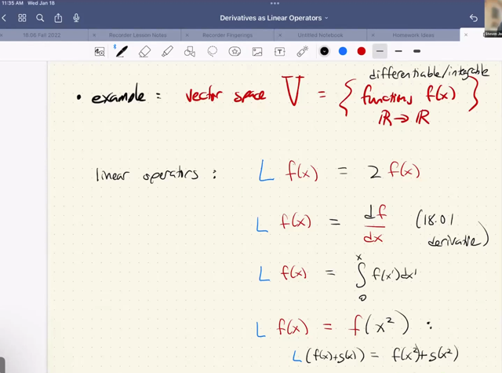</kbd></p>

> [!NOTE]
> gs cho một số ví dụ về các function (operation) thỏa mãn tính chất
> của một linear operator.
>
> Ở đây ông lấy ví dụ về **vector space** là subspace các
> **differentiable** `/` **integral-able** function của function space `-` như
> đã học 1806 với thầy Strang là tập hợp **các function vẫn đảm bảo
> tính chất của vector space** khi **tổng và scale hai function vẫn
> được một function**Phân tích một số ví dụ t**ại sao chúng là linear operator**.
>
> Tại sao L f(x) `=` `df/dx` là linear operator: là bởi L [f(x) `+` g(x)] cũng
> bằng L f(x) `+` L g(x) (điều kiện thứ nhất của linear operator):
>
> ```text
> d(f(x)+g(x))/dx = df(x)/dx + dg(x)/dx (đạo hàm của tổng = tổng đạo
> ```
> hàm)
>
> và L scalar*f(x) `=` scalar * L f(x):
>
> `d(alpha*f(x))/dx` `=` `alpha*df/dx` (đạo hàm cho phép chuyển scalar ra
> ngoài)
>
> ```text
> Nói ngắn gọn d/dx [af(x) + bg(x)] = a*d/dx f(x) + b*d/dx g(x)
> ```

<br>

<a id="node-31"></a>

<p align="center"><kbd></kbd></p>

> [!NOTE]
> Và quay lại đây, nói chung đó chính là định nghĩa của differentiation:
> Khi x thay đổi một khoảng nhỏ thì **khoảng thay đổi của output (delta
> output) bằng với MỘT LINEAR OPERATOR ÁP DỤNG LÊN khoảng
> thay đổi của input (delta input)**Và trong trường hợp này nó linear operator đó L v chính là **VIỆC
> NHÂN VỚI SCALAR HAY MATRIX**, và scalar hay matrix đó **CHÍNH
> LÀ DEFINE BỞI F'(X)**

<br>

<a id="node-32"></a>

<p align="center"><kbd>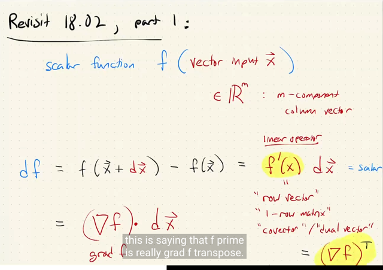</kbd></p>

> [!NOTE]
> tiếp, gs ôn lại chút về nội dung của 18.02, đầu tiên là một **SCALAR**
> function f take input là vector x thuộc Rm
>
> Vậy đại khái là, gs cũng viết phương trình liên hệ khoảng thay đổi vô
> cùng nhỏ của input (dx) với khoảng thay đổi vô cùng nhỏ của output df
> qua: df `=` f'(x)dx
>
> Thế thì ý chính là: lúc này df là khoảng thay đổi của output `-` mà **output
> là một scalar** nên đương nhiên **df CŨNG LÀ SCALAR.**
>
> Rồi, vì **x LÀ COLUMN VECTOR** nên đương nhiên **dx `-` CŨNG LÀ
> VECTOR chứa** các khoảng thay đổi vô cùng nhỏ của các phần tử của
> x.
>
> Vậy, gs nhấn mạnh là, ta **CHỈ CÓ THỂ CHO RA SCALAR** nếu **f'(x)
> LÀ MỘT ROW VECTOR**, để f'(x) dx **LÀ PHÉP DOT PRODUCT**
>
> Và người ta đặt cho nó cái tên là **GRADIENT** **VECTOR** kí hiệu
> **∇f**và****đọc là**grad f**Và như vậy **df là dot product của chúng: ∇fTdx,**
>
> Và do đó **f'(x) CHÍNH LÀ (∇f)T**

<br>

<a id="node-33"></a>

<p align="center"><kbd>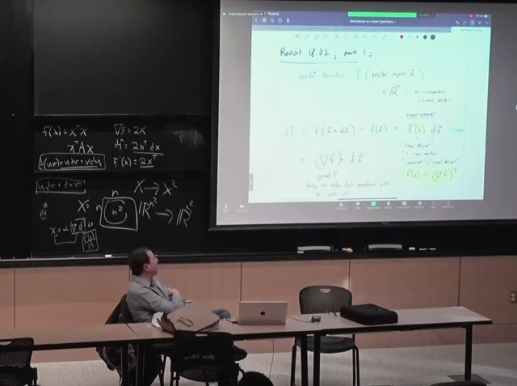</kbd></p>

> [!NOTE]
> gs cho biết cách notation này sẽ giúp ta khái quát hóa cho các
> case khác khi input là matrix và output là scalar

<br>

<a id="node-34"></a>

<p align="center"><kbd>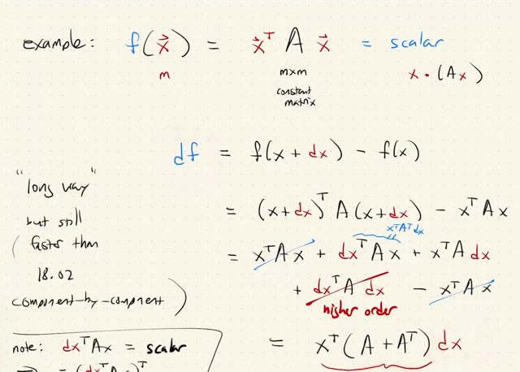</kbd></p>

🔗 **Related:** [LEC 2 PART 1: DERIVATIVES IN HIGHER DIMENSIONS: JACOBIANS AND MATRIX FUNCTIONS](untitled.md#node-50)

> [!NOTE]
> Gs lấy ví dụ scalar function f(x)  `=` **xTAx**, với A là **constant square**
> **matrix**.
>
> (không nhất thiết phải symmetric)
>
> (Sau khi finish 1806 ta biết cái này gọi là **QUADRATIC FORM** của A,
> mà **nếu nó  luôn dương với x khác không** thì A sẽ là **positive
> definite**. Nếu không âm thì A sẽ là **positive semi-definite**)
>
> Và đầu tiên gs sẽ cho ta xem thử việc tính derivative của f w.r.t x theo
> cách thứ nhất (long way) nhưng gs cho rằng vẫn sẽ ngắn hơn nhiều so
> với cách tính của 18.02 (như đã nói 18.096 này ta sẽ học cách tính
> gradient đối với vector matrix một cách **HOLISTICALLY**) thay vì **làm
> theo từng phần tử**)
>
> Vậy thì dễ hiểu thôi **triển khai** **df `=` f(x `+` dx) `-` f(x)** ra.
>
> thì `f(x+dx)` sẽ là `(x+dx)TA(x+dx),` ta chỉ việc nhân vào (distribution rule):
>
> Đầu tiên nếu kĩ hơn thì `(x+dx)T` `=` xT `+` dxT (transpose của tổng hai vector
> thì cũng bằng transpose từng cái rồi cộng lại)
>
> Và nhân vô ta sẽ có như trong slide, với **dxTAdx** là**dạng bậc hai của
> dx** rồi thì ta sẽ **bỏ đi** như theo quy ước rằng **dx vô cùng nhỏ thì mấy
> cái second order term sẽ coi như bằng 0**.
>
> Và một cái nữa (gs ghi chú ở dưới mà ta cũng biết rồi, đó là vì **dxTAx**
> là một SCALAR mà với scalar a thì aT `=` a, thành ra kết quả ta được
> dxTAx  `=` (dxTAx)T `=` xTATdx
>
> Cuối cùng ta có df `=` xTATdx `+` xTAdx `<=>` **df =** **xT(AT `+` A)dx**
>
> Và như đã nói cái**xT(AT+A) này chính là f'(x)**, và **nó là một row
> vector**
>
> Thế thì vector gradient**∇f sẽ chính là f'(x)T** (lật nó nằm dọc lại  thành
> column vector) `=` `[xT(AT+A)]T` `=` `(AT+A)TxTT` `=` `(ATT+AT)x` `=` **(A+AT)x
>
> ∇f `=` (A+AT)x**

<br>

<a id="node-35"></a>

<p align="center"><kbd>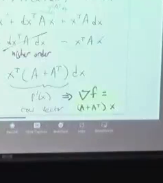</kbd></p>

<p align="center"><kbd></kbd></p>

<p align="center"><kbd>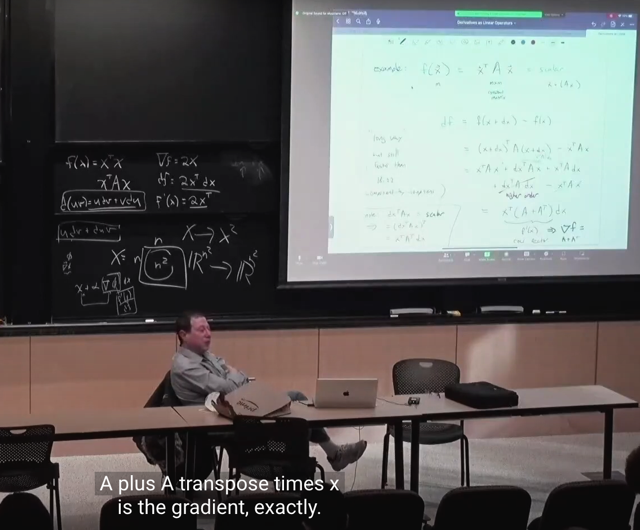</kbd></p>

> [!NOTE]
> gradient grad f `=` `(A+AT)x`

<br>

<a id="node-36"></a>

<p align="center"><kbd>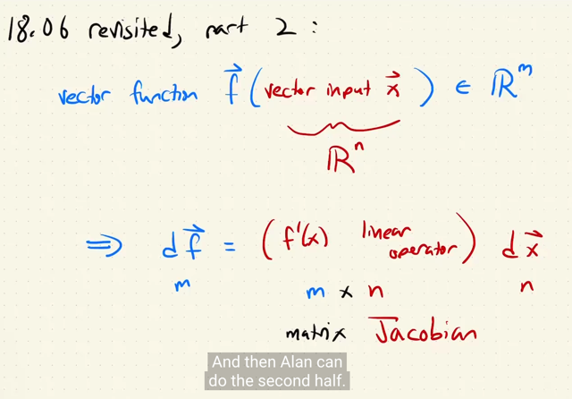</kbd></p>

> [!NOTE]
> bài sau sẽ tiếp tục
> nói về cái này

<br>

