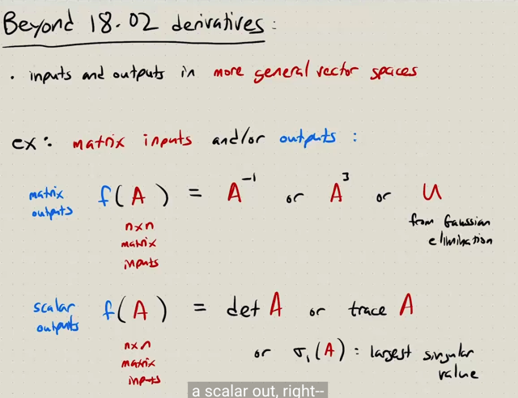
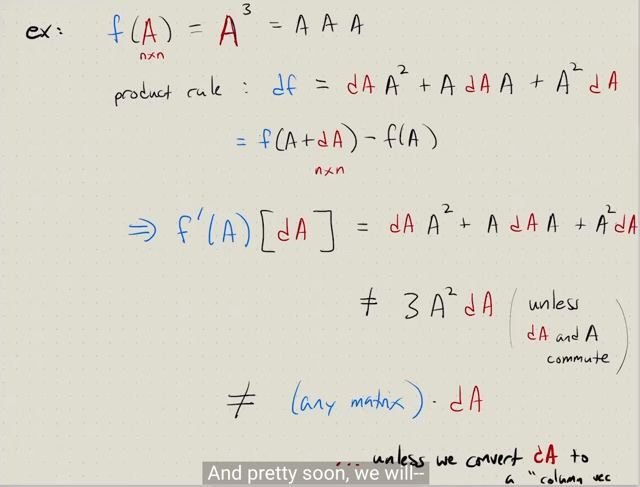
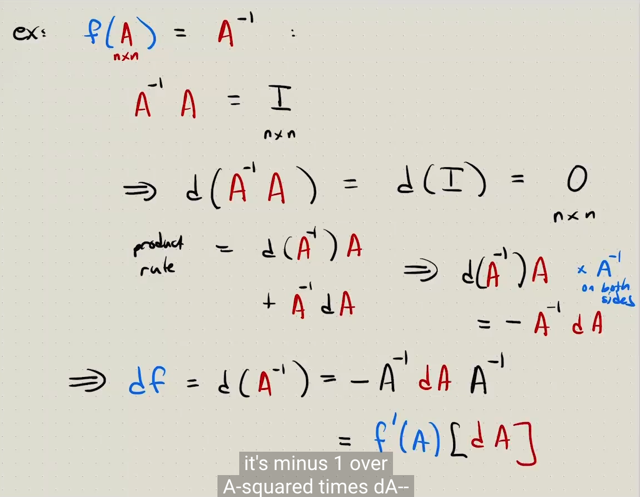

# Lec 2 Part 2: Vectorization Of Matrix Function

📊 **Progress:** `6` Notes | `3` Screenshots

---

<kbd></kbd>

> [!NOTE]
> đầu tiên gs Steve gợi nhớ lại trong 18.06 thầy Strang có nói vector
> trong vector space **không chỉ nói về column vector**, mà còn **có thể
> là matrix, function.**..miễn sao nó thỏa điều kiện là **i) add hai vector**
> trong space vẫn tạo vector nằm trong space và ii)**scale vector với
> scalar** thì vẫn nằm trong space
>
> Thì ở đây gs sẽ nói về**function nhận input là matrix và output
> matrix**. ví dụ như function **nhận vào matrix A**, trả ra **Ainv**,
> **A^3** hoặc trả ra kết quả sau khi **elimination A đưa nó về dạng U**
> - upper triangular hoặc reduce echelon form.
>
> Hoặc có thể**output ra scalar**ví dụ như function**tính determinant**
> hoặc **trace của matrix**
>
> Đương nhiên là ta sẽ nói về **cách tính derivative của các function
> này**

 

<kbd></kbd>

> [!NOTE]
> Ta tính df với f(A) = A^3. Kết qủa là **df = dA.A^2 + A.dA.A + A^2.dA**
>
> Ở đây chú ý **PHẢI HIỂU f'(A) [dA] LÀ OPERATOR f'(A) ACT ON dA**và cụ
> thể là **dA.A^2 + A.dA.A + A^2.dA**Tại sao ra công thức này thì dễ thôi ta cứ làm theo cách làm bữa giờ:
>
> **df** = f(A+dA) - f(A) = **(A+dA)^3 - A^3**
>
> Thế thì **(A+dA)^3** phải triển khai là **(A+dA)(A+dA)(A+dA)**
>
> = (A.A + dA.A + A.dA + dA.dA)(A + dA)
>
> = A.A.A + dA.A.A + A.dA.A + dA.dA.A + A.A.dA + dA.A.dA + A.dA.dA + dA.
> dA.dA
>
> = A^3 + dA.A^2 + A.dA.A + dA^2.A + A^2.dA + dA.A.dA + A.dA^2 + dA^3
>
> Từ đó df = A^3 + dA.A^2 + A.dA.A + dA^2.A + A^2.dA + dA.A.dA + A.dA^2 +
> dA^3 - A^3
>
> = **dA.A^2** + **A.dA.A** + \/dA^2.A\/ + **A^2.dA** + \/dA.A.dA\/ +\/ A.dA^2\/
> + \/dA^3\/
>
> Và ta sẽ **bỏ đi các higher order term**
>
> = **dA.A^2 + A.dA.A + A^2.dA**Và gs chú ý phép nhân matrix không **commutative**- tức không thể thay
> đổi thứ tự phép nhân được do đó không thể chuyển AdAA thành AAdA =
> A^2dA và da.A^2 = A^2.dA để rồi cộng ba cái thành 3A^2dA
>
> Trừ khi việc nhân A,dA có tính chất **commutative** hoặc **khi ta chuyển chúng
> thành vector**.

> [!NOTE]
> df với f(A) = A^3

 

<kbd></kbd>

🔗 **Related:** [LEC 4 PART 2: NONLINEAR ROOTING FINDING, OPTIMIZATION AND ADJOINT GRADIENT METHODS](untitled.md#node-144)

> [!NOTE]
> gs nói một ví dụ khác. tính df của **f(A) = A_inv**
>
> Thế thì để làm vậy ta sẽ để ý là **d(AinvA) = d(I) = 0**. Lí do là bởi dù 
> có perturb A như thế nào thì**f(A) = AinvA luôn bằng I**. 
>
> Tức df (ý là của f(A) = AinvA) luôn bằng 0
>
> Thứ hai là dựa vào product rule: **d(AB) = (dA)B + AdB**
> ta có **d(AinvA) = dAinvA + AinvdA**
>
> Và kết hợp hai cái ta có **dAinvA + AinvdA = 0**
>
> <=> **dAinv.A = - Ainv.dA** 
>
> Nhân Ainv vào bên phải hai vế
>
> <=> dAinv.A.Ainv = -Ainv.dA.Ainv
>
> <=> **dAinv = -Ainv.dA.Ainv**

> [!NOTE]
> f(g,h) = g*h 
>
> df(g,h) = f(g+dg, h+dh) - f(g,h)
>
> = (g+dg)(h+dh) - gh
>
> = gh + g(dh) + (dg)h + dg dh - gh
>
> = g(dh) + (dg)h

> [!NOTE]
> df, với f(A) = Ainv:
>
> dAinv = -Ainv.dA.Ainv

 

