# Lec 3 Part 1 Kronecker Products And Jacobians

📊 **Progress:** `29` Notes | `27` Screenshots

---

<kbd>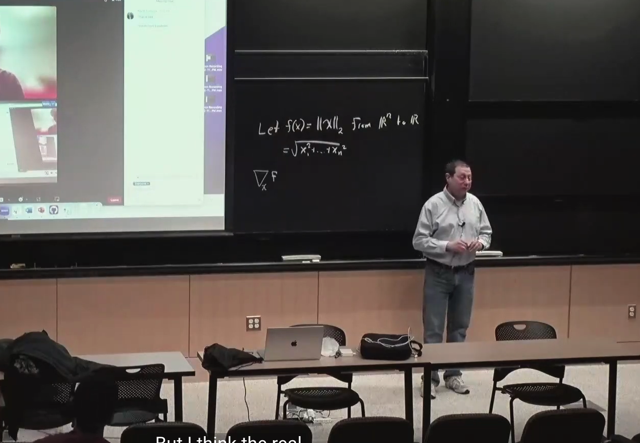</kbd>

> [!NOTE]
> gs Alan mở đầu bằng bài toán tính **derivative của hàm f(x)** =
> **l2 norm của vector x w,r,t x**

 

<kbd>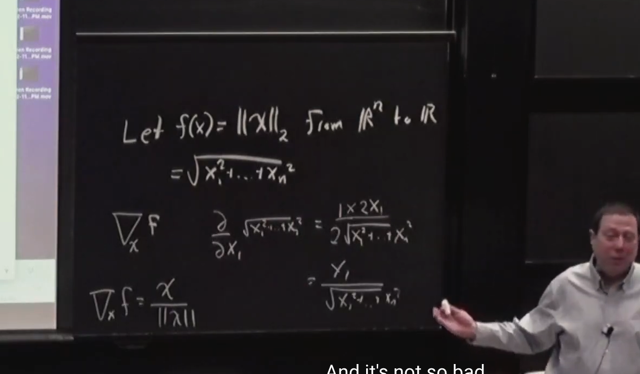</kbd>

> [!NOTE]
> thì gs cho rằng ta, nếu **theo cách làm thông thường**, từ 18.02 có thể sẽ
> **tiếp cận theo lối "indices"** như thế này: đó là ta **tính derivative của f w.r.t
> các phần tử của x,**
> Và dùng chain rule cũng như công thức đạo hàm hàm sơ cấp ta sẽ có
> thể tính ra kết quả là **x1/||x||**
>
> để rồi derivative của f w.r.t các x_i khác cũng vậy = **x_i / ||x||**
>
> từ đó **derivative của f w.r.t vector x** sẽ là vector **[df/dx1 df/dx2...df/dxn].T**
>
> = [x1/||x||, x2/||x||, ...xn/||x||]
>
> = (1/||x||) . x =**x/||x||**
> ====
>
> Gs cho rằng cách làm này **không sai** nhưng ta nên làm theo lối của 18.096
> không cần dùng indices nữa

 

<kbd>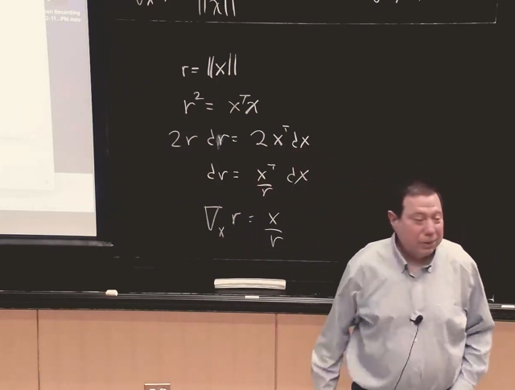</kbd>

> [!NOTE]
> cách tiếp cận của gs Alan đó là, bắt đầu với việc**đặt r = ||x||**. 
>
> Và từ đó**r^2 = xTx**.
>
> Sau đó **lấy derivative hai vế** để có **2rdr = 2xT.dx (*)**
>
> Từ đó**dr = (xT/r)dx**
>
> Và**grad vector** sẽ là **(xT/r)T = x/r**Chỗ này lập luận lại như sau:
>
> Đầu tiên là d(xTx). Ta có thể dùng d(fg) = fdg + gdf => d(xTx)
> = xTdx + d(xT)x. 
>
> Hoặc có thể tính nhanh d(xT) theo cách làm ở 18096 này: 
>
> d(xT) = (x+dx)T - xT = xT + dxT - xT = dxT
>
> nên xTdx + d(xT)x = xTdx + dxTx. 
>
> Tới đây vì xTdx là scalar nên xTdx = (xTdx)T = dxTx 
>
> => xTdx + dxTx = 2xTdx. 
>
> Vậy 2rdr = 2xTdx => dr = xT/rdx => ∇f = (xT/r)T = x/r
>
>
> Đây có thể thấy chính là cách làm của implicit differentiation
> thay vì để nguyên r = ||x|| lấy đạo hàm thì khó, nhưng chuyển
> thành r^2 = xTx thì dễ

 

<kbd>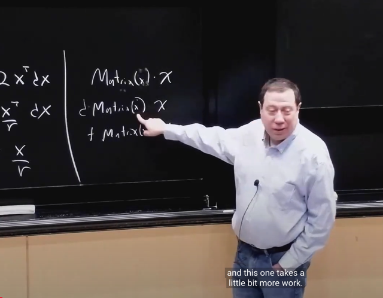</kbd>

🔗 **Related:** [PROBLEM SETS 1](untitled.md#node-230)

> [!NOTE]
> tiếp gs Alan nói sơ qua về homework trong đó ta phải tính derivative
> của f = Matrix(x)x tức là Matrix(x) là một matrix function output một
> matrix từ input x. Gs cho rằng ta sẽ cần làm thêm một số việc khi
> tính dMatrix(x)

 

<kbd>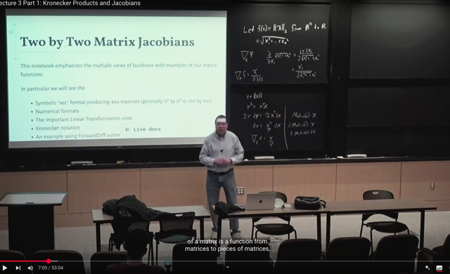</kbd>

> [!NOTE]
> Phần tiếp theo gs nói về **matrix-matrix** function. Ông lấy ví dụ như
> **A=LU** (ta biết nó chính là quá trình **elimination**, để biến A thành dạng
> row echelon form U)
>
> Hoặc gs có nhắc đến **eigendecomposition**, là function take in matrix
> và output ra nhiều matrix (**A = SΛSinv**)

 

<kbd>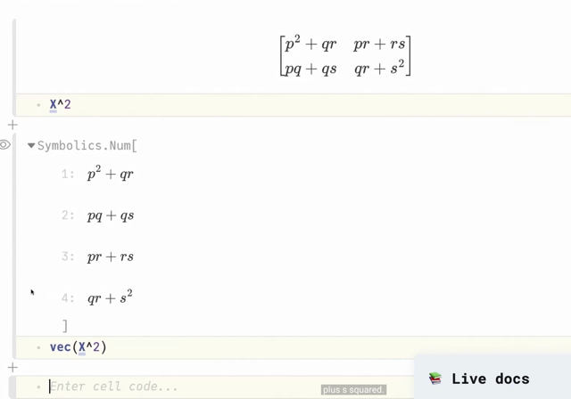</kbd>

> [!NOTE]
> gs nói về hàm **vec()** trong Julia notebook, giúp **flatten một matrix
> thành vector bằng cách xếp các cols của nó chồng lên nhau**
>
> Để rồi ta có thể **nghĩ về function matrix-matrix** (trong case này gs
> lấy matrix 2x2) theo kiểu là function**R^4 vector - R^4 vector**

 

<kbd>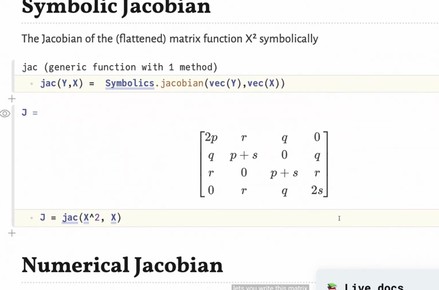</kbd>

> [!NOTE]
> Có thể hiểu trong đây gs define generic function **fac(Y,X)** là
> **Symbolic**.**jacobian(vec(Y), vec(X))** để rồi ở dưới gọi **J =
> jac(X^2, X)**
>
> Chính là **define một function** để
>
> i) Chuyển **hai input matrix** thành **vector** nhờ **vec()** sau đó
>
> ii) Nhờ **Symbolics.jacobian** của Julia **tính jacobian** của hai vector
> này.
>
> Thế thì đại khái thầy Alan nói rằng**khi ta gọi function jac()** như ở đây
> **để Julia tính Jacobian matrix** thì nó chỉ việc tính derivative của từng
> component của output vector đối với 4 component của input, và xếp
> thành một hàng.
>
> Có nghĩa là mỗi hàng của Jacobian matrix chỉ đơn giản là derivative của
> phần tử tương ứng của vector(Y) (chuyển matrix 2x2 Y thành vector
> R^4 nhờ hàm vec () như mới nói) đối với vector X (vec(X))

 

<kbd>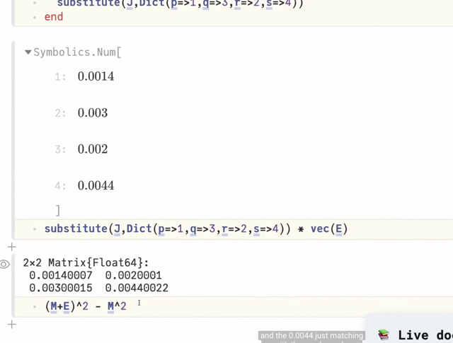</kbd>

<kbd></kbd>

<kbd>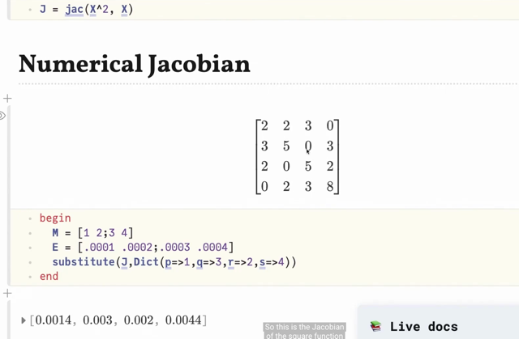</kbd>

> [!NOTE]
> Đoạn này đại khái là gs define một matrix M 2x2 có giá trị (thay vì symbolic p q r s
> như vừa rồi), để rồi dùng các giá trị đó để **substitute vào Jacobian J**ở dạng công
> thức / symbolic vừa nãy đã tính.
>
> Rồi chi nữa, gs cho một matrix**2x2 các perturbation E và dùng vec()** để flatten.
> Mục đích là nhân J (đã có giá trị numeric) với vec(E)
>
> Thì đây tạm gọi nó là tính df (f = X^2) = J dX (vec(E) chính là dX)
>
> cho thấy df là vector như vậy
>
> Và gs tính df = (M+E)^2 - M^2 (đương nhiên đây chính là f(X+dX) - f(X) để ra kết quả
> cho thấy nó giống với cách tính với J *vec(E). Chỉ vậy thôi

 

<kbd>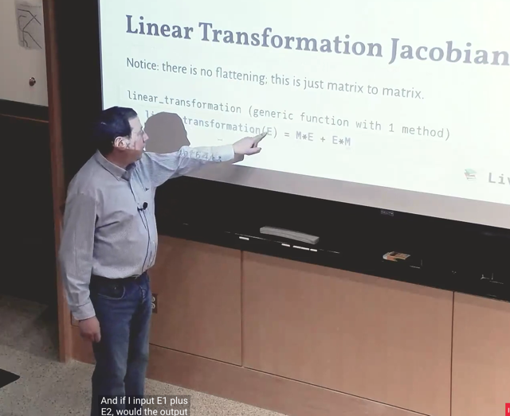</kbd>

> [!NOTE]
> đoạn này gs cho biết về việc ME là một **Linear Transformation** (Như bên
> 1806, đã học nhân vector x với matrix A: Ax là một linear transformation).
>
> Bởi **M(E + F)** =  **ME + MF** và **M(scalar*E**)  =**scalar*ME**

 

<kbd>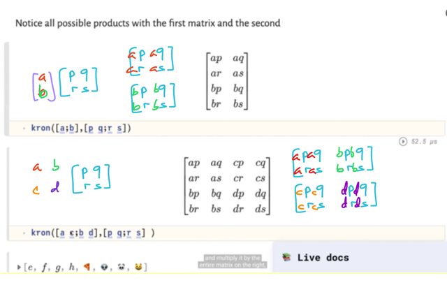</kbd>

> [!NOTE]
> đoạn này gs chỉ giải thích về **Krocneker product**. Cũng dễ hiểu

 

<kbd>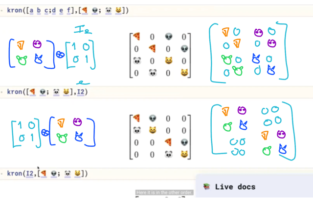</kbd>

> [!NOTE]
> [a b] nhân Krocknecker với
> A thì sẽ là [aA, bA]

 

<kbd>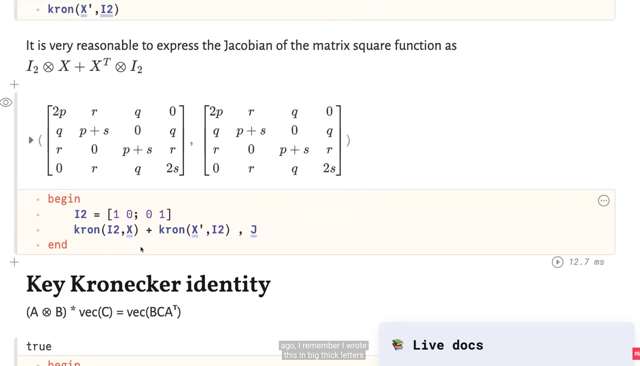</kbd>

> [!NOTE]
> ok chỗ này ta sẽ hiểu như vầy
>
> Đầu tiên, phải nhớ rằng ta đang **muốn tính derivative của X^2** with 
> respect to X, và đây là**matrix -> matrix function**.
>
> Thế thì, đại khái là ta sẽ **chuyển về dạng vector - vector** để tìm 
> Jacobian matrix. Lí do theo tìm hiểu thì đại khái là làm vậy dễ hơn,
> đơn giản hóa được vấn đề so với giữ nguyên matrix-matrix
>
>
> Vậy thì đầu tiên cứ dùng **multiplication** **rule** **d(fg) = f.dg + df.g**
> => **d(X.X) = X.dX + dX.X**
>
> Tiếp vectorize hai vế (hai vế đương nhiên đang ở dạng matrix:
>
> **vec[d(X^2)] = vec(X.dX + dX.X)**
>
> tới đây cái mục đích của mình đó là làm sao cho ra dạng:
>
> **vec(df) = J.vec(dX),** 
>
> cũng như khi function f: vector-vector, ta muốn df = Jdx vậy, vì
> ở đây dX là matrix nên vectorize nó với vec() để có vector.
>
> Vậy thì làm sao để chuyển vec[d(X^2)] = vec(X.dX + dX.X) về
> dạng df = J vec(dX)
>
> Thì ta sẽ dùng cái công thức **Kronecker** product gs Alan nói ở next slide: 
>
> **(A**⊗**B).vec(C) = vec[BC(AT)]** với ⊗ là **Kronecker product**.
>
> Sở dĩ làm vậy vì trong công thức trên ta thấy **vế phải có dạng (A**⊗**B).vec(C)**
> có dạng (matrix . vector), thì ta**có thể dùng nó để có J . vec(dX)** 
>
> (ý là (A ⊗ B) sẽ ứng với J, và vec(X) ứng với vec(dX)
>
> vec(X.dX + dX.X) = vec(X.dX) + vec(dX.X)
>
> i) vec(X.dX) =**vec(X.dX.I) = (I**⊗**X) vec(dX)**
>
> ii) vec(dX.X) =**vec(I.dX.X)** = **(XT**⊗**I) vec(dX)**
>
> => vec(XdX+dXX) = **(I**⊗**X) vec(dX) + (XT**⊗**I) vec(dX)**
>
> => **d vec(dX^2) = (I**⊗**X + XT**⊗**I) vec(dX)**Từ đó Jacobian của f(X) = X^2 là **(I**⊗**X + XT**⊗**I)**

> [!NOTE]
> Jacobian của f(X) = X^2
> là (I ⊗ X + XT ⊗ I)

 

<kbd>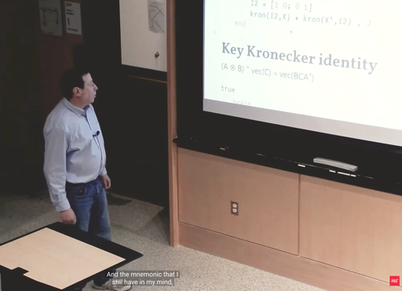</kbd>

> [!NOTE]
> gs cho rằng nên đơn thuần là ghi nhớ công thức
> này: **(A**⊗**B)vec(C) = vec(BCAT)**

 

<kbd>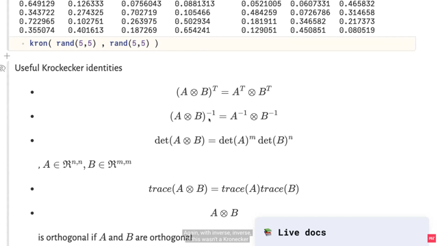</kbd>

> [!NOTE]
> một số công thức hữu ích liên
> quan đến Kronecker product:
>
> (A ⊗ B)T = AT ⊗ BT
>
> (A ⊗ B)inv = Ainv ⊗ Binv
>
> det(A ⊗ B) = det(A)^m det(B)^n
>
> trace (A ⊗ B) = trace(A) trace(B)

 

<kbd>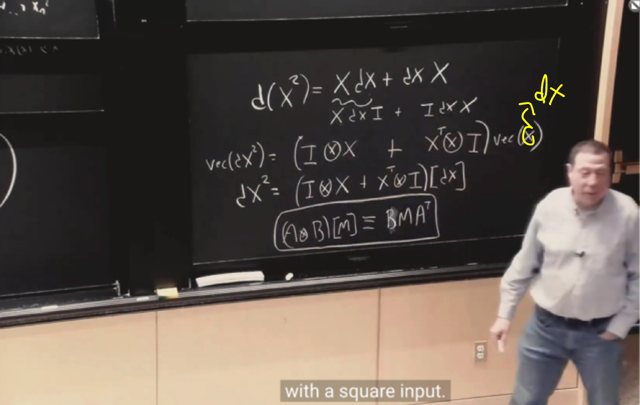</kbd>

> [!NOTE]
> tiếp theo ở đây chính là gs Alan lặp lại lập luận vừa rồi.
>
> và ông cho rằng **tôi thích thể hiện ở dạng linear operator** như gs Steve
> bữa trước là **dX^2** là **linear operator [I**⊗**X + XT**⊗**I]** **act on dX**

 

<kbd>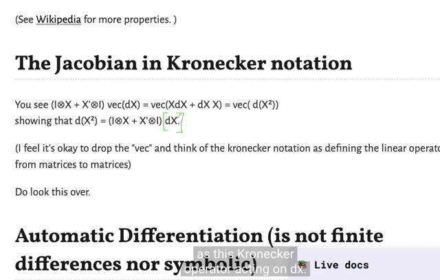</kbd>

> [!NOTE]
> đại khái là gs cho rằng **có thể bỏ notation "vec" đi** **và không
> ghi dấu []**:
>
> **d(X^2) = (I**⊗**X + XT**⊗**I) dX**
>
> mang ý nghĩa là **linear operator,** act on dX (và tự hiểu dX là
> vector) trong đó (I ⊗ X + XT ⊗ I) đóng vai trò là linear operator

 

<kbd>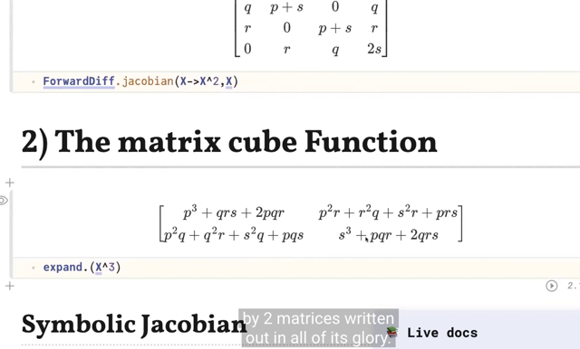</kbd>

> [!NOTE]
> Tiếp ta sẽ thảo luận về **df của f = X^3**. Trong hình là **X^3** (X là [a b; c d])

 

<kbd>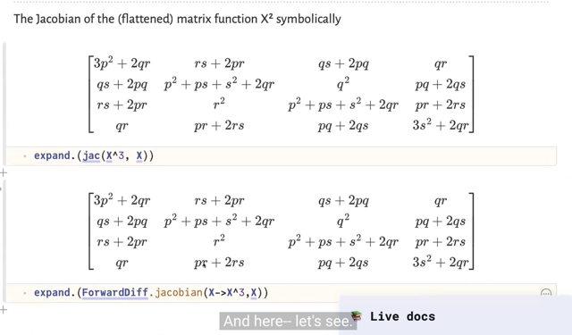</kbd>

> [!NOTE]
> Và đây là máy tính tính ra
> Jacobian của f(X^3)

 

<kbd>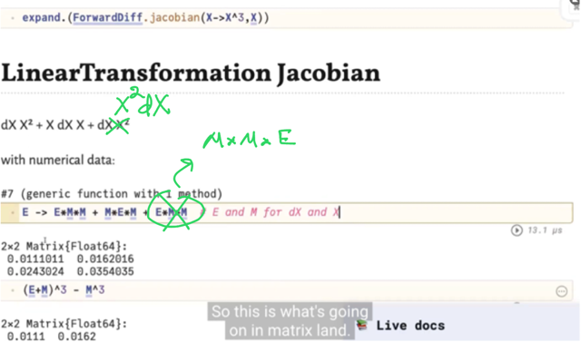</kbd>

> [!NOTE]
> đại khái là ta cũng dùng product rule, để có 
>
> **dX^3 = dXX^2 + XdXX + dXX^2.**
> Và gs nhắc lại rằng ta **không thể gom thành 3X^2dX** được vì đây là
> **matrix**, **không có tính commutative (giao hoán)**
>
> Rồi gs nói cái dòng**E -> E*M*M**...là cách để **define trong Julia**. với **E là ý
> nói dX, M là X**.
>
> Ông hỏi là **tại sao đây vẫn là linear operation** dù rõ ràng ta thấy có **X^2**
>
> Đó là bởi **dù có X^2**, thì đây vẫn **chỉ là linear function của dX**.
>
> Và chính vì vậy mà **derivative luôn là linear operation**, có nghĩa là ví dụ
> tính derivative của **f = x^100**, thì dù **f' là 100x^99** thì nó**vẫn là linear
> function với dx**: **df** = 100x^99**dx vẫn chỉ như a.dx là linear function.
>
> Nói chung là gs nhắc cho ta nhớ phải hiểu khi nói derivative là linear
> operation là đang nói đến variable là dx
>
> Mà nguyên nhân là TA ĐÃ BỎ ĐI các higher order của dX RỒI.**

> [!NOTE]
> Thử làm lại tương tự lúc nãy:
>
> dX^3 = dXX^2 + XdXX + X^2dX
>
> <=> vec(dX^3) = vec(dXX^2 + XdXX + X^2dX)
>
> = vec(dXX^2) + vec(XdXX) + vec(X^2dX)
>
> = vec(I.dX.X^2) + vec(X.dX.X) + vec(X^2.dX.I)
>
> Tới đây ta dùng identity: (A ⊗ B) vec(C) = vec(BCAT)
>
> = [(X^2)T ⊗ I] vec(dx) + (XT ⊗ X) vec(dx) + (I ⊗ X^2) vec(dx)
>
> = [(X^2)T ⊗ I + XT ⊗ X + I ⊗ X^2] vec(dx)**Vậy:
>
> vec(df) = [(X^2)T**⊗**I + XT**⊗**X + I**⊗**X^2] vec(dx)
>
> => J là [(X^2)T**⊗**I + XT**⊗**X + I**⊗**X^2]**

 

<kbd>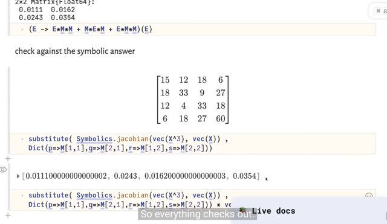</kbd>

> [!NOTE]
> tiếp gs cho xem kết quả mà Julia tính ra

 

<kbd>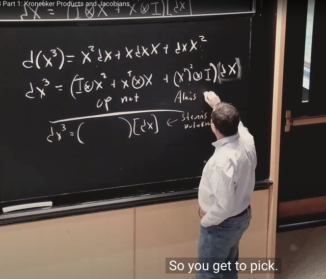</kbd>

> [!NOTE]
> và hoàn toàn tương tự hồi nãy, **dùng Kronecker product**, ta có thể**triển
> khai công thức của dX^3**
>
> Again, ta có thể **thể hiện theo kiểu gs Alan** (ông không dùng [])
> hoặc thầy **Steve** (có [] để nhấn mạnh đây là linear operator act on dX)
>
> Còn cách thể hiện tiêu chuẩn là **vec(dX^3) = (linear operator)[vec(dX)]
> trong đò linear operator là (X^2)T**⊗**I + XT**⊗**X + I**⊗**X^2**

> [!NOTE]
> df của f = X^3

 

<kbd>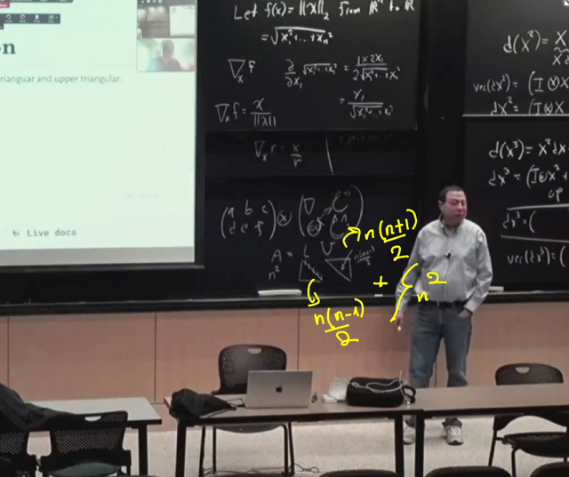</kbd>

> [!NOTE]
> Tiếp ta sẽ tính **df của LU factorization** f(A) = L, U
>
> Đầu tiên đại khái là gs Alan nhắc  lại rằn**g một matrix không phải luôn
> nhưng phần lớn đều có thể được factorize thành một lower triangular
> matrix**L nhân với **một upper triangular matrix U**. Cái này tương tự
> với Gaussian elimination.
>
> matrix A (giả sử shape [n,n]) cần **n^2**con số, thì U chỉ cần **n(n+1)/2**
> và L chỉ cần **n(n-1)/2**
>
> Thế thì gs nói vì**input vào matrix A**, **out ra matrix L, U** nên **LU
> factorization cũng là một matrix-matrix function**.
>
> Và do đó cũng có Jacobinan

> [!NOTE]
> df của LU factorization.

 

<kbd>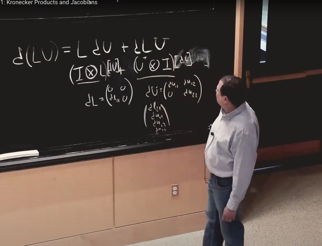</kbd>

> [!NOTE]
> dùng **Kronecker** product ta cẽ có thế này. 
>
> Again, theo gs ta có thể thể hiện ở dạng 
>
> **d(LU) = (L.dU) + (dL.U)** 
>
> = L.dU.I + I.dL.U
>
> = **(I**⊗**L)[dU]**+ **(UT**⊗**I)[dL]**

 

<kbd>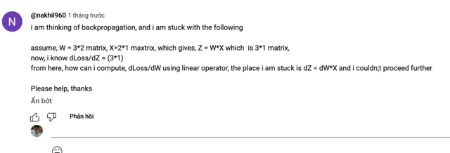</kbd>

> [!NOTE]
> Một thằng nó hỏi câu này. Có Z = WX, có dL/dZ rồi. Và nó muốn tìm  dL/dW. Đây là vấn
> đề công thức trong backpropagation, rất hữu ích
>
> Hồi xưa khi làm cs231n chẳng hạn, mình chỉ dùng mà chưa thật hiểu.
>
> Thế thì đầu tiên ta muốn tìm derivative của L đối với W. Thì mục tiêu sẽ làm làm sao
> cho ra dL = (something) dW thì cái something đó chính là derivative.
>
> Thế thì ta đã có dL/dZ, tức là gradient vector của L đối với Z. Do đó như đã biết
> derivative sẽ là gradient transpose để phép toán phù hợp về kích thức: dL = (dL/dZ)TdZ
>
> Thế thì ta sẽ muốn tìm derivative của Z đối với W: dZ = (something) dW
>
> Z = WX. Khi muốn tìm partial derivative của Z wrt W, ta xem X fixed. dZ = Z(W+dW,X) -
> Z(W,W) = (W+dW)X - WX = dW X
>
> Hoặc có thể dùng product rule: dZ = dW X + W dX, mà đang tính partial derivative của Z
> wrt W thì X coi như fixed, nên dX = 0  => dZ = dW X
>
> Thế thì tới đây ta có dZ = dW X, dZ là vector, dW là matrix. Nên derivative là Jacobian.
> Áp dụng cách làm của MIT 18s096 ta vector hóa:
>
> vec(dZ) = vec (dW X)
>
> viết vế phải thành vec(I dW X) để dùng Identity: (A ⊗ B) vec(C) = vec(BCAT) (thật ra nó
> có Identity khác là (A ⊗ I) vec(B) = vec(BAT) nhưng nhớ công thức trên cho tổng quát)
>
> Vậy ta có **vec(dZ)** = vec(dW X) = vec(I dW X) = **(XT**⊗**I) vec(dW)
>
> vec(dZ) = (XT**⊗**I) vec(dW)**Tới đây, quay lại ta đang có dL = (dL/dZ)T dZ thì bản chất dL/dZ và dZ đã đang là
> vector nên có quyền ghi dL/dZ = vec(dL/dZ), dZ = vec(dZ) Từ đó:
>
> dL = vec(dL/dZ)T . vec(dZ) (*)
>
> Và nhờ vậy ta có thể thay vec(dZ) = (XT ⊗ I) vec(dW) vào:
>
> dL = **vec(dL/dZ)T (XT**⊗**I)** vec(dW)
>
> Và tới đây vì **dL phải bằng vec(dL/dW)T vec(dW)** (y như dL = vec(dL/dZ)T vec(dZ)
>
> cho nên cái phần in đậm chính là **vec(dL/dW)T**:
>
> **vec(dL/dW)T = vec(dL/dZ)T (XT**⊗**I)**<=> vec(dL/dW) = [vec(dL/dZ)T (XT ⊗ I)]T
>
> <=> **vec(dL/dW) = (XT**⊗**I)T vec(dL/dZ)**Dùng identity: (A ⊗ B)T = AT ⊗ BT ****<=> **vec(dL/dW) = (X**⊗**I) vec(dL/dZ)**Tới đây áp dụng (A ⊗ B) vec(C) = vec(BCAT)
>
> => **(X**⊗**I) vec(dL/dZ)** = vec(I dL/dZ XT) = **vec(dL/dZ XT)
>
> Vậy vec(dL/dW) = vec(dL/dZ XT)**Từ đó ta có **dL/dW = dL/dZ XT
>
> Đây là công thức mà hồi làm cs231n hay Deep Learning Specialization mình chỉ làm
> theo quy tắc của Andrew Ng là "xoay sở sao cho ra đúng shape"**

> [!NOTE]
> Chỗ này có một ĐIỂM CỰC QUAN TRỌNG MÀ ĐẾN GIỜ MỚI HIỂU.
>
> KHI GHI dL/dW = dL/dZ . dZ/dW thì cái dấu chấm ở giữa là **INNER
> PRODUCT
>
> và INNER PRODUCT GIỮA HAI MATRIX A, B: A.B = tr(AB)**và do đó, ví dụ nói df = (df/dw) . dw, thì với w là vector, thì dw cũng là
> vector, khi đó df/dw, chính là gradient ∇f sẽ là vector, và df/dw . dw là dot
> product của hai vector. Và ta sẽ ghi là (df/dw)Tdw
>
> Khi nều df = df/dW . dW, với W là matrix, thì df/dW cũng là matrix, để rồi
> dấu chấm thật ra là inner product. và inner product giữa matrix df/dW và
> dW là tr(df/dW dW)

 

<kbd>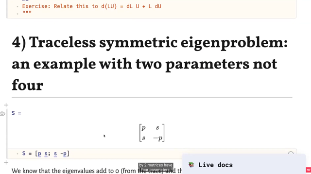</kbd>

 

