# Lec 3 Part 2 Finite-difference Approximations

📊 **Progress:** `24` Notes | `24` Screenshots

---

<kbd>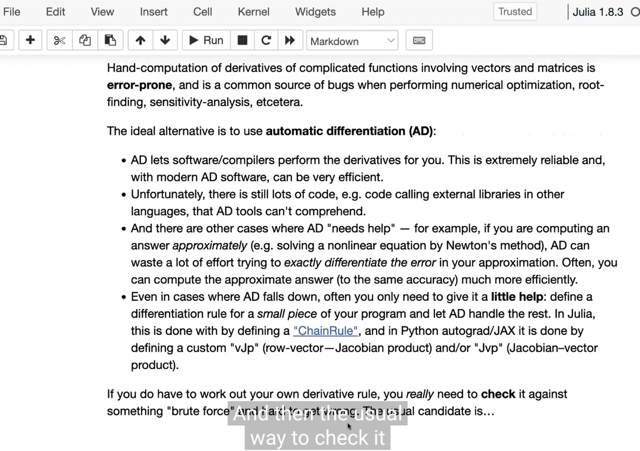</kbd>

> [!NOTE]
> mở đầu đại khái là gs nói về **đôi khi** ta vẫn phải tính tay
> **(hand-computation) derivative** của một function phức tạp. Lí do là
> đôi khi**Automatic Differentiation** **không giúp được hết** trong
> những trường hợp list ra ở đây.
>
> Vậy thì khi đó ta **cần phải có cách check** xem việc tính bằng tay có
> đúng không.

 

<kbd>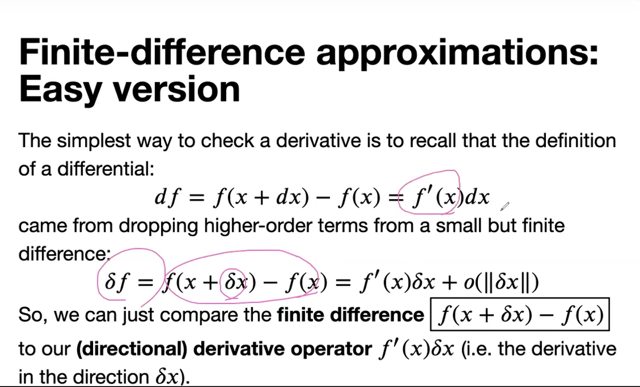</kbd>

> [!NOTE]
> rồi chỗ này là nơi ta ôn lại những gì học bữa trước: ta đã biết
> rằng định nghĩa của derivative được xây dựng từ lập luận: khi
> **variable x thay đổi một khoảng nhỏ** (**finite**, nhưng không
> phải vô cùng nhỏ infinitesimal small) kí hiệu Δx, thì function f(x)
> sẽ thay đổi một khoảng Δf = f(x + Δx) - f(x)
>
> Thế thì khi Δx **RẤT NHỎ**, thì HÀM F CÓ THỂ ĐƯỢC**ƯỚC
> LƯỢNG XẤP XỈ BỞI MỘT HÀM TUYẾN TÍNH** THEO Δx (linear
> operator đối với Δx) cộng với một **BIỂU THỨC BẬC CAO** của
> Δx có tính chất là khi Δx nhỏ thì cái này nhỏ về 0 rất nhanh
>
> **f(x+Δx) - f(x) = f'(x)[Δx] + o(||Δx||)**
>
> ⇔ Δf = f(x + Δx) - f(x) = f'(x)[Δx] + o(||Δx||)
>
> trong đó:
>
> f'(x)[Δx] là **LINEAR OPERATOR ACT ON Δx**
>
> **o(||delta_x||)** là chỉ những **term bậc cao của Δx** có giá trị có
> tính chất **khi Δx giảm về 0** thì chúng **giảm về 0 rất nhanh**,
> nhanh hơn của Δx
>
> Vì vậy, người ta thay Δx bằng dx để chỉ một **khoảng vô cùng
> nhỏ** thì khi đó cho phép **bỏ o||Δx|| đi**:
>
> **df = f'(x)[dx]**

 

<kbd>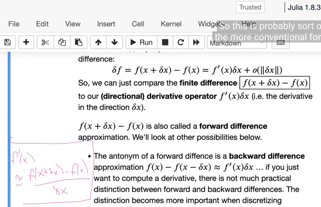</kbd>

> [!NOTE]
> Và khi delta_x là scalar, ta có thể chia f(x+Δx) - f(x) cho Δx để cách
> thể hiện:
>
> Δf = [f(x+Δx) - f(x)] / Δx ~= f'(x)
>
> Chú ý đây là dấu xấp xỉ vì đang vẫn là Δx, chưa phải dx thì đáng lẽ
> phải có thêm o(||Δx||) nữa.
>
> Ý nghĩa của cách thể hiện này đó là: Khi x là scalar, thì **derivative
> của f (f'(x))** (như đã biết, là một linear operator) có thể **được xấp xỉ
> bằng việc  operator sau**:
>
> [Scale - tức là **nhân với Δx bởi scalar** / tỉ lệ: f(x+Δx) - f(x)] / Δx]

 

<kbd>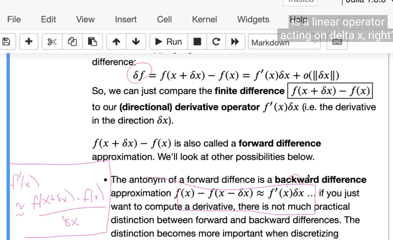</kbd>

> [!NOTE]
> Nhưng thể hiện như vậy chỉ đúng khi scalar Δx
>
> còn f(x+Δx) - f(x) ≈ f'(x)[Δx] luôn đúng dù Δx có là vector
>
> và như đã nói, nó mang ý nghĩa là linear operator f'(x) act on Δx
>
> ====
>
> Và ta có thể dễ dàng tính f(x + Δx) - f(x) và dùng nó để **check 
> f'(x)** mà ta tính bằng tay.
>
> Ta có thể dùng f(x + Δx) - f(x) để check và cái này gọi là **forward
> differentiation**hoặc dùng f(x) - f(x - Δx) cũng được, gọi là **backward
> differentiation**
> Và gs nhấn mạnh hai cái này **không liên quan** gì đến **forward mode** và
> **backward mode** trong automatic differentiation bữa trước

 

<kbd>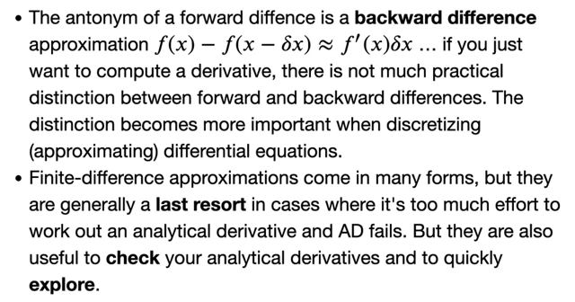</kbd>

> [!NOTE]
> nói chung là có nhiều dạng, như trong cs231n hoặc DLSpec có
> nói có thể tính bằng f(x + Δx) - f(x - Δx) / 2Δx

 

<kbd>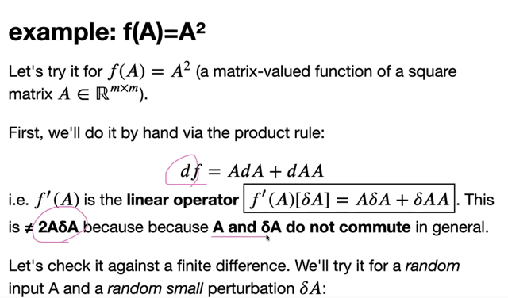</kbd>

> [!NOTE]
> Ví dụ ta tính tay derivative của f(A) = A^2. Và cần **check lại với finite
> differentiation**
>
> Trước hết gs nhắc lại, ta có thể dùng **product rule** để có:
>
> df = AdA + dAA và như đã nói bữa trước, cái này không bằng **2AdA** vì
> **A và dA không commute**: AdA khác dA.A
>
> Và bài trước ta đã biết cách dùng **Kronecker** product để thể hiện
> vec(df) = J vec(dA) = ...
>
> Ôn nhanh: từ công thức (A x B)vecC = vec(BCAT)
>
> vec(AdA) = vec(A.dA.IT) = (I x A)vec(dA)
>
> vec(dA.A) = vec(I.dA.ATT) = (AT x I)vec(dA)
>
> => vec(df) = vec(AdA) + vec(dA.A) = (I x A)vec(dA) + (AT x I)vec(dA)
>
> vec (df) = (I x A + AT x I)vec(dA)
>
> => derivative of f = A^2 là Jacobian matrix: (I x A + AT x I)
>
> (đương nhiên ta hiểu là linear operator act on vec(dA), và ở đây linear
> operator đó chính là**phép nhân Jacobian matrix với vec(dA)** sẽ cho
> ra vec (df))
>
> ====
>
> Thế thì, quay lại đây, giả sử ta có df tính theo cách trên rồi, Ta cần
> kiểm  tra bằng finite differentiation (hay numerical gradient).

 

<kbd>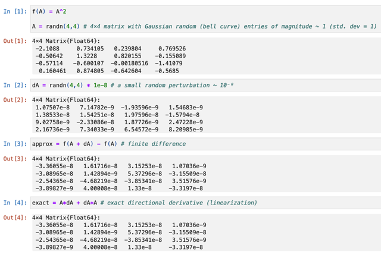</kbd>

> [!NOTE]
> Thì ta có thể tính delta_f = Adelta_A + delta_A.A với A random và
> delta_A là một random small perturbation của A
>
> Kết quả cho thấy tính bởi AdA + dA.A (dA ở đây ý là delta A) và
> f(A+dA) - f(A) cho ra giống nhau
>
> Và 2AdA thì không confirm rằng A, dA không commute nên gom lại
> là sai

 

<kbd>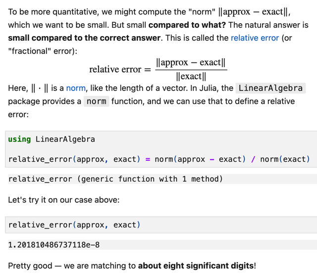</kbd>

> [!NOTE]
> tiếp theo đại khái là khi ta muốn nói về một giá trị nhỏ hay lớn ta
> phải so nó với cái gì. Nên ở đây gs nói về việc ta sẽ dùng relative
> error để đánh giá sai khác giữa gradient approximation và exact
> value.
>
> Thì ta sẽ tính tỉ lệ giữa norm of difference và norm của exact value
> trong Julia ta có thể dùng package LinearAlgebra để tính norm.
>
> Kết quả trong ví dụ này cho thấy relative error e-8
>
> Nhớ lại khi làm assignment của cs231n về gradient checking ta cũng
> đã thấy vụ tính relative error này và nó cũng được dùng thường xuyên
> trong các unit test

 

<kbd>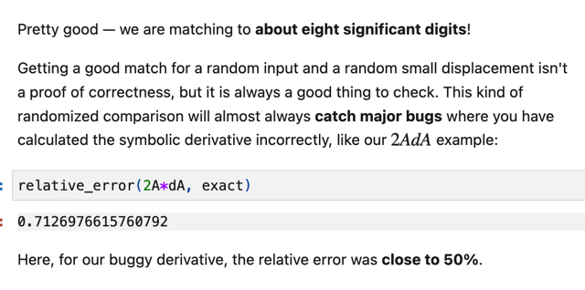</kbd>

> [!NOTE]
> trong khi đó nếu tính derivative bằng 2AdA sẽ cho relative error rất
> cao.
>
> Phải nhấn mạnh là điều này không đảm bảo là ta tính đúng nhưng
> nó vẫn là phép thử hữu ích giúp phát hiện sai sót

 

<kbd>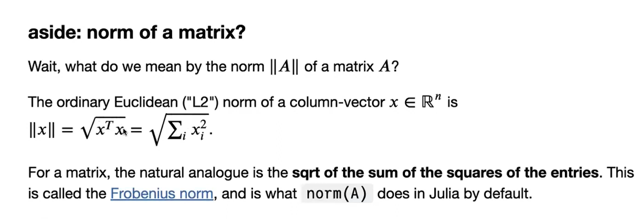</kbd>

> [!NOTE]
> đại khái khúc này gs nói rằng, ta đã biết kí hiệu ||x|| là length của
> vector (cụ thể hơn nó chính là L2 length - Euclidean length) hoặc
> norm, được tính bằng sqrt của tổng bình phương các components
> của vector. Cái này đã học ngay ở bài 1 của 18.02
>
> Thế thì, với matrix, người ta cũng muốn có một thứ để chỉ length của
> matrix. Và thế là ta có Frobenius norm: sqrt của tổng bình phương
> các component của matrix entries

 

<kbd>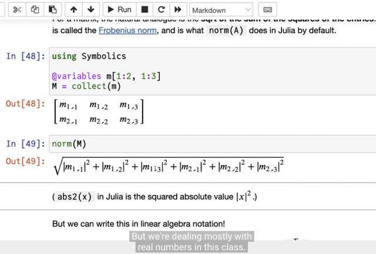</kbd>

> [!NOTE]
> trong Julia norm(M) sẽ tính theo công thức như vầy. Ta có dấu
> abs là để lấy phần thực của complex number

 

<kbd>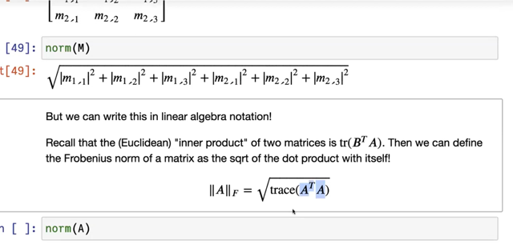</kbd>

> [!NOTE]
> và Frobenius norm cũng có thể được tính bởi sqrt
> của Trace của matrix ATA

 

<kbd>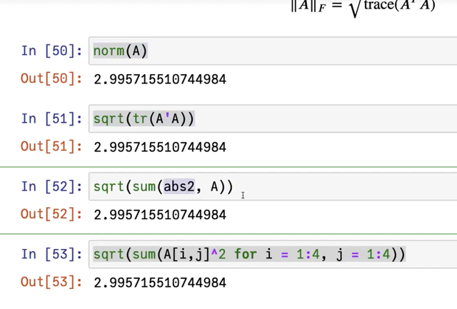</kbd>

> [!NOTE]
> thử tính bằng nhiều cách trong Julia

 

<kbd>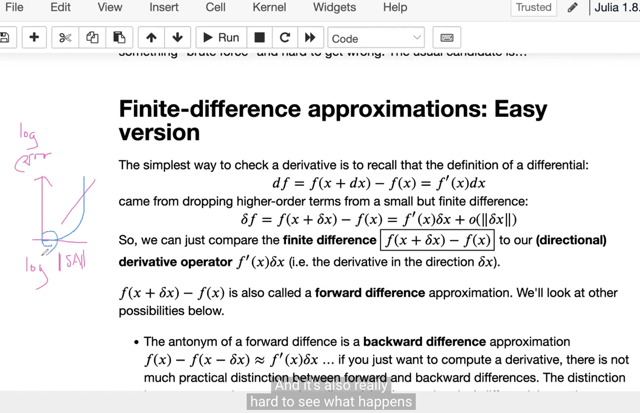</kbd>

> [!NOTE]
> tiếp theo đại khái là gs sẽ **plot giá trị relative error** theo**norm
> của ΔA scaled bởi các gía trị s** khác nhau
>
> trước đó gs nhắc lại lập luận rằng:
>
> Ta có Δf = f(x + Δx) - f(x) = f'(x)Δx + o||Δx||
>
> thì ta đã nói rằng **Δf sẽ** **xấp xỉ f'(x)Δx** khi**Δx nhỏ** để c**ó thể
> bỏ đi các higher order term**
>
> Vậy thì theo logic thì **Δx càng nhỏ thì f'(x)Δx** sẽ càng ≈ Δf chứ.
>
> Hay error, là finite difference (tính bằng f(x + Δx) - f(x)) trừ đi f'(x)dx
> (tính theo công thức ta derive ra là AdA + dAA) sẽ phải càng nhỏ
> mới đúng
>
> Vậy ta sẽ plot ra xem có đúng vậy không.
>
> Và gs cũng nói rằng, ta sẽ plot theo log giúp làm việc với giá trị nhỏ

 

<kbd>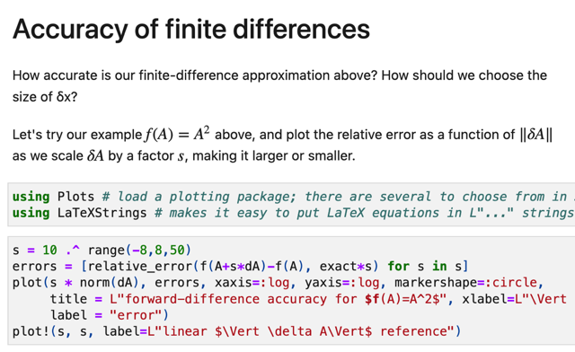</kbd>

 

<kbd>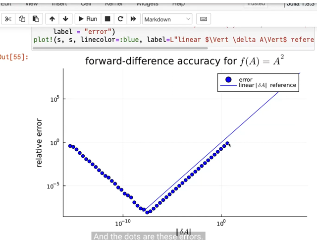</kbd>

🔗 **Related:** [LEC 5 P2: FORWARD AUTOMATIC DIFFERENTIATION VIA DUA NUMBERS](untitled.md#node-157)

> [!NOTE]
> kết quả cho thấy khi Δx (từ 1) nhỏ dần thì **relative error cũng
> nhỏ theo**. Nhưng **sau đó nó lại tăng lên lại**. Chuyện gì đã xảy ra

 

<kbd>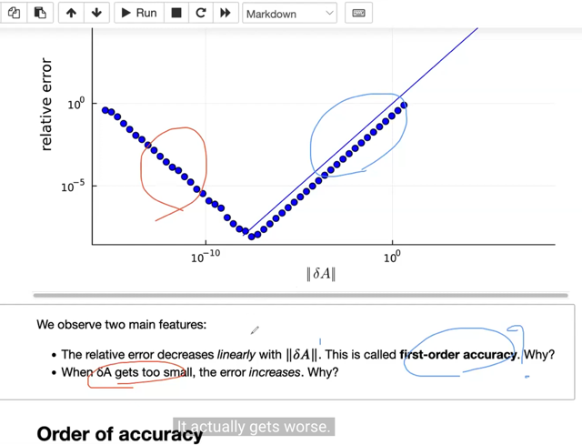</kbd>

> [!NOTE]
> ta sẽ phân tích hai case, đầu tiên **tại sao error giảm
> tuyến tính với Δx**và sao nó lại tăng lên

 

<kbd>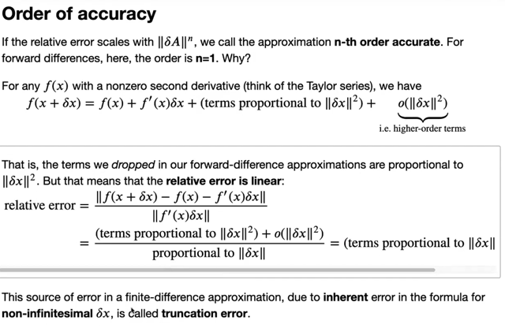</kbd>

> [!NOTE]
> rồi, để giải thích tại sao relative error lại tỉ lệ thuận (tuyến tính) với Δx
>
> Thì ta biết rằng relative error là:
>
> Khác biệt giữa **giá trị gradient tính bởi công thức, analytic gradient**,
> chính là cái **f' (x)[dx]** và **finite difference hay numerical gradient**, chính
> là **f(x + Δx) - f(x)** và **vì tính relative error**, nên **chia cho f'(x)[dx]**
>
> *Với analytic gradient, ví dụ trong trường hợp trên là AdA
> + dA.A,  hay giả sử với hàm f = Ax thì analytic gradient là f'(x)dx = Adx
>
> Thế thì xét  **f(x + Δx) - f(x), thì lúc "hình thành"** công thức, hay định
> nghĩa derivative ta đã bắt đầu từ **Taylor series**:
>
> **f(x + Δx) = f(x) + f'(x)Δx + (1/2) f''(x)(Δx)^2** + [higher order term of Δx] (1)
>
> nhớ lại công thức Taylor expansion: tại x0 = a
>
> f(x) = f(a) + f'(a)(x-a) + f''(a)(x-a)^2/2! + ..
>
> thì ở đây thật ra tương tự, coi x-a = Δx, thì x = a + Δx
>
> => f(x0+Δx) = f(x0) + f'(x0)Δx + f''(x0)(Δx)^2/2! + ...
>
> Nói chung nó chính là từ Taylor series mà ra. Thế thì quay lại đây
>
> ta có f(x+Δx) như trên (1), thì
>
> f(x+Δx) - f(x) - f'(x)Δx = f''(x)(Δx)^2 + [higher order term of Δx]
>
> do đó tử số trong công thức relative error
>
> relative error = [[f(x+Δx) - f(x)] - f'(x)Δx] / f'(x)Δx
>
> = [f''(x)(Δx)^2 + [higher order term of Δx]] / f'(x)Δx
>
> Thì tử số chỉ còn tổng của một **term bậc 2** của Δx và một **term bậc cao hơn 
> 2 của Δ**x
>
> Còn mẫu số **f'(x)Δx**, như đã nói là **term bậc 1 của Δ**x (linear operator act on Δx)
>
> Vậy khi chia xong, **chỉ còn 1 term bậc 1 của Δx** và **term bậc cao của Δx
>
> Term bậc cao của Δx thì như đã nói giảm về 0 rất nhanh, thành ra chỉ
> còn term bậc 1 của Δx, đồng nghĩa relative error sẽ tỉ lệ thuận, tuyến
> tính với Δx là vì vậy**Và gốc rễ của error này là do finite-differentiation, khi ta sử dụng Δx,
> chỉ là giá trị nhỏ, thay vì vô cùng nhỏ, mà ta đã biết, chỉ khi dùng Δx
> trở thành v**ô cùng nhỏ dx** thì **mới cho phép bỏ đi term bậc cao**của Δx.
>
> Do đó nó gọi là **truncation error**

 

<kbd>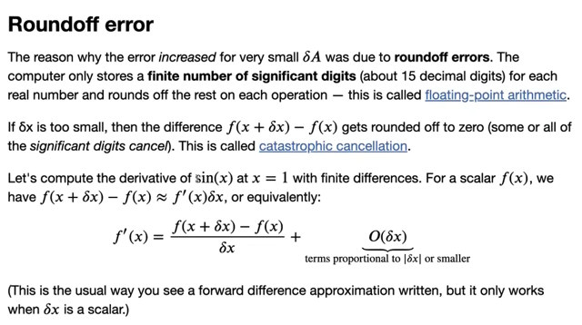</kbd>

> [!NOTE]
> đại khái là nói về vụ thứ hai, **relative error tăng lên** lại khi **Δx
> giảm quá một mức nào đó**. Nguyên nhân nói ngắn gọn là do máy
> tính **chỉ cho một số bit nhất định**cho một con số, ví dụ **4 bytes** hay
> **32 bit**, hoặc **8 bytes tương đương 64 bit**. Và từ đó nó **có giới hạn**
> cho mỗi con số
>
> Để rồi khi con số **vượt quá số bit cần thiết** để lưu trữ chính xác giá
> trị thì máy tính sẽ **làm tròn**. Đương nhiên khi **làm tròn thì nó sẽ làm
> tròn về số gần nhất**. Vậy thì đối với số rất nhỏ như error, **ví dụ 0.
> 00000001** thì đương nhiên giá trị **gần nhất là 0**, nên nó sẽ**làm
> tròn thành 0**, dẫn đến**những con số quan trọng bị mất** gọi là
> **significant digit cancel**, và hiện tượng này gọi là **CATASTROPHIC 
> CANCELLATION**
> Ví dụ dễ thấy ở đây k**hi ta đang quan tâm đến những con số thập
> phân sau số 0**, vì đây **là những con số rất nhỏ**, thì **việc làm tròn
> thành 0 là  mất mát rất lớn.**

> [!NOTE]
> Trong screenshot họ nói đại khái là như mới nói tức thì, rằng máy
> tính chỉ chứa một số lượng hữu hạn (finite number) các SIGNIFICANT
> DIGIT cho mỗi số thực, và số lượng là khoảng 15 decimal digits. Còn
> lại thì làm tròn.
>
> Nói rõ hơn, ví dụ như ta có con số thực này 1.12121212121212...
> thì máy tính sẽ chỉ giữ số 1 và 15 con số 1,2 mà thôi. Cái này gọi là
> floating point arithmetic.
>
> Nguyên nhân thì từ cs50 đã biêt rồi. Đó là như đã nói, máy tính sẽ
> gán 64 bit (8 bytes) cho số thực.
>
> QUAY LẠI SAU

 

<kbd>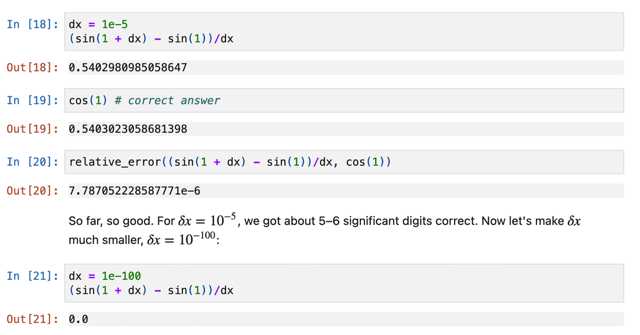</kbd>

> [!NOTE]
> Ta lấy ví dụ function sin(x). Thì numerical gradient, hay ở đây gọi là
> tính gradient theo phương pháp **finite difference**: f(x+Δx) - f(x) 
> = sin(x+Δx) - sin(x)
>
> Và**analytic gradient:** f'(x)Δx = **cos(x)Δx**
>
> Thế thì tính **gradient tại x = 1** và tính **relative error**. Thì đầu tiên người
> ta cho Δx (như đã biết, là small number): **1e-5**
>
> Với Δx là scalar, thì ta có thể chia f(x+Δx) - f(x) và f'(x)Δx
> cho Δx luôn để so sánh giữa 
>
> [f(x+Δx) - f(x)] / Δx và f'(x) = cos(x) 
>
> Kết quả cho ra relative error là **7.7 e-6**

 

<kbd>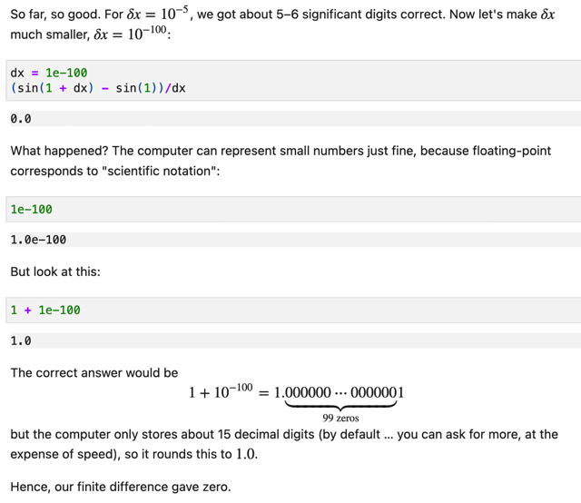</kbd>

> [!NOTE]
> Nhưng khi dùng Δx nhỏ hơn. (nhớ rằng dx trong code ở đây ý
> là Δx chứ k**hông phải chỉ giá trị vô cùng nhỏ dx** trong lí thuyết)
> thì n**umerical gradient lại ta 0** (là sai)
>
> Thế thì gs cho thấy với con số**1e-100**, máy tính **vẫn đủ bit** để thể
> hiện, bằng chứng là **1e-100 nó** **không bị làm tròn thành 0**.
>
> Nhưng khi c**ộng thêm 1**, để thành **1.1e-100** thì lại q**uá số bit** cần
> thiết. **Khiến máy làm tròn thành 1**. Và mất **hết các critical digits**
>
> Và đại khái là ta có thể dùng nhiều bit hơn bằng cách dùng định
> dạng khác nhưng vượt quá số bit thì lỗi sẽ vẫn xảy ra

 

<kbd>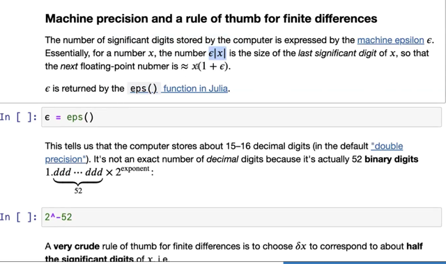</kbd>

> [!NOTE]
> Ta sẽ phân tích từng ý:
>
> Đầu tiên khái niệm **epsilon** - **significant digit** người ta nói rằng nó là  **GIÁ TRỊ** **NHỎ NHẤT 
> còn khiến 1 + eps > 1**. Điều này là sao?
>
> Có nghĩa là **nếu cộng 1 với một số nhỏ hơn eps**, thì kết quả sẽ **KHÔNG LỚN HƠN 1**, tức
> là **VẪN BẰNG 1**.
>
> Do đó nó giống như **khoảng cách tối thiểu** giữa hai số kề nhau, **KHÔNG THỂ CÓ SỐ Ở GIỮA**
> được, vì **như đã nói 1 + [số nhỏ hơn eps] thì coi như 1**, nên trên dãy số chỉ có thể có ...
> x1 = 1, x2 = 1 + eps, x3 = x2 + eps...
>
> Thế thì lấy **ví dụ** máy tính chỉ có thể chứa một số sao cho **tổng số digit cho phần nguyên và
> phần thập phân là 4** (vì nó chỉ có vài bit để chứa thông tin). Hình dung giống như ta CHỈ CÓ
> **4 CÁI BOX** để chứa 4 số (và 1 cái vách ngăn để phân biệt phần nguyên và phần thập phân)
>
> Thế thì dễ thấy ta có thể **"có"** số **1.000**, nhưng**không thể "có"** \/1.0001\/, hay \/1.0009\/ (vì cần 5 box)
> Do đó, **số gần nhất tiếp theo mà lớn hơn 1.000** **CHỈ CÓ THỂ** **1.001.**Và tương tự, số tiếp
> theo có thể biểu diễn được bởi máy tính chỉ có thể là **1.002**
>
> Do đó khoảng cách gần nhất **giữa hai số 1.xxx (ví dụ 1.000 và 1.001)** là **0.001**
>
> **1.000**    | 1 
> \/1.0001 ... 
> 1.0009\/\~ 
> \~**1.001**    | 1 + eps 
>
> \/1.0011 ... 
> 1.0019\/ 
> **1.002**    | 1 + 2*eps
>
> Thế thì trong trường hợp này, 0.001 hay 10e-3 **CHÍNH LÀ VÍ DỤ CỦA** **EPS** - Là **giá trị
> nhỏ nhất còn giúp phân biệt hai số liền kề** - hay định nghĩa chính xác hơn là **số nhỏ nhất
> mà khi cộng với x cho ra số lớn hơn x**, thay vì bị làm tròn về x - và đó chính là định nghĩa
> của khái niệm **SIGNIFICANT DIGIT**
>
> Tiếp, giả sử ta **tăng phần nguyên lên 10 lần**, thì dễ thấy với 4 box, lúc này ta **tốn 2 box để
> chứa phần nguyên**, chỉ còn 2 box để chứa phần thập phân. Do đó, các con số có thể biểu
> diễn chỉ là **10.00**, **10.01**, **10.02** ....chứ **không thể biểu diễn \/10.001**\/
>
> **10.00**10.001****... 
> 10.009 
> **10.01**| 10 + eps*10****10.011 ... 
> 10.019**10.002**    | 10 + 2*eps*10 ****Do đó, dễ hiểu k**hoảng cách gần nhất giữa hai số 10.xx  lúc này chỉ là 0.01** chứ **không
> còn là 0.001 nữa**.
>
> Và dẫn đến giá trị nhỏ nhất còn khiến phân biệt được hai số 10.xx là 0.01, tức 10e-2. Tức
> là **LÚC NÀY** **significant digit là 10*eps (eps đã nói ở trên là 0.001, hay 10e-3)**
>
> Và khái quát lên, nó chính là **eps*||x||** 
>
> Để khi: 
>
> **x =** **1**.xxx thì significant digit là 1*eps (=**0.001**, **10e-3**),
>
> **x = 10.xx** thì significant digit là 10*eps (=**0.01, 10e-2**),
> **x = 100.x** thì significant digits là 100*eps (=**0.1, 10e-1**)
>
> Do đó ở đây gs ta mới nói "\/for a number x, the number eps|x| is the size of the last
> significant digit of x\/" ý là vậy,
>
> Để rồi từ x thì số "tiếp theo" (the **next floating-point number** là) x + x*eps = x*(1+eps)

 

<kbd>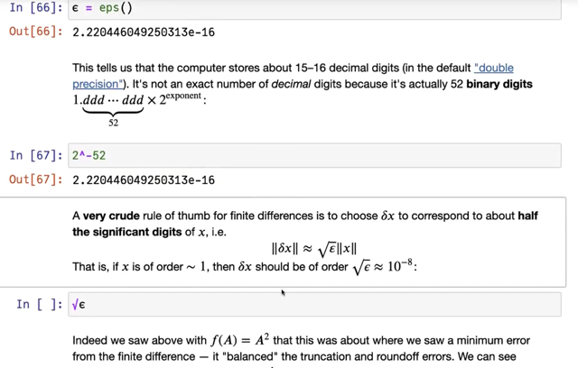</kbd>

> [!NOTE]
> Rồi, như vậy như ví dụ vừa rồi, nếu mình **MUỐN CỘNG THÊM Δx**
> vào x (ví dụ = 10.01), thì **NẾU Δx MÀ NHỎ QUÁ** ví dụ **0.001**, thì như
> đã nói 10.01 + 0.001 = \/10.01**1**\/ sẽ**KHÔNG ĐỦ CHỖ ĐỂ CHỨA**, nên
> nó **sẽ vẫn là 10.01**, **gây ra lỗi**
>
> Do đó**khi x đang là 10.xx** phải dùng **Δx từ 0.01 TRỞ LÊN**, ví
> dụ dùng 0.01 thì x + Δx = 10.01 + 0.01 = 10.02 thì 10.02 ok, ko bị
> sao.
>
> Còn khi x đang là 1.xxx thì phải dùng Δx từ 0.001 trở lên
>
> Vậy thì ở đây eps là 0.001, thì khi x đang có "dạng" 1.xxx (gọi là order  ~
> 1) ta nên dùng Δx cỡ 0.001, còn nếu x có dạng" 10.xx thì nên dùng
> Δx cỡ 0.01 như vừa nói.
>
> Vậy thì mình hiểu đại khái 0.01, hay 0,001 là **eps*||x||** ý là **significant digit
> của x** khi x order 1 (1.xxx) hay order 10 (10.xx)
>
>
> **Thì Δx nên lấy lớn hơn con số** này và **rule of thumb** của họ là dùng
> **x10**. Tức là **nếu eps là 0.001** tức 10e-4 thì **Δx nên dùng
> order GẤP 10 lần. (**tức là cỡ 0.01 khi x = 1.xxx, và 0.1 khi x = 10.xx)
>
> Và vì trong máy tính eps thựa ra là biểu diễn bởi base 2, nên việc gấp 10
> lần trên thực ra chính là dùng bình phương, bởi vậy mới nói là
> **sqrt(epsilon)*||x||**

 

<kbd>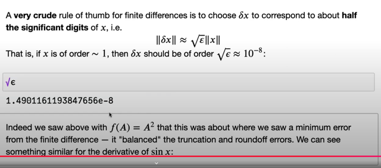</kbd>

> [!NOTE]
> Kết quả là nếu eps ~10e^-16 thì Δx cỡ ~10^e^-8

 

