# Lec 4 Part 1: Gradient And Inner Products In Other Vector Spaces

📊 **Progress:** `16` Notes | `16` Screenshots

---

<a id="node-114"></a>
## Từ Đầu Đến Phút 11:32 Là Tiếp Nối Bài

> [!NOTE]
> TỪ ĐẦU ĐẾN PHÚT 11:32 LÀ TIẾP NỐI BÀI
> TRƯỚC, VÀ CŨNG RẤT HAY
>
> NHƯNG TẠM THỜI SKIP CHƯA XEM  VÌ TA
> MUỐN HỌC VỀ DERIVATIVE CỦA INNER
> PRODUCT, NORM ....

<br>

<a id="node-115"></a>

<p align="center"><kbd>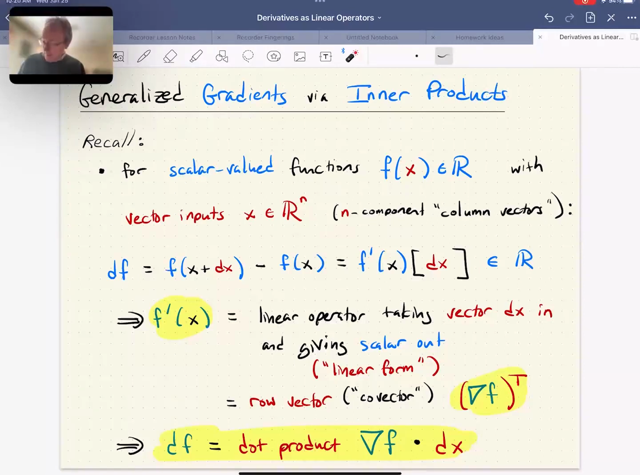</kbd></p>

> [!NOTE]
> Đại khái thầy nói bài này ta sẽ **khái quát hơn Gradient.**
>
> Ôn lại một chút về **gradient**, ở MIT 18.02 thì ta đã biết đó là khi 
> ta có **vector `-` scalar function**, thì gradient sẽ là (**column) vector**
> chứa các**partial derivative ∂f/∂xi**
>
> Và trong class này, những bài trước ta cũng đã**tiếp cận gradient**
> một cách "**holistically**" hơn đó là: khi ta có **df `=` `f(x+dx)` `-` f(x) `=` f'(x)[dx]**
> Thì với **x là vector thì dx cũng là column vector**. Nhưng **f là scalar**
> function nên**df cũng vậy**. Từ đó ta sẽ thấy rằng**cách duy nhất để
> từ một column vector cho ra scalar (thông qua linear operator)** 
> đó là ta sẽ**dot product với một vector.**
>
> Nói cách khác, f'(x)[dx], được hiểu là **linear operator act on (vector) dx**
> mà m**uốn cho ra scalar**, thì **linear operator này chỉ có thể là phép dot
> product với một vector nào đó**. Và đó chính là **gradient vector ∇f(x)**
>
> Như vậy khi ta đã triển khai ra df `=` f'(x) dx thì**f'(x) chính là một row
> vector**, và **∇f(x) là f'(x)T**

<br>

<a id="node-116"></a>

<p align="center"><kbd>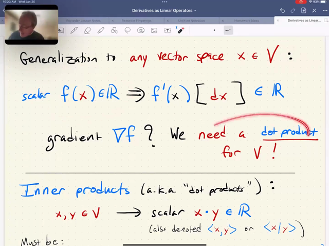</kbd></p>

> [!NOTE]
> Thế thì, bài này ta sẽ**khái quát hơn** ở chỗ **input x không chỉ là
> `n-dimensional` column vector** nữa. 
>
> Mà nó **có thể thuộc vector space** khác. 
>
> Ví dụ như nó là **matrix** (MIT 1806 thầy Strang đã dạy **vector
> space có nhiều loại**, miễn là**nó thỏa điều kiện rằng cộng hai vector**
> hay**scale vector với scalar** **vẫn ra** kết quả nằm trong **space**. Thì
> cộng hai matrix 2x2 vẫn ra matrix 2x2, nhân matrix 2x2 với một
> scalar thì vẫn ra matrix 2x2 nên tập các matrix 2x2 vẫn là một vector
> space)
>
> Tuy nhiên ta**vẫn giữ format là scalar function**. Có nghĩa là **input
> matrix, và output scalar**. Ví dụ như function**tính determinant của
> một matrix chẳng hạn**. Và bài này sẽ giúp ta khi ta muốn tính đạo
> hàm của hàm này.
>
> Thế thì, gs cho rằng việc đầu tiên cần làm đó là **ĐỊNH NGHĨA RA 
> PHÉP DOT PRODUCT** (MÀ NÓI CHÍNH XÁC HƠN VỀ TOÁN HỌC
> PHẢI GỌI LÀ **INNER PRODUCT**) CỦA **HAI VECTOR**. (có nghĩa là,
> với **column vector** thì ta biết**dot product** là tổng tích các component
> thì **với vector là matrix thì inner product là gì**)

<br>

<a id="node-117"></a>

<p align="center"><kbd>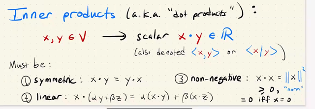</kbd></p>

> [!NOTE]
> Thế thì trước khi tìm **định nghĩa cho inner product** trong trường
> hợp khái quát, ta sẽ **đặt ra các rule** cho nó. Và cụ thể là ta có **3 rule**:
>
> 1) tính **đối xứng**: **x . y `=` y . x** (nhân tiện ta có thể có các cách notation
> khác cho inner product như **<x, y>**hay **<x \\ y>**)
>
> 2) **linear**: **x . `(αy` `+` βz)** =**α (x . y) `+` `β(x` . z)**
>
> 3) **non-negative**: **x . x `=` ||x||^2 phải ≥ 0**, chỉ bằng 0 ⇔ x `=` 0
>
> Có thể dễ thấy **với column vector**, tức dot product của vector mà ta
> đã quen thuộc, **đều thỏa** 3 rule này

<br>

<a id="node-118"></a>

<p align="center"><kbd>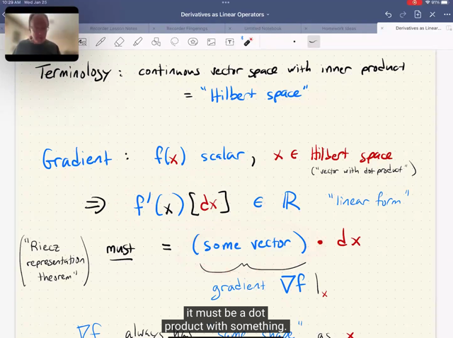</kbd></p>

> [!NOTE]
> Rồi, đại khái là k**hông có gì đáng sợ** ở chỗ sau đây cả, **đơn giản chỉ
> là** khi ta có một vector space **MÀ ĐÃ CÓ ĐỊNH NGHIÃ CỦA INNER
> PRODUCT**. Thì người ta gọi đó là **HILBERT SPACE**.
>
> Từ đó. tạm hiểu là có một **ĐỊNH LÝ** (cụ thể tên là **Riecz representation
> theorem**)  nói rằng, **bất cứ khi nào ta có một vector `->` scalar function**
> với vector **x**∈**Hilbert space**:
>
> THÌ **DERIVATIVE**, NHƯ ĐÃ NÓI,**LÀ MỘT LINEAR OPERATOR ACT
> ON dx**, ĐỂ CHO RA **SCALAR (*) ĐỀU PHẢI CÓ DẠNG LÀ INNER
> PRODUCT CỦA MỘT VECTOR NÀO ĐÓ VỚI dx**.
>
> **f(x) `=` f'(x)[dx] ⇨ `=` [some vector] . dx**
>
> Và ta gọi vector đó chính là**gradient ∇f**
>
> (*): (và cái **linear operator act on một vector cho ra scalar** người ta gọi là
> **linear-form**).
>
> DO ĐÓ, **KHI TA TRIỂN KHAI RA ĐƯỢC** DẠNG:
>
> **df `=` [vector gì đó] . dx**thì vector gì đó **CHÍNH LÀ GRADIENT**

<br>

<a id="node-119"></a>

<p align="center"><kbd>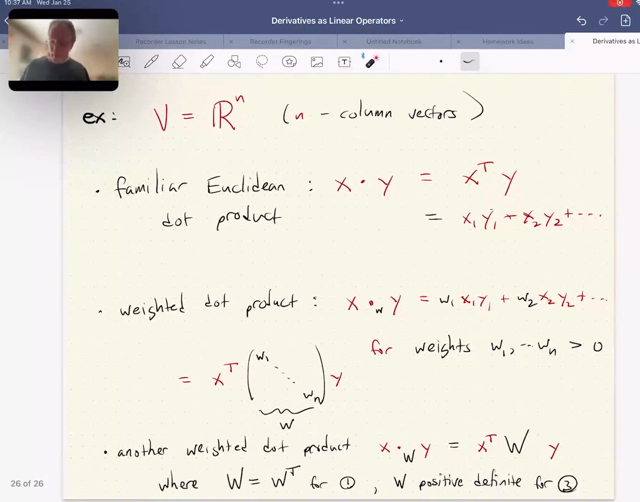</kbd></p>

> [!NOTE]
> Một ví dụ là**column vector truyền thống**. Thì ta có phép **dot product**
> quen thuộc (gọi là **Euclidean dot product**): **x . y `=` `Σ` xi*yi**
>
> Bên cạnh đó, ở class này ta **được biết thêm** là còn **có các dạng dot
> product khác**, một trong số đó là **weighted dot product**:
>
> **x .w y `=` `Σ` wi*xi*yi** với mọi **wi phải dương** (để thỏa rule 3)
>
> Cái này gs cho rằng**sẽ hữu ích** với các bài toán như **statistic**, ví dụ
> như khi ta có các **measurement với độ tin cậy khác nhau** và ta muốn
> **gắn trọng số nhỏ hơn cho những cái có độ tin cậy thấp**.
>
> **hoặc** là khi ta có **các unit khác nhau**, thì **wi cũng có thể coi như một
> các để scale các measurement**
>
> Và cái này có thể được**thể hiện theo lối linear algebra**: 
>
> `=` **xTdiag([w1, ...wn])x**  không khó để hiểu
>
> Thế thì có **một dạng khái quát hơn**, khi ta **đặt matrix W bất kì vào**:
>
> **x .W y `=` xTWy**
>
> Thì dĩ nhiên để **thỏa rule 1**, **W phải symmetric**. Và để **thỏa rule 3**
> thì **xTWx phải ≥ 0** và chỉ bằng 0 khi z `=` 0 Và MIT 18.06 đã dạy ta 
> rằng đây là một **Positive Definite matrix.**
>
> Quả thật trường hợp **W `=` diag(w1, ..wn)** thì với **wi > 0** thì nó cũng
> là matrix ≻ 0

<br>

<a id="node-120"></a>

<p align="center"><kbd>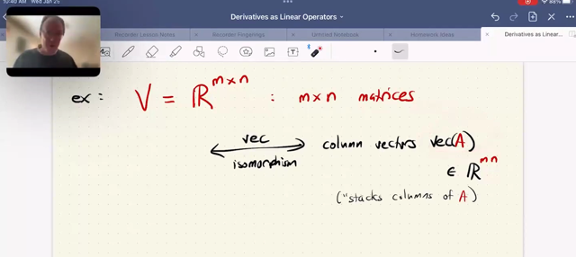</kbd></p>

> [!NOTE]
> Ta qua **ví dụ khác** với vector space là **mọi matrix thực (m, n).**
>
> Đại khái gs nói là như thầy Allan đã từng dạy trong **Julia** ta **có hàm** 
> vec để "**flatten**" matrix ra (mà cơ bản là chồng `/` stack các cột lại với
> nhau t**hành một column vector**∈**R^m*n)**
>
> Gs giải thích về khái niệm **isomorphism** **chỉ cần hiểu** **đại khá**i là khi
> ta **cộng hai matrix A, B thì kết quả cũng như ta cộng hai vector vec(A)
> vec(B)** (ý nói là việc **stack các cột lại chỉ thay đổi vị trí, chứ nó vẫn vậy**)

<br>

<a id="node-121"></a>

<p align="center"><kbd>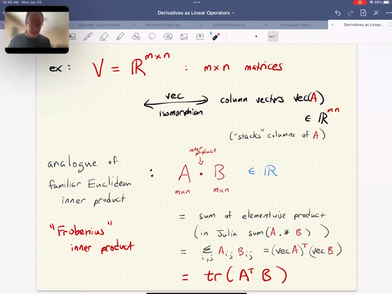</kbd></p>

> [!NOTE]
> Thế thì, gs nhấn mạnh **KHÔNG BAO GIỜ CHỈ CÓ MỘT INNER
> PRODUCT** mà **luôn có nhiều cách** (again, nhớ rằng **yêu cầu**của inner
> product **chỉ là** phép tính **làm sao từ hai vector cho ra kết quả scalar**)
>
> Và **inner product**mà tương ứng với vector case **u.v** thì chính là**A . B**
>
> Và **để từ hai matrix cho ra scalar** thì **một cách đơn giản** là **element-wise
> nhân component** của A và B **rồi** **cộng lạ**i
>
> Trong Julia: **sum (A.*B)**
>
> Có thể thể hiện toán học: **Σij Aij*Bij**
>
> hoặc dùng vec: **vec(A)Tvec(B)**
>
> hoặc **linear algebra** cho ta cách thể hiện rất hay: **tr(ATB)**
>
> vì sao: **tr()**như đã biết là **tổng các entries trên đường chéo**.
>
> Và trên **đường chéo của ATB** chính là **dot product của cột i của A**
> và **cột i của B**. Nên cộng lại hết chính là `Σij` Aij*Bij

<br>

<a id="node-122"></a>

<p align="center"><kbd>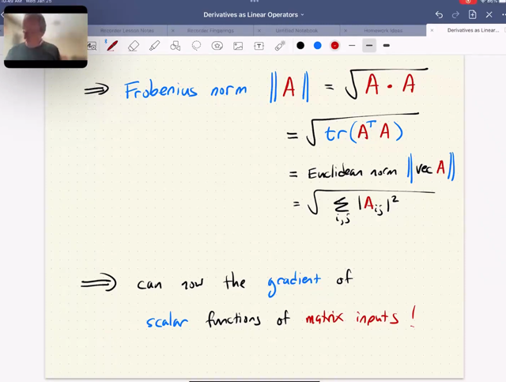</kbd></p>

> [!NOTE]
> Và từ đó (sau khi **đã có `/` biết định nghĩa của inner product giữa
> hai matrix**) ta sẽ biết về**Frobenius norm**
>
> Thì cái này**tương ứng với Euclidean norm**: ||u|| `=` **√(u.u)**
>
> Thì **||A|| `=` √(A. A)**
> Và với A . A `=` tr(ATA). Ta có **||A|| `=` √tr(ATA)**

<br>

<a id="node-123"></a>

<p align="center"><kbd>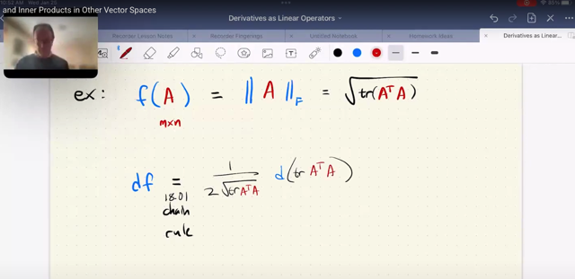</kbd></p>

> [!NOTE]
> Thế thì xét một ví dụ, lấy luôn **Frobenius** norm function**f(A) `=` ||A||** (gs
> nói thêm **vì inner product có nhiều loại**, **nên norm cũng vậy**, nên
> thường ta có thể **ghi thêm chữ F để phân biệt**)
>
> Để **tính derivative của functio**n này, gs cho rằng TA **CỨ VIỆC DÙNG
> CHAIN-RULE**:
>
> Áp dụng công thức `/` kiến thức **derivative của hàm √**: 
>
> f**(u) `=` √u `=` u^1/2** ⇨ **f'(u) `=` `1/2` `u^-1/2` `=` 1/(2√u)**. 
>
> Hay **df/du `=` 1/(2√u)** hay df `=` `1/(2√u)` du
>
> Do đó: **df `=` `1/2√tr(ATA)` d(tr(ATA))**

<br>

<a id="node-124"></a>

<p align="center"><kbd>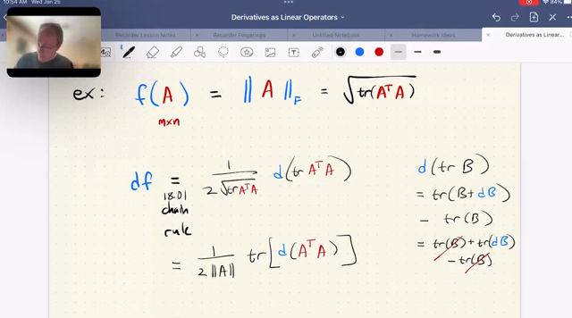</kbd></p>

> [!NOTE]
> Rồi, xét **d(tr(ATA))**. 
>
> Ta xét **d(tr(B))**trước
>
> Thì theo cách làm quen thuộc:**d(tr(B)) `=` tr(B `+` dB) `-` tr(B)**
>
> Thế thì, **trace operator** có tính **linearity**: **tổng entries trên
> đường chéo của U+V** đơn giản là **tổng entries đường
> chéo của U** `+` **tổng entries đường chéo của V**.
>
> ```text
> Do nó tr(B + dB) - tr(B) = tr(B) + tr(dB) - tr(B) = tr(dB)
> ```
>
> Do đó d(tr(ATA)) `=` **tr(d(ATA))
>
> ⇨** df `=` `1/2√tr(ATA)` tr(d(ATA)) ****
> Thay √tr(ATA) `=` ||A|| cho gọn
>
> `=` **1/2||A|| tr(d(ATA))**

<br>

<a id="node-125"></a>

<p align="center"><kbd>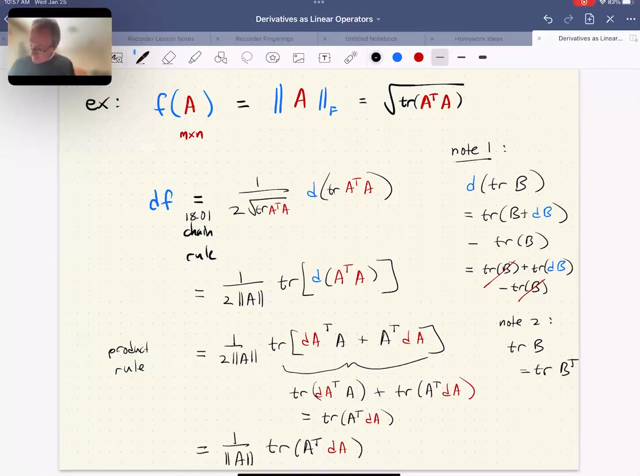</kbd></p>

> [!NOTE]
> Rồi tới đây ta dùng lại kết quả mà ko khó để làm lại dATA `=` (dA)TA `+` ATdA
>
> ⇨ df `=` `1/2||A||` tr(d(ATA)) 
>
> `=` `1/2||A||` tr((dA)TA `+` ATdA)
>
> `=` `1/2||A||` [tr((dA)TA) `+` tr(ATdA)]   |  dùng linearity
>
> và một kiến thức nữa không khó hiểu là dùng dù AB khác BA nhưng 
> tr(AB) `=` tr(BA)
>
> Do đó `1/2||A||` [tr((dA)TA) `+` tr(ATdA)] 
>
> `=` `1/2||A||` 2[tr(ATdA)] 
>
> `=` 1/**||A|| [tr(ATdA)]**

<br>

<a id="node-126"></a>

<p align="center"><kbd>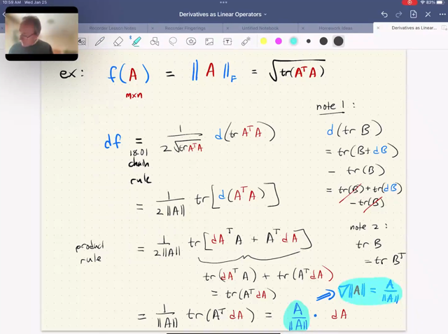</kbd></p>

> [!NOTE]
> Thế thì `=` `1/||A||` [tr(ATdA)] mà tr(ATdA) theo định nghĩa của inner
> product chính là A . dA
>
> Nên df `=` `1/||A||` (A . dA)
>
> Và vì ||A|| chỉ là scalar có thể coi như ta scale A trước rồi inner
> product sau nên df `=` (A `/` ||A||) . dA
>
> Vậy df(A) `=` f'(A)[dA] `=` (A `/` ||A||) . dA
>
> Nên gradient ∇f(A) CHÍNH LÀ A `/` ||A||
>
> Và với column vector cũng vậy ∇f(x) với f(x) `=` ||x|| cũng `=` **x `/` ||x||**

<br>

<a id="node-127"></a>

<p align="center"><kbd>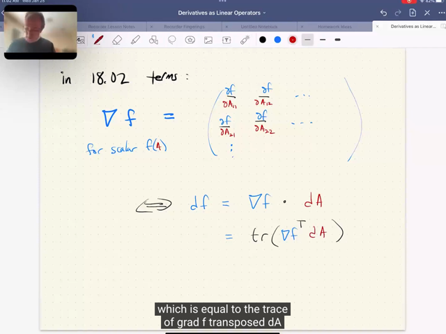</kbd></p>

> [!NOTE]
> đại khái ko có gì, ý là công thức rất gọn mà ta tìm được quả
> thật chính là cái mà 18.02 nói, là matrix các partial derivative

<br>

<a id="node-128"></a>

<p align="center"><kbd>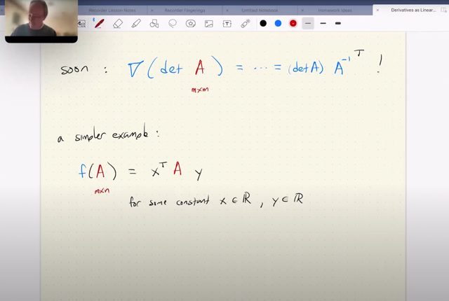</kbd></p>

> [!NOTE]
> Phần tiếp theo ta sẽ làm một cái phức tạp hơn là **f(A) `=` det A**. Để thấy
> kết quả nó là **∇f(A) `=` det A (Ainv)T**.
>
> Nhưng trước tiên ta làm một ví dụ đơn giản hơn là f(A) `=` **xTAy**.
>
> Với A là matrix**[m, n]** thì gs hỏi **x và y** là vector có bao nhiêu components.
>
> Quá đơn giản, nhờ MIT 18.06 ta biết **Ay sẽ là linear combination** của **A's
> columns** với coefficients là **components của y**, nên vì A có **n columns** nên
> y phải là**R^n vector**.
>
> Sau đó **x(Ay)** sẽ có là dot product của x và vector Ay, mà vector **Ay là linear
> combination của các A's columns** nên nó cũng có **m component** như A's 
> columns. Vậy x phải là **R^m vector**. Hiểu vậy giúp ta thấy sâu vấn đề hơn
> thay vì chỉ dựa vào shape compatible

<br>

<a id="node-129"></a>

<p align="center"><kbd>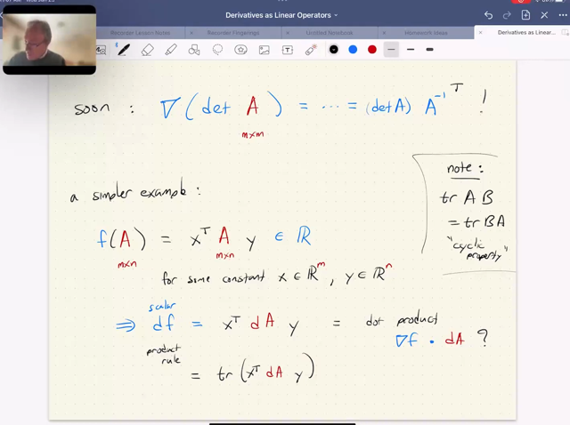</kbd></p>

> [!NOTE]
> Thế thì, dễ thấy df `=` **xT(dA)y** `(xT(A+dA)y` `-` xTAy)
>
> Và theo lí thuyết bữa giờ, ta phải **tìm cách triển khai nó
> trở thành dạng inner product của cái gì đó với dA**. Thì 
> cái gì đó sẽ chính là **∇f(A)**.
>
> Thế thì làm sao để cho thấy xT(dA)y `=` ∇f . dA
>
> Đầu tiên ta sẽ nói về tính chất của **trace**: 
>
> **Trace của scalar bằng chính nó** (giống như matrix có
> một component vậy). Và vì **df là scalar,** nên ta có thể viết:
>
> **df `=` xTdAy `=` tr(xTdAy)**
>
> Tính chất thứ hai là **CYCLIC**: Xuất phát từ **tr(AB) `=` tr(BA)**
>
> nên **tr(xTdAy)** =**tr[(xTdA)y]** `=` **tr[y(xTdA)]**  | coi A `=` xTdA, B `=` y
>
> `=` tr[(yxT)(dA)] `=` **tr(dAyxT)**   |  coi A `-` yxT, B `=` dA
>
> Đại khái là ta có thể hiểu cyclic properties là như vậy
>
> Nên ở đây ta sẽ có thể có **df `=` tr[(yxT)dA]**

<br>

<a id="node-130"></a>

<p align="center"><kbd>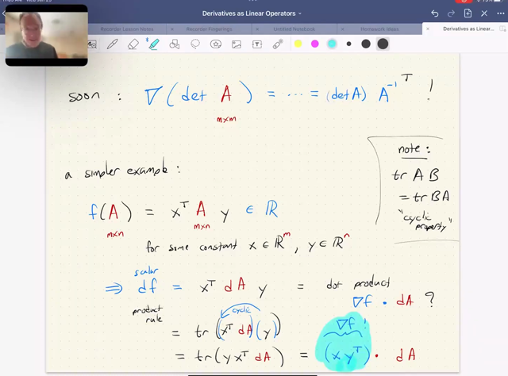</kbd></p>

> [!NOTE]
> Và tới đây phần trước ta đã biết **A.B `=` tr(ATB)**
>
> Nên ở đây **tr[(yxT) . dA]** CHÍNH LÀ **tr[(xyT)T . dA]**
>
> VÀ NÓ CHÍNH LÀ **(xyT) . dA**
>
> Vậy ∇f(A) CHÍNH LÀ **(xyT)**Gs chia sẻ một ý quan trọng, đó là **bất kể khi nào ta thấy
> một vector** (vector theo nghĩa rộng, ví dụ matrix) **-> scalar**
> function thì ta **BIẾT CHẮC df PHẢI CÓ DẠNG INNER
> PRODUCT GIỮA VECTOR (again vector theo nghĩa rộng)
> VÀ dA. VẤN ĐỀ LÀ TA CẦN CHUYỂN `/` TRIỂN KHAI SAO
> CHO NÓ RA DẠNG INNER  PRODUCT ĐỂ CÓ THỂ THẤY
> ∇f LÀ GÌ**

<br>

