# Lec 4 Part 2: Nonlinear Rooting Finding, Optimization And Adjoint Gradient Methods

📊 **Progress:** `15` Notes | `19` Screenshots

---

<kbd>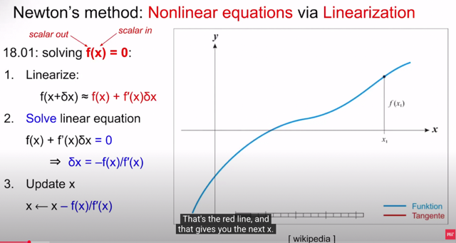</kbd>

> [!NOTE]
> đầu tiên gs đại khái là về **một ứng dụng** của việc tại sao**ta muốn
> tìm derivative**. Đó là trong một kiến thức mà thật ra mình đã học
> trong MIT 18.01: **Newton's method**.
>
> Đó là, khi ta muốn **giải một non-linear equation**. **f(x) = 0**. với f(x)
> là **non-linear function**. 
>
> Thì Newton method đại khái là vầy, ta**bắt đầu với một initial point**
> (guess) x0 nào đó. Kế tiếp ta sẽ **tìm phương trình tiếp tuyến tại
> x0 đó**, và **giải xem nó cắt trục x tại đâu**. Nó sẽ cho ta**next guess
> x1**. Làm tương tự như vậy vài lần, thì thực tế là **x0, x1, ...sẽ dần
> hội tụ về solution của f(x) = 0.**

 

<kbd>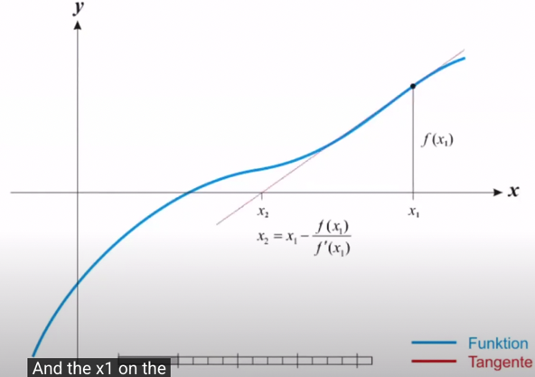</kbd>

<kbd></kbd>

<kbd>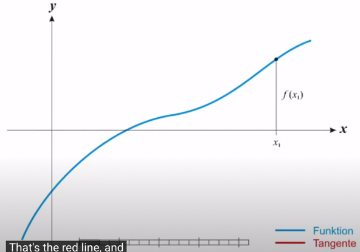</kbd>

> [!NOTE]
> Từ **initial guess x1**, ta xây dựng **phương trình tiếp tuyến với đồ thị
> tại đó**. Thì thật ra phương trình tiếp tuyến tại x1 chính là được xây
> dựng từ**linear approximation của f tại x1**:
>
> Linear approx. : f(x) ≈ f(x1) + f'(x1)(x - x1)
>
> Thì vế phải chính là phương trình tiếp tuyến tại x1:
>
> f(x) = f(x1) + f'(x1)(x - x1)
>
> Ta sẽ tìm**giao điểm của nó với trục x**: f(x1) + f'(x1)(x - x1) = 0 và
> giải ra x2:
>
> f(x1) + f'(x1)(x - x1) = 0 ⇔  f(x1) + f'(x1)x - f'(x1)x1 = 0
>
> ⇔  f'(x1)x = [f'(x1)x1 - f(x1)]
>
> ⇔ x (=x2) = [f'(x1)x1 - f(x1)] / f'(x1) = **x1 - f(x1)/f'(x1)**

 

<kbd>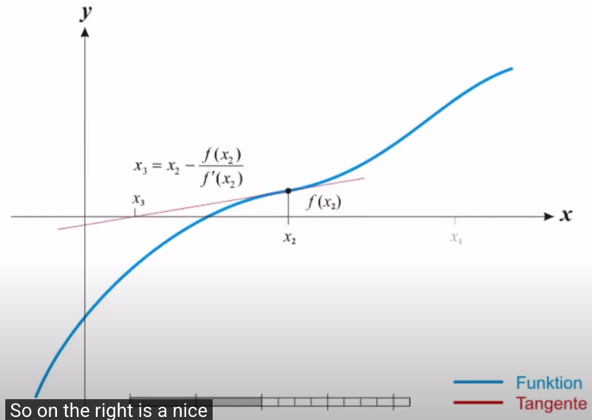</kbd>

<kbd></kbd>

<kbd>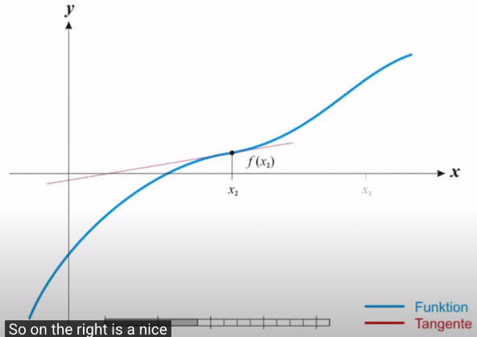</kbd>

> [!NOTE]
> Lặp lại quá trình, ta sẽ tìm phương trình tiếp tuyến tại x2:
>
> Linear approx.: f(x) ≈ f(x2) + f'(x2)(x - x2)
>
> again, vế phải chính là phương trình tiếp tuyến, giải tìm giao
> điểm với trục x: f(x2) + f'(x2)(x - x2) = 0 
>
> cho ra x3 = **x2 - f(x2)/f'(x2)**

 

<kbd>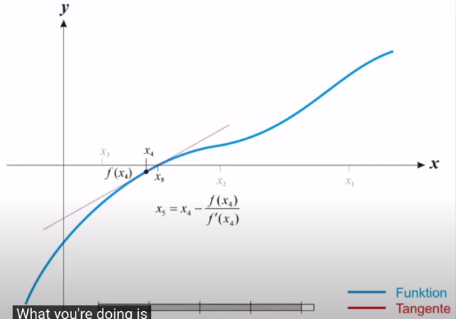</kbd>

> [!NOTE]
> Tiếp tục vậy sẽ thấy **xi dần tiến về solution thật sự của f(x) = 0**
>
> Trong bài về Newton's method của MIT 18.01 gs cũng có nói
> một số điều kiện để phương pháp này có tác dụng. Cũng như là
> **phân tích để cho thấy độ chính xác** (khi tìm solution của f(x) = 0 theo
> cách này sẽ ngày càng tăng)

 

<kbd>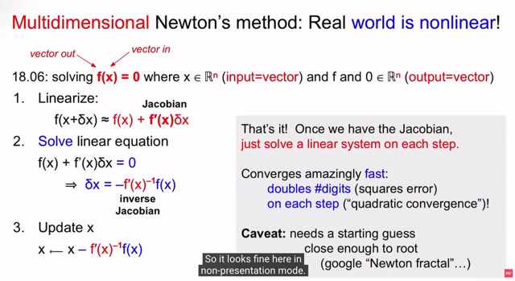</kbd>

> [!NOTE]
> Thế thì đó là thứ ta đã học trong 18.01. Thì nó HOÀN TOÀN CÓ THỂ **ÁP
> DỤNG VỚI MULTI-DIMENSIONAL CASE**.
>
> Tức là khi f(x) là R^n -> R^n function. Nếu là trong 18.01, ta xét R -> R function
> thì ta đang **dùng Newton method** để **giải tìm solution** (chính xác hơn là
> **approximated solution)** của **nonlinear function f(x) = 0**)
>
> Còn bây giờ f(x) = 0 với **x**∈**R^n, f(x)**∈**R^n** thì ta đang **GIẢI HỆ N NONLINEAR 
> EQUATION**. (dĩ nhiên không thể represent bởi f(x) = Ax đâu nhé, vì đây chỉ đúng 
> nếu ta có system of linear equations)
>
> Thế thì, các bước cũng vậy:
>
> 1) **Dùng linear approx.** để **tìm phương trình tiếp tuyến của hàm số tại initial
> guess x(1)**.  Với việc ta đang trong R^n nên nó sẽ là một **hyperplane**.
>
> 2) Giải **tìm solution f = 0** để ra **x(2)**.
>
> 3) Lặp lại như vậy thì **x(i) sẽ converge về x*** là **solution của f(x) = 0**
>
> Vậy thì: Tại thời điểm này ta đã có thể **tính derivative** của mọi function kể cả
> **R^n -> R^n**.
>
> Thế thì **linear approx. của f(x)**: Với δx ≈ 0 ta có**f(x + δx) ≈ f(x) + f'(x)δx**
>
> (hoặc có thể nói kiểu khác với starting point x1: Với x ≈ x1 ta có:
>
> **f(x) ≈ f(x1) + f'(x1)(x - x1)**
>
> Thì vế phải chính là **phương trình tiếp tuyến tại x1**: 
>
> **f(x) = f(x1) + f'(x1)(x - x1))**
>
> Ta sẽ **giải tìm solution của f(x1) + f'(x1)(x - x1)) = 0** để ra **next guess x2**.
>
> (hoặc giải f(x) + f'(x)δx = 0 để ra δx rồi x2 = x1 + δx cũng vậy thôi)
>
> Thế thì nhận xét rằng thế này. Giống như trong 1D case, **hàm gốc f(x) là
> nonlinear** (để rồi ta mới thấy khó tìm solution của f(x) = 0 ngay từ đầu). 
>
> Nhưng **f(x) + f'(x)δx = 0 là linear equation** (vì sao, vì f(x) là scalar, và f'(x)δx là
> scalar*δx, nói cách khác, nó có dạng b + ax, nên **giải ra δx rất dễ dàng**)
>
> Tương tự, trong R^n case, **f(x) gốc là non-linear function**. Nhưng **f(x) + f'
> (x)[δx] là linear function**. Vì sao, vì f(x) là constant vector, **f'(x)[δx] là LINEAR
> OPERATOR ACT ON δx**.
>
> Và cụ thể hơn trong case này, nếu xét **vector** là **column vector** truyền
> thống, thì như đã biết **f'(x)[dx] thực ra CHÍNH LÀ J dx** 
>
> (nhớ không, khi dx là vector mà muốn ra df = f'(x)[dx] cũng là vector thì linear 
> operator chỉ có thể là phép nhân vector dx với MỘT MATRIX, MATRIX ĐÓ 
> GỌI LÀ **JACOBIAN**, và như vậy f'(x) chính là J
>
> Và như vậy việc **giải tìm f(x) + f'(x) δx = 0**  sẽ **CHÍNH LÀ GIẢI MỘT HỆ
> PHƯƠNG TRÌNH TUYẾN TÍNH: f(x) + J δx = 0, và có thể giải theo cách thức
> analytically**
>
> Và đây là nơi ta dùng kiến thức của **MIT 18.06**:**Chuyển f(x) qua**, và **nhân
> hai vế cho J_inv (f'(x)^-1)**: ta sẽ có **δx = - J_inv f(x)**
>
> (Có thể đặt câu hỏi là tạo sao biết J full rank / invertible nhỉ?)
>
> Sau đó thì ta có **x2**, và lặp lại: **x := x + δx = x - J_inv f(x)**

> [!NOTE]
> Tới đây, sau khi ta đã finish chap 10 của Convex Optimization (text book của
> EE364A)  thì có thể thấy cái đang nói ở đây chính xác là đang nói về Newton's
> method giúp giải bài toán optimization. Mình sẽ liên hệ nó với cái này:
>
> Thế thì trong class này cũng như 1801, chỉ đang nói rằng mục tiêu của ta là đang
> muốn giải một hệ phương trình phi tuyến thể hiện bởi f(x) = 0 (1) với f(x) là non-linear
> function R^n -> R^n. Và Newton's method có thể giúp, với cách làm theo lối iterative
> là từ initial guess x(1), ta tìm phương trình tiếp tuyến của f(x) tại x(1) và giải tìm x(2)
> là giao điểm của tiếp tuyến đó với trục y = 0. Có x(2), ta lại lặp lại như vậy để tìm
> x(3) Rồi x(4)....Để rồi chuỗi x(1), x(2)...x(k) sẽ converge về x* là solution của f(x) = 0
>
> Vậy thì trong EE364A, xét bài toán unconstrained convex optimization problem với
> là minimize objective function f(x) (không phải là quadratic nhé, và cũng ko cần ghi
> f0(x), vài f0 chỉ để khi phân biệt với fi(x) i = 1, 2...trong bài toán inequality constraint
> problem, Nhưng ở đây mình ghi f0 để tí nữa dễ phân biệt với cái f(x) chung chung
> vốn để chỉ cái equation f(x) = 0 mà trong lecture này nói ta đang muốn giải nhờ
> newton's method). 
>
> Thế thì, optimality condition nói rằng optimal point sẽ là solution của ∇f0(x)
> = 0, là nơi mà gradient của f0(x) vanish (lập luận đơn giản là nếu nó không như vậy,
> linear approximation tại x*: f0(x* + δx) ≈ f0(x*) + ∇f0(x*)Tδx  sẽ cho biết đi theo hướng
> của hợp với ∇f0(x*) góc tù sẽ tiếp tục giảm hàm f0:
>
> Chỉ cần đi theo hướng δx sao cho nó hợp với ∇f0(x*) một góc tù là ∇f0(x*)T δx  =
> ||∇f0(x*)||*|| δx||*cos(θ)  sẽ < 0 ⇨ f0(x* + δx) < f0(x*)
>
> Thế thì, giải bài toán optimization này chính là giải ∇f0(x*) = 0, và với việc f0(x) là
> R^n -> R non-linear function, thì ∇f0(x) chính là R^n -> R^n function vì ∇f0(x) là
> gradient vector [∂f0/∂x1, ∂f0/∂x2,...∂f0/∂xn] nên nó là function take input R^n vector x 
> và output R^n vector ∇f0(x). Và ta muốn giải tìm solution của ∇f0(x) = 0 tương
> ứng với việc ta muốn giải tìm solution của f(x) = 0 nói trên (1). 
>
> ====
>
> Thế thì, theo EE364a, Newton's method về cơ bản là như sau: Tại initial point x(1),
> ta sẽ approx. hàm f0(x) bởi quadratic approx. của nó: 
>
> f0(x1 + δx) ≈ f0(x1) + ∇f0(x1)Tδx + (1/2) δxT ∇^2f0(x) δx 
>
> Để rồi ta xét hàm f0^(δx) = f0(x1) + ∇f0(x1)Tδx + (1/2) δxT ∇^2f0(x) δx, là một hàm 
> quadratic theo δx. 
>
> Và ta sẽ tìm δx sao cho minimize f0^(δx). Với việc f0^ là quadratic thì việc tìm
> minimum của nó có thể có analytic solution: Chính là dựa vào optimality condition:
>
> ∇f0^(δx*) = 0
>
> Với f0^(δx) = f0(x1) + ∇f0(x1)Tδx + (1/2) δxT ∇^2f0(x1) δx 
>
> hay 1/2 δxT P δx + qTδx + r 
>
> đặt P = ∇^2f0(x1), q = ∇f0(x1) và r = f0(x1) 
>
> Ở class này ta đã quá dễ dàng biết công thức gradient của quadratic function rồi,
> nên khỏi nói: 
>
> ∇f0^(δx) = PTδx + q = ∇^2f0(x)T δx + ∇f0(x) = **∇^2f0(x) δx + ∇f0(x)** (do Hessian symmetric)
>
> Vậy optimality condition là: ∇^2f0(x1) δx* + ∇f0(x1) = 0 ⇨ **δx* = - ∇^2f0(x1)_inv ∇f0(x1)
>
> Và đây chính là công thức của Newton's step, là cái δx giúp minimize f0^(δx):
>
> Δx_nt = - ∇^2f0(x1)_inv ∇f0(x1)**Và việc update sẽ giúp ta có x(2): x(2) = x(1) + t Δx_nt
>
> Dĩ nhiên với mỗi iteration, ta cũng làm tương tự để có điểm tiếp theo, nên công thức
>
> Δx_nt = - ∇^2f0(x)_inv ∇f0(x) hiểu là Newton's step tại điểm đang "đứng" x(k)
>
> Để rồi các x(1), x(2)... cũng sẽ dần dần converge về x* là solution của ∇f0(x) = 0
>
> ====
>
> Thế thì thật ra để liên hệ nó với cái vụ "tìm tiếp tuyến tại x(k) và giải tìm intersection
> của nó với trục y = 0 để có next guess x(k+1)" thì ta phải dùng một điểm mà trong sách
> Convex Optimization, gs Boyd có nói, đó là góc nhìn khác (interpretation) của Newton's
> step:
>
> Góc nhìn đó chính là, ta cũng sẽ bắt đầu với việc ta đang muốn giải ∇f0(x) = 0.
> Nhưng vì ∇f0(x) non-linear nên khó giải, thay vào đó, ta sẽ coi nó / xấp xỉ nó như một
> linear function, để tìm approx. solution. Nói rõ hơn, ta sẽ dùng linear approx. của ∇f0(x)
> tại x (điểm đang đứng, ví dụ x1) đặt là ∇~f0: 
>
> Linear approx. của ∇f0(x) (nhớ rằng nó cũng là một function, nó "có quyền" có linear 
> approx tại điểm gần với x1: ∇f0(x1 + δx) ≈ ∇f0(x1) + ∇^2f0(x1)Tδx 
>
> Và như đã nói, ta sẽ xét function ∇~f0(δx) =  ∇f0(x1) + ∇^2f0(x1)Tδx , là một linear function
> theo δx. Và ta sẽ giải ∇~f0(δx*) = 0 thay vì ∇f0(x*) = 0
>
> Thế thì giải ∇~f0(δx*) = 0 ⇔ ∇f0(x1) + ∇^2f0(x1)Tδx* ⇔ δx* = **∇^2f0(x1)_inv ∇f0(x1) có thể
> thấy nó chính là Newton's step ở trên.**Dĩ nhiên x1 + δx* = x1 + Δx_nt (hay có thêm step size t nữa thì) sẽ chỉ là approximated 
> solution của x*, nên nó ko chính xác ngay, mà ta sẽ tiếp tục làm vậy để có x(2), x(3)....
> để chúng sẽ dần converge về x*
>
> NHƯNG Ý CHÍNH ĐÓ LÀ, ĐÂY LÀ CÁI MÀ LIÊN HỆ VỚI CÁI NÓI TRÊN, bởi vì việc ta
> giải ∇~f0(δx) = 0 ⇔ ∇f0(x1) + ∇^2f0(x)T δx = 0 chính là giải tìm intersection của tiếp tuyến 
> (tangent plane) của ∇f(x) tại x1.
>
> (Nhớ rằng ∇f0(x) có vai trò của f(x) mà trong class này đang nói, là ta đang muốn giải f(x) 
> = 0)
>
> ====
>
> Và trong note kế trước, ta có kết quả δx = - J_inv f(x) (để có next guess x2 = x1 + δx
> thì có thể thấy chính là công thức Newton's step ở trên:
>
> với ∇f0(x) đóng vai f(x), thì ∇^2f0(x) chính là J
>
> **δx = - J_inv f(x)** cũng tương ứng với **Δx_nt = - ∇^2f(x)_inv ∇f(x)** 
>
> (vì Hessian của f0, tức ∇^2f0(x) CHÍNH LÀ JACOBIAN CỦA ∇f0(x))

 

<kbd>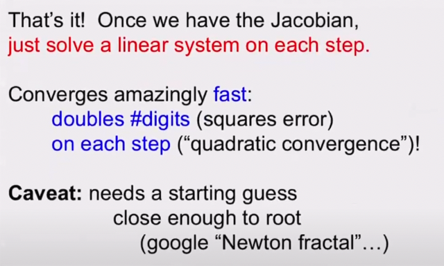</kbd>

> [!NOTE]
> Nói chung là đây cũng chỉ đang là việc gs nói ứng dụng của
> **Jacobian** (derivative) một lưu ý là để phát huy tác dụng, tương
> tự như trong R1 case, thì **initial guess phải không quá xa true
> solution**.
>
> (gs nói sẽ rất tốt nếu ta **có một ước lượng nào đó trong đầu về
> solution rồi**, thì dùng Newton method sẽ **tìm ra solution chính
> xác rất nhanh)**

 

<kbd>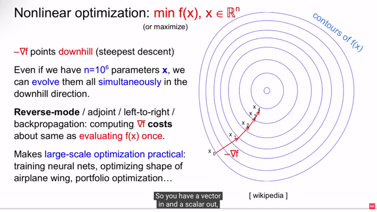</kbd>

> [!NOTE]
> Một ứng dụng nữa (của derivative) là trong **optimization** (cụ thể
> là **non-linear optimization**) khi ta có scalar function **R^n -> R**
> với n có thể là hàng tỉ.
>
> Thế thì nhờ EE364A ta không còn xa lạ gì với **optimization** nữa.
> thì đại khái là nhờ việc tính **gradient ∇f.** Để cụ thể ta có function f(x)
> đại diện một neural network, với x là parameters của nó. 
>
> Thì ta có thể **update parameter theo hướng -∇f**:**x = x - α ∇f**giúp 
> giảm hàm f đi một chút, **Dần dần ta sẽ tìm ra / tiếp cận optimal**
> (cái này nếu là nói trong bối cảnh convex optimization thì đúng là
> **gradient descent method**, hay còn gọi là **steepest descent method**
> sẽ dần dần giúp tìm optimal / minimum, nhưng trong bối cảnh của
> deep learning, thì có thể ta sẽ chỉ tìm thấy local minimum, do function
> trong deep learning thường không convex)
>
> Thế thì ta có thể có **gradient** nhờ **backpropagation**, hay còn gọi là 
> r**everse mode / adjoint.**

 

<kbd>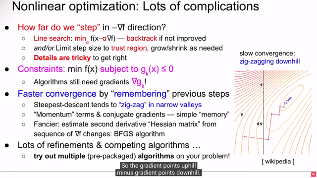</kbd>

> [!NOTE]
> Gs nói sơ **một số vấn đề của optimization**. 
>
> Vấn đề đầu tiên là "ta **nên đi xa bao nhiêu theo hướng của - ∇f**"? 
>
> Again, nhờ EE364A, ta đã biết trong gradient descent, ta dùng
> thuật toán gồm 3 bước: 1) **chọn descent direction, Δx**. Và với 
> việc chọn nó là **- ∇f(x)** ta có cái gọi là **steepest descent method**
> 2) Tính / **chọn step size: t** Và 3) **update: x := x + t Δx** để từ f(x) ta
> sẽ có f(x + t Δx) < f(x)
>
> Thế thì ở đây gs nhắc đến bước 2: Trong EE364 ta đã học rằng
> việc tìm t chính là gọi là **LINE SEARCH**. Và nó có hai **strategy**:
>
> a) **Exact** **line** **search**: Ta sẽ giải một bài toán optimization 1 biến:
>
> **minimize f(x + t Δx)** subject to **t ≥ 0**. Để nôm na là tìm ra bước đi
> (step size) tối ưu, giúp giảm hàm f xuống nhiều nhất theo hướng
> Δx (= - ∇f(x))
>
> b) Nhưng phương pháp exact **chỉ hiệu quả** nếu việc **giải bài toán
> tối ưu**này có thể **có analytic solution** hoặc giải **không tốn kém lắm**.
> Thì cách thứ hai đó là **chọn t = 1**, và giảm t từ từ cho đến khi thỏa
> một exit condition thì dùng t đó. Đó là **backtracking line search.**

 

<kbd></kbd>

> [!NOTE]
> Rồi **còn có một cái** gọi là**limit step size** trong một **TRUST
> REGION**. Có lẽ những bài sau của EE364A ta sẽ học
>
> Bên cạnh đó, gs đề cập tới việc trong thực tế ta nhiều khi phải giải
> bài toán **CONSTRAINED** **OPTIMIZATION**, tức là solution
> phải thỏa constrained nào đó (gọi là feasible như đã biết). Thì khi
> đó ta cũng **phải cần đến gradient của constrained function** Cái
> này thì EE364A đã quá rõ, ví dụ như khi dùng KKT condition để
> tìm optimal của constrained optimization problem thì ta nhớ là sẽ
> c**ần tìm ∇fi(x), và ∇hi(x)** trong ý gradient của Lagrangian  vanish
> (∇x L = 0)
>
> Rồi một vấn đề nữa là **tình trạng zig-zag của steepest descent**
> trong bối cảnh mà (nói theo EE364A) **sub-level set của function**
> **f có condition number có giá trị lớn** (gọi là**bad condition**). Khi
> đó, đại khái là **số iteration cần thiết để converge sẽ lớn ⇨ lâu
> converge**. mà hình ảnh là như ta có**một valley hẹp bề này mà
> rộng ở bề kia**. Khi đó, việc **đi theo steepest descent direction sẽ
> khiến ta cứ leo qua leo lại giữa hai bên "vách"** của thung lũng
> **khiến rất lâu mới đến được đáy,.**
>
> Thì từ đó có những thuật toán như **Adam**, **Momentum**, mà ta
> đã học trong**CS231n**giúp **có những cách thức để giảm đi việc
> zig zac** cũng như là **vượt qua các local minimum**
>
> hay **BFGS** algorithm (mà ta sẽ học trong những bài sau của
> EE364A) mà cơ bản là ta **tận dụng thêm thông tin về curvature
> của "landscape"** (phản ánh trong Hessian matrix) để giúp tìm ra
> step size tốt hơn.

 

<kbd>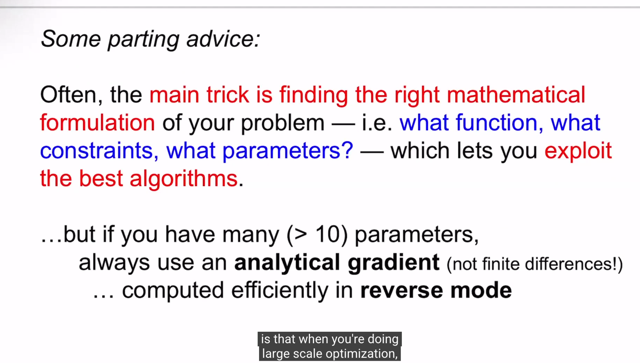</kbd>

> [!NOTE]
> Và một vài lời khuyên đại khái là trong thực tế thì **khi đối mặt với
> một vấn đề** thì việc ta thường phải là đó là **xây dựng một cách mô
> tả toán học** cho vấn đề mà mình cần giải quyết. Ví dụ như function
> (**objective** function) **là g**ì, **constrains** là gì, **parameters** là gì. Từ đó
> nó sẽ giúp ta **chọn algorithm phù hợp**
>
> Và khi **số parameters là khổng lồ** (như trong**deep learning**) thì 
> **luôn luôn phải dùng analytic gradient** (ý là phải tính gradient từ
> "công thức" vs tính bằng numerical gradient / hay còn gọi
> là finite gradient) - ví dụ như trong deep learning, như đã biết
> back-propagation chính là quá trình ta tính analytic gradient (và
> dùng nó để update parameters)

 

<kbd>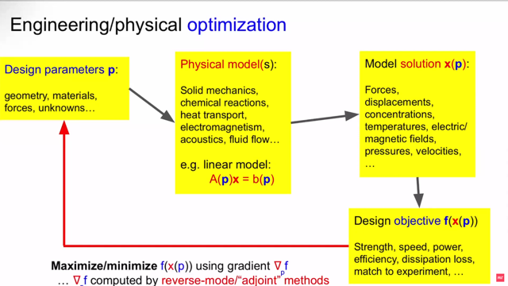</kbd>

> [!NOTE]
> gs nói về một ví dụ (khá giống một bài toán machine learning) nhưng
> đây là trong engineering. Lấy ví dụ như ta muốn **thiết kế** ra / **tìm
> ra giá trị của tham số p** (có thể là hình dạng, vật liệu,..) khiến ta **đạt
> được một kết quả tối ưu** nào đó của sản phẩm.
>
> Ví dụ ta muốn **tìm hình dạng của cái ghế** bằng kim loại sao cho nó
> c**hắc nhất** nhưng cũng n**hẹ nhất c**ó thể. (trong machine learning
> tương đương việc ta muốn **tìm giá trị tham số θ** sao cho mô hình
> LLM đạt **được một benchmark**nào đó)
>
> Thế thì ta sẽ **xây dựng physical model** thể hiện bằng một
> **equation ví dụ A_p (x) = b_p.**
>
> Từ đó ta giải ra x(p) là một hàm theo p. Ví dụ như từ p là hình dạng
> của cái ghế, ta tính ra x là lực tác dụng chẳng hạn.
>
> Rồi, từ x(p), ta sẽ tính ra giá trị của target function F(x(p)) ý nghĩa ví
> dụ như là với lực đó (phụ thuộc p) thì độ bền của cái ghế như thế nào
>
> (trong bài tóan LLM, thì nó tương đương Loss function là hàm phụ
> thuộc vào prediction y^, và y^ vốn dĩ là function theo parameter θ
> y^(θ))
>
> Thì sau khi có F(x(p)) ta sẽ tính derivative của F wrt p từ đó backprop
> update giá trị của p khíên maximize độ bền (tương đương với việc ta
> update θ để minimize loss function)

 

<kbd>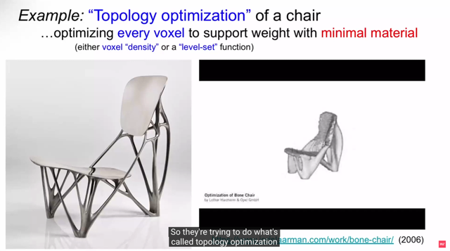</kbd>

 

<kbd>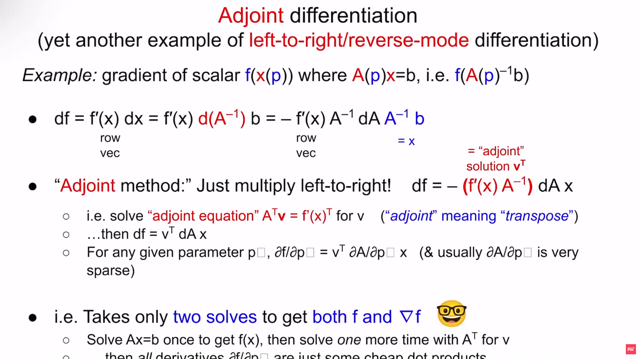</kbd>

🔗 **Related:** [LEC 2 PART 2: VECTORIZATION OF MATRIX FUNCTION](untitled.md#node-61)

> [!NOTE]
> Rồi ví dụ như với bài toán vừa rồi, ta sẽ**cần tìm gradient của
> scalar function f(x(p))** trong đó **A(p)x = b**. **A(p) hiểu là một matrix
> phụ thuộc vector variable p**. 
>
> Tức là A bản thân là matrix variable, giống như giả sử p là vector
> thì A là sản phẩm của một vector to matrix funtion f(p) = A. Và ta
> ghi A(p) để thể hiện nó là function theo p. Chứ đừng hiểu A(p)
> kiểu như matrix A* variable scalar p. 
>
> Và đương nhiên derivative của A đối với p sẽ thuộc dạng mà input
> là vector output là matrix như trong bài 1. Tí nữa nói ∂A/∂pk thì cũng
> hiểu là đang nói về ∂g/∂pk với g(p) = A.
>
> Vậy thì nhắc lại, từ A(p)x = b ta giải ra x = A(p)inv b LÀ FUNCTION
> PHỤ THUỘC A(p) 
>
> Rồi từ x tính ra f(x). Để f cũng là function phụ thuộc A(p).
>
> Vậy thì ta sẽ dùng chain-rule để tính df/dA:
>
> f là function theo x: df = f'(x)dx 
>
> vì f là scalar, và x = Ainvb là column vector, nên ta đã biết f'(x) là
> row vector
>
> x là functiont theo A (again, A là biến số, ghi A(p) ý là nhấn mạnh A
> là matrix biến số, nên khi hiểu A là biến số rồi thì cứ ghi A thôi)
>
> dx = x'(A)dA. Vậy x'(A) là gì ? thì nhờ class này ta biết cách tính
> derivative của f(A) = Ainv: 
>
> dAinv = -Ainv.dA.Ainv 
>
> nên dx = dAinvb = -Ainv.dA.Ainvb
>
> ⇨ df = f'(x)dx = f'(x) [-Ainv.dA.Ainvb] = -f'(x).Ainv.dA.Ainvb

 

<kbd></kbd>

> [!NOTE]
> Rồi khi đã có df = -f'(x).Ainv.dA.Ainvb = f'(x) Ainv dA x
>
> Thì backpropagation hay adjoint method đơn giản có bản chất chỉ là ta
> tính cái này từ TRÁI SANG PHẢI.
>
> Có nghĩa là ta bắt đầu với việc tính f'(x) . Ainv
>
> Và có thể thấy f'(x) là row vector, Ainv là matrix, nên đây là nhân một row
> với một matrix, theo MIT 18.06 ta đã biết 1 trong 4 "góc nhìn" khi nhân
> matrix thì đây có thể thấy là ta sẽ linear combination các rows của Ainv
> với coefficients là các components của f'(x). Và cho ra một row vector.
>
> Thì ý chính muốn nói phép tính này rất nhanh (ko tốn kém) vì nó chỉ là
> nhân matrix với một vector.
>
> Và nếu có thể không khó để hiểu việc nhân f'(x) . Ainv thực chất có thể
> xem như ta đang giải một equation:
>
> ATv = f'(x)T
>
> (Vì ATv = f'(x)T ⇔ v = (AT)inv f'(x)T = (Ainv)T f'(x)T)
>
> Và cái này gọi là Transposed / Adjoint equation (equation thông thường
> là Ax = b, thì ATx = bT là adjoint / transpose equation) nên cái tên Adjoint
> method xuất phát từ đây
>
> Và vì kết qủa là row vector nên ta sẽ transpose solution:
>
> vT = [(Ainv)T f'(x)T ]T = f'(x)TT (Ainv)TT = **f'(x) (Ainv)
>
> Và khi có v rồi thì lại tiếp tục tính df = -vT dA x**====
>
> Thế thì một điểm lưu ý đó là:
>
> Lúc đầu, ta nói rằng từ A x = b ta giải ra x = Ainv b để rồi từ đó tính f
>
> Thì bây giờ cũng cùng matrix A đó, ta giải ra v bởi equation ATv = f'(x)T
> ****====
>
> Vậy thì, ý chính là khi ta giải hai equation với cùng matrix A đó xong, tức
> là tính v xong, thì lúc này ta có thể có derivative của f wrt pk bất kì
>
> (đang ví dụ p là vector), thì ∂f/∂pk chính là -vT ∂A/∂pk x. Vì sao?
> -> Vì df = -vT dA x. Nên kiểu như chia hai vế cho dpk ta có:
>
> df/dpk = -vT dA/dpk x 
>
> Và vì là partial derivative (f cũng như A không chỉ phụ thuộc mỗi pk 
> nên ta phải dùng notation ∂)
>
> ∂f/∂pk = - vT ∂A/∂pk x
>
> **THẾ THÌ NHẮC LẠI Ý CHÍNH LÀ GIẢI HAI EQUATION:
>
> A(p)x = b ra x, và A(p)Tv = f'(x)T ra v GIÚP TA 1) TÍNH RA f VÀ 2) TÍNH
> DERIVATIVE CỦA F VỚI PARAMETER BẤT KÌ ∂f/∂pk
>
> VÀ ĐÓ LÀ ADJOINT METHOD, CŨNG CHÍNH LÀ BACK-PROPAGATION
> TRONG DEEP LEARNING CŨNG CHÍNH LÀ REVERSE MODE TRONG 
> AUTOMATIC DIFFERENTIATION**

 

<kbd>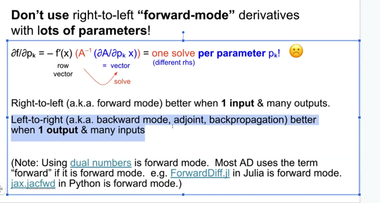</kbd>

> [!NOTE]
> Vậy thì như gs đã phân tích về việc khi nào thì nên dùng forward
> mode và reverse mode trong bài 1,2. Thì đại khái là ta nhớ nôm
> na rằng khi có nhiều input và một output (R^n -> R) function thì
> nên dùng reverse mode.(và training deep learning model thuộc
> dạng này)
>
> Ngược lại khi có ít input nhưng nhiều output thì nên dùng forward
> mode

 

