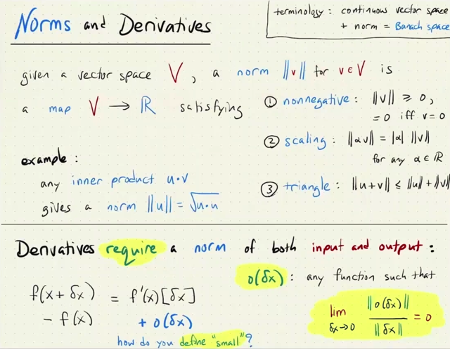
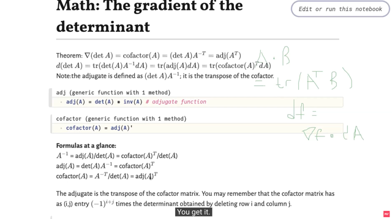
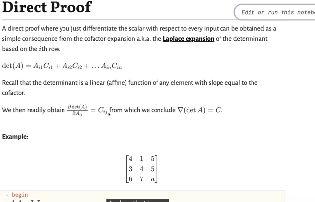
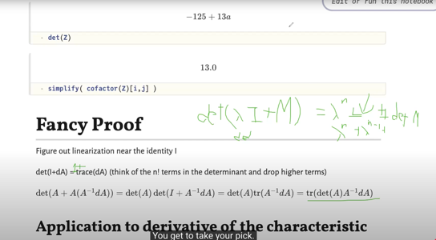
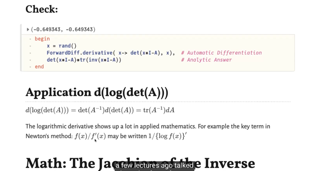

# Lec 5 P1: Derivative Of Matrix Determinant And Invers

📊 **Progress:** `7` Notes | `6` Screenshots

---

<kbd></kbd>

> [!NOTE]
> đại khái là bài trước ta còn nhớ rằng để mở rộng khái niệm gradient
> ra đối với các vector space khác (ví dụ matrix) thì ta cần define phép
> inner product. Vì như ta đã biết, khi x thay đổi chút xíu dx kéo theo
> f(x) thay đổi df = f(x + dx) - f(x) thì sự thay đổi này là một linear operator
> act on dx: df = f'(x)[dx]. và khi x, dx là vector thì linear operator act on
> dx để cho ra df là scalar thì nó chỉ có thể là phép inner product của
> một vector nào đó (chính là gradient vector) với dx.
>
> Do đó, để tính đạo hàm, hay tìm gradient vector đối với function nhận
> vector ở dạng mở rộng (ví dụ matrix) output ra scalar f thì ta chỉ cần
> cho thấy df = [vector gì đó] . dx. Và do đó ta cần xác định phép inner
> product giữa hai vector với nhau (ví dụ giữa hai matrix)
>
> Thế thì bài trước ta đã làm việc này, đã biết inner product giữa hai matrix
> là gì rồi chính là = Σij Aij * Bij = tr(ATB).
>
> Thì nay, gs nhắc đến ta còn phải có thêm một thứ nữa, đó là norm của 
> vector (còn nhớ khi vector space đã định nghĩa phép inner product thì
> nó gọi là Hilbert space, thì nay nếu có thêm norm thì nó là Banach space,
> đây chỉ là những cái tên bóng bẩy, chứ không có gì ghê gớm)
>
> RỒi gs cũng nói về norm, là bất cứ vector -> scalar function nào thỏa
> 3 tính chất như không âm (trừ khi vector 0), scaling, và triangle inequality
>
> Và thật ra khi ta định nghĩa ra inner product của hai vector thì ta đã có 
> luôn norm rồi. ||u|| = √(u.u)
>
> Cuối cùng gs nói về lí do ngầm ẩn khiến ta cần có norm là vì như đã biết
> khi x thay đổi một khoảng nhỏ (không phải infinitesimal dx) δx thì f(x) thay
> đổi δf = f(x + δx) - f(x) thì nó không phải là hàm tuyến tính theo δx mà có
> thể nó còn những term bậc cao nữa:
>
> f(x + δx) - f(x) = f'(x)[δx] + o(δx).
>
> Nhưng vấn đề là khi δx rất nhỏ, ta có thể bỏ đi những term bậc cao này
> vì chúng cũng rất rất nhỏ để rồi: ta có xấp xỉ f(x + δx) - f(x) ≈ f'(x)[δx]
>
> và khi δx vô cùng nhỏ (dx) thì ta có f(x + dx) - f(x) = f'(x)[dx]
>
> Vậy, khi nói o(δx) (với δx là vector) thì đây là những vector function mà 
> norm của nó trở nên rất nhỏ khi norm của δx nhỏ (tương tự như với scalar
> case là o(δx) rất nhỏ khi δx nhỏ vậy). Và do đó có thể thấy ta cần norm

 

<kbd></kbd>

> [!NOTE]
> Rồi, ta sẽ xét qua gradient của det A (tức derivative
> của f(A) wrt A với f(A) = det A
>
> Thì đại khái là thầy Steve cho biết một số công thức
> của nó là cofactor(A), hay det A . (Ainv)T hay adj(AT)
>
> Trước khi ta đi chứng minh những công thức trên
> thì nên biết một số định nghĩa như:
>
> Ainv = adj(A) / det(A) = cofactor(A)T / det(A)
>
> ⇨ adj(A) = det(A) Ainv
>
> ⇨ cofactor(A) = AinvT / det(A) = adj(A)T

 

<kbd></kbd>

> [!NOTE]
> Rồi để chứng minh ∇f(A) = cofactor(A) có thể rất dễ:
>
> Nhờ MIT 18.06 ta đã biết công thức tính det A theo cofactor formula:
>
> Ta có thể chọn một row, hoặc một cột bất kì (ví dụ chọn row i) và tính 
> det A bằng: Σj Aij * Cij 
>
> với Aij là các components của row i của A
>
> còn Cij là cofactor của aij, được định nghĩa là determinant của matrix
> bỏ đi row i, column j nhân với +1 hoặc -1 tùy vào việc i+j là chẵn hay lẻ.
>
> Dĩ nhiên có thể thấy nó là scalar (vì là det của một matrix)
>
> Thế thì, từ đó có thể thấy rằng: 
>
> Xét partial derivative ∂det(A)/Aij thì chính là bằng Cij, bởi với mọi i thì
>
> det A = Ai1Ci1 + Ai2Ci2 + ...AinCin
>
> Do đó, derivative của det A wrt A sẽ là matrix mà component ij (là ∂det(A) / ∂Aij)
> chính là Cij.
>
> Vậy nên derivative của det(A) wrt A là matrix C:
>
> ∇det(A) = cofactor(A)

 

<kbd></kbd>

> [!NOTE]
> det (λI + M)
>
> Thế thì xét det(λI - M)
>
> Đại khái là ta có công thức sau đây (cái này chấp nhận thôi): 
>
> Hiểu thế này, gọi μ1, μ2,...μn là eigenvalues của M. Thì λ + μ1,
> λ + μ2, ...là eigenvalues của λI - M. 
>
> (Chứng minh nhanh: gọi x là eigenvector của M ứng với eigenvalue 
> μ: Ta có Mx = μx. Cộng hai vế cho λx: λx + Mx = λx + μx ⇔ λIx + Mx 
> = (λ + μ)x ⇔ (λI + M)x = (λ + μ)x Cái này giúp kết luận **λ + μ là eigenvalue
> của λI + M, với cùng eigenvector x)**
>
> Và det(A) ta đã biết bằng tích cách eigenvalues của A, nên:
>
> det(λI + M) = (λ + μ1)(λ + μ2)...(λ + μn) = Πi=1:n (λ + μi)
>
> Expand cái này ra ta sẽ có tổng của những term mà mỗi term là tích của n
> thừa số thuộc một trong hai loại: Hoặc là λ hoặc là μi.
>
> Từ đó gom lại các term này theo bậc của λ ta sẽ dễ thấy như sau:
>
> +) λ^n sẽ chỉ có một term, đó là tích của n thừa số mà mỗi cái đều là λ
>
> +) λ^n-1 sẽ là những term mà gồm tích của n-1 λ và một cái là (μi). 
> Có n μi do đó có n term như vậy: λ^n-1(μ1) + λ^n-1(μ2) + ...λ^n-1(μn)
>
> = λ^n-1(Σi μi). Và Σi μi chính là tr(M) Vậy ta có hạng tử thứ 2 là: tr(M) λ^n-1
>
> + λ^n-2 sẽ là những term bởi tích của n-2 λ và hai cái (μi), (μj). Vậy hạng
> tử thứ 3 là: λ^n-2 * Σi<j (μiμj)  
>
> ....
>
> + λ^0 sẽ là những term chỉ gồm n μi, và dễ thấy cũng chỉ có 1 term như vậy:
> do đó nó tạo thành hạng tử cuối: Πi (-μi), đây chính là +/- det(M) (cộng hay trừ
> thì tùy vào n chẵn hay lẻ), tức (-1)^n
>
> Từ đó giúp ta hiểu công thức này:
>
> det(λI + M) = λ^n + tr(M) λ^n-1 + (μ1μ2 + μ1μ3 +...) λ^n-1 + ... + det(M)
>
> Đầu tiên tìm hiểu det(I + dA), áp dụng công thức trên cho λ = 1, M là dA ta có:
>
> det(I + dA) = 1^n + tr(dA) 1^n-1 + ...+  det(dA)
>
> Thì ta lập luận như sau: nếu dA là matrix các thay đổi vô cùng nhỏ của A, tức
> là các component rất nhỏ. Thì eigenvalues μi của nó cũng rất nhỏ. Ta sẽ dễ
> dàng thấy rằng các coefficient gắn với các term λ^n-1, λ^n-2.. sẽ là tổng của
> những hạng tử bậc 2 trở lên của μi (ví dụ λ^n-1 có hệ số gắn với nó là (μ1μ2 + 
> μ1μ3 +...) là tổng các bậc 2 của những số vô cùng nhỏ μi)
>
> Do đó ta có thể bỏ nó đi khi xây dựng công thức tính đạo hàm
>
> Do đó det(I + dA) = 1^n + tr(dA) = **1 + tr(A)**
>
> Do đó:
>
> f(A + dA) = det(A + dA) = det(A + AAinvdA) = det[A(I + AinvdA)]
>
> Dùng công thức det(AB) =det(A)*det(B)
>
> ⇨ ...= det(A)det(I + AinvdA)
>
> = det(A)(1 + tr(AinvdA)  |   dùng công thức trên det(I + AinvdA) = 1 + tr(AindA)
>
> ⇨ df = f(A + dA) - f(A) 
>
> = det(A)[1 + tr(AinvdA)] - det(A)
>
> = det(A) + det(A)tr(AinvdA) - det(A)
>
> = **det(A)tr(AinvdA) (1)**Dùng A . B = tr(ATB) ⇨ tr(AinvdA) = tr[(AinvT)TdA] 
>
> = AinvT . dA
>
> ⇨ (1) = det(A) AinvT dA
>
> Vậy **df = det(A) AinvT . dA
>
> Cái này** có dạng là inner product của vector
> dA (dĩ nhiên vector theo nghĩa mở rộng, ở đây là matrix) với
> một vector khác là det(A) AinvT
>
> Do đó theo bài trước ta đã học, gradient ∇f chính là vector này:
>
> Vậy gradient của det(A) là **∇f = det(A) AinvT**

 

<kbd></kbd>

> [!NOTE]
> Và ta sẽ ứng dụng kết quả này để tính derivative của f(x) =
> det(xI - A), gọi là characteristic polynomial của A
>
> Đầu tiên để cho dễ mình sẽ dùng kí hiệu giống như note trước,
> là det(λI - A), và μi là eigenvalues của A.
>
> Yêu cầu là tính derivative của f(λ) = det(λI - A), Chú ý là đây là
> hàm theo λ.
>
> Thế thì đầu tiên là tính theo **freshman** **calculus** (ý là tính theo
> cách cơ bản):
>
> Thế thì như đã nói vừa rồi, **det(λI - A) = Πi (λ - μi)**
>
> Đặt zi(λ) = λ - μi ⇨ f(z1,z2,...zn) = Πi zi.
>
> zi = λ - μi cũng suy ra dzi = dλ 
>
> **total** **differentiation**:
>
> **df = ∂f/∂z1 dz1 + ...∂f/∂zn dzn**
>
> = ∂f/∂z1 dλ + ...∂f/∂zn dλ = (∂f/∂z1 + ...∂f/∂zn)dλ
>
> = (z2z3..zn + z1z3..zn + ... _ z1z2...zn-1) dλ 
>
> = Σi=1:n ( Πj≠i zj ) dλ 
>
> = Σi=1:n [ Πj≠i (λ - μj) ] dλ 
>
> ⇨ df/dλ = **Σi=1:n [ Πj≠i (λ - μj) ] Đây là kết quả ở đầu tiên trong slide**trong cái tổng, mỗi hạng tử Πj≠i (λ - μj) có thể viết thành:
>
> [Πj (λ - μj)] / (λ - μi)  (tức là, ví dụ a1a3a4 = a1a2a3a4/a2)
>
> Để rồi ta có df/dλ = Σi=1:n {[Πj (λ - μj)] / (λ - μi)}
>
> và Πj (λ - μj) đều giống nhau ở mọi hạng tử (không phụ thuộc i) nên đưa
> ra:
>
> = Πj (λ - μj) { Σi=1:n 1 / (λ - μi) }**= Πj (λ - μj) { Σi=1:n (λ - μi)^-1 }**Đây chính là kết quả trong slide. Thay lại dùng x thay cho λ, và λi thay
>  cho μi sẽ thấy:
>
> **df/dx = Πj (x - λj) { Σi=1:n (x - λi)^-1 }**

> [!NOTE]
> Thế thì ta có thể áp dụng công thức gradient của det(A) để tính
> derivative của f(x) = det(xI - A) như sau.
>
> Đầu tiên coi **U = xI - A.**
>
> ta có f(U) = det(U). và ta đã biết gradient của nó: **∇f(U) = det(U)UinvT**
>
> Viết **df(U)** ở dạng inner product của **f'(U) = ∇f(U)T** với **dU**
>
> ⇨ df(U) = **det(U) Uinv . dU**  
>
> Rồi tới đây ta**nhóm Uinv . dU** , vì **det(U) là scalar:**
>
> df(U) = det(U) **(Uinv . dU)**
>
> = det(U) **[(UinvT)T . dU]**
>
> = det(U) **tr(UinvTdU)**   | Dùng công thức: **A . B = tr(ATB)**
>
> Vậy ta có df(U) = det(U) tr(UinvTdU).
>
> Tiếp từ U = xI - A, ta có **dU(x)** = [(x+dx)I - A] - (xI - A) = dxI = **dx**
>
> Vậy **dU  = dx**
>
> Thay lại U = xI - A và dU = dx
>
> **df(U) = d(det(xI - A)) = det(xI - A) tr[(xI - A)invTd(xI - A)]
>
> = det(xI - A) tr[(xI - A)invTdx]**Tiếp, xét tr[(xI - A)invTdx], nó là tr(matrix nhân dx) thì vì **dx là scalar**
> nên **tr(Mdx) = tr(M) dx**. Chứng minh rất dễ, tr(M α) là **tổng entries
> đường chéo của M α** thì cũng bằng **tổng entries trên đường chéo
> của M** lại trước**rồi nhân α sau**, chính là tr(M) * α 
>
>
> Do đó **tr[(xI - A)invTdx] = tr[(xI - A)invT]dx**
>
> Vậy ta có d(det(xI - A)) = **det(xI - A)tr[(xI - A)invT]dx**
>
> kết quả này cho thấy derivative của det(xI - A) wrt x là 
>
> **det(xI - A)tr[(xI - A)invT]**Và với det(xI - A) = Πi (x - λi) và 
>
> tr[(xI - A)invT] thì cũng là tr[(xI - A)inv)] (vì tr(A) = tr(AT))
>
> =tổng đường chéo cũng là = tổng eigenvalues của (xI - A)inv. 
>
> Mà eigenvalues của (xI - A)inv có thể chứng minh chính là 
> nghịch đảo eigenvalues của xI - A
>
> Vậy tr[(xI - A)inv)] = Σj (x - λj)^-1
>
> Kết quả này cho thấy solution của hai cách là 1:
>
> **det(xI - A)tr[(xI - A)invT] = Πi (x - λi) Σj (x - λj)^-1**

 

<kbd></kbd>

> [!NOTE]
> Tiếp tính thử df = d{log[det(A)]}
>
> Đặt g = det(A) ta đã biết dg = det(A) AinvT . dA
>
> với g = det(A) ⇨ f = log(g) ⇨ df = (1/g) dg
>
> = (1/g) det(A) AinvT . dA
>
> = 1/det(A) det(A) AinvT . dA = Ainv . dA
>
> Vậy df = AinvT . dA
>
> ⇨ ∇f = AinvT
>
> Trong note ghi sai, gs ghi là tr(Ainv)dA là SAI
> đúng phải là tr(AinvdA) từ đó =tr(AinvTTdA)
>
> = AinvT dA (A . B = tr(ATB))
>
> ⇨ ∇f = AinvT 
>
> (chú ý ko cần transpose lần nữa như case của
> column vector Rn -> R)

 

