# Lec 5 P2: Forward Automatic Differentiation Via Dua Numbers

📊 **Progress:** `21` Notes | `24` Screenshots

---
<a id="node-155"></a>

<p align="center"><kbd></kbd></p>

<br>

<a id="node-156"></a>

<p align="center"><kbd>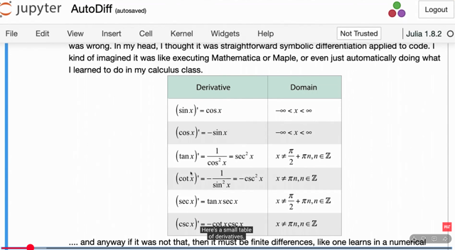</kbd></p>

> [!NOTE]
> đại khái là gs nói automatic differentiation ko phải là cái này, nơi mà ta
> dựa vào bảng các công thức tính đạo hàm để tính

<br>

<a id="node-157"></a>

<p align="center"><kbd>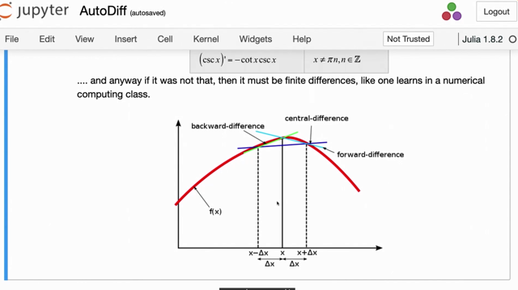</kbd></p>

🔗 **Related:** [LEC 3 PART 2 FINITE-DIFFERENCE APPROXIMATIONS](untitled.md#node-104)

> [!NOTE]
> đại khái là ta có thể kiểm tra bằng numerical gradient, có thể có các 
> cách làm khác nhau như đã biết.
>
> Tuy nhiên câu hỏi luôn là, nên lấy `Δx` như thế nào. Tất nhiên ta muốn
> `Δx` rất nhỏ, nhưng nhỏ quá thì sẽ gây lỗi (catastrophic cancellation)
>
> Và trong bài trước gs Steve đã nói về good rule of thumb cho cái này
> (Cái biểu đồ error giảm dần khi `Δx` nhỏ dần nhưng nhỏ quá thì nó
> lại tăng vọt lên)

<br>

<a id="node-158"></a>

<p align="center"><kbd>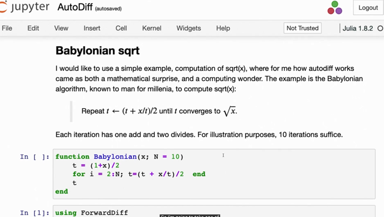</kbd></p>

> [!NOTE]
> gs lấy ví dụ về cái algoritm cổ đại này Babylonian square root: Thuật
> toán là ta sẽ đi tìm √x. Bằng cách tính t `=` `(1+x)/2`  và sau đó chạy vòng
> ```text
> lặp liên tục tính và gán t = (t + x/t)/2 thì dần dần t sẽ → √x
> ```
>
> trong hình là define hàm Babylonian nhận vào x là con số cần tính căn
> bậc hai, và N là số vòng lặp, default `=` 10

<br>

<a id="node-159"></a>

<p align="center"><kbd>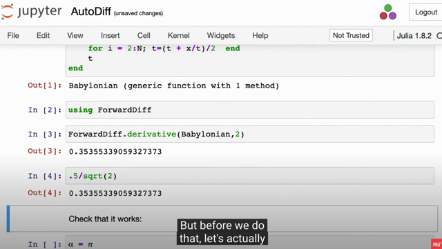</kbd></p>

> [!NOTE]
> Gs dùng ForwardDiff.derivative(Babylonian, 2) và tính `1/2` √2
> ra chung kết quả.
>
> Là sao nhỉ, gs chưa giải thích

<br>

<a id="node-160"></a>

<p align="center"><kbd>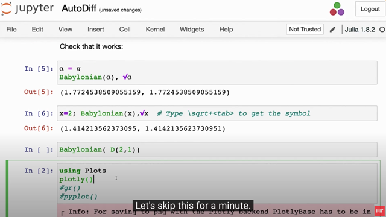</kbd></p>

> [!NOTE]
> Đại khái là check thì có vẻ cái hàm Babylonian làm tốt
> nó tính ra √2 cùng đáp án với hàm square root

<br>

<a id="node-161"></a>

<p align="center"><kbd>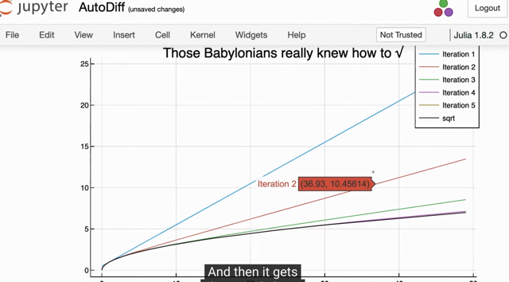</kbd></p>

> [!NOTE]
> đại khái là cái hình này gs muốn ta hiểu rằng đúng là cái Babylonian
> algorithm work, vì với các iteration khác nhau, thì dần dần đồ thị của
> số (một hàm số định nghĩa bởi việc chạy Babylonian với số vòng
> lặp khác nhau). Thì thấy khi càng nhiều vòng lặp thì hàm số nó càng
> trở nên giống hàm bậc hai.

<br>

<a id="node-162"></a>

<p align="center"><kbd>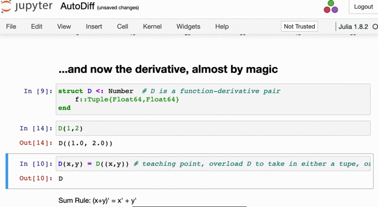</kbd></p>

> [!NOTE]
> Thế thì mục tiêu là ta sẽ xây dựng hàm đạo hàm của Babylonian.
>
> Thế thì như đã nói, "hàm" Babylonian đang ráng làm cái việc của
> hàm f(x) `=` √x.
>
> Vậy thì ta dù biết rằng f'(x) `=` `-1/√x.` Đó là (symbolic) derivative.
>
> Gs cho rằng ta sẽ ko cần cái này, và cũng ko tính đạo hàm theo
> kiểu finite difference luôn. 
>
> Cụ thể ta sẽ chỉ cần 9 dòng code để làm.
>
> 3 Dòng đầu tiên gs define một Julia type (kiểu như class),
>
> Và nó đơn giản chỉ là đại diện cho MỘT CẶP SỐ, ví dụ như
> dùng nó để tạo cặp số (1,2)
>
> Ví dụ như trong java mình tạo class có 2 field để chứa 2 số vậy
> và mục đích là để một số chứa giá trị của hàm số, một số chứa
> giá trị của đạo hàm

<br>

<a id="node-163"></a>

<p align="center"><kbd>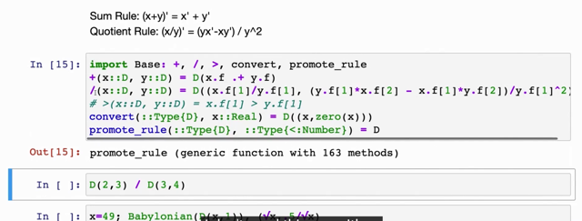</kbd></p>

> [!NOTE]
> 5 dòng tiếp theo là gs kiểu như yêu cầu Julia cho phép định nghĩa
> lại  phép cộng và chia giữa hai cặp số
>
> Thì với định nghĩa phép cộng đại khái giống như nói rằng:
>
> Khi tao cộng hai cái D object thì giá trị hàm số kết qủa sẽ là tổng
> của hai giá trị hàm số (con số thứ nhất của mỗi D)
>
> Và giá trị đạo hàm cũng là tổng hai giá trị đạo hàm (con số thứ 2)
>
> Nhìn kĩ: `+` (x::D, y::D) `=` D(x.f **.+** yf)  thì **.+ chính là
> elementwise cộng hai vector x.f và y.f**mà x.f[1], y.f[1] chính là con số thứ 1 của mỗi cặp, như đã nói sẽ
> thể hiện gía trị hàm số. Còn x.f[2], y.f[2] sẽ là số thứ hai thể hiện
> giá trị đạo hàm
>
> như vậy mình hình dung rằng tí nữa, khi "forward" mà nó  CỘNG
> HAI NODE LẠI, thì ĐẠO HÀM CỦA CŨNG LÀ TỔNG ĐẠO HÀM

<br>

<a id="node-164"></a>

<p align="center"><kbd>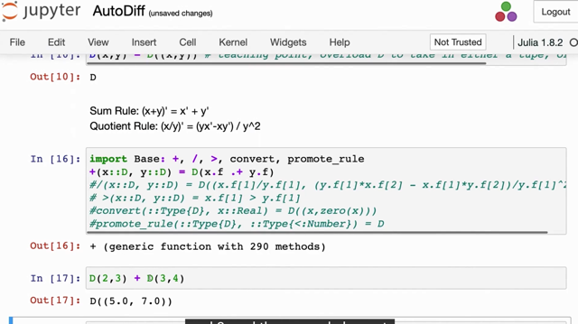</kbd></p>

> [!NOTE]
> Ví dụ cộng D(2,3) với D(3,4)

<br>

<a id="node-165"></a>

<p align="center"><kbd>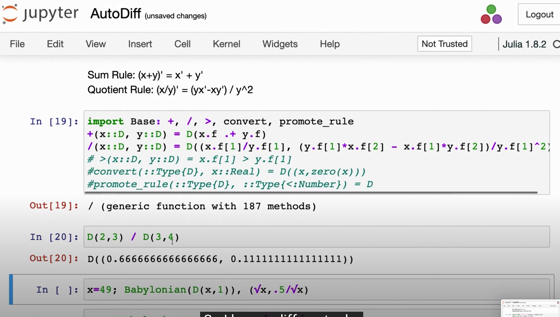</kbd></p>

> [!NOTE]
> tương tự với phép chia.
>
> Với phép chia, thì khi con số thứ nhất (tức giá trị hàm số) 
> của kết quả thì dĩ nhiên là lấy số thứ nhất của x (x.f[1]) chia
> số thứ nhất của y (y.f[1])
>
> ```text
> Nhưng đạo hàm thì theo quotiont rule ta biết (u/v)' = (u'v - v'u)/v^2
> ```
> nên nó sẽ lấy (x.f[2]*y.f[1] `-` x.f[1]*y.f[2]) `/` y.f[1])^2

<br>

<a id="node-166"></a>

<p align="center"><kbd>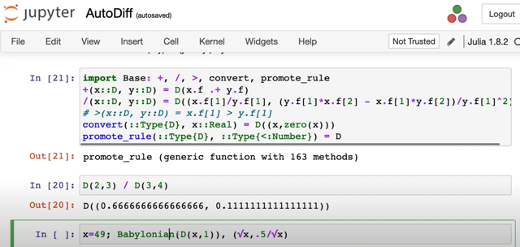</kbd></p>

> [!NOTE]
> Hai dòng convert.. với promote.. đơn giản là đặt ra rule cho Julia
> rằng khi nó nó gặp số thực thì tự động chuyển nó thành D object
> với giá trị thứ 2 cho bằng 0.
>
> Còn dòng promote thì bảo Julia là khi nó thấy yêu cầu cộng một
> D với một con số, thì tự động hiểu rằng kết quả sẽ được nâng
> thành D (nâng như thế nào thì được định nghĩa bởi dòng convert)

<br>

<a id="node-167"></a>

<p align="center"><kbd>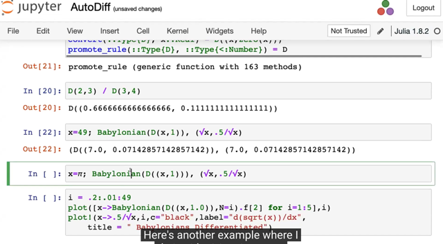</kbd></p>

> [!NOTE]
> Thế thì cái hay là, dù không cần chỉnh sửa gì cái hàm Babylonian lúc nãy
> thì bây giờ gọi nó với input là một D object, có giá trị của số thứ nhất là x,
> giá trị của số thứ hai là 1.
>
> Tại sao số thứ 2 là 1 gs sẽ giải thích sau
>
> Thì kết qủa cho thấy nó tính ra giá trị f(x) `|x=` 49 `=` √49 đúng là 7 và quan
> ```text
> trọng là f'(x) |x = 49 đúng là = 1/2√x | x=49 = 0.0714...
> ```
>
> ```text
> f(x) = √x = x^1/2 → f'(x) = 1/2x^(-1/2) = 1/2√x
> ```

<br>

<a id="node-168"></a>

<p align="center"><kbd>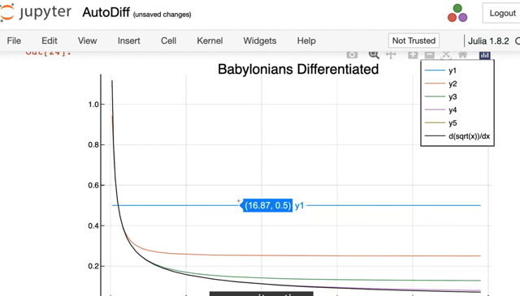</kbd></p>

> [!NOTE]
> đại khái là tương tự, biểu đồ cho thấy với các iterative thì hàm đạo
> hàm do thuật toán babylonian cũng ngày càng giống đồ thị của hàm
> `1/2√x` (chưa hiểu lắm nhưng đại ý là minh họa rằng thuật toán work
> ok)

<br>

<a id="node-169"></a>

<p align="center"><kbd>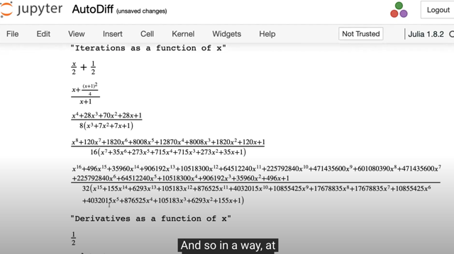</kbd></p>

<p align="center"><kbd></kbd></p>

<p align="center"><kbd>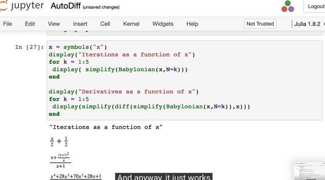</kbd></p>

> [!NOTE]
> đại khái là, như ta còn nhớ, thuật toán Babylonian về cơ bản là
> bắt đầu với t `=` `(1+x)/2`
>
> Sau đó nó cứ lặp đi lặp lại việc tính trung bình của t và `x/t:`
>
> ```text
> ⇨ t2 = [(1+x)/2 + x/[(1+x)/2]]/2
> ```
>
> ```text
> = [(1+x)/2 + 2x/(1+x)]/2
> ```
>
> ```text
> = (1+x)/4 + x/(1+x)
> ```
>
> ```text
> = (1+x)^2/4(1+x) + 4x/4(1+x)
> ```
>
> ```text
> = [(1+x)^2 + 4x] / 4(1+x)
> ```
>
> ```text
> = [(1+x)^2/4 + x] / (1+x)
> ```
>
> `=` **[x `+` `(1+x)^2/4]` `/` `(1+x)`
>
> Tương tự t2 `=` ...
>
> Để rồi khi chạy tới iteration thứ 5 thì cơ bản là nó đang dùng
> cái hàm số dài ngoằng trong hình là hàm đa thức bậc 16
> chia cho một đa thức bậc 15
>
> Và cái đồ thị vừa rồi cho thấy rằng cái hàm số dài ngoằng
> này có thể đóng vai trò approximate cho hàm f(x) `=` √x**

<br>

<a id="node-170"></a>

<p align="center"><kbd>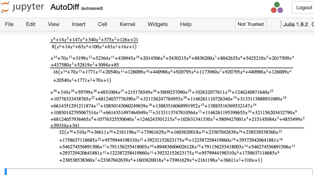</kbd></p>

> [!NOTE]
> tương tự, tại step 5 của Babylonian algorithm về cơ bản là nó
> đang tính cái hàm đa thức dài ngoài này để tính derivative
> để rồi có thể thấy nó có thể approx cho hàm `1/2√x`

<br>

<a id="node-171"></a>

<p align="center"><kbd>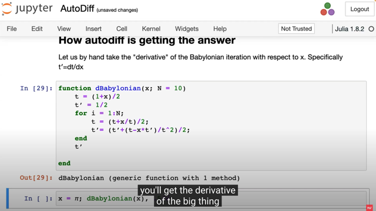</kbd></p>

> [!NOTE]
> Thế thì gs nói ông muốn ta xem kiểu như hồi xưa người ta tính
> derivative như thế nào.
>
> Ta mới xem hàm dBabylonian (hiểu nôm na là nó tính đạo hàm của "
> hàm Babylonian" (again, mình hiểu hàm Babylonian là một iterative
> algorithm nhưng đương nhiên bản thân nó vẫn là một function (vì nó
> nhận vào input và trả ra output)
>
> Thế thì có thể thấy, đoạn code trong function về cơ bản là thuật toán
> ```text
> Babilonian, nhưng có thêm t', mà t' = 1/2 chính là dt/dx = d/dx (1+x)/2,
> ```
> tức là  derivative của cái line trước đó, tức là `dt/dx`
>
> Tương tự cái dòng t' `=` (t' `+` (....) cũng vậy, ko khó để thấy nó là `dt/dx` với
> ```text
> t = (t+x/t)/2
> ```
>
> Thế thì ý gs muốn ta hiểu rằng, bằng cách này (tính derivative của mỗi
> line) , mà sau khi chạy algoritm thì nó sẽ cho ta derivative của cái
> function define bởi algorithm này mà ta hoàn toàn ko dùng analytic
> (symbolic) hay finite difference

<br>

<a id="node-172"></a>

<p align="center"><kbd>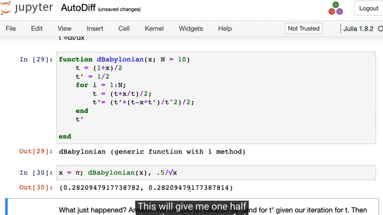</kbd></p>

> [!NOTE]
> Kết quả có thể thấy là nó tính khá đúng khi `dBabylonian(π)` `=` ra xấp
> xỉ kết qủa của hàm `1/2√π`  (again, nhắc lại rằng "hàm" Babylonian(x)
> đang xấp xỉ hàm f(x) `=` √x, và dBabylonian(x) đang xấp xỉ hàm f'(x) `=` `1/2√x)`

<br>

<a id="node-173"></a>

<p align="center"><kbd>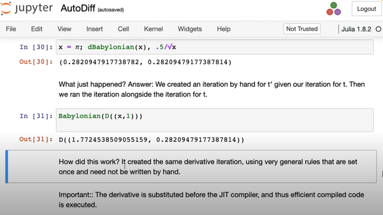</kbd></p>

> [!NOTE]
> Gs nói là về cơ bản ta kiểu như (overload) là cụm từ đã ta được
> học lần đầu trong Algorithm For Optimization Chapter 2 có nghĩa
> đại khái là ta yêu cầu máy tính cho ta định nghĩa lại các operation
> cơ bản để trong đó ta đặt ra các quy tắc tính đạo hàm của các
> operation đó
>
> Ví dụ như lúc nãy, khi ta define lại phép `+` cũng như `/` thì ta kiểu
> như dạy cho máy tính là "à, nếu chia hai Dual object thì mày cái số
> đầu thì mày kết quả là phép chia của số đầu của hai Dual và đó là
> giá trị của function mà ta chia hai Dual, còn số sau thì mày lấy
> theo rule này (quotient rule) đó sẽ là derivative của cái hàm (chính
> là cái mà mình gọi là local gradient)
>
> Ví dụ input là hai Dual u và v ⇨ và ta tính `u/v` thì nó sẽ cho ra  môt
> Dual có số thứ nhất, tức real part là số thứ nhất của u `/` số thứ
> nhất của v: `u[1]/v[1],` để rồi nó chính là giá trị của `u/v`
>
> Còn số thứ hai, sẽ theo rule, `=` [u[2]v[1] `-` `u[1]v[2])/v[1]^2` thì chính
> là mang giá trị của `(u/v)'`
>
> ⇨ từ [u value, u' value] và [v value, v' value] → [u value `/` v value,
> `(u/v)'` value]
>
> hay nói vầy cho dễ nè:
>
> [u value, `du(x)/dx` value] và [v value, `dv(x)/dx` value] → [u value `/` v
> value, `d(u(x)/v(x))/dx` value]
>
> Để rồi, khi máy tính nó tính toán các basic operation thì nó đã 
> được hướng dẫn để tính luôn các derivative

<br>

<a id="node-174"></a>

<p align="center"><kbd>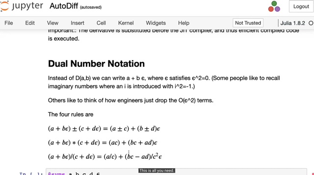</kbd></p>

> [!NOTE]
> đại khái là gs nó rằng thay vì dùng D(a,b) (tức dưới dạng một cặp số
> dual numbers)  ta có thể thể hiện nó ở dạng a `+` `bε` (đây là điều đã
> học trong Alg4Opt) với quy ước `ε^2`  `=` 0.
>
> Để rồi cái này trông hao hao như số phức a `+` bi với i^2 theo quy
> ước `=` `-1`
>
> Và từ đó ta ĐỊNH NGHĨA RA CÁC RULE ĐỂ CỘNG TRỪ NHÂN
> CHIA HAI SỐ DUAL NÀY
>
> Và trong sách Alg4Opt mình cũng đã biết rằng khi pass dual number
> này vào hàm smooth bất kì thì ta sẽ có thể có cả giá trị hàm số lẫn
> giá trị đạo hàm của hàm số, mà trong sách đó ta đã thấy nó xuất
> phát từ Taylor series
>
> Vậy ở đây, các rule này chính là tương ứng với việc ta define lại để
> máy tính nó biết các luật chơi khi gặp các operation đối với các dual
> number này.
>
> ```text
> Cụ thể khi (a + bε) +/- (c + dε) = (a +/- b) + (b +/- d) ε thì b +/- d chính
> ```
> là `Σ` rule của tính đạo hàm
>
> tương tự (bc `+` ad) `ε` chính là product rule
>
> và (bc `-` `ad)/c^2` chính là quotient rule.

<br>

<a id="node-175"></a>

<p align="center"><kbd>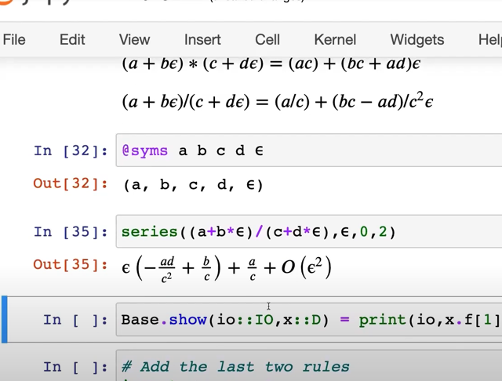</kbd></p>

> [!NOTE]
> có thể thấy gs minh họa (à ông nói trong Julia ta có thể dùng
> symbolic  tức là thay vì dùng các giá trị hữu hình thì có thể dùng
> ```text
> symbol, đại khái là vậy để thấy khi chia (a + bε) cho (c + d =ε) thì kết
> ```
> ```text
> quả là a/c + (bc-ad)/c^2 ε)
> ```

<br>

<a id="node-176"></a>

<p align="center"><kbd>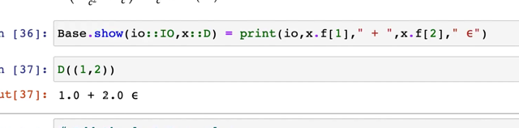</kbd></p>

> [!NOTE]
> ở đây gs nói ta có thể dạy hoc Julia khi nhân lệnh in một Dual 
> thì in nó ra ở dạng a `+` `bε`
>
> 1 `+` 2 `ε` có thể được nhìn nhận là first order expansion của x^2
> gần x `=` 1. Là sao?

<br>

