# Lec 7 P1: Derivative Of Random Functions

📊 **Progress:** `19` Notes | `19` Screenshots

---

<kbd>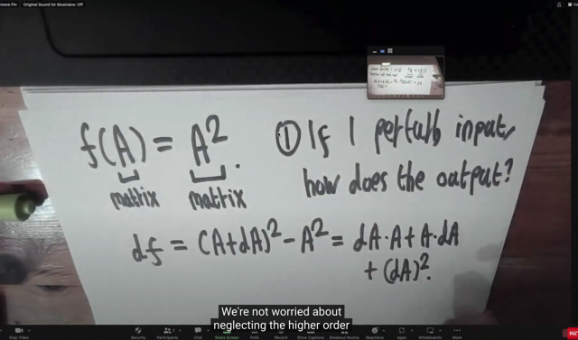</kbd>

> [!NOTE]
> Bài này họ sẽ dạy ta cách tính đạo hàm của hàm random.
>
> Đầu tiên, gs lấy ví dụ về hàm matrix -> matrix này, để muốn nói rằng
> khi gặp bài toán này, nếu làm theo kiểu single variate calculus (hiểu
> nôm na là làm theo kiểu lắt nhắt, riêng lẻ kiểu như dA^2 / Aij) thì sẽ
> rất khó. Từ đó thúc đẩy ta nghĩ về câu hỏi bản chất của đạo hàm.
>
> Bản chất của đạo hàm đó là :
>
> 1) khi perturb input chút xíu thì output thay đổi ra sao.
>
> Như ở đây ta thể hiệu điều đó bằng cách tính df (vi phân của f, =
> f(A+dA) - f(A)) = (A+dA)^2 - A^2.
>
> Khai triển ra ta sẽ có dAA + AdA + (dA)^2.
>
> Sau đó ta sẽ bỏ đi (dA)^2 để có 1st approximation (linearization) chính
> là (giúp ta rút ra) derivative của f(A) là gì.
>
> Nhưng gs nhấn mạnh bản thân dAA + AdA + (dA)^2 chính là trả lời
> câu hỏi 1) ở trên, đây là khoảng thay đổi của f khi input perturb

 

<kbd>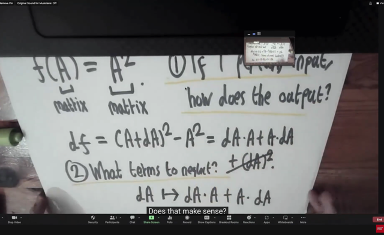</kbd>

> [!NOTE]
> Và câu hỏi thứ 2) Bỏ đi cái gì.
>
> Sở dĩ như vậy vì khi ta tìm derivative của f(x) wrt x ta đang muốn
> tìm một (tạm gọi là) "công thức" liên hệ dx (tức d input) với df một
> cách tuyến tính.Nói cách khác, ta muốn tìm một linear operation act
> on dx (kí hiệu là f'(x)[dx]) thì linear operation đó chính là derivative
>
> Từ đó ở đây ta sẽ bỏ đi (drop) (dA)^2 là term bậc 2 của dA
>
> Và ta có một linear mapping (linear operation): dA -> dA.A + A.dA

 

<kbd>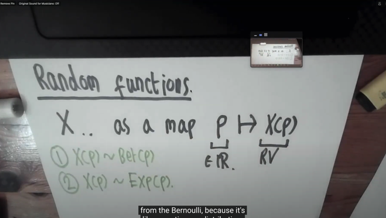</kbd>

> [!NOTE]
> Thế thì qua Random functions.
>
> Gọi X là một r**andom variable value function** map số thực **p** và
> **X(p) là một random variable. ? 
>
> (Chỗ này có vẻ hơi khó hiểu. Theo stat110 và Casella book mình 
> hiểu random variable là function map giữa một possible outcome
> của experiment với số thực.)**
>
> Ví dụ có thể **X(p) ~ Bern(p)** ý nghĩa là lúc này **X(p) sẽ là một Bern(p)
> random variable**. 
>
> Chỗ này lại gây khó hiểu, X(p) là random variable? 
>
> Để rồi nó sẽ mang hai possible value là 1 với xác suất
> xảy ra = p và 0 với xác suất xảy ra 1 - p
>
> Hoặc nếu X(p) ~ Exp(p) thì X(p) là Exponential (p) rv.
>
> Nói chung có thể hiểu X(p) là random variable với distribution có
> parameter p

 

<kbd>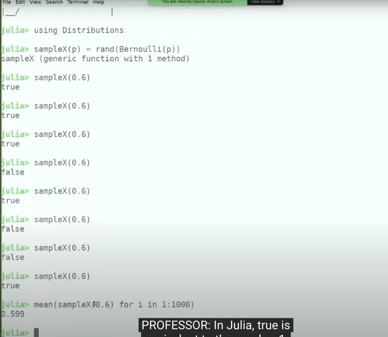</kbd>

> [!NOTE]
> ảnh mới khai báo một function sampleX(p) dùng rand() pass vào
> một Bernoulli(p) tạm hiểu là function này sẽ nhận input là p làm
> parameter và trong ruột nó sẽ  khởi tạo một Bernoulli object với
> tham số p và pass vào rand(). Thì hàm rand() sẽ sampling một
> random number ~ Bern(p)
>
> ảnh mới tính mean của 1000 cái sample như vậy cho thấy nó ~= 0.6
> vì sampling theo Bern(p=0.6) nên 60% thời gian nó sẽ ra 1 (xác suất
> ra possible value 1 là 0,6) và 40% là ra 0.

 

<kbd>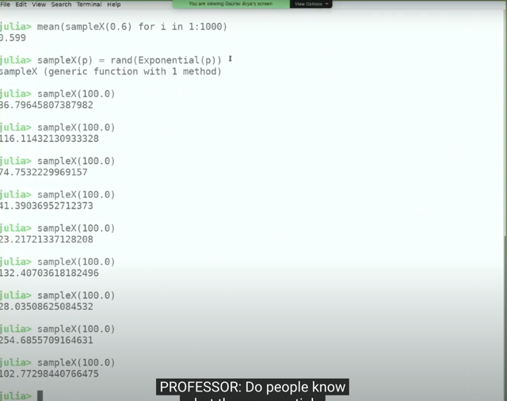</kbd>

> [!NOTE]
> Hoăc là sampling từ Expo(1000)
>
> Tại đây thử nhớ lại, Expo distribution đã học ở stat110. Điều đầu
> tiên mình nhớ nó là continuous distribution. Và cái quan trọng nhất
> khi nhớ về probability distribution là story của nó. 
>
> Khi X ~ Expo(λ) thì story của nó là khoảng thời gian đợi giữa những
> event. Lấy ví dụ như bối cảnh chờ email gửi đến trong một khoảng
> thời gian. Nếu gọi X là số email gửi đến trong khoảng thời gian t
> thì nó sẽ có thể được approx bởi Pois(λt) distribution và thời gian
> chờ đợi đến khi có email sẽ ~ Expo(λt)

 

<kbd>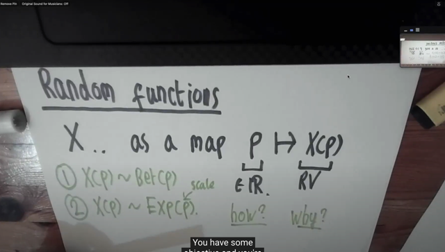</kbd>

> [!NOTE]
> xong ảnh nói về why và how (trong việc tính derivative)
>
> Thì với các function khác chữ why là rõ ràng việc tính derivative
> giúp ta trong bài toán tối ưu khi ta cần dựa vào gradient trong
> thuật toán tối ưu như gradient descent (mình sẽ học sâu hơn
> trong phần Algorithm của EE364A)

 

<kbd></kbd>

> [!NOTE]
> Câu hỏi gs đề nghị thử trả lời tại sao ta cần tính đạo hàm của
> random function.
>
> Thử trả lời: Mình đã gặp nhiều chỗ mà ta dùng random function
> và cần backprop qua random function trong deep learning.
> Ví dụ như trong parameter initialization, hoặc trong dropout layer

 

<kbd>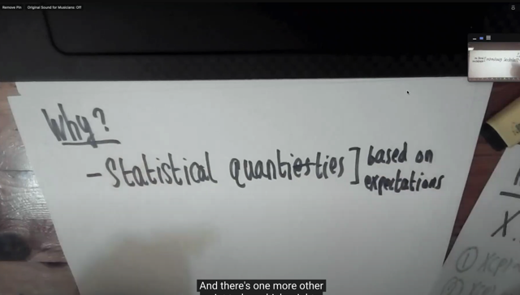</kbd>

> [!NOTE]
> Một cái nữa mà gs nói nhờ EE364A bài 10 mà mình có thể hiểu
> Đó là khi ta gặp bài toán ROBUST ESTIMATION: minimize ||Ax - b||
> nhưng A là matrix random variables.
>
> Để rồi cách tiếp cận STOCHASTIC, là ta minimize E||Ax - b||
>
> Ở đây ảnh nói về Statistical quantities based on expectation có lẽ
> cũng là ý này

 

<kbd>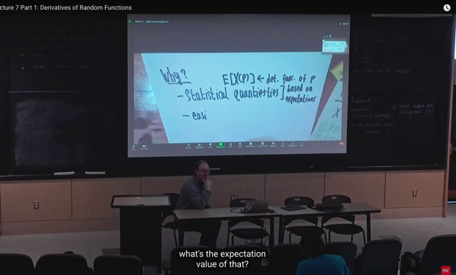</kbd>

> [!NOTE]
> Thế thì đại khái là gs nói rằng dù gì thì ta cũng quan tâm đến
> average  vậy tại sao không viết function tính average luôn, Tức là ta
> sẽ tính E(X(p)) khi đó nó sẽ là DETERMINISTIC function theo p.
>
> Gs Alan: Quick  question nếu X(p) ~ Bern(p) thì E(X) là gì?
>
> E(X) = Σxi P(X=xi) xi (xi là possible values của X)
>
> = p*1 + (1-p)*0 = p

 

<kbd>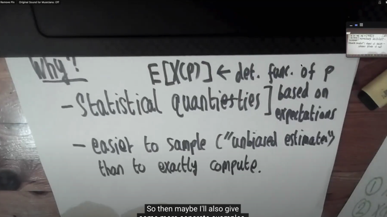</kbd>

> [!NOTE]
> Đại khái là, ảnh nói rằng sẽ dễ hơn khi ta SAMPLE (từ một
> unbias estimate) hơn là tính chính xác một cách ANALYTICALLY.
>
> Chưa hiểu lắm nhưng ta có thể nhớ trong cs231n, bên trong mô
> hình VAE có cơ chế sampling (ít nhất là ta có thể biết ổng đang
> nói về cái gì)

 

<kbd>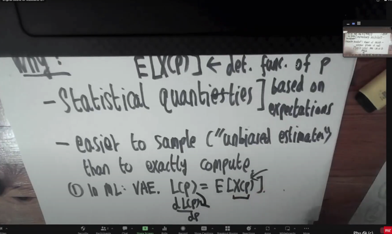</kbd>

> [!NOTE]
> Ảnh nói ví dụ trong Deep Learning, với mô hình VAE  (ta đã học
> trong cs231n), rằng bản chất nội tại trong  mô hình này đã có
> randomness.
>
> Cụ thể là loss function của VAE: L(p) = E[X(p)] (L(p) đơn giản
> hiểu là loss function, như đã quen thuộc, là function theo model
> parameters p.
>
> Thế thì, ảnh nói rằng, model VAE cho ta một "function", cơ chế
> để "stochastic estimate L(p)". Vậy làm sao ta tính dL(p)/dp
>
> (dừng lại một chút, lúc làm assignment của cs231n mình đã học
> vụ này rồi, ôn lại sẽ nhớ)

 

<kbd>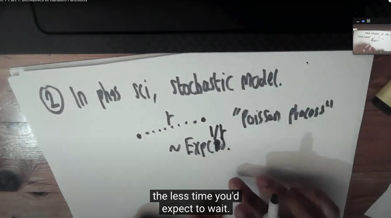</kbd>

> [!NOTE]
> một ví dụ nữa trong physical science, ko hiểu lắm nhưng đại ý là 
> ta có thể mô hình việc tương tác giữa các phân tử (molecule)
> vốn có xác suất xảy ra là r bởi một cái gọi Poisson process.
>
> Và thời gian chờ cho đến khi xảy ra tương tác sẽ ~ Expo(1/r)
>
> Cái này ý tương tự như trong Stat110 có ví dụ: N là số email nhận
> được trong một khoảng thời gian t là một Pois(λt) thì T là thời gian
> chờ để nhận email đầu tiên sẽ ~ EXpo(λ)

 

<kbd>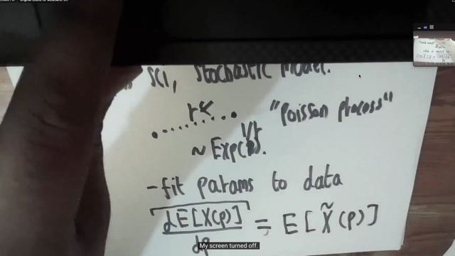</kbd>

> [!NOTE]
> Và vấn đề là nếu ta ko biết giá trị của r. Thì ta sẽ cần fit nó dựa
> trên data. Và bài toán lại trở về bài toán optimization hoặc
> statiscal inference
>
> Trong đó ta sẽ cần tính derivative của random function
>
> Ta sẽ tìm "random program nơi mà average sẽ là derivative 
> của average cuả original program":

 

<kbd>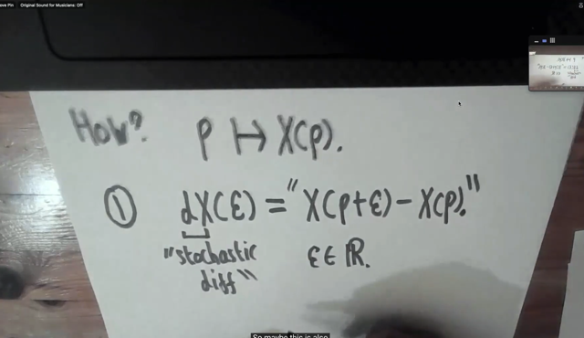</kbd>

> [!NOTE]
> đầu tiên ta sẽ quan tâm đến việc trả lời câu hỏi, là khi p thay đổi chút
> xiú thì X thay đổi ra sao.
>
> Thì câu trả lời là: Khi p thay đổi ε (hay dp) thì X thay đổi từ X(p) thành
> X(p + ε) để có dX(ε) = X(p + ε) - X(p)
>
> Và dX(ε) mang ý nghĩa là hàm tính sự thay đổi của X khi p thay đổi
> ε.
>
> Về mối quan hệ giữa p và X(p). Như đã nói lúc đầu, X(.) mang ý
> nghĩa như một function nhận vào giá trị tham số p để cho ra random
> variable có distribution nào đó theo tham số đó.
>
> (Chú ý nó không phải là X({s}) mang ý nghĩa random variable là 
> function mapping giữa possible outcome → real number.) 
>
> Mà ta hiểu X() như một function, tạo ra / cho ra random variable dựa
> trên tham số đưa vào. Ví dụ như Bern(p) chẳng hạn, đưa vào giá trị
> của p thì ta mới có một random variable thuộc Bern distribution có 
> tham số xác định là p

 

<kbd>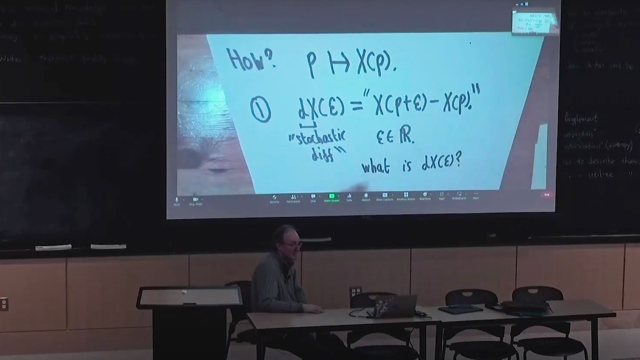</kbd>

> [!NOTE]
> Câu hỏi gs đề nghị trả lời thử là dx(ε) là cái giống gì?
>
> Như đã nói X(p) là random variable với tham số cuả distribution có
> giá trị là p. Thì dX(ε), mình cho rằng cũng là một random variable.
> Bởi vì dX(ε) = X(p + ε) - X(p), tức là hiệu của hai random variable,
> cũng sẽ là random variable. Vì với các possible value khác nhau
> của X(p) và X(p+ε) thì dX(ε) sẽ có các possible value khác nhau
>
> Gs xác nhận đó là câu trả lời chính xác
>
> Nhưng trong bài giảng này có vẻ như ta cần hiểu khác một chút về
> X(p). Nó không chỉ là một random variable như cách hiểu của 
> stat110. Mà theo như những gì anh này nói, rằng nó rằng "it give
> you a procedure for sampling from a distribution" thì nó mang ý
> nghĩa của một sampling function (một comment cũng nói ý này)
>
> Có nghĩa là, X(p) trong bối cảnh bài giảng này, là một sampling
> function. Để rồi function này, ví dụ tạo Expo(p) rv đi. Thì nhận vào p
> nó sẽ sampling các giá trị possible value của một random variable
> ~ Expo(p).
>
> Thế thì mình sẽ hiểu dX(ε) là một sampling function để đưa vào p
> nó sẽ dùng X(p + ε) và X(p) để sampling ra hai giá trị của Expo(p + ε)
> và Exp(ε) rồi tính ra hiệu của chúng
>
> " You sample from X of P plus epsilon, you sample from X of P, and you 
> subtract so that is"

 

<kbd>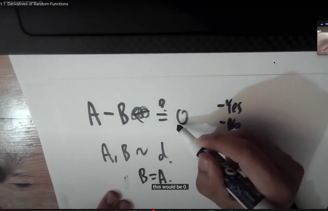</kbd>

> [!NOTE]
> Nếu A và B cùng một distribution. Thì A - B bằng cái gì?
>
> Câu trả lời là tùy, nếu A, B độc lập thì chưa chắc nó đã bằng 0.
>
> Nếu còn nếu A, B không độc lập ví dụ như A = B luôn thì khi đó
> A - B = 0

 

<kbd>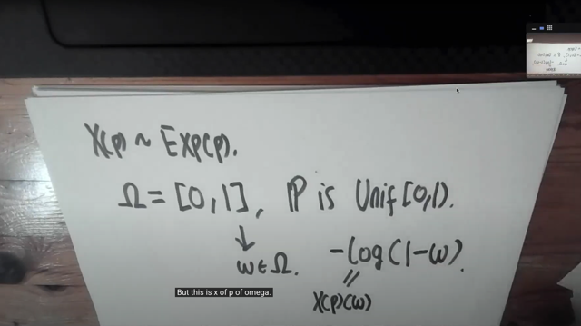</kbd>

> [!NOTE]
> Thế thì ở đây anh này đang nói đến chính xác là universality của uniform
> distribution đã học trong stat110 và Casella book. Nó có hai phần, như vầy:
>
> Nếu X ~ F (tức X là random variable tuân theo distribution có CDF là F) thì F(X)
> sẽ ~ Unif(0, 1). Ta biết F là function, thì apply nó lên một random variable X hoàn
> toàn hợp lệ để có một function mới và nó sẽ là một Uniform (0, 1)
>
> Ngược lại. Nếu U ~ Unif(0,1) thì Finv(U) sẽ ~ F.
>
> Thử chứng minh lại:
>
> Để chứng minh vế 1, ta sẽ xem xét cdf của F(X):
>
> Từ ý nghĩa của cdf là P(F(X) ≤ t).
>
> Xét event F(X) ≤ t, bản chất nó là {s ∈ Ω: F(X)({s}) ≤ t} nếu diễn tả nó theo
> sample space gốc, hoặc {x ∈ range X: F(x) ≤ t} nếu diễn tả nó theo sample space
> của X.
>
> ⇨ P(F(X) ≤ t) = P({x ∈ range X: F(x) ≤ t}) và theo định nghĩa hàm xác  suất
>
> = Σ {x ∈ range X: F(x) ≤ t} P(X = x)
>
> Thế thì vì F là cdf, nên nó sẽ thõa tính chất monotonic non-dereasing
>
> ⇨ F(x) ≤ t ⇔ Finv(F(x)) ≤ Finv(t) ⇔ x ≤ Finv(t)
>
> ⇨ {x ∈ range X: F(x) ≤ t} = {x ∈ range X: x ≤ Finv(t)}
>
> ⇨ P(F(X) ≤ t) = Σ {x ∈ range X: x ≤ Finv(t)} P(X = x)
>
> và đây chính là cdf của X evaluate tại Finv(t), tức P(X ≤ Finv(t)) và dĩ nhiên nó là
> F(Finv(t)) (vì F là cdf của X)
>
> và cái này nó bằng t.
>
> Vậy P(F(X) ≤ t) = t, tức cdf của Y = F(X) sẽ có công thức FY(t) = t
>
> Điều này đủ kết luận Y, hay F(X) chính là một Uniform(0,1)
>
> ====
>
> Chứng minh vế sau:
>
> Tương tự ta cũng xem cdf của Finv(U) với U~Unif(0,1)
>
> Theo định nghĩa, cdf của Y = Finv(U), hay FY(y) mang ý nghĩa là P(Finv(U) ≤ y)
>
> Xét event Finv(U) ≤ y , có bản chất trong sample space gốc là
>
> {s ∈ Ω: Finv(U)({s}) ≤ y} hoặc {u ∈ range U: Finv(u) ≤ y}
>
> = {u ∈ [0,1]: Finv(u) ≤ y}
>
> Vì F monotonic non-decreasing nên: Finv(u) ≤ y ⇔ F(Finv(u)) ≤ F(y) ⇔ u ≤ F(y)
>
> ⇨ Finv(U) ≤ y = {u ∈ [0,1]: Finv(u) ≤ y} = {u ∈ [0,1]: u ≤ F(y)}
>
> và đây chính là event (U ≤ F(y))
>
> Vây P(Finv(U) ≤ y) = P(U ≤ F(y)) = FU(F(y))
>
> Mà với U ~ Unif(0, 1) thì cdf của nó FU(u) = u
>
> Nên P(Finv(U) ≤ y) = P(U ≤ F(y)) = FU(F(y)) = F(y)
>
> Vậy P(Finv(U) ≤ y) = F(y).
>
> Mà vế trái, như đã nói, nếu gọi Y = Finv(U), thì P(Finv(U) ≤ y) chính là cdf của Y,
> và ta đang tìm cách xây dựng nó, để rồi ra kết quả là ..F(y) với F là cdf của X
>
> Vậy có nghĩa là cdf của Y (=Finv(U) có công thức chính là cdf của X. Từ đó kết
> luận Finv(U) chính là rv ~ distribution có cdf là F, hay Finv(U) ~ F

> [!NOTE]
> Vậy ta có thể áp dụng vào đây:
>
> X(p) ~ Exp(p), thì nếu lấy w ~ Unfi(0,1) thì Finv_X(p)(w) sẽ ~ Exp(p)
>
> Finv_X(p)(w) tức là inverse của cdf của X(p), mà cdf của nó, tức F_X(p)
> là cdf của Exp(p) có công thức là gì quên rồi nhưng ta có thể lập luận lại:
>
> Để lập luận ra cdf của Exp(λ) mình chỉ cần nhớ liên hệ giữa Pois và Expo:
>
> Bối cảnh là chờ email gửi tới. thì N = số email gửi tới trong khoảng thời
> gian t có thể mô hình bởi Pois(λt), và T = thời gian chờ đến khi có email
> gửi tới sẽ ~Expo(λ). Từ đó ta xây dựng cdf của Expo: P(T ≤ t)
>
> = 1 - P(T > t) = 1 - P(N = 0)  | vì event thời gian chờ > t cùng chính là (số
> email nhận được trong khoảng thời gian t là = 0)
>
> Từ đó dùng pmf của Pois(λ). Cái này thì phải ráng nhớ thôi:
>
> P(N=k) = e^-λ λ^k / k! ⇨ với N ~ Pois(λt) thì P(N=k) = e^-(λt) (λt)^k / k!
>
> ⇨ P(N = 0) = e^-(λt) (λt)^0 / 0! = **e^-(λt)**
>
> ⇨ P(T < t) = **1 - e^-(λt), t > 0**pdf: fT(t) = d/dt FT(t) = d/dt [1 - e^-(λt)]
>
> = d/dt [- e^-(λt)] = - d/dt e^-(λt) = -d/d(λt) e^(-λt) . d/dt (-λt)
>
> = - e^(-λt) . (-λ) = **λe^(-λt)   
>
> Có lưu ý một chút: Trong stat110, gs Blizstein khi nói về tham số của
> Pois thì ông ghi là Pois(λ) thì λ mang ý nghĩa là rate để pmf = e^-λ λ^k / k! 
> thì nếu ghi theo vậy thì cdf Exp(λ) sẽ có công thức là 1 - e^-(λt) 
>
> Để rồi mean sẽ là 1/λ 
>
> Nhưng có một cách ghi khác ví dụ như trong cuốn Statistical Inference
> của Casella & Berger thì ông ghi là Pois(β), để pmf = e^-(1/β) (1/β)^k / k! 
> thì Expo(β) có cdf = 1 - e^-(t/β) thì β mang ý nghĩa là scale, = 1 / rate
> Và mean sẽ là β 
>
> Nên ở trong lecture này, p chính là nói về scale của Expo, nên**Với X(p) ~ Exp(p) thì cdf của nó F_X(t) = **1 - e^-(t/p)**
>
> Xem thử inverse của nó là gì:
>
> nếu y = 1 - e^-x/p ⇔ e^-x/p = 1 - y ⇔ log(e^-x/p) = log(1 - y) 
>
> ⇔ -x/p = log(1 - y) ⇔ x = - p log(1 - y) 
>
> Vậy Finv_X(w) = **- p log(1 - w)  
>
> ====
>
> Và như vậy, ta nhớ gs Blizstein trong stat10 đã nói ứng dụng quan trọng
> của universality chính là giúp ta SAMPLING TỪ MỘT DISTRIBUTION F.**Bằng cách sampling từ một Uniform(0,1), vốn rất đơn giản, (trong python,
> rand() chính là làm việc này), để có w 
>
> Sau đó pass nó vào Finv_X(w) = - log(1 - w) / p ta sẽ có một sample sampling
> từ distribution F (tức Exp(p))

 

<kbd>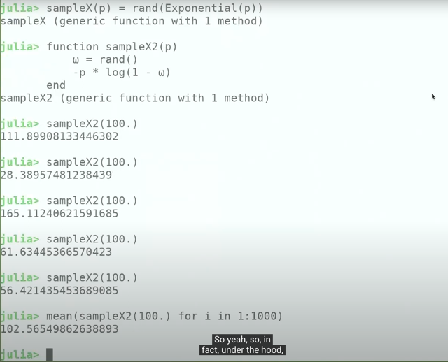</kbd>

> [!NOTE]
> Có thể thấy anh define function sampleX2(p), nó sẽ dùng rand() (trong
> Julia, nó cũng sẽ cho một random sampling từ Uniform(0,1)) để có w.
> Sau đó apply -p log(1 - w) và return.
>
> Thì mỗi khi gọi function này (truyền vào giá trị param p = 100) thì ta sẽ 
> có sample của một Expo(p) distribution
>
> Có thể thấy khi gọi mean của 1000 sample như vậy ra ~100 (chính là p)

 

<kbd>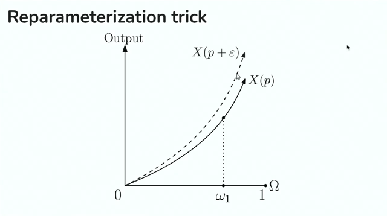</kbd>

 

