# Lec 7 P2: Second Derivatives, Bilinear Form, Hessian

📊 **Progress:** `22` Notes | `22` Screenshots

---
<a id="node-201"></a>

<p align="center"><kbd>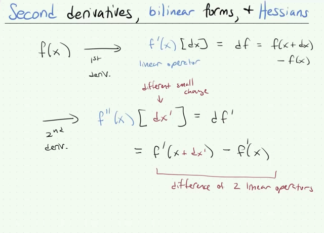</kbd></p>

> [!NOTE]
> Đại khái là ta đã biết rằng đạo hàm cấp một (first order derivative) của  hàm f, kí
> hiệu f'(x) có bản chất là **một linear operator** **act on khoảng thay đổi vô cùng
> nhỏ của x, tức dx**, kí hiệu f'(x)[dx] để tạo ra khoảng thay đổi nhỏ của f (tức df)
>
> ```text
> Do đó df = f'(x)[dx], và dĩ nhiên df cũng = f(x+dx) - f(x)
> ```
>
> Nên ta có:
>
> **df `=` `f(x+dx)` `-` f(x) `=` f'(x)[dx]**
>
> Với định nghĩa đó, hay đúng hơn là việc hiểu **bản chất của đạo hàm f'(x)** là
> **linear** **operator tác dụng lên dx**.
>
> Thì lấy ví dụ hàm **f(x) R^n `->` R (scalar value multivariate function)** thì ta hiểu
> bản chất của đạo hàm f'(x) là như vầy: Khi thay đổi vector x (thay đổi các
> component của nó) một khoảng vô cùng nhỏ dx, để có x `+` dx thì hàm f sẽ thay
> đổi df:
>
> df `=` `f(x+dx)` `-` f(x). Và theo định nghĩa trên, nó sẽ bằng f'(x)[dx]
>
> Thế thì, vì f là scalar value function, nên `f(x+dx)` `-` f(x) `=` df là scalar. Trong khi đó
> **dx là vector**. Dẫn đến ta cần một **linear operation nào đó** mà act on dx **cho ra
> scalar**. Và linear operator có khả năng này chỉ có thể là phép nhân vô hướng
> **(dot product) giữa dx và một vector khác**.
>
> Và vector đó, chính là **GRADIENT** vector **∇f**. Vậy linear operator ở đây, tức
> first derivative của f, **f'(x)** sẽ là **∇fTdx**: **f'(x)[dx] `=` ∇fTdx**
>
> Từ đó nó giúp ta tìm gradient vector ∇f: Bằng cách triển khai df `=` `f(x+dx)` `-` f(x)
> sao cho ra dạng một **linear operator act on dx** thì ví dụ như khi ta có **scalar
> function R^n `->` R** thì ta sẽ có kết qủa đó là derivative của f là phép dot product
> của một vector với vector  dx, hay linear operator act on dx nói đến chính là
> việc dot product một vector nào đó với dx, thì khi đó vector đó chính là gradient
> vector.
>
> Còn giả sử xét function f khác, là **vector value multivariate function R^m `->`
> R^n**. Thì df lúc này là R^n vector, trong khi **dx là R^m vector**.
>
> Thế thì first derivative f'(x)[dx] là**linear operator** sao cho map **R^m vector thành
> R^n vector**. Thì linear operator này chỉ có thể là **phép nhân matrix J với vector
> dx** (bản chất phép nhân matrix Ax là một linear operator)
>
> Và matrix đó chính là **JACOBIAN** matrix.
>
> Nên nếu có `R^m->R^n` function, thì bằng cách triển khai df `=` Adx thì A chính là
> Jacobian.
>
> `====`
>
> Thế thì tương tự, đạo hàm cấp 2 của f thực chất là đạo hàm cấp 1 của f': Khi
> thay đổi x một khoảng vô cùng nhỏ kí hiệu **dx'** (phân biệt với dx, chứ không phải
> dx' là đạo hàm gì cả), đạo **first derivative f'(x) sẽ từ f'(x) trở thành f'(x+dx')**, tức biến
> thiên **df' `=` `f'(x+dx')` `-` f'(x)**. Thì đạo hàm cấp 1 của f', tức đạo hàm cấp 2 của f, về 
> bản chất cũng là **LINEAR OPERATOR**act on vi phân dx': f''(x)[dx']
>
> **df' `=` `f'(x+dx')` `-` f'(x) `=` f''(x)[dx']**
>
> Thế thì cái linear operator act on dx' này chính là đạo hàm cấp 1 của f', tức
> cũng là đạo hàm cấp 2 của f.
>
> Vậy thì, như đã nói, bản chất của đạo hàm cấp 1 f' đã là một linear operator, act
> on dx. Nên `f'(x+dx')` `-` f'(x) là một linear operator mới.

<br>

<a id="node-202"></a>

<p align="center"><kbd>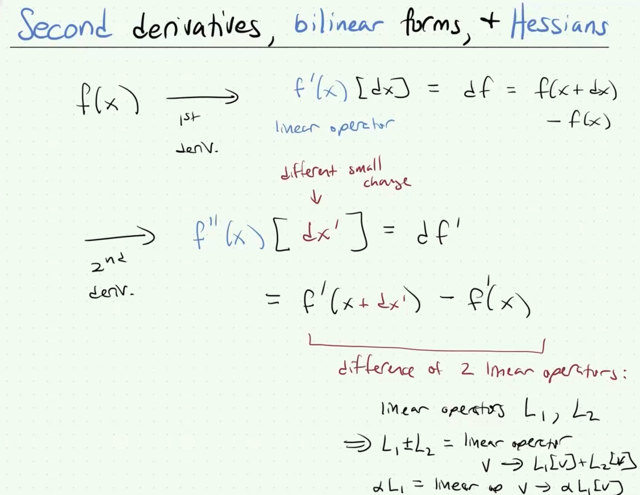</kbd></p>

> [!NOTE]
> Và như gs đã nói linear operator có thể được hiểu có tính chất
> **linearity của** vector space:
>
> Để rồi gỉa sử ta có hai **linear operator L1, L2**.
>
> Thì **L1+L2** **tạo một linear operator mới** mà khi **act on v sẽ cho
> kết quả**:
>
> **(L1+L2)[v] `=` L1[v] `+` L2[v]**
>
> Và **L1[αv] `=` `α` L1[v]**

<br>

<a id="node-203"></a>

<p align="center"><kbd>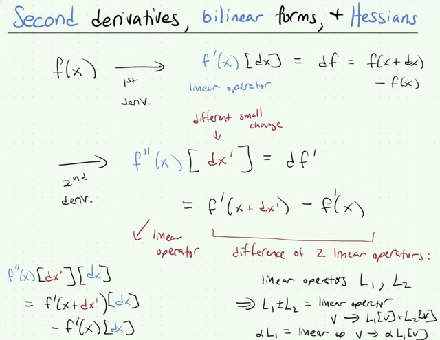</kbd></p>

> [!NOTE]
> Thế thì như đã nói:
>
> **df' `=` `f'(x+dx')` `-` f'(x) `=` f''(x)[dx']**
>
> Trong đó f''(x)[dx'] là linear operator act on dx' thì biết rồi.
>
> Nhưng `f'(x+dx'),` và f'(x) cũng là linear operator act on dx
>
> Nên `f'(x+dx')` `-` f'(x) tạo nên một linear operator mới, để rồi khi
> apply linear operator này đối với dx ta có:
>
> `(f'(x+dx')` `-` f'(x))[dx] `=` f''(x)[dx'][dx]
>
> Mà từ tính chất linearity của linear operator:
>
> ```text
> (f'(x+dx') - f'(x))[dx] = f'(x+dx')[dx] - f'(x)[dx]
> ```
>
> nên: **f''(x)[dx'][dx] `=` `f'(x+dx')[dx]` `-` f'(x)[dx]**

<br>

<a id="node-204"></a>

<p align="center"><kbd>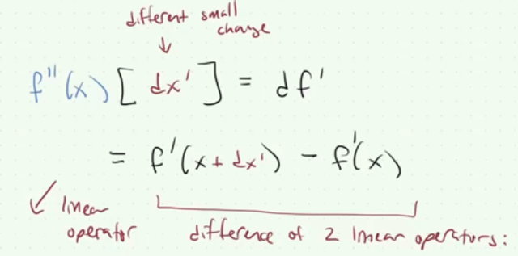</kbd></p>

> [!NOTE]
> Gs giải thích lại lần nữa ý nghĩa của cái này:
>
> Là ta làm tương tự khi định nghĩa đạo hàm của f:
>
> Khi x thay đổi thành x `+` dx khiến f(x) thay đổi thành `f(x+dx)` thì:
>
> **df `=` `f(x+dx)` `-` f(x) `=` f'(x)[dx]** mang ý nghĩa khoảng thay đổi **df**sẽ
> được tính bới là **linear operator act on dx**. Và linear operator đó
> là derivative của f: f'(x)
>
> Thì tương tự, khi x thay đổi thành x `+` dx'; khiến f'(x) trở thành `f'(x+dx')`
> thì **df' `=` `f'(x+dx')` `-` f'(x)** sẽ có thể được tính bởi một linear operator
> act on dx': **f''(x)[dx']**. Và linear operator đó là derivative của f'

<br>

<a id="node-205"></a>

<p align="center"><kbd>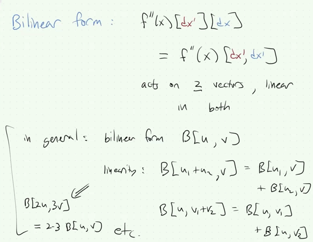</kbd></p>

> [!NOTE]
> Thế thì ta mới chú ý vào cái **f''(x)[dx'][dx]**, nó sẽ nhận hai input
> vector dx' và dx. Nó có tên là **BILINEAR FORM**.
>
> **f''(x)[dx'][dx]**
>
> Người ta có thể viết gọn lại thành **f''(x)[dx', dx]**
>
> Và nói chung **BILINEAR FORM** có tính **linearity**:
>
> Gọi **B** là bilinear form, thì **B[u, v]** (tức bilinear form act on u, v)
> thì **B[u1+u2, v] `=` B[u1, v] `+` B[u2, v]**
>
> Và **B[2u, 3v] `=` 2*3 B[u, v]**
>
> Thế thì ta nhớ **dx** là **small change của x** khi ta tính derivative:
>
> **df `=` `f(x+dx)` `-` f(x) `=` f'(x)[dx]**
>
> Còn **dx'** là **small change của x** khi ta tính **derivative của derivative**:
>
> **df' `=` `f'(x+dx')` `-` f'(x) `=` f''(x)[dx']**

<br>

<a id="node-206"></a>

<p align="center"><kbd>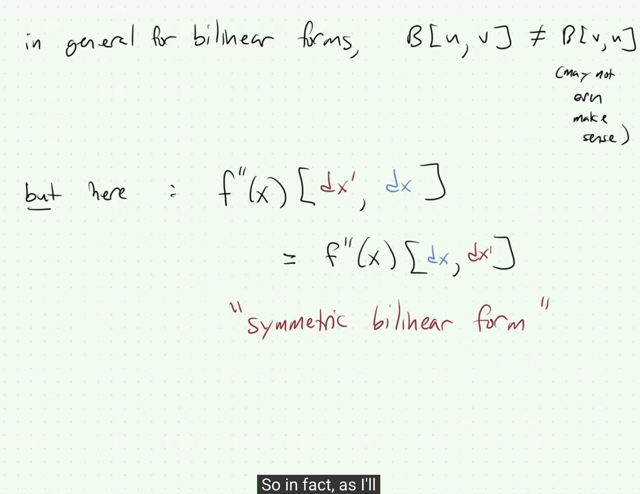</kbd></p>

> [!NOTE]
> **nói chung thì B[u, v] không bằng B[v, u]**
> Nhưng ở đây **f''(x)[dx', dx] `=` f''(x)[dx, dx']**

<br>

<a id="node-207"></a>

<p align="center"><kbd>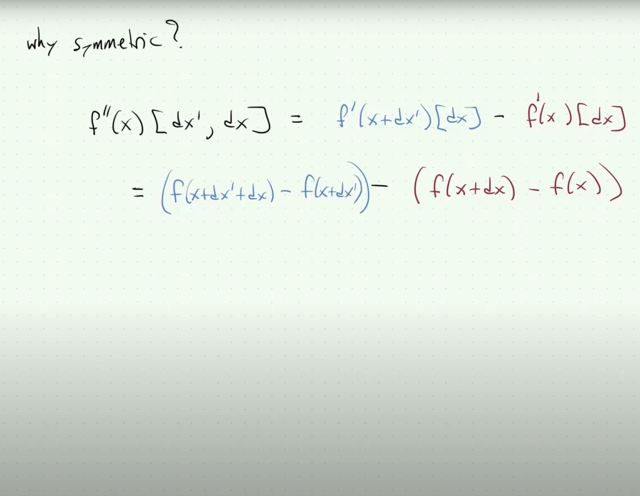</kbd></p>

> [!NOTE]
> Đầu tiên cứ lập luận lại từ đầu. Bữa trước ta có định nghĩa của first 
> derivative của hàm f như sau: thay đổi **x `->` x `+` dx** thì hàm f thay đổi
> df từ **f(x) `->` f(x+dx)**
>
> **df `=` `f(x+dx)` `-` f(x)** và cái này bằng**f'(x)[dx]**mang ý nghĩa là **linear 
> operator act on dx**, do đó đạo hàm **f'(x) có bản chất là linear operator.**
>
> ```text
> dx = f(x+dx) - f(x) = f'(x)[dx]
> ```
>
> Thế thì, nếu bây giờ ta **xét f'(x) như function**, và làm tương tự: thay 
> đổi **x `->` x `+` dx'**, thì **f'(x) `->` f'(x+dx')** thì ta cũng có:
>
> **df' `=` `f'(x+dx')` `-` f'(x) `=` f''(x)[dx']**, mang ý nghĩa là, **đạo hàm cấp 1 của 
> hàm f'** cũng là **linear operator f''(x) act on dx'**:
>
> Thế thì:
>
> **(f'(x+dx') `-` f'(x))** là một **linear operator** (tạo thành bởi **hiệu hai linear 
> operator**)
>
> act nó lên [dx]: 
>
> **(f'(x+dx') `-` f'(x))[dx] `=` `f'(x+dx')[dx]` `-` f'(x)[dx]**
>
> Dĩ nhiên là **f'(x+dx') `-` f'(x) `=` f''(x)[dx']** nên:
>
> `(f'(x+dx')` `-` f'(x))[dx] `=` f''(x)[dx'][dx]
>
> Từ đó: f''(x)[dx'][dx] `=` `f'(x+dx')[dx]` `-` f'(x)[dx]
>
> Tiếp, **f'(x)[dx] chính là df**, và nó bằng **f(x+dx) `-` f(x)**
>
> Tương tự **f'(x+dx')[dx]** sẽ bằng **f(x+dx'+dx) `-` f(x+dx')**
>
> Vậy ta có:
>
> ```text
> f''(x)[dx'][dx] = f(x+dx'+dx) - f(x+dx') - [f(x+dx) - f(x)]
> ```
>
> ```text
> <=> f''(x)[dx'][dx] = f(x+dx'+dx) - f(x+dx') - f(x+dx) + f(x)
> ```
> **<=> f''(x)[dx'][dx] `=` `f(x+dx'+dx)` `+` f(x) `-` `f(x+dx')` `-` f(x+dx)**

<br>

<a id="node-208"></a>

<p align="center"><kbd>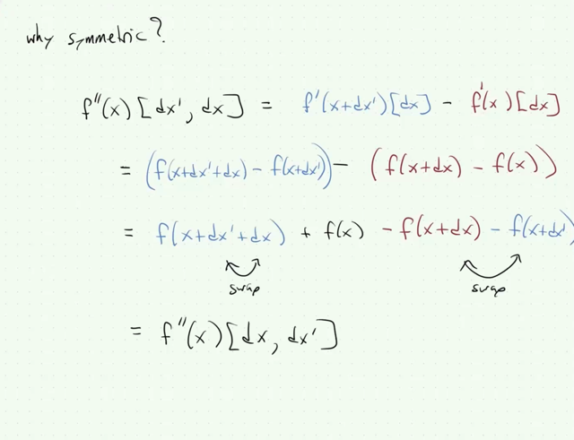</kbd></p>

> [!NOTE]
> Và  vì ta hoàn toàn **có quyền đổi vị trí dx' và dx** mà không thay
> đổi kết quả, nên **f''(x)[dx, dx'] cũng bằng f''(x)[dx', dx]**

<br>

<a id="node-209"></a>

<p align="center"><kbd>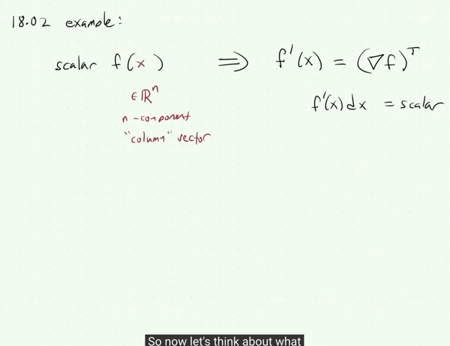</kbd></p>

> [!NOTE]
> Rồi ông lấy ví dụ hàm **f(x) R^n `->` R**. Thì như đã lập luận hồi nãy,
> f'(x) là**linear operator mà khi act on dx** (**f'(x)[dx]**) sẽ cho ra
> **df**, là một scalar.
>
> Và vì **dx là vector** nên **f'(x)[dx]** phải là phép **dot product của
> một vector với vector dx**. Vector đó chính là **gradient ∇f.**
>
> `=>` **f'(x)[dx] `=` ∇fTdx**.
>
> Và từ đó ta có thể **coi f'(x) như một ROW VECTOR (∇f)T**.
>
> Bởi chỉ có như vậy thì f'(x)dx (vẫn hiểu là linear operator act on dx)
> mới ra scalar value.

<br>

<a id="node-210"></a>

<p align="center"><kbd>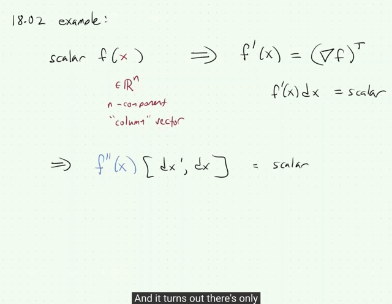</kbd></p>

> [!NOTE]
> Thế thì bây giờ xét **đạo hàm cấp 2**, gs cho rằng ta cũng **phải có kết 
> quả scalar** đối với **f''(x)[dx', dx]**
>
> Lí do là vì, f**''(x)[dx', dx**] (gọi là**bilinear form act on dx', và dx**), như
> vừa nãy đã nói, nó bằng:
>
> **f''(x)[dx', dx]** `=` **f'(x+dx')[dx] `-` f'(x)[dx]**
>
> Nên output của **f''(x)[dx', dx]** phải bằng `/` có dạng **giống output của
> vế phải**, và do đó phải **"giống" output của f'(x)[dx]**.
>
> Mà **f'(x)[dx]** thì như đã biết, chính là df, và với việc f là **scalar** function
> nên **df cũng là scalar**.
>
> Vậy nên **f''(x)[dx', dx] cũng phải là scalar.**

<br>

<a id="node-211"></a>

<p align="center"><kbd>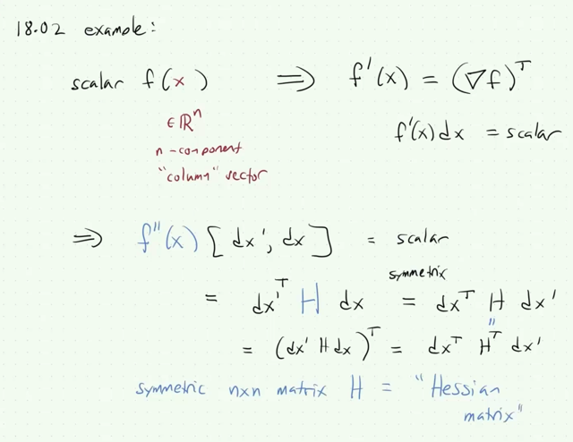</kbd></p>

> [!NOTE]
> Và từ đó lập luận sẽ là, ta có **bilinear form f''(x) act on 2 input là dx, dx'**
> mà **mỗi operation đều là linear**, và yêu cầu kết quả **phải ra scalar**
>
> Thế thì điều này khiến cho **chỉ có một cách để có thể làm như vậy**, 
> đó là **bilinear form này chính là "nhân dx, dx' với một matrix H**:
>
> f''(x)[dx', dx] `=` **dx'THdx**.
>
> (lập luận này cũng giống như "linear operator act on dx ra scalar, thì
> linear operator đó chỉ có thể là "dot product một vector với vector dx:
>
> vTdx, và vector đó gọi là gradient vector ∇f: **f'(x)[dx] `=` ∇fTdx**)
>
> `====`
>
> Bên cạnh đó, vì yêu cầu bilinear form này phải **đối xứng (symmetry)**:
>
> **f''(x)[dx' dx] `=` f''(x)[dx, dx']**
>
> nên điều này có nghĩa là:
>
> **dx'THdx `=` dxTHdx'**
>
> `<=>` (dxTHTdx')T `=` dxTHdx' (vì dx'THdx là scalar nên có thể transpose 
> tùy ý)
>
> `<=>` **HT `=` H** `=>` H là **symmetric matrix**
>
> Và đây định nghĩa ra **HESSIAN MATRIX**

<br>

<a id="node-212"></a>

<p align="center"><kbd>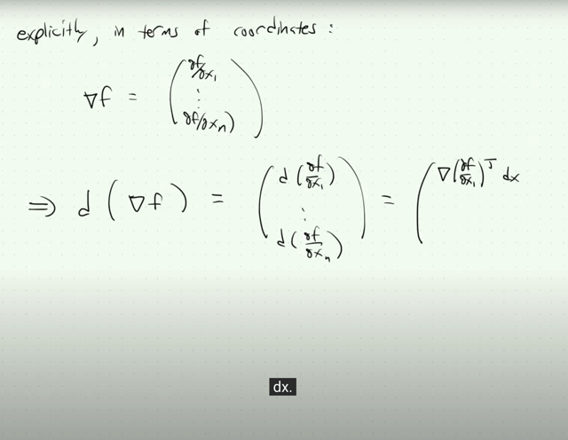</kbd></p>

> [!NOTE]
> Rồi, tiếp ta sẽ thể hiện kiểu "**explicitly**": 
>
> Như đã biết gradient vector ∇f là vector các **partial derivative**:
>
> ∇f `=` (**∂f/∂x1,∂f/∂x2, ....∂f/∂xn**)
>
> Vậy thì bây giờ **d(∇f)** là gì (tí nữa sẽ nói, chính là d(f'T), vì f' `=` ∇fT):
>
> Thì ta có vì **∇f `=` `(∂f/∂x1,∂f/∂x2,` ....∂f/∂xn)**
>
> nên **d(∇f) `=` ( `d(∂f/∂x1),` `d(∂f/∂x2),` `....d(∂f/∂xn)` )**
>
> Xét **d(∂f/∂x1)**:
>
> Ta có thể **hiểu `∂f/∂x1` là một function**, và function này cũng là 
> **scalar value** function: R^n `->` Rn: Nó **nhận vào vector x**, và
> **output ra ∂f/∂x1**.
>
> Do đó giống như **df `=` ∇fTdx** thì đây cũng vậy **d(∂f/∂x1) `=` ∇(∂f/∂x1)Tdx**
>
> với **∇f là gradient của hàm f,** thì **∇(∂f/∂x1) là gradient của hàm (∂f/∂x1)**

<br>

<a id="node-213"></a>

<p align="center"><kbd>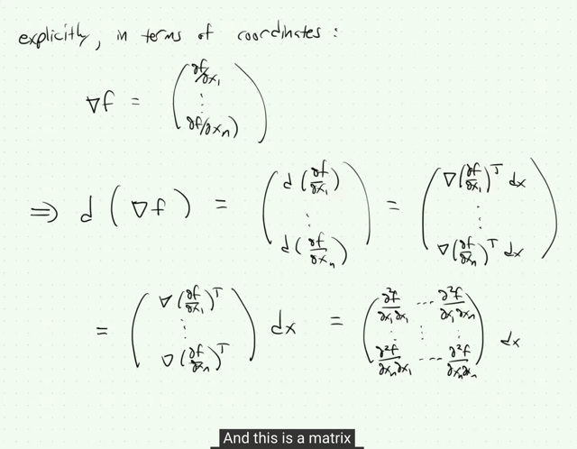</kbd></p>

> [!NOTE]
> Rồi tương tự vậy ta có:
>
> ```text
> d(∇f) = ( d(∂f/∂x1), d(∂f/∂x2), ....d(∂f/∂xn) )
> ```
>
> `=` **( `∇(∂f/∂x1)Tdx,` `∇(∂f/∂x2)Tdx,` `...∇(∂f/∂xn)Tdx` )**
>
> Thế thì chỗ này phải để ý: **kết quả phải là vector**, bởi vì **gradient ∇f** là 
> **vector**, nên**d(∇f)** cũng vậy.
>
> Nên ta đang có **vector** ( `∇(∂f/∂x1)Tdx,` `∇(∂f/∂x2)Tdx,` `...∇(∂f/∂xn)Tdx` ), 
> mà **mỗi phần tử** là **dot product của vector `∇(∂f/∂xi)` với vector dx**.
>
> Thế thì bây giờ để làm động tác**đưa dx ra** thì phải hiểu **bản chất** là,
> ta **chuyển vector**( `∇(∂f/∂x1)Tdx,` `∇(∂f/∂x2)Tdx,` `...∇(∂f/∂xn)Tdx` )..
>
> ..thành một **matrix nhân vector dx**, mà **mỗi hàng của matrix** sẽ là vector 
> **∇(∂f/∂xi) lật ngang lại (để thành một hàng)**: row i'th `=` **∇(∂f/∂xi)T.**
>
> Do đó trong:
>
> **( `∇(∂f/∂x1)T,` `∇(∂f/∂x2)T,` `...∇(∂f/∂xn)T` ) dx**
>
> thì**( `∇(∂f/∂x1)T,` `∇(∂f/∂x2)T,` `...∇(∂f/∂xn)T` )** là một **matrix** với hàng i'th là
>
> `∇(∂f/∂xi)T,`
>
> Và xét các hàng của nó, ví dụ hàng 1:
>
> **∇(∂f/∂x1)T** thì các component của nó sẽ là gì?
>
> Thì với hàm f, **gradient vector ∇f** sẽ là **(∂f/∂x1, `∂f/∂x2,` ....)**  tức **phần
> tử thứ i** sẽ là partial derivative của f wrt xi: **∂f/∂xi**, có thể viết là **∂/∂xi (f)**
>
> Thì tương tự như vậy, ở đây ta có **hàm ∂f/∂x1**, thì **gradient vector ∇(∂f/∂x1)**sẽ có phần tử thứ i là**partial derivative của `(∂f/∂x1)` wrt xi**, và ta sẽ viết
> theo cách sau `(∂/∂xi` (f(x))) như ở trên là **∂/∂xi (∂f/∂x1)**
>
> Và từ đó có thể hiểu đây chính là `∂^2f/∂x1xi` 
>
> Vậy hàng thứ 1 sẽ là:
>
> (**∂^2f/∂x1∂x1**, `∂^2f/∂x1x2,` `∂^2f/∂x1x3...∂^2f/∂x1xn)`
>
> trong đó **∂^2f/∂x1∂x1** chính là **second partial derivative của f wrt x1**
>
> Tương tự hàng thứ 2 sẽ là:
>
> `(∂^2f/∂x2x1,` **∂^2f/∂x2^2**, `∂^2f/∂x2x3...∂^2f/∂x2xn)`

<br>

<a id="node-214"></a>

<p align="center"><kbd>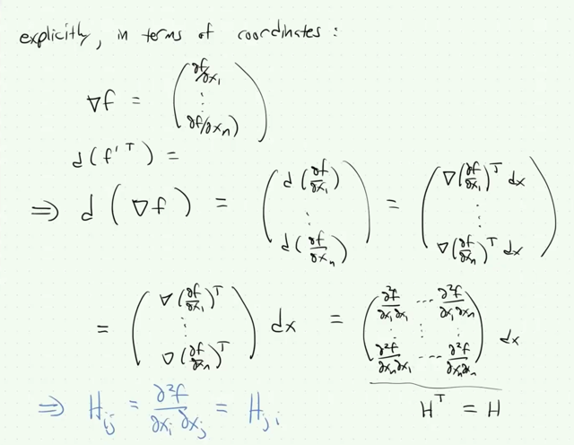</kbd></p>

> [!NOTE]
> Và vì ta đang triển khai **d(∇f)**, chính là **d(f'T)** nên cho ra
> dạng **M dx** thì **M chính là HT**, vì như đã nói **df' `=` Hdx**
>
> Nhưng **dù sao thì HT `=` H** do symmetric.
>
> Tóm lại **Hij** (phần tử **hàng i cột j**) chính là **∂^2f/xixj** và với tính
> symmetric, nó cũng `=` Hji `=` `∂^2f/xjxi`

<br>

<a id="node-215"></a>

<p align="center"><kbd>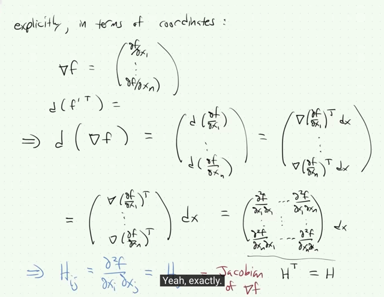</kbd></p>

> [!NOTE]
> Và cuối cùng còn một ý quan trọng cần chú ý nữa đó là**H chính
> là Jacobian của gradient ∇f**
>
> Cụ thể hơn, như có thể thấy, ta đã cho thấy **d(∇f) `=` HTdx**
>
> Thì khi ta **xem ∇f dưới vai trò của một function `(vector->vector`
> function)**, thì **d(∇f) `=` HTdx** mô tả một **linear operator act on
> dx** để cho ra vi phân của function ∇f: d(∇f).
>
> Và như ta đã biết, nếu **xét derivative** của một vector function **R^m
> `->` R^n** thì ta sẽ có: **df `=` f'(x)[dx]** là một **linear operator act on
> vector dx**, để **cho ra vector df**, thì khi đó linear operator có thể làm
> được điều này **chỉ có thể là "nhân một matrix với vector dx"** và
> matrix đó được gọi là **Jacobian**
>
> Vậy ở đây **HT `=` H chính là Jacobian của "function" ∇f**

<br>

<a id="node-216"></a>

<p align="center"><kbd>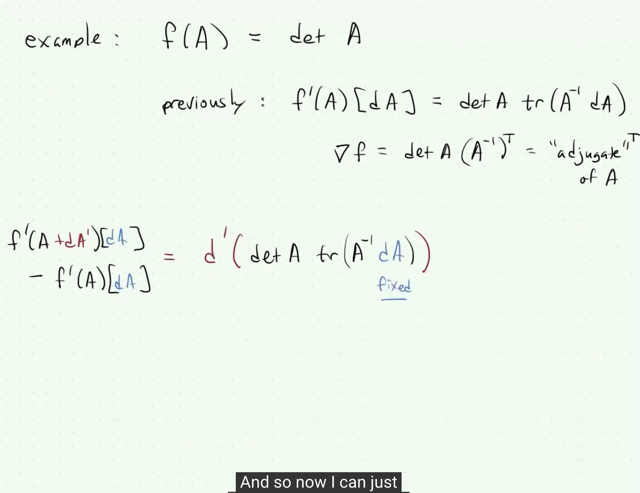</kbd></p>

> [!NOTE]
> Thế thì gs nói bài trước ta đã biết cách tính **gradient** của **scalar**
> **function** này (nhận vào **matrix A**, tính ra **determinant det A**)
>
> Bài này thì mình chưa học nên quay lại viết thêm sau
>
> Thế thì, đại khái là, ta sẽ bắt đầu từ định nghĩa:
>
> Như hồi nãy đã nói, để có**derivative của f**, ta cũng cố gắng đưa **df**
> thành dạng của **một linear operator act on dx**: **f'(x)[dx]** thì từ đó ta sẽ
> có **first derivative** (dĩ nhiên trong quá trình đó ta bỏ đi các term bậc
> cao hơn 1 của dx)
>
> Thì bây giờ, để có **second derivative**, ta cũng sẽ cố gắng **đưa d(f')**
> thành dạng của một **bilinear form act on dx',** **dx** từ đó ta có second
> derivative.
>
> Nên ở đây, ta đã có **f'(A)[dA] `=` det A tr(Ainv dA)**, đây dĩ nhiên **chính là**
> **linear operator act on dA**, nên đây **chính là first derivative f'(A)**
>
> (ghi là **f'(A)[dA]** ý là linear operator này act on dA, thì nó chính là det A
> tr(Ainv dA) đây)
>
> Nên giờ ta sẽ tìm cách triển khai **d(f'(A)[dA])** `=` **d(det A tr(Ainv dA))**
> thành dạng bilinear form f''(A)[dA, dA']
>
> Ta có****d(f'(A)[dA]**)** `=` f'(A+**dA**)[dA] `-` f'(A)[dA]
>
> Nhưng để phân biệt cái **dA** với dA trong [dA] (màu xanh, mà gs
> cho rằng nó là fixed), gs sẽ thay bằng **dA' và dùng kí hiệu d'**(chỉ để
> ý nói là ta tăng A lên thành A `+` dA' thôi):****d'(f'(A)[dA]) `=` f'(A+**dA'**)[dA] `-` f'(A)[dA]
>
> ```text
> <=> d' ( det A tr(Ainv dA) ) = f'(A+dA')[dA] - f'(A)[dA]
> ```

<br>

<a id="node-217"></a>

<p align="center"><kbd>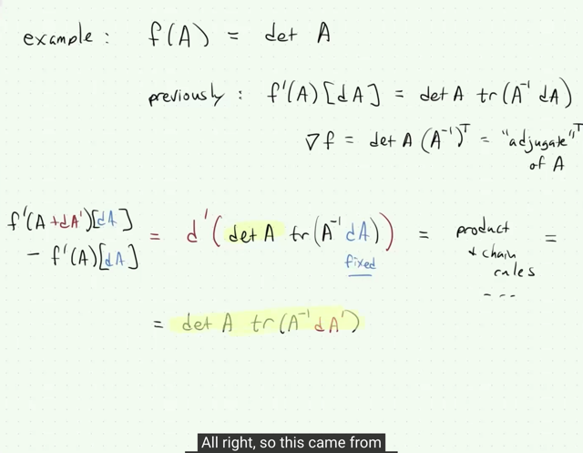</kbd></p>

> [!NOTE]
> Rồi, để tính **d' ( det A tr(Ainv dA) )**
>
> (again, hiểu nó như df thôi, mặc kệ dấu ')
>
> gs cho rằng ta sẽ dùng **product rule**, **chain rule**:
>
> Đầu tiên dùng **product rule,**ta đã biết d(uv) `=` **du v `+` u dv**
>
> vậy d' ( det A tr(Ainv dA) )
>
> `=` **d'(det A)** tr(Ainv dA) `+` det A **d'(tr(Ainv dA))**
>
> Với **d'(det A)** thì để khỏi khó hiểu đầu tiên ta cứ xét **d(det A)**: 
>
> thì **d(det A)** ta hiểu là **d f(A)** với **f(A) `=` det A**
>
> Thì ta có **d f(A)** `=` **f(A `+` dA)** **- f(A)** `=` **f'(A)[dA]** là một **linear operator act 
> on dA** mà ta đã có công thức =**det A tr(Ainv dA)**
>
> Vậy dĩ nhiên là với **d'(det A)**, ta **thay dA bằng dA'** thì ta có 
>
> **d'(det A) =** **det A tr(Ainv dA')**
>
> Vậy d'(det A) `=` det A tr(Ainv dA')

<br>

<a id="node-218"></a>

<p align="center"><kbd>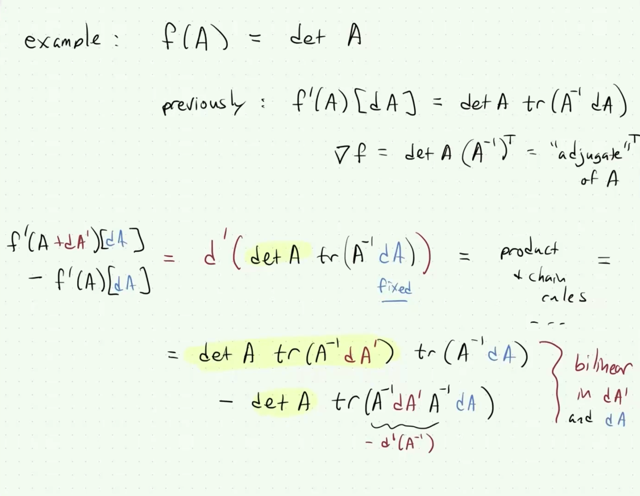</kbd></p>

> [!NOTE]
> Nên phần đầu (du v) sẽ là **det A tr(Ainv dA') tr(Ainv dA)**
>
> Còn phần sau (u dv) sẽ là:
>
> det A **d' (tr(Ainv dA)**
>
> Xét **d' (tr(Ainv dA):** Gs cho biết **trace** vốn là**linear operator**, nên ta có thể
> **đưa d vào trong**: (giống như `d(Σx)` `=` `Σdx` vậy
>
> d' (tr(Ainv dA) `=` **tr [d'( Ainv dA)]**
>
> Và như đã nói **dA coi như fixed**, constant, thì **d'( Ainv dA) `=` d'( Ainv) dA**
>
> Và với Ainv thì **d(Ainv) `=` `-` Ainv dA Ainv** (kiến thức này again, cần những
> bài 4,5 mới hiểu), nên **d'(Ainv) `=` `-` Ainv dA' Ainv**
>
> `=>` **tr [d'( Ainv dA)] `=` `-` Ainv dA' Ainv dA**
>
> Vậy vế 2 (u dv) là: `-` det A tr(Ainv dA' Ainv dA)
>
> Và như vậy ta đã có **BILINEAR FORM** act on dA', dA
>
> **det A tr(Ainv dA') tr(Ainv dA) `-` det A tr(Ainv dA' Ainv dA)**mà đúng là nó là **linear đối với mỗi thằng dA, dA' tức giữ cái này là fixed
> value thì ta có linear function đối với cái kia**

<br>

<a id="node-219"></a>

<p align="center"><kbd>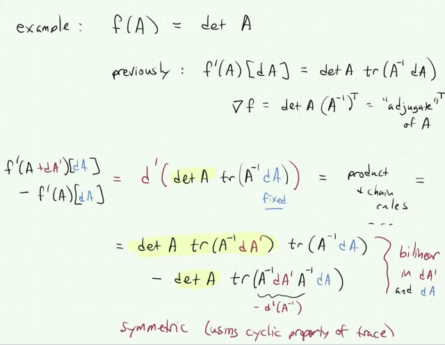</kbd></p>

> [!NOTE]
> Và gs nói nó cũng **symmetric**: vì ta có thể**đổi chỗ tr(Ainv dA')** với
> **tr(Ainv dA)** vì chúng chỉ là **number**
>
> Và nhờ tính chất của **trace** mà ta cũng có thể **đổi chỗ dA' và dA
> trong tr(Ainv dA' Ainv dA)**
>
> Và đó là ta đã làm xong

<br>

<a id="node-220"></a>

<p align="center"><kbd>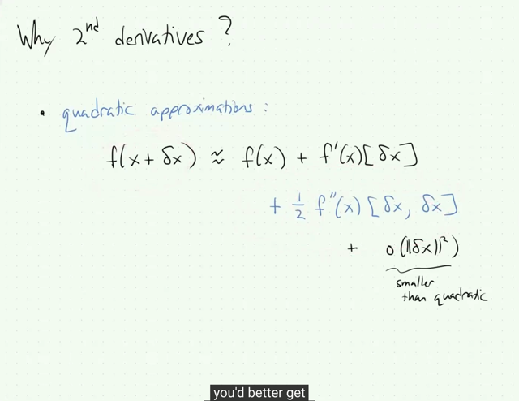</kbd></p>

> [!NOTE]
> Tiếp theo gs bàn về**tại sao ta cần 2nd derivative**.
>
> Thì ông nói rằng **1st derivative** cho ta **LINEAR APPROXIMATION**
> một hàm số: trong một **khoảng biến thiên rất nhỏ** thì **hàm số
> perform như hàm tuyến tính**:
>
> **f(x `+` `δx)` `~=` f(x) `+` f'(x)[δx]** : dễ thấy đây là linear function **f(x) là
> constant** còn **f'(x)[δx]** như đã nói, là **linear operator act on δx**
>
> Thế thì 2nd derivative cho ta**QUADRATIC APPROXIMATION**:
>
> **f(x `+` `δx)` `~=` f(x) `+` `f'(x)[δx]` `+` `(1/2)f''(x)[δx,` δx]**
>
> (**nếu có các o(||δx||^2** tức là các term bậc cao hơn 2 của `δx` thì ta có
> dấu  bằng, nhưng bỏ đi thì ta có approximation, dĩ nhiên với điều kiện
> `δx` nhỏ)

<br>

<a id="node-221"></a>

<p align="center"><kbd>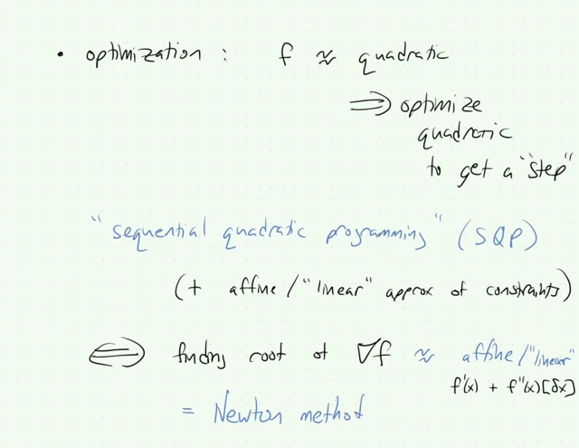</kbd></p>

> [!NOTE]
> gs nói sơ đến một số kiến thức trong optimization mà chắc
> chắn ta sẽ học trong những bài sau của EE364A.

<br>

<a id="node-222"></a>

<p align="center"><kbd>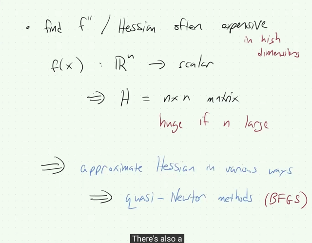</kbd></p>

> [!NOTE]
> cuối cùng gs cho biết việc tính f'' `/` Hessian thường là rất**tốn kém**ví dụ như hàm f R^n `->` scalar thì H là **nxn matrix** như đã biết. Thì
> nếu n lớn thì n^2 là rất lớn
>
> Do đó có một số cách**tiếp cận ước lượng** đối với **Hessian** ví dụ
> điển hình là **quasi-Newton** methods
>
> (những kiến thức này đã được nhắc đến trong cs231n bài
> Optimization)

<br>

