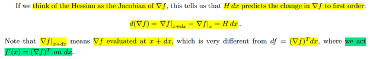
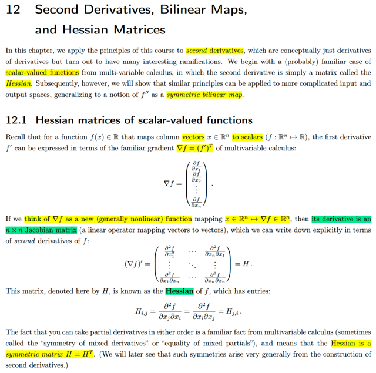
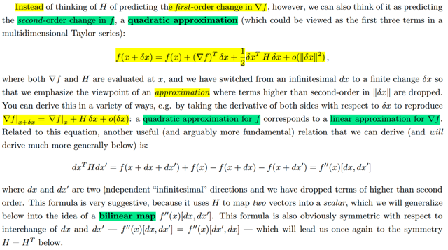
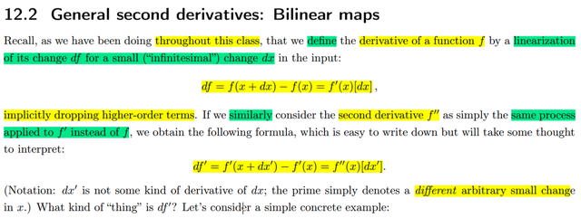

# Lecture Note

📊 **Progress:** `2` Notes | `5` Screenshots

---

<kbd></kbd>

<kbd></kbd>

<kbd></kbd>

> [!NOTE]
> Đầu tiên đại khái là, gs lấy ví dụ đơn giản của một scalar value multivariate
> function f(x): R^n -> R. Thì ông nói đạo hàm cấp 1 của f, có thể được thể
> hiện bởi gradient vector ∇f = (f')T trong đó ∇f là vector các partial derivative
> [∂f/∂x1, ∂f/∂x2....]
>
> Giải thích chỗ này: Như đã lập luận nhiều lần, rằng bản chất của đạo hàm là
> một linear operator. Có nghĩa là khi ta thay đổi x một chút, dẫn đến f thay đổi,
> thể hiện bằng df = f(x+dx) - f(x), thì sự thay đổi df này có thể được  tính bởi
> một linear operator apply lên dx, kí hiệu là f'(x)[dx].
>
> Và cái linear operator này chính là đaọ hàm cấp một của f đối với x.
>
> Thế thì df = f'(x)[dx], mà với scalar value function, df sẽ là scalar. trong khi dx
> là vector R^n. Nên để kết quả của linear operator act on dx ra scalar thì
> linear operator đó chỉ có thể là phép **DOT PRODUCT CỦA MỘT VECTOR 
> VỚI dx**
>
> Và đó chính là vector **GRADIENT ∇f**. Do đó f'(x)[dx] chính là ∇fTdx
>
> Từ đó với trường hợp này ta có thể gọi đạo hàm là row vector, f' = ∇fT, hay
> ∇f = (f')T. Nhưng phải hiểu bản chất f' là một linear operator act on dx. Chỉ có
> điều trong trường hợp này, linear operator đó chính là phép dot product giữa
> gradient ∇f với dx mà thôi.
>
> ====
>
> Thế thì, bây giờ, người ta nói, nếu ta coi gradient ∇f là một function, map
> giữa input là một vector Rm, với output là vector ∇f cũng Rm. Thì nó sẽ rơi
> vào bài toán mà ta có hàm f là vector value function multivariate. Rm->Rn Để
> rồi tương tự ta có df = f(x+dx)-f(x) = f'(x)[dx], thì lúc này derivative, với bản
> chất là linear operator act on dx như đã nói, phải cho ra Rn vector từ input dx
> là Rm vector. Thế thì linear operator làm được việc này chỉ có thể là **PHÉP
> NHÂN MATRIX J VỚI VECTOR dx**. Và matrix đó được gọi là **JACOBIAN**
> matrix.
>
> Nên quay lại đây, derivative của function ∇f, kí hiệu (∇f)', sẽ là linear operator
> act on dx 
>
> **d_∇f = ∇f(x+dx) - ∇f(x) = (∇f)'(x)[dx] (1)**
>
> Và như đã nói, linear operator này, là phép nhân Jacobian matrix với vector
> dx'
>
> Do đó (∇f)' = Jacobian matrix.
>
> Và Jacobian matrix này, là đối với ∇f, là đạo hàm cấp 1 của ∇f, nhưng đối với
> f, thì nó là đạo hàm cấp 2, và nó tên là Hessian matrix.
>
> Và Hessian matrix là Symmetric matrix.
>
> (∇f)' = H
>
> Và ta có thể viết lại (1) là:
> **d(∇f) = ∇f(x+dx) - ∇f(x) = H dx**
>
> Dĩ nhiên ta hiểu ∇f(x+dx) là hàm gradient ∇f() evaluate tại x + dx, tương đương
> với trong lecture note người ta ghi là ∇f | x+dx

 

<kbd></kbd>

> [!NOTE]
> đại khái gs nói là ta có thể "nghĩ về /hiểu về" Hessian là
> first-order change của ∇f đối vối dx (tức rate of change bậc
> 1 / cấp 1).
>
> Hoặc cũng có thể hiểu nó là second-order change của f đối
> với dx.

 

<kbd></kbd>

 

