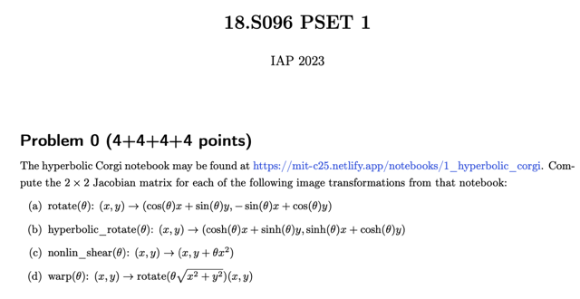
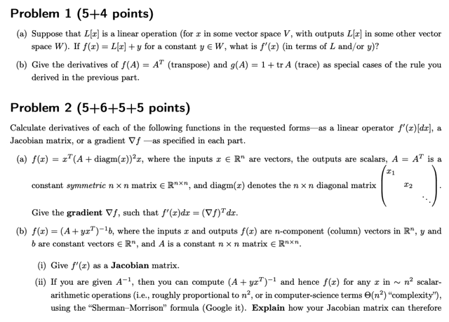
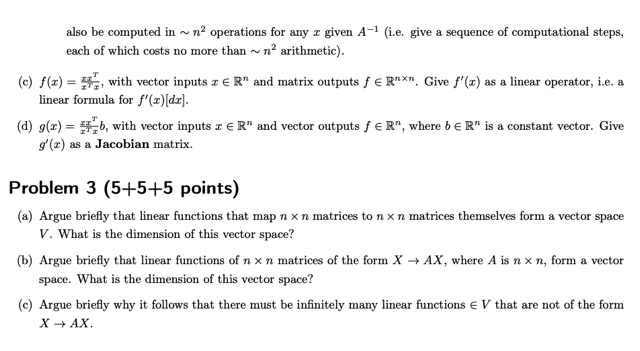

# Problem Sets 1

📊 **Progress:** `1` Notes | `3` Screenshots

---
<a id="node-230"></a>

<p align="center"><kbd></kbd></p>

🔗 **Related:** [LEC 3 PART 1 KRONECKER PRODUCTS AND JACOBIANS](untitled.md#node-66)

<br>

<a id="node-231"></a>

<p align="center"><kbd></kbd></p>

<br>

<a id="node-232"></a>

<p align="center"><kbd></kbd></p>

<br>


<a id="node-233"></a>
## Solutions Link

> [!NOTE]
> ```text
> https://ocw.mit.edu/courses/18-s096-matrix-calculus-for-machine-learning-and-beyond-january-iap-2023/resources/mit18_s096iap23_pset1sol_pdf/
> ```

<br>

