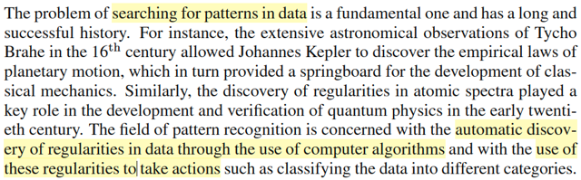
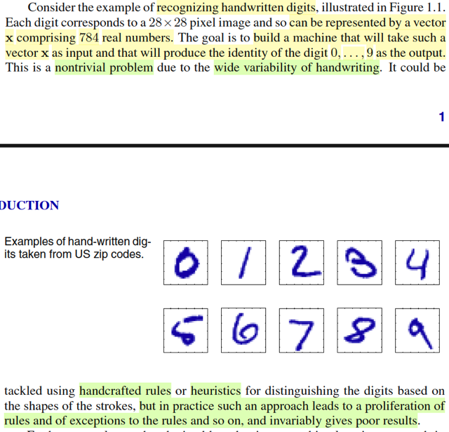
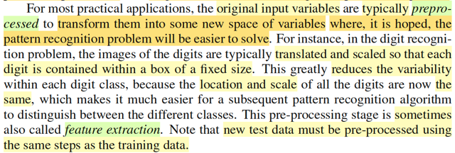
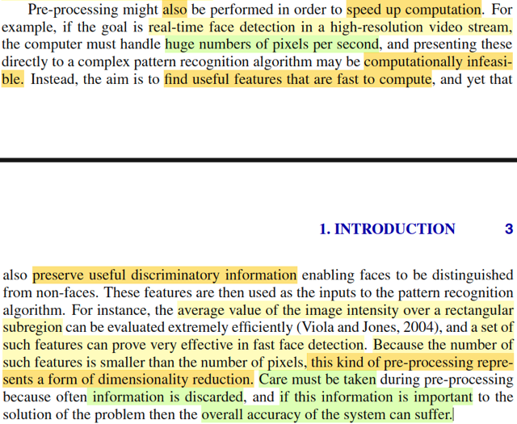
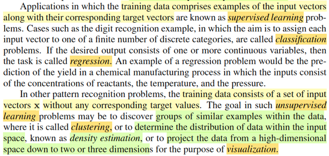
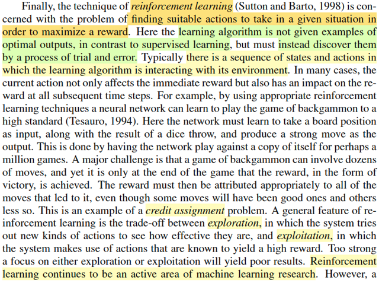
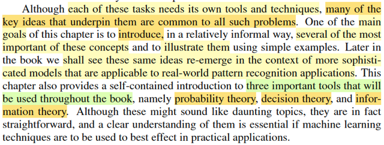

# 1.0 Into

📊 **Progress:** `8` Notes | `8` Screenshots

---

<kbd></kbd>

> [!NOTE]
> Tác giả điểm qua vài cột mốc lịch sử cho thấy bài toán tìm kiếm pattern
> trong dữ liệu thật ra đã có lịch sử lâu đời. Và lĩnh vực pattern recognition
> là việc ta muốn tạo một quy trình tự động nhận diện các mô tuýp, pattern
> trong data để đưa ra các quyết định

 

<kbd></kbd>

> [!NOTE]
> Gs lấy ví dụ bài toán nhận diện chữ số viết tay, vốn dĩ là bài toán không đơn
> giản vì sự đa dạng phong phú của các kiểu viết. Nếu dùng các cách tiếp cận
> ruled-based thì sẽ mãi chạy theo việc cập nhật thêm rules và ko hiệu qủa

 

<kbd></kbd>

> [!NOTE]
> Cái này nói về cách tiếp cận bài toán pattern recognition trên bằng machine
> learning. Đại ý là ta có thể chuẩn bị một tập training set, bằng cách chuyển
> mỗi image (kí tự viết tay của chữ số) thành một vector (array) các con số thực:
> Với ảnh trắng đen, mỗi pixel sẽ được thể hiện bởi con số từ 0 - 255 (đã học
> trong CS50, 1 byte = 8 bit, mỗi bit là con số nhị  phân 1/0, thì với 8 bits ta có
> thể có con số từ 0 đến 1*2^0 + 1*2^1 + ...1*2^7  = 255). Giả sử có N hình, ta
> sẽ có N vector. Ứng với mỗi hình, ta sẽ có label là cách mã hóa để mang
> thông tin phân loại của chữ kí viết tay tương ứng. Mà trong bài toán này, đơn
> giản có thể chỉ là dùng con số nguyên từ 0→9 để mã hóa label. Dĩ nhiên ta
> cũng có N labels cho N tấm hình. đặt nó vào vector t. gọi là target vector. Gs
> cũng nói thêm ta sẽ bàn thêm nhiều cách mã hóa label khác sau. Thế thì đó
> chính là training set.
>
> Ta mới dùng nó để tune (tinh chỉnh) tham số cửa thuật toán học máy. Và  giai
> đoạn này gọi là training / learning phase.
>
> Kết quả sau khi training xong, ta sẽ có thể coi thuật toán như một function
> y(x), nhận vào x - là vector mã hóa bức ảnh chữ viết và trả ra con số mã hóa
> cái label mà mô hình dựa đoán.
>
> Và ta sẽ kiểm tra độ chính xác của thuật toán học máy trên một tập các bức
> hình không có trong training set, gọi là test set. Và khả năng làm tốt trên set
> này mới là cái quan trọng nhất: tính generalization.
>
> Gs có nói đến một vấn đề có thể ảnh hưởng đến tính generalization: training
> set không đủ lớn để cover được hết mọi possible values của input vector X

 

<kbd></kbd>

> [!NOTE]
> Đại khái là gs nói thường thường ta sẽ phải làm bước **preprocessing**
> data / cũng có khi gọi là **feature extraction**, để transform nó sang không
> gian of variables mới, nơi mà thuật toán học máy sẽ làm việc dễ dàng hơn.
>
> Ví dụ với bài toán digit recognition, ta sẽ scale và shift cái hình sao cho nó
> có fixed size và đều nằm giữa. Điều này sẽ giảm độ biến động (variability).
> Và lưu ý là test data cũng phải được transform như vậy (tức là cùng một
> cách / quy trình preprocessing phải được áp dụng cho cả training / test
> set)
>
> Với kiến thức Nocedal, mình hiểu đây **chính là quá trình**
> **preconditioning**: Đổi biến, để **chuyển bài toán về một hệ tọa độ** /
> không gian mới mà trong đó **có những thuận lợi hơn cho thuật toán tối
> ưu** hội tụ nhanh hơn.
>
> Ví dụ preconditioning **trong** **CG**: Mình chuyển bài toán về hệ tọa độ
> mà  ở đó matrix hệ số có **phân phối trị riêng tốt hơn**, ví dụ như chỉ có
> một giá trị  trị riêng hoặc chỉ có vài trị riêng khác nhau → khiến thuật toán
> hội tụ nhanh hơn rất nhiều. Hoặc ngay cả trong **line search**, việc đổi
> biến **đưa về hệ tọa độ mà contour plot / level set của hàm objective có
> dạng hình tròn**, thay vì ellipse dẹp lép, khiến gradient descent trong một
> nốt nhạc.

 

<kbd></kbd>

> [!NOTE]
> Tác giả nói thêm tác dụng thứ hai của feature extraction / preprocessing: 
> là bỏ đi các feature vô dụng, giúp thuật toán chỉ phải tính toán với các feature
> hữu ích thay vì toàn bộ, từ đó giúp tính toán nhanh hơn, tiết kiệm chi phí hơn.
>
> Gs lấy ví dụ trong bài toán yêu cầu việc nhận diện khuôn mặt nhanh và chính
> xác. thì người ta thấy rằng việc cho thuật toán học từ một feature gọi là giá
> trị trung bình của image intensity trên một vùng hình chữ nhật (cụ thể nó là gì
> không quan trọng, chỉ cần hiểu đây là một feature được tạo ra bằng cách 
> thông qua một công thức nào đó đối với bức hình gốc) thì thuật toán tỏ ra hiệu
> quả hơn. Và ý chính muốn nói, việc huấn luyện thuật toán từ một bộ feature
> có số lượng ít hơn, thay vì data gốc, chính là một hình thức của việc giảm chiều 
> dữ liệu.
>
> Tuy nhiên gs lưu ý phải cẩn thận vì có thể làm mất đi feature / information quan
> trọng khiến thuật toán giảm chất lượng

 

<kbd></kbd>

> [!NOTE]
> Vài thuật ngữ về các loại bài toán khác nhau trong machine learning,
> cái này đã biết nhờ mấy lớp ml trước rồi

 

<kbd></kbd>

> [!NOTE]
> Cuối cùng gs nói sơ về RL, mấy cái này cũng đã biết nhờ ML Spec của Andrew
> Ng rồi, sau này ta sẽ quay lại học cuốn Shutton

 

<kbd></kbd>

> [!NOTE]
> Tiếp theo, gs sẽ thông qua một ví dụ để giúp ta làm quen với các khái niệm
> vừa nói. Nhắc đến 3 trụ cột của cuón sách này là lí thuyết xác suất, thông
> tin, và quyết định

 

