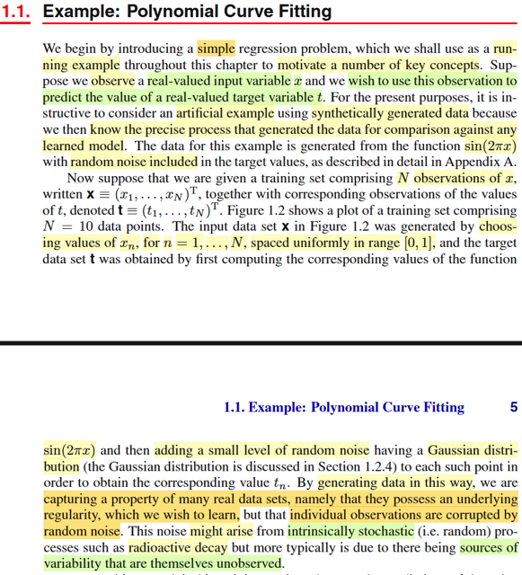
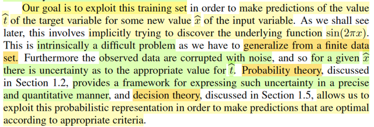
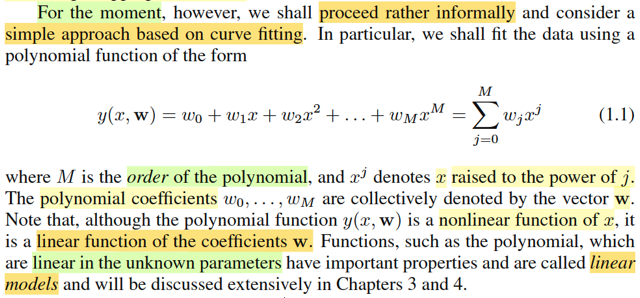

# 1.1 Example: Polynomial Curve Fitting

📊 **Progress:** `4` Notes | `4` Screenshots

---

<kbd></kbd>

> [!NOTE]
> Ví dụ về một bài toán regression đơn giản: Xây dựng một thuật toán
> học máy làm cái việc, nhận vào một con số thực x, dự đoán con số t
>
> Và đại ý là ta sẽ tạo một bộ  dataset nhân tạo, dùng cách sau: Cho xi
> là các giá trị cách đều nhau trong khoảng 0,1 (không phải là phải là
> uniform(0,1) nhé), và tính ti = sin(2πx) + zi với zi sampling từ một
> normal distribution (chưa thấy nói về tham số distribution của z).
>
> Và vì ta biết quy trình tạo ra observed data xi, ti nên kiểu như ta có thể
> so sánh mô hình mà ta xây dựng với mô hình thật (mô hình chỉ là nói
> đến hàm số, cái thuật toán mà mình muốn tạo, về bản chất cũng chỉ là
> xây dựng một hàm số t(x): nhận x → trả ra t. Vậy thì mô hình thật,
> chính là hàm f(x) = sin(2πx) và ta sẽ so sánh nó mô hình mà thuật toán
> học được.
>
> Gs nói thêm, về yếu tố noise zi thì trong đời thực, có thể đến từ yếu tố
> ngẫu nhiên nội tại của hiện tượng, ví dụ như quá trình phân rã phóng
> xạ, nhưng cũng có thể đến từ việc data ko chứa đủ các feature ẩn

 

<kbd></kbd>

> [!NOTE]
> đại ý nói là mục tiêu của chúng ta sẽ là khai thác training set để train
> một thuật toán machine learning giúp dự đoán t^ của một new input x^ nào
> đó. Và vấn đề này không đơn giản, vì việc ta phải làm là dựa vào một số
> lượng hữu hạn dữ liệu để nắm bắt được quy luật phổ quát tạo ra dữ liệu 
> này.
>
> Thế thì ta sẽ thấy vai trò của lí thuyết xác suất và decision theory giúp đem
> lại những công cụ giúp ta giải bài toán này

 

<kbd></kbd>

> [!NOTE]
> Đại khái là, trong ví dụ này, ta sẽ chưa bàn đến các công cụ mà lí thuyết
> xác suất và lí thuyết quyết định cung cấp. Thay vào đó chỉ làm đơn giản
> thôi, với cách tiếp cận dựa trên "curve fitting". Cụ thể là ta sẽ đặt ra bài
> toán là tìm cách xây dựng một hàm đa thức bậc M sao cho nó có thể khớp
> được bộ dữ liệu huấn luyện.
>
> Hàm đa thức bậc M (polynomial function of M order) có dạng:
>
> y(x, **w**) = Σj=0:M wj*x^j
>
> Và **w** là vector các hệ số của đa thức (polynomial coefficient) [w0, w1,...wM]
>
> Gs nói đến việc đây tuy là hàm bậc M theo biến x, nhưng là hàm tuyến tính
> theo wj. Cũng dễ hiểu, ta có thể thể hiện ở dạng y(x, **w**) = **w**T[1, x, x^2,...,x^M]
> Và ông đây là một function thuộc họ linear models, sẽ bàn kĩ ở chap 4

 

<kbd></kbd>

> [!NOTE]
> Rồi, không có gì khó hiểu, giá trị của wj sẽ quyết định dạng của
> polynomial function, giúp nó khớp được cỡ nào với data. Và ta
> có thể tìm bộ wj giúp khớp nhất với data bằng cách minimize
> error function với error function được chọn sao cho nó phản ánh
> độ không khớp (misfit) của hàm số với data.
>
> Và một cái được sử dụng phổ biến là : sum squared of error
>
> E(**w**) = (1/2) Σn=1:N (y(xn, **w**) - tn)^2
>
> Con số 1/2 như chỉ là số dương nhân vào, nếu muốn nói dài
> dòng theo kiểu ee364a thì nó giúp ta có một equivalent
> optimization problem, tức là không làm thay đổi bản chất bài
> toán, tức là **w*** minimize (1/2) sum squared error cũng sẽ
> minimize sum squared error, nhưng dễ thấy nó sẽ giúp tính toán
> thuận tiện hơn.
>
> Gs nói ta sẽ bàn về error function sau.
>
> Dừng lại để recall chút xíu, trong Casella mình đã gặp squared
> error loss rồi. Nói chung, theo gs Casella, đây là địa hạt của
> **decision theory**, khi mà ta tiếp cận vấn đề đánh giá (evaluate)
> một phương pháp suy luận, ví dụ như point estimator,
> hypothesis testing test hoặc một interval estimator bằng cách
> dùng hàm **loss function**, được chọn để phản ánh cách mà ta
> đánh giá sai sót của estimator. Ví dụ trong bài toán point
> estimator, ta có thể dùng squared error loss, hoặc absolute error
> loss:
>
> L(δ(**X**), θ) = [δ(**X**) - θ]^2,  L(δ(**X**), θ) = |δ(**X**) - θ|
>
> Một công cụ tiếp theo sẽ dùng, là risk function (của một
> estimator),  được định nghĩa là hàm theo θ:
>
> R(δ, θ) = E_θ[L(δ(**X**), θ)]
>
> Và risk function sẽ cho ta một hàm theo θ gắn với estimator
> δ(**X**), để rồi, ta muốn tạo ra estimator mà risk của nó tại θ bất
> kì đều nhỏ hơn risk của mọi estimator khác tại đó
>
> -----
>
> Thế thì quay lại đây, nhìn cái E(**w**), mình có thể thấy đây
> chính là gì:
>
> Thứ nhất:
>
> Y như việc ta dùng squared error loss để đo độ sai của suy luận:
> L(δ(**X**), θ) = [δ(**X**) - θ]^2
>
> Thì ở đây, ta cũng dùng squared error loss để đo độ sai của dự
> đoán: [y(w, x) - t]^2
>
> Chỉ khác ở chỗ, cái trên, δ(**X**) là suy luận (statistical
> inference) cho giá trị tham số population θ.
>
> Còn ở dưới, y(w, X) là prediction.
>
> Nó giống hơn như việc ta áp squared error loss lên:
>
> [g(δ(X) - g(θ)]^2 với g mang ý nghĩa là một prediction function
> nào đó.
>
> Và điều thứ hai nhận ra ở đây:
>
> Với risk function, ta lấy kì vọng của loss, và như đã biết, L(δ(X),
> θ) với θ fix, thì có thể coi nó như một random variable. Và lấy kì
> vọng chính là lấy POPULATION MEAN của loss's distribution
>
> Với cái dưới, chính ta lấy SAMPLE MEAN
>
> Và còn nhớ đại khái LLN nói rằng: sample mean sẽ hội tụ in
> probability về  true mean
>
> Quay lại đây, dễ thấy vì objective là hàm không âm, nên nó sẽ
> nhỏ nhất khi nó bằng 0, và khi đó (với **w***) hàm đa thức y(w*,
> x) sẽ có đồ thị đi qua một cách chính xác mọi điểm {xi, ti} trong
> training dataset
>
> ------
>
> Thật ra để chặt chẽ hơn ta phải giải bằng calculus (vì hàm không
> âm chưa chắc đã đạt min = 0):
>
> Viết lại hàm objective: E(w) = (1/2) Σi=1:N [y(xi, w) - tn]^2
>
> Đặt h(x) là hàm scalar → vector: f(x) = [1, x, x^2,...x^M]
>
> thì E(w) = (1/2) Σi=1:N [wThi - ti]^2
>
> Đặt H là matrix các hàng là hi và vector t là [t1, ..tM]T thì E(w) 
> trên chính là
>
> = (1/2)(Hw - t)T(Hw - t)
>
> = (1/2)(wTHT - tT)(Hw - t)
>
> = (1/2)(wTHTHw - tTHw - wTHTt + tTt)
>
> tTHw là scalar, nên = (tTHw)T = wTHTt
>
> = (1/2)(wTHTHw - 2tTHw + tTt)
>
> = (1/2)wTHTHw - tTHw + (1/2) tTt)
>
> Đây là dạng của hàm quadratic xTPx + qTx + r
>
> Dùng điều kiện cần tối ưu bậc nhất để giải stationary point
>
> ∇E(w) = 0
>
> ⇔ HTHw - (tTH)T = 0
>
> ⇔ HTHw - HTt = 0
>
> ⇔ HTHw = HTt
>
> ⇔ w = (HTH)inv HTt
>
> Dĩ nhiên matrix Hessian ∇^2E(w) chính là HTH
>
> Hessian tại w* = HTH, có xác positive semi definite không?
>
> Có, theo MIT 1806, ta chỉ cần check quadratic form:
>
> zTHTHz xem có không âm với mọi z không.
>
> = (Hz)T(Hz) = ||Hz||^2 ≥ 0 với mọi z ⇨ positive semi definite
>
> Thế vào, E(w*) = (1/2)(Hw - t)T(Hw - t) | w = (HTH)inv HTt
>
> = (1/2)||Hw - t||^2 | w = (HTH)inv HTt
>
> = (1/2)||H(HTH)inv HTt - t||^2 
>
> Thế thì H(HTH)inv HTt chính là gì?
>
> Nhớ lại, derive lại matrix chiếu lên C(A):
>
> Chiếu b lên C(A): được p ∈ C(A), residual: e = b - p sẽ vuông góc
> C(A) → e ∈ N(AT) ⇨ ATe = 0 ⇨ AT(b - Ax^) = 0 ⇔ ATb = ATAx^
> ⇔ x^ = (ATA)inv ATb ⇨ p = Ax^ = A(ATA)invATb 
>
> ⇨ matrix P chiếu b lên C(A) chính là:
>
> P = A(ATA)invAT
>
> Vậy H(HTH)inv HTt chính là chiếu t lên C(H).
>
> Mà t là vector trong R^N (N-dimensional space)
>
> C(H) cũng là subset của R^N, và H có M + 1 cột.
>
> Dễ thấy các cột độc lập vì mọi cột đều là power của cột 2. Do đó chỉ cần
> M + 1 ≥ N, thì C(H) trùng R^N và t nhất định ∈ C(H) ⇨ H(HTH)inv HTt = t
>
> Và khi đó E(w) sẽ có min nhỏ nhất là 0.
>
> Và đây chính là giúp ta hiểu, nếu như ta dùng một đa thức bậc M với
> M > N - 1 thì chắc chắn là sum square error có thể đạt 0 → hàm đa thức
> đi qua hoàn hảo các điểm dữ liệu.

 

