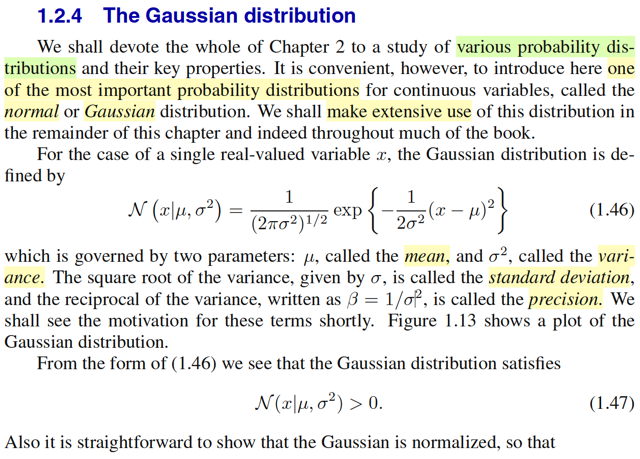

# 1.2.4 The Gaussian distribution

📊 **Progress:** `3` Notes | `3` Screenshots

---

<kbd></kbd>

> [!NOTE]
> Gs nói qua về Gaussian distribution, loại phân phối sẽ rất phổ biến trong sách
> này.
>
> Cái này thì biết rồi, nhưng đây là cơ hội để nhìn lại những gì đã học trong
> Stat110 và Casella về cái này.
>
> Trong Stat110, gs Joe Blizstein nói về Normal(0,1) từ standard normal trước,
> có pdf là f(z) = 1/√2π exp[-z^2/2]
>
> Rồi ông nói công thức này dễ nhớ hơn, để từ đó ta mới dùng location scale
> family để derive công thức pdf của normal(μ, σ). Location scale theorem nói
> rằng: nếu ta có X ~ f(x) là pdf thuộc location scale family, ứng với location μ,
> scale σ thì Z = (X - μ) / σ sẽ là random variable có pdf thuộc family ứng với
> location 0, scale = 1 gọi là standard member. Ngược lại nếu Z là rv ~ pdf
> standard member thì σZ + μ  sẽ là thành viên ứng với location μ, scale σ
>
> Và normal là loại của một location scale family, với location trùng với mean, và
> scale trùng với standard deviation.
>
> Nên ở đây ta có f(z) là standard member thì X = σZ + μ sẽ là thành viên có
> location μ, scale σ
>
> Dùng transformation theorem ta derive pdf của X = σZ + μ như sau:
>
> với x = g(z) = σz + u ⇨ z = ginv(x) = (x - μ) / σ
>
> fX(x) = fZ(z) |dz/dx|
>
> fZ(ginv(x)) |d/dx ginv(x)|
>
> = 1/√2π exp[-[(x-μ)/σ]^2/2] . (1/σ)
>
> = 1/√2π exp[-(x-μ)^2/2σ^2] . (1/σ)
>
> = 1/σ√2π exp[-(x-μ)^2/2σ^2]
>
> Và đây là pdf của X, là thành viên trong họ location scale, ứng với location μ,
> scale σ, Mà như đã nói, với Normal thì location cũng là mean, scale cũng là
> standard deviation. Do đó, đây chính là pdf của normal(μ, σ).
>
> Ở đây có thể có điểm mà có thể Casella đã nói nhưng ít để ý, 1/σ^2 gọi là
> precision.

 

<kbd></kbd>

> [!NOTE]
> Dĩ nhiên nó là một valid pdf nên nó phải thỏa hai tính chất, sum trên toàn miền
> phải  = 1 và không âm.
>
> Và mr Bishop để cập đến mean của distribution là μ.
>
> Còn ở đây, dĩ nhiên để tính mean, tức EX với X ~ normal(μ, σ) có pdf như vậy, thì
> ta sẽ theo định nghĩa của kì vọng mà tính: ∫x f(x)dx
>
> Để cho dễ ta có thể tính EZ (Z ~ normal(0,1)) trước:
>
> EZ = ∫-inf:inf zfZ(z)dz = ∫-inf:inf z (1/√2π) e^-z^2/2 dz
>
> = (1/√2π)∫-inf:inf z e^-z^2/2 dz
>
> = (1/√2π) [nguyên hàm của z e^-z^2/2] | -inf:inf
>
> nguyên hàm của z e^-z^2/2 chính là -e^-z^2/2, 
>
> vì d/dz (-e^-z^2/2) = - d(-z^2/2) e^-z^2/2 . d/dz -z^2/2 (chain rule)
>
> = - e^-z^2/2  (-z)
>
> = z e^-z^2/2
>
> = (1/√2π) [e^-z^2/2] | -inf:inf
>
> z → -inf → -z^2/2 → -inf → [e^-z^2/2] → 0
>
> z → inf → -z^2/2 → -inf → [e^-z^2/2] → 0
>
> → kết quả tích phân = 0.
>
> Cách nhanh hơn là nhận xét hàm k(z) = zfZ(z) là hàm lẻ, vì:
>
> k(-z) = (-z)fZ(-z) = -z (1/√2π) e^-(-z)^2/2 = -z (1/√2π) e^-z^2/2 = -k(z)
>
> Và như vậy thì tích phân từ -inf với inf cũng sẽ = 0.
>
> Vậy EX = E(σZ + μ), theo tính linearity của kì vọng, = σEZ + μ = 0 + μ = μ 
>
> Ở đây mình nhắc lại, Normal distribution là một họ distribution thuộc loại location
> scale family, nhưng nó có tính chất đặc biệt là location chính là mean. và scale
> chính là standard deviation. Nói vậy là vì trong Casella ta đã biết, có những
> location scale familly khác thì location chưa chắc đã là mean.

 

<kbd></kbd>

> [!NOTE]
> Tiếp, còn nhớ trong stat110 và Casella đã học khái niệm mgf (moment generating
> function) - hàm sinh moment. Với moment được định nghĩa là EX là first moment, EX^2
> là second moment.
>
> Hàm mgf, được định nghĩa là mX(t) = E[e^tX].
>
> Thế thì có thể tính second moment bằng cách dùng lotus: ∫x^2fX(x)dx
>
> Cũng có thể derive công thức mgf của X, để rồi Taylor expansion và lấy hệ số của term
> bậc hai, thì nó cũng chính là second moment.
>
> Tính theo cách 1: E[X^2] = ∫x^2fX(x)dx (fX(x) là pdf của normal(μ, σ) nếu muốn ghi rườm
> ra thì ghi là f(x|μ, σ) như trong sách này gs Bishop kí hiệu là chữ N hoa luôn)
>
> = ∫x^2 (1/σ√2π) exp[-(x-μ)^2/2σ^2] dx
>
> = (1/σ√2π) ∫x^2 exp[-(x-μ)^2/2σ^2] dx
>
> Để tính cái này cần dùng kĩ thuật integration by part
>
> Để nhớ lại coi, mình nhớ "story" của cái kĩ thuật này vốn chỉ là bắt nguồn từ product rule
> của gỉai tích:
>
> d(uv) = udv + vdu ⇨ udv = d(uv) - vdu
>
> ⇨ ∫udv = ∫d(uv) - ∫vdu
>
> Ta đã giải cái này trong stat110, Casella rồi, ko viết lại nữa.
>
> Còn làm theo cách kia, thì mgf của X là exp[μt + (1/2)σ^2t^2]
>
> Lấy đạo hàm bậc 1 (cũng chính là expand Taylor và lấy hệ số gắn với term bậc 1)
> evaluate tại t = 0 thì ta có fisrt moment (EX)
>
> d/dt [exp[μt + (1/2)σ^2t^2]]
>
> = d/d[μt + (1/2)σ^2t^2] exp[μt + (1/2)σ^2t^2] . d/dt [μt + (1/2)σ^2t^2]
>
> = exp[μt + (1/2)σ^2t^2] . (μ + σ^2t)
>
> ⇨ d/dt [exp[μt + (1/2)σ^2t^2]] | t = 0 =  exp[0] . (μ) = μ
>
> Lấy đạo hàm bậc 2, evaluate tại t = 0 ta sẽ có second moment, EX^2:
>
> d/dt [đạo hàm bậc nhất] = d/dt [exp[μt + (1/2)σ^2t^2] . (μ + σ^2t)]
>
> = { d/dt exp[μt + (1/2)σ^2t^2] } (μ + σ^2t)] + [exp[μt + (1/2)σ^2t^2]  d/dt  (μ + σ^2t)] |
> product rule
>
> = { đạo hàm bậc nhất } (μ + σ^2t)] + [exp[μt + (1/2)σ^2t^2]  σ^2]
>
> ⇨ [đạo hàm bậc 2] | t = 0 = { đạo hàm bậc nhất | t=0} (μ)] + [exp[0]  σ^2]
>
> = [μ (μ)] + [exp[0]  σ^2]
>
> = μ^2 + σ^2 → như trong sách
>
> Và dùng công thức thứ hai của Variance: VarX = EX^2 - (EX)^2 = μ^2 + σ^2 - μ^2 = σ^2.
>
> ====
>
> Cái ý mà gs Bishop nói rằng với Normal thì mode trùng với mean là một ý mới mà mình
> chưa nghe trong Casella

 

