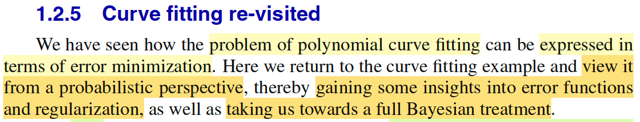
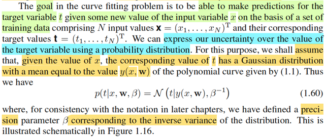
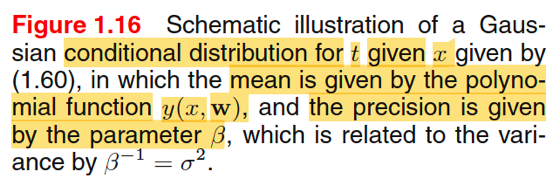
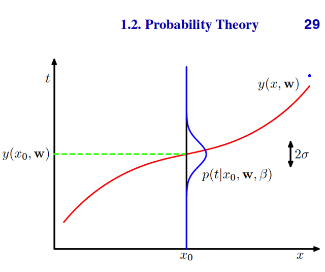
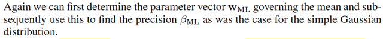

# 1.2.5 Curve fitting re-visited.

📊 **Progress:** `7` Notes | `8` Screenshots

---

<kbd></kbd>

🔗 **Related:** [1.1 Example: Polynomial Curve Fitting](untitled.md#node-14)

> [!NOTE]
> Đại khái là ta sẽ quay lại bài toán Curve fitting. Lúc trước, ta tiếp cận bài
> toán này ở góc độ là tìm cách (thay đổi tham số của hàm đa thức) để giảm
> thiểu  error.
>
> Còn trong lần này, ta sẽ tiếp cận nó dưới GÓC NHÌN XÁC SUẤT
> (probability perspective)
>
> Và từ đó ta sẽ bắt đầu hướng tới cách tiếp cận toàn diện theo trường phái
> Bayesian (như đã nói, sách này của mr Bishop sẽ chuyên về giải bài toán
> học máy theo góc nhìn Bayesian)

 

<kbd></kbd>

> [!NOTE]
> Thế thì như đã biết, mục tiêu của bài toán curve fitting (khớp đường cong) là
> ta muốn tái hiện / xây dựng một hàm đa thức mô phỏng hàm số ẩn đằng sau
> quy luật của bộ dữ liệu - vốn được tạo ra theo hàm số t = sin(2πx) + z với z là
> giá trị nhiễu lấy từ phân phối normal(0,1). Và mục đích mô phỏng được hàm
> số này (sin(2πx)) sẽ giúp ta dự đoán được giá trị t từ giá trị x mới một cách
> chính xác.
>
> Dựa trên cơ sở là ta có một training data set gồm N input (x1,...xn)T và n
> target value (t1,...tN).
>
> Thế thì tiếp theo gs Bishop nói một ý rất quan trọng mang tính chất bước
> ngoặt để mình có thể tiếp cận bài toán theo góc nhìn xác suất:
>
> Đó là: Ta sẽ **THỂ HIỆN TÍNH KHÔNG CHẮC CHẮN / NGẪU NHIÊN CỦA
> TARGET VARIABLE BẰNG CÁCH COI NÓ LÀ RANDOM VARIABLE** và dĩ
> nhiên gắn với random variable thì sẽ có distribution.
>
> Và ta sẽ đặt ra giả định là biến T (như đã nói, mình cứ theo notation của toán
> thống kê, viết hoa cho tên biến, viết thường cho giá trị) sẽ có phân phối
> Normal với mean là y(x, **w**) và variance là 1/β.
>
> Để rồi pdf của T: f(t | y(x,**w**),1/β) sẽ là pdf của Normal(y(x, **w**),1/β),
>
> (gs Bishop dùng N kiểu để ý nói là normal pdf, mình hiểu là được)
>
> Và cũng có có thể ghi là f(t | x,w,β) để nhìn nó như hàm của t dựa trên các giá
> trị x, **w**, β (thông qua trung gian y(x, **w**) và 1/β)

 

<kbd></kbd>

<kbd></kbd>

> [!NOTE]
> Như vậy, với góc nhìn này, dựa trên x,
> **w**, β thì T ~ normal(y(**x**, w), 1/β)

 

<kbd></kbd>

> [!NOTE]
> Đây là đoạn mấu chốt đây:
>
> Vừa rồi, ta COI gắn với x=x0 thì T  ~ Normal(y(x0, **w**), 1/β)
>
> để rồi pdf của nó là f_T(t| y(x0, **w**), 1/β)
>
> như vậy, với i = 1,2...N, để ta có x=x1,...xN thì ta cũng sẽ có N random variable
> T1, ...TN với:
>
> Ti ~ Normal(y(xi, **w**), 1/β), có (marginal) pdf f_Ti(ti | y(x0, **w**), 1/β)
>
> Và gs nói rằng, giả sử data được lấy mẫu theo lối independent và đều từ
> distribution 1.60 thì ...blah blah:
>
> Chỗ này cần hiểu vầy, rất quan trọng. Nên ôn lại chút về định nghĩa của random
> sample, trong Stat110 và Casella, đã được biết, random sample size n X1,...Xn
> là một bộ các random variable được thu thập sao cho chúng **mutually
> independent** và có chung một population distribution, gọi là **identically
> distributed**. Có nghĩa là marginal distribution của Xi ~ f(xi|θ) với mọi i (thằng
> nào cũng có chung pdf/pmf f(.|θ) hết.
>
> Vấn đề là, gs giả định đám Ti này độc lập thì ok đi. Nhưng có thể đặt câu hỏi là
> **chúng có cùng population distribution không**?
>
> Nguồn cơn thắc mắc là ở chỗ, mean của distribution của Ti lại là hàm phụ thuộc
> x: y(x, **w**). Nên rõ ràng là với x khác nhau, ETi = y(xi,w) sẽ khác nhau cho nên
> không thể nói T1 và T2 ứng với x1, x2 là cùng một distribution được.
>
> Do đó không thể hiểu như bối cảnh của Casella, rằng T1,...Tn đều có chung
> population distribution, chúng chỉ độc lập thôi. Nhưng thật ra, cái ý tiếp theo sau
> đây, **chỉ cần chúng độc lập** là đủ:
>
> Đó là, ta xét  **JOINT DISTRIBUTION** của T1,...Tn
>
> fT1,...Tn(**t**|x1,..xn,**w**,β), hay f**T**(**t**|**x**,**w**,β)
>
> Vì T1,...Tn độc lập, nên joint distribution của chúng bằng tích marginal
> distribution:
>
> = fT1(t1|y(x1, **w**), 1/β) * fT2(t2|y(x2, **w**), 1/β) *...* fTn(tn|y(xn, **w**), 1/β)
>
> = Πi=1:n f(ti| y(xi, **w**), 1/β)
>
> viết theo notation của gs Bishop, chính là 1.61:
>
> p(**t**| **x**,**w**,β) = Πi=1:n N(ti| y(xi, **w**), 1/β).
>
> Và như đã nhắc lại về định nghĩa của hàm likelihood trong các note trước, Với
> sample **X** ~ f(**x**|θ) thì likelihood là hàm số của θ, kí hiệu: L(θ|**x**), có độ
> lớn  được đặt bởi độ lớn của hàm joint pdf của **X**tại **x**: f(**x**|θ), và mang ý
> nghĩa là độ hợp lí của θ khi ta quan sát thấy giá trị **X** = **x**(nói nôm na là:
> tao biết giá trị của **X bị quy định bởi θ**, vậy thì nếu tao thấy giá trị cụ thể x của
> nó, thì với các giá trị θ = θ1 thì có hợp lí không / độ hợp lí là bao nhiêu để giải
> thích hiện tượng này (quan  sát được giá trị này của X), thì cái độ hợp lí đó là
> L(θ1|x).
>
> Vậy ở đây, nói likelihood thì phải hiểu likelihood của cái gì?
>
> Theo định nghĩa trên, nó là likelihood của tham số θ, chi phối distribution của **X**.
> Vậy ở đây, dĩ nhiên là nói về likelihood của tham số chi phối distribution của **T**= (T1,...Tn). Và trong cái nùi Πi=1:n N(ti| y(xi, **w**), 1/β), dĩ nhiên tham số là **w**, và 
> β (còn x1,..xn đều là giá trị đã biết)
>
> Do đó, theo định nghĩa trên, ta sẽ có:
>
> L((**w**,β)|**t,x**) = f**T**(**t**|**x**,**w**,β) = Πi=1:n f(ti| y(xi, **w**), 1/β)

 

<kbd></kbd>

🔗 **Related:** [1.2.4 The Gaussian distribution](untitled.md#node-77)

> [!NOTE]
> Rồi, như vậy tiếp theo ta làm gì:
>
> Như hôm qua mình đã ôn lại về point estimator đã học trong Casella.
>
> Ôn nhanh: trong bài toán thống kê suy luận, point estimation là bài toán
> mà ta muốn xây dựng một estimator, được định nghĩa là một hàm của
> sample W(**X**) để mục đích là với observed data **X** = **x**, ta có
> estimate value W(**x**) cho θ sao cho chính xác. Và những phương pháp
> chính bao gồm method of moment, maximum likelihood estimator và
> Bayes estimator.
>
> Với ML estimator, được định nghĩa là θ^_mle(**X**) = argmax_θ L(θ|**X**),
> mang ý nghĩa là θ khiến tối đa hóa độ hợp lí khi quan sát được giá trị của
> **X**
>
> Còn Bayes estimator, được định nghĩa là, mean hoặc median của phân
> phối posterior π(θ|**x**).
>
> Vậy thì ở đây, θ chính là (**w**, β), ta sẽ làm theo cách thứ nhất, xây dựng
> ML estimator của (**w**, β). Để rồi lát nữa, ở phần sau ta sẽ làm theo
> Bayes estimator.
>
> Như vậy theo định nghĩa trên, ta cần giải bài toán tối ưu sau:
>
> maximize_**w**, β L(**w**, β | **t**,**x**) = Πi f(ti| y(xi, w), 1/β)
>
> Thế thì, tương tự như đã nói ở phần trước, ta có thể chuyển bài toán tối
> ưu gốc này sang các dạng tương đương (equivalent), là các bài toán mà
> solution của nó cũng là solution của bài toán gốc, mục đích là để dễ làm
> hơn
>
> Và ta có vài cách để chuyển, điển hình là thay việc tối ưu hàm mục tiêu
> f(x) bằng bài toán tối ưu hàm g(f(x)) với g là một hàm monotone. Nên ở
> đây, vì log(.) là hàm monotone increasing, nên maximize log L cũng là
> maximize L
>
> log L(w, β | **t**, **x**) = log Πi f(ti| y(xi, **w**), 1/β)
>
> Lôi công thức pdf của normal ra ráp vô
>
> = log { Πi [1/√[2π(1/β)]] exp[-[ti-y(xi,**w**)]^2/2(1/β)] }
>
> = log { [1/β^(-1/2)√2π]^n exp[Σi-[ti-y(xi,**w**)]^2/2(1/β)] }
>
> = log { [β^(1/2)/√2π]^n } + log exp[Σi-[ti-y(xi,**w**)]^2)/2(1/β)]
>
> = n log [β^(1/2)/√2π] - (β/2) Σi [ti-y(xi,**w**)]^2
>
> = n log β^(1/2) - n log√2π - (β/2) Σi [ti-y(xi,**w**)]^2
>
> = (n/2) log β - (n/2) log (2π) - (β/2) Σi [ti-y(xi,**w**)]^2
>
> = - (β/2) Σi [ti-y(xi,**w**)]^2 + (n/2) log β - (n/2) log (2π), đây chính là 1.62
>
> \------
>
> Rồi, một kĩ thuật nữa để có equivalent (optimization) problem là, thay vì
> maximize hàm objective, ta có thể minimize [- hàm objective], cái này đơn
> giản. Cũng như khi maximize, hay minimize, ta bỏ đi các hằng số không
> dính đến biến, vì maximize f(x) thì cũng như maximize f(x) + c.
>
> Và một ý nữa như đã nói ở note trước (xem link), việc giải bài toán tối ưu
> hai biến, có thể làm theo từng biến lần lượt. Nên ở đây, ta có thể
> maximize over w trước, để tìm w*. Sau đó maximize over β, để có β*.
>
> Dĩ nhiên w*, β* chính là w_ML và β_ML
>
> Thử làm:
>
> Như đã nói, ta sẽ chuyển thành bài toán tìm w*:
>
> maximize_w - (β/2) Σi [ti-y(xi,**w**)]^2 + (n/2) log β - (n/2) log (2π)
>
> ⇔ maximize_w - (β/2) Σi [ti-y(xi,**w**)]^2 | bỏ constant
>
> ⇔ minimize_w (β/2) Σi [ti-y(xi,**w**)]^2 | maximize objective = minimize
> negative objective
>
> ⇔ minimize_w (1/2) Σi [ti-y(xi,**w**)]^2 | vì nhân objective cho cho constant
> 1/β
>
> Mục đích là để tới đây ta thấy cái hàm objective (của bài toán tương
> đương lúc này chính là SUM OF SQUARED ERROR (y như  cách tiếp
> cận bài toán này bữa trước) để rồi giúp ta hiểu một điều quan trọng:
>
> **ĐI TÌM w BẰNG CÁCH MINIMIZE SUM OF SQUARED ERROR LOSS
> CŨNG CHÍNH LÀ VIỆC ĐI TÌM MAXIMUM LIKELIHOOD ESTIMATOR
> CỦA w VỚI GIẢ ĐỊNH GAUSSIAN NOISE**.
>
> Gaussian noise là sao?
>
> ta đã thấy gs giả định Ti ~ Normal(y(xi, **w**), 1/β)
>
> Thế thì, Ti - y(xi, **w**) chính là gì:
>
> Y như việc ta có X ~ Normal(μ, σ^2) thì theo location scale theorem X - μ
> chính là một Normal(0, σ^2).
>
> Vậy, Ti - y(xi, **w**) chính là random variable ~ Normal(0, 1/β)
>
> Như vậy rv có được bằng cách áp hàm error(Ti, y(xi, **w**)) = Ti - y(xi, **w**)
> sẽ  chính là một random variable ~ Normal(0,1/β)
>
> Mà ta đã biết y(xi, w) là prediction của mô hình, thì e = error(ti, y(xi, **w**)) = ti
> \- y(xi, **w**) là sai số của dự đoán.
>
> Như vậy với giả định Ti ~ Normal(y(xi, w), 1/β),  **CŨNG CHÍNH LÀ TA
> ĐANG GIẢ ĐỊNH RẰNG SAI SỐ CỦA DỰ ĐOÁN SẼ CÓ PHÂN PHỐI
> NORMAL(0, 1/β)** Đó chính là ý "under the assumption of a Gaussian
> noise" của thầy Bishop.

 

<kbd></kbd>

<kbd></kbd>

> [!NOTE]
> minimize_w (1/2) Σi [ti-y(xi,w)]^2
>
> Rồi, thử đi tìm w_ML
>
> y(xi, w) = **w**TΦ(xi) với Φ(xi) = [1, xi, xi^2,...]
>
> ⇨ (1/2) Σi [ti - y(xi,**w**)]^2 = (1/2) Σi [ti - **w**TΦ(xi)]^2
>
> = (1/2) (**t** - X**w**)T(**t** - X**w**) với row i của X = Φ(xi)T
>
> = (1/2) (**t**T - **w**TXT)(**t** - X**w**)
>
> = (1/2) (**t**T**t** - **w**TXT**t** - **t**TX**w** + **w**TXTX**w**)
>
> = (1/2) (**t**T**t** - 2**t**TX**w** + **w**TXTX**w**)
>
> = (1/2)**w**TXTX**w** - **t**TX**w** + (1/2) **t**T**t**Đây là quadratic function của **w**.
>
> Với quadratic function f(x) = (1/2)xTPx + qTx + r (x là vector)
>
> thì gradient là Px + q
>
> ∇f(**w**) = XTX**w** - XT**t**
>
> Điều kiện cần tối ưu bậc nhất: ∇f(**w**) = 0
>
> ⇔ XTX**w** - XT**t** = 0
>
> ⇔ **w** = (XTX)_invXT**t**Và dĩ nhiên đây chỉ là critical point, cần check secondary test: Hessian tại w*
> có positive semi definite thì mới đủ kết luận w* là local minimum
>
> Dễ thấy Hessian chính là XTX, và đương nhiên nhờ MIT 1806 ta biết,  nó gọi là
> Gram matrix, chắc chắn là positive semi definite vì: Check quadratic form:
> zT(XTX)z = (XTz)T(XTz) = ||Xz||^2 ≥ 0 ∀z. Và đây chính là **w**_ML, dĩ nhiên nó là hàm của **t**,**x**(vì **X** là hàm
> của **x**) (nói vậy để soi chiếu kiến thức trong Casella: point estimator của θ  ,
> θ^_ml(**X**) là hàm của sample **X**)
>
> Sau đó, ta tiếp tục giải bài toán minimize - log L(**w**_ML, β|t,x) để tìm β_ML.
>
> Nhưng tiện thể nói thêm tí về w_ML = (XTX)_invXT**t**Nó chính là cái gì nhỉ:
>
> Còn nhớ trong MIT 1806, nói về bài toán tìm projection matrix onto C(A). Lập
> luận như sau: giả sử có vector b, để tìm p là hình chiếu của b lên C(A) Ta làm
> như sau: p ∈ C(A) ⇨ p = Ax^ (p thuộc C(A) nên chắc chắn tồn tại linear
> combination các cột của A để tạo ra p). Phần dư e = b - p sẽ vuông góc với
> C(A), mà C(A) và left nullspace N(AT) orthogonal complement, nên e phải ∈
> N(AT), đồng nghĩa: ATe = 0. Vậy AT(b-p) = 0 ⇔ ATb = ATp ⇔ ATb = ATAx^. Đây
> chính là normal equation.
>
> Và nếu A full column rank, ATA sẽ full rank / invertible
>
> ⇨ x^ = (ATA)invATb ⇨ p^ = Ax^ = (ATA)invATb = Pb
>
> ⇨ P = A(ATA)invAT chính là projection onto C(A) matrix
>
> Vậy xem lại cái phương trình XTX**w** - XT**t** = 0 ở trên để thấy nó chính là
> normal equation, đi tìm **w**, là hệ số giúp linear combination các cột của XTX
> cho ra **t**.
>
> Và X**w**= chính là gì, chính là projection của **t**lên C(**X**)
>
> Mà X**w là gì nhìn lại coi:**Với X là matrix mà row i là Φ(xi)T thì X**w**chính là
> vector [Φ(x1)T**w**, Φ(x2)T**w**, ...]  = [y(x1,**w**),...y(xn,**w**)]
>
> Từ đó giúp mình hiểu bản chất của bài toán least square này cũng chỉ là t**ìm
> hình chiếu của vector** **t** **lên không gian** C(**X**), như trong MIT 1806 đã học
> với thầy Strang

> [!NOTE]
> Tiếp, giải bài toán minimize - log L(**w**_ML, β|t,x) để tìm 1/β_ML.
>
> Xét hàm objective - (β/2) Σi [ti-y(xi,**w**_ML)]^2 + (n/2) log β - (n/2) log (2π), lúc này
>
> tương tự, ta sẽ chuyển về bài toán equivalent bằng cách bỏ các constant đi
>
> (chú ý (β/2) Σi [ti-y(xi,**w**_ML)]^2 + (n/2) log β - (n/2) log (2π) đã đang là log L rồi,
> giờ ta chỉ thêm dấu trừ để chuyển maximize thành minimize và bỏ các constant
> đi thôi)
>
> minimize_β - { - (β/2) Σi [ti-y(xi,**w**_ML)]^2 + (n/2) log β] }, đặt là f(β)
>
> df(β)/dβ = d/dβ {(β/2) Σi [ti-y(xi,**w**_ML)]^2 - (n/2) log β]}
>
> = d/dβ { (β/2) Σi [ti-y(xi,**w**_ML)]^2} - d/dβ [(n/2) log β]
>
> = Σi [ti-y(xi,**w**_ML)]^2 d/dβ (β/2) - (n/2) d/dβ (log β)
>
> = (1/2) Σi [ti-y(xi,**w**_ML)]^2 - (n/2) 1/β
>
> Again, dùng first order optimality condition:
>
> df(β)/dβ = 0 ⇔ (1/2) Σi [ti-y(xi,**w**_ML)]^2 - (n/2) 1/β = 0
>
> ⇔ Σi [ti-y(xi,**w**_ML)]^2 - n/β = 0
>
> ⇔ Σi [ti-y(xi,**w**_ML)]^2 = n/β 
>
> ⇔ (1/n) Σi [ti-y(xi,**w**_ML)]^2 = 1/β
>
> Vậy 1/β_ml = (1/n) Σi [ti-y(xi, **w**_ML)]^2 chính là công thức 1.63 trong sách.

 

