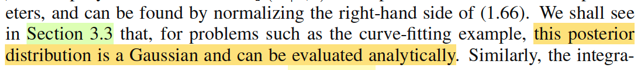

# 1.2.6 Bayesian curve fitting

📊 **Progress:** `3` Notes | `3` Screenshots

---

<kbd></kbd>

> [!NOTE]
> Đây, đây chính là chỗ gs giúp làm rõ cái thắc mắc hồi nãy đây. Lúc nãy mình
> có thắc mắc một điểm: Rõ ràng là trong Casella, khi nói về Bayes estimator
> của θ, ta sẽ đi tìm posterior, rồi lấy mean của nó (hoặc median), và đó mới
> là Bayes estimator: θ^_B(**X**) = E[θ|**X**]; θ ~ π(θ|**X**). Còn khi nãy ta lại đi
> tìm θ khiến maximize π(θ|**X**) thôi, nên nó chưa phải là Bayes estimator.
>
> Thì ở đây ông nói đúng vậy, ta chưa thật sự làm theo full Bayesian treatment,
> mà tí nữa sẽ thấy, khi có posteriori thì ta sẽ INTEGRATE over mọi possible
> value của **w**. Và cái việc này làm ở trái tim của Bayesian method

 

<kbd></kbd>

> [!NOTE]
> Thế thì, để hiểu phần này, mình sẽ cần ôn lại một kiến thức xác suất gọi là khi
> có joint pdf/pmf của hai random variable X, Y marginalizing over mọi possible
> values của Y, ta sẽ có marginal pmf của X.
>
> Lấy ví dụ, xét X, Y là hai discrete random variables có possible value {x1,x2. .}
> và {y1,y2....}. Khi đó:
>
> P(X = x) = Σi P(X = x, Y = yi)
>
> Dạng tương tự đối với continuous rvs: fX(x) = ∫_{range Y} f(x, y)dy
>
> Thế thì, tiếp tục dựa trên một theorem: conditional probability theorem:
>
> f(x, y) = f(x|y)f(y), ta có fX(x) = ∫_{range Y} f(x|y)f(y)dy
>
> Và ý nghĩa của nó đại khái là ta tổng hợp (marginalizing) mọi khả năng của (giá
> trị) y
>
> Vậy thì quay lại đây:
>
> Ta đã có posterior distribution của **w**: π(**w**|**x**,**t**) (tương ứng với
> π(θ|**x**) trong Casella)
>
> Nhưng, trong Casella, cái ta muốn (suy luận - inference - estimate) là θ, nên ta
> sẽ đi lấy mean để có point estimate cho θ, hoặc maximize posterior, cũng để có
> một point estimate của θ.
>
> Còn ở đây, trong bối cảnh bài toán curve fitting nói riêng và trong bài toán
> machine  learning nói chung, ta KHÔNG CẦN **w**. Cái ta cần là **predictive
> distribution**:
>
> f(t|x,**x**,**t**): tức là, ta chỉ cần tính xác suất của T dựa trên traing data **x**, **t
> thôi, không care w**
>
> Còn nhớ phân phối xác suất của Tn, ta đã assume là sẽ ~ normal(y(xi,**w**),
> 1/β), có pdf là f(t|x,**w**,β).
>
> Vì không cần **w**, nên ở đây, ta mới làm một động tác: marginalizing joint pdf
> của T và **w trên mọi possible value của w**. Để từ đó, ta có marginal pdf của T
> thôi:
>
> f(t) = ∫f(t,**w**)d**w** (cái này tương tự như fX(x) = ∫_range Y f(x,y)dy
>
> và thay f(t,**w**) = f(t|**w**) f(**w**) (tương tự f(x,y) = f(x|y)f(y))
>
> ta sẽ có: f(t) = ∫f(t|**w**)f(**w**)d**w**
>
> Cái khung, cái ý tưởng chính là như vậy, ta marginalizing joint pdf của T và **W
> trên  mọi possible value của W, để có marginal pdf của T.**Nhưng để có hình hài đầy đủ của 1.68, ta sẽ hiểu rằng các pdf trên đều
> condition trên cái gì đó:
>
> ví dụ f(t|**w**) phải là f(t|x,w,β) vì distribution của Ti ~ normal(y(xi,w), β) nên pdf
> của T cần thêm x, β nữa. Nhưng vì β coi như đã biết, hoặc ở đây gs nói là ta bỏ
> đi bớt (omit) cho đỡ dài, nên ta chỉ ghi là f(t|x,**w**) thôi.
>
> Tương tự f(**w**) cũng sẽ trở thành f(**w**|**x**,**t**) (hay nên dùng chữ π, vốn
> được quy ước thông thường trong thống kê kí hiệu để chỉ prior và posterior
> distribution π(w|**x**,**t**)) ở trên (đúng ra sẽ là π(**w**|x,t,α) nữa, nhưng cũng
> bỏ bở α cho đỡ dài.
>
> f(t|x,**x,t**) = ∫f(t|x,**w**)π(**w**|**x**,**t**)d**w**. Đây là công thức 1.68
>
> \-----
>
> Một ý nhỏ: ở đây ông Bishop nói có thể tìm thấy π(**w**|**x**,**t**) (theo kí hiệu của ổng
> là p(**w**|**x**,**t**)) bằng cách marginalizing vế bên phải của 1.66 là sao?
>
> → Thì đơn giản là vì: công thức đầy đủ posterior distribution được xây dựng từ
> Bayes theorem: π(θ|**x**) = f(**x**|θ)π(θ) / f(**x**)
>
> Hay ở đây sẽ là π(**w**|x,t,α,β) = f(t|x,**w**,β) π(**w**|α) / f(t|x)
>
> Nhưng vì cái mẫu số, chỉ là đóng vai trò normalizing constant, nên người ta
> thường bỏ qua nó, để chuyển thành kí hiệu tỉ lệ thuận.
>
> Nên nếu muốn có công thức đầy đủ của posterior, thì đừng quên là còn
> cái mẫu số này, mà mẫu số này thì không biết được là bao nhiêu, vì ta ko
> có f(t|x). Tuy nhiên, ta biết nó phải là giá trị c khiến [ ∫f(t|x,**w**,β) π(**w**|α) / c] d**w** = 1
> ⇨ c = ∫f(t|x,**w**,β) π(**w**|α)] d**w**, đó chính là giá trị của f(t|x).

 

<kbd></kbd>

🔗 **Related:** [1.2.5 Curve fitting re-visited.](untitled.md#node-84)

> [!NOTE]
> fGs nói trong phần sau, ta sẽ thấy posterior (với Prior giả định là Normal thì) hóa ra cũng sẽ là Normal. Cái này thì
> trong ví dụ 7.2.16 sách Casella mình đã làm rồi, với random sample X ~ normal(θ, σ^2) và θ được giả định có prior
> distribution θ ~ normal(μ, τ^2) thì khi mình xây dựng posterior ta cũng sẽ thấy nó là pdf của normal
>
> Vậy thì ở đây có thể làm luôn:
>
> π(**w**|**x**,**t**), như phần trước đã biết, hay lúc nãy đã nhắc lại ∝ f(**t**|**x**,**w**)π(**w**|α)
>
> ∝ [Πi=1:n N(ti| y(xi, **w**), 1/β)] . [α/(2π)^(M+1)/2] exp {-(α/2)**w**T**w**}
>
> Xét N(t|y(x,**w**), 1/β).
>
> y(x, **w**) = w0x^0 + w1x^1 + ...wmx^M = w0 + w1x^1 + ...wmx^M
>
> Như phần trước mình cũng đã làm, để thể hiện cái này ở dạng compact ta sẽ:
>
> Đặt Φ(x) là scalar → vector function: nhận vào scalar x, trả ra vector [1, x, x^2,..,x^M]
>
> Khi đó với việc w đã biết là vector [w0,...wM] thì y(x, **w**) có thể thể hiện ở dạng vectorization: **w**TΦ(x).
>
> N(t|y(x,**w**), 1/β) = N(t|**w**TΦ(x), 1/β)
>
> = {1/√[2π(1/β)]} exp[-(t-**w**TΦ(x))^2/2(1/β)]
>
> = {1/√[2π(1/β)]} exp[-(t-**w**TΦ(x))^2/2(1/β)]
>
> Ráp vô:
>
> π(**w**|**x**,**t**) ∝ {Πi=1:n {1/√[2π(1/β)]} exp[-(ti-**w**TΦ(xi))^2/2(1/β)] } . { [α/(2π)^(M+1)/2] exp {-(α/2)**w**T**w**} }
>
> ∝ {1/√[2π(1/β)]}^n [α/(2π)^(M+1)/2]  exp[-Σi (ti-**w**TΦ(xi))^2/2(1/β)] . exp {-(α/2)**w**T**w**} }
>
> ∝ exp[-Σi (ti-**w**TΦ(xi))^2/2(1/β) - (α/2)**w**T**w**]
>
> ∝ exp[-(β/2) Σi (ti-**w**TΦ(xi))^2 - (α/2)**w**T**w**]
>
> Xét phần bên trong exp[..]:
>
> \-(β/2) Σi [(ti-**w**TΦ(xi))^2] - (α/2)**w**T**w**
>
> Đặt **X** là matrix mà hàng i là Φ(xi)T
>
> .. = -(β/2) ||(**t**-**Xw**)||^2 - (α/2)**w**T**w**
>
> = -(β/2) (**t**-**Xw**)T(**t**-**Xw**) - (α/2)**w**T**w**
>
> = -(β/2) (**t**T-**w**T**X**T)(**t**-**Xw**) - (α/2)**w**T**w**= -(β/2) (**t**T**t**-**w**T**X**T**t**-**t**T**Xw**+**w**T**X**T**Xw**) - (α/2)**w**T**w**
>
> = -(β/2) (**t**T**t**- 2**t**T**Xw**+ **w**T**X**T**Xw**) - (α/2)**w**T**w**= -(1/2) (β**t**T**t** - 2β**t**T**Xw** + β**w**T**X**T**Xw** + α**w**T**w**)
>
> = -(1/2) (**w**T(β**X**T**X** + **α**I)**w** - 2β**t**T**Xw** + β**t**T**t**)
>
> Như vậy bên trong exp(..) của posterior là hàm bậc hai theo **w**, điều này cho thấy posterior là Normal, để xác
> định được mean và covariance matrix, ta chỉ việc khớp nó với công thức multivariate Gaussian pdf nói bữa trước.
>
> Xét phần bên trong exp của multivariate Gaussian pdf: -(1/2)(**x** - **μ**)T Σinv (**x** - **μ**)
>
> = -(1/2)(**x**T Σinv - **μ**T Σinv) (**x** -**μ**)
>
> = -(1/2)(**x**T Σinv **x** - **μ**T Σinv **x** - **x**T Σinv **μ** + **μ**T Σinv **μ**)
>
> = -(1/2)(**x**T Σinv **x** - 2 **μ**T Σinv **x** + **μ**T Σinv **μ**)
>
> Tiến hành khớp pattern:
>
> β**X**T**X** + α**I** = **Σinv** → Covariance matrix là (β**X**T**X** + αI)inv
>
> β**t**T**X** = **μ**T Σinv = **μ**T (β**X**T**X** + α**I**)
>
> ⇔ β**t**T**X**(β**X**T**X**+ αI)inv = **μ**T **Σinv** = **μ**T
>
> ⇔ [β**t**T**X**(β**X**T**X** + α**I**)inv]T = **μ**
>
> ⇔ **μ** = [(β**X**T**X** + α**I**)inv]T(β**t**T**X**)T
>
> = (β**X**T**X** - α**I**)inv(β**X**T**t**
>
> Posterior π(**w**|**x**,**t**) là Normal((β**X**T**X** + α**I**)inv(β**X**T**t**,  (β**X**T**X** + α**I**)inv)

 

