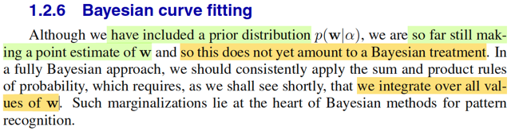
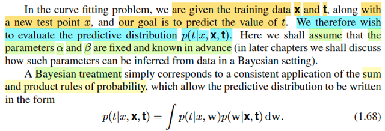

# 1.2.6 Bayesian curve fitting

📊 **Progress:** `1` Notes | `2` Screenshots

---

<kbd></kbd>

> [!NOTE]
> Đây, đây chính là chỗ gs giúp làm rõ cái thắc mắc hồi nãy đây. Lúc nãy mình
> có thắc mắc một điểm: Rõ ràng là trong Casella, khi nói về Bayes estimator
> của θ, ta sẽ đi tìm posterior, rồi lấy mean của nó (hoặc median), và đó mới
> là Bayes estimator: θ^_B(**X**) = E[θ|**X**]; θ ~ π(θ|**X**). Còn khi nãy ta lại đi
> tìm θ khiến maximize π(θ|**X**) thôi, nên nó chưa phải là Bayes estimator.
>
> Thì ở đây ông nói đúng vậy, ta chưa thật sự làm theo full Bayesian treatment,
> mà tí nữa sẽ thấy, khi có posteriori thì ta sẽ INTEGRATE over mọi possible
> value của **w**. Và cái việc này làm ở trái tim của Bayesian method

 

<kbd></kbd>

 

