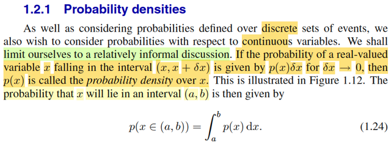
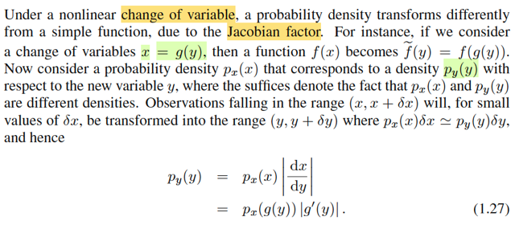
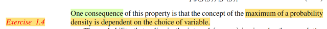
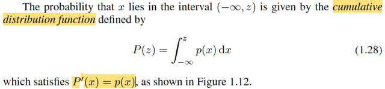
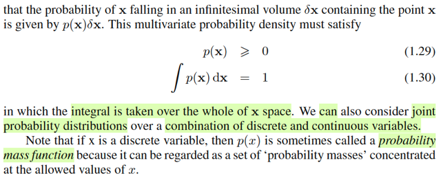
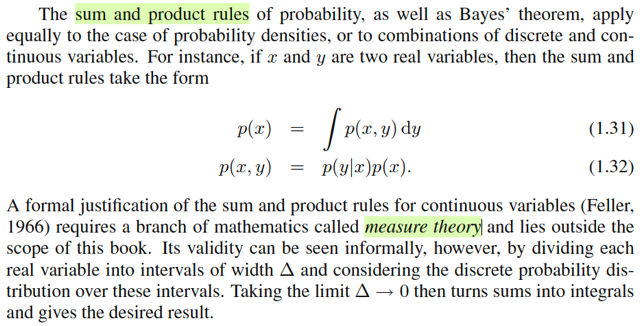
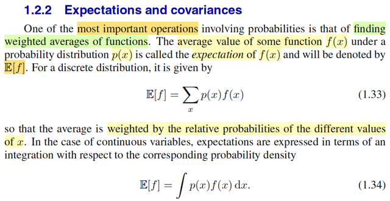
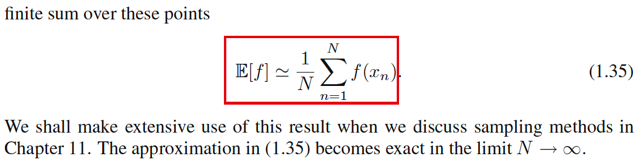
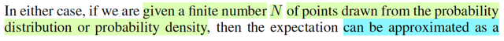

# 1.2 Probability Theory

📊 **Progress:** `24` Notes | `36` Screenshots

---

<kbd></kbd>

> [!NOTE]
> Mở đầu gs nói một ý mình nghĩ rằng rất quan trọng. Đó là, một yếu tố
> quan trọng của pattern recognition là tính uncertainty (tính không chắc).
> Và yếu tố này khởi nguồn có thể là từ nhiễu (noise) trong quá trình đo đạc
> (measurement) hoặc cũng có thể là từ việc ta chỉ có một mẫu với số
> lượng hữu hạn. Do đó, đại ý là ta cần lí thuyết xác suất, nó sẽ mang lại
> cho ta những công cụ để định lượng hóa cũng như là thao tác với các
> yếu tố uncertainty này. Để rồi kết hợp với lí thuyết ra quyết định sẽ giúp ta
> đưa ra những hành động, quyết định tối ưu trên cơ sở những thông tin
> mà ta có, kể cả khi nhưng thông tin này là không đầy đủ (incomplete) và
> mơ hồ (ambiguous)

 

<kbd></kbd>

<kbd></kbd>

> [!NOTE]
> Gs sẽ dùng ví dụ đơn giản này để nói về các khái niệm nền tảng của xác suất:
> Nói ngắn gọn, có 2 hộp xanh đỏ. Hộp đỏ có 2 táo 6 cam, hộp xanh có 3 táo
> 1 cam. Rồi, làm thí nghiệm thế này: Chọn đại một hộp (ngẫu nhiên), rồi bốc đại
> một trái trong đó (dĩ nhiên cũng ngẫu nhiên). xem là trái gì rồi bỏ vào lại. Và
> lặp lại như vậy nhiều lần.
>
> Đến đây ta sẽ giả sử rằng (suppose) sau nhiều lần làm thì 40% ta chọn hộp đỏ
> 60% chọn hộp xanh (có nghĩa là xác suất chọn hộp đỏ nhỏ hơn). Nhưng khi
> chọn trái trong hộp nào thì xác suất chọn trái nào cũng như nhau (equally likely)

 

<kbd></kbd>

> [!NOTE]
> Đến đây là gặp lại một trong những khái niệm nền tảng nhất của xác suất:
> random variable. Cụ thể là nếu quan tâm danh tính của cái hộp được
> chọn, thì nó là một đại lượng mang tính ngẫu nhiên (vì dĩ nhiên là ta đâu
> biết là hộp nào sẽ được chọn trước khi diễn ra hành động thử nghiệm),
> nhưng ta biết nó sẽ mang một trong hai giá trị: xanh hay đỏ.
>
> Trong xác suất, ta mới đặt nó là biến B, với hai possible value là r, b. Nhờ
> stat110 và Casella đã nhắc đi nhắc lại bản chất của B là MỘT
> FUNCTION: Function này maping một possible outcome s trong original
> sample space Ω với các possible value trong range của B. Trong trường
> hợp này, original sample space là không gian mẫu chứa các kết quả mà
> hành động thực hiện thử nghiệm có thể tạo ra: "chọn hộp, chọn trái" và
> range B= {r,b}. Để rồi nếu s là "chọn hộp xanh, chọn trái ..." thì B(s) = b,
> nếu s là "chọn hộp đỏ, chọn trái .." thì B(s) = r
>
> Tương tự, danh tính của trái mà ta chọn cũng là biến ngẫu nhiên, đặt là F,
> nó cũng sẽ có hai possible value là {a, o}. Để rồi nếu s là "(chọn hộp ... ,
> chọn trái táo" thì F(s) = a, nếu s là "chon hộp ...m chọn trái cam" thì F(s) =
> o
>
> Sẵn nói luôn, còn nhớ, rv với hai possible values thì nó chính là Bernoulli
> random variable. Nếu gọi chọn hộp đỏ là một success event, thì B ~
> Bern(0.4) còn F thì cũng là Bern(p). p bằng bao nhiêu thì ta sẽ phải dùng
> LOTP để  tính:
>
> P(F=a) = P(F=a, B=r) + P(F=a, B=b) (marginalizing joint pmf over mọi p.v
> của B)
>
> = P(F=a|B=r)P(B=r) + P(F=a|B=b)P(B=b) (conditional probability theorem)

 

<kbd></kbd>

<kbd></kbd>

> [!NOTE]
> Tiếp chỗ này gs Bishop thật ra đang định nghĩa xác suất theo trường phái cổ
> điển (Frequentist) khi ông nói ta sẽ define xác suất của một event là tỉ lệ xuất
> hiện của nó khi lặp lại vô hạn lần thử nghiệm. (nếu là trường phái Bayesian,
> xác suất của event sẽ phản ánh độ tin tưởng rằng event sẽ xảy ra)
>
> Và vì lúc nãy ta nói cho rằng thử nghiệm vô số lần thì 40% trong số đó sẽ
> chọn hộp đỏ, nên P(B=r) = 0.4, và P(B=b) = 0.6.
>
> Gs nói, theo định nghĩa, nó sẽ phải là con số trong [0,1]. Dễ hiểu là với cách
> định nghĩa này, thì nó là con số tỉ lệ, nên dĩ nhiên nó phải không âm và ≤ 1.
>
> mình nhớ, đây thực ra là từ Axiom 1,2 (2 trong 3 tiên đề của xác suất) : xác
> suất của một biến cố P(A) không âm với mọi A ∈ Ω và P(Ω) = 1.
>
> Câu cuối, gs nói nếu các event loại trừ lẫn nhau (mutually exclusive) và
> chứa mọi possible outcomes thì tổng xác suất sẽ = 1. Là sao?
>
> À thì đây chính là nói khi đó (B = r) và (B = p) sẽ làm thành một partition:
>
> (B = r) U (B = p) = Ω, (B = r) ∩ (B = b) = ∅ thì khi đó:
>
> P[(B = r) U (B = p)] = P(Ω) = 1 theo axiom 2.
>
> mà vế trái, là xác suất của một union của các disjoint event, nên theo axiom
> 3, nó sẽ là tổng xác suất đơn lẻ: 
>
> P[(B = r) U (B = p)] = P(B = r) + P(B = b)
>
> Do đó P(B = r) + P(B = b) = 1

 

<kbd></kbd>

> [!NOTE]
> Definition 1.2.4 sách Casella
> nêu 3 tiên đề xác suất

 

<kbd></kbd>

> [!NOTE]
> Đoạn này tác giả đặt câu hỏi, làm sao ta có thể tính được xác suất của việc
> bốc được một trái táo. Hoặc một câu hỏi khác là nếu đã chọn trái cam thì xác
> xuất ta đã chọn hộp xanh là bao nhiêu.
>
> Thì ông cho rằng, hai cái rule quan trọng của xác suất là sum rule và product
> rule sẽ giúp ta trả lời hai câu hỏi này

 

<kbd></kbd>

<kbd></kbd>

<kbd></kbd>

> [!NOTE]
> Đại ý là ông dùng ví dụ này để ta hiểu về sum rule và product rule: Cho X, Y là hai rvs
> với possible values là x1,....xM, và y1,...yL. Thực hiện thử nghiệm nào đó để có hai gía
> trị cụ thể của X, Y, và làm vậy N lần. (Có thể hình dung ném N viên bi vào một cái bảng
> có L cột và M hàng. Bi rơi vào ô ij, thì tức là X = xi, Y = yj).
>
> Trong đó gọi ci là số bi rơi vào hàng i (X = xi) (ví dụ c2 là số lần X ra bằng x2),  rj là số bi
> rơi vào cột j (số lần Y = yj) Và nij là số viên bi rơi vào hàng i, cột j (X = xi, Y = yj)
>
> Thế thì câu hỏi như hồi nãy đặt ra là ta muốn tính xác suất mà khơi khơi bốc được trái
> táo (ko biết bốc hộp nào), cũng chính là muốn tính P(B = a)
>
> Thì ở đây, nó tương ứng với việc ta đặt câu hỏi tính xác suất X = xi.
>
> Thế thì trong sách, gs Bishop dùng lập luận theo kiểu này, nhưng trước tiên mình có thể
> lập luận theo lối đã học trong Casella
>
> Về mặt bản chất như đã học trong Casella + Stat110:
>
> P(X = xi) = P({s ∈ Ω: X(s) = xi}), ý nghĩa tổng xác suất các biến cố (possible outcome)
> trong không gian mẫu mà map với X ra xi.
>
> Giờ xét cái tập {s ∈ Ω: X(s) = xi},
>
> Dĩ nhiên nó là tập con của Ω: {s ∈ Ω: X(s) = xi} ⊂ Ω
>
> Theo lí thuyết tập hợp: nếu A ⊂ B ⇨ A ∩ B = A
>
> ⇨ {s ∈ Ω: X(s) = xi} = {s ∈ Ω: X(s) = xi} ∩ Ω
>
> Thể hiện Ω = U{mọi possible value yj} {s ∈ Ω: Y(s) = yj}
>
> ⇨ {s ∈ Ω: X(s) = xi} ∩ Ω = {s ∈ Ω: X(s) = xi} ∩ [U{mọi possible value yj} {s ∈ Ω: Y(s) = yj}]
>
> Dùng distributive law: A ∩ (B U C) = (A ∩ B) U (A ∩ C):
>
> .. = U{mọi possible value yj} [{s ∈ Ω: X(s) = xi} ∩ {s ∈ Ω: Y(s) = yj}]
>
> = U{mọi possible value yj} {s ∈ Ω: X(s) = xi, Y(s) = yj}
>
> Viết lại {s ∈ Ω: X(s) = xi} = U{mọi possible value yj} {s ∈ Ω: X(s) = xi, Y(s) = yj}
>
> ⇨ P[{s ∈ Ω: X(s) = xi}] = P{U{mọi possible value yj} {s ∈ Ω: X(s) = xi, Y(s) = yj}]
>
> Vế phải, là xác suất của union của các disjoint events, nên theo Axiom 3:
>
> = Σ_{mọi possible value yj} P({s ∈ Ω: X(s) = xi, Y(s) = yj})
>
> Viết lại P[{s ∈ Ω: X(s) = xi}] = Σ_{mọi possible value yj} P({s ∈ Ω: X(s) = xi, Y(s) = yj})
>
> Và cái này chính là:
>
> P(X = xi) = Σj=1:L P(X = xi, Y = yj), là sum rule, hoặc gọi là marginalize joint pmf trên mọi
> possible value của Y, cũng là lí do ta P(X = xi) gọi là marginal distribution của X
>
> ====
>
> Còn trong sách gs Bishop đại khái là giải thích theo một cái kiểu rất thực nghiệm:
>
> Là nếu gọi nij là số viên bi (trong N viên bi) rơi vào ô X=xi, Y=yj, thì P(X=xi,Y=yj) = nij / N
> với điều kiện ta **phải ngầm hiểu là N → inf**.
>
> Rồi, tương tự ci là số viên bi rơi vào ô X=xi, thì P(X=xi) = ci / N (cũng ngầm hiểu N →
> inf)
>
> thì ci = Σj nij ⇨ P(X=xi) = ci / N = Σj nij / N = Σj P(X=xi, Y=yj)
>
> ⇨ P(X=xi) = Σj P(X=xi, Y=yj)
>
> Và ông nói cái này chính là sum rule của xác suất. (còn mình thì nhìn nó theo góc nhìn
> của stat110, Casella, để nói nó chính là **marginalizing joint distribution của X, Y để có
> marginal distribution  của X**)
>
> Tương tự, với P(X = xi, Y = yj) thì nó sẽ là nij / N (N → inf), và = (nij / ci) (ci / N)
>
> Thì nij / ci là: số bi rơi vào hàng i cột j trong tổng số bi rơi vào hàng i. Và ông cho rằng
> nó chính là P(Y = yj | X = xi)
>
> ⇨ P(X = xi, Y = yj) = P(Y = yj|X = xi)P(X = xi) và gs nói đây là minh họa của product rule.
>
> Còn mình theo phong cách Casella, Stat110 thì thấy đây chỉ là **định lí rút ra từ định
> nghĩa của conditional probability**: Định nghĩa của conditional probability P(A|B) = P(A,B) / P(B) 
>
> ⇨ P(A,B) = P(A|B)P(B)
>
> Nói chung, sách diễn giải này đậm tính trực giác, và chỉ giúp dễ hiểu, chứ ko mang tính
> tổng quát như cách diễn giải theo phong cách Casella

 

<kbd></kbd>

<kbd></kbd>

> [!NOTE]
> Gs quy ước một chút về kí hiệu, p(B) sẽ chỉ distribution của B, p(r) sẽ chỉ  giá trị
> xác suất tại B = r.
>
> Và hai rule của xác suất sẽ thể hiện bởi:
>
> p(X) = ΣY p(X, Y)
>
> và p(X, Y) = p(Y|X)p(X)
>
> Đối chiếu với stat110, Casella:
>
> Thì đây là fX(x) = Σy fX,Y(x,y), cũng là marginalizing joint pdf/pmf, và cũng là,
> bản chất  chính là LOTP
>
> Và fX,Y(x,y) = fX|Y(x|y)fX(x)
>
> Chính là dựa định nghĩa của conditional probability: P(A|B) = P(A,B) / P(B) ⇨
> P(A,B) = P(A|B)P(B), cái này gs Joe Blizstein gọi nó là Conditional probability
> theorem.
>
> Tóm lại mình nên hiểu: **Chỗ này ông Bishop sẽ không theo lối kí hiệu chặt chẽ
> của toán thống kê.**
>
> Vì nếu theo đó, phải ghi rõ ra:
>
> Biến rời rạc:
>
> P(X=x) = Σy P(X=x, Y=y),
>
> P(X=x, Y=y) = P(X=x|Y=y)P(Y=y)
>
> Biến liên tục:
>
> fX(x) = ∫_range Y fX,Y(x,y)dy
>
> fX,Y(x,y) = fX|Y(x|y)fY(y)
>
> Còn ở đây, gs Bishop đặt lại quy định về kí hiệu:
>
> p(X) sẽ chỉ **HÀM DISTRIBUTION CỦA**X, (pmf hoặc pdf)
>
> p(x) sẽ là **GÍA TRỊ HÀM PMF/PDF CỦA X TẠI x
>
> Nếu ko nhớ convention này của gs Bishop thì rất dễ lú sau này**

 

<kbd></kbd>

> [!NOTE]
> Ở đây nói về Bayes' theorem, stat110 ta đã biết nó chỉ là hệ quả của  định
> nghĩa về conditional probability.
>
> P(A|B) = P(A,B)/P(B) (định nghĩa conditional probability)
>
> ⇨ P(A,B) = P(A|B)P(B). Mà P(A,B) = P(B,A) = P(B|A)P(A)
>
> ⇨ Bayes theorem.
>
> Nhưng cái ý cuối là quan trọng: nói rằng cái mẫu số có thể coi như normalizing
> constant để đảm bảo tổng xác suất điều kiện = 1.
>
> Cái này có một case mà mình sẽ thấy hữu ích. Ví dụ như khi xây dựng
> posterior distribution của θ: π(θ|**x**), ta sẽ dùng Bayes theorem:
>
> π(θ|**x**) = f(**x**|θ) π(θ) / f(**x**)
>
> Khi ta đã có priori, π(θ), và joint distribution của random sample f(**x**|θ), thì
> mình sẽ cần care f(**x**), mà chỉ cần đối xử với nó như constant nào đó đảm
> bảo rằng khi sum π(θ|**x**) trên range của θ thì nó sẽ ra 1, nói cách khác,
> f(**x**) sẽ là constant nào đó đảm bảo π(θ|x) là một valid pdf/pmf, gọi là
> normalizing constant.
>
> Dĩ nhiên, ta còn nhớ định nghĩa của likelihood function L(θ|**x**) được định
> nghĩa chính là = f(**x**|θ), tức joint distribution của **X** tại overseved value **x**.

 

<kbd></kbd>

<kbd></kbd>

> [!NOTE]
> Gs Bishop cho mình hình ảnh minh họa joint distribution của hai rv X, Y.
>
> Cũng ko có gì khó hiểu, chỉ lưu ý là: Cái này KHÔNG PHẢI LÀ hình ảnh
> của marginal distribution của X, Y.
>
> NÓ CHỈ LÀ GIÚP CHO TA MỘT Ý NIỆM NÀO ĐÓ VỀ DISTRIBUTION
> CỦA X, Y với N hữu hạn mà thôi, (gọi là **EMPIRICAL
> DISTRIBUTION**) vì để có distribution của X, Y, ta phải xét số lần thực
> hiện thử nghiệm N → infinity.
>
> (Và đây cũng là thứ mình không thấy nói trong Stat110, Casella)
>
> Để rồi sau đó, gs Bishop nói một ý quan trọng: việc **MÔ HÌNH HÓA
> DISTRIBUTION TỪ DỮ LIỆU (HỮU HẠN) ĐÓNG VAI TRÒ LÀ TRÁI
> TIM CỦA PATTERN RECOGNITION**: Câu nói này liên quan trực tiếp
> đến những gì đã học trong Casella: Ví dụ trong bài toán point estimator,
> cái ta làm chính là dựa trên giá trị quan sát được của sample **X**, để
> xây dựng một statistic δ(**X**) làm point estimator cho θ. Nó chính là ý
> gs Bishop nói ở đây.

 

<kbd></kbd>

<kbd></kbd>

<kbd></kbd>

> [!NOTE]
> Đoạn này chỉ là ông quay lại áp mấy cái khái niệm, rule đã giới thiệu vào lại
> hai câu hỏi của bài táon hộp xanh, đỏ, cam táo. Ko có gì khó. Chỉ cần phải
> nhớ là khi nói xác suất của một event ở đây, ta đang ngầm hiểu nhiều thứ:
> Số experiment N → infinity. (đó là lí do mà gs phải nói rõ đề bài là, thực hiện
> nhiều lần thì 40% kết quả ra chọn hộp đỏ, 60% ra chọn hộp xanh).
>
> Do đó ta mới có quyền nói p(B = r) = 0.4, p(B = b) = 0.6
>
> Rồi, trong hộp đỏ có 1 táo 3 cam, thì cũng phải ngầm hiểu là vì đã nói khi thò
> tay vào chọn một trái thì việc bốc trúng trái nào là hoàn toàn ngẫu nhiên.
> Nên khi thực hiện vô số lần bốc, sẽ có 25% trong số đó sẽ chọn được táo,
> và 75% còn lại chọn được cam. Chứ ko phải là chỉ vì trong hộp có 4 trái trong
> đó có 1 táo, thì sẽ đồng nghĩa là xác suất bốc được táo khi đã chọn hộp đỏ 
> là 1/4 liền.
>
> Rồi, khi đó ta sẽ dùng các rule để tính xác suất chọn được táo (marginal)
>
> cũng như dùng Bayes rule để tính xác suất chọn hộp đỏ khi biết đã bốc ra cam

 

<kbd></kbd>

> [!NOTE]
> Đoạn này gs cho ta một cách hiểu quan trọng về Bayes theorem: Ta thấy
> p(B=r) = 4/10. Còn p(B=r|F=o) = 2/3.
>
> Nó phản ánh: Khi chưa có thông tin quan sát được là bốc được quả gì, thì
> niềm tin của việc ta chọn được hộp đỏ chỉ là 0.4, tức là, dựa trên dữ liệu đề
> bài cho nói rằng, khi thực hiện thử nghiệm vô số lần thì xác suất chọn được
> hộp đỏ chỉ là 40%.
>
> Nhưng một khi biết được ta đã chọn được quả cam, thì con số 2/3 nó phản
> ánh rất đúng một thực tế là: trong hai cái hộp thì hộp đỏ có nhiều cam hơn.
> Do đó, nếu ta biết điều này, và biết rằng đã bốc được cam, thì niềm tin của ta
> vào việc đã chọn được hộp đỏ sẽ tăng lên.
>
> Từ đó, ta có prior distribution của B chính là P(B) còn P(B|F) gọi là posterior
> distribution.
>
> Trong casella, như nãy đã nhắc lại, prior distribution của θ là π(θ) và
> posterior distribution của θ là π(θ|**x**)

 

<kbd></kbd>

> [!NOTE]
> Cuối cùng là gs nói qua khái niệm independent event và random 
> variable.

 

<kbd></kbd>

🔗 **Related:** [1.2 Probability Theory](untitled.md#node-46)

> [!NOTE]
> Gs nói về pdf. (ông cũng nhấn mạnh ta sẽ thảo luận những cái này theo
> một cách tương đối không chính thức)
>
> Cách mà gs Bishop nói về pdf mình thấy giống cách nói của gs Blizstein
> trong Stat110:
>
> Nhớ lại vài ý trong cách dẫn dắt của Stat110 và Casella về cái này.
>
> Đại khái là, với biến liên tục, thì xác suất nó mang một giá trị cụ thể nào đó
> là bằng 0. (trong Casella mình đã chứng minh điều này)
>
> Nên ta sẽ không nói để pmf. Thay vào đó người ta define ra cái gọi là pdf.
> Và mình nhớ, trong Casella, pdf của biến liên tục X được định nghĩa như
> sau:
>
> là hàm f(x) sao cho: F(x) = ∫-inf:x f(t)dt
>
> Với định nghĩa này, dùng FTC2 ta sẽ có kết luận cdf F(x) là nguyên hàm
> của pdf f(x): Đó là nó nói rằng, nếu hàm G(x) được định nghĩa là ∫-inf:x f(t)dt
> thì G là nguyên hàm của f: d/dx G(x) = f(x).
>
> Do đó ở đây vì f được định nghĩa như vậy nên F là nguyên hàm của f. Mà
> khi đó theo FTC1, thì ta sẽ có: ∫a:b f(x)dx = F(b) - F(a) = P(X ≤ b) - P(X ≤ a)
> = P(a < X < b) = P(X ∈ (a,b))
>
> again, ở đây gs Bishop ko tuân theo convention của toán nên ghi x (viết
> thường là rv. p viết thường nốt, hic)

 

<kbd></kbd>

> [!NOTE]
> Rồi, gs nói qua hai tính chất mà pdf phải tuân thủ: p(x) ≥ 0 và ∫-inf:inf p(x)dx = 1
>
> Mình còn nhớ trong sách Casella, đây là định lí 1.6.5 sách Casella

 

<kbd></kbd>

> [!NOTE]
> Ở đây nói gs Bishop nói về Transformation Theorem
>
> Nhớ lại trong Stat110, Casella, nếu ta có X ~ fX(x) và Y = g(X) và
> mapping giữa x ∈ range X tới y ∈ range Y là 1-1. Tức là nếu y = g(x) thì
> tồn tại duy nhất x trong range X = ginv(y) trong range X (vẫn cho phép có
> thể có x' khác cũng map với y nhưng x' phải không thuộc range X)
>
> Khi đó fY(y) = fX(x) |dx/dy| = fX(ginv(y) |d/dy x| = fX(ginv(y)) |d/dy ginv(y)|
>
> Ở đây gs Bishop đặt hơi ngược lại, rằng x = g(y), nên kết quả ông cho 
> ra như vậy.

 

<kbd></kbd>

> [!NOTE]
> Gs nói, một hệ quả của tính chất này là maximum của pdf có phụ thuộc
> cách chọn biến.
>
> Ý tác giả là, giá trị x* khiến maximize pdf fX(x) thì y = g(x*) CHƯA CHẮC
> ĐÃ là maximizer của fY(y).
>
> Thử chứng minh xem:
>
> Nếu x* là maximizer của f(x): thì theo calculus: f'X(x*) = 0 và f''X(x*) < 0
>
> Ta có fY(y) = fX(x) |d/dy ginv(y)|
>
> Đặt ginv là h cho gọn: fY(y) =  fX(x) |h'(y)| = fX(h(y)) |h'(y)|
>
> Vậy cần chứng minh là fY'(g(x*)) khác 0.
>
> fY'(y) = d/dy fY(y) = d/dy fX(h(y)) |h'(y)|
>
> = [d/dy fX(h(y))] |h'(y)| + fX(h(y)) d/dy |h'(y)| (product rule)
>
> = [d/dh(y) fX(h(y)) . d/dy h(y)] |h'(y)| + fX(h(y)) d/dy |h'(y)|  (chain rule)
>
> = [fX'(h(y)) . d/dy h(y)] |h'(y)| + fX(h(y)) d/dy |h'(y)|
>
> = fX'(h(y)) . h'(y) |h'(y)| + fX(h(y)) d/dy |h'(y)|
>
> Thay g(x*) vào:
>
> fY'(g(x*)) = fX'(h(g(x*))) . h'(g(x*)) |h'(g(x*))| + fX(h(g(x*))) d/dy |h'(g(x*))|
>
> = fX'(x*)) . h'(g(x*)) |h'(g(x*))| + fX(x*)) d/dy |h'(g(x*))|
>
> = 0 + fX(x*) d/dy |h'(g(x*))| (Do f'X(x*) = 0)
>
> = fX(x*) d/dy |h'(g(x*))|
>
> Và fX(x*) thì là maximum value của fX(x),
>
> Còn d/dy |h'(g(x*))| là d/dy [d/dy ginv(y)] | y = g(x*).
>
> tức là đạo hàm cấp hai của ginv, evaluate tại y = g(x*)
>
> Nếu g là hàm phi tuyến thì ginv cũng vậy, nên đạo hàm cấp 1 của nó của
> nó ko phải hằng số (ví dụ hàm đa thức bậc 2 thì đạo hàm là bậc một),  và
> khi đó đạo hàm cấp 2 chắc chắn là khác 0
>
> (ví dụ nếu ginv(x) = x^2, thì d/dx ginv(x) = 2x, d/dx [d/dx ginv(x)] = 2
>
> d/dx [d/dx ginv(x)] chỉ bằng 0 khi d/dx ginv(x) = constant, và khi đó ginv(x)
> phải là hàm bậc 1, cũng là g phải là phép biến đổi tuýen tính)
>
> Như vậy chưa chắc fX(x*) d/dy |h'(g(x*))| đã bằng 0 ⇨ g(x*) chưa chắc đã
> là critical point ⇨ chưa chắc đã là maximizer của fY

 

<kbd></kbd>

🔗 **Related:** [1.2 Probability Theory](untitled.md#node-42)

> [!NOTE]
> Gs lướt qua cdf, như đã biết trong stat110, Casella, cdf của X được kí hiệu FX(x)
> và là hàm định nghĩa bởi FX(x) = P(X ≤ x). Và vì định nghĩa của pdf nên dùng
> FTC ta có F là nguyên hàm của f như lúc nãy đã nói

 

<kbd></kbd>

<kbd></kbd>

> [!NOTE]
> Gs tiếp tục lướt qua joint pdf của nhiều random variables X1,...Xn làm thành
> vector **X**= [X1,...Xn] (ở đây là x = [x1,...xn], again, phải hiểu là đang nói
> đến random variable vì mr Bishop đã thoát li khỏi convention kí hiệu của
> toán như trong Casella, Stat110, vốn viết hoa để chỉ rv, viết thường để 
> chỉ possible value của rv)
>
> Hai tính chất này tương tự của pdf cho single variable, đã chứng minh trong
> sách Casella rồi.
>
> Ông cũng lướt nhẹ qua pmf
>
> Mình nghĩ (nếu ko có nền tảng xác suất thông kê từ Stat110, Casella, đọc 
> phần này về cơ bản là chả hiểu gì, vì thực tế thì mr Bishop chỉ lướt qua 
> vài khái niệm)

 

<kbd></kbd>

> [!NOTE]
> Rồi, cuối cùng, gặp lại cái vụ marginalizing joint pdf để có marginal pdf
> cũng như là conditional pdf. Ko có gì mới, đã biết ở Casella, Stat110 rồi

 

<kbd></kbd>

> [!NOTE]
> Gs Bishop nói đại ý là một tronng nhưng phép tính quan trọng nhất liên quan
> đến xác suất chính là tính weighted average của một function.
>
> Với hàm f(x) có xác suất p(x), thì weighted average value của f(x) dưới phân
> phối p(x) được gọi là kì vọng của f(x), kí hiệu E[f]. Tính bởi E[f] = Σx p(x)d(x)
>
> Nhờ được soi sáng bởi stat110, Casella, mình nhận ra đây chính là LOTUS.
> Nhớ lại kiến thức trong stat110, gs Joe đầu tiên khi nói về kì vọng, ông nói nó
> chỉ là tính trung bình, ví dụ ta có random variable X, giả sử là một discrete rv,
> có các possible value x1,x2,.... Thì E[X], chỉ là weighted average của X: Σi
> αixi với αi là xác suất X mang giá trị possible xi: P(X = xi), cũng là pmf của X
> tại xi.
>
> E[X] = Σxi xiP(X=xi)
>
> Với biến liên tục, thì ta có công thức E[X] = ∫-inf:inf xfX(x)dx với fX(x) là pdf
> của X
>
> Rồi, ông mới nói qua việc, giả sử ta có random variable khác, Y, tạo thành
> bằng cách áp hàm g(.) vào X. Y = g(X), thì khi muốn tính E[Y], tức E[g(X)],
> theo lẽ  thường, ta sẽ phải đi tìm distribution của Y, tức P(Y = y) với discrete
> case, hay fY(y), pdf của Y với continuous case.
>
> Nhưng nhờ có LOTUS (Law Of Unconscious Statistician) ta có thể chỉ việc áp
> cái hàm g vào trong x của công thức EX, còn lại, cứ dùng pmf/pdf của X:
>
> EY = E[g(X)] = Σxi g(xi)P(X=xi) (discrete)
>
> EY = E[g(X)] = ∫-inf:inf g(x)fX(x)dx (continuous)
>
> Và thể hiện với notation của gs Bishop thì nó chính công thức trong sách
>
> E[f(x)] = Σx f(x)p(x) hay ∫f(x)pxdx
>
> Again, phải nhớ trong sách này gs Bishop đã kí hiệu khác.
>
> x, viết thường, thật ra là random variable, tương ứng với X ở trên
>
> p(x) chính là pmf (tương ứng với P(X=x) của X) hoặc pdf fX(x) của X ở trên.
>
> và f() ở đây tương ứng với hàm g() ở trên. Nên phải hiểu thứ tự nếu ghi
> tương  ứng (cho dễ thấy) phải là E[f] = ∫f(x)p(x)dx
>
> Một điểm nữa, gs Joe trong Stat110 cũng đã nhắc đi nhắc lại, khi áp một
> function lên một rv thì ta được một rv. Nên ở đây nói tính kì vọng của function
> f(x) thì mình tự hiểu nó là tính kì vọng của random variable có được khi áp
> function f lên random variable x

 

<kbd></kbd>

<kbd></kbd>

<kbd></kbd>

<kbd></kbd>

> [!NOTE]
> Thế thì gs nói nếu ta có N điểm lấy (sampling, giá trị quan sát được x1,...xN) từ
> distribution,  thì kì vọng E[f] có thể **tính xấp xỉ** bởi:
>
> E[f] ≈ (1/N) Σn=1:N f(xn)
>
> Và khi N → inf thì xấp xỉ này trở nên đúng với E[f].
>
> Thử nghĩ xem vì sao có vụ này:
>
> Thì cái này chính là dựa trên thứ đã học trong Casella: LLN: Law of Large
> Number theorem, đại khái nói là, nếu ta có random sample X1,...Xn có
> population distribution với mean μ, (dĩ nhiên tức là E[Xi] = μ), thì với vài điều kiện
> cần thiết, sample mean Xbar sẽ converge in probability về μ (Weak LLN) hay
> converges almost surely về μ (Strong LLN)
>
> lim n→inf P(|Xbar_n - μ| < ε) = 1 ∀ ε > 0 (Weak LLN)
>
> P(lim n → inf |Xbar_n - μ| < ε) = 1 ∀ ε > 0 (Strong LLN)
>
> Xbar → μ. tức là, ta đã học Theorem nói rằng:
>
> Và ý nghĩa là, khi **số lượng sample càng lớn** đến vô hạn thì **Xbar sẽ converge
> về true population mean** của distribution.
>
> Thì khi n → inf,  Xbar →  θ
>
> \-----
>
> Quay lại đây, mình có thể hiểu bối cảnh là
>
> Ta có random sample X1,...XN (và dù gs Bishop ko nói, nhưng mình đoán là ngầm
> hiểu chúng iid), áp hàm f vào ta có các rvs f(X1),...f(XN)
>
> Cũng làm thành một random sample F1,...Fn, cũng iid: đều mutually independent, và 
> identity distribution: đều ~ theo phân phối của f(Xi), có mean E[Fi] = E[f(Xi)]
>
> Áp dụng LLN, ta có thể nói
>
> Khi N → inf, Fbar converge về E[f(X)] , nên Fbar ≈ E[f(X)]
>
> Viết theo notation gs Bishop: (1/N) Σi=1:N f(xi) ≈ E[f]

 

<kbd></kbd>

> [!NOTE]
> Khúc này gs nói sơ về tính kì vọng của function f(x,y) wrt distribution của x
>
> E_x[f(x, y)]
>
> Để cho tiện mình dùng z thay y.
>
> Thì thật ra cái này ko có gì lạ. Giả sử ta có random variables X và Z, áp cái hàm
> f(x, z) vào X, Z ta có một random variable mới f(X, Z).
>
> Thế thì, nếu xét trên mỗi giá trị possible value z của Z, thì f(X, z) sẽ cũng là một
> random variable, phụ thuộc X.
>
> Khi đó, muốn tính kì vọng của f(X, z) thì câu chuyện giống như ta có rv X. và muốn
> tính kì vọng của Y = g(X), LOTUS cho phép ta tính:
>
> EY = E[g(X)] = ∫g(x)fX(x)dx với fX(x) là pdf của X vậy.
>
> Thì ở đâu E[f(X,z)] = ∫f(x,z)fX(x)dx
>
> và khi đã tích phân trên toàn range của X rồi thì kết quả không còn phụ thuộc x
> nữa, chỉ còn phụ thuộc z, nên nó là hàm theo z.
>
> Và thật ra cái này mình đã gặp hoài trong chap 7 - Point estimator của  Casella:
> MSE của một point estimator của θ, δ(**X**), được định nghĩa là
>
> MSE(δ, θ) = E_θ[L(δ(**X**), θ)] với L(δ, θ) là squared error loss
>
> L(δ(**X**), θ) = [δ(**X**) - θ]^2
>
> ⇨ MSE(δ, θ) = E_θ[[δ(**X**) - θ]^2]
>
> Và ta phân tích cái này như sau:
>
> [δ(**X**) - θ]^2, dĩ nhiên là một hàm apply lên sample **X** (và θ), nên nó là  một
> random variable.
>
> Lấy kì vọng của random variable này, thì theo lotus, ta sẽ tính bởi
>
> ∫..∫[δ(**x**) - θ]^2 f(**x**|θ)d**x**với f(**x**|θ) là distribution của sample
>
> Nên kết quả sẽ là hàm phụ thuộc θ.
>
> Ở đây mình hiểu kí hiệu E_θ[[δ(**X**) - θ]^2], ý là, nó sẽ là hàm phụ thuộc θ
>
> Còn trong E_x[f(x,y)] thì mang ý nghĩa là, tính kì vọng wrt distribution của x. Nói
> chung là ý nghĩa nó khác, cần phải tự hiểu.
>
> Có thể cần nói thêm, khi theo trường phái cổ điển (Frequentist), θ là fixed, nhưng
> unknown thì ta có thể cho là ví dụ trên ko xác đáng lắm, vì mình đang ví dụ hàm
> f(X,Z) với cả X, Z đều là rv.
>
> Nhưng sự thật thì ta nhớ nếu theo Bayesian, θ làm rv.
>
> Nên lúc này tính MSE(δ(**X**), θ)) với δ là Bayes estimator thì quả thật cả δ(X) và θ
> đều là rv thì khi đó MSE(δ(**X**), θ)) là ví dụ điển hình của cái mà gs Bishop đang
> nói tới.

 

<kbd></kbd>

> [!NOTE]
> Qua cái này.
>
> E_x[f|y] tức là kì vọng của f(x) wrt distribution của x.
>
> Liên hệ với Casella, thì mình đã gặp nó ở cái này đây: Bayes estimator.
>
> Còn nhớ, trong chap 7 Casella, cái estiamator thứ 3 được học chính là
> Bayes estimator. δB(**X**)
>
> Với lập luận như sau, với Bayesian approach, ta coi θ như quantity of
> randomness (tức là cũng là random variable luôn) và nó có distribution
> khi chưa biết gì hết (chưa quan sát được dữ liệu gì), chỉ dựa vào niềm
> tin ban đầu của experimemter Ta gọi là prior distribution, π(θ).
>
> Nhưng khi thấy **X** = **x**, dùng Bayes theorem, ta có thể xây dựng
> distribution của θ dựa trên biết **X** = **x**, π(θ|**x**) = f(**x**|θ) π(θ) /
> f(**x**), gọi là posterior distribution.
>
> Và với distribution này, ta có thể dùng mean hoặc median để đóng vai trò
> là point estimator cho θ.
>
> Ví dụ khi tính dùng loss là squared error loss, Bayes estimator sẽ là
> E[θ|**x**] với θ ~ π(θ|**x**)
>
> Khi đó, E[θ|**x**] = ∫θ π(θ|**x**) dθ thì nếu coi θ = f(θ) (identity function)
>
> thì nó chính là E[f|**x**] = ∫f(θ) π(θ|**x**) dθ = ∫π(θ|**x**) f(θ) dθ
>
> chính là có dạng của E[f|y] = ∫p(x|y)f(x) đó.

 

