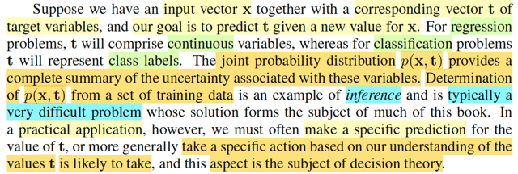
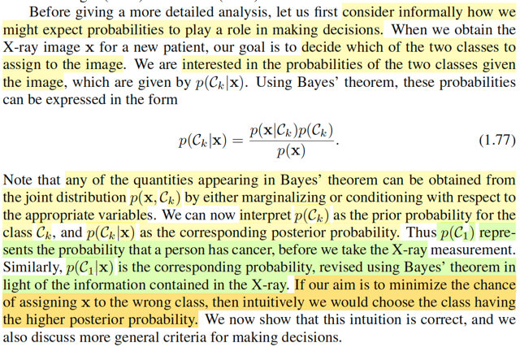
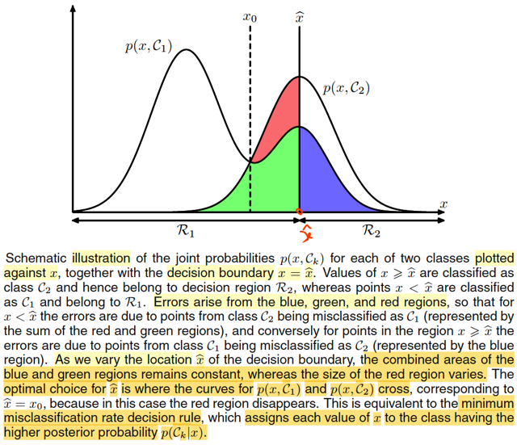
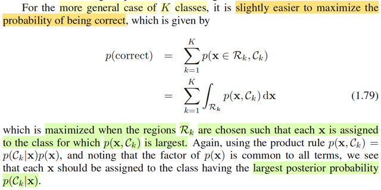

# 1.5 Decision Theory

📊 **Progress:** `8` Notes | `9` Screenshots

---

<kbd></kbd>

> [!NOTE]
> Mở đầu gs cho biết ta đã thấy trong những phần trước lí thuyết xác suất đã
> cung cấp cho ta một framework để định lượng và thao tác với tính
> uncertainty. Thì nay, kết hợp với decision theory, sẽ cho ta một công cụ để
> giúp đưa ra  những quyết định hợp lí trong bối cảnh uncertainty

 

<kbd></kbd>

> [!NOTE]
> Đại khái là, giả sử ta có input vector **x**, tương ứng là vector **t**, và mục
> đích là dự đoán t từ new value x. Thì với bài toán regression, t sẽ là biến
> liên tục. còn classification, t sẽ là class label.
>
> Khi đó joint probability của **X**,**T** (ở đây mình cứ theo quy tắc Casella,
> biến thì viết hoa, cũng như xài chữ f cho quen thuộc) f(**x**,**t**) sẽ phản
> ánh toàn diện mọi tính uncertainty gắn với các random variables này. Và
> bài toán đi xác định phân phối xác suất của **X**,**T**được gọi là**INFERENCE**.
>
> Có thể hiểu ý này, vì xuyên suốt cuốn Statistical Inference của Casella,
> mình chính là deal với bài toán này: cho random sample X = (X1,...Xn) ~
> f(**x**|θ) thì mục tiêu của ta là suy đoán giá trị của θ, tham số chi phối phân
> phối xác suất của **X**, và 3 bài toán lớn là
>
> i) point estimation - tìm cách đưa ra một function của sample W(**X**) sao
> cho với giá trị quan sát **X** = **x** thì ta có một estimate W(**x**) cho θ.
>
> ii) hypothesis testing - tìm cách đưa ra một nhận định rằng θ ∈ Θ0 hoặc θ ∈
> Θ0c, và cụ thể là đi xây dựng một rejection region R = {**x**: reject H0}
> cũng  chính là một hypothesis test, có bản chất là một decision rule: nhận
> vào **x**, tính toán giá trị của test statistic và dùng nó để quyết định xem
> nên tuyên bố θ ∈ Θ0 hay Θ0c.
>
> iii) interval estimator - tìm cách xây dựng một random interval hay khái quát
> hơn là random set C(**X**) để khi quan sát **X** = **x** ta sẽ đưa ra một
> nhận định là θ ∈ C(**X**)
>
> Quay lại đây, gs Bishop cho rằng đây vốn là bài toán rất khó, và sẽ là chủ
> đề xuyên suốt của cuốn sách này. Tuy nhiên, trong những bài toán thực tế,
> ta thường muốn dự đoán t dựa trên giá trị của x hoặc rộng hơn, mục đích
> của ta thường là đưa ra một hành động tốt nhất dựa trên giá trị mà t có khả
> năng cao nhất dựa trên input x

 

<kbd></kbd>

> [!NOTE]
> Lấy ví dụ bài toán y khoa, ta muốn dựa trên input x là vector các giá trị điểm
> ảnh của ảnh chụp x quang, để dự đoán t mang một trong hai giá trị 0 hoặc 1
> để đại diện là C1 và C2 là tên hai class: có bị ung thư hay không bị. Thì ở
> đây nếu ta tìm được phân phối xác suất f(**x**, t) hay f(**x**, Ck)
>
> (chỗ này mình nghĩ ông gs Bishop làm cho rách việc ra thêm bằng cách
> dùng kí hiệu Ck, mình cho là cứ dùng t cũng được, chỉ cần biết nó là
> discrete mang hai  possible value 0 hoặc 1 thôi. Vốn dĩ việc ổng thoát li khỏi
> quy ước kí hiệu bên toán như xài chữ p thay cho f, viết thường cho tên biến
> thay vì viết hoa vốn đã gây dễ lú rồi. Nên ở đây mình sẽ cứ dùng t, f, và tuân
> theo quy ước viết hoa cho tên biến)
>
> thì đó chính là bài toán inference, tuy nhiên sau hết, mục đích vẫn là đưa ra
> quyết định là làm gì tiếp theo, thì đây chính là địa hạt của decision theory, nó
> sẽ giúp ta đưa ra quyết định tối ưu dựa trên xác suất tính toán được.
>
> Và gs cho biết thường thì bước make decision sẽ tương đối đơn giản một
> khi ta đã giải được bài toán inference.

 

<kbd></kbd>

> [!NOTE]
> Trước đi đi vào phân tích chi tiết, ta sẽ xem xét một cách không chính thức
> làm cách nào để ta thấy rằng xác suất sẽ đóng vai trò giúp ta quyết định
> thông qua ví dụ dễ hiểu.
>
> Như nãy đã nói, trong bối cảnh bài toán ta muốn dựa trên tấm ảnh chụp 
> x quang để đưa ra dự đoán bệnh hay không bệnh. Thì ta sẽ muốn xem
> xét f(t|**x**) 
>
> Theo Bayes theorem: f(t|**x**) = f(**x**|t) f(t) / f(**x**)
>
> Y như trong Bayesian approach ta coi θ là random variable để gán cho nó
> prior distribution π(θ), và dựa vào Bayes theorem để cập nhật xác suất
> của θ dựa trên **X** = **x**, để có posterior distribution π(θ|**x**). Thì ở đây, f(t)
> (trong sách là p(Ck) cũng sẽ là prior distribution của T, và f(t|**x**) là posterior
> distribution, với ý nghĩa là:
>
> Khi chưa biết kết quả x-ray thì xác suất một người mắc bệnh (T mang giá
> trị gì) sẽ được quy định bởi prior distribution f(t).
>
> Nhưng sau khi có x-ray thì xác suất của T sẽ do f(t|**x**) quyết định.
>
> Như vậy, để giảm thiểu khả năng phán bệnh sai, lẽ thường ta sẽ dùng
> kết quả của posterior distribution, là trong hai giá trị khả dĩ của T, thì cái
> nào có posterior probability cao hơn.
>
> Vậy thì ở đây, tính được f(t, **x**) coi như là bài toán inference, khi đó, ta
> sẽ tính được f(t|**x**) và việc lấy giá trị nào có posterior cao hơn để gán / báo 
> cho bệnh nhân chính là bước dựa vào decision theory để take action

 

<kbd></kbd>

> [!NOTE]
> Thế thì đại ý là nếu như mục tiêu của ta là giảm thiểu tỉ lệ phân loại nhầm
> (misclassification rate) thì ta sẽ cần một bộ quy tắc để gán giá trị cho của **x**cho
> một trong các class đang xét.
>
> Trước khi nói tiếp, mình tranh thủ recall lại kiến thức trong Casella: Hypo thesis
> testing:
>
> Như lúc nãy cũng đã review lại sơ sơ: Bài toán hypothesis testing là bài toán suy
> luận thống kê mà trong đó ta muốn xây dựng một cái hypothesis test - có bản
> chất chỉ là một decision rule: dựa vào gía trị quan sát của **X**, tính toán ra test
> stastisic λ(**X**) và theo một cái rule nào đó để đưa ra kết luận rằng H0: θ ∈ Θ0,
> gọi là accept null hypothesis, hay kết luận H1: θ ∈ Θ0c gọi là reject null
> hypothesis.
>
> Thế thì, như vậy việc định ra một cái test, cũng chính là định ra cái rule, để rồi áp
> dụng cái rule này với mọi **x** ∈ range **X**, nó sẽ chia range **X**thành hai
> phần, Rejection region R = {**x** ∈ range **X**: reject H0} và Rc = {**x** ∈ range
> **X**: accept H0}, gọi là Acceptance region.
>
> Để rồi, khi đó, khi bàn tới việc đánh giá một hypothesis test, ta sẽ muốn giảm
> thiểu hai loại sai sót: Type I error, là khi θ ∈ Θ0 nhưng lại reject H0 (**X** ∈ R), và
> Type II error, là khi θ ∈ Θ0c nhưng lại accept H0 (**X**∈ Rc).
>
> Để rồi từ đó ta có các khái niệm như power function: β(θ) = P_θ(**X** ∈ R), với
> định nghĩa này, ta sẽ muốn một cái test có Type I error thấp thì có nghĩa là với θ ∈
> Θ0 β(θ) nên thấp, từ đó ta có định nghĩa level α test là test mà:
>
> sup_θ∈Θ0 P_θ(**X** ∈ R) ≤ α.
>
> Và định nghĩa size α test, là test có sup_θ∈Θ0 P_θ(**X** ∈ R) = α.
>
> Và khi đã xét một đám có xác suất Type I error thấp, ví dụ leve α test.
>
> Ta sẽ muốn tìm thằng có xác suất mắc Type II error thấp nhất trong đó, cũng là
> thằng mà khi θ ∈ Θ0c thì xác suất reject H0 là cao nhất mọi thằng khác, đó chính
> là most power level α test, với power function chính là định nghĩa bởi β(θ) =
> P_θ(**X** ∈ R): một test gọi là most power trong các test level α là khi với mọi θ ∈
> Θ0c, thì β(θ) của nó luôn ≥ β'(θ) của mọi test khác trong đám đó.
>
> Review chút xíu cho nhớ, giờ quay lại bài toán này.
>
> \------
>
> Để thực hiện bước phân loại, ta cũng sẽ muốn một cái decision rule, cũng  giống
> như hypothesis test, ta cũng sẽ cần một cái function, để nhận vào x, và trả ra kết
> quả là predict là class nào. Khi đó nó cũng sẽ chia range X thành các vùng, gọi là
> DECISION REGIONS
>
> (không nhất thiết phải là 2 vùng rejection region R và decision region R, mà tùy
> vào số possible class / cũng là số possible values của T, nhưng ở đây thì đúng là
> có 2 vùng, vì T có 2 possible values, gọi là R1, và R2)
>
> Và biên giới phân tách các decision regions gọi là DECISION BOUNDARY.
>
> Thế thì khi nói về event "mắc sai lầm / phân loại sai", nếu trong bối cảnh bài toán
> Hypothesis testing, thì nó sẽ là:
>
> (θ ∈ Θ0, reject H0) hoặc (θ ∈ Θ0c, accept H0)
>
> cũng là (θ ∈ Θ0, **X** ∈ R) hoặc (θ ∈ Θ0c, **X** ∈ Rc)
>
> Tương tự, ở đây, một event "phân loại sai" sẽ là:
>
> (T = C1, phân loại C2) hoặc (t = C2, phân loại C1)
>
> cũng là (T = C1, **X** ∈ R2) hoặc T = C2, **X** ∈ R1)
>
> Thế thì xét xác suất của event "mắc sai lầm" này, ta sẽ thấy.
>
> Với bài toán hypothesis testing, phải chú ý rằng, vì theo Frequentist approach, ta
> không coi θ như random variable, cho nên xác suất mắc Type 1 Error không phải
> là P_θ(θ ∈ Θ0, **X** ∈ R) mà phải define là P_θ(**X** ∈ R) khi θ ∈ Θ0, mang ý
> nghĩa: Khi giá trị của θ, vốn là fixed và unknown, thật sự là ∈ Θ0 thì P_θ(**X** ∈ R)
> chính là xác suất mắc Type I error. (vì sao có chữ θ ở dưới P: P_θ(...) thì là vì
> **X** ~ f(**x**|θ) nên dĩ nhiên xác suất này phụ thuộc θ)
>
> Tương tự, xác suất mắc Type II error sẽ được định nghĩa là:
>
> P_θ(**X** ∈ Rc) khi θ ∈ Θ0c.
>
> Nhưng với bài toán này, vì **X** và T đều là random variable / random vectors,
>
> (Chú ý, **X** là random vectors, nên trong sách gs Bishop dùng bold font, nhưng
> như đã nói ông ko theo convention nữa, nên viết chữ thường (vẫn in đậm, nhưng
> chữ thường **x**) còn mình thì theo convention của Casella, nên in đậm, chữ hoa
> **X**)
>
> nên xác suất của event mắc sai lầm sẽ là:
>
> P[(T = C1, **X** ∈ R2) or (T = C2, **X** ∈ R1)]
>
> = P[(T = C1, **X** ∈ R2) U (T = C2, **X** ∈ R1)]
>
> Đây là union của hai disjoint event, nên theo axiom 2 của lí thuyết xác suất, ta
> tách nó thành tổng của:
>
> = P(T = C1, **X** ∈ R2) + P(T = C2, **X** ∈ R1)
>
> Và đây là xác suất của joint event liên quan đến T, và**X**, nên ta sẽ dùng thể
> hiện nó / tính toán nó bởi joint distribution của T và **X**:
>
> f(t,**x**) | t=C1, **x**∈R2 + f(t,**x**) | t=C2, **x**∈R1
>
> Để thấy bước tiếp theo quen thuộc ta nhớ trong Casella hay Stat110, khi xét joint
> distribution của X,Y f(x,y), và xét xác suát của event X ∈ A, Y ∈ B, ta sẽ lấy tích
> phân ∫A∫B f(x,y)dxdy.
>
> Ở đây nó hơi lạ là đây là joint distribution của một biến discrete và một biến liên
> tục nhưng nguyên lí cũng  vậy thôi, có thể coi cái ta cần tính ở đây là xác suất của
> event T ∈ {C1}, **X** ∈ R2 **⇨** ∫{C1}∫R2 f(t, **x**)d**x** dt = ∫R2 f(C1, **x**)d**x**
>
> nên ta có:
>
> ∫R2 f(C1,**x**)d**x** + ∫R1 f(C2,**x**)d**x**

 

<kbd></kbd>

<kbd></kbd>

> [!NOTE]
> Tiếp, cùng tìm hiểu sao ông Bishop nói dễ thấy là cái rule mà sẽ giúp ta giảm thiểu
> xác suất mistake này sẽ là cái rule sau đây: gán cho **x** cái class nào mà f(**x**,
> Ck) nhỏ hơn. Ví dụ nếu f(**x**, C1) < f(**x**, C2) thì kết luận C2, ngược lại thì kết luận C1.
>
> Mình sẽ nhìn bài toán này theo góc nhìn bài toán tối ưu hóa:
>
> nói bằng lời là:
>
> tìm cái decision rule sao cho dưới cái rule đó, xác suất sai lầm là nhỏ nhất.
>
> Vấn đề là,  với bài toán tối ưu, thì phải xác định biến tối ưu (optimization variable)  là
> gì. Thế thì ở đây, cái cần tìm là một decision rule, ko phải tìm x, y gì cả.
>
> Vậy thì cái biến tối ưu ở đây, là decision rule. Mà decision rule thì làm sao mà thể
> hiện theo toán học đây.
>
> À, như đã biết trong bài toán Hypothesis testing, nói về một cái test, hay test rule,
> thì bản chất cũng chính là nói về cái rejection region hay acceptance region. Vì một
> cái rule, sẽ gắn với cái rejection region có được khi áp cái rule đó để mà chia range
> **X** thành R và Rc.
>
> Nên ở đây cũng vậy, bản chất một cái decision rule, chính là thể hiện qua  các
> decision region R1, R2. Vì tương tự như trên, mỗi một cái decision rule khác nhau
> sẽ tạo ra một bộ decision region khác nhau.
>
> Do đó bài toán tối ưu sẽ được thể hiện như sau:
>
> minimize_R1,R2 {∫R2 f(C1,**x**)d**x** + ∫R1 f(C2,**x**)d**x**}
>
> (chỗ này vì X là vector nên ta phải hiểu đây là tích phân đa biến ∫...∫ nếu ghi
> chặt chẽ theo toán học, chỉ là ghi ∫ cho gọn, cũng như range **X** đây là subset của R^n
> chứ ko phải R)
>
> Tuy nhiên, R1,R2 sẽ có ràng buộc: R1 U R2 = range **X**, và R1, R2 disjoint:  R1 ∩
> R2 = ∅
>
> Nhưng tích phân trên miền R2, có thể được tách thành tích phân trên toàn miền trừ
> tích phân trên miền R1: ∫R2 f(C1,**x**)d**x** = ∫{Range **X**} f(C1,**x**)d**x** - ∫R1
> f(C1,**x**)d**x**
>
> Và xét cái này ∫{Range **X**} f(C1,**x**)d**x**, Ta biết là marginalizing joint pdf/pmf
> của **X**, T trên toàn miền xác định của **X** ta sẽ được marginal pdf/pmf của T.
>
> Do đó ∫{Range **X**} f(C1,**x**)d**x** chính là f(t)|t=C1, tức prior distribution của T,
> evaluate tại t = C1
>
> Vậy bài toán tối ưu lúc này là:
>
> minimize_R1 {f(C1) - ∫R1 f(C1,**x**)d**x** + ∫R1 f(C2,**x**)d**x**} = {f(C1) + ∫R1 [f(C2,
> **x**) - f(C1,**x**)]d**x** }
>
> Và f(C1) thì ko phụ thuộc R1, nên ta chuyển thành bài toán tương đương:
>
> minimize_R1 { ∫R1 [f(C2,**x**) - f(C1,**x**)]d**x** }
>
> Đến đây, nói bằng lời, ta muốn tìm R1, sao cho minimize cái tích phân này
>
> Nếu là bối cảnh bài toán tối ưu với biến **x** thông thường, có lẽ tới đây mình sẽ dùng
> first order necessary condition để tìm **x** khiến gradient = 0, để ra critical point rồi xét
> phép thử bậc hai các kiểu.
>
> Còn ở đây, biến tối ưu lại là một cái region, vậy phải làm sao?
>
> Ta sẽ dựa vào lập luận: mục đích là tìm vùng R1 sao cho minimize tích phân này.
> Mà bản chất tích phân này là tổng: tổng các giá trị [f(C2,**x**) - f(C1,**x**)] trên miền
> R1 ∈ range **X**
>
> Nên có thể diễn dịch yêu cầu là tìm trong miền **X**, để nhặt ra, gom lại những
> giá trị **x** nào đó sao cho tổng [f(C2,**x**) - f(C1,**x**)] trên tập đó là nhỏ nhất.
>
> Để làm được điều này, về trực giác, ta sẽ chọn các **x** khiến cái cụm này âm, thì
> khi đó, tổng của một đám mang giá trị âm mới khiến đẩy giá trị ngày càng nhỏ
> lại.
>
> Và ta cũng chỉ có thể lập luận như vậy, để kết luận R1 tối ưu nên là tập các **x** ∈ range **X**
> sao cho [f(C2,**x**) - f(C1,**x**)] < 0 ⇔ f(C2,**x**) < f(C1,**x**).
>
> Nhờ vậy giúp ta hiểu vì sao gs Bishop nói vậy trong đoạn này. (ông nói clearly
> nhưng mình thấy chả clearly chút nào nếu ko phân tích như trên).
>
> Vậy optimal decision rule (theo tiêu chí minimize misclassification rate) là:
>
> Assign class C1 nếu f(C2,**x**) < f(C1,**x**) và ngược lại.
>
> Và cũng dễ hiểu rằng vì f(t,**x**) = f(t|**x**)f(**x**) **⇨** f(C2,**x**) = f(C2|**x**)f(**x**)
>
> và f(C1,**x**) = f(C1|**x**)f(**x**)
>
> nên decision rule tối ưu cũng là: Assign class C1 nếu f(C2|**x**) (tức posterior pdf
> tại C2) < f(C1|**x**)

 

<kbd></kbd>

> [!NOTE]
> Minh họa bằng hình ảnh này. Vẽ đồ thị của hàm f(C1, **x**) và f(C2, **x**) theo **x**.
>
> Mình phải nói trước: hình ảnh chỉ nên hiểu mang tính minh họa, vì **x** vốn
> đang là vector, ko thể thể hiện nó trên 1 trục như vậy được, hay nói cách
> khác, ở đây coi như **x** chỉ là vector 1-D, do nên ta thấy gs Bishop dùng
> kí hiệu x thường (ko phải x bold: **x** như trong phần trước)
>
> Xác suất của event "phân loại" sai, như vừa phân tích được tính bởi
>
> P(Mistake) = ∫R1 f(C2,x) dx + ∫R2 f(C1,x)dx
>
> Và dĩ nhiên như đã học trong MIT 1801, ý nghĩa của tích phần ∫a:b f(t)dt là
> diện tích của phần đồ thị bên dưới hàm f(t) từ a đến b.
>
> Nên (Mistake) là tổng diện tích của phần đồ thị hàm f(C2,x) với x ∈ R1 và
> diện tích của phần đồ thị hàm f(C1,x) với x trong R2. chính là phần xanh
> đỏ và xanh  lá
>
> Và bài toán đặt ra là tìm R1, R2 giúp minimize cái tổng diện tích này, và
> điều này đồng nghĩa nhích cái decision boundary tại x^ qua lại.
>
> Thế thì đại ý rất dễ thấy đó là, khi dịch chuyển cái x^, thì tổng diện tích
> vùng  xanh lá, xanh dương ko đổi. Nó chỉ thay đổi diện tích vùng đỏ. Và tại
> x^ = x0 thì diện tích vùng đỏ là nhỏ nhất (= 0), đó chính là nơi mà từ tại đó,
> ta có optimal decision rule:
>
> Assign C1 nếu f(C2|x) < f(C1|x) và ngược lại.
>
> Có nghĩa là cái optimal rule sẽ là: Assign C1 nếu x < x0 và ngược lại.

 

<kbd></kbd>

> [!NOTE]
> Nói qua khái quát bài toán lên K classes thay vì 2 classes, ông cho rằng sẽ
> dễ hơn nếu ta đặt objective cho việc tìm rule tối ưu là maximize xác suất
> phân loại đúng thay vì minimize xác suất phân loại sai.
>
> Là sao? À đơn giản là vì đây là hai event disjoint và bù nhau, nên P("mistake"
> ) = 1 - P(" correct"). Mà với bài toán tối ưu thì ta biết rồi, minimize hàm f(x) thì
> cũng là maximize hàm -f(x). Đo đó, minimize P("mistake") tương đương
> maximize
> \- P("mistake"), và cũng tương đương maximize 1 - P("mistake") (cộng hằng
> số vào objective thì cũng được bài toán tương đương), và đây chính là
> maximize P("correct")
>
> Như vậy minimize P("mistake") cũng chính là maximize P("correct")
>
> Nhưng vì sao maximize P("correct") lại dễ hơn.
>
> Là vì, event "correct" dễ định nghĩa hơn event "mistake" trong trường hợp có
> nhiều classes.
>
> Ví dụ có K classes, dĩ nhiên event correct sẽ là:
>
> ([T = C1, decision rule phán là C1] hoặc [T = C2, decision rule phán là C2] ..
>
> hoặc [T = CK, decision rule phán là CK])
>
> viết theo toán học gọn hơn thì sẽ là:
>
> "Correct" = (T = C1, **X** ∈ R1) hoặc (T = C2, **X** ∈ R2) ,...(T = CK, **X** ∈
> Rk)
>
> ⇨ P("Correct") = P[(T = C1, **X** ∈ R1) U (T = C2, **X** ∈ R2) U...U( T = CK,
> **X** ∈ Rk)]
>
> tương tự, đây là union của các disjoint events nên theo axiom 2 (hay 3 nếu
> theo sách Casella)
>
> .. = P[(T = C1, **X** ∈ R1) + P(T = C2, **X** ∈ R2) +...+ P(T = CK, **X** ∈ Rk)]
>
> và tương tự như hồi nãy, nó chính là ∫R1 f(C1,**x**)d**x** + ...∫RK f(CK,
> **x**)d**x**
>
> = Σk=1:K ∫Rk f(Ck,**x**)d**x**Và tương tự như khi K = 2, cái decision rule khiến maximize P("correct") có
> thể đoán được cũng sẽ chính là cái rule này: Assign class Ck nếu joint  pdf
> f(Ck, **x**) và cũng là posterior pdf f(Ck|**x**) là cao nhất trong các k = 1,..K
>
> =====
>
> Vậy ở đây giúp ta hiểu sâu hơn như sau: Nếu tiêu chí của ta, mục tiêu của
> ta là giảm thiểu tỉ lệ sai xót tổng thể, thì cách phân loại tốt nhất chính là
> dựa trên posterior probability

 

