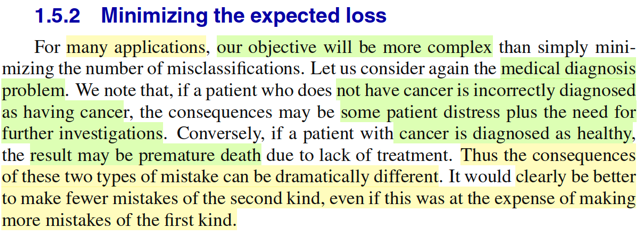
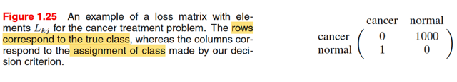
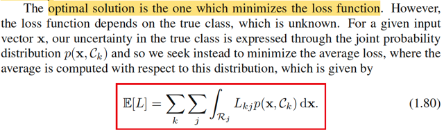

# 1.5 Decision Theory

📊 **Progress:** `12` Notes | `13` Screenshots

---

<kbd></kbd>

> [!NOTE]
> Mở đầu gs cho biết ta đã thấy trong những phần trước lí thuyết xác suất đã
> cung cấp cho ta một framework để định lượng và thao tác với tính
> uncertainty. Thì nay, kết hợp với decision theory, sẽ cho ta một công cụ để
> giúp đưa ra  những quyết định hợp lí trong bối cảnh uncertainty

 

<kbd></kbd>

> [!NOTE]
> Đại khái là, giả sử ta có input vector **x**, tương ứng là vector **t**, và mục
> đích là dự đoán t từ new value x. Thì với bài toán regression, t sẽ là biến
> liên tục. còn classification, t sẽ là class label.
>
> Khi đó joint probability của **X**,**T** (ở đây mình cứ theo quy tắc Casella,
> biến thì viết hoa, cũng như xài chữ f cho quen thuộc) f(**x**,**t**) sẽ phản
> ánh toàn diện mọi tính uncertainty gắn với các random variables này. Và
> bài toán đi xác định phân phối xác suất của **X**,**T**được gọi là**INFERENCE**.
>
> Có thể hiểu ý này, vì xuyên suốt cuốn Statistical Inference của Casella,
> mình chính là deal với bài toán này: cho random sample X = (X1,...Xn) ~
> f(**x**|θ) thì mục tiêu của ta là suy đoán giá trị của θ, tham số chi phối phân
> phối xác suất của **X**, và 3 bài toán lớn là
>
> i) point estimation - tìm cách đưa ra một function của sample W(**X**) sao
> cho với giá trị quan sát **X** = **x** thì ta có một estimate W(**x**) cho θ.
>
> ii) hypothesis testing - tìm cách đưa ra một nhận định rằng θ ∈ Θ0 hoặc θ ∈
> Θ0c, và cụ thể là đi xây dựng một rejection region R = {**x**: reject H0}
> cũng  chính là một hypothesis test, có bản chất là một decision rule: nhận
> vào **x**, tính toán giá trị của test statistic và dùng nó để quyết định xem
> nên tuyên bố θ ∈ Θ0 hay Θ0c.
>
> iii) interval estimator - tìm cách xây dựng một random interval hay khái quát
> hơn là random set C(**X**) để khi quan sát **X** = **x** ta sẽ đưa ra một
> nhận định là θ ∈ C(**X**)
>
> Quay lại đây, gs Bishop cho rằng đây vốn là bài toán rất khó, và sẽ là chủ
> đề xuyên suốt của cuốn sách này. Tuy nhiên, trong những bài toán thực tế,
> ta thường muốn dự đoán t dựa trên giá trị của x hoặc rộng hơn, mục đích
> của ta thường là đưa ra một hành động tốt nhất dựa trên giá trị mà t có khả
> năng cao nhất dựa trên input x

 

<kbd></kbd>

> [!NOTE]
> Lấy ví dụ bài toán y khoa, ta muốn dựa trên input x là vector các giá trị điểm
> ảnh của ảnh chụp x quang, để dự đoán t mang một trong hai giá trị 0 hoặc 1
> để đại diện là C1 và C2 là tên hai class: có bị ung thư hay không bị. Thì ở
> đây nếu ta tìm được phân phối xác suất f(**x**, t) hay f(**x**, Ck)
>
> (chỗ này mình nghĩ ông gs Bishop làm cho rách việc ra thêm bằng cách
> dùng kí hiệu Ck, mình cho là cứ dùng t cũng được, chỉ cần biết nó là
> discrete mang hai  possible value 0 hoặc 1 thôi. Vốn dĩ việc ổng thoát li khỏi
> quy ước kí hiệu bên toán như xài chữ p thay cho f, viết thường cho tên biến
> thay vì viết hoa vốn đã gây dễ lú rồi. Nên ở đây mình sẽ cứ dùng t, f, và tuân
> theo quy ước viết hoa cho tên biến)
>
> thì đó chính là bài toán inference, tuy nhiên sau hết, mục đích vẫn là đưa ra
> quyết định là làm gì tiếp theo, thì đây chính là địa hạt của decision theory, nó
> sẽ giúp ta đưa ra quyết định tối ưu dựa trên xác suất tính toán được.
>
> Và gs cho biết thường thì bước make decision sẽ tương đối đơn giản một
> khi ta đã giải được bài toán inference.

 

<kbd></kbd>

> [!NOTE]
> Trước đi đi vào phân tích chi tiết, ta sẽ xem xét một cách không chính thức
> làm cách nào để ta thấy rằng xác suất sẽ đóng vai trò giúp ta quyết định
> thông qua ví dụ dễ hiểu.
>
> Như nãy đã nói, trong bối cảnh bài toán ta muốn dựa trên tấm ảnh chụp 
> x quang để đưa ra dự đoán bệnh hay không bệnh. Thì ta sẽ muốn xem
> xét f(t|**x**) 
>
> Theo Bayes theorem: f(t|**x**) = f(**x**|t) f(t) / f(**x**)
>
> Y như trong Bayesian approach ta coi θ là random variable để gán cho nó
> prior distribution π(θ), và dựa vào Bayes theorem để cập nhật xác suất
> của θ dựa trên **X** = **x**, để có posterior distribution π(θ|**x**). Thì ở đây, f(t)
> (trong sách là p(Ck) cũng sẽ là prior distribution của T, và f(t|**x**) là posterior
> distribution, với ý nghĩa là:
>
> Khi chưa biết kết quả x-ray thì xác suất một người mắc bệnh (T mang giá
> trị gì) sẽ được quy định bởi prior distribution f(t).
>
> Nhưng sau khi có x-ray thì xác suất của T sẽ do f(t|**x**) quyết định.
>
> Như vậy, để giảm thiểu khả năng phán bệnh sai, lẽ thường ta sẽ dùng
> kết quả của posterior distribution, là trong hai giá trị khả dĩ của T, thì cái
> nào có posterior probability cao hơn.
>
> Vậy thì ở đây, tính được f(t, **x**) coi như là bài toán inference, khi đó, ta
> sẽ tính được f(t|**x**) và việc lấy giá trị nào có posterior cao hơn để gán / báo 
> cho bệnh nhân chính là bước dựa vào decision theory để take action

 

<kbd></kbd>

> [!NOTE]
> Thế thì đại ý là nếu như mục tiêu của ta là giảm thiểu tỉ lệ phân loại nhầm
> (misclassification rate) thì ta sẽ cần một bộ quy tắc để gán giá trị cho của **x**cho
> một trong các class đang xét.
>
> Trước khi nói tiếp, mình tranh thủ recall lại kiến thức trong Casella: Hypo thesis
> testing:
>
> Như lúc nãy cũng đã review lại sơ sơ: Bài toán hypothesis testing là bài toán suy
> luận thống kê mà trong đó ta muốn xây dựng một cái hypothesis test - có bản
> chất chỉ là một decision rule: dựa vào gía trị quan sát của **X**, tính toán ra test
> stastisic λ(**X**) và theo một cái rule nào đó để đưa ra kết luận rằng H0: θ ∈ Θ0,
> gọi là accept null hypothesis, hay kết luận H1: θ ∈ Θ0c gọi là reject null
> hypothesis.
>
> Thế thì, như vậy việc định ra một cái test, cũng chính là định ra cái rule, để rồi áp
> dụng cái rule này với mọi **x** ∈ range **X**, nó sẽ chia range **X**thành hai
> phần, Rejection region R = {**x** ∈ range **X**: reject H0} và Rc = {**x** ∈ range
> **X**: accept H0}, gọi là Acceptance region.
>
> Để rồi, khi đó, khi bàn tới việc đánh giá một hypothesis test, ta sẽ muốn giảm
> thiểu hai loại sai sót: Type I error, là khi θ ∈ Θ0 nhưng lại reject H0 (**X** ∈ R), và
> Type II error, là khi θ ∈ Θ0c nhưng lại accept H0 (**X**∈ Rc).
>
> Để rồi từ đó ta có các khái niệm như power function: β(θ) = P_θ(**X** ∈ R), với
> định nghĩa này, ta sẽ muốn một cái test có Type I error thấp thì có nghĩa là với θ ∈
> Θ0 β(θ) nên thấp, từ đó ta có định nghĩa level α test là test mà:
>
> sup_θ∈Θ0 P_θ(**X** ∈ R) ≤ α.
>
> Và định nghĩa size α test, là test có sup_θ∈Θ0 P_θ(**X** ∈ R) = α.
>
> Và khi đã xét một đám có xác suất Type I error thấp, ví dụ leve α test.
>
> Ta sẽ muốn tìm thằng có xác suất mắc Type II error thấp nhất trong đó, cũng là
> thằng mà khi θ ∈ Θ0c thì xác suất reject H0 là cao nhất mọi thằng khác, đó chính
> là most power level α test, với power function chính là định nghĩa bởi β(θ) =
> P_θ(**X** ∈ R): một test gọi là most power trong các test level α là khi với mọi θ ∈
> Θ0c, thì β(θ) của nó luôn ≥ β'(θ) của mọi test khác trong đám đó.
>
> Review chút xíu cho nhớ, giờ quay lại bài toán này.
>
> \------
>
> Để thực hiện bước phân loại, ta cũng sẽ muốn một cái decision rule, cũng  giống
> như hypothesis test, ta cũng sẽ cần một cái function, để nhận vào x, và trả ra kết
> quả là predict là class nào. Khi đó nó cũng sẽ chia range X thành các vùng, gọi là
> DECISION REGIONS
>
> (không nhất thiết phải là 2 vùng rejection region R và decision region R, mà tùy
> vào số possible class / cũng là số possible values của T, nhưng ở đây thì đúng là
> có 2 vùng, vì T có 2 possible values, gọi là R1, và R2)
>
> Và biên giới phân tách các decision regions gọi là DECISION BOUNDARY.
>
> Thế thì khi nói về event "mắc sai lầm / phân loại sai", nếu trong bối cảnh bài toán
> Hypothesis testing, thì nó sẽ là:
>
> (θ ∈ Θ0, reject H0) hoặc (θ ∈ Θ0c, accept H0)
>
> cũng là (θ ∈ Θ0, **X** ∈ R) hoặc (θ ∈ Θ0c, **X** ∈ Rc)
>
> Tương tự, ở đây, một event "phân loại sai" sẽ là:
>
> (T = C1, phân loại C2) hoặc (t = C2, phân loại C1)
>
> cũng là (T = C1, **X** ∈ R2) hoặc T = C2, **X** ∈ R1)
>
> Thế thì xét xác suất của event "mắc sai lầm" này, ta sẽ thấy.
>
> Với bài toán hypothesis testing, phải chú ý rằng, vì theo Frequentist approach, ta
> không coi θ như random variable, cho nên xác suất mắc Type 1 Error không phải
> là P_θ(θ ∈ Θ0, **X** ∈ R) mà phải define là P_θ(**X** ∈ R) khi θ ∈ Θ0, mang ý
> nghĩa: Khi giá trị của θ, vốn là fixed và unknown, thật sự là ∈ Θ0 thì P_θ(**X** ∈ R)
> chính là xác suất mắc Type I error. (vì sao có chữ θ ở dưới P: P_θ(...) thì là vì
> **X** ~ f(**x**|θ) nên dĩ nhiên xác suất này phụ thuộc θ)
>
> Tương tự, xác suất mắc Type II error sẽ được định nghĩa là:
>
> P_θ(**X** ∈ Rc) khi θ ∈ Θ0c.
>
> Nhưng với bài toán này, vì **X** và T đều là random variable / random vectors,
>
> (Chú ý, **X** là random vectors, nên trong sách gs Bishop dùng bold font, nhưng
> như đã nói ông ko theo convention nữa, nên viết chữ thường (vẫn in đậm, nhưng
> chữ thường **x**) còn mình thì theo convention của Casella, nên in đậm, chữ hoa
> **X**)
>
> nên xác suất của event mắc sai lầm sẽ là:
>
> P[(T = C1, **X** ∈ R2) or (T = C2, **X** ∈ R1)]
>
> = P[(T = C1, **X** ∈ R2) U (T = C2, **X** ∈ R1)]
>
> Đây là union của hai disjoint event, nên theo axiom 2 của lí thuyết xác suất, ta
> tách nó thành tổng của:
>
> = P(T = C1, **X** ∈ R2) + P(T = C2, **X** ∈ R1)
>
> Và đây là xác suất của joint event liên quan đến T, và**X**, nên ta sẽ dùng thể
> hiện nó / tính toán nó bởi joint distribution của T và **X**:
>
> f(t,**x**) | t=C1, **x**∈R2 + f(t,**x**) | t=C2, **x**∈R1
>
> Để thấy bước tiếp theo quen thuộc ta nhớ trong Casella hay Stat110, khi xét joint
> distribution của X,Y f(x,y), và xét xác suát của event X ∈ A, Y ∈ B, ta sẽ lấy tích
> phân ∫A∫B f(x,y)dxdy.
>
> Ở đây nó hơi lạ là đây là joint distribution của một biến discrete và một biến liên
> tục nhưng nguyên lí cũng  vậy thôi, có thể coi cái ta cần tính ở đây là xác suất của
> event T ∈ {C1}, **X** ∈ R2 **⇨** ∫{C1}∫R2 f(t, **x**)d**x** dt = ∫R2 f(C1, **x**)d**x**
>
> nên ta có:
>
> ∫R2 f(C1,**x**)d**x** + ∫R1 f(C2,**x**)d**x**

 

<kbd></kbd>

<kbd></kbd>

> [!NOTE]
> Tiếp, cùng tìm hiểu sao ông Bishop nói dễ thấy là cái rule mà sẽ giúp ta giảm thiểu
> xác suất mistake này sẽ là cái rule sau đây: gán cho **x** cái class nào mà f(**x**,
> Ck) nhỏ hơn. Ví dụ nếu f(**x**, C1) < f(**x**, C2) thì kết luận C2, ngược lại thì kết luận C1.
>
> Mình sẽ nhìn bài toán này theo góc nhìn bài toán tối ưu hóa:
>
> nói bằng lời là:
>
> tìm cái decision rule sao cho dưới cái rule đó, xác suất sai lầm là nhỏ nhất.
>
> Vấn đề là,  với bài toán tối ưu, thì phải xác định biến tối ưu (optimization variable)  là
> gì. Thế thì ở đây, cái cần tìm là một decision rule, ko phải tìm x, y gì cả.
>
> Vậy thì cái biến tối ưu ở đây, là decision rule. Mà decision rule thì làm sao mà thể
> hiện theo toán học đây.
>
> À, như đã biết trong bài toán Hypothesis testing, nói về một cái test, hay test rule,
> thì bản chất cũng chính là nói về cái rejection region hay acceptance region. Vì một
> cái rule, sẽ gắn với cái rejection region có được khi áp cái rule đó để mà chia range
> **X** thành R và Rc.
>
> Nên ở đây cũng vậy, bản chất một cái decision rule, chính là thể hiện qua  các
> decision region R1, R2. Vì tương tự như trên, mỗi một cái decision rule khác nhau
> sẽ tạo ra một bộ decision region khác nhau.
>
> Do đó bài toán tối ưu sẽ được thể hiện như sau:
>
> minimize_R1,R2 {∫R2 f(C1,**x**)d**x** + ∫R1 f(C2,**x**)d**x**}
>
> (chỗ này vì X là vector nên ta phải hiểu đây là tích phân đa biến ∫...∫ nếu ghi
> chặt chẽ theo toán học, chỉ là ghi ∫ cho gọn, cũng như range **X** đây là subset của R^n
> chứ ko phải R)
>
> Tuy nhiên, R1,R2 sẽ có ràng buộc: R1 U R2 = range **X**, và R1, R2 disjoint:  R1 ∩
> R2 = ∅
>
> Nhưng tích phân trên miền R2, có thể được tách thành tích phân trên toàn miền trừ
> tích phân trên miền R1: ∫R2 f(C1,**x**)d**x** = ∫{Range **X**} f(C1,**x**)d**x** - ∫R1
> f(C1,**x**)d**x**
>
> Và xét cái này ∫{Range **X**} f(C1,**x**)d**x**, Ta biết là marginalizing joint pdf/pmf
> của **X**, T trên toàn miền xác định của **X** ta sẽ được marginal pdf/pmf của T.
>
> Do đó ∫{Range **X**} f(C1,**x**)d**x** chính là f(t)|t=C1, tức prior distribution của T,
> evaluate tại t = C1
>
> Vậy bài toán tối ưu lúc này là:
>
> minimize_R1 {f(C1) - ∫R1 f(C1,**x**)d**x** + ∫R1 f(C2,**x**)d**x**} = {f(C1) + ∫R1 [f(C2,
> **x**) - f(C1,**x**)]d**x** }
>
> Và f(C1) thì ko phụ thuộc R1, nên ta chuyển thành bài toán tương đương:
>
> minimize_R1 { ∫R1 [f(C2,**x**) - f(C1,**x**)]d**x** }
>
> Đến đây, nói bằng lời, ta muốn tìm R1, sao cho minimize cái tích phân này
>
> Nếu là bối cảnh bài toán tối ưu với biến **x** thông thường, có lẽ tới đây mình sẽ dùng
> first order necessary condition để tìm **x** khiến gradient = 0, để ra critical point rồi xét
> phép thử bậc hai các kiểu.
>
> Còn ở đây, biến tối ưu lại là một cái region, vậy phải làm sao?
>
> Ta sẽ dựa vào lập luận: mục đích là tìm vùng R1 sao cho minimize tích phân này.
> Mà bản chất tích phân này là tổng: tổng các giá trị [f(C2,**x**) - f(C1,**x**)] trên miền
> R1 ∈ range **X**
>
> Nên có thể diễn dịch yêu cầu là tìm trong miền **X**, để nhặt ra, gom lại những
> giá trị **x** nào đó sao cho tổng [f(C2,**x**) - f(C1,**x**)] trên tập đó là nhỏ nhất.
>
> Để làm được điều này, về trực giác, ta sẽ chọn các **x** khiến cái cụm này âm, thì
> khi đó, tổng của một đám mang giá trị âm mới khiến đẩy giá trị ngày càng nhỏ
> lại.
>
> Và ta cũng chỉ có thể lập luận như vậy, để kết luận R1 tối ưu nên là tập các **x** ∈ range **X**
> sao cho [f(C2,**x**) - f(C1,**x**)] < 0 ⇔ f(C2,**x**) < f(C1,**x**).
>
> Nhờ vậy giúp ta hiểu vì sao gs Bishop nói vậy trong đoạn này. (ông nói clearly
> nhưng mình thấy chả clearly chút nào nếu ko phân tích như trên).
>
> Vậy optimal decision rule (theo tiêu chí minimize misclassification rate) là:
>
> Assign class C1 nếu f(C2,**x**) < f(C1,**x**) và ngược lại.
>
> Và cũng dễ hiểu rằng vì f(t,**x**) = f(t|**x**)f(**x**) **⇨** f(C2,**x**) = f(C2|**x**)f(**x**)
>
> và f(C1,**x**) = f(C1|**x**)f(**x**)
>
> nên decision rule tối ưu cũng là: Assign class C1 nếu f(C2|**x**) (tức posterior pdf
> tại C2) < f(C1|**x**)

 

<kbd></kbd>

> [!NOTE]
> Minh họa bằng hình ảnh này. Vẽ đồ thị của hàm f(C1, **x**) và f(C2, **x**) theo **x**.
>
> Mình phải nói trước: hình ảnh chỉ nên hiểu mang tính minh họa, vì **x** vốn
> đang là vector, ko thể thể hiện nó trên 1 trục như vậy được, hay nói cách
> khác, ở đây coi như **x** chỉ là vector 1-D, do nên ta thấy gs Bishop dùng
> kí hiệu x thường (ko phải x bold: **x** như trong phần trước)
>
> Xác suất của event "phân loại" sai, như vừa phân tích được tính bởi
>
> P(Mistake) = ∫R1 f(C2,x) dx + ∫R2 f(C1,x)dx
>
> Và dĩ nhiên như đã học trong MIT 1801, ý nghĩa của tích phần ∫a:b f(t)dt là
> diện tích của phần đồ thị bên dưới hàm f(t) từ a đến b.
>
> Nên (Mistake) là tổng diện tích của phần đồ thị hàm f(C2,x) với x ∈ R1 và
> diện tích của phần đồ thị hàm f(C1,x) với x trong R2. chính là phần xanh
> đỏ và xanh  lá
>
> Và bài toán đặt ra là tìm R1, R2 giúp minimize cái tổng diện tích này, và
> điều này đồng nghĩa nhích cái decision boundary tại x^ qua lại.
>
> Thế thì đại ý rất dễ thấy đó là, khi dịch chuyển cái x^, thì tổng diện tích
> vùng  xanh lá, xanh dương ko đổi. Nó chỉ thay đổi diện tích vùng đỏ. Và tại
> x^ = x0 thì diện tích vùng đỏ là nhỏ nhất (= 0), đó chính là nơi mà từ tại đó,
> ta có optimal decision rule:
>
> Assign C1 nếu f(C2|x) < f(C1|x) và ngược lại.
>
> Có nghĩa là cái optimal rule sẽ là: Assign C1 nếu x < x0 và ngược lại.

 

<kbd></kbd>

> [!NOTE]
> Nói qua khái quát bài toán lên K classes thay vì 2 classes, ông cho rằng sẽ
> dễ hơn nếu ta đặt objective cho việc tìm rule tối ưu là maximize xác suất
> phân loại đúng thay vì minimize xác suất phân loại sai.
>
> Là sao? À đơn giản là vì đây là hai event disjoint và bù nhau, nên P("mistake"
> ) = 1 - P(" correct"). Mà với bài toán tối ưu thì ta biết rồi, minimize hàm f(x) thì
> cũng là maximize hàm -f(x). Đo đó, minimize P("mistake") tương đương
> maximize
> \- P("mistake"), và cũng tương đương maximize 1 - P("mistake") (cộng hằng
> số vào objective thì cũng được bài toán tương đương), và đây chính là
> maximize P("correct")
>
> Như vậy minimize P("mistake") cũng chính là maximize P("correct")
>
> Nhưng vì sao maximize P("correct") lại dễ hơn.
>
> Là vì, event "correct" dễ định nghĩa hơn event "mistake" trong trường hợp có
> nhiều classes.
>
> Ví dụ có K classes, dĩ nhiên event correct sẽ là:
>
> ([T = C1, decision rule phán là C1] hoặc [T = C2, decision rule phán là C2] ..
>
> hoặc [T = CK, decision rule phán là CK])
>
> viết theo toán học gọn hơn thì sẽ là:
>
> "Correct" = (T = C1, **X** ∈ R1) hoặc (T = C2, **X** ∈ R2) ,...(T = CK, **X** ∈
> Rk)
>
> ⇨ P("Correct") = P[(T = C1, **X** ∈ R1) U (T = C2, **X** ∈ R2) U...U( T = CK,
> **X** ∈ Rk)]
>
> tương tự, đây là union của các disjoint events nên theo axiom 2 (hay 3 nếu
> theo sách Casella)
>
> .. = P[(T = C1, **X** ∈ R1) + P(T = C2, **X** ∈ R2) +...+ P(T = CK, **X** ∈ Rk)]
>
> và tương tự như hồi nãy, nó chính là ∫R1 f(C1,**x**)d**x** + ...∫RK f(CK,
> **x**)d**x**
>
> = Σk=1:K ∫Rk f(Ck,**x**)d**x**Và tương tự như khi K = 2, cái decision rule khiến maximize P("correct") có
> thể đoán được cũng sẽ chính là cái rule này: Assign class Ck nếu joint  pdf
> f(Ck, **x**) và cũng là posterior pdf f(Ck|**x**) là cao nhất trong các k = 1,..K
>
> =====
>
> Vậy ở đây giúp ta hiểu sâu hơn như sau: Nếu tiêu chí của ta, mục tiêu của
> ta là giảm thiểu tỉ lệ sai xót tổng thể, thì cách phân loại tốt nhất chính là
> dựa trên posterior probability

 

<kbd></kbd>

> [!NOTE]
> Qua đây, đại ý là, trong nhiều trường hợp, mục tiêu không đơn giản chỉ là
> giảm tỉ lệ sai sót nói chung.
>
> Quay lại ví dụ việc xác định bệnh nhân có bệnh hay không, đôi khi hai
> loại lỗi nó có mức độ hậu qủa khác nhau. Ví dụ như không có ung thư mà
> phán là có, thì có thể cùng lắm là khiến bệnh nhân lo lắng và xét nghiệm
> thêm các kiểu tốn tìền. Nhưng nếu có ung thư mà chẩn đoán là không thì
> người ta có thể sẽ chết vì không được chữa trị.
>
> Lúc này, mục tiêu của ta có thể là ưu tiên loại error thứ hai, chấp nhận
> error thứ nhất (ý là nếu so sánh performance của các quy trình chẩn đoán
> thì có thể ưu tiện chọn cái có tỉ lệ error thứ hai nhỏ nhất, dù error thứ nhất
> nó ko phải là nhỏ nhất)
>
> Lại liên hệ nó với hypothesis testing cho vui. Mình đã review lại một ít
> trong các note trước, rằng trong bài toán này, ta cũng sẽ có hai loại error:
> Type I error, là khi θ thật sự thuộc Θ0, nhưng lại kết luận là reject H0, hay
> **X** ∈ R và Type II error là khi θ ∈ Θ0c mà lại kết luận là accept H0: **X**
> ∈ Rc.
>
> Thì còn nhớ, trong sách Casella, ta đã nghe là, trong thực tế, người ta sẽ
> dành Type I error để chỉ lại sai lầm mà ta muốn  tránh bằng mọi giá, ưu
> tiên tránh, vì mang lại hậu quả lớn. Ví dụ như trong nghiên cứu thuốc
> mới, nếu thuốc gây tác dụng phụ nguy hiểm mà kết quả test lại kết luận
> thuốc không có tác dụng phụ gì, thì hậu quả sẽ rất lớn. Do đó, ta sẽ đặt
> H0: θ ∈ Θ0 ứng với: Thuốc có tác dụng phụ. Để rồi Type I error sẽ là:
> thuốc có tác dụng phụ mà lại công bố là không.
>
> Khi đó, bằng cách định nghĩa như vầy, ta sẽ tập trung xây dựng level α
> test, ví dụ level 0.001 test, theo định nghĩa, là các test có xác suất mắc lỗi
> loại I cao nhất cũng không bao giờ vượt quá 0.001.
>
> Sau đó, ta mới đi tìm trong các level 0.001 test, cái nào có xác suất mắc
> Type II error thấp nhất.
>
> Đây là một cách tiếp cận của việc đánh giá (evaluating) hypothesis test

> [!NOTE]
> Thế thì vừa rồi mình đã ôn lại cách tiếp cận vấn đề đánh giá một hypothesis testing trong
> Casella, dĩ nhiên còn vài vấn đề khác, ví dụ như khi không tồn tại Uniformly Most Powerful
> test, rồi p-values.
>
> Recall thêm chút nữa:
>
> Trong thống kê cổ điển như cuốn Casella, mình nhớ là với Point estimator, Hypothesis
> testing, Interval estimator đều nói đến cách tiếp cận của decision theory để đánh giá (7.3.
> 4, 8.3.5, 9.3.4)
>
> Ôn lại vài khái niệm liên quan đến decision theory đã học trong phần Point estimation và
> Interval estimation Casella: Đầu tiên, đối với point estimator thì khi dẫn dắt ta về cái này,
> gs Casella nói rằng, trong decision theory, action space là không gian những action, mà áp
> vào bối cảnh point estimation thì action đó là "(đưa ra) một estimation của θ", để rồi action
> space, là tập hợp mọi estimation của θ. Thế thì, theo decision theory, một action sẽ tạo ra
> một loss, và hàm loss sẽ là hàm được định nghĩa để phản ánh mức độ nghiêm trọng của
> action. Với bài toán estimation, thì loss có thể dùng **squared error loss** L(θ, δ(**x**)) =
> (δ(**x**)-θ)^2 hoặc **absolute error loss**L(θ,δ(**x**)) = |δ(**x**) - θ|
>
> Và như vậy thì, với loss function, ta sẽ có một hàm số phụ thuộc θ phản ánh chất lượng
> của estimator δ(**X**) ứng với θ cụ thể nào đó.
>
> Và để có một con số duy nhất, không phụ thuộc **X**, phản ánh chất lượng của estimator
> δ(**X**) nói chung, ta sẽ định nghĩa cái gọi là risk function:
>
> R(δ(**X**), θ) = E_θ[L(δ(**X**), θ)], với phân tích ý nghĩa như sau:
>
> L(δ(**X**), θ) sẽ là một random variable, vì nó là kết quả do áp một function lên δ(**X**)
> nên phụ thuộc δ(**X**), nên phụ thuộc **X**.
>
> Lấy kì vọng cái random variable này, thì tính cái này, thì ta sẽ dùng distribution của
> L(δ(**X**),θ), mang ý nghĩa là marginalizing mọi giá trị khả dĩ của L, nên kết quả sẽ là fix,
> không còn là random variable nữa, không phụ thuộc **X** nữa. nhưng nó vẫn là hàm theo
> θ.
>
> Và bằng cách tìm cái δ(**X**) có risk nhỏ nhất với mọi θ thì ta sẽ có cái estimator tốt nhất,
> tức là minimum risk estimator.
>
> Và có thể thấy, nếu loss là squared error loss thì:
>
> R(δ(**X**), θ) = E_θ[(δ(**X**) - θ)^2] thì đây chính là định nghĩa của hàm MSE:
>
> MSE củan estimator W(**X**), define bởi: MSE(W(**X**),θ) = E_θ[(W(**X**) - θ)^2].
>
> Từ đó, ta mới liên hệ với việc tìm estimator**minimize MSE cũng chính là tìm estimator
> minimize square error loss risk function**.
>
> Và triển khai thêm tí nữa:
>
> Dùng VarX = EX^2 - (EX)^2 ⇨ Var[W(**X**) - θ] = E[(W(**X**) - θ)^2] - E[W(**X**) - θ])^2
>
> Do đó MSE(W(**X**), θ) = R(W(**X**), θ)_squared error loss = E_θ[(W(**X**) - θ)^2]
>
> = Var[Var(**X**) - θ] + (E[W(**X**) - θ])^2
>
> = Var[Var(**X**)] + (E[W(X) - θ])^2
>
> Và E[W(**X**) - θ] lại chính là definition của Bias(W(X), θ)
>
> ⇨ MSE(W(**X**), θ) = Var[W(**X**)] + [Bias(W(**X**), θ)]^2
>
> \-----
>
> Sang tới interval estimator, thì lúc này loss function cần phản ánh hai thứ: độ chính xác
> (C(**X**) chứa θ và kích thước C(**X**). Do đó, loss sẽ là kết hợp  của một indicator
> function I_{C(**X**) chứa θ} (= 0 khi C(**X**) chứa và bằng 1 khi  C(X) không chứa θ) và
> Size(C(**X**)) với một tham số b giúp điều chỉnh tương quan giữa hai sub-objective này:
>
> L(C(**X**), θ) = I_{θ ∈ C(**X**)} + b Size(C(**X**)), thể hiện: nếu C(**X**) chứa θ và có size
> nhỏ thì loss sẽ nhỏ.
>
> Và ta cũng sẽ đặt ra risk function của interval estimator là kì vọng của loss này. Để rồi tìm
> cách tìm estimator mà giảm thiểu risk:
>
> R(C(**X**), θ) = E_θ[L(C(**X**), θ)].
>
> \-----
>
> Còn với bài toán Hypothesis testing, trong 8.3.5 Casella ta được biết rằng, với bài toán
> này, action sẽ chỉ là một trong hai: a0, a1 biểu diễn kết luận của test rule là accept H0 hay
> reject H0. Và ta cũng sẽ define loss function, gọi là 1-0 loss để phản ảnh hậu quả:
>
> L(θ, a0) = 0 nếu θ ∈ Θ0, = 1 nếu θ ∈ Θ0c
>
> L(θ, a1) = 0 nếu θ ∈ Θ0c, = 1 nếu θ ∈ Θ0,
>
> Và risk cũng sẽ là function lấy trung bình loss:
>
> Chỗ này cần nói rõ cho dễ hiểu: Định nghĩa của loss, luôn gắn với một action. Với point
> estimator, loss kí hiệu là L(δ(**X**), θ), để rồi nó là một random variable, mà khi nhận giá trị
> **X** = **x**, kéo theo δ(**X**) mang giá trị estimate cho θ: δ(**x**) (là một action), kéo theo
> phát sinh loss L(δ(**x**), **θ**) từ action này. Và vì L(δ(**X**), θ) là random variable, nên
> risk = lấy kì vọng, chính là dựa trên distribution của cái thằng L này, và truy nguyên nguòn
> gốc thì c**ũng chỉ là xuất phát từ distribution của X**: f(**x**|θ), do đó risk mới là hàm phụ
> thuộc θ.
>
> Tương tự, với interval estimator, thì action là một interval C(**x**), loss L(C(**X**), θ) cũng
> là random variable, mà yếu tố random của nó đến từ C(**X**). Khi quan sát **X** = **x**,
> C(**X**) mang giá trị C(**x**), thì nó mang ý nghĩa là một action được đưa ra: một interval
> được dự đoán sẽ chứa θ, và với action đó, phát sinh loss: L(C(**x**), θ). Nên lấy kì vọng
> cái này để có risk, thì ta sẽ dựa trên **distribution của C(X)**, tất nhiên, C(**X**), nếu là
> random interval, thì cũng sẽ được cấu thành bởi hai random variable L(**X**), U(**X**), nên
> tương tự, cũng chỉ là xuất phát từ distribution của **X**
>
> Còn trong hypothesis testing, action là một kết luận mang một trong hai giá trị a0 hoặc a1,
> nên ta có thể thể hiện nó bởi λ(**X**) nào đó, là một Bernoulli random variable, để rồi khi
> quan sát **X** = **x**, λ(**X**) ghi nhận giá trị cụ thể λ(**x**) (= a0 hoặc a1), loss ghi nhận
> giá trị cụ thể L(θ, λ(**x**)) (là L(θ, a0) hoặc L(θ, a1)).
>
> Nhờ vậy, ta hiểu trong hypothesis testing, loss L(θ, λ(**X**)) là một Bernoulli random
> variable
>
> nên khi lấy trung bình, dĩ nhiên ta sẽ dựa trên distribution của Bernoulli:
>
> R(θ, λ(**X**)) = E_θ[L(θ, λ(**X**)]
>
> = L(θ, a0) * P_θ[L(θ, λ(**X**)) = L(θ, a0)] + L_θ(θ, a1) * P[L(θ, λ(**X**) = L(θ, a1)]
>
> = L(θ, a0) * P_θ(λ(**X**) = a0) + L_θ(θ, a1) * P(λ(**X**) =  a1)
>
> = L(θ, a0) * P_θ(**X** ∈ Acceptance region Rc) + L(θ, a1) * P_θ(**X** ∈ Rejection region R)
>
> Và tùy vào θ ở đâu:
>
> θ ∈ Θ0 ⇨ R = 0 * P_θ(**X** ∈ Rc) + 1 * P_θ(**X** ∈ R) = β(θ)
>
> θ ∈ Θ0c = R = 1 * P_θ(**X** ∈ Rc) + 0 * P_θ(**X** ∈ R) = P_θ(**X** ∈ Rc) = 1 - β(θ)
>
> Cuối cùng, nếu muốn thay đổi tương quan giữa hậu quả của hai loại Type I và II error, ta
> có thể thay đổi định nghĩa của loss, gọi là generalized 1-0 loss
>
> L(θ, a0) = 0 nếu θ ∈ Θ0, = cII nếu θ ∈ Θ0c
>
> L(θ, a1) = 0 nếu θ ∈ Θ0c, = cI nếu θ ∈ Θ0,
>
> Khi đó R(θ, λ(**X**)):
>
> Khi θ ∈ Θ0: R = cI * P_θ(**X** ∈ R) + 0 * P_θ(X ∈ Rc) = cI * β(θ)
>
> Khi θ ∈ Θ0c: R = cII * P_θ(**X** ∈ R) + 0 * P_θ(X ∈ Rc) = cII * (1 - β(θ))

 

<kbd></kbd>

<kbd></kbd>

> [!NOTE]
> Quay lại đây, trong bối cảnh machine learning, gs Bishop giới thiệu về cách tiếp
> cận decision theory: Ta sẽ dùng loss function (hay cost function) để phản ánh
> những hậu quả do các quyết định tạo ra. Thì có thể thấy nó y chang những gì đã
> học trong Casella. Chỉ khác là ta mở rộng lên K class, tức là decision rule không
> còn chỉ đưa ra một trong hai action a0 a1 nữa. Mà là a1,...aK, hay như trong
> sách, là C1,...Ck
>
> Và định nghĩa của loss, phải thể hiện bằng môt loss matrix:
>
> phần từ Lkj sẽ mang ý nghĩa là: [sự thật: T = k, decision rule gán cho class j],
> nên:
>
> khi k = j, tức là phần từ Lkk trên đường chéo, thì ta cho giá trị bằng 0: vì lúc này
> decision rule đoán đúng.
>
> còn k khác j, thì ta cho nó một giá trị dương ckj phản ảnh mức độ nghiêm trong
> của việc "đoán sai là class j trong khi thật sự là class k" này.
>
> Tất nhiên với K = 2, thì cái matrix loss này cũng chỉ cách thể hiện matrix cái hàm
> generalized loss mà ta vừa ôn trong Casella, đây nhé:
>
> Vừa nãy mới nói, ta define generalized loss:
>
> L(θ, a0) = 0 khi θ ∈ Θ0 và = cII khi θ ∈ Θ0c
>
> L(θ, a1) = 0 nếu θ ∈ Θ0c, = cI nếu θ ∈ Θ0,
>
> Thì loss matrix sẽ là:
>
> L11 = 0: phân loại đúng: θ ∈ Θ0, dự đoán a0: θ ∈ Θ0
>
> L12 = cI, thể hiện loss khi θ ∈ Θ0 và dự đoán lại là a1: θ ∈ Θ0c, đây là Type I
> error
>
> L22 = 0: phân loại đúng: θ ∈ Θ0c, dự đoán a1: θ ∈ Θ0c
>
> L21 = cII, thể hiện loss khi θ ∈ Θ0c mà dự đoán là a0: θ ∈ Θ0, đây là Type II error
>
> Nhưng lưu ý, θ **tuy đóng vai trò của** T **ở đây** nhưng **trong bối cảnh
> Casella, nó là fixed but unknown**. Do đó mới có vụ phải chia công thức của Risk
> function ra làm hai trường hợp ứng với θ nằm ở đâu.
>
> Còn **trong bối cảnh Bishop**, T **cũng là random variable**. Nên **ứng với mỗi ô
> trong loss matrix, là một joint event** của T và **X**.
>
> Ví dụ, ô Lkj sẽ là loss của event: T = k (class thật là j) và "mô hình phân lại là
> class j" , cũng là **X** ∈ Rj
>
> Để rồi ta sẽ thấy gs Bishop cũng là tính risk function (ông gọi là loss bằng cách
> **tổng lại hết rồi lấy kì vọng** nhưng mình hiểu **nó chính xác là risk function**
> trong Casella), và lúc này, thì chỉ việc dùng joint distribution của T, và **X**

 

<kbd></kbd>

> [!NOTE]
> Rồi, như vừa nói nó note trước, đây chính xác là việc mr Bishop làm ở đây:
> Tính risk function, là kì vọng của loss, với loss là tổng mọi loss ở các case
> khác nhau, define bởi loss matrix.
>
> Và như vừa nói, điểm khác biệt mấu chốt của risk function trong Casella là
> trong đó vẫn đang tiếp cận theo Classical, nên θ là fixed và unknown. Do đó
> khi lấy kì vọng của Loss, thì là lấy theo distribution của L(δ(**X**), θ), có tính
> ngẫu nhiên xuất nguồn từ tính ngẫu nhiên của **X**.
>
> Còn ở bối cảnh Bishop, T là random variable luôn, nên khi lấy kì vọng,  nên
> tại mỗi event ứng với mỗi ô trong loss matrix ứng với một joint event của hai
> biến ngẫu nhiên T và **X**, do đó khi lấy kì vọng, ta **dùng joint distribution** T
> và **X**: f(t, **x**) (trong sách là p(**x**, Ck)
>
> Từ đó giúp ta hiểu bản chất của cái công thức 1.80: chỉ là risk function trong
> Casella mà thôi, có điều đang theo Bayesian. Và trong Casella, khi dùng
> risk, nhưng đang theo trường phái Bayessian (ví dụ như khi tính risk của
> Bayes estimator δB(X) của θ), ta gọi nó là Bayes risk. **Tóm lại, cái 1.80 trong
> sách Bishop chính là Bayes risk**.
>
> Còn cụ thể, **vì sao dạng công thức của 1.80 là như vậy?**
>
> Phải hiểu thế này: Ta đang tính kì vọng của Loss, hàm nghĩa Loss là  một
> random variable.
>
> Mà giá trị khả dĩ (possible value) của nó, sẽ phụ thuộc T và decision rule,  và
> ta dùng cái loss matrix để liệt kê các possible value này. Ví dụ,
>
> Loss = L12 khi "class thật là 1, phân loại của decision rule là 2", thể hiện
> toán học của event này: (T = 1, **X** ∈ R2).
>
> Tượng tự,
>
> Loss = Lkj khi (T = k, **X** ∈ Rj)
>
> Nên Loss, là một **DISCRETE** random variable mà được **tạo ra bởi việc áp
> một hàm số sau đây** lên T, và **X**:
>
> g(t,**x**) = Lkj (giá trị của matrix loss tại hàng k, cột j) khi T = t, **X** = **x**.
>
> Nói cách khác, ta hãy nhìn loss matrix chính là định nghĩa một hàm số g(t,**x**)
>
> Từ đó giúp ta thấy rõ, việc tính cái kì vọng của cái biến ngẫu nhiên Loss này,
> đơn giản là dùng LOTUS:
>
> Nhớ lại LOTUS, nó nói rằng, khi ta có biến ngẫu nhiên Y được tạo thành
> bằng cách áp hàm g(x) lên biến ngẫu nhiên X, thì ta có thể tính EY bằng
> cách dùng pmf/pdf của X: EY = Σ{possible  x của X} g(x)P(X=x) hoặc
> ∫_{range X} g(x)f(x)dx
>
> Mà dù là tích phân hay sum thì đều có nghĩa là: marginalizing over mọi
> possible value của X đối với cụm g(x)f(x)
>
> Vậy thì đây, ta có LOSS, là **biến ngẫu nhiên có được bằng cách áp hàm**
> g(t,**x**) lên hai biến ngẫu nhiên T, **X**, thì việc tính E[LOSS] **cũng theo
> LOTUS**:
>
> E[LOSS] = marginalizing mọi possible value của T và X đối với g(t,**x**)f(t,
> **x**).
>
> Và để thực hiện cái việc marginalizing, vì ở đây T là biến rời rạc, nhận các
> giá trị possible value C1,C2,...CK. Còn X là biến liên tục. nên công thức sẽ
> là:
>
> Σk=1,2..K ∫_{range **X**} g(t,**x**) f(t,**x**) d**x**
>
> Tách cái tích phân trên toàn range **X** thành tổng tích phân các cùng R1,...
> RK
>
> = Σk=1,2..K  Σj=1,2..K ∫_{range Rj} g(t,**x**) f(t,**x**) d**x**
>
> Thay g(t,**x**), theo định nghĩa hàm g ở trên vào là xong: g(t,**x**) = Lkj
>
> ... = Σk=1,2..K  Σj=1,2..K ∫_{range Rj} Lkj f(t,**x**) d**x**Đây chính là 1.80
>
> Nhờ việc hiểu bản chất Loss là biến ngẫu nhiên define bởi hàm
> g, thì áp dụng kiến thức LOTUS, giúp ta hiểu vì sao công thức E[Loss] lại là
> như vậy.
>
> Còn nhờ học Casella, ta hiểu thấu bản chất đây chỉ là Bayes risk mà thôi.

 

