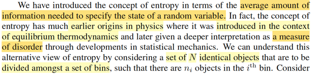
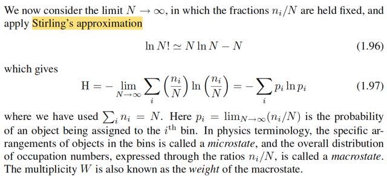

# 1.6 Information Theory

📊 **Progress:** `8` Notes | `10` Screenshots

---

<kbd></kbd>

> [!NOTE]
> Phần cuối của chap 1, gs sẽ nói về một số key concept của Information
> Theory đóng vai trò hữu ích cho bài toán machine learning bên cạnh hai trụ
> cột lí thuyết xác suất và quyết định.
>
> Sau này, mình sẽ đọc kĩ hơn trong cuốn của Mac Kay

 

<kbd></kbd>

<kbd></kbd>

> [!NOTE]
> Rồi, đầu tiên là xét một biến rời rạc (discrete) X (như đã nói, trong notebook
> này mình sẽ theo quy chuẩn kí hiệu chuẩn thống kê, viết hoa cho tên biến, còn
> gs Bishop viết thường khiến mình dễ lú lẫn).
>
> Thế thì, lí thuyết thông tin bắt đầu với việc: ta muốn đặt ra một đại lượng để đo
> mức độ thông tin nhiều hay ít ẩn chứa trong một event. Sao cho nếu một event
> mà gây ngạc nhiên càng lớn thì thông tin nó chứa càng lớn và ngược lại.
>
> Và độ ngạc nhiên của một event sẽ dễ thấy hợp lí khi ta gắn nó với xác suất
> của event: event càng ít xảy ra (xác suất thấp) mà nó xảy ra, thì ta sẽ ngạc
> nhiên nhiều. Ngược lại, event có xác suất cao, mà xảy ra thì ta không ngạc
> nhiên mấy.
>
> Do đó, đại lượng thông tin, của event gắn với X, sẽ dựa trên xác suất của X
> (pmf)
>
> Ngoài ra, trực giác cũng cho ta thấy: Nếu hai event không liên quan đến nhau
> mà cùng xảy ra, thì sẽ hợp logic nếu cho rằng lượng thông tin có được là tổng
> lượng thông tin của cả hai event: h(x,y) = h(x) + h(y)
>
> Trong khi đó, lí thuyết xác suất cho ta biết, nếu hai biến X, Y độc lập thì joint
> probability của hai event gắn với chúng, sẽ là tích của từng xác suất đơn lẻ:
> f(x,y) = f(x) f(y). Như vậy, ta sẽ suy ra hàm thông tin của x phải là logarit của
> f(x).
>
> Là sao? là vì ta có f(x,y) = f(x)f(y). Mà h(x,y) = h(x) + h(y). Nên h(x,y)
>
> h(.) phải là gì đó của log(.) vì chỉ như vậy thì ta mới dựa trên tính chất  log(xy)
> = log(x) + log(y) để có h(x,y) = h(x) + h(y)
>
> Và người ta sẽ dùng log base 2. Mà theo gs, chỉ là một lựa chọn tùy (arbitrary)
> tiện (tức là ko có lí do gì đặc biệt cả, chọn base nào cũng được). Và thêm dấu
> \-, để có hàm không âm phản ánh sự hợp lí là thông tin thì thì ko âm.
>
> Từ đó ta có công thức h(x) = -log(f(x)) (base 2). Có đơn vị là bits.
>
> Như vậy, xác suất của một event (một possible value x của X, tức f(x), hay ở
> đây là P(X=x)) càng nhỏ, thì h(x) càng lớn

 

<kbd></kbd>

> [!NOTE]
> Rồi, giả sử một sender (người gửi) muốn truyền giá trị của random variable
> X này cho người nhận (receiver) thì lượng thông tin trung bình mà họ truyền
> đi sẽ được tính bằng cách lấy kì vọng của h(x), với phân phối f(x). Và cái
> này được gọi là ENTROPY.
>
> Cùng phân tích để hiểu cái công thức này:
>
> Như vừa biết h(x), là hàm số define bởi h(x) = -log(f(x)) với f(x) là pmf của X.
>
> Như vậy, theo lí thuyết xác suất, lớp stat110, gs Joe hay nhấn mạnh, bất cứ
> khi nào ta áp một hàm số lên random variable X,  thì ta có một random
> variable mới. Và từ đó có quyền nói về kì vọng của nó. Ví dụ Y = g(X), thì Y
> là random variable. Và kì vọng, EX, có bản chất chỉ là weighted average các
> possible value của X, với weight là xác suất tương ứng: EX  = Σ{mọi
> possible value x của X} x*P(X=x) Thế thì khi muốn tính EY, đáng lí ta cũng
> phải đi kiếm pmf của Y, rồi tính tương tự. Nhưng LOTUS cho phép ta cứ
> dùng pmf của X mà tính EY:
>
> EY = Eg(X) = Σ{mọi possible value x của X} g(x)P(X=x),
>
> hay viết pmf của X là f(x), thì ta có Σ{mọi possible value x của X} g(x)f(x)
>
> QUay lại đây, chính là ta đang có h(X), là random variable có được bằng
> cách áp hàm h(x) = - log(f(x)) lên X. Nên theo LOTUS, ta tính kì vọng của
> nó:
>
> E[h(X)] = Σ{mọi possible value x của X} h(x)f(x)
>
> = Σ{mọi possible value x của X} [-log(f(x))] f(x)
>
> = - Σ{mọi possible value x của X} log(f(x) f(x). Đây chính là công thức 1.93
>
> Và người ta đặt cái này là hàm Entropy
>
> Như vậy, có thể hiểu, Entropy là một **fixed number**, k**hông phải biến
> ngẫu nhiên**, vì ta **đã lấy trung bình của biến ngẫu nhiên** h(X) -
> information quantity của X rồi.
>
> Và vì hàm x log(x) → 0 khi x → 0 nên khi f(x) = 0 thì ta cho entropy = 0

 

<kbd></kbd>

> [!NOTE]
> Thế thì để truyền giá trị của X cho receiver thì ta cần dùng một message
> có chiều dài 3 bits (vì cần 3 bits mới có thể mã hóa 8 giá trị khác nhau của
> X).
>
> Muốn cho receiver biết X = 1 hay 2, hay...8. Ta phải gửi chuỗi nhị phân
> 000 hoặc 001, hoặc 010,... Với 1 bits, ta chỉ có thể gửi 2 giá trị, với 2 bits
> ta có thể gửi 4 giá trị, và với 3 bits mới có thể gửi 8 giá trị khác nhau
>
> Thế thì, ý chính là, nếu mà ta chọn cách mã hóa trong đó coi mỗi trong 8
> giá trị khả dĩ của X đều có xác suất như nhau. thì entropy tính theo công
> thức trên sẽ ra = 3, phản ánh đúng câu chuyện trên: Là về trung bình, ta
> cần 3 bits để chuyển đi giá trị của X.
>
> Nhưng giả sử X lại có xác suất pmf khác nhau ở các possible values. Thì
> entropy tính ra chỉ có 2 bits như trong ví dụ.
>
> Điều này gợi ý rằng, bằng cách thiết kế kiểu mã hoá khác, sao cho các
> possible value mà hay gặp  hơn bằng các chuỗi bits ngắn hơn và dành
> chuỗi bit dài hơn để mã hóa  những giá trị khả dĩ ít gặp khi đó số bits trung
> bình để truyền đạt đi giá trị của X sẽ chỉ là 2.
>
> Ví dụ trong 8 possible values của X, tương ứng với 8 kí tự a,b..g,h. Với
> xác suất từ cao đến thấp là 1/2, 1/4,....1/64.
>
> Thì bằng cách dùng chuỗi 0 cho a, 10 cho b, 110 cho c, ...,111111 cho h.
> Thì khi đó, số bits trung bình chỉ là 2:
>
> 1/2*(1 bits của "0") + 1/4*(2 bits của "10") + 1/8*(3 bits của "110") +...
>
> đúng bằng 2 bits = entropy của X với phân phối không đều nói trên
>
> Gs lưu ý ta rằng ko thể dùng ít bits hơn cho b, ví dụ a là 0, b ko thể là 1
> mà phải là 10, rồi c phải là 110 vì mục đích là như vậy mới đảm bảo tính
> độc nhất của 1 chuỗi thông tin, chứ nếu ko một chuỗi sau khi nhận có thể
> được decode thành nhiều khả năng thì ko được.

 

<kbd></kbd>

> [!NOTE]
> Và theo lí thuyết thông tin, thì entropy là số bit ít nhất cần thiết để transmit
> giá trị của một biến ngẫu nhiên.
>
> Nhưng phần sau trở đi, ta sẽ define entropy theo log base e (log tự nhiên)
> khi đó đơn vị là nats. thay vì bits.

 

<kbd></kbd>

<kbd></kbd>

> [!NOTE]
> Thế thì, nãy giờ ta đang định nghĩa, hay hiểu khái niệm entropy theo góc 
> nhìn là "trung bình của số lượng thông tin chứa trong một biến ngẫu nhiên"
> (nhớ công thức không: Entropy = E[h(X)] = E[-log(f(X))] = -Σi log(f(xi)) f(xi))
> để rồi cho ta biết trung bình cần bao nhiêu bits thì mới transmit được đủ
> giá trị của X.
>
> Còn ở đây, gs giới thiệu một định nghĩa khác của entropy: Thước đo của
> sự hỗn lọan (disorder).
>
> Ông cho ví dụ, ta có N cái object giống nhau (ví dụ N trái banh), và muốn
> bỏ vào một số cái lọ, SAO CHO n_i là số banh của lọ thứ i'th.
>
> (Chú ý, đây là ràng buộc, tức là phải xắp sếp sao cho lọ 1 có n1 trái,
> lọ 2 có n2 trái với n1, n2 ... là số đã biết)
>
> Ta sẽ lập luận như vầy:
>
> Như hồi học phương pháp đếm trong stat110.
>
> với N trái banh, ta có N~ hoán vị.
>
> Vỗi mỗi một hoán vị, cứ bỏ lần lượt n1 trái vào lọ 1, n2 trái tiếp theo vào lọ
> 2, cho đến hết (tất nhiên đề bài đã cho vậy thì Σi ni phải bằng N)
>
> Vấn đề là, ta sẽ ko care thứ tự các banh trong mỗi lọ.
>
> Như vậy, với N! hoán vị, thì đã có n1! over count cho lọ 1, tức là, ví dụ có 3
> banh đi a,b,c, và hai lọ, lọ một hai banh lọ hai một banh. 
>
> Thì 3 banh → 3! hoán vị: abc, acb, bca, bac, cba, cab
>
> Như vậy các banh trong lọ 1 là: ab, ac, bc, ba, cb, ca là 6, và nó đã overcount
> 2! lần, vì ta ko care thứ tự, nên chỉ cần biết :{a,b} {b,c} {c,a} thôi.
>
> Do đó, để adjust, ta chia đi cho 2!. 
>
> Tương tự, chia 1! để adjust số overcount của lọ 2.
>
> Nên công thức tổng quát là: [N! / n1!) / n2! /...] = N! / (Πi ni!)
>
> Cái này gọi là MULTIPLICITY
>
> Và định nghĩa của entropy là : (1/N) ln N! / (Πi ni!) (ln: log base e)
>
> = (1/N) [ ln N! - ln (Πi ni!) ]
>
> = (1/N) ln N! - (1/N) ln (Πi ni!) 
>
> = (1/N) ln N! - (1/N) Σi ln (ni!)

 

<kbd></kbd>

> [!NOTE]
> (1/N) ln N! - (1/N) Σi ln (ni!)
>
> Xét cái term này tại limit N → inf
>
> Tiếp, dùng một  cái xấp xỉ: Stirling's approximation.
>
> ln N! ≈ N ln (N) - N
>
> ta có:
>
> lim N→inf {(1/N) ln N! - (1/N) Σi ln (ni!)}
>
> = lim N→inf {(1/N) [N ln (N) - N] - (1/N) Σi [ni ln(ni) - ni] }
>
> = lim N→inf { [ln (N) - 1] - (1/N) [Σi ni ln(ni) - Σi ni] }
>
> = lim N→inf { ln (N) - 1 - [(1/N)Σi ni ln(ni) - 1] }
>
> = lim N→inf { ln (N) - 1 - (1/N)Σi ni ln(ni) + 1 }
>
> = lim N→inf { ln (N) - (1/N)Σi ni ln(ni) }
>
> = - lim N→inf { (1/N)Σi ni ln(ni) - ln (N) }
>
> = - lim N→inf { (1/N)Σi ni ln(ni) - 1 * ln (N) }
>
> = - lim N→inf { Σi (ni/N) ln(ni) - (Σi ni / N) ln (N) }
>
> = - lim N→inf { Σi (ni/N) ln(ni) - Σi (ni/N) ln (N) }
>
> = - lim N→inf { Σi (ni/N) [ ln(ni) - ln (N) ] }
>
> = - lim N→inf { Σi (ni/N) ln(ni/N) }
>
> Đây là công thức 1.97
>
> \-----
>
> Đặt pi = lim N→inf (ni/N), vì sao nó lại là xác suất một object xuất hiện
> trong lọ i'th?
>
> vì N banh, giống như N possible outcome trong Ω, tức size Ω = N,
>
> ni banh trong lọ i'th là số possible outcome trong event/subset Ni: object
> nằm trong lọ i'th,
>
> theo góc nhìn frequentist, xác suất của subset/event Ni:
>
> lim N → inf [size of Ni] / [size of Ω] = lim N → inf {ni / N}

 

<kbd></kbd>

> [!NOTE]
> Thuật ngữ vật ló dùng microstate để chỉ một sự sắp xếp cụ thể các object vào 
> các lọ.
>
> Còn macrostate để chỉ phân phối tổng thể, thể hiện qua tỉ lệ ni/N
>
> Là sao. Tức là, ví dụ, [ab][c] hay [ba][c], tức là những cách sắp cụ thể 2 banh
> vào lọ 1 và 1 banh vào lọ 2 như nãy nói, là những microstate.
>
> Còn macrostate sẽ quy định: lọ 1 có 2 banh, lọ 2 có 1 banh. Hay xác suất banh
> xuất hiện trong lọ 1 là 2/3, xác suất banh xuất hiện trong lọ 2 là 1/3.
>
> Thì khi đó, multiplicity W gọi là trọng số của macro state. Ví dụ, trong ví dụ
> này W = 3!/(2!1!) = 3. Tức là với macrostate  nói trên, thì ta sẽ có 3 cách sắp
> 3 banh vào 2 lọ ko care thứ tự trong mỗi lọ.

 

