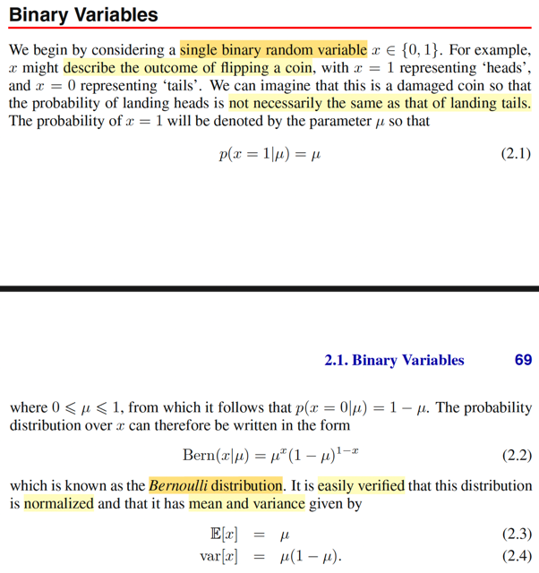
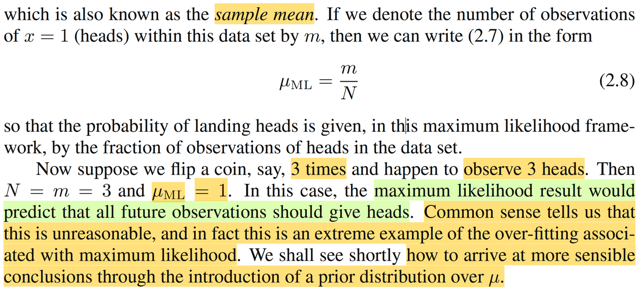
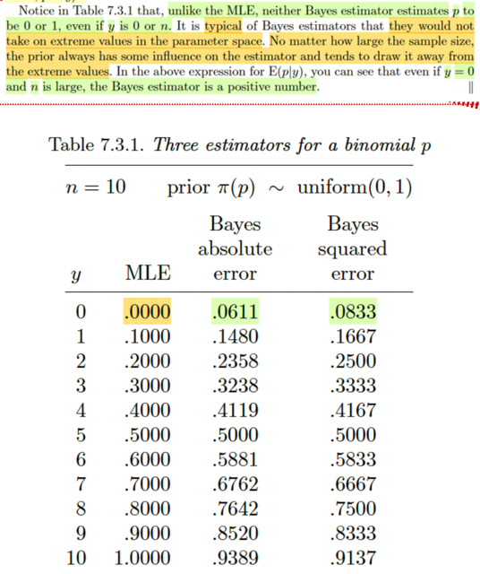
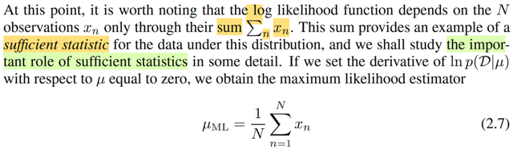
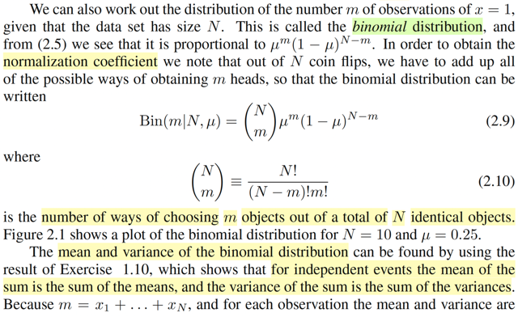

# 2.1

📊 **Progress:** `4` Notes | `7` Screenshots

---

<kbd></kbd>

> [!NOTE]
> Rồi, đầu tiên gặp lại (cái mà trong Stat110 hay Casella gọi là Bern(p): Phân
> phối Bernoulli.
>
> Dĩ nhiên gs Bishop ở đây ko nói gì mới cả, nó là một discrete distribution với
> hai possible value 0, 1.
>
> pmf của X ~ Bern(μ) thì như đã biết f(1) = P(X=1) = μ và f(0) = p(X=0) = 1 - μ.
>
> và thể hiện theo cách kết hợp f(x) = μ^x(1-μ)^(1-x),
>
> Ông nói chứng minh nó normalized tức là chứng minh tính valid của f(x) bằng
> cách chứng minh Σ{x=0,1} f(x) = 1, cái này thì quá rõ rồi: 
>
> μ^1(1-μ)^0 + μ^0(1-μ)^1 = μ + 1 - μ = 1
>
> Làm lại vụ tính EX, VarX đã làm trong Stat110, Casella:
>
> EX, theo định nghĩa, là weighted sum các possible value của X, với weighted
> là xác suất  tương ứng: EX = 1 * f(1) + 0*f(0) = 1 * μ = μ.
>
> VarX, theo công thức thứ nhất: 
>
> = E[(X - EX)^2], = E[(X - μ)^2],
>
>  áp dụng LOTUS = Σ{x=1,0} (x-μ)^2f(x) 
>
> = (1-μ)^2 μ + (0-μ)^2 (1-μ) 
>
> = (1-μ)^2 μ + μ^2(1-μ)
>
> = (1-2μ+μ^2)μ + μ^2 - μ^3
>
> = μ - 2μ^2 + μ^3 + μ^2 - μ^3 = μ - μ^2 = μ(1-μ)

 

<kbd></kbd>

> [!NOTE]
> Rồi, đoạn này đại ý là nếu ta có dataset {x1,....xN} là các giá trị quan sát được của x và
> công thức likelihood function
>
> Ôn lại chút, trong Casella, định nghiã của một random sample size n, là khi ta muốn quan
> sát giá trị của một đại lượng mang tính chất uncertainty n lần, mỗi lần đại diện bởi một
> random variable: X1,X2,....Xn, và được tiến hành sao cho các rvs này mutually
> independent và chúng có cùng distribution  population distribution kí hiệu là f(x|θ).
>
> Khi đó, nếu xét joint pdf/pmf của X1,...Xn thì nhờ tính chất independent, ta có thể tách
> thành tích các marginal pdf: f(**x**|θ) = Πi=1:n f(xi|θ)
>
> Và ta trong các bài trước nhiều lần nhắc đến likelihood function, được định nghĩa là hàm
> của θ: L(θ|**x**) = f(**x**|θ) mang ý nghĩa độ hợp lí của θ khi giá trị quan sát được của **X**
> là **x**.
>
> và đi giải bài toán maximize_θ ∈ Θ L(θ|**x**) ta sẽ tìm được Maximum Likelihood estimator
> của θ: θ^_ml(**X**)
>
> Quay lại đây, cái mà ta có cũng chính là một observed value của một random sample **X** = (X1,...XN) iid: chúng mutually independent và indicator distributed Xi ~ Bern(μ).
>
> Nên likelihood function L(μ|**x**), như định nghĩa = f(**x**|μ), nhờ tính iid,...
>
> = Πn=1:N f(xi|μ) = Πn=1:N μ^xn(1-μ)^(1-xn). là công thức 2.5 trong sách.
>
> \------
>
> Rồi, như vừa nói xong, gs Bishop cũng nhắc lại, trong trường phái Frequetist ta thường đi
> tìm μ khiến maximize likelihood function.
>
> Và bài toán tối ưu này như đã biết, ta có thể chuyển thành bài toán tương đương dùng
> hàm ln: maximize ln likelihood:
>
> ln {Πn=1:N μ^xn(1-μ)^(1-xn)}
>
> = Σn=1:N ln {μ^xn(1-μ)^(1-xn)}
>
> = Σn=1:N ln {μ^xn} + ln {(1-μ)^(1-xn)}
>
> = Σn=1:N ln {μ^xn} + Σn=1:N ln {(1-μ)^(1-xn)}
>
> = Σn=1:N [xn ln μ] + Σn=1:N [(1-xn) ln (1-μ)]
>
> **Vì sao phải nhắc đến Frequentist** (hay trong Casella gọi là Classical, trường phái thống
> kê cổ điển) là vì trong cách tiếp cận này, ta coi θ (hay ở đây là μ) là fixed và unknown, chứ
> không phải là biến ngẫu nhiên). Trong Casella, ngay sau khi học về ML estimator ta học về
> Bayes estimator, thì chính là làm theo trường phái Bayesian, nơi ta coi θ là random
> variables. Từ đó ta chọn prior distribution cho θ, kí hiệu là π(θ). Và dùng Bayes rule để xây
> dựng distribution của θ conditioned on **X** = **x**: π(θ|**x**)  = f(**x**|θ)π(θ)/f(**x**). Khi
> đó, ta sẽ làm theo optimality theory để xây dựng Bayes  estimator:
>
> Chọn **loss function** L(W(**X**), θ), ví dụ squared error loss hay absolute error loss,
>
> từ đó có **risk function** là lấy trung bình của loss trên mọi **x**:
>
> R(W(**X**), θ) = E_θ[L(W(**X**), θ] = ∫L(W(**x**),θ)f(**x**|θ) d**x** là hàm số theo θ.
>
> Và vì θ  là random variable, nên risk function vẫn là random variable.
>
> Người ta sẽ lấy **trung bình trên prior π(θ)**:
>
> E_θ~π(θ) [R(W(**X**),θ)] để được một fixed value không còn phụ thuộc θ, gọi là Bayes
> risk.
>
> = ∫[∫L(W(**x**),θ)f(**x**|θ)d**x**]π(θ)dθ
>
> = ∫∫L(W(**x**),θ)[π(θ|**x**)f(**x**)/π(θ)]π(θ)dθd**x** = ∫∫L(W(**x**),θ)π(θ|**x**)f(**x**)dθd**x** = ∫ {∫L(W(**x**),θ)π(θ|**x**)dθ} f(**x**)d**x**
>
> Thì cái này ∫L(W(**x**),θ)π(θ|**x**)dθ gọi là **posterior expected loss** 
>
> Từ đó, đi minimize_W(**X**) E_θ~π(θ|x) [R(W(**X**), θ)] cũng là minimize posterior
> expected loss  ta sẽ có "Bayes estimator that minimize Bayes risk" cho θ.

 

<kbd></kbd>

<kbd></kbd>

<kbd></kbd>

> [!NOTE]
> Tiếp theo gs Bishop nói về việc hàm ln likelihood phụ thuộc vào x1,...xN thông
> qua Σn xn Cái này dễ thấy, vì ln likelihood = Σn=1:N [xn ln μ] + Σn=1:N [(1-xn) ln
> (1-μ)]
>
> = ln μ [Σn=1:N xn] + ln (1-μ) Σn=1:N [1-xn]
>
> = ln μ [Σn=1:N xn] + ln (1-μ) [N - Σn=1:N xn]
>
> Và ông nói đây là một sufficient statistic.
>
> Dừng lại chút, chap 6, phần 1 của Casella mình đã được học về Sufficient
> principle, cũng như sufficient statistic, nói ngắn gọn, đây là loại statistic  chứa
> đủ thông tin về θ mà sample **X** mang lại rồi. Để rồi, giả sử ta ko biết  giá trị
> của **X**, nhưng thay vào đó, chỉ cần biết giá trị của t của T(**X**), với T(**X**)
> là một sufficient statistic, thì từ t ta vẫn có thể inference ra giá trị của θ một cách
> đầy đủ giống như ta có **x** vậy.
>
> Hiểu theo cách trực giác là như vậy, nhưng định nghĩa chính thức là nếu
> T(**X**) có tính chất đó là khiến f(**x**|T(**X**) = T(**x**)) không còn là hàm phụ
> thuộc θ, thì nó chính là sufficient statistic. Trong sách Casella, với định nghĩa
> này, ta mới đi chứng minh cho thấy rằng, giả sử có hai ông A, và B, ông A biết
> **X** = **x**, và T(**X**) = T(**x**), còn ông B chỉ biết T(**X**) = T(**x**). Sau đó
> ông A dựa vào T(**X**) = T(**x**), generate các giá trị của **Y** sao cho P(**Y** =
> **y** | T(**X**) = T(**x**)) = P(**X** = **y** | T(**X**) = T(**x**)) thì ta chứng minh
> được cái random variable **Y** này qủa thật chính là ~ marginal pmf của **X**:
> f(**x**|θ) (hay P(**X**=**y**) = P(**Y**=**y**) ∀**y**) Điều này giúp kết luận là chỉ
> cần dựa trên T(**x**) cũng đủ để xây dựng hiểu biết của ta về θ
>
> Sau đó ta được học một theorem quan trọng giúp chứng minh sufficient
> statistic: **Factorization**, nói rằng, miễn f(**x**|θ) có thể được factor thành
> g(T(**x**)|θ)h(**x**) tức là tích của hàm h(**x**) chỉ phụ thuộc **x** và hàm g phụ
> thuộc  cả **x** lẫn θ nhưng chỉ phụ thuộc **x** thông qua T(**x**), thì khi đó T
> **chính là  sufficient statistic**.
>
> Nhờ theorem này, ta có cách tìm sufficient statistic: tìm các factor f(**x**|θ)
> thành dạng trên thì cái cụm nào chứa **x** trong g(T(**x**)|θ) chính là sufficient
> statistic function.
>
> Vậy ở đây mình có thể chứng minh nhanh là với X1,...Xn ~ Bern(μ) thì  Σi Xi là
> sufficient:
>
> f(**x**|μ), như vừa làm = Πn=1:N μ^xn(1-μ)^(1-xn)
>
> xét Pμ(**X**=**x**|T(**X**)=T(**x**)), trước khi chứng minh nó ko phụ thuộc θ, ta
> biến đổi chút xíu:
>
> Pμ(**X**=**x**|T(**X**)=T(**x**)) = Pμ(**X**=**x**, T(**X**)=T(**x**)) /
> P(T(**X**)=T(**x**))
>
> Vì **X**=**x** ⇨ T(**X**)=T(**x**) ⇨ (**X**=**x**) ⊂ T(**X**)=T(**x**) ⇨
> (**X**=**x**, T(**X**)=T(**x**) = (**X**=**x**)
>
> (do A ⊂ B ⇨ A ∩ B = A)
>
> ⇨ Pμ(**X**=**x**, T(**X**)=T(**x**)) / P(T(**X**)=T(**x**))
>
> = Pμ(**X**=**x**) / P(T(**X**)=T(**x**))
>
> Thay vào:
>
> Từ số Pμ(**X**=**x**) = f(**x**|μ) = Πn=1:N μ^xn(1-μ)^(1-xn)
>
> Còn mẫu số, với T(**X**) = ΣXi với Xi iid Bern(μ) thì ΣXi chính là binomial(n, μ)
>
> (còn nhớ trong Stat110, hay Casella, story của Binomial(n,p) là tổng các
> success event của chuỗi n Bern(p) trials. có pmf là P(X=k) = (n choose
> k)p^k(1-p)^(n-k)
>
> Nên P(T(**X**)=T(**x**)) = (n choose T(**x**)) μ^T(**x**) (1-μ)^[n-T(**x**)] ,với
> T(**x**) = Σnxn.
>
> Thay kết qủa này vào mẫu số ta có:
>
> Πn=1:N μ^xn(1-μ)^(1-xn)  / (n choose Σn xn) μ^(Σn xn) (1-μ)^(n-Σn xn)
>
> = μ^(Σn xn) (1-μ)^(Σn (1-xn))  / (n choose Σn xn) μ^(Σn xn) (1-μ)^(n-Σn xn)
>
> = μ^(Σn xn) (1-μ)^(n-Σn xn)  / (n choose Σn xn) μ^(Σn xn) (1-μ)^(n-Σn xn)
>
> =  1  / (n choose Σn xn)
>
> kết quả ko còn phụ thuộc μ nên theo định nghĩa Σn xn chính là sufficient
> statistic
>
> Có thể làm còn nhanh hơn bằng factorization theorem:
>
> f(**x**|μ) =  Πn=1:N μ^xn(1-μ)^(1-xn) =
>
> = μ^(Σn xn) (1-μ)^[Σn(1-xn)]
>
> = μ^(Σn xn) (1-μ)^[N-Σn xn)]
>
> bằng cách chọn h(x) = 1, g(T(x)|μ) = μ^(Σn xn) (1-μ)^[N-Σn xn)] ta suy ra ngay
> T(x) = Σx xn chính là sufficient statistic
>
> \-------
>
> Còn quay lại bài toán tìm μ khiến maximum likelihood, thì cũng đơn giản, đây là
> bài toán tối ưu ko ràng buộc, dùng điều kiện cần tối ưu bậc nhất ta cho đạo
> hàm bằng 0 tìm critical point:
>
> d/dμ [Σn=1:N [xn ln μ] + Σn=1:N [(1-xn) ln (1-μ)]] = 0
>
> ⇔ Σn=1:N d/dμ [xn ln μ] + Σn=1:N d/dμ [(1-xn) ln (1-μ)] = 0
>
> ⇔ Σn=1:N [xn/μ] + Σn=1:N (1-xn) d/dμ [ln(1-μ)] = 0
>
> ⇔ Σn xn / μ - (N-Σn xn) / (1-μ) = 0
>
> ⇔ Σn xn / μ = (N-Σn xn) / (1-μ)
>
> ⇔ (1-μ) Σn xn = μ (N-Σn xn)
>
> ⇔ Σn xn - μ Σn xn  = μ (N-Σn xn)
>
> ⇔ Σn xn = μ (N-Σn xn) + μ Σn xn
>
> ⇔ Σn xn = μ N
>
> ⇔ (Σn xn) / N = μ,
>
> Tất nhiên để kết luận đây là maximizer của objective thì còn cần check đạo
> hàm bậc hai (lấy đạo hàm bậc hai tại critical point và coi thử nó có âm ko)
>
> nhưng cũng có thể dùng nhận định hàm này là tổng các hàm ln vốn là concave
> function nên cũng là concave function, từ đó khiến cho ta có thể kết luận ngay
> maximizer.
>
> Như vậy μ^_ML = (Σn xn) / N, dĩ nhiên ta biết đây chính là sample mean.
>
> Như vậy, giả sử ta trong bài toán cụ thể là tung đồng xu N lần, ra được m lần
> ngửa thì m/N chính là cách ta estimate xác suất ra ngửa của đồng xu đó (μ)
> theo cách tối đa hóa độ hợp lí dựa trên kết quả quan sát được. Ví dụ tung
> N=100, m = 10 thì dựa trên kết quả thử nghiệm dự đoán population param hợp
> lí nhất là μ = 0.1, tức xác suất xu ra ngửa là 10%.
>
> Hoặc nếu N = 3, m = 3, thì μ^_ML = 1, đồng nghĩa là theo đó, mô hình (theo
> cách estimate μ bằng maximum likelihood approach) sẽ dự đoán là nếu tiếp tục
> tung xu thì sẽ luôn luôn ra ngửa. Điều này rõ ràng là ko đúng. Theo gs Bishop,
> đây chính là một ví dụ của overfit. Và cách tiếp cận Bayesian với prior
> distribution của μ sẽ giúp khắc phục chuyện này.
>
> Nói thêm chút xíu, trong sách Casella đã nói về vụ này rồi, khi trong phần cuối
> của Bayes estimator ông có in một cái bảng (7.3.1) so sánh hai phương pháp
> MLE và Bayes. Cho thấy Bayes ít cho các extreme (thái quá) estimate hơn.
> Nguyên nhân cũng là nhờ prior distribution.

 

<kbd></kbd>

<kbd></kbd>

> [!NOTE]
> Rồi, thế thì binomial là gì thì stat110, Casella đã quá rành rồi, cái quan
> trọng nhất là story của nó: X ~ binomial(n, p) thì nó chính là  số trial
> success trong n iid Bern(p) trial. có pmf: P(X=k) = (n choose k) p^k
> (1-p)^(n-k).
>
> \-------
>
> Thử giải thích lại công thức của (n choose k), đây là cái đã học từ những
> bài đầu của Stat110:
>
> Chứng minh (n choose k) có công thức như vậy (Stat110 đã học, ôn lại)
>
> Bài toán là đếm số cách chọn m object từ N object ko care thứ tự:
>
> n object có n! hoán vị.
>
> Với mỗi hoán vị ta lấy k object đầu tiên thì ta sẽ có n! cách chọn k object
>
> Tuy nhiên vì không care thứ tự các object nên ta đã đếm thừa với mỗi cách
> chọn n! lần, nên để adjust ta sẽ chia cho k!
>
> Ngoài ra, với mỗi một cách chọn này ta cũng đã đếm thừ (n-k)! lần số cách
> chọn n-k quả banh ở cuối → nên cũng phải adjust bằng cách chia (n-k)!.
>
> Nên  (n choose k) = n! / k!(n-k)!
>
> \------
>
> Derive công thức EX cực nhanh: dùng story của nó, thì bên cạnh story
> trên, binomial còn có story khác: nó là tổng có n iid indicator random
> variable I_{Aj} với Aj là trial thứ j, và I_{Aj} j=1,2....n có hai possible value là
> 1 hoặc 0 nếu  kết quả của trial là success hoặc failure, dễ thấy I_{Aj} chính
> là Bern(μ)
>
> Khi đó EX = E[Σi I_{Aj}]
>
> dựa trên tính linearity của kì vọng
>
> ...= Σi E[I_{Aj}]
>
> = Σi [μ] = nμ (hay trong sách là Nμ)
>
> \------
>
> VarX: Trong Stat110 gs Joe đã trình bày 3 cách để tìm Var của binomial
> trong đó cách dễ nhất chính là dựa trên tính chất của Variance: Nếu  X1,...
> Xn độc lập thì Var(Σi Xi) = Σi VarXi
>
> ở đây, dựa trên story binomial random variable X là tổng các iid Bern I_Aj
>
> ⇨ Var X = Σi Var(I_Aj)
>
> Mà với Bern(μ) mình đã chứng minh Var = μ(1-μ) rồi
>
> ⇨ Var X = Σi μ(1-μ) = nμ(1-μ) (hay trong sách là Nμ(1-μ))
>
> \-------
>
> Nói thêm chút xíu hai công thức gs Bishop trong sách thật ra chỉ là ông
> dùng định nghĩa thôi, nhưng cách derive nhanh là như gs Joe đã dạy ở
> trên),
>
> theo định nghĩa EX = Σ{mọi possible value x của X} xP(X=x)
>
> ở đây ông Bishop dùng chữ m, để chỉ random variable binomial, (một lần
> nữa phải complain rằng việc ông dùng chữ thường để chỉ tên biến đi
> ngược lại quy ước của toán khiến ta rất dễ lú), mình cũng dùng lại chữ m
> nhưng viết hoa cho nó theo chuẩn:
>
> E[M] = Σ{mọi possible value m của M} mP(M = m)
>
> Và pmf của M ~ binomial(N,μ) thì ông kí hiệu nó là Bin(m|N, μ) (giống  như
> pdf của Normal(μ, σ^2) thì thay vì như sách toán người ta ghi f(x|μ, σ^2)
> thì ổng chơi luôn N(x|μ, σ^2), thật hay.
>
> = Σ{m=0,1,...N} m Bin(m|N,μ)
>
> Var[M], thì theo định nghĩa gốc của variance thôi: E[(M - EM)^2], và dùng
> LOTUS, ta có Σ{mọi possible value m của M} (m -EM)^2 P(M=m)
>
> = Σ{m=0,1,...N} (m - EM)^2 Bin(m|N,μ)

 

