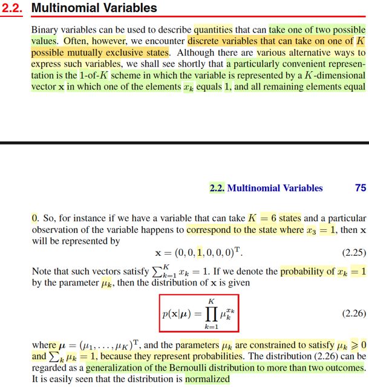
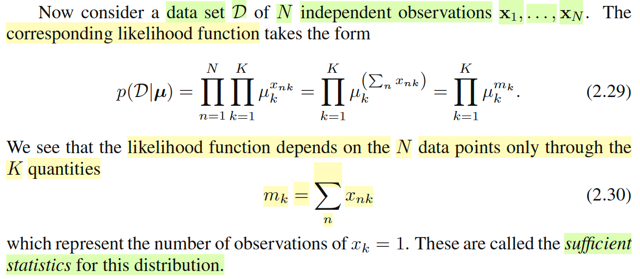

# 2.2 Multinomial Variables

📊 **Progress:** `3` Notes | `3` Screenshots

---

<kbd></kbd>

> [!NOTE]
> Đại ý là mở đầu gs cho biết biến nhị phân (binary variables) (chính là
> Bernoulli variables như đã biết) có thể được dùng để đại diện cho những
> đại lượng có hai possible values.
>
> Tuy nhiên có nhiều đại lượng khác sẽ có nhiều hơn hai các giá trị khả dĩ
> rời rạc. Thì phần này ta sẽ học một cách phổ biến và tiện lợi để represent
> loại này, tuy không phải là cách duy nhất.
>
> Giả sử ta có K possible values và μ1,...μ6 là xác suất tương ứng của K=6
> possible values này. Ví dụ U là random variable có 6 possible value u1,...
> u6 ứng với xác suất μ1,...μ6 thì dĩ nhiên ta có pmf fU(u1) = P(U=u1) = μ1.
>
> Tuy nhiên cách mà người ta sẽ làm đó là dùng một K-dimensional vector,
> trong đó chỉ có một vị trí là = 1, còn lại là bằng 0, để biểu diễn một
> possible value. Có nghĩa là K possible values sẽ được biểu diễn bởi K
> vector, mà vị trí số một sẽ tương ứng.
>
> Ví dụ trong K=6 possible value đó, thì sẽ có một cái u3  được represent
> bởi vector [0,0,1,0,0,0].
>
> Như vậy mình sẽ xem xét một random variable vector: **X** = (X1,...X6)
> mà trong đó X1,...X6 là các Bernoulli random variables. Và có ràng buộc
> X1 + ...+X6 = 1,  X1,X2,...X6 ∈ {0,1}
>
> U = u3 sẽ TƯƠNG ỨNG **X** = [0,0,1,0,0,0]T
>
> Thế thì ta có:
>
> P(U=u1) = μ1
>
> ⇔ P_**μ**(**X**=[1,0,0,0,0,0]T) = μ1
>
> ⇔ P_**μ**(X1=1,X2=0,...,X6=0) = μ1.
>
> Tương tự P_**μ**(X1=0,X2=1,...,X6=0) = μ2
>
> Vậy thì thể hiện khái quát là P_**μ**(**X**=**x**) = Πk=1:K μk^**x**k
>
> (cái này chỉ là khái quát của pmf của binary / Bern(μ) variable vốn có thể
> coi như K = 2: P_μ(X=x) = μ^x(1-μ)^(1-x))

 

<kbd></kbd>

> [!NOTE]
> Cái vụ normalize thì hiển nhiên là tổng các μi = 1.
>
> Còn xem thử E[**X**|**μ**] là sao ? Câu trả lời là theo định nghĩa của  kì vọng
> thôi - là weighted average các possible value của **X** với weight là pmf
> tương ứng:
>
> E[**X**|**μ**] = Σ_{xi=**x**1,..**x**K} **x**iP(**X**=**x**i) (***x**i là các one-hot vector, hay cũng dễ nhận 
> dưới góc nhìn đại số tuyến tính, đây chính là các standard basis **e**i )
>
> = Σ_{**x**i=**x**1,..**x**K} **x**i μi
>
> Và cái này chính là gì? ⇨ linear combination các vector **x**i với hệ số μi. và
> dễ hiểu kết quả là vector **μ** (vì μ1*[1,0,..0]T + μ2*([0,1,0..]T + .. = [μ1, μ2,..]T
> = **μ**)

 

<kbd></kbd>

> [!NOTE]
> Rồi, thế thì gs cho rằng ta sẽ xem xét một dataset D = {**x**1,...**x**N} (tức là
> các observation của U, hiểu theo góc nhìn Casella, thì ta có một random
> sample U1, U2..UN iid, ~ fU(u), nhưng ta represent U bởi **X** như đã nói để rồi
> observed value {u1,u2,...uN} của random sample **U1,..Un** sẽ được represent
> bởi {**x1**, **x2**,..**xN**} của random sample **X1**, **X2, ..XN** (chú ý, chỗ này dễ confuse về kí hiệu nên nói rõ tí:  **X1** là random variable
> vector [**X1**1, **X1**2,...**X1**K] mà giá trị quan sát thấy của nó là **x1**, là
> một one hot vector nào đó (số 1 nằm ở đâu đó) ví dụ (0,1,0,..0)T
>
> Và X1 là random variable vector tương ứng với U1,
>
> Tương tự X2, ...XN cũng vậy, sẽ tương ứng với U2,...
>
> Rồi. giờ ta bàn về likelihood của data D, thì có lẽ nên nhắc lại về hàm likelihood
> chút cho nhớ:
>
> Trong Casella, mình được học định nghĩa của hàm likelihood như sau. Giả sử
> ta có random sample **X** = X1,...Xn iid ~ f(x|θ), có observed value **X** = **x** Thì hàm likelihood là hàm số của θ, kí hiệu L(θ|**x**) được định nghĩa là =
> f(**x**|θ) mang ý nghĩa là độ hợp lí của θ khi quan sát thấy **X** = **x**.
>
> L(θ|**x**) = f(**x**|θ). Mà vì tính iid, nên joint pdf của X có thể tách thành tích các
> marginal pdf: f(**x**|θ) = Πi=1:N f(xi|θ).
>
> Nên lúc này L(θ|**x**) = Πi=1:N f(xi|θ)
>
> Quay lại đây, bối cảnh là ta cũng đang có D = **X1**, **X2**,...**XN** iid ~
> f(**x**|**μ**).
>
> L(**μ**|D) = f(D|**μ**) = Πi=1:N f(**xi**|**μ**)
>
> = Πi=1:N Πk=1:K μk^**xi**k
>
> =  Πk=1:K { Πi=1:N μk^**xi**k }
>
> =  Πk=1:K μk^ { Σi=1:N **xi**k }
>
> Đặt mk = Σi=1:N **xi**k : tức là tổng các phần tử thứ k của các vector **x1**, ...
> **xN**.
>
> =  Πk=1:K μk^mk
>
> \-------
>
> Tiếp, như đã ôn lại về sufficient statistic bữa trước, theo Factorization theorem
> khi pdf của **X**: f(x|θ) có thể được factor thành tích của một hàm h(**x**) chỉ
> phụ thuộc **x** và một hàm phụ thuộc **x** và tham số θ nhưng chỉ phụ thuộc x
> thông qua một hàm T(**x**) nào đó: g(T(**x**)|θ). Tức f(**x**|θ) =
> g(T(**x**)|θ)h(**x**), thì khi đó, T(**x**) chính là sufficient statistic của θ.
>
> Ở đây ta vừa thấy f(**x**|μ) = Πk=1:K μk^ { Σi=1:N **xi**k }
>
> có dạng g(T(**x**)|**μ**)h(**x**) với h(**x**) = 1, g(T(**x**)|**μ**) = Πk=1:K μk^{T(**x**)_k}
>
> với T(**x**) = Σi=1:N **xi,** T(**x**)_k là phần tử thứ k của vector T(**x**)
>
> Như vậy T(**X**) = Σi=1:N **Xi chính là sufficient statistic** ------
>
> Cũng ko khó để hiểu T(**x**)_K, tổng các phần tử thứ k của các vector **x1**,...**xN**
> thì cũng chính là tổng số các observed value ứng với U = uk.

 

