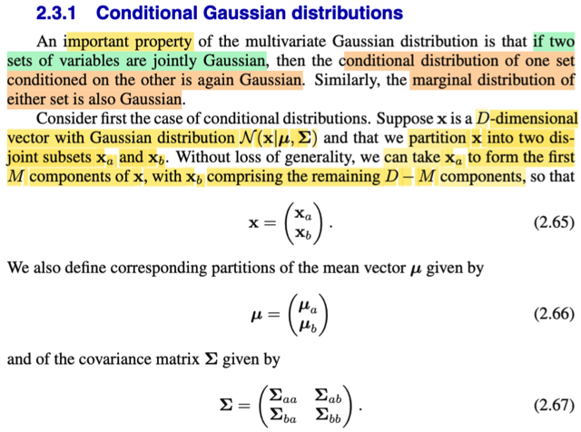
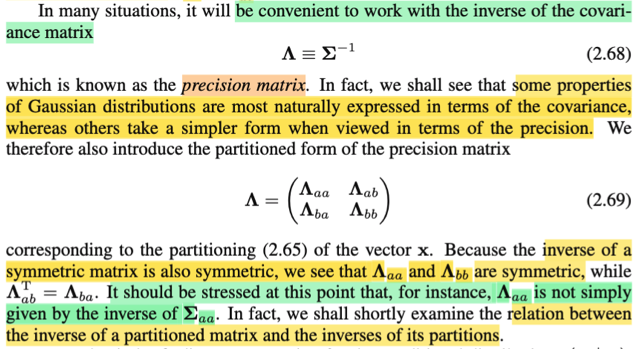
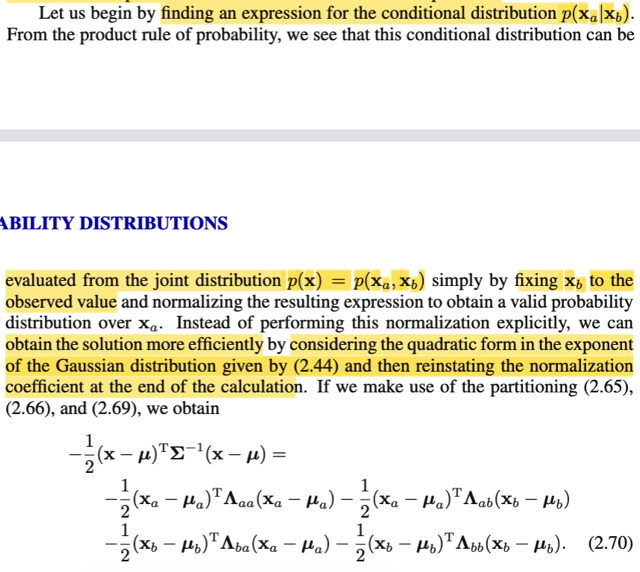
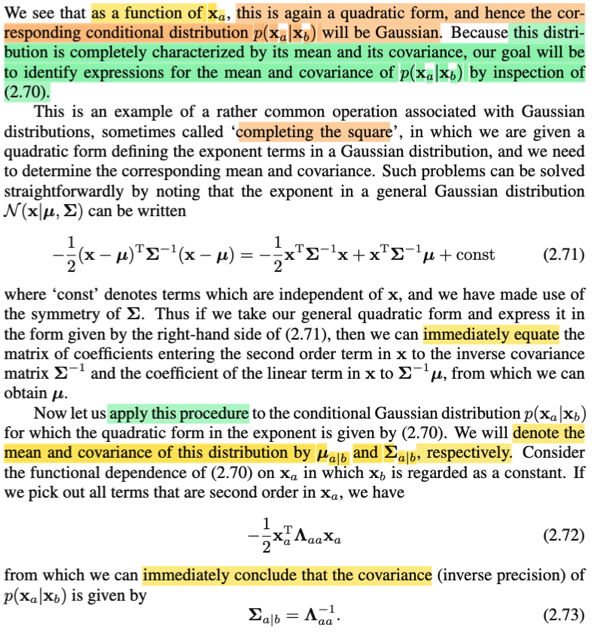
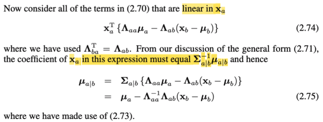
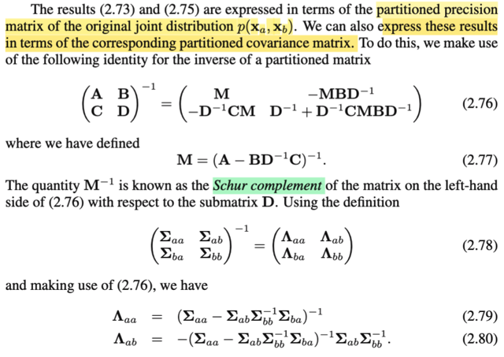
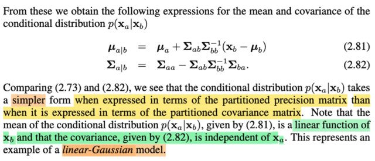

# 2.3.1 Conditional Gaussian

📊 **Progress:** `6` Notes | `7` Screenshots

---

<kbd></kbd>

> [!NOTE]
> Mở đầu phần này, gs nói đại khái là phân phối multivariate Normal có một
> tính chất quan trọng, đó là nếu ta có hai set random variables mà jointly
> Gaussian (tức là mình hiểu là joint distribution của chúng là Gaussian) thì khi
> đó, distribution của một set dựa trên set kia, cũng là Gaussian. Và thêm nữa,
> marginal distribution của mỗi set cũng là Gaussian.
>
> Lấy ví dụ ta sẽ xét random vector **X** có D-dimensions, dĩ nhiên có nghĩa là
> ta có D random variable X1,...XD. Và **X** ~ Normal(**μ**, **Σ**), tức X1,...XD
> có joint distribution là Normal(**μ**, **Σ**).
>
> Sau đó, ta mới tách random vector **X** thành **Xa** và **Xb**, với **Xa** là M
> phần tử đầu tiên của **X**, **Xb** là phần còn lại. Dĩ nhiên **Xa** là
> M-dimensinal random variable vector và **Xb** là D-M dimensional random
> variables vector.
>
> Tiếp, ta mới define vector **μ**, cũng tách thành hai phần, **μa** và **μb**.
> Cũng như covariance matrix **Σ** sẽ có dạng block matrix: [**Σaa Σab; Σba
> Σbb**]
>
> Suy ngẫm chút xíu: Vì sao **X** = [**Xa**; **Xb**] thì **μ** = [**μa; μb**] và **Σ
> =** [**Σaa Σab; Σba Σbb**]
>
> **μ** là location của distribution Normal(**μ**, **Σ**), và ta đã chứng minh nó
> chính là mean của X: E**X** = **μ**, nên khi X tách ra thành Xa và Xb, để
> **X** = [**Xa**; **Xb**] thì EX dĩ nhiên cũng tách thành E[**Xa**; **Xb**] =
> [E(**Xa**); E(**Xb**)] và người ta đặt E(**Xa**) là **μa**, E(**Xa**) là **μb**.
> Nên **μ** = [**μa; μb**]
>
> Còn **Σ**, là thứ mà hôm qua ta đã thấy gs chứng minh rằng nó là covariance
> matrix. Ở đây mình nên hiểu là, thường thì mình cứ nghe nói Normal(**μ**,
> **Σ**) và với mean và covariance matrix là **μ** và **Σ**, thì thật ra phải hiểu
> rằng, đó là thứ phải chứng minh. Tức là sự xuất hiện của **μ**, **Σ** chỉ đơn
> giản là vì nó xuất hiện trong pdf f**X**(**x**|**μ**,**Σ**) = [1/(2π)^(D/2)]
> [1/|**Σ**|^1/2] exp[-1/2(**x**-**μ**)T **Σinv**(**x**-**μ**)], còn **ta phải đi chứng
> minh mean của X là μ và covariance của** **X là Σ**.
>
> Cũng ôn lại chút, trong phần chứng minh covariance của **X** là **Σ**, mình
> được học vài ý mới mà Stat110 và Casella không nói, đó là, covariance của
> random vector **X**, thật ra được định nghĩa là second moment của vector
> **X** - E**X**, và second moment thì, đối với single random variable **X** thì
> nó là E[**X**^2], nhưng với random variable vector **X** thì nó là matrix
> E[**XX**T]. Nên theo đó, covariance của **X** chính là
> E[(**X**-E**X**)(**X**-E**X**)T].
>
> Cách hiểu này sâu hơn là chỉ hiểu đơn giản là với random variable X,Y
> Cov(X,Y) = E[(X-EX)(Y-EY)], nên covariance của **X** là matrix có phần tử ij
> là Cov(Xi, Xj).

 

<kbd></kbd>

> [!NOTE]
> Tiếp, gs nói rằng trong nhiều tình huống ta sẽ thấy làm việc với inverse của
> covariance **Σ** thì tiện hơn **Σ**, ta đặt nó là **Λ**. Dĩ nhiên **Λ** cũng đối xứng.
> Và ta gọi nó là **precision matrix**.
>
> Và với việc **X** = [**Xa**; **Xb**], **Λ** cũng tách thành [**Λaa Λab; Λba Λbb**]
>
> Một chú ý là chưa chắc **Λaa, và Λbb đã là inverse của Σaa, Σbb.**

 

<kbd></kbd>

> [!NOTE]
> Rồi, ta sẽ bắt đầu chứng minh rằng nếu ta có hai bộ random variable có
> joint distribution là multivariate Gaussian thì pdf của một random
> variable set condition set khác cũng sẽ là Gaussian, bằng cách thử
> derive pdf của f(**xa**|**xb**).
>
> Thế thì đại khái là, gs nói rằng ta có thể bắt đầu với joint pdf f(**xa**,
> **xb**), tại giá trị fixed nào đó của **xb** và sau đó normalizing để có
> conditional distribution f(**xa**|**xb**). Có thể hiểu ý này thế nào?
>
> Mình nghĩ cái này đơn giản chỉ là gs đang nói đến định nghĩa của
> conditional distribution. Ta biết theo định nghĩa, giả sử ta có hai random
> variable X, Y: thì fX|Y(x|y) = fX,Y(x, y) / fY(y). Áp dụng với trường hợp
> này, ta có f(**xa**|**xb**) = f(**xa**, **xb**) / f(**xb**). Thì như vậy nếu ta
> có joint pdf của f(**xa**, **xb**) với evaluate tại **xb** (tức là joint pdf
> **Xa**, **Xb**, cũng là pdf của **X**, f(**xa**, **xb**) chỉ là hàm theo **xa**)
> và chia nó f(**xb**) là joint pdf của **Xb** tại **xb**, thì ta sẽ có
> conditional pdf của **xa** given **xb**. Và cái bước chia cho f(**xb**) này
> chính là bước normalizing the resulting expression mà gs Bishop nói
> đến.
>
> Tuy nhiên, ông nói thêm thay vì ta làm vậy, gọi là theo lối tường minh
> (explicitly), ta sẽ làm theo cách mà mình hiểu đại ý là giống như trong
> Casella hay làm, đó là **chỉ quan tâm cái kernel (hạt nhân, tức cái phần
> mà dính đến biến) của pdf** thôi, trong case này, chính là cái quadratic
> form hay còn gọi là cái term exponent công thức Gaussian, để rồi nếu ta
> có thể dựa vào đó để chứng minh dạng của distribution, và không cần
> phải quan tâm cái normalizing constant, hoặc quan tâm đến nó sau.
>
> Thế thì phần kernel của pdf của **X** là exp[-(1/2)(**x**-**μ**)T **Σinv**
> (**x**-**μ**)]
>
> Xét cái quaratic form: -(1/2)(**x**-**μ**)T **Σinv** (**x**-**μ**)
>
> = -(1/2)(**x**-**μ**)T **Λ** (**x**-**μ**)
>
> = -(1/2)(**x**-**μ**)T [**Λaa**, **Λab**; **Λba**, **Λbb**] (**x**-**μ**)
>
> = -(1/2)(**x**-**μ**)T [**Λaa**, **Λab**; **Λba**, **Λbb**] (**x**-**μ**)
>
> = -(1/2)[**xa**-**μa**; **xb**-**μb**]T [**Λaa**, **Λab**; **Λba**, **Λbb**]
> [**xa**-**μa**; **xb**-**μb**]
>
> = -(1/2)(**xa**-**μa**)T**Λaa**(**xa**-**μa**) -
> (1/2)(**xa**-**μa**)T**Λab**(**xb**-**μb**) -
> (1/2)(**xb**-**μb**)**Λba**(**xa**-**μa**) -
> (1/2)(**xb**-**μb**)**Λbb**(**xb**-**μb**)
>
> Và tới đây lập luận chỉ đơn giản là, nếu ta coi **xb** là fixed, để rồi cái
> quadratic form này chỉ là hàm theo **xa**, thì nó có còn là quadratic form
> không, nếu có thì có thể kết luận ngay rằng kernel của f(**xa**|**xb**)
> cũng có dạng kernel của một Normal, và giúp kết luận ngay nó là một
> Normal, còn mean và covariance là gì thì tính sau.
>
> Nhắc lại, đây là cách làm mà mình thường thấy trong Casella, đó là khi
> xét tìm dạng của pdf, ta thường chỉ cần chỉ ra kernel của nó có dạng
> kernel của một phân phối nào đó, là đủ để có thể kết luận dạng của
> distribution. Sau đó, ta sẽ dùng cách bước khớp mẫu, để tìm ra giá trị
> của parameters. Và do đó thậm chí cũng khỏi cần quan tâm cái constant
> bên ngoài, vì kiểu gì thì chúng cũng đóng vai trò normalizing constant.

 

<kbd></kbd>

<kbd></kbd>

> [!NOTE]
> Tiếp theo, đại khái là vầy, xét cái cụm này: (**xa**-**μa**)T**Λaa**(**xa**-**μa**) +
> (**xa**-**μa**)T**Λab**(**xb**-**μb**) + (**xb**-**μb**)T**Λba**(**xa**-**μa**) + (**xb**-**μb**)T**Λbb**(**xb**-**μb**),
> nếu ta triển khai ra và chỉ quan tâm những cái có dính đến **xa**, ta sẽ có:
>
> Coi cục (**xb**-**μb**)**Λbb**(**xb**-**μb**) là const, không care
>
> .. = **xa**T**Λaaxa** - **μa**T**Λaaxa** - **xa**T**Λaaμa** + **μa**T**Λaaμa** + **xa**T**Λabxb** -
> **μa**T**Λabxb** - **xa**T**Λabμb**+**μa**T**Λabμb** + (**xb**T**Λbaxa** - **μb**T**Λbaxa** - **xb**T**Λbaμa** +
> **μb**T**Λbaμa** + const
>
> Nhập tất cả các cụm không dính đến **xa** vào const luôn
>
> .. = **xa**T**Λaaxa** - 2**μa**T**Λaaxa** + **xa**T**Λabxb** - **xa**T**Λabμb** + **xb**T**Λbaxa** -
> **μb**T**Λbaxa** + const
>
> **xa**T**Λabxb** là scalar nên nó = (**xa**T**Λabxb**)T = **xb**T (**Λab**)T **xa** = **xb**T**Λba** **xa**, nhập
> với **xb**T**Λbaxa** thành 2**xb**T**Λbaxa**
>
> **xa**T**Λabμb**, là scalar, nên nó = (**xa**T**Λabμb**)T = **μb**T (**Λab**)T **xa** = **μb**T **Λba** **xa**, nhập
> với **μb**T**Λbaxa** thành 2**μb**T**Λbaxa**
>
> ..= **xa**T**Λaaxa** - 2**μa**T**Λaaxa** + 2**xb**T**Λbaxa** - 2**μb**T**Λbaxa** + const
>
> = **xa**T**Λaaxa** + 2(**xb**T**Λba** - **μa**T**Λaa** - **μb**T**Λba**)**xa** + const
>
> Vậy nếu viết đầy đủ cái kernel (có thêm exp[(-1/2)..] thì ta có:
>
> exp{(-1/2)[**xa**T**Λaaxa** + 2(**xb**T**Λba** - **μa**T**Λaa** - **μb**T**Λba**)**xa** + const]}
>
> Dùng e^(ab) = e^a e^b, đưa const ra, và ko care đến nó nữa, vì nó nhập vào cái normalizing constant ở ngoài,
> nên ta có
>
> exp{(-1/2)[**xa**T**Λaaxa** + 2(**xb**T**Λba** - **μa**T**Λaa** - **μb**T**Λba**)**xa**]} (1)
>
> Tới đây, ta mới xét... cái kernel của multi Normal (**μ**, **Σ**): exp[-(1/2)(**x**-**μ**)T Σinv (**x**-**μ**)] và triển
> khai cái cụm -(1/2)(**x**-**μ**)T Σinv (**x**-**μ**) này ra:
>
> \-(1/2)(**x**-**μ**)T Σinv (**x**-**μ**) = -(1/2)(**x**T**Σinvx** - **μ**T**Σinvx** - **x**T**Σinvμ** + **μ**T**Σinvμ**)
>
> = -(1/2)(**x**T**Σinvx** - 2**μ**T**Σinvx** + **μ**T**Σinvμ**) (2)
>
> Thế thì so sánh cái ta có ở trên (1) và (2)
>
> exp{(-1/2)[**xa**T**Λaaxa** + 2(**xb**T**Λba** - **μa**T**Λaa** - **μb**T**Λba**)**xa**]}
>
> exp{-(1/2)(**x**T**Σinvx** - 2**μ**T**Σinvx** + **μ**T**Σinvμ**)}
>
> Thì ta sẽ thấy **Λaa** tương ứng với **Σinv**, và **xb**T**Λba** - **μa**T**Λaa** - **μb**T**Λba** tương ứng với
> \-**μ**T**Σinv ⇨ μ**T ứng với -(**xb**T**Λba** - **μa**T**Λaa** - **μb**T**Λba**)(**Λaa**_**inv**)
>
> Nói chung là từ đó, ta có thể cộng thêm và trừ bớt cho cụm **μ**T**Σinvμ**, và đưa phần dư ra ngoài lại, ta sẽ
> có thể đưa cái cụm trong exp về dạng quadratic form. Và từ đó kết luận đây là một multi-Normal.
>
> Và để xác định tham số, thì thật ra cũng là cái ta vừa làm đó. Gọi **μa|b**, và **Σa|b** là mean và covariance
> matrix của distribution Gaussian này, thì với việc **Λaa** khớp với **Σinv**, ta có thể kết luận:
>
> **Σa|b**_inv **CHÍNH LÀ Λaa**, ⇔ **Σa|b** = (**Λaa**)inv ⇨ đây là kết luận 2.73 trong sách.
>
> Và với việc μT ứng với -(**xb**T**Λba** - **μa**T**Λaa** - **μb**T**Λba**)(**Λaa**_**inv**), thì ta cũng kết luận cái
> cụm này chính là (**μa|b**)T
>
> ⇨ **μa|b =** [-(**xb**T**Λba** - **μa**T**Λaa** - **μb**T**Λba**)(**Λaa**_**inv**)]T
>
> = [-**xb**T**ΛbaΛaa**_**inv** + **μa**T + **μb**T**ΛbaΛaa**_**inv**]T
>
> = [-**xb**T**ΛbaΛaa**_**inv** + **μa**T + **μb**T**ΛbaΛaa**_**inv**]T
>
> = [-**Λaa_inv**T**Λba**T**xb** + **μa**T + **Λaa**_**inv**T**Λba**T**μb**
>
> = **μa** - **Λaa_inv**T**Λba**T**xb** + **Λaa**_**inv**T**Λba**T**μb**
>
> = **μa** - **Λaa_inv Λab xb** + **Λaa**_**inv** **Λab μb** (dùng tính đối xứng của **Λaa_inv**, và (**Λba**)T =
> **Λab**)
>
> = **μa** - **Λaa_inv Λab** (**xb** - **μb**)
>
> Vậy, **μa|b** = **μa** - **Λaa_inv Λab** (**xb** - **μb**) → Đây chính là 2.75.
>
> Nói tóm lại, miễn là ta thấy phần bên trong exp, nếu xét là hàm quadratic của **xa**, thì là đã đủ để kết luận đây
> f(**xa**|**xb**) nhất định là Gaussian. Và bằng cách khớp với công thức Gassian tổng quát, ta có thể chỉ ra đâu
> là mean và covariance matrix.
>
> Để rồi ta có thể kết luận f(**xa**|**xb**) chính là pdf của Gaussian có mean là **μa|b** = **μa** - **Λaa_inv Λab**
> (**xb** - **μb**) và covariance matrix là **Σa|b** = (**Λaa**)inv

 

<kbd></kbd>

> [!NOTE]
> Đoạn tiếp theo không có gì phức tạp. Hai kết quả trên đã thể hiện giá trị trung
> bình và ma trận hiệp phương sai của phân phối có điều kiện của **xa** dựa
> trên **xb**, thông qua các matrix khối con (tạm dịch từ partitioned) của
> **precision matrix** của phân phối đồng thời joint distribution. Cụ thể hơn,
> chúng dựa trên các ma trận con (partitioned matrices) của ma trận
> **precision**.
>
> Thế thì bằng cách sử dụng một công thức được gọi là **Schur complement**,
> chúng ta cũng có thể **chuyển sang dạng thể hiện bởi các ma trận con
> (partitioned matrices) của ma trận hiệp phương sai** (covariance matrix). Đây
> chính là bước áp dụng đẳng thức này để biến đổi hai công thức đã chứng
> minh sang một dạng thể hiện khác, sử dụng các ma trận khối con của ma trận
> hiệp phương sai thay vì các ma trận khối con của ma trận nghịch đảo. Đây
> chính là một bài toán biến đổi đại số.

 

<kbd></kbd>

> [!NOTE]
> Và cụ thể là bằng cách dùng Schur complement, ta có thể thể hiện **Λaa**
> và **Λab** theo các matrix **Σaa, Σab, Σbb** để rồi thay vài **μa|b** và
> **Σa|b ta sẽ có hai công thức 2.81 và 2.82**:
>
> **μa|b** = **μa** + **Σab** **Σbb_inv** (**xb** - **μb**)
>
> **Σa|b** = **Σaa** - **Σab Σbb_inv Σba**
>
> Và từ đó ta có nhận xét là so với
>
> **μa|b** = **μa** - **Λaa_inv Λab** (**xb** - **μb**)
>
> **Σa|b** = (**Λaa**)**inv**
>
> thì 2.79 và 2.80 dài dòng hơn, tức là **thể hiện bằng partitioned precision
> ở dưới nãy sẽ gọn hơn.**
>
> Một lưu ý cuối, đó là dựa vào cả hai công thức đều thấy **μa|b là hàm
> tuyến tính theo xb, cũng như Σa|b hoàn toàn không phụ thuộc xa. Và ông
> nói đây là một ví dụ của cái gọi là LINEAR-GAUSSIAN model (có thể sẽ
> được học ở các chap sau)**

 

