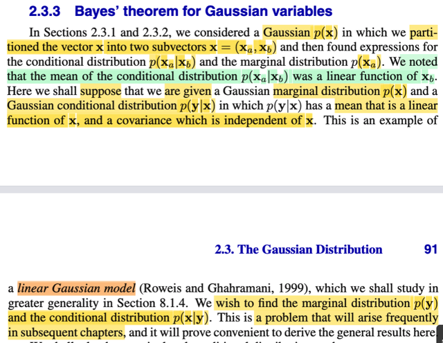
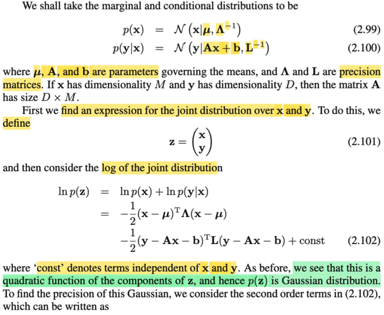
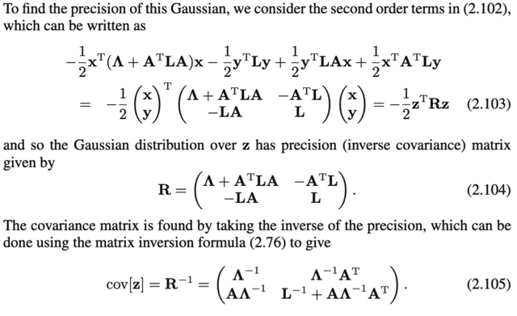
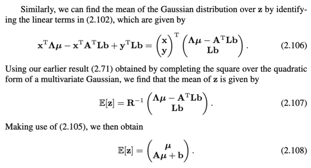
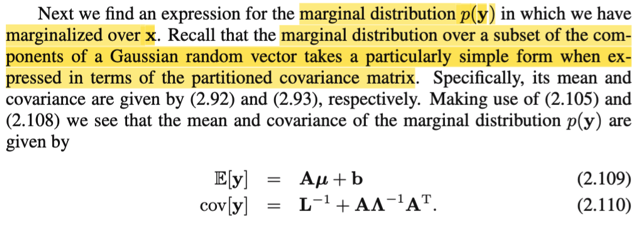

# 2.3.3 Bayes's theorem for Gaussian variables

📊 **Progress:** `3` Notes | `5` Screenshots

---

<kbd></kbd>

> [!NOTE]
> Qua phần này, đầu tiên gs nhắc lại, hai phần trước, ta bắt đầu với **X** ~
> Normal(**μ**, **Σ**), sau đó tách **X** thành hai subvector **Xa**, **Xb**, để rồi
> ta chứng minh rằng f(**xa**|**xb**) và f(**xa**) đều là pdf của normal. Và trong
> quá trình đó, ta đã đề cập đến một điểm, mean f(**xa**|**xb**) là một hàm tuyến
> tính theo **xb**
>
> Xem link tới note trước, ta có **μa|b** = **μa** - **Λaa_inv Λab** (**xb** - **μb**)
> thế thì vì sao nó là hàm tuyến tính với **xb**? à là vì nó có dạng [matrix] **xb** +
> constant, mà matrix nhân vector có bản chất là một linear transformation như
> đã học trong MIT 18.06.
>
> Mình nghĩ: như đã biết từ ee364a, nếu chặt chẽ, thì đây là affine function, ko
> phải linear function.
>
> Bên cạnh đó, covariance matrix, **Σa|b** = (**Λaa**)**inv**, thì không phụ thuộc
> **xb**, để rồi ông cho biết đây là một ví dụ của cái gọi là linear Gaussian model.
>
> Thế thì, trong bài toán này, cho rằng ta được cho f(**x**) và f(**y**|**x**) đều là
> Normal trong đó mean của f(**y**|**x**) là hàm phụ thuộc **x** và covariance
> matrix không phụ thuộc **x**. Đây là ví dụ của linear Gaussian model, và ta sẽ
> đi tìm f(**y**) cũng như f(**x**|**y**). Và đại khái là đây là bài toán gặp nhiều
> trong các chap sau nên ta sẽ phân tích nó ở đây trước.

 

<kbd></kbd>

<kbd></kbd>

<kbd></kbd>

> [!NOTE]
> Rồi, như đã nói, ta có **X** ~ Normal và **Y**|**X** ~ Normal với mean là hàm tuyến tinh của **x**, và
> covariance không phụ thuộc **x**. Nên ta gọi distribution của **X** là Normal(**μ**, **Λinv**) và **Y|X** ~
> Normal(A**x**+b, **Linv**).
>
> (Chú ý, cách ghi của gs f(**x**) = N(**x**|**μ**, **Λinv**), chỉ cũng đồng nghĩa với việc nói hàm pdf của **X**
> là hàm pdf của Normal(**μ**, **Λinv**), thì nó cùng ý nghĩa với việc nói distribution của **X** là Normal(**μ**,
> **Λinv**), mình ít thấy cách ghi này trong Casella và Stat110)
>
> Một điểm lưu ý nữa, như đã biết, khi nói đến Normal(**μ**, **Σ**), thì Σ, như đã chứng minh, là covariance
> matrix, Cov(**X**), và inverse của nó, **Σinv**, gọi là precision matrix. Nên nay khi ghi **X** ~ Normal(**μ**,
> **Λinv**) thì **Λinv** chính là covariance matrix, và **Λ**, dĩ nhiên là precision matrix. Tương tự với **Linv**,
> cũng là covariance matrix của f(**y**|**x**)
>
> Rồi, nói thêm rằng M, và D là số chiều (tức số phần tử) của **X** và **Y**. Và ta sẽ đi derive joint pdf của
> **X**, **Y**.
>
> Một điểm có thể có bạn thấy bị ngáo: khi nói về random vector **X** = (X1,...XM), thì nói về pdf của **X**,
> cũng chính là nói về joint pdf của X1,... XM. Tương tự, pdf của random vector **Y**, cũng chính là joint pdf
> của các single random variable Y1,....YD. Vậy thì nay, nói đi tìm joint pdf của **X**, **Y** cũng chính là tìm
> joint pdf của X1,..XM, Y1,...YD. Hiểu vậy sẽ thấy việc ta tạo vector **Z** = [**X**; **Y**] (gắn nó lại thành
> vector M + D chiều) thì pdf của **Z** cũng chính là joint pdf của X1,..XM, Y1,...YD, hay joint pdf của **X**,
> **Y**
>
> Thế thì như đã học trong Casella và Stat119, dùng Bayes theorem, cho ta: f(**x**, **y**) = f(**y**|**x**)f(**x**)
> (mà ta nhớ cái theorem này thực ra chỉ là hệ quả từ định nghĩa của conditional probability mà thôi)
>
> ⇨ f(**z**) = f(**x**,**y**) = f(**y**|**x**)f(**x**)
>
> Và ta mới xét log của f(**z**): log f(**z**) = log [f(**y**|**x**)f(**x**)], dùng tính chất hàm log: log(ab) = log(a) +
> log(b).
>
> ⇨ log(f(**z**)) = log f(**x**) + log f(**y**|**x**)
>
> Tại sao tự nhiên gs Bishop lại lấy log?
>
> Mình hiểu: là để **dễ làm**, vì mục đích cuối cùng là chỉ ra rằng log f(**z**) có dạng của log của một hàm số
> mà phần phụ thuộc **z** có dạng kernel của pdf của một Normal distribution. khi đó, ta sẽ kết luận **Z**
> cũng là Normal variable.
>
> Vì sao dễ làm, là vì với log f(**x**) + log f(**y**|**x**), cùng với việc hai cái f đều có dạng: [normalizing
> constant] exp[-(1/2) quadratic form], thì ta có:
>
> Gọi C1, C2 là hai cái normalizing constant của hai cái Normal đó, ta có
>
> log {C1 exp[-(1/2) (**x**-**μ**)T**Λ**(**x**-**μ**)] } + log {C2 exp[-(1/2)(**y**-A**x**-b)T**L**(**y**-A**x**-b)]}
>
> Dùng tính chất hàm log, tách ra:
>
> log {C1} + log exp[-(1/2) (**x**-**μ**)T**Λ**(**x**-**μ**)] } + log {C2} + log
> exp[-(1/2)(**y**-A**x**-b)T**L**(**y**-A**x**-b)]}
>
> = -(1/2) (**x**-**μ**)T**Λ**(**x**-**μ**) -(1/2)(**y**-A**x**-b)T**L**(**y**-A**x**-b) + log {C1} + log {C2}
>
> = -(1/2) (**x**-**μ**)T**Λ**(**x**-**μ**) -(1/2)(**y**-A**x**-b)T**L**(**y**-**Ax**-b) + conts (hai term cuối ko dính
> gì đến **x**, **y**, ta ko care)
>
> = -(1/2) [**x**T**Λx** - **μ**T**Λx** - **x**T**Λμ** + **μ**T**Λμ** + **y**T**Ly** - **x**T**A**T**Ly** - **b**T**Ly** -
> **y**T**LAx** + **x**T**A**T**LAx** + **b**T**LAx** - **y**T**Lb** + **x**T**A**T**Lb** + **b**T**Lb**]
>
> Nhiệm vụ của là gom các term lại: Cái này thì chỉ là dài dòng, ko có gì khó:
>
> Đầu tiên kể ra các term bậc hai (tức có dính 2 cái **x**, 2 cái **y** hoặc dính **x** và **y**):
>
> = -(1/2) [**x**T**Λx** + **y**T**Ly** - **x**T**A**T**Ly** - **y**T**LAx** + **x**T**A**T**LAx**]
>
> = -(1/2) [**x**T(**Λx** + **A**T**LA**)**x** + **y**T**Ly** - **y**T**LAx** - **x**T**A**T**Ly**]
>
> Bằng các xét cái matrix tạo bởi các block: [**Λ** + **A**T**LA**, -**A**T**L**; -**LA**, **L**], đặt là **R**, thì ta
> sẽ thấy cái trên chính là: -(1/2) **z**T**Rz**
>
> Tiếp, ra các term bậc một: (có dính tới **x** hoặc **y**):
>
> \-(1/2) [- **μ**T**Λx** - **x**T**Λμ** - **b**T**Ly** + **b**T**LAx** - **y**T**Lb** + **x**T**A**T**Lb** +
> **b**T**Lb**]
>
> = -(1/2) [- 2**μ**T**Λx** - 2**b**T**Ly** + 2**b**T**LAx**]
>
> = -(1/2) [- 2(**μ**T**Λ**-**b**T**LA**)**x** - 2**b**T**Ly**]
>
> = (**μ**T**Λ**-**b**T**LA**)**x** + **b**T**Ly**
>
> Bằng cách define vector **h** = [(**μ**T**Λ**-**b**T**LA**)T, (**b**T**L**)T] = (**Λ**T**μ**-**A**T**L**T**b**,
> **L**T**b**) = (**Λμ**-**A**T**Lb**, **Lb**) (do tính đối xứng của L, **Λ**) , ta sẽ thấy đây chính là **h**T**z**
>
> Còn các term bậc 0, thì gom lại thành constant.
>
> và do đó, nó có dạng quadratic function của **z**: =(1/2)**z**T**Rz** + **h**T**z** + const giúp kết luận rằng:
> Với việc log f(**z**) **có dạng log** **exp** [**quadratic function** của **z**] ta **suy ra** f(**z**) **có dạng
> exp[quadratic function của z] nhân some constant**, **và điều này đủ kết luận** **Z nhất định là random
> variable vector có phân phối Normal**.
>
> Đồng thời, với cách làm khớp mẫu như hai phần trước đã làm, ta sẽ suy ra mean và covariance của
> Normal này:
>
> Với công thức Normal μ, Σ tổng quát, quadratic form sẽ có dạng: -(1/2) [**x**T**Σinvx** - 2**μ**T**Σinvx** +
> **μ**T**Σinvμ**]
>
> = -(1/2) **x**T**Σinvx** + **μ**T**Σinvx** -(1/2) **μ**T**Σinvμ**
>
> Khớp mẫu:
>
> **z**T**Rz** khớp với **x**T**Σinvx → Covariance matriz, Cov(Z) chính là Rinv, hay Precision matrix chính là
> R**
>
> **μ**T**Σinvx** khớp với **h**T**z ⇨** **μ**T**Σinv** khớp với **h**T ⇔ (**μ**_**z**)T**R** = **h** ⇔ **μ**_**z**
> = (**hR**inv)T = **R**invT**h**T = **R**inv**h**
>
> Nhân vào, kết quả sẽ ra (**μ**; **Aμ** + **b**)
>
> Và để tính ra covariance matrix, Rinv, ta có thể dùng công thức 2.76 Schur complement để tính inverse của
> **R** = [**Λ** + **A**T**LA**, -**A**T**L**; -**LA**, **L**]. (chỉ là bài toán đại số).

 

<kbd></kbd>

> [!NOTE]
> Tiếp, khi đã có joint distribution f(**z**), cho thấy cũng là Normal. Ta sẽ đi tìm f(**y**).
>
> Có lẽ nên dừng lại review chút xíu:
>
> Bữa giờ ta ta đã chứng minh:
>
> Nếu có random vector **X tách thành hai subvector Xa, Xb**, và joint distribution của chúng là
> Normal(**μ**, **Σ**) hay Normal(**μ**, **Λinv**), ứng với việc **X** = [**Xa**; **Xb**] thì **Σ** và **Λ**
> (precision matrix) đều thể hiện ở dạng các matrix khối [**Σaa, Σab; Σba, Σbb]**, [**Λaa, Λab; Λba,
> Λbb**] thì f(**xa**|**xb**) và f(**xa**) đều là Gaussian. Trong đó với f(**xa**|**xb**) có covariance
> matrix thể hiện theo các matrix **Λ** sẽ gọn hơn là thể hiện theo **Σ**. Còn với f(**xa**) thì ngược
> lại, cụ thể ta còn **Xa** ~ Gaussian(**μa**, **Σaa**) (1) (công thức 2.92, 2. 93, xem link).
>
> Sau đó, ta qua bài toán khác là có marginal và conditional đều là nornal: f(**x**) là normal (**μ**,
> **Λ**inv), conditional f(**y**|**x**) cũng là normal(**Aμ** + **b**, Linv), thì a đã chứng minh cho thấy
> joint distribution f(**z**), **z** = [**x**; **y**] cũng là normal. Và tiếp tục ở đây, ta sẽ nói về marginal
> f(**y**).
>
> Thế thì, lần này ko cần chứng minh gì, chỉ cần áp dụng kết luận đã làm: Vì ta đã có f(**z**) là
> normal với mean E(**Z**) = [**μ**; **Aμ** + **b**] và covariance Cov(**Z**) = [**Λ**inv, **Λ**inv**A**T;
> **AΛ**inv, **L**inv + **AΛ**inv**A**T], theo ý (1) ở trên, có thể kết luận: marginal f(**y**) cũng là
> Normal. Với tham số là:
>
> Mean là **Aμ** + **b.**
>
> Covariance matrix: Trong chứng minh trước **Σ** = [**Σaa, Σab; Σba, Σbb]** là cov(**X** = [**Xa**;
> **Xb**]) thì cov(**Xa**) là **Σaa**, nên ở đây Cov(Y) chính là **L**inv + **AΛ**inv**A**T.
>
> ⇨ **Y** ~ Normal(**Aμ** + **b**, **L**inv + **AΛ**inv**A**T)

 

