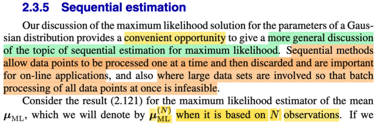
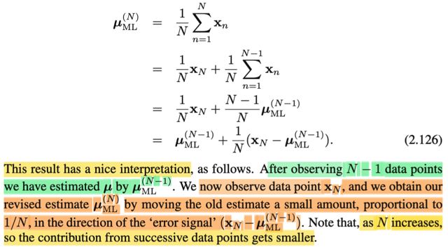
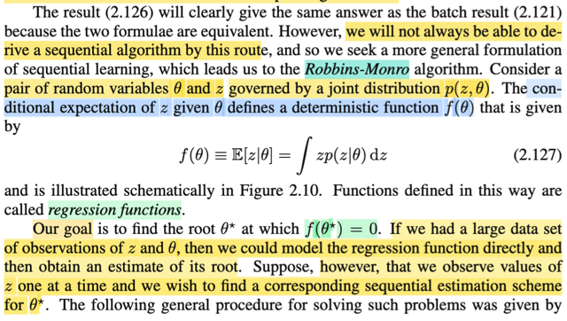
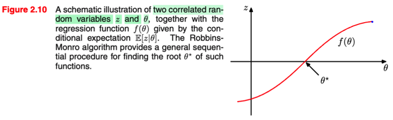
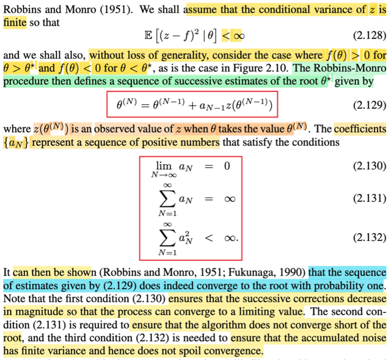

# 2.3.5 Sequential estimation

📊 **Progress:** `3` Notes | `5` Screenshots

---

<kbd></kbd>

<kbd></kbd>

> [!NOTE]
> Phần này, đại ý là, gs cho rằng, việc thảo luận về ml estimation của Gaussian
> parameter (**μ** và **Σ**) trong phần trước giúp ta tiện thể nói về cái gọi là
> **sequential estimation for maximum likelihood**, mà ông nói đại khái là cái
> này sẽ mở ra khả năng cho phép xây dựng một mô hình trong đó nó sẽ đưa
> ra estimate cho parameter dựa trên từng data point một, giúp cho ta ứng dụng
> cho những ứng dụng on-line (nơi data xuất hiện liên tục, khác với việc có một
> cục data cùng một lúc), hoặc cũng giúp ích trong những case mà data lớn,
> không thể nào xử lí mọi data cùng lúc được.
>
> Trước tiên ông mượn kết quả **μml**, như đã biết, chính là **Xbar**, = (Σi Xi) /
> N. Và gọi nó là **μml^(N)**, tức sample mean từ sample size N.
>
> **μml**^(N) = **xbar** = (Σi=1:N-1 **x**i) + **x**N] / N
>
> = (Σi=1:N-1 **x**i) / N + **x**N / N
>
> = **x**N/N + (Σi=1:N-1 **x**i) / N
>
> Nhân và chia term thứ hai cho N-1, mục đích để có (Σi=1:N-1 **x**i) / (N-1),
> chính là **μml**^(N-1), sample mean size N-1
>
> = **x**N/N + (Σi=1:N-1 **x**i) (N-1) / N (N-1)
>
> = **x**N/N + [(N-1) / N] (Σi=1:N-1 **x**i) / (N-1)
>
> = **x**N/N + (1 - 1/N) **μml**^(N-1)
>
> = **x**N/N + **μml**^(N-1) - **μml**^(N-1)/N
>
> = **μml**^(N-1) + **x**N/N - **μml**^(N-1)/N
>
> = **μml**^(N-1) + [**x**N - **μml**^(N-1)]/N
>
> Kết quả này, ông nói, cho ta một cách nhìn (interpretation) nhận như sau: với
> một data point / data sample **x**N mới được quan sát thấy, thì nó giúp cập
> nhật ml estimate theo hướng của data mới (thể hiện qua việc term thứ hai, có
> **x**N - **μml**^(N-1), chính là hướng từ estimation point cũ (sample mean
> size N-1) tới điểm **x**N. Và độ lớn của bước cập nhật, di chuyển này là tỉ lệ
> với 1/N.
>
> Như vậy, nếu N tăng lên, thì mức đóng góp của chuỗi các data point sẽ nhỏ
> lại.

 

<kbd></kbd>

> [!NOTE]
> Phần này giải thích rằng cách tiếp cận được mô tả ở ghi chú trước không phải lúc
> nào cũng dẫn đến một thuật toán khả thi, hay không phải lúc nào cũng có thể thực
> hiện được. Do đó, tác giả sẽ đề cập đến một cách tiếp cận khái quát hơn, đó là
> thuật toán Robin-Monroe.
>
> Trong bối cảnh này, chúng ta **xét hai biến ngẫu nhiên là θ và Z**, với **phân phối
> đồng thời là f(z, θ)**.
>
> Tiếp tục, ta sẽ xem xét kỳ vọng của Z dựa trên θ đã biết, ta có một hàm theo θ:
> E[Z|θ].
>
> Từ stat110 đã học về kì vọng, có bản chất chỉ là weight average các possible value
> của random variable với weight là xác suất tương ứng. Với biến rời rạc (ví dụ X có
> các possible value x1,x2,... thì EX = Σi xiP(X=xi)) còn với biến liên tục có pdf f(x)
> thì EX = ∫xf(x)dx.
>
> Thế thì với conditional expectation E[X|y], đơn giản cũng chỉ là y chang vậy, chỉ
> khác là ta sẽ dùng phân phối của X khi đã biết Y=y tức f(x|y) thay vì marginal pdf
> f(x): E[X|y] = ∫xf(x|y)dx. Và với việc Y là random variable, thì cái này cũng là sẽ phụ
> thuộc giá trị cụ thể của Y, nói cách khác, nó là hàm theo Y, và cũng chính là E[X|Y]
> là một random variable có dạng g(Y) với g(y) = ∫xf(x|y)dx.
>
> Vậy thì ở đây, E[Z|θ] = ∫zfZ(z|θ)dz, và cũng y như vừa nói ở trên, rằng E[X|y] là
> hàm theo y, thì E[Z|θ] là hàm theo θ, đặt là f(θ), và người ta gọi cái hàm này là
> regression function.
>
> Chú ý tạm hiểu là gs Bishop chỉ đang nói về một thuật toán thuần túy toán học, ta
> chưa hiểu sẽ áp dụng, hay mục đích để làm gì. Cũng vì vậy, tạm thời chấp nhận
> rằng, mục tiêu là đi tìm nghiệm của phương trình f(θ) = 0.
>
> Thế thì, ông nói, nếu ta có nhiều observed value của θ, và Z thì ta có thể mô hình
> hóa hàm regression một cách trực tiếp để sau đó ta estimate root của nó. Tức là
> sao?
>
> Hiểu nôm na là, nếu ta có nhiều data của Z và θ, thì mình sẽ mô phỏng lại "hình
> dạng" hành vi của hàm f(θ), từ đó tìm / estimate điểm θ khiến f(θ) = 0. Mô phỏng ở
> đây mình cứ hiểu là thế này: hàm f(θ) nhất định phải có dạng sao đó, ví dụ như
> hàm f(θ) = θ^2 thì nó có hình dạng parabol, đáy (root) tại θ = 0, kiểu kiểu vậy. Và
> giả sử như ta biết nó có dạng a θ^2 + b θ + c, thì bằng cách thu thập các điểm (θ,
> f(θ)) thì ta có thể giải tìm các hệ số, để từ đó có được phương trình chính xác của
> f(θ), khi đó có thể giải chính xác θ nào khiến f(θ) = 0. Thì ở đây cũng vậy, f(θ) =
> E[Z|θ] cũng sẽ là một phương trình có công thức nào đó. Như vậy nếu ta có nhiều
> cặp data (θ, f(θ)) thì đại khái là cũng có thể dùng thông tin đó để mô phỏng lại hàm
> f(θ), để rồi tìm root.
>
> Nhưng vấn đề là observed data lại không có một cục cùng lúc, mà lại chỉ có thêm
> từng cái từng cái một (one at a time). Do đó cách tiếp cận Robbins-Monro sẽ giúp
> ta trong nhiệm vụ này (giải tìm root: f(θ) = 0).

 

<kbd></kbd>

<kbd></kbd>

> [!NOTE]
> Trước khi nói về thuật toán của Robbins - Monroe, đầu tiên phải giả định là
> varance của Z: Var(Z|θ) finite.
>
> Nếu thấy khó hiểu về conditional variance thì cũng dễ thôi: chỉ cần xuất xứ từ
> định nghĩa của variance: Ví dụ với random variable X, Var(X) = E[(X-EX)^2], và
> ta nên nhớ, (X-EX)^2, biểu hiện một hàm số áp lên X, là cái hàm sau đây: g(x) =
> [x - EX]^2 (EX là một contant nào đó). Như vậy (X-EX)^2 có bản chất chỉ là
> g(X), là áp hàm g lên X, theo gs Joe luôn nhấn mạnh trong Stat110, khi áp hàm
> số lên random variable thì ta có một random variable, do đó và Var(X) thật ra
> chính là kì vọng của cái random variable g(X) này: E[g(X)] = E[(X-EX)^2].
>
> Để rồi, LOTUS, nói rằng, thay vì mày phải đi tìm pdf (hàm h(g) nào đó) của
> g(X), để tính Eg(X) theo định nghĩa: Eg(X) = ∫gh(g)dg, thì nó cho phép ta cứ
> dùng pdf f(x) của xX: E[g(X)] = ∫g(x)f(x)dx
>
> = ∫(x-EX)f(x)dx
>
> = ∫(x-∫xf(x)dx) f(x)dx
>
> Tóm lại tuy biết công thức là Var(X) = E[(X-EX)^2], nhưng ta hiểu bản chất của
> nó là kì vọng của biến ngẫu nhiên g(X), và khi tính, ta sẽ dùng pdf của X, f(x) để
> tính.
>
> Và nói dài dòng vậy để giúp hiểu cái condition variance là gì. Đơn giản,
> Var(X|y), chính là kì vọng của random variable g(X), nhưng lần này, distribution
> của nó, phải là distribution conditioned on Y=y. Tức là, nếu tính theo định nghĩa,
> ta sẽ đi tìm pdf của g(X) condition Y=y, ví dụ h(g|Y=y) nào đó, rồi tính
> E[g(X)|Y=y] = ∫gh(g|y)dg. Nhưng một lần nữa lotus cho phép ta dùng conditional
> pdf on Y=y của X, để tính.
>
> tính E[g(X)|Y=y] = ∫g(x)f(x|y)dx
>
> = ∫(x - E[X|y])^2 f(x|y)dx
>
> = ∫(x - ∫xf(x|y)^2dx) f(x|y)dx
>
> Nói tóm lại, Var(X) là kì vọng của biến g(X) = (X-EX)^2, được tính dựa theo
> marginal pdf của X: f(x)
>
> Còn Var(X|Y) là kì vọng của biến g(X) = (X - E(X|Y))^2, được tính dựa thep
> conditional pdf của X: f(x|y)
>
> Như vậy, cũng giúp ta hiểu Var[Z|θ] = E[(Z - E[Z|θ])^2] = E[(Z - f)^2]
>
> Và giả định ở đây là cái này mang giá trị hữu hạn.
>
> Rồi, nói thêm một ý nữa, ông giả định hàm f đồng biến, để θ > θ* thì f(θ) > 0 và
> ngược lại, nói chung ko có gì khó hiểu.
>
> Vậy thì Robbins-Monroe cho một quy trình để định ra một chuỗi các estimate
> của θ* như sau:
>
> θ^(N) = θ^(N-1) + a_N-1 z(θ^(N-1))
>
> Cần hiểu đây là kí hiệu của chuỗi số, ko có lũy thừa gì cả.Nói bằng lời đó là,
> quy trình sẽ sinh ra chuỗi θ1, θ2,....theo cách thức θ2 = θ1 + a1 × z(θ1) với a1
> là cons số nào đó, và z(θ1) là gía trị quan sát của Z khi θ đang có gía trị θ1.
> Như vậy tương tự, khi θ đang đã được cập nhật bằng θ2, ta quan sát thấy z =
> z(θ2), thì dùng một hệ số a2 nào đó, ta sẽ tính θ3, cứ thế...
>
> Như vậy cùng với chuỗi {θ}, ta sẽ có bộ hệ số {a1, a2,....} và Robbins-Monroes
> quy định nó phải thỏa các tính chất 2.130/1/2.

 

