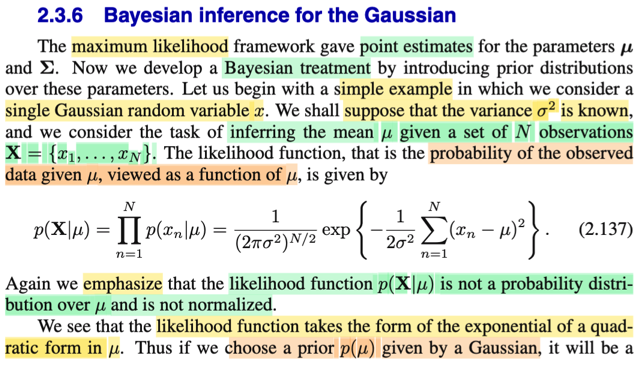
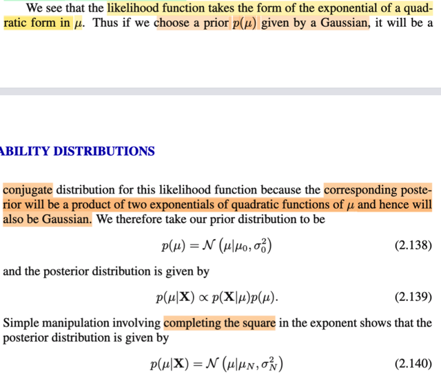
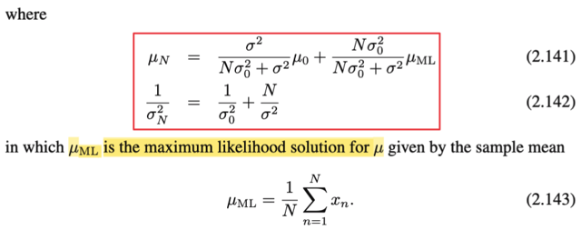
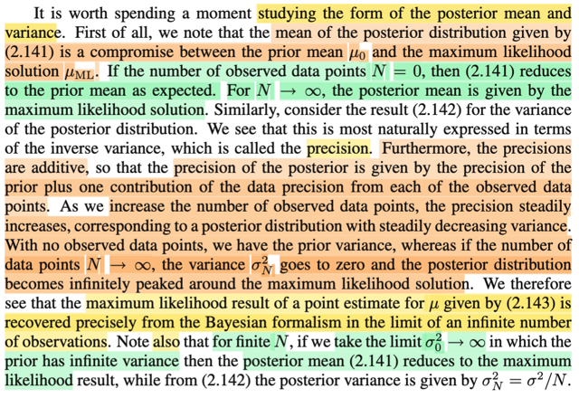
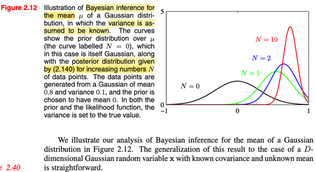

# 2.3.6 Bayesian inference for Gaussian

📊 **Progress:** `3` Notes | `5` Screenshots

---

<kbd></kbd>

> [!NOTE]
> Phần trước, đại khái là với maximum likelihood framework, thì gs Bishop cho ta một cách tiếp cận để
> point estimate giá trị của parameter. Nhờ cày xong cuốn Casella, nên mình hiểu vì sao lại point
> estimate. Nói sơ lại chút xíu: Như đã học trong chap 7 Casella - Point estimation, thì bài toán đặt ra là
> có một random sample iid X1,..Xn (gom lại thành vector **X**) có chung population distribution f(x|θ)
> (tụi này manually independent và có chung distribution (indetically distributed)), yêu cầu là xây dựng
> một function, W(**x**), sao cho với observed value của sample **X** = **x**, thì ta sẽ có một estimation
> \- một giá trị ước lượng của θ. Và sự ước lượng này mang tính chất là một ước lượng điểm - đơn giản
> là vì ta muốn ước lượng ra một điểm giá trị của θ, thay vì với bài toán khác, interval estimation, ta sẽ
> muốn ước lượng ra một khoảng mà ta tin sẽ chứa θ. Thế thì, maximum likelihood là một cách tiếp cận
> để làm cái việc đi tìm hàm W này, vì nó sẽ giúp ta có một estimation tương đối tốt. Và với MLE, nó
> thuần túy là thuộc trường phái Frequentist, vì ta vẫn chỉ coi θ như tham số có giá trị cố định nhưng
> chưa biết (fixed & unknown).
>
> Thế thì bước sang Bayesian approach, bất cứ khi nào dùng cách tiếp cận này, ta sẽ đều COI θ NHƯ
> **RANDOM VARIABLE**, và do đó, sẽ bắt đầu nó về distribution cuả nó, cũng như có thể nói về kì
> vọng, variance, ...của nó. Và thường thì ta sẽ chọn một prior distribution cho θ, trong sách Casella
> thường kí hiệu π(θ). Để rồi, dùng Bayes rule, ta xây dựng condional distribution của θ: π(θ|**x**), =
> f(**x**|θ) π(θ) / f(**x**).
>
> Nếu dừng tại đây chút xíu, có thể nói vài điểm quan trọng. Thứ nhất, vai trò của f(**x**) trong công
> thức này, dĩ nhiên có thể gọi nó là marginal pdf của **X** tại **x** (dù rằng thường người ta không gọi
> vậy), nhưng ta không quan tâm đến f là gì, vì Bayes theorem ĐẢM BẢO RẰNG, vế trái, π(θ|**x**) sẽ là
> một pdf hợp lệ (tức là một hàm số của θ, hợp lệ để đóng vai là một pdf, với các tính chất như:
> normalizing: tích phân ∫ π(θ|**x**) dθ = 1, cũng như π(θ|**x**) ≥ 0) Do đó, ta chỉ cần coi nó (f(**x**)) là
> một phần của normalizing constant của π(θ|**x**).
>
> Một điểm nữa, nhìn vào tử số, f(**x**|θ), dĩ nhiên, cái này là joint pdf của **X**, tại **x**, và theo định
> nghĩa của likelihood L(θ|**x**), thì nó chính là Likelihood của θ. Thành ra ta có thể ghi là π(θ|**x**) =
> L(θ|**x**) π(θ) / f(**x**), và bỏ qua cái constant, vốn là số không âm, bằng cách dùng cách thể hiện tỉ lệ
> thuận, ta sẽ có: π(θ|**x**) ∝ L(θ|**x**) π(θ).
>
> Và cuối cùng, một điểm quan trọng nữa đã học trong Casella, đó là có một số loại distribution mà
> quan hệ của chúng có tính chất như sau: Ví dụ như nếu Xi ~ binomial (tức f(x|θ) là pdf của binomial
> distribtion), và prior π(θ) là beta, thì posterior π(θ|**x**) hóa ra cũng sẽ là beta distribution. Đây gọi là
> tính chất conjugate: Beta là conjugate prior của binomial. Và tính chất này đem lại VÀI THUẬN LỢI
> TRONG TÍNH TOÁN. Tương tự, tí nữa ta sẽ thấy normal là prior conjugate với normal.
>
> Rồi, vẫn trong bối cảnh đang ôn lại Casella, thì sau khi có posterior thì sao: Thì khi đó ta không chỉ có
> một point estimation, mà ta có một distribution của θ. Do đó, ta có thể lấy mean hoặc median của
> distribution để làm point estimation. Và chúng chính là Bayes estimator giúp giảm thiểu Bayes risk với
> loss function được chọn là square error loss hay absolute error loss.
>
> Việc ôn lại Casella như vậy giúp dễ dàng hiểu những gì nói đến ở đây: gs Bishop đặt ra bài toán là ta
> cần infer (suy luận / suy diễn) giá trị mean μ của một population Normal(μ, σ^2) đã biết σ^2, dựa trên
> giá trị quan sát thấy của sample (data) **X** = (X1,...Xn) iid. Vậy thì như mình đã ôn lại ở trên,
> likelihood function là function của tham số θ, ở đây là μ, được định nghĩa bởi L(μ, σ^2|**x**) = f(**x**|μ,
> σ^2). Dùng tính iid của random sample, f(**x**|μ, σ^2), tức joint pdf của chúng được tách thành tích
> các marginal pdf:
>
> f(**x**|μ, σ^2) = Πn=1:N f(xn|μ, σ^2)
>
> Ráp pdf của normal(μ, σ^2) vô:
>
> .. = Πn=1:N { [1/√(2πσ^2)] exp[-(xn-μ)^2/2σ^2]}
>
> = { [1/√(2πσ^2)]^N Πn=1:N exp[-(xn-μ)^2/2σ^2]}
>
> Dùng tính chất hàm exp: e^a e^b = e^(a+b)
>
> = [1/(2πσ^2)^N/2] exp{ Σn=1:n [-(xn-μ)^2/2σ^2]}
>
> = [1/(2πσ^2)^N/2] exp{ (-1/2σ^2)Σn=1:n [(xn-μ)^2]}
>
> Viết lại:
>
> L(μ, σ^2|**x**) = f(**x**|μ, σ^2) = [1/(2πσ^2)^N/2] exp{ (-1/2σ^2)Σn=1:n [(xn-μ)^2]} → Đây là công thức
> 2.137 trong sách.
>
> (trong sách ông ghi là p(**X**|μ), thì chỉ là ông ko kể để σ^2, vì ta đã biết cái này, còn mình thì ghi như
> vậy với ghi chú đã biết σ^2 cũng chẳng sao). Còn một điểm nữa, ông Bishop dùng **X** (viết hoa in
> đậm) là một lần nữa không tuân theo cách kí hiệu chuẩn toán học (thậm chí là sai), vì chuẩn phải là
> L(μ, σ^2|**x**) = f(**x**|μ, σ^2) với **x** viết đậm, không hoa, vì đây là giá trị của random vector, nên
> bắt buộc phải viết thường, ko viết hoa. Những vẫn viết nét đậm vì đây là vector. Trong các lớp
> Stat110, Casella, mình chỉ thấy lần duy nhất người ta viết hoa kiểu này là F(X): để thể hiện đây là
> random variable có được khi áp hàm cdf F của X lên chính biến ngẫu nhiên X, ta sẽ có một uniform
> random variable.)
>
> Thế thì, nhờ Casella, tiếp theo ta cũng hiểu vì sao ông Bishop nói p(**X**|μ) không phải là một
> distribution over μ. Bởi lẽ đơn giản đây là hàm của θ, chỉ là được define theo cách thức mà giá trị của
> nó tại θ, L(θ|**x**), chính là giá trị của joint pdf của **X** tại **x**: f(**x**|θ), thì tuy đúng là f(**x**|θ) là
> một valid pdf, nhưng nó là khi xét nó là hàm theo **x**, thì ta mới có f(**x**|θ) sẽ luôn ko âm với mọi
> **x**, và ∫f(**x**|θ)d**x** = 1. Còn khi coi nó là hàm theo θ, thì CHƯA CHẮC ∫f(**x**|θ)dθ ĐÃ = 1.

 

<kbd></kbd>

<kbd></kbd>

> [!NOTE]
> Rồi, thế thì như phần review ở note trước ta sẽ dùng Bayes rule để xây dựng posterior, bỏ qua
> constant f(**x**) (mình sẽ cứ theo notation của Casella):
>
> π(μ|**x**) ∝ L(μ, σ^2|**x**) π(μ)
>
> π(μ|**x**) ∝ [1/(2πσ^2)^N/2] exp{(-1/2σ^2)Σn=1:n [(xn-μ)^2]} π(μ)
>
> Ở đây ông chọn priori là Normal(μ0, σ0^2), thay vào, đồng thời tiếp tục bỏ đi các constant (vì ta
> đang dùng kí hiệu tỉ lệ thuận rồi)
>
> π(μ|**x**) ∝ exp{(-1/2σ^2)Σn=1:N [(xn-μ)^2]} exp[-(μ-μ0)^2/2σ0^2]
>
> π(μ|**x**) ∝ exp{-(1/2σ^2) Σn=1:N [(xn-μ)^2] - (1/2σ0^2) (μ-μ0)^2}
>
> Tại đây, xét phần trong dấu exp{..}: -(1/2σ^2) Σn=1:N [(xn-μ)^2] - (1/2σ0^2) (μ-μ0)^2, ta thấy nó là
> một quadratic function của μ. Nội điều này đã đủ kết luận rằng posterior distribution là một Normal.
> Và để xác định tham số của normal này, ta sẽ làm động tác complete the sqaure và khớp mẫu giống
> như đã làm ở các phần trước. Viết gọn Σn=1:N là Σn
>
> ...= -(1/2σ^2) Σn [(xn-μ)^2] - (1/2σ0^2) (μ-μ0)^2
>
> = -(1/2σ^2) Σn (xn^2-2xnμ+μ^2) - (1/2σ0^2) (μ^2-2μμ0+μ0^2)
>
> = -(1/2σ^2) Σn (xn^2-2xnμ+μ^2) - (1/2σ0^2) (μ^2-2μμ0+μ0^2)
>
> Đặt -(1/2σ^2) và - (1/2σ0^2) là a, b cho gọn:
>
> = aΣn (xn^2-2xnμ+μ^2) + b(μ^2-2μμ0+μ0^2)
>
> = aΣn (xn^2) - 2a(Σnxn)μ + aNμ^2 + bμ^2 - 2bμ0μ + bμ0^2
>
> = aNμ^2 + bμ^2 - 2a(Σnxn)μ - 2bμ0μ + aΣn (xn^2)+ bμ0^2
>
> = (aN + b)μ^2 - 2(aΣnxn + bμ0)μ + aΣn (xn^2)+ bμ0^2
>
> Tới đây ta xét phần bên trong exp của một μ ~ Normal(τ, ε^2) sẽ có công thức là -(μ - τ)^2/2σ^2 =
> \-(μ^2 + τ^2 - 2μτ)/2ε^2 = (-μ^2 - τ^2 + 2μτ)/2ε^2 = -μ^2/2ε^2 - τ^2/2ε^2 + μτ/ε^2
>
> Khớp mẫu:
>
> (aN + b) = -1/2ε^2 ⇨ ε^2 = -1/[2(aN + b)]
>
> \- 2(aΣnxn + bμ0) = τ/ε^2
>
> ⇔ -2(aΣnxn + bμ0)ε^2 = τ
>
> ⇔ τ = -2(aΣnxn + bμ0)(-1/[2(aN + b)])
>
> ⇔ τ = 2(aΣnxn + bμ0)/[2(aN + b)]
>
> ⇔ τ = (aΣnxn + bμ0)/(aN + b)
>
> Thay a, b vào:
>
> ε^2 = -1/[2(aN + b)] = -1/[2([-(1/2σ^2)]N -(1/2σ0^2))]
>
> = 1/(N/σ^2 + 1/σ0^2)
>
> ⇔ 1/ε^2 = N/σ^2 + 1/σ0^2 → Tới đây ta đã có nghịch đảo của variance của posterior (cũng là
> precision), chính là **công thức 2.142 trong sách**
>
> τ = (aΣnxn + bμ0)/(aN + b)
>
> = ((1/σ^2)Σnxn + (1/σ0^2)μ0)/((1/σ^2)N + 1/σ0^2)
>
> = (Σnxn/σ^2 + μ0/σ0^2)/(N/σ^2 + 1/σ0^2)
>
> = (Σnxn/σ^2 + μ0/σ0^2)/(1/ε^2) | Thay cái mẫu chính là 1/ε^2
>
> = (NΣnxn/Nσ^2 + μ0/σ0^2)/(1/ε^2)
>
> Thay Σnxn/N = μML
>
> = (NμML/σ^2 + μ0/σ0^2)/(1/ε^2)
>
> = ε^2(NμML/σ^2 + μ0/σ0^2)
>
> = ε^2NμML/σ^2 + ε^2μ0/σ0^2
>
> = ε^2μ0/σ0^2 + ε^2NμML/σ^2
>
> = [ε^2/σ0^2]μ0 + [Nε^2/σ^2]μML
>
> = [ε^2/σ0^2]μ0 + [Nε^2/σ^2]μML
>
> Với 1/ε^2 = N/σ^2 + 1/σ0^2 ⇨ ε^2 = 1 / [N/σ^2 + 1/σ0^2]
>
> = σ^2σ0^2 / (Nσ0^2 + σ^2)
>
> ⇨ = [ε^2/σ0^2]μ0 + [Nε^2/σ^2]μML
>
> = [σ^2 / (Nσ0^2 + σ^2)] μ0 + [Nσ0^2 / (Nσ0^2 + σ^2)] μML
>
> → Đây chính là kết quả 2.141 trong sách

 

<kbd></kbd>

<kbd></kbd>

> [!NOTE]
> Đây là đoạn ta sẽ dừng lại để nhận xét về kết quả vừa rồi khi ta đã chứng minh
> posterior là một Normal có:
>
> posterior mean = [σ^2 / (Nσ0^2 + σ^2)] μ0 + [Nσ0^2 / (Nσ0^2 + σ^2)] μML
>
> posterior precision 1/ε^2 = N/σ^2 + 1/σ0^2
>
> Thế thì nhận định đầu tiên: posterior mean là một sự thỏa hiệp giữa prior mean (μ0) và
> ML estimation của μ (μML). Để rồi khi số data tăng lên, hệ số của prior mean giảm
> xuống, đóng góp của nó giảm xuống → và của μML tăng lên → Kết quả, posterior
> mean sẽ chuyển dịch dần về μML.
>
> Tương tự, precision (nghịch đảo của variance) cũng là kết hợp của cả hai precision
> (nhưng hởi khác với mean, là một convex combination, thì với precision, nó là tổng của
> precision): Khi dữ liệu tăng lên, precision sẽ ngày càng tăng, và cứ mỗi một data
> sample quan sát được, sẽ làm tăng precision thêm một khoảng bằng precision của X
> distribution, tức 1/σ^2.
>
> Và precision sẽ tăng lên liên tục khi tăng số sample nên hình ảnh sẽ là, data càng
> nhiều thì cái chuông normal posterior càng ốm lại, cộng với tâm của nó sẽ dịch về μML.
> Để khi N → ∞, posterior sẽ về cơ bản là cái chuông siêu ốm, với xác suất tập trung
> hoàn toàn tại đỉnh (peak) μML.
>
> Và hình ảnh trong sách minh họa cái vụ dịch chuyển này rất rõ.
>
> Chính vì vậy, mà gs Bishop nói rằng, cách tiếp cận Bayesian đã recover chính xác kết
> quả của maximum likelihood khi ta xét tại limit (khi xét điều kiện có vô số data) Nói vậy
> phải hiểu rằng, vốn dĩ hai cách tiếp cận này thuộc 2 trường phái rất khác nhau, trong
> đó ML là ước lượng điểm, coi μ là fixed nhưng ta không biết nó ở đâu unknown trong
> khi Bayesian coi μ là biến ngẫu nhiên, và tìm cách xây dựng distribution để thể hiện
> việc ta không biết về μ. Hãy để ý, quan điểm của Bayesian khác với Frequentist là coi μ
> như biến ngẫu nhiên để dùng distribution của nó để phản ánh tính uncertainty của nó,
> còn Frequentist thì phản ánh tính uncertainty thông qua việc nói rằng ta ko, chưa biết
> nó bằng bao nhiêu. Để rồi với vô số data, thì hóa ra cái distribution của Bayessian trở
> thành một point estimation khi nó biến thành cái chuông nhọn hoắc tập trung hoàn toàn
> xác suất tại μML.
>
> Cuối cùng, một nhận xét nữa là nếu data ko vô hạn, chỉ hữu hạn, nhưng ta cho
> variance của prior tăng vô hạn, thì mean của posterior cũng trở thành μML: Điều này
> nghĩa là sao? Mình hiểu thế này, cái việc chọn prior là Normal(μ0, σ0^2) phản ánh một
> kinh nghiệm nào đó, một hiểu biết nào đó về μ. Nhưng nếu ta không biết gì hết, thì ta
> sẽ phản ánh sự "không biết gì hết này" bằng cách cho xác suất dàn trải ra rất rộng:
> tăng σ0 → ∞ (khi đó, giống như coi như ta có uniform vậy, mặc dù chính xác thì ko
> phải), thì khi đó, dĩ nhiên với việc ta chả có kinh nghiệm gì, thì prior chẳng đóng góp gì,
> mọi dự đoán sẽ đều do data mà ra, tức là, ta sẽ dựa hoàn toàn vào μML và hai cái
> công thức trên phản ánh điều này.

 

