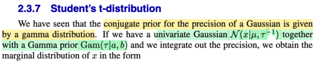
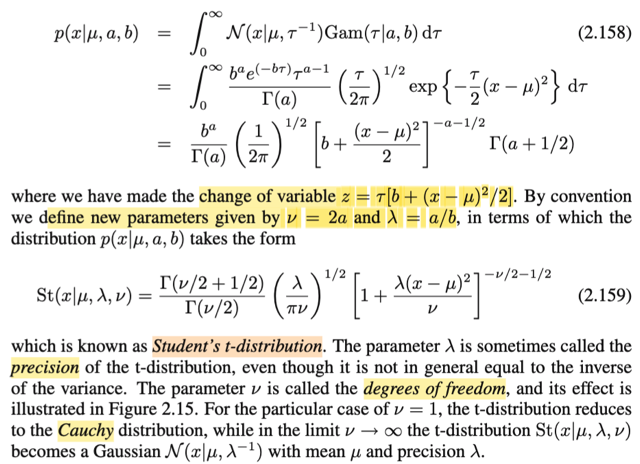
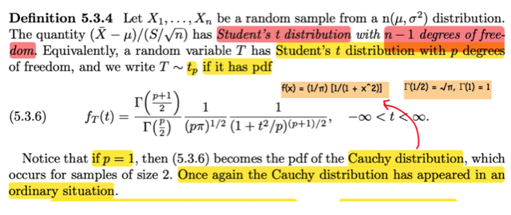
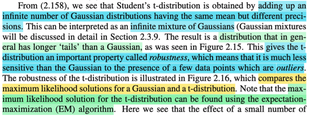
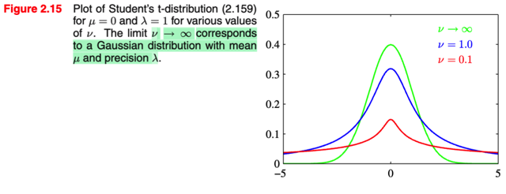
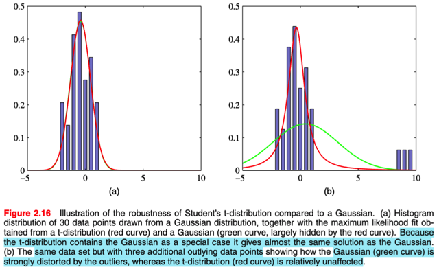
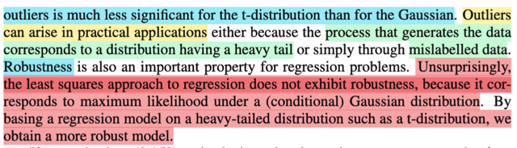
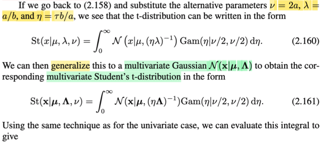
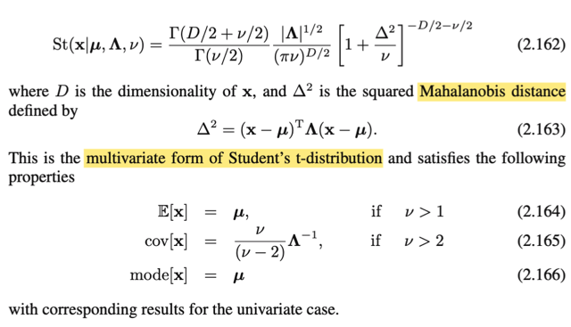

# 2.3.7 Student' t

📊 **Progress:** `4` Notes | `9` Screenshots

---

<kbd></kbd>

<kbd></kbd>

<kbd></kbd>

> [!NOTE]
> Rồi. qua phần này, đầu tiên gs nói rằng, ta đã biết từ mấy phần trước, là với Normal precision hay variance
> thì prior conjugate chính là Gamma (có nghĩa là khi infer variance của Normal, nếu dùng prior distribution
> là Gamma thì posterior cũng sẽ là Gamma). Vậy thì ở đây ông xét single variance normal, và Gamma rồi
> đem tích phân nó, để có marginal pdf của x. Là sao ta?
>
> Để hiểu cái này, đơn giản thôi, chỉ là dùng conditional probability theorem: f(x, y) = f(x|y)f(y). Và sau đó,
> marginalize joint pdf của x,y over y ta sẽ được marginal pdf của x: f(x) = ∫f(x,y)dy = ∫f(x|y)f(y)dy
>
> Vậy ở đây, ta nhớ lại chút, với Bayesian approach, để infer θ, ta coi nó như random variable, có prior
> distribution π(θ) và dùng Bayes theorem để xây dựng posterior distribution của θ: π(θ| **x**) = f(**x**|θ) π(θ)
> / f(**x**). Thế thì, nếu nhìn lại, thì tử số của bên phải chính là joint pdf của **X** và θ: f(**x**, θ). Nên nếu
> marginal cái này over θ, ta sẽ có marginal pdf f(**x**) (và chia cho f(**x**) ở dưới, sẽ ra 1, để hoàn toàn
> khớp với việc ta marginal cái bên trái π(θ|**x**) over θ, cũng phải ra 1, vì đây là một valid pdf)
>
> Vậy thì quay lại đây, ta sẽ thấy bản chất của Normal(x|μ,1/τ)Gam(τ|a,b), chính là joint pdf của X và τ: f(x,
> τ|μ,a,b). Nên như trên vừa nói, marginalizing cái này over τ ta sẽ có marginal pdf của x:
>
> f(x|μ,a,b) = ∫f(x,τ|μ,a,b)dτ = ∫Normal(x|μ,1/τ)Gam(τ|a,b)dτ
>
> Rồi, thay công thức pdf của Gamma, Normal vào:
>
> .. = ∫(√τ/√2π) exp[-τ(x-μ)^2/2] b^a exp(-bτ) τ^(a-1) / Γ(a) dτ
>
> = ∫ [b^a exp(-bτ) τ^(a-1) / Γ(a)] (τ/2π)^(1/2) exp[-τ(x-μ)^2/2] dτ
>
> = ∫ [b^a / Γ(a)] [(1/2π)^(1/2)] τ^(1/2) τ^(a-1) exp[-τ(x-μ)^2/2-bτ] dτ
>
> = ∫ [b^a / Γ(a)] (1/2π)^(1/2) τ^(a-1/2) exp{-τ[(x-μ)^2+2b]/2} dτ
>
> Tới đây, trong tích phân có dạng:
>
> [constant c] × τ^(α-1) exp(-τβ)
>
> với c = [b^a / Γ(a)] (1/2π)^(1/2), α = a+1/2, β = [(x-μ)^2+2b]/2
>
> Nhớ lại pdf của Gamma(α, β): f(x) = [1/Γ(α)] β^α x^(α-1) e^-βx với x ∈ (0, inf) α, β > 0
>
> Vậy từ đó có thể kết luận, cái hàm trong tích phân là kernel của một Gamma pdf có tham số α, β, do đó,
> bằng cách  bổ sung normalizing constant, cũng như đưa các constant sẵn có ra ngoài ta có thể rút gọn tích
> phân này bằng 1. Chỉ còn lại các constant:
>
> Normalizing constant của Gamma(α,β) cần bổ sung (nhân và chia bớt): [1/Γ(α)]β^α
>
> Vậy kết quả tích phân là: f(x|μ,a,b) = [Γ(α)/β^α] [b^a / Γ(a)] (1/2π)^(1/2)
>
> = [b^a / Γ(a)] (1/2π)^(1/2) [Γ(α)/β^α]
>
> Thay α = a+1/2, β = [(x-μ)^2+2b]/2 vào
>
> = [b^a / Γ(a)] (1/2π)^(1/2) [Γ(a+1/2)/{[(x-μ)^2+2b]/2}^(a+1/2)]
>
> = [b^a / Γ(a)] (1/2π)^(1/2) [1/{[(x-μ)^2+2b]/2}^(a+1/2)] Γ(a+1/2)
>
> = [b^a / Γ(a)] (1/2π)^(1/2) [{[(x-μ)^2+2b]/2}^(-a-1/2)] Γ(a+1/2)
>
> = [b^a / Γ(a)] (1/2π)^(1/2) [[(x-μ)^2/2+b]^(-a-1/2)] Γ(a+1/2)
>
> = [b^a / Γ(a)] (1/2π)^(1/2) [[b + (x-μ)^2/2]^(-a-1/2)] Γ(a+1/2) → kết quả trong sách 2.158
>
> \----
>
> Tiếp, đặt ν = 2a ⇨ a = ν/2, λ = a/b ⇨ b = a/λ
>
> Ta có:
>
> .. = [(a/λ)^a / Γ(ν/2)] (1/2π)^(1/2) [[a/λ + (x-μ)^2/2]^(-ν/2-1/2)] Γ(ν/2+1/2)
>
> = [Γ(ν/2+1/2) / Γ(ν/2)] (1/2π)^(1/2) (a/λ)^a [[a/λ + (x-μ)^2/2]^(-ν/2-1/2)]
>
> = [Γ(ν/2+1/2) / Γ(ν/2)] (1/2π)^(1/2) (a/λ)^a (a/λ)^(-ν/2-1/2) × [1 + λ(x-μ)^2/2a]^(-ν/2-1/2)]
>
> = [Γ(ν/2+1/2) / Γ(ν/2)] (1/2π)^(1/2) (a/λ)^(a-ν/2-1/2) × [1 + λ(x-μ)^2/ν]^(-ν/2-1/2)]
>
> = [Γ(ν/2+1/2) / Γ(ν/2)] (1/2π)^(1/2) (a/λ)^(ν/2-ν/2-1/2) × [1 + λ(x-μ)^2/ν]^(-ν/2-1/2)]
>
> = [Γ(ν/2+1/2) / Γ(ν/2)] (1/2π)^(1/2) (a/λ)^(-1/2) × [1 + λ(x-μ)^2/ν]^(-ν/2-1/2)]
>
> = [Γ(ν/2+1/2) / Γ(ν/2)] (1/2π)^(1/2) (λ/a)^(1/2) × [1 + λ(x-μ)^2/ν]^(-ν/2-1/2)]
>
> = [Γ(ν/2+1/2) / Γ(ν/2)] (1/2π)^(1/2) (2λ/ν)^(1/2) × [1 + λ(x-μ)^2/ν]^(-ν/2-1/2)]
>
> = [Γ(ν/2+1/2) / Γ(ν/2)] (λ/πν)^(1/2) × [1 + λ(x-μ)^2/ν]^(-ν/2-1/2)]  → 2.159
>
> Và đây là pdf của Studen's t-distribution, cái pdf của distribution này mình đã gặp torng sách Casella đã
> định nghĩa ở 5.3.4.
>
> Và ν được gọi là độ tự do. Khi ν = 1, ta sẽ có Cauchy distribution (sách Casella cũng nói vậy)
>
> Và khi lấy ν → inf, thì nó sẽ trở thành Normal(μ, 1/λ)

 

<kbd></kbd>

<kbd></kbd>

<kbd></kbd>

> [!NOTE]
> Thế thì đại khái là từ 2.518: Student t's (x|μ,τ) = ∫Normal(x|μ,1/τ)Gam(τ|a,b)dτ
>
> thì nó sẽ mang ý nghĩa là: Phân phối Student's t thực chất là **TỔNG VÔ SỐ
> CÁC PHÂN PHỐI NORMAL, CÓ CÙNG LOCATION μ NHƯNG VỚI CÁC
> PRECISION** τ khác nhau. Và do đó, gs mới nói ta có thể diễn giải nó như một
> **HỖN HỢP CỦA CÁC GAUSSIAN** (Gaussian mixture).
>
> Và vì là đều có cùng mean μ và tổng hòa của nhiều precision khác nhau, (cũng
> là variacne khác nhau) nên Student's t có cùng mean μ, NHƯNG CÁI ĐUÔI SẼ
> DÀI HƠN so với Normal.
>
> Và gs cho biết, đặc điểm này giúp Student t's có tính ROBUSTNESS, mang ý
> nghĩa là nó sẽ ít NHẠY CẢM với các outlier trong data hơn là Normal. (gs nói ta
> sẽ học về thuật toán EM giúp giải tìm MLE của t-distribution, hiểu ý đại khái là,
> **không như Normal, còn nhớ, ta có thể derive ML estimator của mean và
> precision của Normal, còn với student t, có lẽ vì độ phức tạp, ta sẽ cần thuật
> toán EM**)
>
> Nói về hình minh họa 2.15: dễ thấy là các đường hình chuông ứng với ν tăng
> từ 0.1 → inf sẽ ngày càng có: cái đuôi bớt dài, và càng giống hình chuông
> Normal, minh họa cho ý trong note trước, khi ν → inf thì Student's trở thành
> Normal.
>
> Còn hình 2.16 a đại khái là với một bộ sample ko có outlier, thì vì bản chất của
> student t cũng là normal, nên mle của student t (tức là maximum likelihood
> estimator của student t mean và variance) sẽ cũng trùng khớp với mle của
> normal. Nhưng nếu có outlier thì hình b cho thấy mle của Normal bị thay đổi
> khá nhiều, trong khi của Student t vẫn ít bị ảnh hưởng.
>
> Có thể hiểu thế này, **thay vì ta giả định X ~ Normal, rồi giải bài toán inference
> Normal param. Sẽ dễ bị outlier trong data ảnh hưởng xấu. thì ta có thể giải định
> X ~ Student's t, và giải bài toán inference param, sẽ ít bị ảnh hưởng bởi outlier
> trong data hơn.** Có thể nói thêm về tính robust của Student's t so với Normal: Như đã biết, cái
> đuôi của Student t dày hơn, đồng nghĩa, đối với mô hình này, xác suất của một
> observed data có giá trị extreme (kéo về 2 đầu cách xa mean) là cao hơn so
> với của Normal. Mà bài toán MLE, vốn có bản chất là: tìm dạng của distribution
> để giải thích tốt nhất cho observed data. nên nếu như có các extreme data, thì
> sẽ dẫn đến hai cách ứng xử khác nhau của hai mô hình (kết quả MLE của
> Normal và Student's t):
>
> Giả sử ban đầu, data ko có outlier, MLE của cả hai mô hình đều ra giống nhau:
> ML approach estimate location và scale của Normal và Student t là tương tự
> nhau.
>
> Student's: Vì như đã nói, nó có xác suất của extreme data cao hơn, nên khi thật
> sự data outlier xuất hiện, nó không ngạc nhiên lắm, không bị làm cho ảnh
> hưởng, khiến ML estimate của location và scale vẫn giữ nguyên.
>
> Normal. vì phải cố giải thích sự xuất hiện của extreme data, nên nó buộc phải
> tăng scale lên, hình ảnh sẽ là nó phải phình to ra, để giúp cho với mô hình đó,
> outlier có xác suất cao hơn, cũng chính là với scale đó, có thể giải thích tốt hơn
> cho các giá trị outlier này. Và không những vậy, nếu việc phình to (tăng scale /
> variance) còn chưa đủ, nó thậm chí phải dịch chuyển cái location / mean về
> phía đó nữa

 

<kbd></kbd>

> [!NOTE]
> Rồi, thế thì tiếp theo đây là một ý rất quan trọng. Gs nói rằng, khi hiểu về
> distribution Student t's có hình dạng giống normal nhưng cái đuôi dài hơn -
> với ý nghĩa, với mô hình xác suất này, các giá trị cực đoan có xác suất xuất
> hiện cao hơn, khiến cho ML estimator của distribution param, ví dụ location
> của nó, sẽ ít "bị nhạy cảm bởi outlier" hơn, hay nói nôm na là, khi gặp data
> có các giá trị cực đoan, thì mô hình ít bị xao động hơn (mình sẽ hiểu rõ hơn
> về cái này khi cày xong chap 10 Casella).
>
> Và như vậy, ta còn nhớ bài toán least square, có bản chất chính là bài toán
> ta đi tìm ML estimator của Normal mean: Tức là ta giả định T|**x** ~
> Normal(y(**x**, **w**), σ^2), và ý muốn nói, vì ta dùng Normal làm distribution
> giả định cho T, nên nó không có tính Robust. Nếu ta thay Normal bằng
> Student's t, ta sẽ có thể có cách tiếp cận Robust hơn.

 

<kbd></kbd>

<kbd></kbd>

> [!NOTE]
> Cái phân phối về cơ bản chỉ là giáo sư nói về cái phiên bản khái quát lên
> cái trường hợp đa biến của phân phối student T. Thì công thức của cái
> hàm student T đa biến mình chưa gặp ở Casella cũng như start 110.
> Nhưng mà ở đây mình tạm chấp nhận cái công thức đó thay vì cố gắng
> giải cái tích phân 2.161.

 

