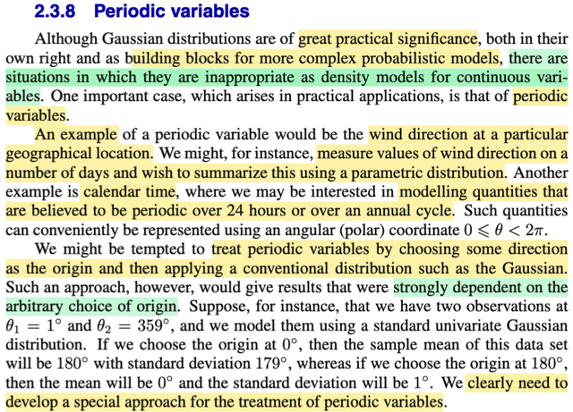
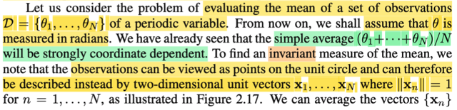
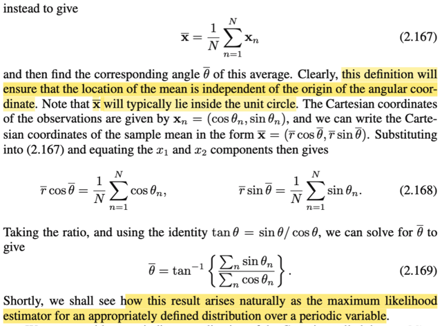
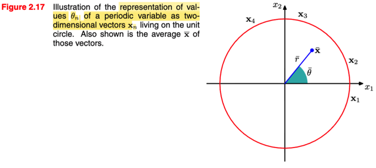
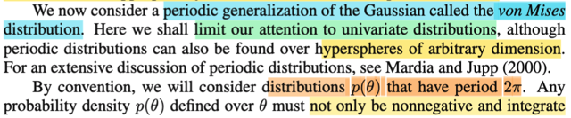
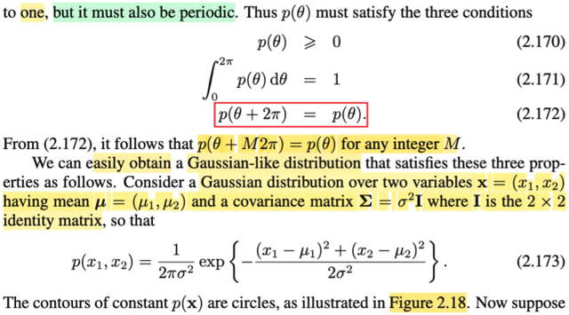
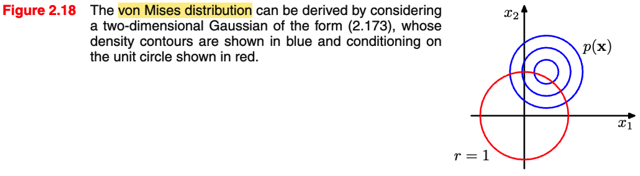
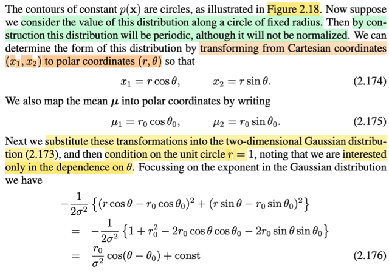
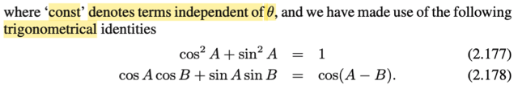
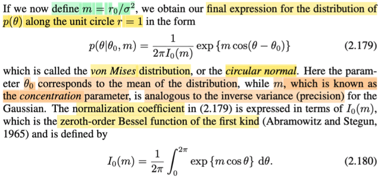

# 2.3.8 Preriodic variables

📊 **Progress:** `4` Notes | `10` Screenshots

---

<kbd></kbd>

> [!NOTE]
> Qua phần này, đại ý là, đầu tiên gs nói rằng, tuy Normal distribution có vai
> trò khá lớn khi nó có thể là building block của nhiều mô hình xác xuất phức
> tạp. Tuy nhiên cũng có những mô hình khó có thể dùng Normal để mô
> phỏng.
>
> Một trường hợp như vậy là preriodic variable. Ví dụ như hướng gió. (Kiểu
> như ta cho rằng X1,...Xn là các random variable, mang gía trị là hướng gió.
> Và muốn estimate distribution của chúng) Thì đoạn này nói rằng, một mô
> hình như vậy sẽ **phụ thuộc vào gốc tham chiếu nếu ta làm như kiểu
> thông thường** (ví dụ như dùng các random variable để mang giá trị của
> các observation và đi xây dựng (inference) tham số của population
> distribution)
>
> Ví dụ như ta có 2 observed value của hai random variable θ1, θ2 với θ1 =
> 1 độ, và θ2 = 359 độ. (θ1, θ2, chỉ là như X1, X2 thôi, là random variable
> trong sample, chẳng qua là vì trong bài toán này người ta sẽ dùng / đo
> hướng gió nên các random variable đây thể hiện góc của hướng gió. Có
> thể hiểu là θ1, θ2 là iid random sample ~ f(θ|μ, σ^2) Thì nếu lấy chọn gốc
> lại tại 0 độ, thì sample mean sẽ là 180, với standard deviation là 179.
> Nhưng nếu chọn gốc tại θ0 = 180 thì sample mean lại là 0, và standard
> deviation lại là
> 1.
>
> Do đó ta cần một cách tiếp cận đặc biệt để xử lý khi deal với periodic
> variable

 

<kbd></kbd>

<kbd></kbd>

<kbd></kbd>

> [!NOTE]
> Ok, đại khái là, cách tiếp cận khác sẽ là như sau: Vì mục đích là mô hình
> hóa hướng gió, và đại lượng hướng, ngoài cách làm dùng hệ tọa độ cực
> (polar coordinate) và dùng thông số góc, để đại diện, thì vẫn có thể dùng
> một cặp giá trị (x1,x2), tức một 2D vector **x**, nằm trên unit circle để đại
> diện, vì lẽ dĩ nhiên mỗi một điểm như vậy, sẽ mang thông tin của một giá trị
> góc, và vì ta chỉ quan tâm đến hướng, nên ta chỉ cần xét những điểm nằm
> trên unit circle thôi.
>
> Νhư vậy, giả sử với observed value của sample θ1, θ2,...θN, sẽ tương ứng
> với sampe, **x**1, **x**2, ...**x**N.
>
> Từ đó sample mean θbar = (Σi θi)/N sẽ tương ứng với sample mean
> **x**bar = (Σi **x**i)/N
>
> Rồi, vì θn sẽ liên hệ với **x**n thông qua: **x**n = (**x**n_1, **x**n_2) = (cos
> θn, sin θn) nên
>
> **xbar** = (**x**bar_1, **x**bar_2) = (rbar × cos(θbar), rbar × sin(θbar)).
>
> và từ đó,
>
> tan(θbar) = **x**bar_1 / **x**bar_2
>
> = [(1/N) Σi **x**i_1] / [(1/N) Σi **x**i_2]
>
> = Σi **x**i_1 / Σi **x**i_2
>
> = Σi **x**i_1 / Σi **x**i_2
>
> = Σi sin(θi) / Σi cos(θi)
>
> ⇨ θbar = argtan(Σi sin(θi) / Σi cos(θi)) → 2.169
>
> Nói chung ko có gì khó hiểu cả, chỉ là, thay vì ta dùng thước đo là góc θ để
> ghi nhận, thể hiện giá trị của các data (đồng nghĩa ta dùng Polar
> coordinate), thì ta dùng 2D vector **x** trên đường tròn unit, để ghi nhận
> cùng một quan sát. Từ đó, bằng cách này, ta không còn bị cái vụ phụ thuộc
> vào mốc làm chuẩn nữa.

 

<kbd></kbd>

<kbd></kbd>

<kbd></kbd>

> [!NOTE]
> Rồi, thế thì, ta sẽ được học một phiên bản khái quát của phân phối Normal, có
> tên gọi là von Mises. Và sẽ chỉ làm với case đơn biến.
>
> Theo quy ước ta sẽ xét distribution f(θ) có chu kì 2π.
>
> Thế thì, vì tính chất perdiod, nên đại ý là, ngoài hai đặc điểm của một valid pdf:
> không âm và intergrate = 1, thì nó còn phải thỏa f(θ + 2π) = f(θ).
>
> Và ta sẽ bắt đầu việc derive ra công thức của pdf von Mises như sau: Xét một
> phân phối Normal 2D: **X** ~ Normal(**μ**, **Σ**) có mean là **μ** = (μ1, μ2),
> covariance là σ^2 **I** (là 2x2 matrix).
>
> Công thức 2.173 là sao?
>
> Còn nhớ công thức của multivariate Gaussian:
>
> f**X**(**x**|**μ**,Σ) = công thức 2.43 = [1/(2π)^(D/2)] [1/|**Σ**|^1/2]
> exp[-1/2(**x**-**μ**)T **Σ**inv(**x**-**μ**)]
>
> Thì ở đây với D = 2, và **Σ** = σ^2 **I**, thì |**Σ**| = (σ^2)^2 ⇨ |**Σ**|^1/2 = σ^2.
>
> Và **Σinv** sẽ là (1/σ^2) **I ⇨ Σ**inv(**x**-**μ**) = [(x1-μ1)/σ^2; (x2-μ2)/σ^2]T
>
> ⇨ (**x**-**μ**)T **Σ**inv(**x**-**μ**) = [x1-μ1; x2-μ2] dot product [(x1-μ1)/σ^2;
> (x2-μ2)/σ^2]
>
> = (x1-μ1)^2/σ^2 + (x2-μ2)^2/σ^2
>
> = [(x1-μ1)^2 + (x2-μ2)^2] /σ^2
>
> Thay vào ta sẽ có f(**x**|**μ**,**Σ**) = (1/2πσ^2) exp{-(1/2σ^2)[(x1-μ1)^2 +
> (x2-μ2)^2]}
>
> Và contour plot của hàm pdf này là những đường tròn trên hình 2.18, vì sao:
>
> Thì chỉ cần xét một c level curve: f(x) = c
>
> ⇔ (1/2πσ^2) exp{-(1/2σ^2)[(x1-μ1)^2 + (x2-μ2)^2]} = c
>
> ⇔ exp{-(1/2σ^2)[(x1-μ1)^2 + (x2-μ2)^2]} = c 2πσ^2
>
> ⇔ -(1/2σ^2)[(x1-μ1)^2 + (x2-μ2)^2] = log(c 2πσ^2)
>
> ⇔ (x1-μ1)^2 + (x2-μ2)^2 = - log(c 2πσ^2) 2σ^2 = constant d
>
> Thì đây là phương trình đường tròn tâm tại μ, bán kính √d

 

<kbd></kbd>

<kbd></kbd>

<kbd></kbd>

> [!NOTE]
> Từ note trước ta đã hiểu f(**x**|**μ**,**Σ**) = (1/2πσ^2) exp{-(1/2σ^2)[(x1-μ1)^2 +
> (x2-μ2)^2]}
>
> Bước tiếp theo là đổi biến x1 = r cos(θ), x2 = r sin(θ), và xét trong phạm vi circle unit
>
> Theo change of variable theorem đã học ở Stat110 hoặc Casella, cụ thể ở đây là
> bivariate change of variable: Ôn lại nhanh, với random variable vector (X,Y) có pdf fX,
> Y(x,y), và ta có U = g1(X,Y), V = g2(X,Y), với mapping 1-1 từ support set của (X,Y) với
> support set của (U,V): X = h1(U,V), Y = h2(U,V), thì change of variable theorem cho ta:
>
> fU,V(u,v) = fX,Y(x,y) |∂(x,y)/∂(u,v)| = fX,Y(h1(u,v), h2(u,v)) |∂(x,y)/∂(u,v)|
>
> với |∂(x,y)/∂(u,v)| là trị tuyệt đối của Jacobian matrix của hàm vector → vector: [g1(u,v),
> g2(u,v)]
>
> Áp dụng vào đây
>
> f(θ, r) = f(x1,x2) |det J|, với J là jacobian matrix: matrix ∂(x1,x2)/∂(θ,r)
>
> (có thể tính |det J| ra ko khó, vì matrix này là matrix 2x2: [∂x1/∂θ, ∂x1/∂r; ∂x2/∂θ, ∂x2/∂r] =
> [cos(θ), -rsin(θ); sin(θ), rcos(θ)] = rcos(θ)cos(θ) - [-rsin(θ)sin(θ)] = r[cos(θ)^2 + sin(θ)^2]
> = r ⇨ |det J| = |r| = r)
>
> = f(r cos(θ), r sin(θ)) r
>
> = (r/2πσ^2) exp{-(1/2σ^2)[(r cos(θ)-μ1)^2 + (r sin(θ)-μ2)^2]}
>
> Tiếp, như thường lệ, ta sẽ chỉ cần quan tâm quadratic form (vì constant bên ngoài, chỉ
> đóng vai normazing constant):
>
> = -(1/2σ^2)[(r cos(θ)-μ1)^2 + (r sin(θ)-μ2)^2]
>
> = -(1/2σ^2)[r^2 cos(θ)^2 - 2r μ1 cos(θ) + μ1^2 + r^2 sin(θ)^2 - 2r μ2 sin(θ) + μ2^2]
>
> = -(1/2σ^2)[r^2 (cos(θ)^2 + sin(θ)^2) - 2 r μ1 cos(θ) - 2 r μ2 sin(θ) + μ1^2 + μ2^2]
>
> gọi (θ0, r0) là tọa độ tương ứng của (μ1, μ2) trong polar coordinate, ta thay vào luôn
>
> = -(1/2σ^2)[r^2 - 2 r r0 cos(θ0) cos(θ) - 2 r r0 sin(θ0) sin(θ) + (r0 cos θ0)^2 + (r0 sin
> θ0)^2]
>
> Dùng điều kiện r = 1 (do đang chỉ xét trong phạm vi trên đường unit circle)
>
> = -(1/2σ^2)[1 - 2 r0 cos(θ0) cos(θ) - 2 r0 sin(θ0) sin(θ) + r0^2]
>
> = -(1/2σ^2)[1 + r0^2 - 2 r0 cos(θ0) cos(θ) - 2 r0 sin(θ0) sin(θ)]
>
> = -(1/2σ^2)[1 + r0^2 - 2 r0 cos(θ0) cos(θ) - 2 r0 sin(θ0) sin(θ)]
>
> = -(1/2σ^2)(1 + r0^2) + (1/2σ^2)[2 r0 cos(θ0) cos(θ) + 2 r0 sin(θ0) sin(θ)]
>
> = const + (r0/σ^2)[cos(θ0) cos(θ) + sin(θ0) sin(θ)]
>
> = (r0/2σ^2)[cos(θ0) cos(θ) + sin(θ0) sin(θ)] + const
>
> = (r0/σ^2)[cos(θ - θ0)] + const
>
> Rồi, tới đây ta có:
>
> f(θ) = (1/2πσ^2) exp{(r0/σ^2)cos(θ - θ0) + const} |J|
>
> Nhưng vì ta đã làm động tác chỉ xét trên phạm vi đường tròn unit, nên bản thân cái vế
> phải không còn là một valid pdf nữa, hay nói cách khác, ta sẽ phải normalizing nó.
> Thành ra, những hằng số cụ thể ở đây ko còn đóng vai trò biểu hiện chính xác của
> normalizing constant nữa, nên ta ko cần care nữa cho mệt, chỉ cứ làm theo lối thông
> dụng: quan tâm đến kernel, và định nghĩa normalizing constant sau.
>
> Đặt m = r0 / σ^2
>
> f(θ) ∝ exp{m cos(θ - θ0)}
>
> ∝ exp{m cos(θ - θ0)}
>
> Và vì tính valid: ∫0:2π f(θ) dθ = 1 ⇔ ∫0:2π [normalizing constant] exp{m cos(θ - θ0)] dθ =
> 1
>
> ⇔ [normalizing constant] ∫0:2π exp{m cos(θ - θ0)] dθ = 1
>
> ⇔ ∫0:2π exp{m cos(θ - θ0)] dθ = 1/[normalizing constant]
>
> Vậy f(θ) = [normalizing constant] exp{m cos(θ - θ0)}
>
> với [normalizing constant] = 1/∫0:2π exp{m cos(θ - θ0)] dθ
>
> Và người ta đặt cái tích phân ở mẫu số là 2πI0(m):
>
> 2πI0(m) = ∫0:2π exp{m cos(θ - θ0)] dθ
>
> ⇔ I0(m) = (1/2π) ∫0:2π exp{m cos(θ - θ0)] dθ, và cái này được gọi là **hàm Bessel bậc
> zero of the fisrt kind** (tạm biết vậy thôi)
>
> ∫0:2π exp{m cos(θ - θ0)] dθ = 2πI0(m) ⇔ (1/2π) ∫0:2π exp{m cos(θ - θ0)] dθ = I0(m) , để
> rồi:
>
> f(θ) = [1/2πI0(m)] exp{m cos(θ - θ0)}
>
> Vậy là ta đã có von Mises distribution, còn gọi là **CIRCULAR NORMAL**, có mean là
> θ0, m là tham số **CONCENTRATION** , tương đương với **inverse variance**
> (precision) trong phân phối normal thông thường.
>
> Mình nên nói thêm chút xíu. Đại ý của cái ý tưởng của chuyện mà nãy giờ làm. Mục đích
> là như đã nói là muốn xây dựng một cái phân phối chuẩn nhưng mà dành cho một cái
> đại lượng có tính chất là periodic, có nghĩa là tính chất chu kỳ. Cái tính chất chu kỳ á nó
> nó là một cái tính chất mà trong một số cái trường hợp, một số cái bài toán thực tế nó
> phát sinh. Ví dụ, khi mà mình muốn xét một cái đại lượng mang ý nghĩa là hướng. Thì
> kiểu như là bây giờ cái hướng nó xoay vòng vòng. Thì nó xoay vòng vòng nó có một cái
> tính chất đó là khi mà mình thay đổi, ví dụ như từ hướng 1 giờ mình thay đổi thành
> hướng 2 giờ thì thì nó nó là giá trị nó thay đổi. Tức là nó ra một cái hướng khác. Rồi từ 2
> giờ nó thành 3 giờ thì nó ra một hướng khác, nó giống như cái chuyện mà mình thay đổi
> trên trục số từ x1 bằng 1, từ x2 bằng 2, từ x3. Nhưng mà khi mà mình thay đổi đến cái
> hướng đến một cái mức nào đó nó lại quay lại vị trí cũ. Thì đó là cái tính periodic, tính
> chu kỳ. Thì cái này mình lại không thể nào phản ánh nó bằng những cái biến ngẫu nhiên
> mà mang giá trị thực được. Bởi vì giá trị thực nó không có cái chuyện đó, x1 bằng 1, x2
> bằng 2, bằng 3, nếu mà nó tiếp tục tăng thì nó không bao giờ nó quay lại được cũ cả.
> Do đó là mình phải tìm cách là ép hoặc là xây dựng một cái phân phối chuẩn nhưng có
> cái tính chất chu kỳ để dành để riêng cho việc mô hình hóa những cái biến periodic.
>
> Vậy thì cái ý tưởng Đại khái là mình cứ nhìn vô cái hình trong sách. Người ta bắt đầu
> với một cái mô hình normal. Xét một cái hàm một cái hàm density. Cái hàm density đặc
> biệt ở chỗ này là nó cái hàm cái đường màu đỏ là đại khái vậy. Mình đang có một cái
> hàm hai biến một cái chuông ở trong không gian 3D, đúng không? Mình có cái hàm hai
> biến. Bây giờ mình mới restrict nó trên một cái đường tròn unit. Thì khi đó cái hàm số
> mà hai biến, cái hàm PDF của normal đó nhưng mà bị restrict trên một cái đường tròn
> đơn vị thì lúc bây giờ nó chỉ còn là một cái hàm một biến. Mà khi mà mình đi trên cái
> đường tròn đó thì nó có một cái tính chất thế này. Đó là khi mà mình đi một vòng thì
> mình lại về lại chỗ cũ. Ví dụ như mình xuất phát tại cái điểm mà tại đó cái độ lớn hàm
> PDF là lớn nhất đi thì khi mình đi đúng một vòng thì mình lại quay lại đúng cái chỗ cũ.
> Tức là mình có được một cái hàm số có cái tính chất là chu kỳ.
>
> Và mình cứ hình dung là khi mà mình di chuyển trên cái đường đó đó thì mình sẽ ví dụ
> như điểm bắt đầu của mình nó nói là cái điểm mà có cái có cái độ cao cao nhất, tức là
> cái giá trị density cao nhất. Nó là cái điểm mà nằm bên phải và nói chung là ở cái gốc
> bên phải ở bên trên á. Nằm đâu khúc giữa mà nó gần với cái cái cái tâm nhất của mấy
> cái đường màu xanh á. Thì mình cứ hiểu đại khái nó là giống như là một cái là nó ứng
> với tâm của cái phân phối vậy. Rồi để coi rồi mình đi mình đi trên cái đường tròn màu đỏ
> đó thì cái density nó giảm dần. Nhưng mà khi mình đi qua phía bên kia thì density lại
> tăng lên dần và nó lại về lại vị trí cũ. Và dĩ nhiên là khi mà mình đã restrict cái hàm
> normal PDF ở trên cái đường màu đỏ thì lúc bấy giờ nó không còn có cái tính hợp lệ để
> trở thành một cái PDF nữa. Do đó mình phải có cái bước gọi là normalizing. Cái bước
> chuẩn hóa. Nhưng mà cái kiểu như là cái cái cách biến thiên của cái hàm mà gọi là
> circulating Gaussian này nó cũng có cái dạng của hình chuông nhưng mà nó lại có cái
> tính periodic. Nó hay là chỗ đó.

 

