# 2.3 Gaussian Distribution

📊 **Progress:** `7` Notes | `11` Screenshots

---

<kbd>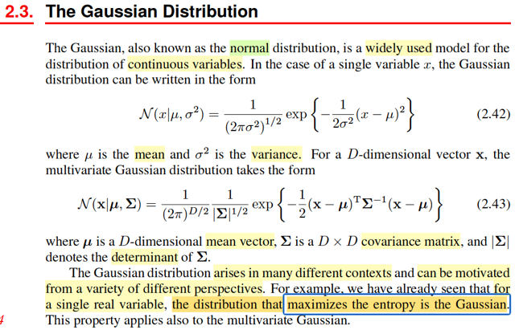</kbd>

> [!NOTE]
> Phần này ta sẽ nói về Gaussian (hay Normal distribution), là distribution khá
> quan quen thuộc sau khi học xong Stat110 và Casella. Công thức của case
> đơn biến hay đa biến thì mình cũng đã đều bíết rồi. Đặc biệt trong chap 1
> mình đã derive lại công thức Normal đa biến để hiểu công thức 2.43 rồi.
>
> Thế thì gs nói đây là distribution hay dùng, và nó xuất hiện trong nhiều bối
> cảnh. Ví dụ như trong chap 1 mình đã thấy nó chính là **distribution có
> entropy lớn nhất**.

 

<kbd>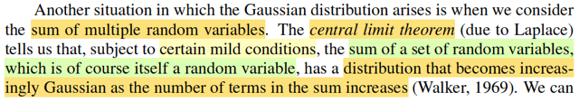</kbd>

<kbd>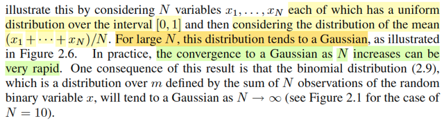</kbd>

<kbd>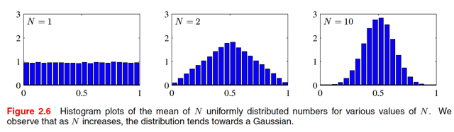</kbd>

> [!NOTE]
> đại khái là gs Bishop nói một trường hợp nữa mà ta thấy sự xuất hiện của
> Normal đó là, Central Limit Theorem, còn nhớ trong Stat110 và Casella,
> theorem này nói rằng, xét một random sample size n X1,X2,...Xn ~ distribution
> có mean μ và variance σ^2 thì sample mean  Xbar sẽ converge in distribution
> về một normal(μ, σ^2/n).
>
> Và hình ảnh minh họa cho thấy, X1, ..Xn là uniform, và người ta plot giá trị của
> sample mean Xbar.
>
> Hiểu như sau. Ban đầu ta sẽ chỉ in Xbar của sample size N=1: tức là lấy
> random sample size N = 1 nhiều lần, mỗi lần tính ra Xbar, và plot ra, khi đó có
> thể thấy distribution của Xbar cũng chỉ là uniform.
>
> Nhưng ta làm vậy với N lớn dần thì sẽ thấy distribution của Xbar dần dần có
> dạng của normal.

 

<kbd>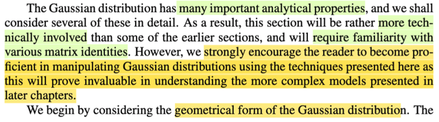</kbd>

<kbd>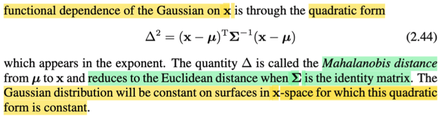</kbd>

> [!NOTE]
> Đại ý là gs nói rằng phần này ta sẽ cần nhiều kiến thức về matrixmà ông
> có nói đến trong Appendix C. Tuy nhiên ông khuyến khích người học nên
> trở nên thành thạo trong việc biến đổi liên quan đến phân phối Normal với
> các kĩ thuật sẽ nói đến ở đây. Vì như vậy sẽ giúp cho ta có thể hiểu được
> các mô hình phức tạp hơn giới thiệu trong các chương sau.
>
> Đầu tiên ta sẽ xem xét khía cạnh hình học của phân phối Gaussian.
>
> Thế thì, ông nói, đại khái là, phân phối Gaussian sẽ phụ thuộc vào x thông
> qua quadratic form (**x** - **μ**)T Σinv (**x** - **μ**), đặt là Δ^2. Ý ông nói
> vậy có nghĩa là, ta thấy trong pdf của multivariate Normal, thì có thể thấy
> nó phụ thuộc với x thông qua cái cụm này, chỉ vậy thôi. Và cụm này, có
> dạng của zTAz, như đã biết trong MIT 1806, gọi là quadratic form (cũng
> chính là cái mà nếu ta có thể chỉ ra zTAz > 0 với mọi z thì ta sẽ kết luận A
> là positive definite matrix đó).
>
> Rồi, ở đây mình được biết một ý mới, rằng Δ được gọi là Mahalanobis
> distance của **μ** và **x**. Và khi Σ là identity matrix I, thì Δ trở thành (**x**
> \- **μ**)T(**x** - **μ**), dĩ nhiên đây chính là ||**x** - **μ**||^2, là L2 hay
> Eucledean distance của **x** và **μ**.
>
> Cuối cùng, đương nhiên ta cũng hiểu ý cuối, là nếu cái cụm này mà là
> constant, thì dĩ nhiên hàm pdf Gaussian cũng là constant theo **x**.

 

<kbd>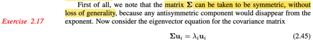</kbd>

> [!NOTE]
> Thế thì chỗ này gs nói matrix Σ có thể coi như là symmetric (đối xứng), mà
> không mất tính tổng quát vì mọi thành phần bất đối xứng đều bị biến mất
> bởi exponent. Là sao ta?
>
> Sau khi thảo luận với gemini, mình hiểu thế này: Một matrix A được gọi là
> đối xứng khi AT = A (A tranpose, chuyển vị, bằng chính nó). Còn nếu AT =
> \-A thì nó gọi là anti-symmetric matrix.
>
> Thế thì giả sử ta xét một matrix A bình thường (bất kì, bằng cách biến đổi
> chút ta sẽ có: A = (1/2)A + (1/2)A
>
> = (1/2)A + (1/2)AT + (1/2)A - (1/2)AT
>
> = (1/2)(A + AT) + (1/2)(A - AT)
>
> Khi đó ta có (1/2)(A + AT) là matrix đối xứng, vì (1/2)(A + AT)T = (1/2)(AT +
> A) = (1/2)(A + AT)
>
> Còn (1/2)(A - AT) là matrix anti-symmetric vì (1/2)(A - AT)T = (1/2)(AT
> \- A) = -(1/2)(A - AT)
>
> Như vậy có thể hiểu mọi matrix Σ bất kì đều có thể thể hiện bởi tổng của
> một matrix symmetric và một matrix antisymmetric.
>
> Thế thì như vậy, nếu ta xét Σ trong Gaussian là matrix bất kì, thì cái cụm
> quadratic form sẽ trở thành (**x** - **μ**)T Σinv (**x** - **μ**)
>
> = (**x** - **μ**)T [Σinv_sym + Σinv_asym] (**x** - **μ**)
>
> = (**x** - **μ**)T Σinv_sym (**x** - **μ**) + (**x** - **μ**)T Σinv_asym (**x** -
> \**μ**)
>
> Xét hạng tử thứ hai:
>
> (**x** - **μ**)T Σinv_asym (**x** - **μ**)
>
> như đã biết, quadratic form thì là một scalar, nên:
>
> (**x** - **μ**)T Σinv_asym (**x** - **μ**) = [(**x** - **μ**)T Σinv_asym (**x** -
> \**μ**)]T
>
> ⇔ (**x** - **μ**)T Σinv_asym (**x** - **μ**) = (**x** - **μ**)T (Σinv_asym)T
> (**x** - **μ**)
>
> ⇔ (**x** - **μ**)T Σinv_asym (**x** - **μ**) = (**x** - **μ**)T (-Σinv_asym) (**x**
> \- **μ**)
>
> ⇔ (**x** - **μ**)T Σinv_asym (**x** - **μ**) = -(**x** - **μ**)T (Σinv_asym) (**x**
> \- **μ**)
>
> Như vậy, nếu coi vế trái là c thì ta có c = -c, suy ra c = 0.
>
> Vậy (**x** - **μ**)T Σinv_asym (**x** - **μ**) = 0
>
> ⇨ (**x** - **μ**)T Σinv_sym (**x** - **μ**) + (**x** - **μ**)T Σinv_asym (**x** -
> \**μ**)
>
> = (**x** - **μ**)T Σinv_sym (**x** - **μ**)
>
> Do đó, dù có xét Σ có không đối xứng thì quadratic form (**x** - **μ**)T Σinv
> (**x** - **μ**) cũng chỉ còn lại phần đối xứng của nó. Thành ra gs mới nói là
> ta coi Σ là matrix đối xứng mà không sợ mất tính tổng quát (loss of
> generality)

 

<kbd>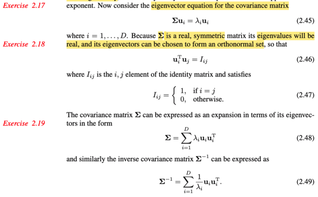</kbd>

> [!NOTE]
> Tiếp theo, nhờ MIT 1806 cũng như kiến thức về đại số tuyến tính mà gs Bishop cung cấp ở
> Appendix C, ko có gì khó hiểu ở đoạn này. Là như vầy:
>
> Như đã biết, nếu gọi ui và λi, i = 1,....D là các eigenvector và eigenvalue tương ứng của Σ, thì vì
> định nghĩa của eigenvector/value, ta có Σui = λiui.
>
> Nhưng với Σ, là matrix số thực, và đối xứng thì ta cũng biết rằng nó có tính chất đặc biệt hơn đó là
> mọi eigenvalue sẽ đều là số thực, và tồn tại, có thể chọn một bộ eigenvector orthogonal, và bộ
> vector này đương nhiên là độc lập nhau, nhưng hơn thế nữa, nó còn đủ số lượng (theo cách nói
> của gs Strang trong MIT 1806: matrix đối xứng A shape nxn, luôn có đủ n eigenvector độc lập, và
> điều này có nghĩa là chúng sẽ đủ sức tạo một basis của R^n) để tạo một basis của R^D, hay, nói
> cách khác: span được toàn bộ R^D. Và cũng nên tự hiểu là chúng được normalize để có unit norm
> (length = 1), để vừa orthogonal + unit norm = orthonormal. Tóm lại, với Σ, các eigenvector ui của
> chúng có tính chất:
>
> Unit norm ⇨ ||ui|| = 1, cũng là ||ui||^2 = 1 ⇔ uiTui = 1.
>
> Orthogonal: uiTuj = 0, i ≠ j → đây chính là 2.46
>
> Và như trong MIT18.06 đã học, ta gom ui thành các cột của matrix U thì U là một orthogonal
> matrix: UTU = UUT = I ⇨ UT = Uinv.
>
> Thế thì công thức 2.48 là sao?
>
> Là vầy: Bản chất là từ các equation Σu1 = λ1u1, Σu2 = λ2u2, ...ΣuD = λDuD.
>
> Thì nếu ta gom các u1,...uD thành các cột của matrix U nói trên, và λ1u1, λ2u2,...là các cột của
> matrix V khi đó, dựa vào góc nhìn thứ 3 khi nhân hai matrix AB: cột j của AB = linear combination
> các cột của A bởi bộ hệ số là cột j của B, thì ta sẽ thấy ngay rằng hệ các phương trình trên có thể
> được thể hiện compact bởi: AU = V.
>
> Và tương tự, cũng dựa vào góc nhìn đó, ta sẽ thấy cột j của V, tức λj uj chính là linear combination
> các cột u1,..uD với bộ hệ số là 0,0...1,..0 với số 1 nằm ở vị trí thứ j, Để từ đó có thể thấy V = U
> diag(λ1,..λD), đặt diag(λ1,..λD) = Λ, ta có:
>
> Vậy AU = UΛ, đây chính là identity của phân rã eigenvalue (eigenvalue decomposition).
>
> Rồi, vì UT = Uinv, nên nhân bên phải hai vế cho UT, ta có A = U Λ UT.
>
> Tiếp, với phân tích cái vế phải, theo góc nhìn là nhân hai matrix: (U Λ) với UT theo góc nhìn thứ 4:
> tổng các rank 1 matrix. Theo góc nhìn đó, giả sử ta có AB, thì có thể xem nó là tổng các rank 1
> matrix tạo bởi [cột j của A] outer product [hàng j của B], j = 1,2,...
>
> Nên A = Σj=1:D [cột j của UΛ] outer product [hàng j của UT]
>
> Mà cột j của UΛ chính là λjuj. và hàng j của UT thì cũng là [cột j của U lật ngang lại], tức [cột j của
> U]T, hay ujT. Vậy A = Σj=1:D λjujujT, → 2.48.
>
> (giải thích dài dòng để hiểu bản chất)
>
> Hoàn toàn tương tự với Σinv: Ta dùng kiến thức, nếu u,λ là eigenvector/value của A thì u, 1/λ chính
> là eigenvector/value của Ainv. Nên eigenvalue và vector của Σinv chính là u1, 1/λi, i=1,2...D.
>
> Nên áp dụng lập luận tương tự, ta sẽ thấy Ainv = Σj=1:D ujujT/λj

 

<kbd>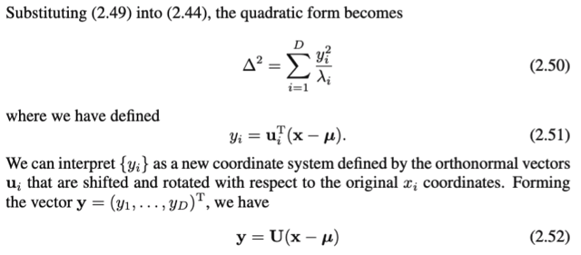</kbd>

<kbd>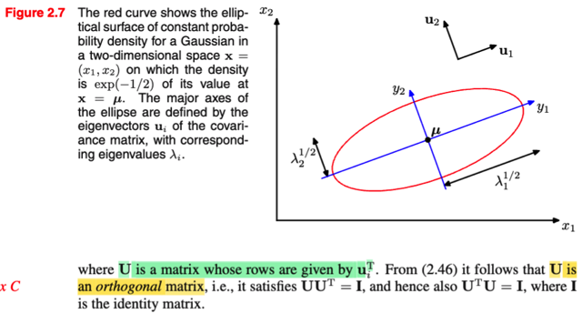</kbd>

> [!NOTE]
> Thay Σinv = Σj=1:D ujujT/λj vào (**x** - **μ**)T Σinv (**x** - **μ**) ta có:
>
> = (**x** - **μ**)T [Σj ujujT/λj] (**x** - **μ**)
>
> = Σj [(**x** - **μ**)TujujT(**x** - **μ**)/λj] | đưa (**x** - **μ**)T và (**x** - **μ**) vào
> trong tổng.
>
> Đặt yj = (**x** - **μ**)Tuj (cũng là ujT(**x** - **μ**) vì cái này là scalar), ta có:
>
> = Σj (yjTyj/λj) = Σj (yj^2/λj) → 2.51
>
> Thế thì với y1 = (**x** - **μ**)Tu1, y2 = (**x** - **μ**)Tu2,...mình có thể thấy: y1 =
> dot product của **x** - **μ** với u1, y2 là dot product của **x** - **μ** với y2,...thì
> với việc gs Bishop đặt U là matrix có các hàng là u1, u2,...để rồi UT là matrix
> có các cột là u1, u2... Thì ta sẽ thấy **y** = (y1, y2...)T chính là U(**x**-**μ**). ⇨
> \**y** = U(**x** - **μ**)
>
> Rồi, chỗ này dùng kiến thức về **change of basis** đã học trong MIT 1806: Ôn
> lại nhanh:
>
> Trong MIT 1806, bài linear transformation, đại khái là mình đã học rằng, một
> phép biến đổi T(.) được gọi là linear transformation là khi nó thỏa mãn: T(c**u**
> \+ d**v**) = cT(**u**) + dT(**v**) (c, d là scalar, u, v là vector) Và vì A(c**u** +
> d**v**) = cA**u** + dA**v**, nên quả thật việc nhân A với vector **x**, chính là
> một phép biến đổi tuyến tính. T(**x**) = A**x**.
>
> Thế thì sau đó gs mới nói về việc, giả sử có một linear transformation T(.), thì
> làm sao xác định matrix A đại diện cho nó? Tức là, giả sử ta có vector **x**
> trong input basis v's, và kết quả T(**x**) trong output basis u's, thì làm sao tìm
> A khiến T(**x**) = A**x**. Câu trả lời là lập luận như sau:
>
> Gọi **v1**,...**vn** là các basis của input space. Thì tọa độ của **x** đang được
> thể hiện theo (linear combination của) basis này, có nghĩa là, **x** = x1**v1** +
> x2**v2** + ...xn**vn** = Σi xi**vi** (x1,x2...là các tọa độ của **x**)
>
> Thế thì, T(**x**), có tọa độ trong output basis T(**x**)1, T(**x**)2,...T(**x**)m:
>
> T(**x**) = Σj=1:m T(**x**)j * **uj**
>
> Và T(**x**) = A**x** = Σi=1:n xi **a**i
>
> ⇨ Σi=1:n xi **a**i = Σj=1:m T(**x**)j * **u**j
>
> vì T(.) là linear transformation, nên T(**x**) = T(Σi=1:n xi**v**i) = Σi=1:n xi
> T(**v**i).
>
> ⇔ Σi=1:n xi **a**i = Σj=1:m { [Σi=1:n xi T(**v**i)]j **u**j }
>
> Xét [Σi=1:n xi T(**v**i)]j có nghĩa là linear combine các T(**v**1), T(**v**2).. với
> hệ số x1,x2.., được một vector, rồi lấy phần tử thứ j của nó. Thì cái này cũng y
> như lấy phần tử thứ j của T(**v**1), T(**v**2),...rồi linearly combine với hệ số
> x1,x2...
>
> ⇨ [Σi=1:n xi T(**v**i)]j = Σi=1:n xi T(**v**i)j
>
> ...⇔ Σi=1:n xi **a**i = Σj=1:m { [Σi=1:n xi T(**v**i)j] **u**j }
>
> Tiếp, xét cụm [Σi=1:n xi T(**v**i)j] **u**j ở bên trong tổng j. ta có thể đưa uj vào
> trong tổng i, vì nó chỉ là thừa số chung:
>
> ⇨ [Σi=1:n xi T(**v**i)j] **u**j = Σi=1:n [xi T(**v**i)j **u**j]
>
> ...⇔ Σi=1:n xi **a**i = Σj=1:m { [Σi=1:n xi T(**v**i)j **u**j] }
>
> Tiếp, ta đang có dạng Tổng j của tổng i, có quyền swap hai dấu tổng:
>
> ...⇔ Σi=1:n xi **a**i = Σi=1:n { Σj=1:m [xi T(**v**i)j **u**j] }
>
> Đến đây xét cái tổng Σj=1:m [xi T(**v**i)j **u**j], có quyền đưa xi ra ngoài:
>
> ⇔ Σi=1:n xi **a**i = Σi=1:n xi { Σj=1:m [ T(**v**i)j **u**j] }
>
> Như vậy tới đây có thể suy ra:
>
> ⇨ **a**i = Σj=1:m T(**v**i) **u**j
>
> Và từ đó ta có quy tắc xây dựng matrix A đại diện cho phép biến đổi tuyến tính
> T(**x**) từ **x** trong input space basis **v**'s sang T(**x**) trong output space
> basis **u**'s:
>
> Biến đổi các basis **v**i's và thể hiện chúng trong tọa độ basis **u**'s. Khi đó
> tọa độ của T(**v**1),..T(**v**n) chính là là hệ số các cột của A.
>
> Từ đó ta xét phép biến đổi identity: Tức T(**x**) = **x**:
>
> Vì đã nói cột i của A là tọa độ của T(**v**i) trong basis u's, nên:
>
> T(**v**i) = linear combination các **u**1,...**u**m bởi các hệ số là cột i của A,
> đặt U là matrix các cột **u**1,..**u**m thì ta có T(**v**i) = U [cột i của A]
>
> Xét phép biến đổi identity: T(**v**i) = **v**i. Ta có:
>
> \**v**i = U[cột i của A], i = 1,..n
>
> Gom **v**1, **v**2...**v**n thành các cột của V, thì **v**i = U[cột i của A], i = 1,..
> n chính là V = UA
>
> Và nhân hai vế cho Uinv: UinvV = A, đây chính là công thức của "change of
> basis" / matrix chuyển cơ sở từ cơ sở v's sang cơ sở u's: A = UinvV.
>
> Xét một case đặc biệt, khi input basis là standard basis: **v**1, **v**2,... =
> \**e**1, **e**2,...Hay cũng là V = I. Ta sẽ có:
>
> A = Uinv I = Uinv. Từ đây giúp kết luận, khi có **x là vector có tọa độ trong
> standard basis**, thì A**x** = Uinv **x**, chính là động tác tính ra tọa độ của nó
> trong basis **u**'s.
>
> Rồi, quay lại công thức y = U(**x**-**μ**):
>
> Đầu tiên chú ý là trong phần ôn lại ở trên, mình nói U là vector tạo bởi các
> \**cột** là các basis u's.
>
> Còn trong bài này, U ở đây được gs Bishop định nghĩa là là **matrix có các
> các hàng là các orthogonal eigenvector ui**. Như vậy **UT là orthogonal
> matrix**, **có các cột là orthogonal eigenvector ui.** Và với orthogonal matrix Q
> thì QT = Qinv, nên (UT)T = UTinv ⇔ U = (UT)inv
>
> ⇨ y = U(**x**-**μ**) = (UT)inv(**x**-**μ**)
>
> Và phần ôn lại ở trên giúp ta hiểu rõ bản chất của cái này chính là:
>
> \**CHUYỂN TỌA ĐỘ CỦA** **x (SAU KHI SHIFT BỞI μ) TỪ CƠ SỞ CHUẨN
> (BASIS e's) SANG HỆ TỌA ĐỘ CƠ SỞ LÀ CÁC CỘT CỦA UT, CHÍNH LÀ ui =
> CÁC EIGENVECTOR CỦA Σ!**
>
> Hơn nữa, với UT là orthogonal matrix,  (để rồi U = (UT)inv) thì UTU = UT
> (UT)inv = I, điều này cho thấy U cũng là orthogonal matrix. Và ta biết với
> orthogonal matrix, thì phép biến đổi bởi nó thực chất là phép xoay trục.
>
> Như vậy có 2 ý quan trọng cần hiểu rút ra từ phân tích trên:
>
> i) y = U(**x**-**μ**) = (UT)inv(**x**-**μ**) có bản chất là: **chuyển tọa độ của
> (x-μ) từ basis e's sang basis tạo bởi các cột của UT, chính là các vector ui, là
> eigenvector của Σ**.
>
> ii) Và UT là orthogonal matrix thì U cũng vậy, nên đây cũng là **phép xoay hệ
> trục tọa độ**.
>
> Gom lại hai ý này, ta sẽ hình dung **bản chất chỉ là tính lại tọa độ của x-μ bằng
> cách xoay trục tọa độ thẳng góc với các eigenvector của Σ.**

 

<kbd>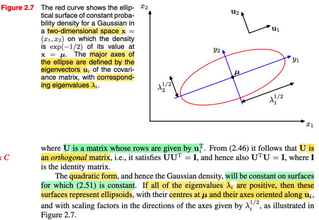</kbd>

> [!NOTE]
> Nhờ việc phân tích ở note trước, ta có thể hiểu đoạn sau: Đại ý là như
> trước đây đã nói, pdf của multivariate Gaussian sẽ phụ thuộc **x chỉ
> thông qua cái cụm quadratic form (x-μ)T Σinv (x-μ), nên dĩ nhiên tập
> hợp các điểm x trong input space sao cho cụm này bằng constant, thì
> tương ứng sẽ chính là những điểm có cùng mật độ xác suất pdf.**
>
> Thế thì xét một tập hợp như vậy: (**x**-**μ**)T Σinv (**x**-**μ**) =
> constant c, thì như vừa nói sẽ tương ứng với một level set (tập các
> điểm của f(**x**|**μ**, **Σ**), hay N(**x**|**μ**, **Σ**)), câu hỏi đặt ra là
> nó có hình dạng thế nào.
>
> Thế thì như note trước, (**x**-**μ**)T Σinv (**x**-**μ**) = constant c
>
> ⇔ Σj (yj^2/λj) = c
>
> Ta sẽ xét trong case 2 chiều, tức D=2, **x** là vector (x1,x2)T, nó sẽ là:
>
> y1^2 / λ1 + y2^2 / λ2 = c
>
> Còn nhớ cấp hai đã học, phương trình của đường ellips trong mặt
> phải xOy là x^2/a^2 + y^2/b^2 = 1. (a, b gọi là độ dài bán trục lớn và
> nhỏ). Thì chia hai vế cho c, (1) ⇔ y1^2 / cλ1 + y2^2 / cλ2 = 1.
>
> Cho thấy **level set này chính là một hình elipse**.
>
> y là tọa độ của x-μ trong hệ trục tọa độ eigenvector u1, u2.
>
> Vậy ọa độ của tâm ellipse, là 0,0 trong hệ trục này, chính là ứng với
> điểm nào trong hệ tọa độ gốc (basis e's)?
>
> Dùng công thức chuỷển ngược lại thôi: Nãy ta dùng (UT)inv để
> chuyển từ basis e's về basis eigenvector u's thì ((UT)inv)inv = UT sẽ
> chuyển ngược lại: đương nhiên UT**0** (ý là U tranpose nhân vector
> zero **O**) cũng bằng **0**, Nhưng sau đó ta sẽ phải shift lại: + **μ**: 0
> \+ **μ** = **μ** Vậy, tâm của ellipse chính là tại **x** = **μ** trong hệ tọa
> độ ban đầu.
>
> Còn trục của ellipse? Như đã nói, chính là hai vector u1, u2.
>
> Tóm lại, đường đồng mức của Gaussian (level set, nơi có giá trị hàm
> pdf bằng nhau) trong case 2D, sẽ chính là một đường elipse có trục
> trùng với phương của các eigenvector của Σ, và tâm thì nằm tại **μ**
>
> Khái quát lên n-D, nó là ellipsoid trong không gian n chiều, cũng có
> tâm tại μ và trục trùng với eigenvector.
>
> Trong hình 2.7, gs vẽ level set với của pdf với level ứng với exp(-1/2)
> (chú ý, tự hiểu là giá trị pdf là [hằng số gì đó (normalizing constant)]
> exp(-1/2), chứ ko phải pdf = exp(-1/2) nhé)
>
> Ta có exp {-[y1^2 / λ1 + y2^2 / λ2]} = exp(-1/2)
>
> (chú ý, đầu giờ chỉ nói đến cái cụm quadratic form nhưng khi bỏ vào
> exp() của hàm pdf của Normal thì trước cái cụm quadratic form phải
> có dấu trừ)
>
> ⇔ -{y1^2 / λ1 + y2^2 / λ2} = -1/2
>
> ⇔ y1^2 / (λ1/2) + y2^2 / (λ2/2) = 1
>
> và ông vẽ cái đường màu đỏ chính là hình ellipse với a = λ1/2, b =
> λ2/2

 

