# Appendix C - Matrices

📊 **Progress:** `19` Notes | `20` Screenshots

---

<kbd>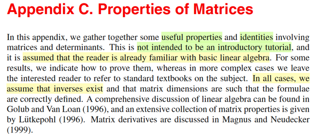</kbd>

> [!NOTE]
> Rồi phần này thì đại khái là mình sẽ ôn lại một số cái tính chất của ma trận. Thì
> đại khái là giáo sư nói rằng mình không có nói chi tiết, không phải là một cái
> giáo trình về toán ma trận. Cho nên nó ông sẽ giả sử rằng người đọc đã có
> những cái kiến thức nền tảng về đại số tuyến tính. Một số kết quả thì ông sẽ
> chứng minh, nhưng một số trường hợp mà phức tạp thì ông sẽ không chứng
> minh. Và luôn luôn mình sẽ giả định rằng là nghịch đảo của ma trận tồn tại,
> cũng như là cái kích thước ma trận được thiết kế một cách phù hợp.

 

<kbd>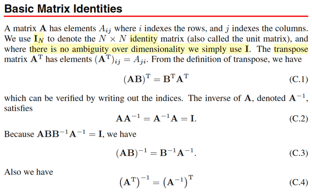</kbd>

> [!NOTE]
> Bắt đầu với vài công thức quen thuộc trong MIT 1806 đã học, ko có gì khó
>
> (AB)T = BT AT
>
> AAinv = Ainv A = I
>
> AAinv = I ⇔ ABBinvB = I ⇨ (AB)inv = BinvAinv
>
> Vì I = IT ⇨ I = (AAinv)T = AinvTAT ⇨ (AT)inv = (Ainv)T

 

<kbd>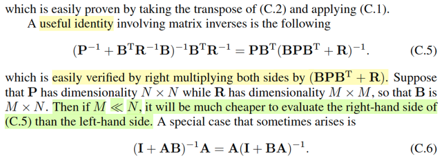</kbd>

> [!NOTE]
> Tiếp theo là một identity mà mình lần đầu được học:
>
> (Pinv + BT Rinv B)invBTRinv = PBT(BPBT + R)inv
>
> Ông nói chứng minh rất dễ vì chỉ cần nhân hai vế cho BPBT + R, cứ tạm tin
> vậy. Cái ý quan trọng là gs nói giả sử P có shape NxN, R có shape MxM, thì
> B sẽ là MxN. Khi đó, nếu M << N thì tính bên phải sẽ rẻ hơn tính bằng cái vế
> bên trái. Là sao nhỉ?
>
> Thử lập luận:
>
> Nếu P shape NxN thì Pinv cũng vậy, và xét cục (Pinv BT RinvB), là cái cục
> cần inverse (để nhân tiếp với BTRinv), thì nó sẽ cũng có shape NxN.
>
> Trong khi đó, cái cục cần inverse ở vế phải là BPBT + R, chỉ có shape MxM.
>
> Mà như đã nói thì M << N. Đồng thời, ta biết chi phí của inverse matrix A có
> shape DxD sẽ là O(D^3). Như vậy, rõ ràng là tính bằng vế phải sẽ ít tốn kém
> hơn.
>
> Khúc dưới có nói về một dạng đặc biệt của identity này.

 

<kbd>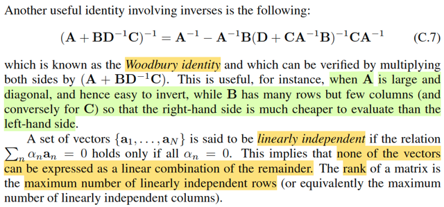</kbd>

> [!NOTE]
> Tiếp theo là một identity gọi là Woodbury identity. Nói chung là biết vậy
> thôi, còn chứng minh thì cũng dễ. Chỉ là biết các công thức này để khi nào
> cần tính một phép toán các matrix thì ta có thể lôi nó ra và thay vì tính cái
> bên trái thì ta sẽ tính cái bên phải giúp tiết kiệm chi phí tính toán hơn, vậy
> thôi. Chứ bản thân các identity này cũng ko cần phải mổ xẻ phân tích làm
> gì.
>
> Ví dụ như ở đây, khi nào A là matrix diagonal lớn, và B có nhiều hàng, ít
> cột, thì khi đó tính cái bên phải sẽ rẻ hơn.
>
> Cuối cùng gs nhắc đến khái niệm độc lập tuyến tính cũng như rank matrix,
> cái này thì nhờ MIT18.06 mình đã quá biết rồi.
>
> Độc lập tuyến tính thì dễ. Theo cái định nghĩa hiểu nôm na là cứ một cái
> vector, ví dụ như một cái bộ vector mà không có vector nào có thể được
> tạo ra bởi mấy thằng khác thì nó là một bộ vector độc lập tuyến tính. Còn
> định nghĩa chính thức thì một cái bộ vector mà cái tổ hợp tuyến tính duy
> nhất của chúng để tạo ra vector zero thì chỉ có thể là một cái tổ hợp tuyến
> tính với bộ hệ số là tất cả đều bằng 0. Tổ hợp tuyến tính thì có nghĩa là
> gì? Tổ hợp tuyến tính là một cái tổng thôi. Tổng tất cả các vector và mỗi
> vector được nhân với một cái hệ số, một cái trọng số, một cái hệ số. Như
> vậy thì với những cái bộ hệ số khác nhau thì mình sẽ có những cái tổ hợp
> tuyến tính khác nhau. Vậy thì nếu như mà một cái bộ vector mà mình
> muốn tạo ra vector zero chỉ có một cách là dùng các cái hệ số bằng 0 để
> tổ hợp tụi nó thì đó là một cái bộ độc lập tuyến tính. Thì đó là định nghĩa
> chính thức của độc lập tuyến tính nhưng mà hiểu một cách nôm na thì
> độc lập tuyến tính thì có nghĩa là một cái bộ vector mà không có cái vector
> nào trong đó được tạo ra bởi cách kết hợp những cái vector còn lại.

 

<kbd>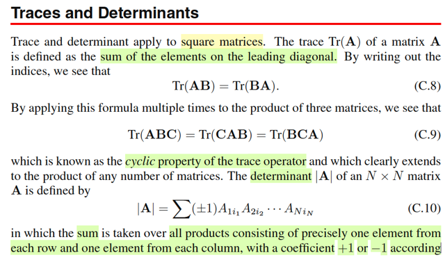</kbd>

> [!NOTE]
> Rồi phần này nói về trace và determinant. Hai cái này thì trong 1806 MIT cũng
> đã học rất kỹ. Trace thì về cơ bản là nói về tổng tất cả các cái phần tử trên
> đường chéo của một cái ma trận. Đương nhiên trace và determinant chỉ nói về
> một cái ma trận vuông thôi.
>
> Thế thì vì nó là tổng tất cả các đường chéo, cho nên giả sử mình xét một cái
> ma trận A nhân B thì tổng tất cả đường chéo nó cũng là bằng với tổng tất cả
> các đường chéo của ma trận B nhân A. Do đó trace AB bằng trace BA. Tiếp, vì
> dùng cái tính chất này, nếu mình xét một cái tích của ba ma trận ABC thì mình
> sẽ dễ dàng thấy rằng mình sẽ có cái dạng là trace ABC bằng trace của CAB
> bằng trace của BCA. Và cái này nó gọi là cái tính chất cyclic. Tính chất gọi là
> xoay vòng vị trí.
>
> Còn tiếp theo là nói về định thức. Thì giáo sư nhắc sơ về một cái công thức tính
> định thức là mình liên tưởng tới một cái bài trong MIT 1806 đã học. Đó là cái
> cofactor formula, công thức cofactor. Mà theo cái công thức đó, giả sử mình
> gặp một cái ma trận A mình muốn tính định thức thì mình sẽ làm như sau, mình
> sẽ chọn ra một hàng hoặc là một cột bất kỳ. Giả sử mình chọn cái hàng đầu
> tiên. Vậy thì mình sẽ làm như sau, mình sẽ lấy một cái phần tử. Lần lượt mình
> lấy một cái phần tử của cái hàng đó và mình mới nhân nó với định thức của cái
> ma trận nhỏ hơn. Mà cái ma trận đó được hình thành bằng cách là loại bỏ cái
> hàng và cái cột của mà chứa cái phần tử mình đang xét, giả sử mình đang xét
> cái phần tử A11. Vậy thì mình bỏ cái cột 1 và hàng 1 thì mình sẽ có một cái ma
> trận nhỏ hơn, mình sẽ tính định thức của ma trận đó. Rồi mình lấy cái định thức
> của ma trận đó mình nhân với A11. Đồng thời nhân 1 hoặc là -1 tùy vào việc là
> tổng của hai index của cái phần tử A11 là chẵn hay lẻ. Trong trường hợp này
> nó là số chẵn cho nên mình sẽ nhân với 1. Còn nếu là số lẻ thì mình sẽ nhân
> với -1. Như vậy có nghĩa là mình sẽ lấy A11, mình nhân với định thức của cái
> ma trận nhỏ hơn được tạo thành bằng cách loại bỏ hàng 1 cột 1. Xong, mình
> mới cộng tiếp cho cái phần tử A12 nhân với cái định thức của một cái ma trận
> nhỏ hơn bằng cách bỏ đi hàng 1 cột 2 và nhân với -1. Vì lần này ta có cái tổng
> hệ số của cái A12 là bằng 3 là số lẻ. Cứ thế cho đến hết các phần tử của cái
> hàng 1 của ma trận A. Thì đó mình sẽ có được là cái cách tính định thức của
> ma trận A theo cái cofactor formula. Thì nếu mình tiếp tục tính định thức của
> mấy cái ma trận nhỏ hơn theo cái kiểu đó thì mình sẽ ra được cái công thức
> C10 nói ở trong sách Bishop.

 

<kbd>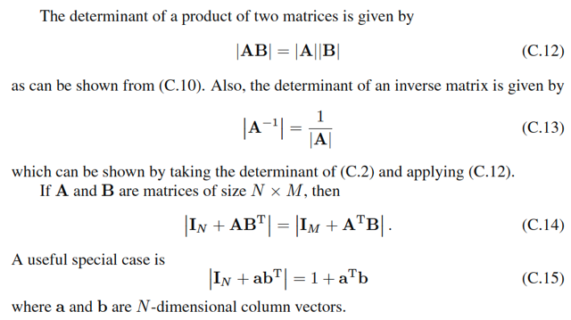</kbd>

> [!NOTE]
> Tiếp theo là một số cái tính chất của định thức.
>
> Đầu tiên là **định thức của một cái tích của hai ma trận sẽ bằng tích của
> định thức của từng ma trận**. Đây là một kiến thức đã học ở trong cái
> bài về tính chất của định thức ở trong MIT 1806.
>
> Công thức C.13 là định thức của ma trận nghịch đảo thì nó sẽ là bằng
> nghịch đảo của định thức của ma trận. Mình có thể dễ nhớ cái công
> thức này bằng cách là mình liên hệ rằng với ma trận A và ma trận A
> nghịch đảo thì **eigenvalue, giá trị riêng của chúng cũng nghịch đảo với
> nhau**.
>
> Và mình có thể dễ dàng chứng minh chuyện này. Là vì **định thức là
> tích các trị riêng eigenvalue**. Do đó nếu như mình có λ1, λ2, λN là các
> cái eigenvalue của ma trận A thì 1/λ1, 1/λ2,...1/λN là các cái trị riêng của
> A nghịch đảo. Do đó định thức của A nghịch đảo sẽ là tích của mấy
> thằng đó và sẽ là 1/λ1 \/1/λ2\/ ... 1/λN = 1/λ1\/λ2\/λN Như vậy nó chính là
> 1 chia cho định thức của ma trận A. Từ đó mình hiểu được cái công
> thức C.13.
>
> Còn cái công thức C.14 và C.15 thì về cơ bản đây là cái mà mình chưa
> thấy, chưa được học ở trong MIT 1806 nhưng mà về cơ bản nó chỉ là
> một cái **identity sẽ tỏ ra hữu ích trong cái trường hợp mà mình muốn
> tính toán một cái phép tính giữa các cái ma trận với chi phí rẻ hơn**.
>
> Về cơ bản cũng giống như mấy cái identity ở trên là **thay vì mình phải
> tính phía bên trái tốn nhiều chi phí thì mình có thể dùng cái phép tính ở
> bên phải để mình tính ra cùng một thứ**. Trong trường hợp này trong
> cái công thức C.14 mình có thể thấy là phía bên trái nó là một cái ma
> trận **N nhân N**. Bên phải thì chỉ là ma trận **M nhân M**. Do đó **nếu
> như M nhỏ hơn N rất nhiều** thì thay vì hoặc là gặp hoặc là đối mặt với
> một cái phép tính mình cần phải tính cái bên trái **mình có thể lôi cái
> phép tính tương đương ở bên phải ra và tính với chi phí rẻ hơn rất
> nhiều**. Và trong cái trường hợp mà cực đoan extreme khi mà cái ma
> trận có kích thước N nhân M với M nó trở thành bằng 1 thì lúc bấy giờ
> cái ma trận A nó trở thành ra là chỉ là một vector cột thôi. B nó chỉ thành
> ra là một cái row matrix thôi, tức là một cái vector hàng thôi. Và khi đó
> AB transpose chỉ là một cái ma trận rank 1. Vậy thì ở phía bên trái nó
> vẫn là một cái ma trận N nhân N nhưng mà **bên phải nó chỉ là một cái
> phép tính là số 1 cộng với một cái phép tích vô hướng thôi, rất là rẻ**.
>
> Vậy thì cái việc mà mình nhớ cái identity này là chỉ để dùng khi mà mình
> gặp những cái phép tính mà mình có thể dùng những cái identity này để
> tính một cách rẻ hơn.

 

<kbd>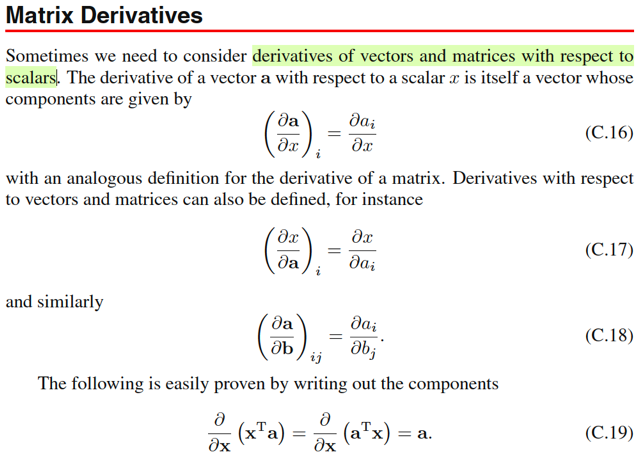</kbd>

> [!NOTE]
> Phần này nói về vài kiến thức cũng không có gì mới
>
> Ví dụ đạo hàm của vector **a** đối với scalar x. Nói vậy cần hiểu bối cảnh rằng
> a là vector phụ thuộc x, để khi x thay đổi một khoảng vi phân dx, thì vector sẽ
> thay đổi một khoảng vi phân **da** (là vector các khoảng vi phân dai, của các
> phần tử ai của vector **a**).
>
> Như vậy thì, khi x thay đổi dx, kéo theo a1 thay đổi da1, a2 thay đổi da2,...
> thì rate of change của (da1/dx, da2/dx,...) sẽ chính là vector derivative của **a**
> đối với x.
>
> Nhưng để mang tính khái quá, ta nên hiểu là a có thể còn phụ thuộc các
> input khác, nên người ta sẽ không dùng chữ d (d**a**/dx), mà dùng kí tự partial
> ∂**a**/∂x, để chỉ đây chỉ là đạo hàm riêng, của a đối với x, còn đạo hàm toàn
> phần sẽ phải là tổng các đạo hàm riêng của a đối với các input khác nữa, nếu
> có. Dĩ nhiên, nếu a chỉ phụ thuộc x, thì đó cũng chính là đạo hàm.
>
> Tương tự, a1, a2,...cũng có thể phụ thuộc các input khác, nên người ta sẽ dùng
> ∂ai/∂x, thay vì dai/dx
>
> Như vậy ∂**a**/∂x là vector (∂a1/∂x, ∂a2/∂x,...)T Hay (∂a/∂x)_i = ∂ai/∂x là vậy
>
> \-----
> Tiếp đạo hàm của x đối vector **a**, tương tự, cũng nên lập luận một cách bản 
> chất là, khi **a**, perturb (thay đổi nhỏ) một khoảng **da**, thì kéo theo x cũng perturb
> dx. Khi đó, các rate of change của khoảng thay đổi của x trên khoảng thay đổi
> của từng phần tử của vector **a**, chính là partial derivative: ∂x/∂ai. Và vector
> (∂x/∂a1,∂x/∂a2,...) gọi là gradient vector.
>
> Với matrix thì cũng vậy, giả sử có hàm matrix → scalar **A** → f(**A**) thì đạo
> hàm của f đối với **A** sẽ là matrix các partial derivative mà phần tử ij của nó
> (∂f/∂A)ij , chính là đạo hàm của f đối với phần tử ij của A: ∂f/∂Aij
>
> Còn trường hợp ta có vector → vector function **b** → **a**. Thì đạo hàm của
> **a** đối với **b**, sẽ là matrix mà hàng i sẽ là gradienet vector của ai đối với
> vector **b**: (∂a/∂b)ij = ∂ai/∂bj và matrix này gọi là Jacobian

 

<kbd>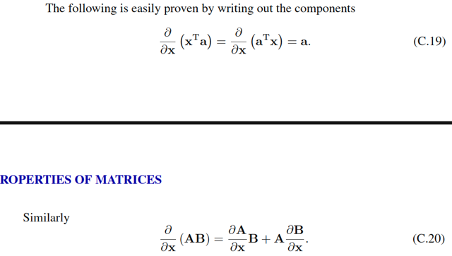</kbd>

> [!NOTE]
> Tiếp, ∂/∂**x** (**x**T**a**) = ∂/∂**x** (**a**T**x**) = a. Thử giải thích vì sao?
>
> Đây là derivative của hàm vector → scalar f(**x**) = **x**T**a**. Nhờ kiến thức ở
> lớp MIT 18s096 mình dễ dàng chứng minh cái này:
>
> df = f(**x**+**dx**) - f(x) = (**x**+**dx**)T**a** - **x**T**a** = **x**T**a** + d**x**T**a** - **x**T**a** = d**x**T**a**
>
> = **a**T**dx** (vì dxTa là scalar, nên transpose tùy ý)
>
> Lúc này ta đã có dạng df = f'(x)[dx], tức **a**T**dx** một linear operator act on
> **dx**. Vì f là scalar, nên df cũng là scalar, còn **x** là vector nên **dx** cũng là
> vector. Vậy thì linear operator act on vector **dx** để cho ra scalar df chỉ có thể là
> một phép dot product của vector nào đó với vector **dx**. Và vector đó chính là
> gradient. ⇨ ∇f = **a**
>
> Còn công thức C.20: ∂/∂**x** (**AB**) = ∂**A**/∂**x** **B** + **A** ∂**B**/∂**x** → chỉ là product rule

 

<kbd>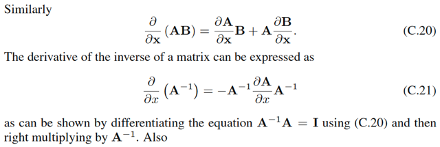</kbd>

> [!NOTE]
> Thử giải thích công thức C.21:
>
> Cái này hồi học MIT 18s096 đã làm rồi, để tìm derivative của f(x) = Ainv đối với
> x, ta sẽ tìm cách đưa df trở thành dạng một linear operator act on dx: f'(x)[dx].
>
> Ở đây mình hiểu Ainv, là hàm của x, để rồi khi x thay đổi một khoảng dx, thì f(x)
> = Ainv sẽ thay đổi một khoảng dAinv.
>
> Nhưng để cho dễ, ta coi Ainv là hàm của A trước: là function nhận vào matrix A,
> và trả ra inverse của nó. Và ta sẽ tìm dAinv = cái gì đó của dA, sau đó, dA = cái
> gì đó của dx, dùng chain rule, ta sẽ có dAinv = cái gì đó của dx.
>
> Thế thì AAinv = I, điều này có nghĩa là, function f(A) =AAinv là một constant
> function. nên dù cho A có perturb một khoảng dA, khiến Ainv perturb một khoảng
> dAinv, thì f vẫn bằng I. Do đó df = 0:
>
> df = d(AAinv) = 0.
>
> Áp dụng product rule với d(AAinv): d(AAinv) = dA Ainv + A d(Ainv)
>
> ⇨ dA Ainv + A d(Ainv) = 0
>
> ⇔ - dA Ainv = A d(Ainv)
>
> ⇔ - Ainv dA Ainv = d(Ainv)
>
> Đến đây ta đã có dAinv = some thing dA, tức là một lienar operator act on dA,
> nên đây cũng là cách viết vi phân của đạo hàm hàm f(A) = Ainv đối với A.
>
> Tiếp, thay dA = linear operator của dx: ∂A/∂x dx, ∂A/∂x là matrix các partial
> derivative: [∂A/∂x]ij = ∂Aij/∂x
>
> ⇨ d(Ainv) = - Ainv [(∂A/∂x) dx] Ainv, thì ta sẽ có d(Ainv) = linear operator act on
> dx, từ đây giúp rút ra đạo hàm của Ainv đối với x:
>
> Vì x là scalar, nên trong phép nhân [matrix Ainv] [matrix ∂A/∂x] [scalar dx] [matrix
> Ainv], ta có thể di chuyển dx tùy ý.:
>
> ⇨ d(Ainv) = -Ainv (∂A/∂x) Ainv dx
>
> Từ đó có thể kết luận, matrix partial derivative của Ainv đối với x chính là -Ainv
> (∂A/∂x) Ainv

 

<kbd>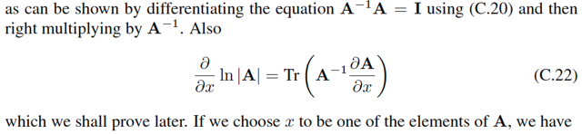</kbd>

> [!NOTE]
> Tiếp, thử làm lại công thức đạo hàm hàm log det A (hồi MIT 18s096 cũng đã xem qua):
>
> Để đơn giản bớt, ta xét đạo hàm của hàm f(A) = det(A) trước, rồi tí nữa dùng chain rule sẽ giúp
> tính đạo hàm hàm log det(A).
>
> Đầu tiên, mình nhớ, gs sẽ xét biểu thức det (λI + M):
>
> Còn nhớ trong MIT 1806, det matrix A = tích các eigenvalues. Vậy ở đây det (λI + M) = tích các
> eigenvalue của λI + M.
>
> Mà ta lại xét tính chất sau đây của eigenvalue: gọi α, u là eigenvalue và eigenvector của M, ta
> có: Mu = αu. Cộng hai vế cho λu:
>
> Mu + λu = αu + λu ⇔ (M + λI)u = (α + λ)u ⇨ Từ đó suy ra u cũng là eigenvector của M + λI với
> eigenvalue là α + λ.
>
> Như vậy eigenvalue của M + λI = [eigenvalue của M] + λ: eigen(M + λI) = eigen(M) + λ
>
> ⇨ det (λI + M) = tích các eigenvalue của λI + M = tích các [eigen(M) + λ]. Ta viết thế này:
>
> det (λI + M) = Πi=1:n (λi(M) + λ) với λi(M) là eigenvalue thứ i của M.
>
> Nếu nhân phân phối cái tích của n thừa số này ra, ta sẽ có:
>
> Để dễ hình dung, ví dụ (λ1 + λ)(λ2 + λ)(λ3 + λ)
>
> = λ1(λ2 + λ)(λ3 + λ) + λ(λ2 + λ)(λ3 + λ)
>
> = (λ1λ2 + λ1λ)(λ3 + λ) + (λλ2 + λ^2)(λ3 + λ)
>
> = λ1λ2(λ3 + λ) + λ1λ(λ3 + λ) + λλ2(λ3 + λ) + λ^2(λ3 + λ)
>
> = λ1λ2λ3 + λ1λ2λ + λ1λλ3 + λ1λ^2 + λλ2λ3 + λ^2λ2λ + λ^2λ3 +λ^3
>
> = λ^3 + λ^2(λ1 + λ2 + λ3) + λ(λ1λ2 + λ1λ3 + λ2λ3 + λ1λ2λ3
>
> λ^n
>
> + [λ^(n-1)](Σi λi(M))
>
> + [λ^(n-2)](Σ của các tích của các cặp λi(M)) ) → cái này là [λ^(n-2)] tr(M)
>
> + [λ^(n-3)](Σ của các tích của các bộ ba λi(M))
>
> ....
>
> + [λ^1](Σ của các tích của bộ n-1 cái λi(M))
>
> + [λ^0](một term có dạng tích của n cái λi(M)) → cái này chính là det M
>
> Thế thì, giả sử trị riêng của M rất nhỏ, thì ta có thể xấp xỉ bằng cách bỏ đi các hạng tử còn lại
> (những cái có dạng tổng của tích các trị riêng của M). Để chỉ còn: det (λI + M) = λ^n + λ^(n-1)
> trace(M)
>
> Rồi. Thế thì, xét f(A) = det A
>
> ⇨ df = det (A + dA) - det A = det(A + AAinv dA) - det A
>
> = det[A(I + Ainv dA)] - det A
>
> = det A det(I + Ainv dA) - det A (dùng tính chất det AB = det A det B)
>
> Tới đây, áp dụng kết quả trên với λ = 1, M = Ainv dA, với dA là matrix vi phân, Ainv dA cũng có
> giá trị nhỏ → trị riêng nhỏ, từ đó ta sẽ dùng công thức xấp xỉ det(I + Ainv dA) ≈ 1^n + 1^(n-1)
> trace(Ainv dA) = 1 + tr(Ainv dA)
>
> ⇨ det A det(I + Ainv dA) - det A = det A [1 + tr(Ainv dA)] - det A
>
> = det A + det A tr(Ainv dA) - det A
>
> = det A tr(Ainv dA)
>
> Giờ nói đến trace, như đã biết, trace(A) = tổng phần tử đường chéo matrix A. Nếu xét inner
> product của A và B: A . B =Σij AijBij, thì nó cũng chính là Σi [cột i của A dot product cột i của B] =
> tổng các phần tử đường chéo của matrix ATB = tr(ATB). Vậy A.B = tr(ATB) (A.B là inner
> product)
>
> ⇨ tr(AinvdA) = AinvT . dA
>
> ⇨ df = det(A) (AinvT . dA)
>
> Vì inner product là một linear operator, nên đến đây ta đã có dạng df = linear operator act on
> dA: linear oerator đó chính là: lấy dA, inner product với AinvT, và nhân cho scalar det A (hoặc là
> scalar Ainv bởi scalar det A, rồi lấy matrix đó, đem inner product với dA).
>
> Vậy, theo MIT 18s096, ta có thể kết luận đạo hàm của f(A) = det A đối với matrix A chính là
> det(A) AinvT
>
> Thế thì, giờ ta xét hàm g(A) = log f(A) = log det A. Dùng chain rule:
>
> dg = g'(f) df = [1/f(A)] df
>
> (thay df ở trên vô)
>
> = [1/det(A)] det(A) (AinvT . dA)
>
> = AinvT . dA
>
> Vậy ta có dg(A) = d(log[det(A)]) = AinvT . dA
>
> ⇨ **đạo hàm của log det A đối với A là AinvT** (A inverse transpose), **đây cũng chính là công thức C.28**
>
> Tiếp, ta lại xét A là hàm theo x: A(x) ⇨ dA = ∂A/∂x dx
>
> ⇨ d(log[det(A)]) = AinvT . ∂A/∂x dx
>
> Với kết quả này, nếu ta gọi f(x) = log[det(A(x))] (A là hàm matrix, nhận vào x, trả ra matrix A, rồi
> lấy det của A, và cuối cùng lấy log), thì cái ta đang có chính là df được thể hiện bởi linear
> operator act on dx, và linear operator đó chính là: Lấy inner product của matrix AinvT và matrix
> ∂A/∂x, sẽ ra một scalar, rồi nhân với dx. Do đó, đạo hàm của f(x) đối x chính là bằng scalar này:
> AinvT . ∂A/∂x,
>
> Và again, lại chuyển cách thể hiện nó về lại trace: tr(Ainv (∂A/∂x)).
>
> thì như phát biểu lần cuối: **đạo hàm của hàm log[det(A(x))] đối với x (kí hiệu là ∂/∂x [log det A],
> hay ∂/∂x ln |A|) chính là tr(Ainv (∂A/∂x)). Đây chính là công thức C.22**

 

<kbd>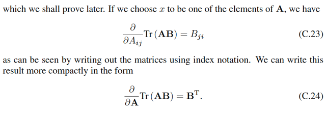</kbd>

> [!NOTE]
> Thử xem công thức C.23:
>
> Xét hàm f(A) = tr(AB)
>
> df = f(A + dA) - f(A) = tr((A+dA)B) - tr(AB)
>
> = tr(AB + (dA)B) - tr(AB)
>
> = tr(AB) + tr[(dA)B] - tr(AB) (trace có tính linearity)
>
> = tr[(dA)B]
>
> = tr(BdA) (tính chất cyclic của trace)
>
> Và như note trước đã làm, ta chuyển nó thành inner product của BT và dA:
> <B . dA>, hay ghi là BT . dA cũng được
>
> Như vậy tới đây ta đã có df(A) = linear operator act on dA: lấy dA inner
> product với matrix BT (B transpose). Vậy đạo hàm của f(A) = tr(AB) đối với
> matrix A chính là BT, viết theo toán học:
>
> ∂/∂A tr(AB) = BT -> đây là C.24 
>
> đương nhiên function f(A) = tr(AB) là matrix → scalar function, nên ∂f/∂A là
> matrix. Và BT cũng là matrix
>
> Nên ta có: [∂/∂A tr(AB)]ij = [BT]ij
>
> Mà phần tử ij của ∂/∂A tr(AB) như  đã nói lúc đầu, chính là ∂/∂Aij [tr(AB)].
> Nên ta có:
>
> ∂/∂Aij [tr(AB)] = [BT]ij
>
> Tới đây, ta mới bỏ tranpose của B đi: [BT]ij = Bji  (đổi index ij thành ji)
>
> Và ta có công thức ∂/∂Aij [tr(AB)] = Bji → chính là công thức C.23

 

<kbd>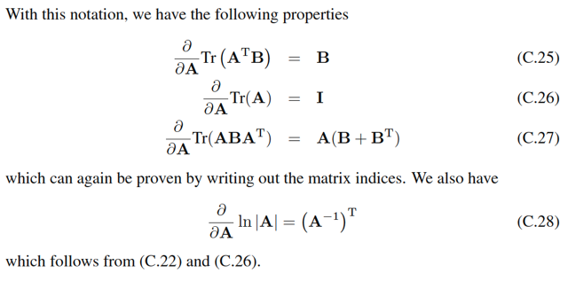</kbd>

> [!NOTE]
> Với cách chứng minh tương tự ta có thể chứng minh nhanh C.25:
>
> d[tr(ATB)] = tr(ATB + (dA)TB) - tr(ATB) = tr[(dA)TB]
>
> = tr(BTdA) (vì tr(M) = tr(MT))
>
> = B . dA (chuyển sang inner product)
>
> ⇨ và tại đây có thể kết luận ∂/∂A [tr(ATB)] = B
>
> Còn C.26 thì đơn giản, coi B = I thôi.
>
> Cuối cùng, C.27: Hoàn toàn tương tự:
>
> d[tr(ABAT)] = tr[(A+dA)B(A+dA)T] - tr(ABAT)
>
> = tr[(AB+dAB)(AT+(dA)T)] - tr(ABAT)
>
> = tr[(ABAT+(dA)BAT+AB(dA)T+(dA)B(dA)T] - tr(ABAT)
>
> = tr[(dA)BAT+AB(dA)T+(dA)B(dA)T]
>
> = tr[(dA)BAT+AB(dA)T]  (bỏ term bậc cao (dA)B(dA)T)
>
> = tr[(dA)BAT] + tr[AB(dA)T]
>
> = tr[(dA)BAT] + tr[(dA)(AB)T]
>
> = tr[(dA)BAT] + tr[(dA)(BTAT)]
>
> = (dA)T. (BAT) + (dA)T.(BTAT)
>
> = (dA)T . [BAT + BTAT]
>
> = (dA)T . (B + BT)AT
>
> inner product A.B cũng bằng AT . BT
>
> = dA . ((B + BT)AT)T
>
> = dA . A[(B+BT)T]
>
> = dA . A(BT+B)
>
> ⇨ đạo hàm của tr(ABAT) wrt A là A(BT+B)
>
> Còn C.28 thì nãy mình cũng đã chứng minh rồi

 

<kbd>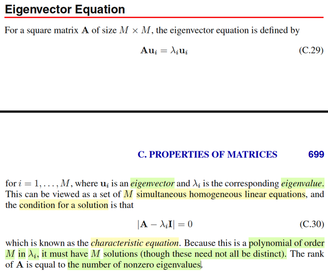</kbd>

> [!NOTE]
> Đây là cơ hội để ôn lại chút xíu những kiến thức trong MIT 18.06:
>
> Như đã biết, nếu λ và u thỏa Au = λu thì λ và u sẽ là trị riêng, vector riêng của
> A. Và ta nhớ việc tìm trị riêng của A sẽ bắt đầu bằng cách giải characteristic
> equation: det (A - λI) = 0.
>
> Và về bản chất, ta lập luận như sau: Nếu λ, và u là trị riêng vector riêng của A
> thì Au = λu ⇔ Au - λu = 0 ⇔ (A - λI)u = 0. Và dĩ nhiên ta chỉ xét u là vector khác
> 0. Như vậy, (A - λI)u = 0 thể hiện rằng u chính là nullspace vector của A - λI. Và
> điều này đồng nghĩa là matrix này không full-rank / singular và cũng chính là sẽ
> tồn tại eigenvalue = 0 ⇨ det (A - λI) = 0. Do đó đây là điều kiện để giải tìm λ.
>
> Còn vì sao lại gọi det (A - λI) là đa thức bậc M của λi?
>
> → À thì là vì det, như đã biết, là tích các eigenvalue, nên det(A - λI) = tích các
> eigenvalue của (A - λI).
>
> Mà trong các note lúc nãy, mình cũng đã chứng minh lại là:
>
> λi(A - λI) = λi(A) - λ
>
> (λi(.) là hàm lấy ra eigenvalue thứ i của matrix).
>
> Nên det (A - λI) = Πi=1:M [λi(A) - λ]
>
> và triển khai cái tích này ra, ta sẽ có một hàm đa thức bậc M của các
> eigenvalue của A.
>
> Cuối cùng, mình cũng đã biết rank matrix chính là số eigenvalue khác 0. Vì
> sao? Vì một eigenvalue bằng 0 sẽ ứng với một eigenvector (khác 0) bị biến
> thành 0 bởi matrix A: Au = 0, cũng chính là một nullspace vector. Nên nếu có k
> eigenvalue = 0, thì ta sẽ có k vector khác 0, tạo thành k basis của nullspace thì
> rank = n - k cũng chính là số eigenvector khác 0 còn lại.
>
> * LƯU Ý TỬ THẦN: Mệnh đề "Rank = Số eigenvalue khác 0" CHỈ luôn luôn
> đúng với Ma trận có thể chéo hóa (Diagonalizable Matrices), đặc biệt là Ma trận
> Đối xứng (Symmetric Matrices) - thứ xuất hiện nhan nhản trong ML.
>
> * Đối với ma trận bất kỳ, nếu nó bị "khuyết" (Defective), số lượng eigenvector
> sinh ra từ λ=0 sẽ bị hụt so với số lượng nghiệm đại số của λ=0, dẫn đến công
> thức tính Rank qua số nghiệm λ≠0 bị sai!

 

<kbd>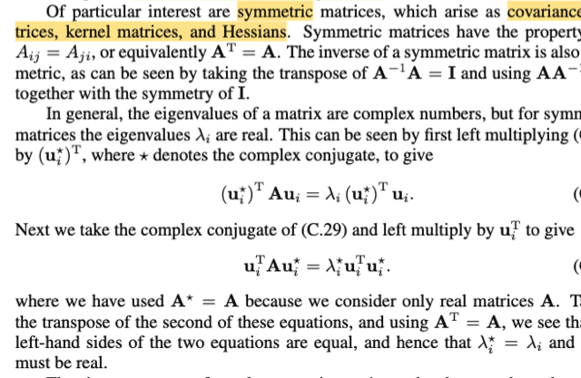</kbd>

> [!NOTE]
> Tiếp theo, tác giả nói về việc ta sẽ quan tâm chủ yếu tới matrix đối xứng vì rất
> nhiều matrix xuất hiện trong machine learning là matrix đối xứng.
>
> Thế thì đầu tiên nếu A đối xứng thì Ainv cũng đối xứng. Cái này dễ chứng minh:
>
> AAinv = I ⇔ (AAinv)T = IT ⇔ AinvTAT = I ⇔ AinvT A = AinvA (thì IT = I, AT=A, và
> AinvA = I) → AinvT = Ainv ⇨ Ainv đối xứng.
>
> Sau đó, gs chứng minh nhanh lại một tính chất đó là, với matrix đối xứng thì
> eigenvalue sẽ là số thực. Cũng không khó hiểu nhờ đã học qua MIT 18.06
>
> Gọi λ, u là eigenvalue và eigenvector của A: Au = λu
>
> Có lẽ nên recall lại chút kiến thức conjugate: Đại khái là một số phức sẽ có
> dạng a + ib với a là phần thực, b là phần ảo (imaginary). Thì khi đó số phức liên
> hợp của nó sẽ là a - ib. Để rồi nhân chúng với nhau ta sẽ có (a +ib)(a - ib) = a^2
> \-aib + aib - i^2 b^2 = a^2 - b^2, và kết quả là số thực, không còn là số phức
> nữa.
>
> Như vậy nếu u là vector phức, và gọi u* là vector complex conjugate của nó, tức
> là mọi phần tử của u* đều là complex conjugate của u. Khi tích vô hướng của
> chúng, ta sẽ có uTu* = Σi ui*u*i và đây sẽ là một tổng các số thực, nên là số
> thực.
>
> Thế thì Au = λu, nhân bên trái hai vế với u*T: u*TAu = u*Tλu ⇔ u*TAu = λ u*Tu
> (1)
>
> Tiếp, với Au = λu thì (Au)* = (λu)* (vì Au là vector, λu cũng là vector, mà hai
> thằng này bằng nhau thì complex conjugate của chúng đương nhiên bằng nhau.
>
> Tiếp, với complex number thì nó có tính chất: (x+y)* = x* + y*, và (xy)* = x* y*
>
> Nên (Au)* = (λu)* ⇔ A*u* = λ*u*.
>
> Nhân hai vế với uT: A*u* = λ*u* ⇔ uTA*u* = uT λ*u*
>
> ⇔ uTA*u* = λ* uT u*
>
> ⇔ uTAu* = λ* uT u* (2) (Vì với matrix A, ta sẽ luôn dùng matrix số thực, nên A* =
> A)
>
> Tới đây (1) ta có u*TAu = λ u*Tu và (2) ta có uTAu* = λ* uT u*
>
> Vế trái u*TAu và uTAu* là giống nhau, vì là scalar nên bằng tranpose của chính
> nó.
>
> Suy ra vế phải bằng nhau λ u*Tu = λ* uT u* ⇨ λ = λ*. Và khi một số bằng số
> phức liên hợp của nó thì thì nó chính là số thực.
>
> \----
>
> Ngoài ra thì như mình còn nhớ trong MIT 1806 đã học với matrix đối xứng thì ta
> luôn có đủ n eigenvector độc lập, để có thể tách thành Q Λ QT, với Q là các
> orthogonal eigenvector, Λ là diagonal matrix các eigenvalue.

 

<kbd>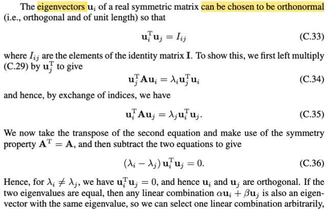</kbd>

> [!NOTE]
> Tiếp theo chính là gs nhắc lại cái điều mình vừa nói ở note trước: Luôn
> có thể chọn / tồn tại một bộ eigenvector orthogonal. Chứng minh nhanh:
>
> Gọi λi, λj (λi khác λj) và ui, uj là eigenvalue / eigenvector của A: A ui = λi
> ui, A uj = λj uj
>
> A ui = λi ui ⇔ ujT A ui = ujT λi ui (nhân hai vế cho ujT (uj tranpose)
>
> ⇔ ujT A ui = λi ujT ui
>
> ⇔ (ujT A ui)T = λi ujT ui (do vế trái là scalar, với scalar a thì a = aT)
>
> ⇔ uiT AT uj = λi ujT ui
>
> ⇔ uiT A uj = λi ujT ui (do A đối xứng nên A = AT)
>
> Tiếp từ A uj = λj uj ⇔ uiT A uj = uiT λj uj
>
> ⇔ uiT A uj = λj uiT uj
>
> Trừ vế theo vế (1) và (2): 0 = λi ujT ui - λj uiT uj ⇔ 0 = λi ujT ui - λj ujT ui
> (do uiTuj = ujTui, cũng là do chúng là scalar)
>
> ⇔ 0 = (λi - λj) uiTuj.
>
> Tới đây vì λi khác λj nên suy ra uiTuj = 0 ⇨ chúng orthogonal (vuông
> góc). Và vì ui uj tùy ý, nên mọi có thể kết luận là tồn tại bộ eigenvector
> vuông góc nhau.
>
> Cuối cùng, một tính chất cũng dễ hiểu là nếu ui uj là eigenvector tương
> ứng với cùng một eigenvalue thì mọi linear combination của chúng cũng
> là eigenvector: dễ thấy thôi:
>
> Scalar hai vế của A ui = λ ui, A uj = λ uj với α, và β bất kì rồi cộng vế
> theo vế ta có:
>
> A α ui + A β uj = α λ ui + β λ uj
>
> ⇔ A (α ui + β uj) = λ (α ui + β uj)
>
> kết quả này suy ra α ui + β uj cũng là eigenvector với cùng eigenvalue λ

 

<kbd>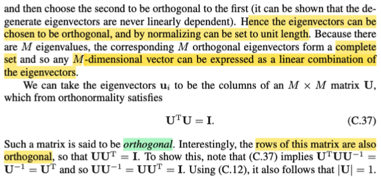</kbd>

> [!NOTE]
> Như đã biết từ Mục 18.06, khi có một tập hợp vector trực giao (tức là các
> vector vuông góc với nhau) và chúng được chuẩn hóa sao cho mỗi vector
> có chiều dài bằng 1, ta sẽ có một tập hợp vector trực chuẩn
> (orthonormal). Tuy nhiên, cần lưu ý một điểm quan trọng đã được nhắc
> đến trong lớp học. Giáo sư Gilbert Strang luôn nhấn mạnh rằng nếu các
> vector đó được sắp xếp thành các cột của một ma trận, ma trận đó không
> thể được gọi là ma trận trực giao (orthogonal matrix) trừ khi ta có đủ một
> bộ N vector trực giao. Điều này có nghĩa là ma trận đó phải là ma trận
> vuông. Nếu ma trận chỉ có một tập hợp các cột trực chuẩn hoặc trực giao
> nhưng không đủ số lượng để tạo thành ma trận vuông (tức là số cột ít
> hơn số hàng), thì nó vẫn chưa được gọi là một ma trận trực giao.
>
> Một tập hợp các vector vuông góc với nhau được gọi là tập hợp vector
> trực giao (orthogonal set of vector). Nếu được chuẩn hóa, nó được gọi là
> tập hợp vector trực chuẩn (orthonormal set of vector). Tuy nhiên, khi các
> vector này được đưa vào làm cột của một ma trận, để ma trận đó được
> gọi là ma trận trực giao, số cột phải đủ, nghĩa là ma trận phải có kích
> thước vuông. Một điểm khác là nếu có M giá trị riêng (eigenvalue) và các
> vector riêng tương ứng với chúng trực giao, trong bối cảnh xét một ma
> trận M x M, điều này ngụ ý rằng ta đã có đủ một cơ sở (basis) cho không
> gian R^M. Nghĩa là, tập hợp các vector đó tạo thành một bộ cơ sở. Do đó,
> tập hợp này sẽ trải rộng toàn bộ không gian R^M. Mọi vector trong không
> gian R^M, hay nói cách khác, mọi vector M chiều, đều có thể được biểu
> diễn dưới dạng tổ hợp tuyến tính của cơ sở này.
>
> Ngoài ra một ý nữa đó là, với matrix orthogonal matrix U thì các rows của
> chúng cũng orthogonal, chứng minh cũng dễ:
>
> UTU = I ⇨ UT = Uinv. ⇨ UUT = UUinv = I. Vậy U UT = I ⇨ các row
> orthogonal nhau.
>
> Cuối cùng, vì UTU = UUT = I ⇨ det (UT U) = det(I) = 1 ⇔ det(UT) det(U) =
> 1 ⇔ [det(U)]^2 = 1 (vì det(U) = det(UT)) ⇨ det(U) = +/- 1.

 

<kbd>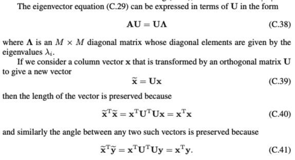</kbd>

> [!NOTE]
> Rồi, tiếp, C.38 là sao?
>
> Gọi u1,..un là các eigenvector của A ứng với eigenvalue λ1, λ2,...thì
> ta
>
> có: Aui = λi ui, i=1,2...n
>
> Thế thì bằng cách nhớ lại góc nhìn nhân matrix với matrix thứ 3
> trong
>
> MIT 1806, ta nhớ AB sẽ có bản chất là: cột i của AB là linear
>
> combination các cột của A bởi bộ hệ số là cột i của B. Như vậy bằng
>
> cách đặt U là matrix có các cột u1,...un, thì và B là matrix có các cột
> là
>
> λ1u1,...λnun. Ta sẽ thấy AU = B chính là cách thể hiện compact của
> n
>
> equation trên. Và B thì có thể tách thành Λ U với Λ là diagonal matrix
>
> diag(λ1, λ2,...). Khi đó ta sẽ có AU = UΛ. Và vì U này là orthogonal
>
> matrix (dĩ nhiên là full rank) nên A = UΛ Uinv = U Λ UT, hay trong
> MIT
>
> 1806 gs Strang dùng Q: A = Q Λ QT.
>
> \-----
>
> Ý tiếp theo là nói về vụ transform bởi orthogonal matrix thì giữ
> nguyên
>
> length và angle. nói cách khác nó là phép xoay.
>
> Chứng minh dễ ẹt: Ta xét bình phương của norm Ux, ||Ux||^2 = =
> (Ux)T(Ux) = xTUTUx = xTIx = xTx = ||x||^2. Vậy suy ra ||Ux|| = ||x||.
>
> Xét cosine góc của Ux và Uy kí hiệu cos(Ux, Uy).
>
> Ta biết công thức uTv = ||u|| ||v|| cos(u,v) ⇨ cos(u,v) = uTv / (||u||
> ||v||)
>
> ⇨ cos(Ux, Uy) = (Ux)T(Uy) / ||Ux|| ||Uy||
>
> = xTUTUy / ||x|| ||y|| (dùng kết quả trên: ||Ux|| = ||x||, ||Uy|| = y)
>
> = xTy / ||x|| ||y|| = cos(x, y)
>
> Vậy qua phép biến đổi U, giữ nguyên góc (x,y)

 

<kbd>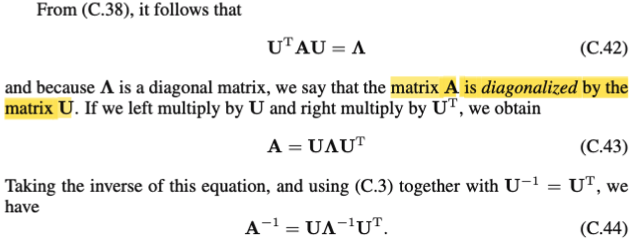</kbd>

<kbd>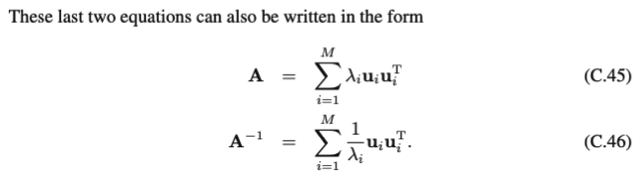</kbd>

> [!NOTE]
> Rồi, như note trước ta đã biết A = U Λ UT, và cũng là U Λ Uinv. Nhân hai vế
> cho UT và U: UT A U = Λ. thì cái biểu thức này được gọi là matrix A bị chéo
> hóa (diagonalized) bởi matrix U.
>
> Rồi từ A = U Λ UT, inverse hai vế ta có Ainv = U Λinv UT (cái này dùng các
> identity như (AB)inv = Binv Ainv là ra, ko có gì khó)
>
> Còn cái C.45 / 46?
>
> Để hiểu thì chỉ cần góc nhìn nhân matrix với matrix trong MIT 1806 đã học:
>
> A = U Λ UT
>
> U Λ là gì? Theo góc nhìn thứ hai nhân hai matrix, thì cột j của U Λ chính là
> linear combination các cột của U với hệ số là cột j của Λ. Vì Λ là diagonal,
> nên cột j chỉ có phần tử thứ j là khác 0, chính là λj. Nên cột j của U Λ = λj x
> cột j của U = λj uj
>
> Sau đó nhân U Λ với UT: Ta sẽ nhìn theo góc nhìn thứ 4: Tổng j=1:n các
> rank 1 matrix tạo bởi outer product của một cột j của (U Λ) (chính là λj uj) và
> hàng j của UT (chính là ujT). Do đó U Λ UT = Σj=1:n λj ujujT.
>
> Tương tự vậy với C.46. Chỉ chú ý là Λinv, sẽ có các component đường chéo
> = nghịch đảo của component đường chéo của Λ. Vì sao?
>
> Là vì Λ Λinv = Λinv Λ = I. Gọi α1, α2,.. là diagonal entries của Λinv thì
>
> Λ Λinv = Λinv Λ = I ⇔ λi αi = 1, i =1,2... ⇨ αi = 1 / λi

 

<kbd>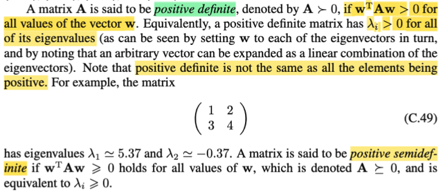</kbd>

> [!NOTE]
> Cuối cùng, một ma trận đối xứng được gọi là ma trận xác định dương (positive
> definite) nếu dạng toàn phương của nó luôn dương với mọi vector khác không
> và chỉ bằng không khi vector W bằng không. Trong lớp MIT 18.06, chúng ta đã
> biết rằng một tính chất của ma trận xác định dương là tất cả các giá trị riêng
> của nó đều dương.
>
> Ngược lại, nếu dạng toàn phương chỉ lớn hơn hoặc bằng không với mọi vector
> W (nghĩa là vẫn tồn tại vector W khác không làm cho dạng toàn phương bằng
> không), thì ma trận đó được gọi là ma trận xác định bán dương (positive
> semi-definite). Trong trường hợp này, các giá trị riêng có thể bằng không.

 

