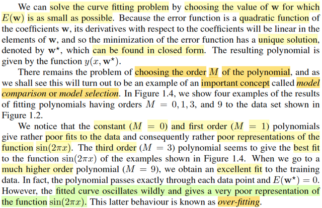
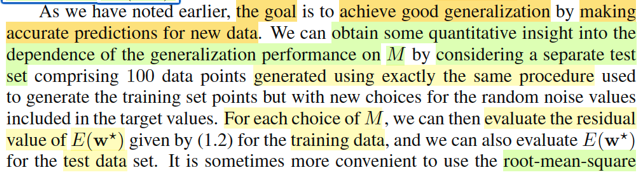
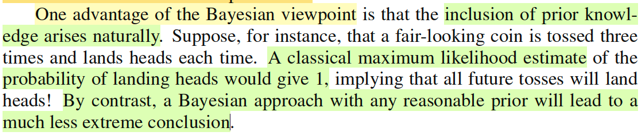

# Bishop PRML Ch.1 — 7 Khoảnh Khắc Hiểu Ra Khi Học

Đây không phải bản tóm tắt textbook.

Đây là 7 đoạn được chọn từ hơn 60 notes tôi viết khi học Bishop Chapter 1 theo kiểu Feynman — đọc từng phần, dừng lại, chụp source, rồi giải thích lại bằng lời của mình cho đến khi thực sự hiểu. Một số đoạn là derivation sạch. Một số là tôi đang bị confuse và tự gỡ ra live. Tôi chia sẻ cả hai loại vì thường thì loại sau mới hữu ích hơn.

---

## 1. Least Squares thật ra là phép chiếu hình học

Đây là đoạn làm tôi thấy MIT 18.06 không hề nằm ngoài ML — nó đang nằm ngay trong Bishop Ch.1.

<kbd></kbd>

Sau khi derive closed-form solution w\* = (H^TH)^{-1}H^Tt, tôi có thể dừng lại và ghi "xong" — nhưng tôi nhìn vào cái tích H(HTH)^{-1}HTt và tự hỏi: cái này là gì? Rồi nhớ ra.

**Trích từ note gốc:**

> Thế thì H(HTH)inv HT**t** chính là gì? Nhớ lại, derive lại matrix chiếu lên C(A): Chiếu b lên C(A): được p ∈ C(A), residual: e = b - p sẽ vuông góc C(A) → e ∈ N(AT) ⇨ ATe = 0 ⇨ AT(b - Ax^) = 0 ⇔ ATb = ATAx^ ⇔ x^ = (ATA)inv ATb ⇨ p = Ax^ = A(ATA)invATb ⇨ matrix P chiếu b lên C(A) chính là P = A(ATA)invAT. Vậy H(HTH)inv HT**t** chính là chiếu **t** lên C(H).

<kbd></kbd>

Lúc đó tôi mới thấy: bài toán curve fitting với least squares, sau khi đẩy hết toán ra, thực chất là *tìm điểm trong không gian đầu ra mà model có thể tạo ra (C(H)) gần nhất với vector target **t** quan sát được.* Cái "optimal weights" chỉ là hệ số của phép chiếu đó. Bài toán không phải bài toán đại số — nó là bài toán hình học trong R^N.

**→ Note đầy đủ:** [1.1 Example: Polynomial Curve Fitting](11_example_polynomial_curve_fitting.md#node-15)

---

## 2. Overfitting không phải model "cố gắng quá" — mà là quá nhiều tự do

<kbd></kbd>

Khi M=9, training error = 0 nhưng test error vọt lên. Giải thích thường thấy là "model học cả noise". Đúng, nhưng chưa đủ. Tôi cố tìm cách nhìn sâu hơn: vì sao có *vô số* cách đi qua các điểm data, và vì sao điều đó lại là vấn đề?

**Trích từ note gốc:**

> Lúc này ta có thể hình dung cây nứa đã trở thành: cuộn dây, có thể map hoàn hảo các cây đinh dữ liệu nhưng, nó "thích map kiểu nào thì map", có VÔ VÀN CÁCH để đi qua hết cây đinh, và do đó, nó có XÁC SUẤT RẤT THẤP để đi theo đường cong mà ta muốn nó đi: đường sin(2πx).

<kbd></kbd>

Metaphor "cuộn dây" là của tôi: khi model đủ flexible, nó có thể đi qua mọi điểm data theo vô số cách. Xác suất nó tình cờ chọn đúng cái path sin(2πx) là cực kỳ nhỏ. Đây không phải lỗi của model — nó đã làm đúng nhiệm vụ (minimize training error). Vấn đề là nhiệm vụ đó không phải nhiệm vụ ta thật sự muốn.

**→ Note đầy đủ:** [1.1 Example: Polynomial Curve Fitting](11_example_polynomial_curve_fitting.md#node-18)

---

## 3. Regularization = Ridge Regression = MAP — cùng một bài toán

Lúc đầu regularization nhìn giống một mẹo thực hành để chống overfit. Rồi khi tôi derive MAP estimate ở section 1.2.5, term λ||**w**||² lại xuất hiện — không phải bị đặt vào từ ngoài, mà rơi ra tự nhiên từ log Gaussian prior.

<kbd></kbd>

**Trích từ note gốc:**

> minimize_**w** { Σi [ti−y(xi,**w**)]² + (α/β)**w**T**w** }
>
> Và lúc này, nó hiện hình ra đây CHÍNH LÀ BÀI TOÁN MINIMIZE SUM SQUARED ERROR FUNCTION CÓ REGULARIZER mà trong phần 1 mình đã làm: thêm regularizer vào total error để giúp giảm overfit, với regularizer hyperparam là λ = α/β.
>
> Từ đó giúp mình hiểu được rằng: Khi ta giải bài toán curve fitting bằng cách minimize error function dùng sum squared error có regularizer là quadratic function của param thì thật ra ta đang giải bài toán maximizing posterior distribution với prior được chọn là Normal.

Hyperparameter λ chính xác là tỉ số α/β — precision của prior chia precision của noise. Ridge regression là cách nói frequentist/practical của cùng một cấu trúc Bayesian. Cái "trick" ở section 1.1 hóa ra là principled reasoning được ngụy trang.

**→ Note đầy đủ:** [1.2.5 Curve fitting re-visited](125_curve_fitting_re_visited.md#node-89)

---

## 4. Tung đồng xu 3 lần — MLE vs Bayes

Ví dụ này Bishop viết rất ngắn. Tôi làm lại từ đầu hoàn toàn, không nhảy qua bước nào.

<kbd></kbd>

**Trích từ note gốc:**

> Và với observed value x1 = x2 = x3 = 1 ⇨ dự đoán (ml estimate) cho θ = (1+1+1)/3 = 1. Như vậy đồng nghĩa, với việc, dựa trên 3 lần tung ra Head, thì MLE dự đoán tham số mô hình là 1, có nghĩa là nó dự đoán lần tung tiếp theo cũng sẽ ra 1.
>
> [Với prior Beta(1,1):] Kết quả ta có: mean của β(Σixi+a, n−Σixi+b) = (3+1)/(3+1+3−3+1) = 0.8.
>
> Nói thêm tí xíu, việc chọn prior là β(a=100, b=100)... thì nó sẽ phản ánh niềm tin ban đầu rằng, θ = 0.5 một cách mãnh liệt hơn. Cụ thể là khi ta tính mean của β(Σixi+a, n−Σixi+b) với a = b = 100 thì nó sẽ là: (3+100) / (3+100+3−3+100) = 0.507.

MLE với 3 head → θ̂ = 1: tuyên bố chắc chắn tuyệt đối từ 3 điểm. Bayes với Beta(1,1) → 0.8: vẫn bị kéo về phía dữ liệu nhưng không cực đoan. Bayes với Beta(100,100) → 0.507: prior tin rất mạnh đồng xu là fair, và 3 lần head không đủ để thay đổi niềm tin đó. Đây là lúc tôi hiểu "prior mạnh" không phải là prior "đúng" hay "sai" — nó là prior mà bạn cần rất nhiều dữ liệu mới override được.

**→ Note đầy đủ:** [1.2.3 Bayesian probabilities](123_bayesian_probabilities.md#node-66)

---

## 5. Bayesian curve fitting: phát sinh thêm một loại uncertainty mà MLE không có

<kbd></kbd>

Sau khi derive predictive distribution trong full Bayesian treatment, tôi dừng lại ở công thức variance và cố tách từng term ra xem nó là gì. Một term thì quen. Một term thì mới hoàn toàn.

**Trích từ note gốc:**

> Cái chính muốn nói, là, cái cấu phần thứ hai là kết quả đến từ việc ta tiếp cận theo Bayesian, để rồi coi **w** như random variable **W** nên kiểu như điều này khiến PHÁT SINH THÊM MỘT YẾU TỐ UNCERTAINTY NỮA (yếu tố uncertainty do coi w là random variable), và cái cấu phần thứ hai trong variance của Ti phản ánh điều này, quả thật, nó là một term liên quan đến covariance variance của posterior distribution của **W**.
>
> Var(Ti) = Φ(x)^T (βX^TX + αI)^{-1} Φ(x) + 1/β

Term 1/β là noise — nó tồn tại kể cả khi ta biết **w** chính xác. Term Φ(x)^T S Φ(x) là uncertainty về chính **w** của mình, được truyền qua model vào dự đoán. MLE chỉ cho ta loại thứ nhất. Full Bayesian cho ta cả hai. Term thứ hai *thu nhỏ lại* khi có thêm data vì posterior về **w** tự hẹp lại. Đây là lúc cụm từ "uncertainty trong tham số" không còn là trừu tượng nữa với tôi.

**→ Note đầy đủ:** [1.2.6 Bayesian curve fitting](126_bayesian_curve_fitting.md#node-92)

---

## 6. Quy tắc phân loại tối ưu — tôi muốn tự derive nó, không chỉ đọc

Bishop phát biểu optimal decision rule gần như là hiển nhiên. Tôi không muốn chấp nhận như vậy — tôi muốn formulate nó thành bài toán tối ưu và xem quy tắc đó rơi ra từ đâu.

<kbd></kbd>

**Trích từ note gốc:**

> Vậy bài toán tối ưu sẽ được thể hiện như sau:
>
> minimize_{R1,R2} { ∫R2 f(C1,**x**)d**x** + ∫R1 f(C2,**x**)d**x** }
>
> ... Để làm được điều này, về trực giác, ta sẽ chọn các **x** khiến cái cụm này âm... Vậy optimal decision rule là: Assign class C1 nếu f(C2,**x**) < f(C1,**x**) và ngược lại. Từ đó ta hiểu: cách phân loại tốt nhất chính là dựa trên posterior probability.

<kbd></kbd>

Biến quyết định là các decision regions R1, R2. Minimize misclassification probability là viết nó thành integral trên các "wrong regions". Giải ra, ta thấy: với mỗi điểm **x**, R1 nên chứa nó khi và chỉ khi f(C2,**x**) < f(C1,**x**). Quy tắc "gán class có posterior cao hơn" không phải heuristic — đó là nghiệm của bài toán tối ưu. Cái kết nối ngược lại về Bayesian inference đóng vòng lại rất gọn.

**→ Note đầy đủ:** [1.5 Decision Theory](15_decision_theory.md#node-114)

---

## 7. Entropy từ hai góc nhìn, hội tụ về cùng một công thức

Hôm trước tôi vừa được học entropy theo góc nhìn vật lý thống kê. Hôm sau đọc Bishop, ông derive nó từ information theory. Tôi dừng lại để tự kiểm tra xem hai con đường đó có thực sự ra cùng một công thức không.

<kbd></kbd>

**Trích từ note gốc:**

> Nhớ lại chút xíu bài học hôm qua. Mình được học định nghĩa của entropy theo góc nhìn thông tin... Khi đó, entropy được định nghĩa là trung bình (kì vọng) của hàm thông tin này: Entropy = −Σ{xi} log(f(xi))f(xi)...
>
> Xong gs mới nói qua cách định nghĩa Entropy trong vật lí: Nó là đại lượng mô tả sự hỗn loạn... H = lim_{N→∞} −Σi (ni/N) ln(ni/N). Và đặt pi = lim_{N→∞} ni/N... ta có lại công thức định nghĩa entropy theo cách thứ nhất.

<kbd></kbd>

Con đường thứ nhất: entropy là số bits trung bình cần để truyền một random variable, derive từ tính additive của thông tin và logarithm. Con đường thứ hai: entropy là log số microstates tương thích với một macrostate, derive từ Stirling approximation ở N → ∞. Cả hai ra −Σ p_i log p_i. Tôi cũng tự verify luôn tại sao uniform distribution maximize entropy: khi mỗi outcome có xác suất như nhau thì lượng thông tin của mỗi outcome cũng như nhau, và trung bình là tối đa. Khi probability tập trung vào một outcome, cái đó gần như không có thông tin, còn các outcome hiếm thì gần như không có trọng số — hai phía triệt nhau và entropy về 0.

**→ Note đầy đủ:** [1.6 Information Theory](16_information_theory.md#node-142)

---

## Closing note

Chapter 1 của Bishop có 13 sections. Tôi mất khoảng 2–3 tuần cho nó, với hơn 60 notes, khoảng 80 screenshots, và nhiều chỗ phải derive lại từ đầu thay vì tin vào kết quả trong sách.

7 đoạn này không phải "7 điểm quan trọng nhất của Chapter 1." Chúng là 7 khoảnh khắc mà tôi thực sự dừng lại và thấy: *cái này kết nối với cái kia* — với Strang, với Casella, với Boyd, với Stat110. Bishop Ch.1 thật ra không dạy thứ gì hoàn toàn mới. Nó cho thấy mọi thứ đã học trước đó đều đang nói về cùng một ý tưởng ở những ngôn ngữ khác nhau.

Đó là điểm đáng giá nhất.
