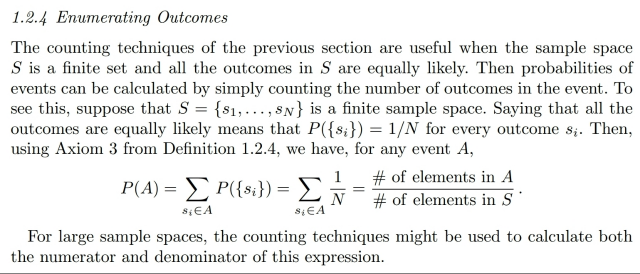
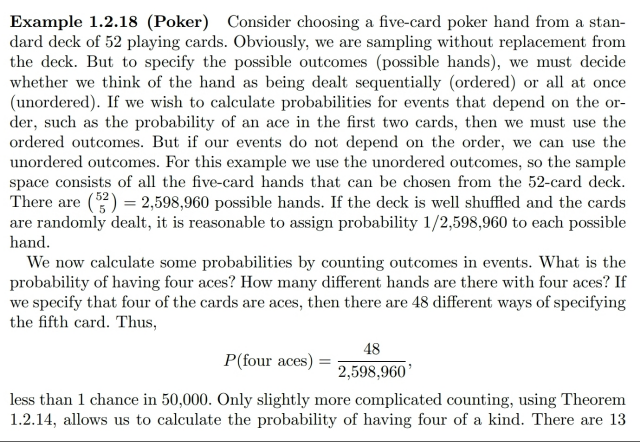
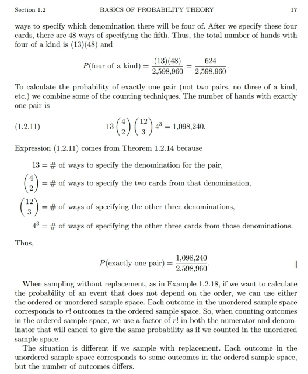
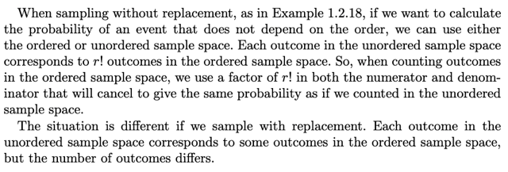
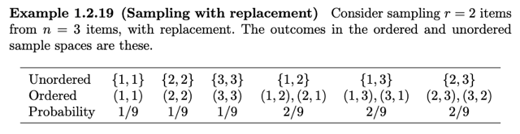
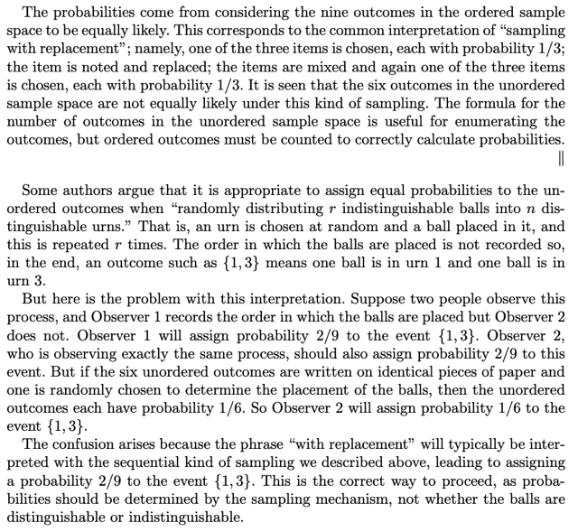
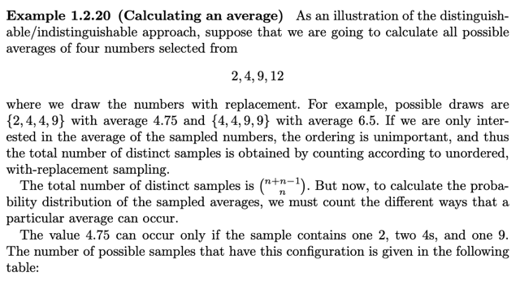
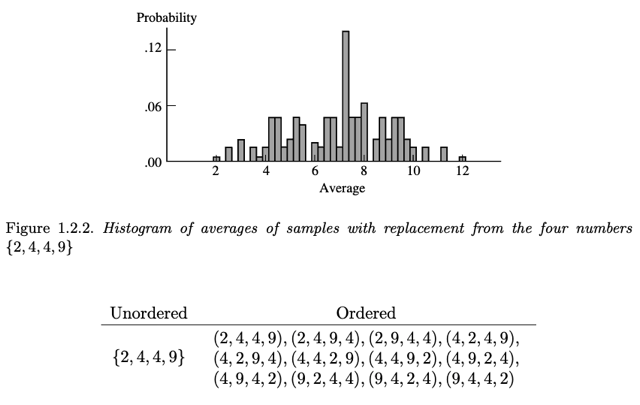
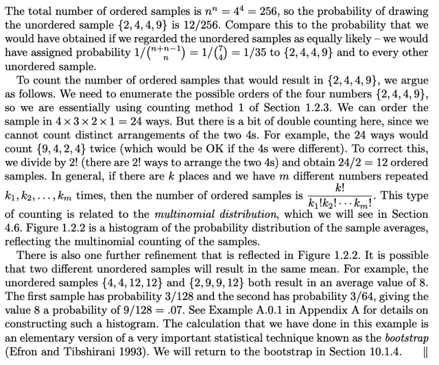

# 1.2.4 Enumerating Outcome

📊 **Progress:** `5` Notes | `9` Screenshots

---

<kbd></kbd>

> [!NOTE]
> Đại khái là sau **khi biết cách đếm số possible outcomes** trong **sample
> space** hoặc **event**, thì **nếu** mà các possible outcome này có **khả năng
> xảy ra là như nhau** (equally likely) thì**việc tính xác suất của một event rất
> đơn giản**.
>
> Cụ thể là vầy, giả sử ta có **S = {s1, s2, ...sn}**. Thế thì, theo **ĐỊNH NGHĨA
> CỦA PROBABILITY FUNCTION** mà phần trước ta đã học (cái mà ta nghe
> họ nói rằng để định nghĩa **một function** xác suất sao cho nó **thỏa mãn các
> Axiom**) trong đó **define xác suất của một event A chứa các possible
> outcome si, ...** như sau:
>
> **P(A) = ∑ {si**∈**A} pi** (dịch ra là **tổng xác suất của các possible
> outcome** **chứa** trong subset/event A.
>
> Thế thì theo đó P(S) dĩ nhiên sẽ bằng:
>
> **P(S) = ∑ {si**∈**S} pi.**
>
> Mà theo **Axiom 2, P(S) = 1**, nên:
>
> **∑ {si**∈**S} pi = 1**
>
> Thế thì **nếu** như các possible outcome**equally likely** thì dĩ nhiên ta sẽ có
> **p1 = p2 =...pn = 1/n**
>
> Tức là **P({si}) = 1/n với mọi i**.
>
> Từ đó ta có ta tính P(A), cũng theo định nghĩa trên:
>
> P(A) = **∑ {si**∈**A} P({si})**
>
> = **∑ {si**∈**A} 1/n**
>
> Và như vậy để tính xác suất event A, ta chỉ cần **ĐẾM số possible outcome
> chứa trong subset A** và nhân cho **1 / sample space size**

 

<kbd></kbd>

> [!NOTE]
> Xét ví dụ với bộ bài, cụ thể là **rút 5 lá**. Tính **xác suất** của việc **kết quả ra 5
> lá với 4 con xì (Ace)**.
>
> Thế thì đại ý là, khi mà **đối diện** với một bài toán tính xác xuất của event, như
> vậy ta sẽ cần **xác định thêm** là người ta **có phân biệt thứ tự hay không**. Ví
> dụ c**ó cần phân biệt bộ (34567) khác với bộ (43567)** hay không.
>
> Vì **nếu** **có phân biệt** thì **số possible outcome trong sample space sẽ
> khác**, mà **không phân biệt** thì**số possible outcome cũng sẽ khác**. Rồi
> cách **sampling có hoàn lại hay không** cũng sẽ **ảnh hưởng đến kết quả**.
>
> Thì ở đây **theo lẽ thông thường** khi hỏi xác suất của việc rút được 5 lá có 4
> con ách thì ta **sẽ hiểu là** **không quan tâm thứ tự**, miễn là bộ có 4 con ách là
> đc. Thêm nữa **việc rút bài cũng thường được hiểu** là **rút ra thì lấy ra luôn**
> chứ không bỏ vào lại.
>
> Thế thì, như vậy đầu tiên cần xem thử **sample space của một thử nghiệm như
> vậy có bao nhiêu possible outcome**, hay có bao nhiêu kết quả có thể xảy ra khi
> lấy 5 lá từ 52 lá, hay, có bao nhiêu set 5 lá có thể tạo từ 52 lá. Đây là công thức
> quen thuộc **(52 choose 5)**.
>
> (có thể nói vậy vì ta đã rào trước ở trên rằng thử nghiệm này không quan tâm
> thứ tự và sampling không hoàn lại)
>
> Thế thì, **lẽ thông thường**, nếu **bộ bài được bình thường**, thì việc rút được
> bộ nào trong (52 choose 5) bộ **đều có khả năng xảy ra như nhau**(equally
> likely). Do đó x**ác xuất xảy ra của mỗi possible outcome** đều bằng 1/n =
> **1/(52 choose 5)**
>
> Tiếp theo ta mới xét event **A = (5 lá có 4 lá Ace)**, để rồi áp dụng định nghĩa về
> hàm xác suất:
>
> P(A) = ∑ {si ∈ A} P({si})
>
> Theo định nghĩa này, giúp ta hiểu **việc ta cần làm** sẽ là **xem trong event A có
> những possible outcome nào** (có bao nhiêu cái)
>
> (Có thể thấy tới đây ta hiểu sâu hơn tại sao P(A) = "event size" / "sample space
> size")
>
> Do đó ta sẽ đếm các possible outcome có trong A, hay có bao nhiêu bộ 5 lá mà
> có chứa 4 lá Ace: Để đếm cái này, ta sẽ thực hiện theo hai bước: Bước 1 **chọn
> 4 lá ách**: Rõ ràng **chỉ có một cách chọn**, vì bộ bài chỉ có 4 lá ách. Bước 2
> **chọn 1 lá thứ 5**: Có **52-4=48 cách chọn**(again, chỗ này cũng bị chi phối bởi việc có hoàn lại hay không).
>
> Và vì hai bước **tuân theo step rule** tức **kết quả của bước trước không ảnh
> hưởng đến số lựa chọn của bước sau** nên ta sẽ có **1*48=48 cách chọn**.
> Hay, có 48 possible outcome trong event/subset A, và mỗi cái đều có xác suất
> 1/(52 choose 5)
>
> Từ đó P(A) = ∑ {si ∈ A} P({si})
>
> = ∑ {si ∈ A} 1/(52 choose 5)
>
> = 1/(52 choose 5) * 48
>
> = **48/(52 choose 5)**

 

<kbd></kbd>

> [!NOTE]
> Tương tự ta có thể **tính xác xuất của event B**: **5 lá trong đó
> có 4 lá cùng loại**. Ta cũng chỉ việc**xem B chứa mấy
> possible outcome** bằng cách đếm theo hai bước:
>
> Bước 1: **chọn loại (số nút) của bộ 4 lá** cùng loại: có **13** cách
> chọn. Bước 2: **chọn 4 lá cùng loại đó**: Có **1** **cách** chọn. Bước
> 3: **chọn lá thứ 5**: Có (52-4=**48**) **cách** chọn.
>
> Vậy, có **13*48** possible outcome trong event B:
>
> P(B) = ∑ {si ∈ B} P({si}) = 1/(52 choose 5) * (13*48) 
>
> = 1**3*48/(52 choose 5)**
>
> ====
>
> Hoặc **event C**: Bộ 5 lá trong đó **có đúng một cặp** (ko dc bộ
> 3, và ko dc có nhiều hơn một cặp): Đếm số possible
> outcome trong C: Bước 1 chọn loại của cặp: 13. Bước 2
> chọn hai lá của cặp: (4 choose 2). Bước 3 chọn loại của 3 lá
> còn lại (phải khác nhau để ko làm thành cặp nào khác và
> khác loại của hai lá trong cặp): (13 choose 3) Bước 4 chọn
> lá thứ 3 (loại gì thì đã chọn ở bước 3): (4 choose 1) Bước 5
> chọn lá thứ 4: (4 choose 1). Bước 6 chọn lá thứ 5: (4 choose
> 1)
>
> Kết quả là có:
>
> 13*(4 c 2)*(13 c 3)*(4 c 1)^3
>
> Nên P(C) = ∑ {si ∈ C} P({si})
>
> = 13*(4 c 2)*(13 c 3)*(4 c 1)^3 / (52 choose 5)

 

<kbd></kbd>

 

<kbd></kbd>

 

<kbd></kbd>

> [!NOTE]
> Đại khái là có người cho rằng (1,3) cũng equally likely. Với lập luận là kiểu
> như thả 2 trái banh vào 3 cái hộp. Lần đầu nó vào hộp 1. Lần sau nó vào
> hộp 3.Tức là được cặp (1,3)
>
> Và do đó (1,1) (1,2) (1,3) (2,3)..đều equally likely
>
> Bài này người ta random sampling without replacement: có n=3 items, lấy
> r=2 items.
>
> Có care thứ tự thì ta sẽ có các outcome: (1,1) (2,2) (3,3) (1,2) (2,1) (1,3)
> (3,1) (2, 3) (3,2)
>
> Còn không care thứ tự thì sẽ có các outcome: (1,1) (2,2) (3,3) (1,2) (1,3)
> (2,3)
>
> Thế thì, nếu không care thứ tự thì sẽ sai, khi cho rắng (1,2) cũng có xác
> suất xảy ra bằng với (1,1). Nhưng thật ra nó sẽ có xác suất gấp đôi vì nó
> có thể là (1,2) hoặc (2,1)
>
> Tuy nhiên lí luận ở trên cho rằng chúng có xác suất như nhau. Thì gs
> Casella chỉ ra nó sai ở chỗ đại khái là ta đã không ghi nhận sự khác nhau
> giữa hai outcome (1,2) và (2,1) là hai outcome riêng biệt. Nếu không care
> thứ tự, nhưng mỗi outcome ghi trên một miếng giấy thì phải có 2 miếng
> ghi số 1,2 trong khi chỉ có 1 miếng ghi số 1,1.
>
> Đại khái là vậy

 

<kbd></kbd>

> [!NOTE]
> Điểm mấu chốt: công thức "n + r - 1 choose r"
>
> Un-Ordered / With replacement:
>
> (Coi như ta có n hộp => n + 1 vách ngăn, trừ đi 2 cái vách ngăn ở ngoài cùng
> còn n - 1 vách ngăn.
>
> + k marker = n - 1 + r items và ta muốn tính số hoán vị của nó => (n-1+r)!
>
> Với mỗi cách sắp xếp của r marker, vì ta không care thứ tự nên sẽ bị dư r!
> cách: Nên chia bớt đi r!
>
> Đồng thời, ta cũng không care thứ tự của vách ngăn: Chia tiếp (n-1)!
>
> Kết qủa là **(n-1+r)! / (n-1)! r! Đây chính là (n+r-1 choose r)
>
> ====**Tuy nhiên, công thức trên là tính **SỐ LƯỢNG DISTINCT SAMPLES, NÔM
> NA LÀ SỐ OUTCOME  KHÁC NHAU CÓ THỂ XẢY RA. CHỨ BẢN THÂN MỘI
> OUTCOME KHÔNG CHẮC SẼ EQUALLY LIKELY.**Do đó, nó sẽ cho ta con số 6 distinct result khi lấy 2 trong 3 có
> replacement unordered: 3+2-1 choose 2 = (4 choose 2) = 4!/(2!2!) = 24 /
> (2*2) = **6**Nhưng nó chỉ coi {3,1} và {1,3} là một, y như khi ta có 3 cái hộp và cách
> đếm dẫn đến việc coi [banh 1 trong hộp 1, banh 2 trong hộp 3] cũng coi như
> [banh 2 trong hộp 3, banh 1 trong hộp 1] trong khi đây là hai sự kiện khác
> nhau khi tính xác suất.

 

<kbd></kbd>

 

<kbd></kbd>

 

