# 1.5 Distribution Function

📊 **Progress:** `17` Notes | `12` Screenshots

---

<kbd>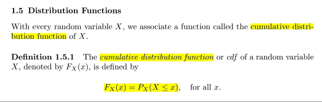</kbd>

🔗 **Related:** [CHAP 1.4 RANDOM VARIABLES](chap_14_random_variables.md#node-60)

> [!NOTE]
> Định nghĩa của CDF:
>
> **F_X(x) = P_X(X ≤ x)**
>
> Cái này **stat110** đã học rồi, nhưng nhờ ở đây ta**hiểu hơn rằng** cái **P ở đây** là
> **P_X** tức là **INDUCED PROBABILITY FUNCTION của X (có thể ghi là P cho
> đơn giản nhưng ta hiểu nó là P_X (theo link))**
>
> Và định nghĩa của **CDF** được tính / dựa trên **giá trị của induced probability
> function** đối với **event X ≤ x**.
>
> Mà ta cũng đã biết **induced** **probability** **function** cũng lại được dựa trên
> **PROBABILITY** **FUNCTION** của **ORIGINAL** **SAMPLE SPACE S:**
>
> **P_X(X ≤ x) = P({s**∈**S: X(s) ≤ x})**

> [!NOTE]
> ĐỊNH NGHĨA CỦA CDF

 

<kbd>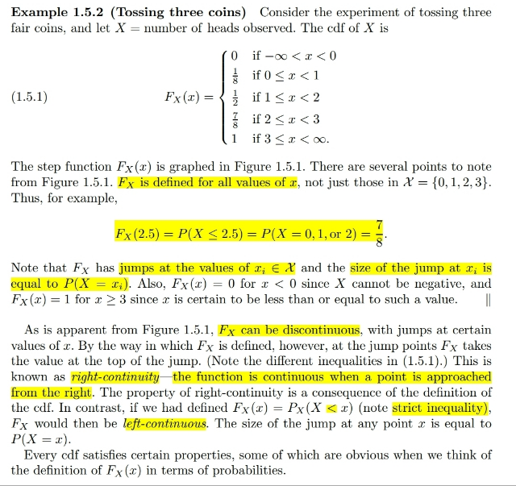</kbd>

> [!NOTE]
> Thế thì ta mới xét **ví dụ CDF của X** với X define là X = "**số head"
> trong  thử nghiệm tung 3 đồng xu**
>
> Thì như đã biết từ example trước, **range của X sẽ là {0,1,2,3}**. Với
> **P(X=i)** với i =0, 1, 2, 3 lần lượt = **1/8, 3/8, 3/8, 1/8**.
>
> Thế thì tuy rằng X chỉ có các giá trị khả dĩ **rời rạc** thì định nghĩa của
> **cdf** lại **vẫn cho phép tính xác suất của event giá trị X nằm trong một
> khoảng** với **mốc bất kì,** **ko nhất thiết phải là 0, 1, 2, 3**, ví dụ
> **F_X(2.5) = P_X(X ≤ 2.5**)
>
> Thế thì ta sẽ xem thử **tại sao cdf của X có dạng bậc thang** như vậy.
>
> Đầu tiên xét**F_X(x) với x < 0**, nó sẽ = **P_X(X < 0) = P({s**∈**S: X(s)
> < 0})**
>
> Và **{s**∈**S: X(s) < 0} là empty set**, vì**ko có p.o trong original sample
> space  nào mà X(s) < 0 hết**, do đó **F_X(x) với x < 0** = **P_X(X < 0)** =
> **P(**∅**) = 0**
>
> Xét **F_X(x) với x**∈**[0, 1)**. Tương tự nó sẽ bằng **P_X(X < x: x**∈**[0, 1))** =
> **P({s**∈**S: X(s) < x: x**∈**[0, 1)})**
>
> **= P({TTT}) = 1/8** (chỉ có một possible outcome trong event này)
>
> Như vậy nhận xét, khi x < 0, F_X(x) = 0, nhưng khi **0 ≤ x < 1**, thì
> **F_X(x) = 1/8**. Do đó **có một bước nhảy tại X = 0**. Và đây là một tính chất
> gọi là **RIGHT CONTINUOUS**:
>
> Đã học trong MIT 18.01, hàm số gọi là right continuous nếu
>
> **limit x->0+ f(x) = f(x0)** 
>
> Tính chất này là do CÁCH ĐỊNH NGHĨA CỦA CDF **F_X(x) = P(X ≤ x)**.
> **Nếu định nghĩa là P(X < x)** thì ta sẽ có tính chất **LEFT CONTINUOUS**

> [!NOTE]
> TÍNH CHẤT RIGHT CONTINUOUS CỦA CDF LÀ DO F_X(x) =
> P_X(X ≤ x)

 

<kbd>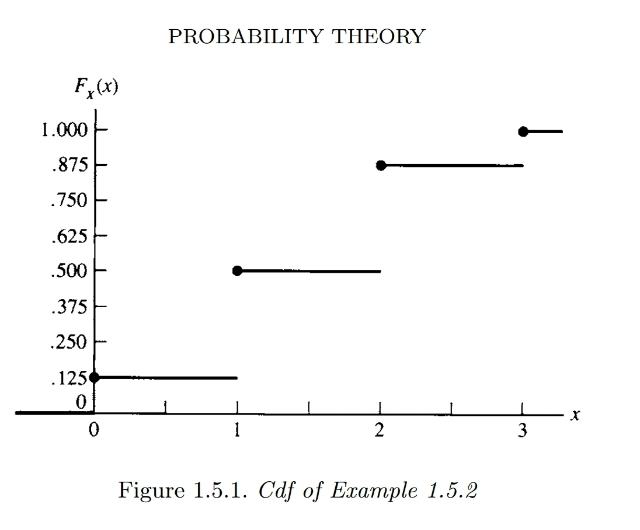</kbd>

 

<kbd>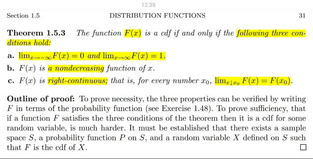</kbd>

> [!NOTE]
> Đại khái theorem này nói rằng để một function CÓ THỂ ĐÓNG VAI
> MỘT CDF HỢP LỆ thì nó phải thỏa mãn 3 điều kiện

 

<kbd>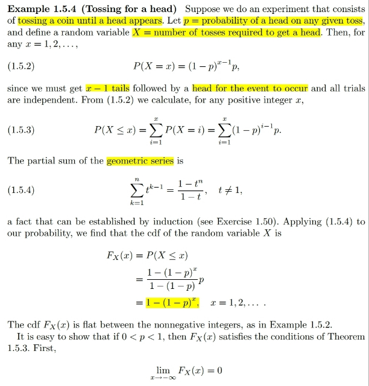</kbd>

> [!NOTE]
> Thử xem ví dụ này, thử nghiệm là toss a coin cho đến khi ra mặt Head.
>
> Và cho biết **xác suất ra mặt head ở mỗi lần tung là p**. Dừng một chút chỗ
> này. Với hành động tung đồng xu sẽ "tạo" sample space có 2 possible
> outcomes. Và nếu đồng xu bình thường thì xác suất xảy ra mỗi possible
> outcome đều bằng nhau, và dựa vào axiom 2 P(S) = 1 ta sẽ suy ra xác
> suất mỗi outcome là 1/2: P({H}) = P({T}) = 1/2. Còn ở đây cho P({H}) = p,
> nên suy ra P({T}) = 1 - p
>
> Thế thì, đặt **X là số lần tung cần thiết để có một Head**. Như đã biết, ý
> nghĩa của random variable là mang ý nghĩa summary một khía cạnh nào
> đó mà ta quan tâm từ thử nghiệm.
>
> Và nó sẽ tạo ra **một sample space mới** chứa các **possible values của
> random variable**. Và gắn với đó, là một probability function mới, gọi là
> **induced** **probability function** **P_X**, được tính từ probability function của
> original sample space:
>
> P**_X(X = x) = P({s**∈**S: X(s) = x})**
>
> Vậy thì, với **số lần tung để có mặt Head là x** thì có nghĩa là có **x-1 lần ra
> Tail** và **sau đó là một lần ra Head.**
>
> Thế thì, **original sample space** sẽ có **vô số possible outcomes** (infinite
> sample space), và các possible outcomes cũng không equally likely. Nên
> ta ko thể tính xác suất event A = {s ∈ S: X(s) = x} theo cách đếm số
> possible outcomes trong A, rồi nhân xác suất của một outcome được
> (chỉ áp dụng nếu sample space **finite** và các **possible outcomes đều
> equally likely**).
>
> Nhưng chú ý experiment là **toss a coin nhiều lần cho đến khi ra Head** thì
> dừng. Nên các **possible outcomes đều có dạng TTT..TH (chuỗi T kết
> thúc bởi một H).**
>
> Và trong vô số possible outcomes (vì ko giới hạn số lần toss, theo lí thuyết 
> chuỗi T có thể kéo dài vô hạn) thì **CHỈ CÓ MỘT cái là thỏa X(s) = x**.
> Đó là chuỗi **TT...(x-1) lần..TH.**
>
> Do đó **P_X(X=x) = P({s**∈**S: X(s) = x} = P({TT...(x-1) lần TH})**
>
> Tuy nhiên ta vẫn có thể tính xác suất của event A = {s ∈ S: X(s) = x}
>
> Thế thì như đã nói tập những outcome trong S sao cho X(s) = x **cũng là
> tập các outcome trong S sao cho có dạng x-1 lần ra Tail và sau đó một
> lần ra Head.**
>
> Có thể coi nó chính là joint / intersection của:
>
> A1 = {s ∈ S: "1st toss = Tail"},
>
> A2 = {s ∈ S: "2nd toss = Tail"}, ...
>
> A_x-1 = {s ∈ S: "x-1 th toss = Tail"}
>
> A_x = {s ∈ S: "x th toss = Head"}
>
> **A = A1 ∩ A2 ∩...A_x**
>
> Thế thì xét **P(A1)**, như đã nói A1 chứa **mọi outcomes bắt đầu với T**.
>
> Thì **chỉ cần lần toss đầu tiên ra Tail** thì lập tức **A1 xảy ra**.
>
> Nên **P(A1) = P(lần toss thứ 1 ra tail)** và cái này**cũng bằng xác suất ra Tail
> ở mỗi lần tung**, mà đề bài cho bằng 1-p .
>
> Xét **P(A2)** cũng tương tự, **chỉ cần lần toss thứ 2 ra Tail thì đồng nghĩa A2
> xảy ra**. Nên **P(A2) = P(lần toss thứ 2 ra Tail)** và nó cũng bằng xác suất
> toss ra Tail = (1-p)
>
> Tương tự P(A_x-1) = 1-p
>
> Và P(A_x) = p
>
> Thế thì **P(A) = P(A1 ∩ A2...A_x)**
>
> Nhưng **các event Ai đều độc lập**, lí do là **vì việc lần toss thứ i ra gì (Ai có
> xảy ra hay không) chả ảnh hưởng gì đến lần toss thứ j (Aj có xảy ra
> không)**. Do đó theo theorem về independent event
>
> **P(A) = Πi P(Ai) = (1-p)^x-1 p**
>
> Và đó chính là **P_X(X=x)**

> [!NOTE]
> Tiếp, thử xem xét P_X(X ≤ x) tức F_X(x).
>
> Thì xét event trong new sample space: (X ≤ x) = ⋃i={1,2,...x-1} (X=i)
>
> => P_X(X ≤ x) = **P_X(**⋃**i={1,2,...x-1} (X=i))**
>
> Và các event X=i đều disjoint (*), do đó theo Axiom 3 (như đã nói hồi
> nãy P_X hoàn toàn tuân thủ các axioms) 
>
> P_X(⋃i={1,2,...x-1} (X=i)) = **∑i P_X(X=i)**
>
> = **∑i=1:x (1-p)^(i-1)p**
>
> Đến đây mới dùng một công thức:
>
> Σk=1:n t^(k-1) = [1 - t^n] / (1 - t) công thức này gọi là partial Σ của 
> geometric series, ta có thể chứng minh bằng induction (QUAY LẠI
> SAU)
>
> Từ đó áp dụng vào ∑i=1:x (1 - p)^(i - 1)p , 
>
> coi như t = 1-p, n = x, k = i
>
> = [[1 - (1 - p)^x] / (1 - (1 - p)) ] p
>
> = [[1 - (1 - p)^x] / p ] p
>
> = **1 - (1 - p)^x**

 

<kbd>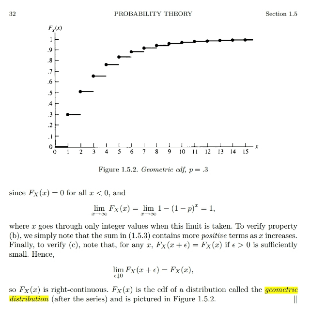</kbd>

> [!NOTE]
> Khúc sau là chứng minh F_X(x) thỏa 3 tính chất
> của Theorem ...

> [!NOTE]
> QUAY LẠI SAU

 

<kbd>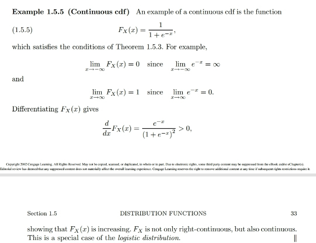</kbd>

> [!NOTE]
> Một ví dụ về cdf có tính continuous. Chính là cdf
> của Logistics Distribution

> [!NOTE]
> QUAY LẠI SAU

 

<kbd>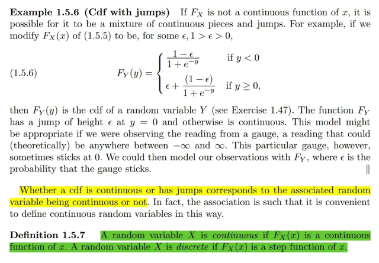</kbd>

> [!NOTE]
> Đại khái là một ví dụ về cdf vừa liên tục vừa có bước nhảy.
>
> Từ đó người ta định nghĩa rằng, random variable continuous khi
> cdf liên tục và discrete khi cdf là step function

> [!NOTE]
> ĐỊNH NGHĨA THẾ NÀO LÀ BIẾN LIÊN TỤC (CONTIUOUS)
> VÀ RỜI RẠC (DISCRETE)

 

<kbd>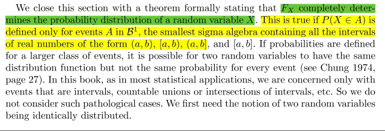</kbd>

> [!NOTE]
> Đại khái là, như stat110 đã nghe gs Blizstein nói cdf pdf và cả mgf giúp xác
> định distribution. Thì đại khái là ở đây gs nói nó chỉ đúng khi xét sample
> space là Borel Field B(1).
>
> Đại khái trong phần nói về domain của probability function P, ta đã học về
> khái niệm Sigma Algebra hay còn gọi là Borel field. Và nó là set yêu cầu
> thỏa 3 điều kiện như:
>
> 1) Chứa tập rỗng 2) Nếu chứa các tập Ai thì nó cũng chứa union (gọi
> là Closed under union) 3) Chứa A thì cũng chứa Ac (closed under complement)
>
> Đại khái theo đó thì Borel field nhỏ nhất chính là chứa S và ∅.
>
> Vậy thì đại khái là tuy không hoàn toàn đúng nhưng trong context của
> statistic thì được chấp nhận

 

<kbd>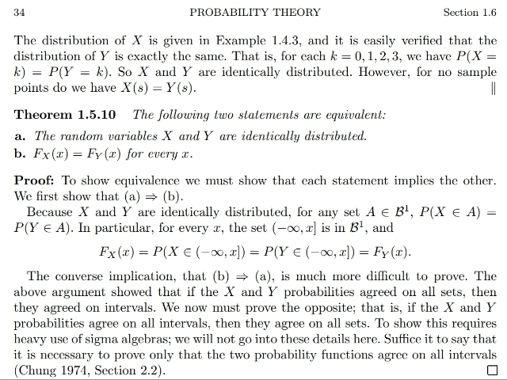</kbd>

<kbd></kbd>

<kbd>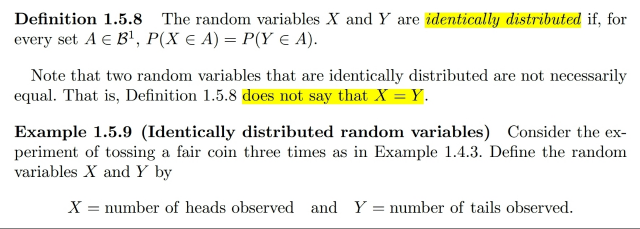</kbd>

> [!NOTE]
> Đại khái là đây là hình như là lần đầu tiên mình được học về định nghĩa của
> IDENTICAL DISTRIBUTED random variables.
>
> Ở lớp Stat110, khi nói về i.i.d thì ta hiểu rằng các random variables có cùng
> distribution và độc lập nhau. Và cùng distribution thì mình chỉ hiểu là giả sử
> nói n i. i.d rvs ~ Bern(p) thì chỉ hiểu chúng đều ~ Bern(p) thôi.
>
> Ở đây định nghĩa của nó là nếu với mọi set A thì P(X ∈ A) = P(Y ∈ A).
>
> Sau đó là một ví dụ, khi tung 3 đồng xu và đặt X là event HHH và Y là event
> TTT. Bằng cách chứng minh theo định nghĩa rằng với mọi i=0,1,2,3 thì P(X =
> i) = P(Y = i) ta có thể chứng minh X,Y là IDENTICAL DISTRIBUTED

> [!NOTE]
> ĐỊNH NGHĨA CỦA IDENTICAL DISTRIBUTED

> [!NOTE]
> Cuối cùng là một theorem nói rằng nếu X,Y IDENTICAL DISTRIBUTED thì
> CDF F_X(x) = F_Y(x) với mọi x
>
> ĐÂY CHÍNH LÀ THEOREM MÀ SAU NÀY CHO PHÉP TA DÙNG RẤT
> NHIỀU ĐỂ NÓI: X1,X2...Xn là các iid random variables từ population
> cdf/pmf f (hoặc cdf F) ⇨ chúng đều có chung marginal distribution, tức
> fX1(x) = fX2(x) ...= fXn(x) với mọi x

 

