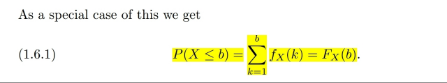
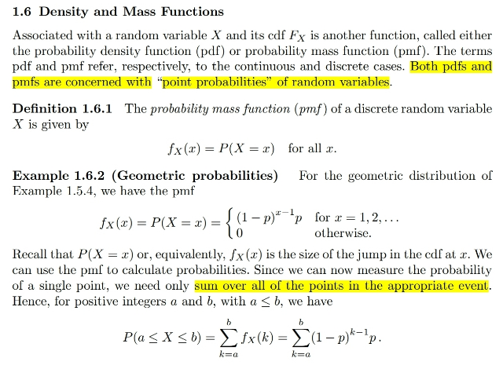
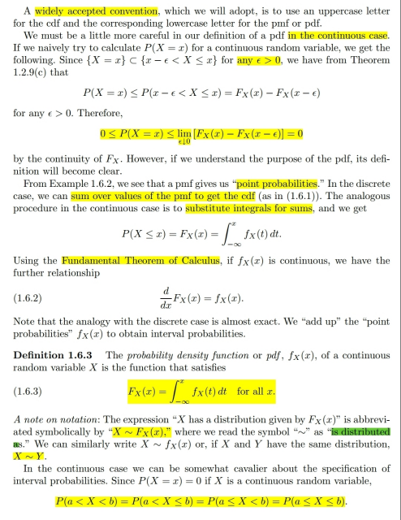
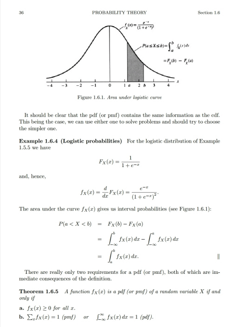
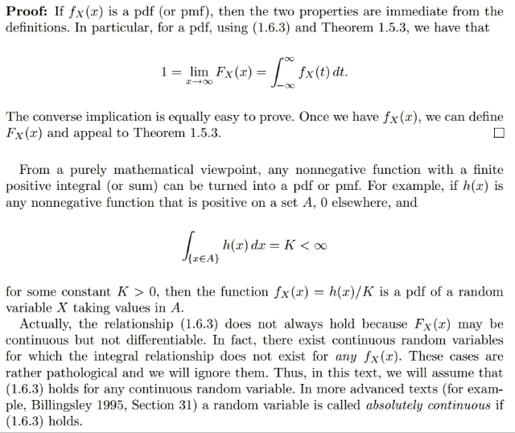

# 1.6 PDF & Pmf

📊 **Progress:** `7` Notes | `6` Screenshots

---

<kbd></kbd>

<kbd></kbd>

<kbd></kbd>

> [!NOTE]
> Đại ý là pmf và pdf là nói về "**point probability**" ý là **xác xuất tại một điểm**
> khác với cdf là **xác suất mà giá trị của random variable nằm trong
> khoảng** (từ -∞ đến x).
>
> Đầu tiên là **pmf**: theo định nghĩa nó **fX(x) = P(X = x)**.
>
> Nên ví dụ với **Geometric** distribution Geom(p) khi ta đã biết **P(X=x) =
> (1-p)^(x-1)p** khi x = 1,2... thì đó cũng là pmf của Geom(p).
>
> Ý sau khi nhắc đến bước nhảy là vì trong những bài trước ta đã thấy rằng
> **bước nhảy của cdf tại x** sẽ tương ứng với giá trị của P(X=x). Nên từ đó gs
> cho rằng ta có thể dùng pmf để tính xác suất trong một khoảng.
>
> Đại khái là vầy giả sử ta cần tính P(X ∈ [a, b]). Thì cái này sẽ bằng P(X ∈
> [-∞, b]) - P(X ∈ [-∞, a]) (cái này là vì dùng axiom 3 (probability of disjoint
> events thôi)
>
> Tức là bằng **F_X(b) - F_X(a)**, nhưng bữa trước đã thấy **khoảng chênh lệch**
> giữa hai cái cdf này **đúng bằng tổng các bước nhảy** của cdf **tại các giá trị
> của x trong đoạn này.**
>
> Do đó theo kết quả này ta có:
>
> **F_X(b) - F_X(a) = ∑ P(X = x) , x**∈**[a, b].**
>
> Vậy áp dụng cho Geom(p) distribution:
>
> P(X ∈ [a, b]) = ∑ P(X = x) , x ∈ [a, b]
>
> = **∑x**∈**[a:b] (1-p)^(1-x)p**
>
> Ta cũng có thể lập luận rằng:
>
> X ∈ [a, b] = ⋃i (X = i) i ∈ a:b
>
> Nên theo axiom 3:
>
> P(X ∈ [a, b]) = P(⋃i (X = i) i ∈ a:b)
>
> = ∑i=a:b P(X=i) = ∑i=a:b fX(i)
>
> Trường hợp đặc biệt:
>
> P(X ∈ (-∞, b]) = P(X ∈ (-∞, 0)) + P(X ∈ [0, b])
>
> = 0 + P(X ∈ [0, b]) = ∑k=0:b fX(k)

> [!NOTE]
> ĐỊNH NGHĨA PMF

 

<kbd></kbd>

🔗 **Related:** [5.6 GENERATING RANDOM SAMPLE](56_generating_random_sample.md#node-452)

> [!NOTE]
> Vài điểm đã học trong stat110.
>
> Đầu tiên là khi nói qua **continuous** random variable, thì
> ta sẽ có **pdf** thay cho pmf. Mình vẫn hay nghe với
> continuous random variable thì **P(X=x) = 0** mà chưa
> thấy một lập luận theo toán học nào cho việc này. Thì ở
> đây nó là như vầy:
>
> Xét event **(X = x)**, nó dĩ nhiên là subset của **(x ≤ X ≤ x +
> ϵ)** Theo một theorem đã học trong set theory: A ⊂ B =>
> P(A) ≤ P(B). Do đó **P(X = x) ≤ P(x ≤ X ≤ x + ϵ)**
>
> Và **P(x ≤ X ≤ x + ϵ) thì bằng F_X(x + ϵ) - F_X(x)**. Và vì điều
> này **đúng với mọi eps dương** nên nó **vẫn đúng khi eps
> vô cùng nhỏ**:
>
> P(X = x) ≤ lim ϵ -> 0+ [ F_X(x + ϵ) - F_X(x) ] và cái này bằng 0
>
> Vậy **P(X = x) ≤ 0** mà theo **axiom 1**, nó cũng **ko âm** vậy
> suy ra **P(X = x) = 0**
>
> ====
>
> Ngoài ra mấy cái kia biết hết rồi như d/dx F_X(x) =
> f_X(x) và F_X(x) = ∫-∞:x f_X(t)dt
>
> Cũng như là vì P(X = x) = 0 nên đối với continuous
> random variable thì xác suất X in khoảng hay đoạn
> không quan trọng

> [!NOTE]
> Chứng minh với continuous random
> variable thì PMF P(X = x) = 0

 

<kbd></kbd>

> [!NOTE]
> Một ví dụ về pdf.
>
> Sau đó là một theorem đã học trong stat110: để trở thành valid
> pmf/pdf thì function cần thỏa điều kiện là
>
> 1) ko âm
>
> 2) tổng các possible values = 1 (với pmf thì là tổng ∑xi fX(xi) = 1.
>
> Với pdf thì là tích phân

> [!NOTE]
> QUAY LẠI SAU

 

<kbd></kbd>

> [!NOTE]
> QUAY LẠI SAU

 

