# 2.1 Distribution

📊 **Progress:** `18` Notes | `27` Screenshots

---
<a id="node-81"></a>

<p align="center"><kbd>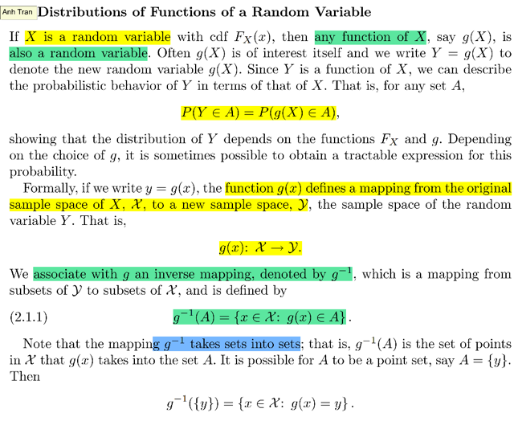</kbd></p>

> [!NOTE]
> Đại khái là thế này: giả sử ta có một **random variable X**, thì như đã
> biết từ Stat110, khi **apply một function g lên X**, ta sẽ có một
> **random variable** mới. Nói cách khác, gọi **Y `=` g(X)**, thì**Y là một
> rv**
>
> Thế thì đại ý là, dễ thấy rằng ta có thể **mô tả hành vi của Y** **dựa
> trên X**. Cụ thể là, ví dụ ta muốn **tính xác suất của event liên quan
> đến Y**, cụ thể là **event Y**∈**A, tức P(Y**∈**A)**.
>
> Dừng lại một chút để nói về event **Y**∈**A**. Như đã biết từ Stat110,
> random variable, bản chất nó **LÀ MỘT FUNCTION**. Và function này
> nhận input là một **POSSIBLE OUTCOME** trong **SAMPLE
> SPACE**, và output ra một **numerical** value, một con số. Hay nói
> nôm na là, function này gán label cho một possible outcome. Nên,**ví
> dụ** như nói r**v X có các discrete possible values là `x1=1,` `x2=2,`
> x3=3** thì tức là trong**(original) sample space có các possible
> outcomes** được map với x1, x2, x3, ví dụ **X(s1) `=` x1. X(s2) `=` x1,
> X(s3) `=` x2** (dĩ nhiên cũng có thể có nhiều possible outcomes được
> map với x1, ở đây là s1, s2)
>
> Thế thì, nói **X `=` x1**, tức là đang nói về possible outcome s1, s2, để
> rồi nếu s1 hoặc s2 xuất hiện thì chính là event `X=1` xảy ra và random
> variable mang giá trị bằng 1 sau khi thực hiện experiment. Diễn đạt
> chuẩn theo toán học:
>
> **P_X(X `=` x) `=` P({s**∈**S: X(s) `=` x})**
>
> Vế phải **P là probability function** gắn với **original** **sample**
> **space**. Còn **P_X là induced probability function** gắn với **"new"
> sample space là space các possible values của X**. Cho nên có thể
> ghi:
>
> **P_X(X=x1) `=` P({s1,s2})**
>
> Rồi, tiếp theo ta ôn lại khái niệm **event**, thì event chẳng qua là một
> **SUBSET** các possible outcome của SAMPLE SPACE. Ví dụ như
> **X `=` x1** là một event trong sample space của X (mình gọi là `ΩX)` nó
> sẽ chứa chứa possible value x1, và cũng có thể được định nghĩa bởi
> các p.o trong original sample space;
>
> ```text
> X=x1 = {s ∈ Ω: X(s) = x1}
> ```

> [!NOTE]
> Thế thì bây giờ quay lại Y. Cụ thể là event **(Y**∈**A)** thì như đã
> nói, nó mang ý nghĩa là **subset A** của sample space **ΩY**.
>
> Thế thì đại khái là **X `=` g(Y)** tạo ra một **mapping** giữa sample
> space của X: `ΩX` và sample space của Y: `ΩY.`
>
> Lưu ý là không có original sample space của Y, cả `ΩX` và `ΩY` đều là
> new sample space xuất hiện do random variable X và Y. Trong đó X
> map original sample space S với sample space `ΩX` và Y map sample
> ```text
> space ΩX với ΩY. Lấy ví dụ như y1 = g(x1), y2 = g(x2) = g(x3)
> ```
>
> Và giả sử ta đặt A `=` {y1, y2}
>
> Ta nói qua P(Y ∈ A), dễ thấy nó sẽ chính là P(g(X) ∈ A), và do đó gs
> Casella nói rằng ta có thể mô ta hành vi của Y dựa vào X, cụ thể ở
> đây ta có thể dựa vào `F_X(z)` (ý nói distribution của X) và bản thân
> hàm g
>
> `====`
>
> Thế thì sau đó gs Casella nói về việc, từ g(x): `ΩX` `->` `ΩY,` ta có thể
> ```text
> define một mapping ngược lại g_inv ΩY -> ΩX
> ```
>
> Từ đó ta mới có cái gọi là INVERSE CỦA A, `g_inv(A),` thì `g_inv(A)` sẽ
> là mọi possible values của X trong `ΩX` mà thông qua g sẽ được map
> với các possible outcome trong subset A của `ΩA:`
>
> `g_inv(A)` `=` {x ∈ `ΩX:` g(x) ∈ A}
>
> với việc lấy ví dụ cụ thể như trên thì `g_inv(A)` `=` {x ∈ `ΩX:` g(x) ∈ {y1,
> y2}} `=` {x1, x2, x3}
>
> Thế thì tiếp theo, giả sử ta gọi set B ⊂ `ΩY` chỉ chứa y1 thôi: {y1}. Ta
> gọi đó là `POINT-SET.`
>
> Lúc bấy giờ, `g_inv(B)` có quyền ghi là `g_inv({y1})` hoặc `g_inv(y1)` thôi,
> và đương nhiên nó sẽ là subset của `ΩX` chỉ chứa possible value sao
> cho g(x) `=` y1: `g_inv(y1)` `=` {x1}.
>
> Tương tự `g_inv(y2)` `=` {x2, x3}
>
> Thế thì với `g_inv(y1)` `=` {x1} thì nó cũng là point set, có thể ghi
> `g_inv(y1)` `=` x1

<br>

<a id="node-82"></a>

<p align="center"><kbd>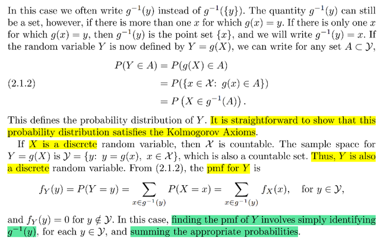</kbd></p>

> [!NOTE]
> Để rồi từ đó một ta có quan hệ sau:
>
> (Y ∈ A) `=` (g(X) ∈ A) 
>
> `=` {x ∈ `ΩX:` g(x) ∈ A} 
>
> `=` {x ∈ `ΩX:` x ∈ `g_inv(A)}` 
>
> ```text
> Cái này đồng nghĩa x ∈ ΩX ∩ g_inv(A) = g_inv(A) vì nó là tập con của ΩX
> ```
>
> `=` (X ∈ `g_inv(A))`
>
> Và như vậy:
>
> **P(Y**∈**A)**= P({x ∈ `ΩX:` g(x) ∈ A}) 
>
> `=` P({x ∈ `ΩX:` x ∈ `g_inv(A)})` 
>
> =**P(X**∈**g_inv(A))**
>
> Và đến lượt P(X ∈ `g_inv(A))` thì ta có thể dùng axiom 3 và pdf của X:
>
> `=` ∑x ∈ `g_inv(A)` P(X `=` x) 
>
> `=` **∑x**∈**g_inv(A) fX(x)**

<br>

<a id="node-83"></a>

<p align="center"><kbd>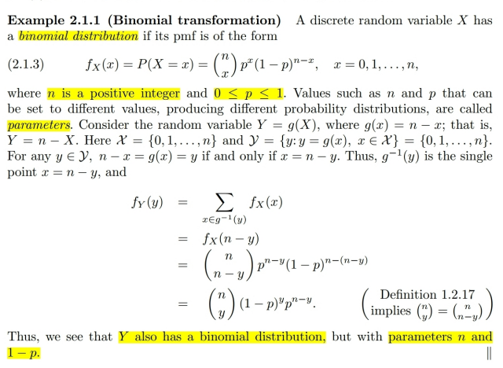</kbd></p>

> [!NOTE]
> Gặp lại Binomial distribution. Stat110 mình đã biết story của nó (Bin(n, p))
> là số Bern(p) trial thành công trong chuỗi n trials iid
>
> ```text
> Lập luận về pmf fX(x) = P(X = x): Xét event X = x, = {s ∈ Ω: X(s) = x}
> ```
> với s là chuỗi kết quả của n Bern(p) trial thì để X(s) `=` x đồng nghĩa trong
> chuỗi có x trial success và n `-` x trial fail.
>
> Thế thì để cho dễ lấy ví dụ n `=` 5, và x `=` 3, khi đó một s trong tập trên
> sẽ là SFFSS (với S `=` Success, F `=` Fail).
>
> Và possible outcome chính là intersection của các event: 
>
> s `=` Sxxxx ∩ xFxxx ∩ xxFxx ∩ xxxSx ∩ xxxxS
>
> Xét event Sxxxx, nó sẽ tương ứng `1-1` với event "lần trial thứ nhất ra success"
> Do đó P({s ∈ `Ω:` s ∈ Sxxxx}) cũng bằng P(lần trial thứ nhất ra success) và
> theo đó, nó bằng p. Tương tự P({s ∈ `Ω:` s ∈ xFxxx}) bằng q.
>
> Vậy P({s}) `=` P(Sxxxx ∩ xFxxx ∩ xxFxx ∩ xxxSx ∩ xxxxS)
>
> ```text
> = P({s ∈ Ω: s ∈ Sxxxx} ∩ {s ∈ Ω: s ∈ xFxxx} ∩ ...∩ {s ∈ Ω: s ∈ xxxxS} )
> ```
>
> `=` P(lần thứ 1 ra S ∩ lần thứ 2 ra F ∩ ... ∩ lần thứ 5 ra S)
>
> Mà các event này độc lập nên
>
> `=` P(lần thứ 1 ra S)*P(lần thứ 2 ra F)*... *P(lần thứ 5 ra S) 
>
> `=` pqqpp `=` p^3q^2
>
> Vậy đó là P({s}) với s `=` SFFSS, `=` p^3q^2
>
> ```text
> Tuy nhiên dĩ nhiên ta cần tính P(X=x) = P({s ∈ Ω: X(s) = x})
> ```
>
> theo định nghĩa hàm xác suất P nó sẽ bằng `Σ` {s ∈ `Ω:` X(s) `=` x} P({s})
>
> Thế thì có thể thấy các possible outcome trong set này sẽ đều có dạng 
> là chuỗi kết quả có 3 success và 2 fail. Nên xác suất của chúng có thể tính
> tương tự như trên và đều sẽ là p^3q^2. Hay nói cách khác, các possible
> outcome trong event này đều equally likely
>
> Vấn đề chỉ còn là tính tổng số p.o có trong set.
>
> Vậy có thể thấy đây là số các sắp xếp thứ tự của chuỗi chứa 3 S và 2 F 
> nhưng không quan tâm thứ tự của các S với nhau hay F với nhau.
>
> Và dễ thấy rằng nó cũng chỉ đơn giản là số cách chọn bộ 3 vị trí cho Success 
> event trong n `=` 5 vị trí, vì tương ứng với mỗi cách chọn thì còn lại sẽ là Fail
>
> Do đó tổng cộng số lượng là 5 choose 3
>
> ```text
> Vậy P(X=x) = (n choose x)p^x(1-p^(n-x)
> ```

> [!NOTE]
> Rồi giờ đặt Y `=` n `-` X
>
> Bảo tính fY(y) (cũng là P(Y `=` y).
>
> Lập luận trong sách đại khái là
>
> ```text
> Xét event Y = y ⇔ g(X) = y ⇔ n - X = y ⇔ X = n - y
> ```
>
> Nên xét event Y `=` y có bản chất là {s ∈ `Ω:` Y(s) `=` y}
> ```text
> thì vì Y(s) = y ⇔ n - X(s) = y ⇔ X(s) = y - n nên set
> ```
> này cũng chính là set {s ∈ `Ω:` X(s) `=` n `-` y} và đây
> thì lại chính là event X `=` `n-y.` 
>
> ```text
> ⇨ P(Y = y) = P(X = n - y)
> ```
>
> Với việc đã chứng minh fX. thì P(X `=` n `-` y)
>
> ```text
> = fX(n - y) = (n choose n - y)p(n-y)q^(n-n+y)
> ```
>
> `=` (n choose n `-` `y)p^(n-y)q^y`
>
> Áp dụng (n choose y) `=` (n choose `n-y)` thì ta có kết quả 
>
> fY(y) `=` (n choose `y)p^n-yq^y`
>
> Cho thành Y ~ Bin(q, n)
>
> `====`
>
> Hoặc nếu ko nói theo original sample space thì nói theo
> range của X cũng được:
>
> ```text
> Y = y là ∪ của {X = x: x = n - y}
> ```
>
> ```text
> ⇨ P(Y = y) = P(∪ của {X = x: x = n - y}). Mà đây là
> ```
> ∪ của các disjoint event nên theo Axiom 2 (áp dụng cho 
> sample space của X, tức rang X) thì nó bằng:
>
> ```text
> = Σ {mọi x: x = n-y} P(X=x)
> ```
>
> Và dĩ nhiên là cái tổng này chỉ có một hạng tử, 
>
> ```text
> = P(X = x) với x = n - y, = P(X = n - y) là tiếp như trên
> ```

<br>

<a id="node-84"></a>

<p align="center"><kbd>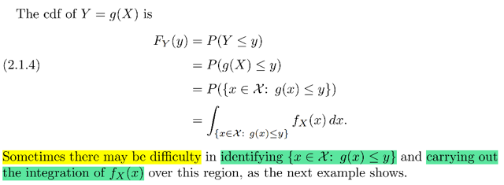</kbd></p>

<p align="center"><kbd></kbd></p>

<p align="center"><kbd>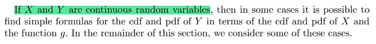</kbd></p>

> [!NOTE]
> Đại khái là vầy, như ta đã biết ta có thể xây dựng CDF của Y `=` g(X), để tìm 
> distribution của nó từ CDF của X với lập luận chung là:
>
> FY(y) `=` P(Y ≤ y) `=` P(g(X) ≤ y)
>
> Cái này nếu mô tả theo sample space gốc `Ω:`
>
> ```text
> = P({s ∈ Ω: g(X(s)) ≤ y}) = Σ {s ∈ Ω: g(X(s)) ≤ y} P({s})
> ```
>
> Nhưng cũng được quyền mô ta theo sample space của X, vốn đã chứng minh
> cũng tuân theo axiom
>
> `=` P({x ∈ `ΩX:` g(x) ≤ y})  
>
> ```text
> Cái này nếu X là discrete thì ta tiếp = Σ {x ∈ ΩX: g(x) ≤ y} P(X=x)
> ```
>
> Còn với continuous case thì theo định nghĩa pdf, cho phép ta tính xác suất
> của X nằm trong vùng A: P(X ∈ A) `=` `∫A` fX(x)dx
>
> `=` `∫{x` ∈ `ΩX:` g(x) ≤ y} fX(x)dx
>
> Thế thì ở đây gs nói về việc thực tế sẽ có khi gặp hai trở ngại:
>
> 1) KHÓ XÁC ĐỊNH CÁI SET A `=` {x ∈ `ΩX:` g(x) ≤ y} dĩ nhiên làm sao tính tích phân
>
> 2) XÁC ĐỊNH ĐƯỢC A NHƯNG BẢN CHẤT TÍNH CÁI TÍCH PHÂN KHÔNG
> PHẢI LÚC NÀO CŨNG DỄ

<br>

<a id="node-85"></a>

<p align="center"><kbd>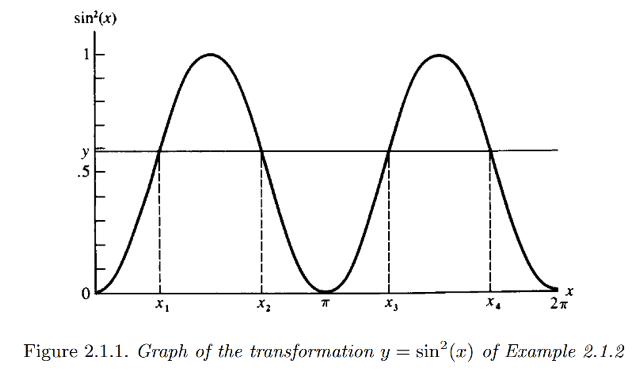</kbd></p>

<p align="center"><kbd></kbd></p>

<p align="center"><kbd>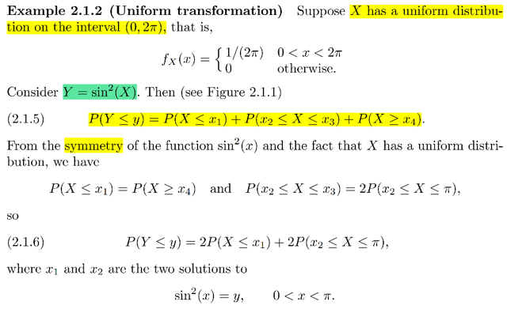</kbd></p>

> [!NOTE]
> Ví dụ này, X ~ Unif(0, `2π)` (stat110 đã học, điều này có nghĩa là trên đoạn 
> [0, `2π]` fX(x) đều bằng nhau `(=` c). Dựa vào yêu cầu valid của pdf ta phải
> ```text
> có ∫-inf:inf fX(x)dx = ∫0:2π c dx = 1 ⇔ c|0:2π = 1 ⇔ c = 1/2π
> ```
>
> ```text
> Do đó pdf fX(x) = 1/ 2π khi x ∈ [0, 2π] và = 0 otherwise.
> ```
>
> Thế thì xét Y `=` g(X) `=` sin^2(X).
>
> Lặp lại lập luận về bản chất của event (Y ∈ A): 
>
> ```text
> (Y ∈ A) = (g(X) ∈ A) = ({x ∈ ΩX: g(x) ∈ A}) = (X ∈ ginv(A)) = {s ∈ Ω: X(s) ∈ ginv(A)}
> ```
>
> Ở đây A là `(-inf,` y)
>
> ```text
> (Y ≤ y) = (g(X) = sin^2(X) ≤ y) = ({x ∈ ΩX: sin^2(x) ≤ y}) ⇔ (X ∈ ginv(A))
> ```
>
> với ginv(A) là {x ∈ `ΩX:` sin^2(x) ≤ y} ⇔ {x ∈ `ΩX:` x ≤ x1 | x ≥ x4 | x2 ≤ x ≤ `π}`
>
> Theo đồ thị 2.1.1 thì tập ginv(A) `=` {x ∈ `ΩX:` g(x) ≤ y} chính
> là {x ∈ `ΩX:` x ≤ x1 | x ≥ x4 | x2 ≤ x ≤ `π}`
>
> Nên P(Y ≤ y) `=` P({x ∈ `ΩX:` g(x) ≤ y}) 
>
> =**∫{x**∈**ΩX: x ≤ x1 | x ≥ x4 | x2 ≤ x ≤ `π}` fX(x)dx
>
> ĐẠI Ý MUỐN MINH HỌA MỘT CASE DÙ BÀI TOÁN CÓ VẺ ĐƠN GIẢN
> NHƯNG KẾT QỦA CDF CỦA Y KHÔNG ĐƠN GIẢN CHÚT NÀO KHI PHẢI
> TÍNH CÁI TÍCH PHÂN NÀY**

<br>

<a id="node-86"></a>

<p align="center"><kbd>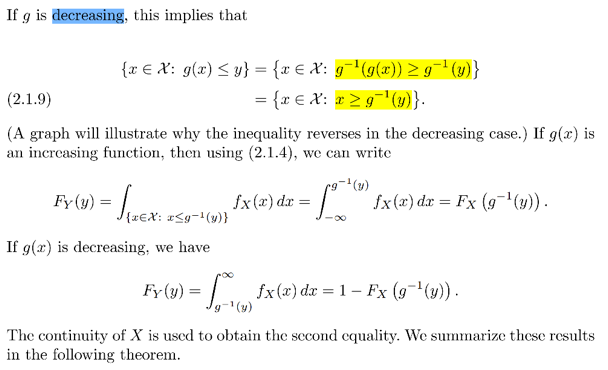</kbd></p>

<p align="center"><kbd></kbd></p>

<p align="center"><kbd>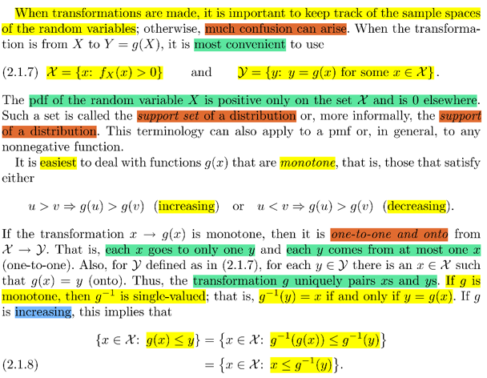</kbd></p>

> [!NOTE]
> Đại khái là thế này, như vừa rồi ta thấy một ví dụ cho thấy thách thức 
> để tìm distribution của Y `=` g(X)
>
> Tuy nhiên nếu ta gặp g có tính chất đơn điệu (monotone) tức là nó
> là hàm đồng biến hoặc nghịch biến thì việc xác định ginv(Y < y) sẽ dễ:
>
> như đã biết (Y < y) `=` (g(X) ≤ y) `=` {x ∈ `ΩX:` g(x) ≤ y} (1)
>
> vì g monotone nên g(x) ≤ y ⇔ x ≤ ginv(y) nếu nó là monotone increasing
>
> hoặc monotone decresing.
>
> nhờ vậy khi nó là increasing: (1) `=` {x ∈ `ΩX:` x ≤ ginv(y)}, nó chính là (X ≤ ginv(y))
>
> Từ đó FY(y) P(Y ≤ y) `=` P(X ≤ ginv(y)) `=` **FX(ginv(y)**
>
> còn khi nó dereasing thì (1) `=` {x ∈ `ΩX:` x ≥ ginv(y)} và đây chính là (X ≥ ginv(y))
>
> Từ đó FY(y) P(Y ≤ y) `=` P(X ≥ ginv(y)) `=` 1 `-` P(X ≤ ginv(y)) `=` **1 `-` FX(ginv(y)**====
> ****Ở trên khi mình viết P(X ≤ ginv(y)) `=` FX(ginv(y) thì có thể hiểu là ta đang dùng
> định nghĩa của CDF FX(x) `=` P(X ≤ x)
>
> Hoặc cùng có thể hiểu P(X ≤ ginv(y)) `=` P(X ∈ `(-inf,` ginv(y)) để rồi dùng pdf:
>
> `=` `∫-inf:` ginv(y) fX(x)dx

<br>

<a id="node-87"></a>

<p align="center"><kbd>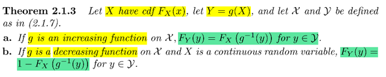</kbd></p>

> [!NOTE]
> Và lập luận này cũng đã chứng
> minh cho Theorem 2.1.3

<br>

<a id="node-88"></a>

<p align="center"><kbd>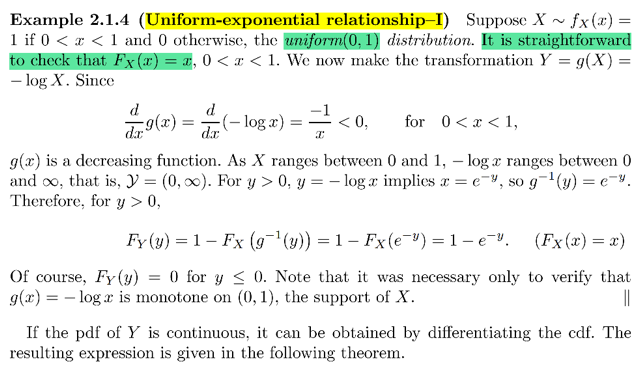</kbd></p>

> [!NOTE]
> Rồi ta gặp lại unif(0,1). Như đã biết với unif(a, b) thì pdf fX(x) `=` `1/(b-a)` khi
> x ∈ [a, b]. Nên với unif(0,1) fX(x) `=` 1 khi x ∈ [0, 1] và 0 otherwise
>
> ```text
> FX(x) theo định nghĩa = P(X ≤ x) = ∫-inf:x 1 dt (t là dummy variable)
> ```
>
> Dùng FTC part 2 nói rằng `∫a:x` f(t)dt là hàm F(x) sao cho `d/dx` F(x) `=f(x)`
>
> Do đó ở đây ta có `∫-inf:x` 1 dt thì f(t) `=` 1, ⇨ Kết quả trên bằng **F(x) `=` x**
> vì `d/dx` F(x) `=` 1.
>
> Giờ ta có Y `=` g(X) `=` `-` log X
>
> Để kiểm tra xem hàm g có monotone increasing hay decreasing hay không
> ```text
> thì ta kiểm tra d/dx g(x) = -1/x với x trong khoảng (0,1) thì -1/x < 0. Theo
> ```
> MIT 18.01, ta biết hàm số này sẽ luôn decreasing trong trong khoảng (0,1)
>
> ```text
> Do đó FY(y) = P(Y ≤ y) = P(- logX ≤ y) = P(log X ≥ -y) = P(X ≥ e^-y)
> ```
> ```text
> = 1 - P(X ≤ e^-y) = 1 - FX(e^-y) = 1 - e^-y
> ```

<br>

<a id="node-89"></a>

<p align="center"><kbd>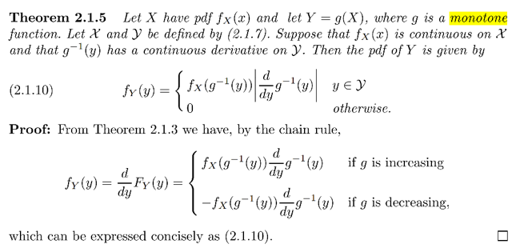</kbd></p>

> [!NOTE]
> Xuất phát từ FY(y) `=` FX(ginv(y)) ta mới áp dụng tiếp tính chất  là fY(y) `=` `d/dy`
> FY(y) để có :
>
> a) Nếu g increasing:
>
> ```text
> fY(y) = d/dy FY(y) = d/dy FX(ginv(y))
> ```
>
> `=` `d/d` ginv(y) FX(ginv(y)) . `d/dy` ginv(y)
>
> `=` `d/dx` FX(x) . `d/dy` ginv(y)
>
> `=` fX(x) . `d/dy` x
>
> `=` fX(ginv(y) `dx/dy`
>
> ```text
> ⇨ fY(y) = fX(ginv(y) dx/dy = fX(ginv(y)) d/dy ginv(y)
> ```
>
> b) Nếu g decreasing:
>
> ```text
> fY(y) = d/dy FY(y) = d/dy [1 - FX(ginv(y))]
> ```
>
> `=` `-` `d/dy` FX(ginv(y))
>
> ```text
> = - d/d ginv(y) FX(ginv(y)) . d/dy ginv(y)
> ```
>
> ```text
> = - d/dx FX(x) . d/dy ginv(y)
> ```
>
> `=` `-` fX(x) . `d/dy` x
>
> `=` `-` fX(ginv(y) `dx/dy`
>
> ⇨ fY(y) `=` `-` fX(ginv(y) `d/dy` ginv(y)
>
> Vậy **f(Y) `=` fX(ginv(y)) `|d/dy` ginv(y)|**
>
> Đây là transformation theorem đã học trong stat110
>
> (trong stat110 gs chỉ assume case increasing)

<br>

<a id="node-90"></a>

<p align="center"><kbd>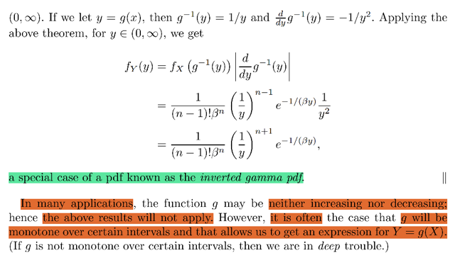</kbd></p>

<p align="center"><kbd></kbd></p>

<p align="center"><kbd>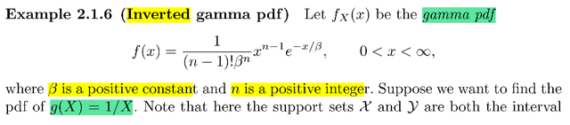</kbd></p>

> [!NOTE]
> ```text
> Thử làm ví dụ này f(x) = x^(n-1) e^-x/β / (n - 1)! β^n x ∈ (0, inf)
> ```
>
> Đây là pdf của Gamma distribution
>
> Cần tìm distribution của Y `=` `1/X`
>
> Áp dụng theorem:
>
> fY(y) `=` fX(ginv(y)) `|d/dy` ginv(y)|
>
> ```text
> y = 1/x ⇨ x = 1/y
> ```
>
> ```text
> = fX(1/y) |d/dy 1/y|
> ```
>
> ```text
> = (1/y)^(n-1) e^[-(1/y)/β] / (n - 1)! β^n
> ```
>
>  đây là pdf của inverted gamma (stat110 chưa thấy)

<br>

<a id="node-91"></a>

<p align="center"><kbd>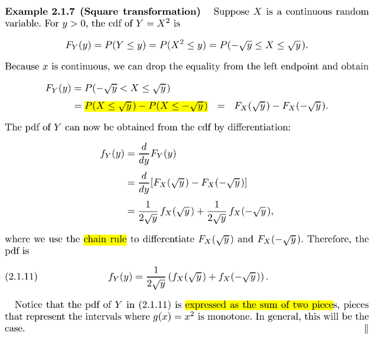</kbd></p>

🔗 **Related:** [5.3 SAMPLING FROM THE NORMAL DISTRIBUTION](53_sampling_from_the_normal_distribution.md#node-360)

> [!NOTE]
> Qua ví dụ này Y `=` g(X) `=` X^2.
>
> Ôn lại lập luận gốc là, xét event Y ∈ A ⇔ g(X) ∈ A, nó bản chất là
>
> {x ∈ `ΩX:` g(x) ∈ A} đây cũng là event X ∈ ginv(A)
>
> Do đó từ X ta có thể xác định distribution của Y `=` g(X)
>
> P(Y ∈ A) `=` P(g(X) ∈ A) `=` P({x ∈ `ΩX:` g(x) ∈ A}) 
>
> Nếu hàm g monotone ⇨ g(x) ∈ A ⇔ x ∈ ginv(A)
>
> `=` P({x ∈ `ΩX:` x ∈ ginv(A)})
>
>  `=` P(X ∈ ginv(A))
>
> ```text
> ⇨ P(Y ≤ y) = P(g(X) ≤ y) = P({x ∈ ΩX: g(x) = x^2 ≤ y})
> ```
>
> `=` P({x ∈ `ΩX:` `-√y` ≤ x ≤ √y})
>
> `=` `P(-√y` ≤ X ≤ √y)
>
> Tới đây, dùng định nghĩa pdf:
>
> ```text
> P(-√y ≤ X ≤ √y) = ∫-√y:√y fX(x)dx.
> ```
>
> ```text
> Dùng FTC1 cho biết: khi F là anti-derivative của f: tức d/dx F(x) = f(x)  thì ∫a:b
> ```
> f(x)dx `=` F(b) `-` F(a).
>
> ```text
> Ở đây với định nghĩa của CDF: FX(x) = P(X ≤ x), dùng pdf, = ∫-inf:x fX(t)dt. Theo
> ```
> ```text
> FTC2, khi G(x) = ∫-inf:x f(t)dt thì d/dx G(x) = f(x). Vậy FTC2 cho ta: d/dx FX(x) =
> ```
> fX(x).
>
> ```text
> Từ đó dùng FTC1, ta có ∫-√y:√y fX(x)dx = FX(√y) - FX(-√y)
> ```
>
> Vậy tới đây ta có FY(y) `=` FX(√y) `-` `FX(-√y)`
>
> Lấy đạo hàm theo y để có pdf:
>
> ```text
> fY(y) = d/dy FY(y) = d/dy [FX(√y) - FX(-√y)]
> ```
>
> ```text
> = d/dy FX(√y) - d/dy FX(-√y)
> ```
>
> ```text
> = d/d√y FX(√y) . d/dy √y - d/d(-√y) FX(-√y) . d/dy (-√y)
> ```
>
> ```text
> = fX(√y) . (1/2)y^(-1/2) - fX(-√y) . (-1/2)y^(-1/2)
> ```
>
> `=` **(1/2√y) fX(√y) `+` `(1/√2y)` fX(-√y)**

<br>

<a id="node-92"></a>

<p align="center"><kbd>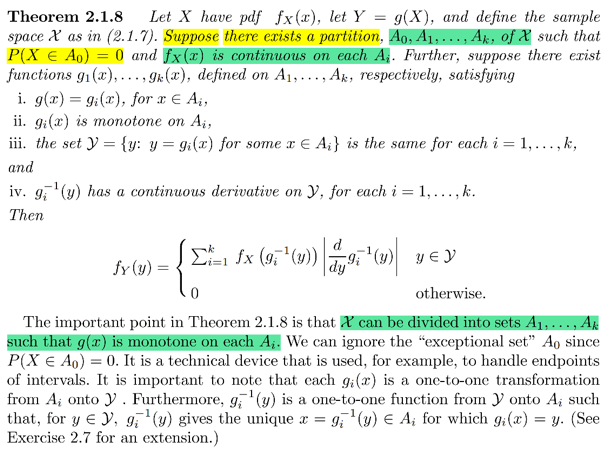</kbd></p>

> [!NOTE]
> Hiểu đại khái là , định lý này nói rằng nếu sample space của X, `X_curly`
> mà có thể chia thành các partition A0, A1,....Ak
>
> Sao cho hàm g(x) `=` g1(x) nếu x ∈ A1, g(x) `=` g2(x) nếu x ∈ A2
>
> Rồi, đặt `Y_curly` là set ảnh của `X_curly:` tức là `Y_curly` là {g(x) với x ∈
> `X_curly)`
>
> và các hàm này đều đơn điệu, tức là mapping `1-1` từ Ai `-` Y
>
> ```text
> Khi đó ta có fY(y) = Σ fX(gi_inv(y)) d/dy |gi_inv(y)| y ∈ Y_curly
> ```
>
> Thử chứng minh xem được ko:
>
> Theo kinh nghiệm từ stat110: Hãy bắt đầu từ cdf P(Y < y)
>
> và xét event Y < y, cũng là g(X) < y
>
> P(Y < y) `=` P(g(X) < y) `=` P({x ∈ `X_curly:` g(x) < y})
>
> `=` `Σ` P({x ∈ Ai: g(x) < y})
>
> ```text
> = Σi=1,2...k  P({x ∈ Ai: g(x) < y}) vì P({x ∈ A0: g(x) < y)} = P(∅) = 0
> ```
>
> ```text
> = Σi=1,2...k  P({x ∈ Ai: gi(x) < y}) vì x ∈ Ai ⇨ g(x) = gi(x)
> ```
>
> `=` `Σi=1,2...k`  P({x ∈ Ai: gi(x) < y})
>
>
> Tới đây ta sẽ lấy đạo hàm theo y:
>
> ```text
> d/dy P(Y < y) = d/dy FY(y) = d/dy Σi=1,2...k  P({x ∈ Ai: gi(x) < y})
> ```
>
> ```text
> = Σi=1,2...k  d/dy P({x ∈ Ai: gi(x) < y})
> ```
>
> `====`
>
> Và ta xét những hạng tử P({x ∈ Ai: gi(x) < y}) với gi monotone increasing
>
> ⇨ gi(x) < y ⇔ x < `gi_inv(y)`
>
> ⇨ P({x ∈ Ai: gi(x) < y}) `=` P({x ∈ Ai: x < `gi_inv(y)})`
>
> ```text
> = ∫Ai ∩ (-inf, gi_inv(y)) fX(x)dx
> ```
>
> Đặt xi `=` `gi_inv(y)` cho gọn
>
> Lấy đạo hàm theo y:
>
> `d/dy` `∫Ai` ∩ `(-inf,` xi) fX(t)dt
>
> ```text
> = [ d/xi ∫Ai ∩ (-inf, xi) fX(t)dt ] [d/dy xi] | chain rule
> ```
>
> ```text
> Xét ∫Ai ∩ (-inf, xi) fX(t)dt , vì xi ∈ Ai nên Ai ∩ (-inf, xi) = (Ai_lower, xi)
> ```
>
> ⇨ `∫(Ai_lower,` xi) fX(t)dt
>
> ```text
> Theo FTC ∫-inf:x fX(t)dt = FX(x) ⇨ ∫-inf:a fX(t)dt = FX(a) = some constant
> ```
> c ⇨ `∫a:x` fX(t)dt `=` FX(x) `+` some constant
>
> ```text
> ⇨ ∫Ai ∩ (-inf, xi) fX(t)dt = ∫(Ai_lower, xi) fX(t)dt = FX(xi) + some constant c
> ```
>
> ```text
> ⇨ d/dxi ∫Ai ∩ (-inf, xi) fX(t)dt = d/dxi [ FX(xi) + some constant c]
> ```
>
> ```text
> = d/dxi FX(xi) + d/dxi [some constant c]
> ```
>
> `=` `d/dxi` FX(xi) `+` 0
>
> `=` fX(xi)
>
> Vậy tóm lại ta có: 
>
> `d/dy` P({x ∈ Ai: gi(x) < y}) với gi monotonic increasing
>
> `=` fX(xi) `d/dy` xi ****= **fX(gi_inv(y)) `d/dy` gi_inv(y)**
>
> `===`
>
> Xét những hạng tử P({x ∈ Ai: gi(x) < y}) với gi monotone decreasing
>
> ⇨ gi(x) < y ⇔ x > `gi_inv(y)`
>
> ⇨ P({x ∈ Ai: gi(x) < y}) `=` P({x ∈ Ai: x > xi})
>
> `=` `∫Ai` ∩ (xi, inf) fX(x)dx
>
> `=` `∫xi:Ai_upper` fX(x)dx
>
> Theo FTC, `=` `FX(Ai_upper)` `-` FX(xi)
>
> ```text
> ⇨ d/dy P({x ∈ Ai: gi(x) < y}) = d/dy [FX(Ai_upper) - FX(xi)]
> ```
>
> ```text
> = d/dy FX(Ai_upper) - d/dy FX(xi)
> ```
>
> ```text
> = 0 - d/dy FX(xi) | do FX(Ai_upper) = constant
> ```
>
> `=` `-` `d/dy` FX(xi)
>
> ```text
> = - d/dxi FX(xi) d/dy xi | chain rule
> ```
>
> `=` `-` fX(xi) `d/dy` xi
>
> =**- `fX(gi_inv(y))` `d/dy` `gi_inv(y)`
>
>
> Vậy, tổng hợp lại, kết quả là**Σ{i:gi đồng biến} `fX(gi_inv(y))` `d/dy` `gi_inv(y)` 
>
> `+` `Σ{j:` gj nghịch biến} `[-fX(gi_inv(y))` `d/dy` gi_inv(y)]****= `Σi` `fX(gi_inv(y))` | `d/dy` `gi_inv(y)` |
>
> `====`
>
> Nếu y không thuộc `Y_curly` thì sao?
>
> LÀM SAU

<br>

<a id="node-93"></a>

<p align="center"><kbd>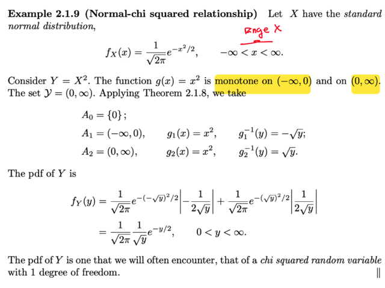</kbd></p>

> [!NOTE]
> Ứng dụng vô đây giúp ta tìm được pdf của Y `=` X^2 với X ~n (0,1)
>
> và như đã biết từ stat110, nó chính là chi squaRed

<br>

<a id="node-94"></a>

<p align="center"><kbd>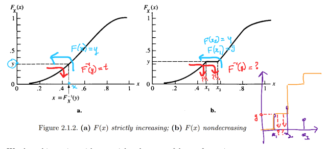</kbd></p>

<p align="center"><kbd></kbd></p>

<p align="center"><kbd>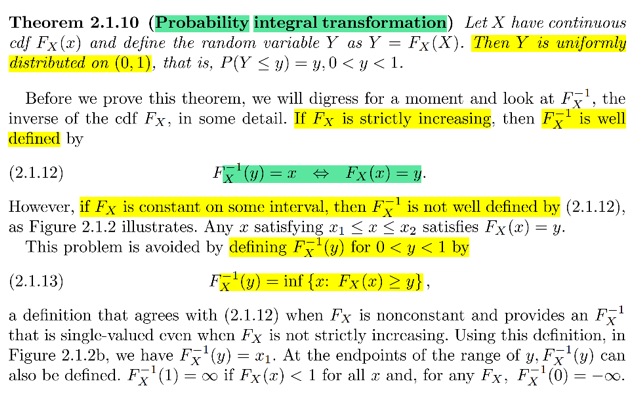</kbd></p>

🔗 **Related:** [5.6 GENERATING RANDOM SAMPLE](56_generating_random_sample.md#node-439)

> [!NOTE]
> Gặp lại một cái đã học trong Stat110 `-` Tính universality của uniform(0,1)
>
> Đại khái nói là: Nếu ta có X là rv ~ FX(x) thì FX(X) sẽ ~ Unif(0,1).
>
> Ngược lại, nếu U ~Unif(0,1) thì X `=` `F_inv(U)` sẽ ~ F (tức có cdf là F)
>
> Thì ở đây chính là nói về phần 1 của universality.
>
> Đại khái ở đây nói là trước khi ta chứng minh theorem này thì có một ý thế
> này:
>
> Đầu tiên hãy nghĩ về bản chất , ý nghĩa của hàm CDF: F(t) `=` P(X ≤ t) cho
> thấy nó sẽ nhận vào một số tùy ý và spit out một con số xác suất. (nói con
> số xác suất ý là gía trị chỉ được nằm trong khoảng [0,1] Và số tùy ý nhận
> vào sẽ định ra một khoảng, và hàm F sẽ spit out bao nhiêu phần trăm xác
> suất mà giá trị của X sẽ nằm trong đó. Nên ví dụ nói F(30) `=` 0.25 thì có
> nghĩa là 25% thời gian giá trị của X sẽ nằm trong khoảng `(-inf,` 30)
>
> Bây giờ, ta sẽ hiểu về hàm Finv: Nó sẽ làm ngược lại: nhận vào một con số
> xác suất, và spit out một con số để định ra một range từ `-inf` đến con số đó,
> nói cách khác, Finv sẽ nhận vào một con số xác suất và  spit out một range
> mà mà xác suất X nằm trong range bằng con số xác suất đưa vào. Ví dụ
> input là 25% thì output là 30, để có nghĩa là xác suất X nằm trong range
> `(-inf,` 30) `=` 25%
>
> Và đây Finv, được gọi là quantile function.
>
> Điều này thể hiện qua, hay giúp ta hiểu cái này:
>
> Finv(y) `=` x ⇔ F(x) `=` y, sẽ nghĩa là:
>
> Đưa con số xác suất (y) vào Finv, nó trả ra cái range `(-inf,` x) mà xác suất  X
> nằm trong đó `(-inf,` x) là y (F(x) `=` P(X ≤ x) `=` y)
>
> Ngược lại
>
> Từ đây cũng giúp ta hiểu các khái niệm như 25% quantile. Đơn giản nó chỉ
> là con số spit out từ Finv khi input là 25%. Như đã nói, nó sẽ định ra một
> range mà 25% thời gian X sẽ nằm trong đó.
>
> Nhờ vậy ta có thể hiểu ngay 25% quantile của unif(0,1) chính là 0.25
>
> Quay lại đây, hiểu như vậy rồi thì sẽ hiểu thế này. CDF F như đã biết chỉ có
> thể increasing hoặc strictly increasing. Vì hình ảnh của CDF là ta vẽ một
> đường vertical và xét diện tích của distribution ở phần bên trái đường đó.
> Thì khi dời trục từ `-inf` đến inf thì diện tích chỉ có thêm chứ ko có bớt.
>
> Còn theo toán học thì FTC cho ta `d/dx` F(x) `=` f(x) mà f(x) tức pdf thì theo
> axiom là luôn không âm, nên với việc `d/dx` F(x) luôn ≥ 0 ∀ x, thì Mean Value
> Theorem (đã học ở MIT 1801) nói rằng F(x) sẽ `non-decreasing`
>
> Thế thì, có hai trường hợp, nếu nó strictly increasing, thì dễ thấy đưa vào
> hai range khác nhau (tức hai con số khác nhau) thì F sẽ spit out hai con số
> xác suất khác nhau. Hình dung hàm mà nó luôn tăng thì không thể có hai
> điểm khác nhau mà có cùng giá trị F được.
>
> Và khi đó, cũng đồng nghĩa là khi đưa vào Finv một con số xác suất khác
> nhau thì hai cái range mà nó trả ra cũng phải khác nhau. Vì nếu không, thì
> có nghĩa là tồn tại cùng range mà lại có hai xác suất khác nhau ⇨ vi phạm
> tính liên tục
>
> Ngược lại, nếu F chỉ increasing nhưng có flat (điều này xảy ra dễ thấy nhất
> là với discrete distribution, khi ta nhớ rằng ở giữa các possible value thì cdf
> đi ngang, và cdf có bước nhảy tại các discrete value). Lúc này nếu input vào
> 2 con số ở đoạn F đi ngang thì F trả ra cùng một con số xác suất. Đồng
> nghĩa có thể xảy ra trường hợp input vào Finv một con số xác suất, và Finv
> KHÔNG BIẾT PHẢI TRẢ RA CÁI RANGE NÀO, vì có nhiều mốc `/` range có
> cùng xác suất.
>
> Do đó, ở đây gs nói, trong trường hợp này, ta có thể định nghĩa của Finv
> khác đi chút xíu, và đại khái nó là vầy, đưa vào một con số xác suất, thì trả
> ra cái range nhỏ nhất mà tương ứng với xác suất đó
>
> Và kí hiệu toán học dùng là infimum:
>
> Theo định nghĩa này thì trong hình b Finv(y) là x1 (là cái nhỏ nhất mà F(x) ≥
> y, vốn dĩ tất cả các x từ x1 tới x2 đều thỏa)  hay range sẽ là `-inf,` x1 thay vì
> mọi range `-inf` x với x từ x1 đến x2 đều có F là y.

<br>

<a id="node-95"></a>

<p align="center"><kbd>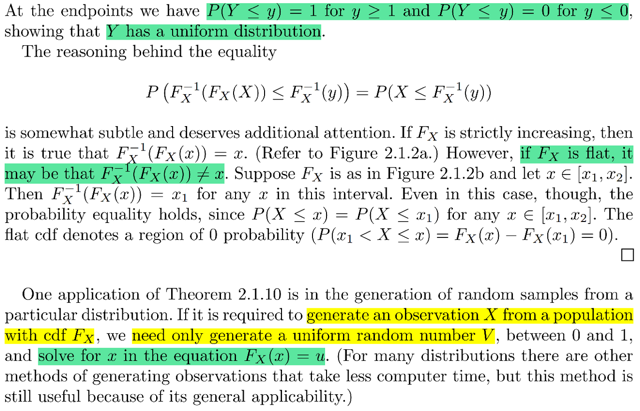</kbd></p>

<p align="center"><kbd></kbd></p>

<p align="center"><kbd>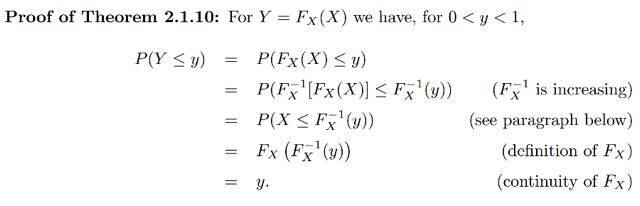</kbd></p>

> [!NOTE]
> Ta sẽ chứng minh Finv là gì rồi thì ta sẽ chứng minh Y `=` FX(X) sẽ ~ Unif(0,1)
>
> ```text
> FY(y) = P(Y ≤ y) = P(FX(X) ≤ y) = P({x ∈ ΩX: FX(x) ≤ y})
> ```
>
> Mà với định nghĩa của FXinv, và với  
>
> F là hàm increasing thì FXinv cũng là
> increasing function.
>
> FX(x) ≤ y ⇔ FXinv(FX(x)) ≤ FXinv(y) 
>
> Tuy nhiên để FXinv(FX(x)) `=` x, ta cần định nghĩa FXinv(t) `=` inf {x: FX(x) `=` t}: 
> Trong hai hình minh họa có thể thấy nếu F strictly increasing thì nếu đi ngược
> lại từ F(x), bằng cách áp dụng hàm Finv, theo mũi tên đỏ thì ta có được x.
> Nhưng nếu F không strictly increasing, như hình b, thì từ F(x) đi ngược lại
> ta không biết ra x nào. Đồng nghĩa FXinv(F(x)) CHƯA CHẮC BẰNG x. 
> Hình dung vầy, x1 `=` 3 ⇨ F(x) `=` 9 nhưng Finv(F(x)) thì chưa chắc bằng 3, mà
> `F(-3)` nó cũng bằng 9.
>
> ⇔ x ≤ FXinv(y)
>
> ⇨ ... `=` P({x ∈ `ΩX:` x ≤ FXinv(y)}) và đây chính là P(X ≤ FXinv(y)) 
>
> mà P(X ≤ FXinv(y)) thì chính là cdf của X evaluate tại FXinv(y)): FX(FXinv(y))
>
> và nó bằng y.
>
> Vậy FY(y) `=` P(Y ≤ y) `=` y. 
>
> ```text
> Tiếp tục, khi y = 1, FY(y) = P(Y ≤ 1) = P({x ∈ ΩX: FX(x) ≤ 1})
> ```
>
> `=` P({x ∈ `ΩX:` FXinv(FX(x)) ≤ FXinv(1)})
>
> Và tới đây nhờ định nghĩa của Finv mà ta có vế trái có thể thành x, như đã
> nói và đồng thời vế phải: FXinv(1), theo định nghĩa đã hiểu về hàm Finv,
> thì nó sẽ spit out một con số a để làm nên một range `(-inf,` a) mà xác suất
> x nằm trong đó là 100%. Hay nói cách khác, số a là số mà x luôn bé hơn
> a.  
>
> Thế thì, con số này chính là `+inf` vì chỉ có range `(-inf,` inf) thì xác suất X nằm 
> trong đó là 1.
>
> Từ đó {x ∈ `ΩX:` FXinv(FX(x)) ≤ FXinv(1)}
>
> ```text
> = {x ∈ ΩX: x ≤ inf} = {x ∈ ΩX} ⇨ FY(1) = P({x ∈ ΩX}) = 1
> ```
>
> Còn với y `=` 0: FY(0) `=` P({x ∈ `ΩX:` FXinv(FX(x)) ≤ FXinv(0)})
>
> ```text
> FXinv(0) theo định nghĩa sẽ là con số α sao cho P(X ∈ (-inf, α)) = 0
> ```
> và nó sẽ bằng `-inf` 
>
> CHỖ NÀY CHƯA HIỂU LẮM
>
> Điều này đã chứng minh Y ~Unif(0,1)

> [!NOTE]
> Ý cuối là nói về ứng dụng của cái này, cũng đã biết từ stat110: đó là, phần
> 2 của universality: Khi U ~ Unif(0,1) thì FX(U) ~ F. Từ đó để sampling sample
> từ một distribution lạ quy định bởi cdf F thì ta chỉ cần sampling từ Unif(0,1)
> và bỏ vào F để có giá trị của X
>
> Mình có thể tự chứng minh
>
> Chứng minh X `=` Finv(U) ~ F:
>
> Xét cdf của X: P(X ≤ x) `=` P(Finv(U) ≤ x)
>
> `=` P(F(Finv(U)) ≤ F(x)) | dùng tính increasing của F
>
> `=` P(U ≤ F(x)) `=` FU(F(x)) 
>
> ```text
> = F(x) | dùng fact: cdf của Unif(0,1) FU(α) = α
> ```
>
> ⇨  vậy P(X ≤ x) `=` F(x) suy ra cdf của X chính là F

<br>

