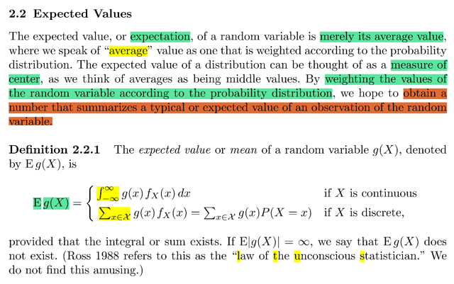
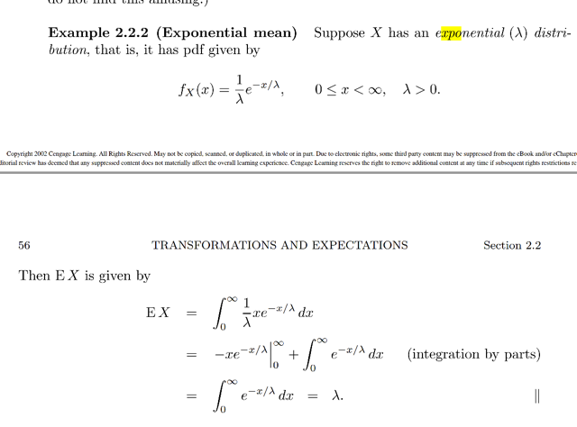
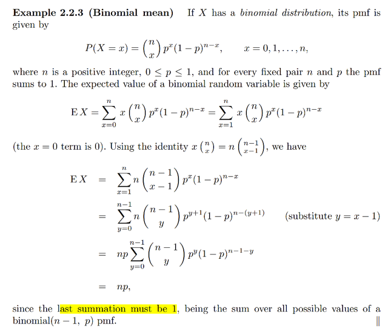
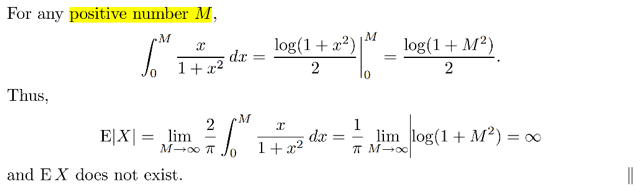
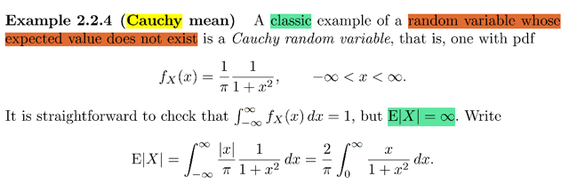
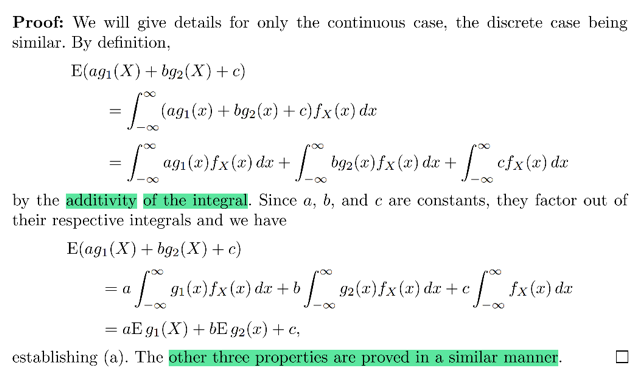
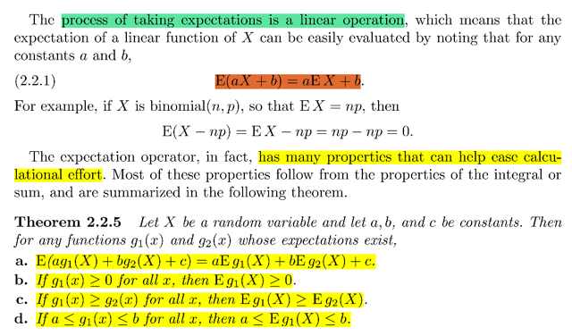
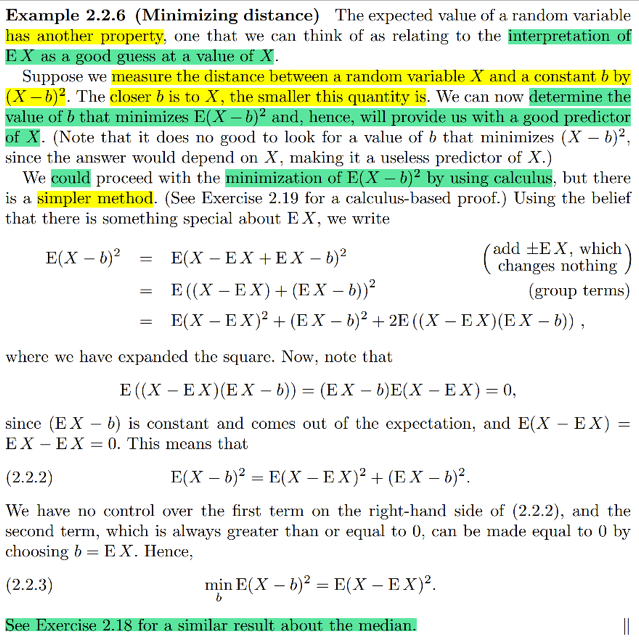
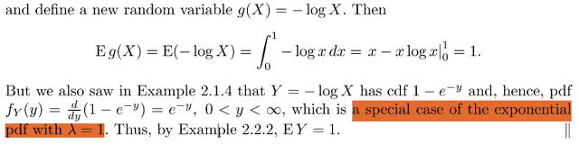
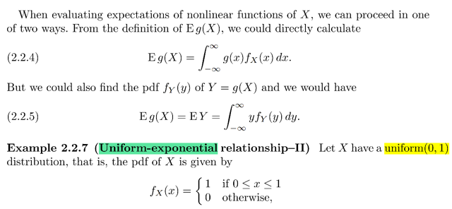

# 2.2 Expected Value

📊 **Progress:** `10` Notes | `13` Screenshots

---
<a id="node-97"></a>

<p align="center"><kbd></kbd></p>

> [!NOTE]
> Từ stat110 mình đã nghe gs Blistein nói về bản chất của expected value
> chỉ là average `/` mean. Là cách ta có một con số summarize thông tin
> của distribution.
>
> Về cụ thể hơn nó là weighted average, các possible values của r.v
> với weight là xác suất tương ứng.
>
> Nên nếu X là discrete r.v có các possible values x1,x2..thì:
>
> EX `=` `Σi` `xP(X=x).` 
>
> Với continuous case thì công thức tương ứng là `∫-inf:inf` xfX(x)dx
>
> Ở đây gs đưa công thức của Eg(X), trong stat110, ta sẽ có thể dùng
> LOTUS (law of unconcious statitician): để tính Eg(X) chỉ cần dùng
> `pdf/pmf` của X thay vì của g(X):
>
> ```text
> Eg(X) = Σi g(x)P(X=x) hoặc ∫-inf:inf g(x)fX(x)dx
> ```

<br>

<a id="node-98"></a>

<p align="center"><kbd></kbd></p>

🔗 **Related:** [2.3 MGF](23_mgf.md#node-106)

> [!NOTE]
> Tính EX của Expo(λ)
>
> ```text
> pdf fX(x) = (1/λ) e^-x/λ (trong stat110 đã biết về cách xây dựng  pdf của
> ```
> expo)
>
> x ≥ 0, λ > 0
>
> ```text
> EX = ∫0:inf x (1/λ) e^-x/λ dx
> ```
>
> Tạm thời bỏ qua cái limit của tích phân trước cho gọn. Ta sẽ dùng
> ```text
> integration by part để tính tích phân này: ∫ x (1/λ) e^-x/λ dx
> ```
>
> Lập luận của i.b.p thì biết rồi, xuất phát từ d(uv) `=` (du)v `+` udv
>
> ```text
> ⇨ ∫d/dx u(x)v(x) = ∫v(x) d/dx u(x) + ∫u(x) d/dx v(x)
> ```
>
> ```text
> u(x)v(x) = ∫v(x)u'(x)dx + ∫u(x) v'(x)dx
> ```
>
> ⇨ **∫u(x) v'(x)dx  `=` u(x)v(x) `-` ∫v(x)u'(x)dx**
>
> ```text
> ∫ x (1/λ) e^-x/λ dx:
> ```
>
> Đặt u(x) `=` x ⇨ u'(x) `=` 1
>
> ```text
> v(x) = e^-x/λ  ⇨ v'(x) = d/dx v(x) = d/dx e^-x/λ
> ```
>
> ```text
> = d/d(-x/λ) e^-x/λ . d/dx (-x/λ)
> ```
>
> ```text
> = e^-x/λ . (-1/λ) = - (1/λ) e^-x/λ
> ```
>
> ```text
> ⇨ - (1/λ) e^-x/λ = - v'(x)
> ```
>
> ```text
> ∫ x (1/λ) e^-x/λ dx = ∫ u(x) [-v'(x)] = - ∫ u(x) v'(x)
> ```
>
> theo i.b.p `=` u(x)v(x) `-` `∫v(x)u'(x)dx`
>
> ```text
> = - [x e^-x/λ - ∫e^-x/λ dx ]
> ```
>
> ```text
> = - x e^-x/λ + ∫e^-x/λ dx
> ```
>
> ```text
> = - x e^-x/λ + (-λ) e^-x/λ dx
> ```
>
> ```text
> (vì - λ e^- x/λ là nguyên hàm của e^-x/λ, do d/dx [- λ e^- x/λ]
> ```
>
> ```text
> = - λ d/dx e^- x/λ = - λ d/d(-x/λ) e^-x/λ . d/dx (-x/λ)
> ```
>
> ```text
> = - λ e^-x/λ . (-/λ) = e^-x/λ )
> ```
>
> ```text
> Rồi vậy ta có - xe^-x/λ - λ e^-x/λ = - (x + λ) e^-x/λ
> ```
>
> Áp dụng cận tích phân vô:
>
> ```text
> EX =  - (x + λ) e^-x/λ | 0: inf
> ```
>
> ```text
> Khi x → inf thì -x → -inf ⇨ e^-x/λ → 0 ⇨ - (x + λ) e^-x/λ → 0
> ```
>
> ```text
> Khi x → 0 thì - (x + λ) e^-x/λ → - λ
> ```
>
> ```text
> Vậy EX = 0 - ( - λ) = λ
> ```

> [!NOTE]
> Stat110 ta đã học về story của Expo: Nó sẽ có câu chuyện như sau:
>
> Thời gian gian chờ đến khi có email tới. Với bối cảnh là: Số email gửi tới trong
> khoảng thời gian [0, t] sẽ tuân theo Poisson(λt), điều này có nghĩa là với fixed value
> λ, thì t càng lớn thì số email nhận được trong khoảng thời gian đó có thể sẽ tăng lên,
> vì khi đó nó là Poisson r.v với rate lớn hơn.
>
> ```text
> Và Poisson rv thì pmf của nó là P(X=k) = e^-λ λ^k / k! λ > 0 và k = 0,1..
> ```
>
> Thế thì để xây dựng distribution cụ thể là cdf của T `=` "thời gian chờ cho đến khi có
> email đầu tiên", như thường lệ ta sẽ bắt đầu với ý nghĩa của CDF: FT(t) `=` P(T ≤ t).
>
> THế thì xét event T ≤ t mang ý nghĩa là, thời gian chờ để nhận email đầu tiên nhỏ
> hơn hoặc bằng t, nói cách khác là trước mốc t đã có email tới thì complement của nó
> đương nhiên là T > t: Phải sau mốc t thì mới có email
>
> Ta sẽ tìm cách thể hiện nó, liên hệ nó với pmf của Poisson.
>
> Vậy thì nói số email nhận được trong khoảng thời gian (0,t) sẽ là một Poisson(λt), thì
> pmf X `=` x sẽ có ý nghĩa là trong khoảng thời gian (0,t) ta nhận được x email.
>
> Từ đó, dễ thấy rằng, event X `=` 0 sẽ có nghĩa là [trong khoảng thời gian 0,t ta chả
> nhận được email nào, và cái này chính là cùng ý nghĩa với event T > t
>
> Vậy (T > t) `=` (X `=` 0)
>
> Bàn thêm một chút về bản chất: Ta nhớ random variable chỉ là function map giữa
> possible outcome trong sample space gốc `Ω` với possible value trong sample space
> mới. Nên:
>
> ```text
> (X = 0) = {s ∈ Ω: X(s) = 0} thì s ở trong tập này chính là mọi khả năng mà khiến trước
> ```
> mốc t chưa có email nào tới, đương nhiên nó sẽ có vô số outcome, ví dụ như email
> tới lúc t `+` 1 giây, hoặc tới túc t `+` 0.000001 giây. Tất cả bọn chúng đều được map với
> 0 bởi X.
>
> Và chú ý rằng X sẽ có distribution tùy thuộc vài t. Tức nếu xét t1, t2 khác nhau thì X1
> ~Poisson(λt1) sẽ có distribution khác X2 ~Pois(λt2).
>
> Thế thì quay lại đây, tất cả những possible outcome trong tập {s ∈ `Ω:` X(s) `=` 0} đều
> cũng sẽ được map bởi T cho ra số > t. Do đó chúng cũng nằm trong tập này: {s ∈ `Ω:`
> ```text
> T(s) > 0}.  Và vì vậy {s ∈ Ω: X(s) = 0} = {s ∈ Ω: T(s) > 0}
> ```
>
> ```text
> Do đó P(T > t) = P(X = 0) (vì bản chất đều là P({s ∈ Ω: X(s) = 0}), hay P({s ∈ Ω: T(s) >
> ```
> 0}), tức là đều quy ra là xác suất của cùng một tập possible outcome trong sample
> space gốc)
>
> Tới đây ta được phép dùng pmf của X ~ Pois(λt): P(X `=` 0) `=` `e^-(λt)` . (λt)^0 `/` 0! `=` **e^-λt**
>
> Vậy P(T < t) `=` 1 `-` P(T > t) `=` **1 `-` e^-λt** , chính là CDF của Expo λ
>
> Để có pdf chỉ việc lấy đạo hàm theo t: Xuất phát từ gốc rễ là đây: Theo định nghĩa
> CDF FT(t) là P(T < t) cũng là `P(-inf` < T < t). Với pdf, và  công cụ tích phân cho phép
> ```text
> ta tính nó bằng ∫-inf:t fT(z)dz. Như vậy FT(t) = ∫-inf:t fT(z)dz. Thế rồi, FTC 2 nói rằng:
> ```
> Hễ khi nào ta có hàm G(x) định nghĩa bởi `∫a:x` f(z)dz thì `d/dx` G(x) `=` f(x). Vậy theo
> FTC 2 ta có `d/dt` FT(t) `=` fT(t). Và như vậy ta có quyền đạo hàm theo t của FT để có
> pdf fT
>
> ```text
> d/dt FT(t) = d/dt (1 - e^-λt) = d/dt -e^-λt = - d/dt e^-λt = - [d/d e^-λt  e^-λt] . [d/dt -λt]
> ```
>
> (chain rule)
>
> `=` `-` `e^-λt` `(-λ)` `=` **λ `e^(-λt)`
>
> Vậy fT(t) `=` λ `e^(-λt)`
>
> Ở ĐÂY CÓ CHÚ Ý DỄ GÂY LÚ: TRONG STAT110, GIÁO SƯ BLISTEINT DÙNG
> CÁCH NOTION LÀ Expo(λ) sẽ có pdf là `λe^(-λt)` như mình vừa làm.
>
> CÒN TRONG SÁCH CASELLA BERGER THÌ NOTATION KHÁC, là HỌ GỌI `Expo(β)`
> sẽ có pdf là `(1/β)` e^(-t/β)**Khác biệt là: theo stat110, λ là rate: là xác suất xảy ra của event trong bối cảnh là có
> rất nhiều trial nhưng tỉ lệ xảy ra thấp. Giống như trong câu chuyện chờ email thì λ 
> là xác suất email gửi đến trong một đơn vị thời gian. Để rồi N(t) là số email nhận được
> trong khoảng thời gian (0, t) sẽ tỉ lệ thuận với thời gian: thời gian càng dài xác suất nhận
> được email càng lớn. N(t) là một Pois(λt)
>
> ```text
> Còn khi ghi theo Casella Pois(β) có pdf = (1/β) e^-t/β thì β là scale factor,  = 1/rate = 1/λ
> ```
>
> Thành ra nếu theo Stat110 thì mean sẽ là `1/λ`
>
> Còn theo Casella thì mean là `β`
>
> ```text
> Và cdf khi đó là F(x) = 1 - e^-x/λ
> ```

<br>

<a id="node-99"></a>

<p align="center"><kbd></kbd></p>

> [!NOTE]
> Trong Stat110 mình đã biết tới vài cách để tính mean của Bin(n, p)
> mà cách dễ nhất chính là:
>
> Dùng story của X~Bin(n,p) là `Σ` của n Bern(p) i.i.d indicator random
> variable I1, I2,....In
>
> ```text
> Do đó EX = E(Σi Ii) dùng linearity = Σi EIi và với Bern(p) rv, EIi = p
> ```
> ```text
> (dễ chứng minh: EIi = 1*p + 0*(1-p) = p)
> ```
>
> Vậy EX `=` `Σi` p `=` np
>
> Cách hai là dùng công thức của EX:
>
> ```text
> fX(x) = P(X = x) = (n choose x) p^x q^(1-x)
> ```
>
> Lập luận cực nhanh pmf của Bin(n, p): `(X=x)` là event "trong n Bern
> trial có k success, `n-x` failure. Nên nó là intersection của của n event
> này. Mà chúng độc lập nên P `=` tích P. với k event success có xác suất
> xảy ra là p, còn `n-x` event failure có xác suất q. Nhưng có tới n choose x
> cách chọn một bộ vị trí của các success event.
>
> EX `=` `Σx` x(n choose `x)p^xq^(n-x)`
>
> Dùng identity x(n choose x) `=` `(n)(n-1` choose `x-1):` Cái này story proof
> là: Để có n người, và ta muốn đếm số cách thực hiện việc chọn 
> group có k người với một leader mỗi group.
>
> Cách 1: Chọn một group có k người: Có (n choose k) cách chọn set 
> k người. Với mỗi cách chọn group đều có k cách chọn leader. 
> ⇨ có (n choose k)k cách
>
> Cách 2: Chọn leader trước: có n cách. Sau đó chọn `k-1` người để tạo
> ```text
> group: Có (n-1 choose k-1) cách chọn. ⇨ n(n-1 choose k-1) cách
> ```
>
> Và dĩ nhiên kết quả phải bằng nhau: (n choose k)k `=` `n(n-1` choose `k-1)`
>
> `====`
>
> ```text
> Vậy Σx=0:n n(n-1 choose x-1)p^x(1-p)^(n-x)
> ```
>
> Tới đây đặt y `=` x `-` 1
>
> ```text
> Σy=1:n-1 n(n-1 choose y)p^(y+1)(1-p)^(n-1-y)
> ```
>
> `=` np **Σy=1:n-1 `(n-1` choose y)p^y(1-p)^(n-1-y)**
>
> Tới đây có hai cách: 
>
> ```text
> C1: Áp dụng nhị thức newton: (a + b)^n = Σk=0:n (n choose k)a^n-kb^k
> ```
>
> ```text
> ⇨ Σy=1:n-1 (n-1 choose y)p^y(1-p)^(n-1-y) chính là a = p, b = 1 - p
> ```
>
> ```text
> và = (p + 1 - p)^n-1 = 1
> ```
>
> ```text
> C2: Để ý (n-1 choose y)p^y(1-p)^(n-1-y) chính là pmf của Y~Bin(n-1, p)
> ```
> ```text
> và Σy=1:n-1 (n-1 choose y)p^y(1-p)^(n-1-y) là tổng pmf của Y ở mọi
> ```
> possible values (các Y `=` X `-` 1 sẽ có possible values từ 1, 2...k
>
> Kết quả là `=` np

<br>

<a id="node-100"></a>

<p align="center"><kbd></kbd></p>

<p align="center"><kbd></kbd></p>

<p align="center"><kbd></kbd></p>

🔗 **Related:** [5.5 CONVERGENCE CONCEPTS](55_convergence_concepts.md#node-430)

> [!NOTE]
> Một cái mà stat110 gs Blizstein đã từng đề cập là với Cauchy distribution
> nó là cái distribution quỷ quái với nhiều đặc điểm kì cục. Một trong số đó
> là ko tồn tại mean.
>
> ```text
> pdf của nó là fX(x) = (1/π) 1/(1 + x^2),  x ∈ (-inf: inf)
> ```
>
> (QUAY LẠI SAU ĐỂ CHỨNG MINH PDF CỦA CAUCHY VỐN TRONG
> STAT110 HƠI RẮC RỐI)
>
> Đoạn chứng minh `E|X|` `=` inf cũng dễ hiểu, nhưng CHƯA HIỂU TẠI
> SAO LẠI TÍNH `E|X|` MÀ KO TÍNH EX

> [!NOTE]
> QUAY LẠI SAU

<br>

<a id="node-101"></a>

<p align="center"><kbd></kbd></p>

<p align="center"><kbd></kbd></p>

<p align="center"><kbd></kbd></p>

> [!NOTE]
> Trong stat110 đã biết tính linearity của expectation và còn các tính chất
> khác  mà phần lớn đều xuất phát từ tính chất của integral hoặc `Σ`
>
> Chứng minh rất đơn giản, chỉ dựa vào tính additivity của integral (với
> contiunous rv)  cũng như `Σ` (với discrete rv)

<br>

<a id="node-102"></a>

<p align="center"><kbd></kbd></p>

> [!NOTE]
> Đại khái là ở đây nói về MỘT CÁCH NHÌN NHẬN nữa về EX: Đó là CON SỐ
> DỰ ĐOÁN TỐT NHẤT CHO X.
>
> Vì sao vậy, đó là vì giả sử ta cho một con số b, và tính khoảng cách từ nó
> đến X bằng (X `-` b)^2 (ta sẽ bình phương vì không muốn ảnh hưởng vấn
> đề về dấu, ta có thể dùng trị tuyệt đối nhưng có quyền dùng bình phương)
> Vậy thì, nếu b CÀNG GẦN X, THÌ RÕ RÀNG DISTANCE NÀY SẼ CÀNG 
> NHỎ và khi đó b sẽ càng predict tốt cho x 
>
> Vậy nếu ta chứng minh EX là cái khiến minimize cái distance này, thì ta đã
> chứng minh là EX là cái predict tốt nhất cho X.
>
> ```text
> Do đó bài toán sẽ là: minimize E[(X - b)^2] / Chú ý E[(X - b)^2] sẽ chỉ phụ thuộc
> ```
> b, chứ nếu minimize (X `-` b)^2 thì nó có phụ thuộc X nữa. (tạm hiểu vậy)
>
> Thử làm theo Calculus:
>
> Assume X là discrete rv.: 
>
> ```text
> Vậy ta đối diện hàm f(b) = E[(X - b)^2] = Σx (x - b)^2fX(x) | fX là pmf
> ```
>
> ```text
> d/db f(b) = d/db [Σx (x - b)^2fX(x)] = Σx d/db (x - b)^2fX(x)
> ```
>
> ```text
> = Σx fX(x) d/db (x - b)^2 = Σx fX(x) d/d(x - b) (x - b)^2 . d/db (x - b)
> ```
>
> ```text
> = Σx fX(x) 2(x - b) . (-1) = -2 Σx fX(x) (x - b)
> ```
>
> ```text
> Optimality condition: d/db f(b) = 0 ⇔ -2 Σx fX(x) (x - b)  = 0
> ```
>
> ```text
> ⇔ Σx fX(x) (x - b) = 0 ⇔ Σx [fX(x)x - fX(x)b] = 0
> ```
>
> ```text
> ⇔ Σx fX(x)x - Σx fX(x)b = 0
> ```
>
> ⇔ `Σx` fX(x)x `=` `Σx` fX(x)b 
>
> ⇔ `Σx` fX(x)x `=` b `Σx` fX(x) 
>
> ⇔ EX `=` b . 1 | `Σx` fX(x)  `=` 1 do tính valid của pmf, còn vế trái chính là EX
>
> Với continuous:
>
> ```text
> f(b) = E[(X - b)^2] = ∫-inf:inf (x - b)^2fX(x)dx | fX là pdf
> ```
>
> ```text
> d/db f(b) = d/db ∫-inf:inf (x - b)^2fX(x)dx
> ```
>
> và stat110 đã biết ta có thể đưa đạo hàm vào trong tích phân khi có `well-behave`
> function (ở đây assum fX là như vậy)
>
> ```text
> = ∫-inf:inf [d/db (x - b)^2fX(x)] dx
> ```
>
> ```text
> = ∫-inf:inf [fX(x) d/db (x - b)^2] dx
> ```
>
> ```text
> = ∫-inf:inf [fX(x) 2(x - b) (-1)] dx
> ```
>
> ```text
> = -2 ∫-inf:inf [fX(x) (x - b)] dx
> ```
>
> ```text
> = -2 ∫-inf:inf [fX(x)x - fX(x)b] dx
> ```
>
> ```text
> d/db f(b) = 0 ⇔ -2 ∫-inf:inf [fX(x)x - fX(x)b] dx = 0
> ```
>
> ```text
> ⇔  ∫-inf:inf [fX(x)x - fX(x)b] dx = 0
> ```
>
> ```text
> ⇔  ∫-inf:inf fX(x)xdx - ∫-inf:inf fX(x)b dx = 0
> ```
>
> ```text
> ⇔  ∫-inf:inf fX(x)xdx = ∫-inf:inf fX(x)b dx
> ```
>
> ```text
> ⇔  EX = b ∫-inf:inf fX(x) dx  = b Chứng minh xong.
> ```
>
> Còn ở trong sách thì cách làm rất đơn giản cũng cho thấy b khiến f(b) nhỏ
> nhất chính là EX

> [!NOTE]
> QUAY LẠI SAU VỚI MEDIAN

<br>

<a id="node-103"></a>

<p align="center"><kbd></kbd></p>

<p align="center"><kbd></kbd></p>

<p align="center"><kbd></kbd></p>

> [!NOTE]
> Đoạn này nói điều quá dể hiểu sau khi học stat110, tính Eg(X) dĩ nhiên
> là ta có thể tìm pdf `/` pmf của Y `=` g(X) rồi tính EY. Nhưng lotus cho phép ta
> chỉ việc tính Eg(X) với pdf `/` pmf của X
>
> Ở đây có ví dụ đơn giản. tính Eg(X) `=` `E` `-log(X)` với X ~ unif(0,1)
> thì cách đầu tiên là dùng lotus: Eg(X) `=` `∫-inf:inf` g(x)fX(x)dx
>
> `=` `∫0:1` `-log(x).1.dx` 
>
> Tới đây ta sẽ dùng integration by part để tính. Về i.b.p thì không có cách
> gì tốt hơn là lập luận nguồn gốc của nó:
>
> Đó là từ việc tính đạo hàm của tích: (uv)' `=` u'v `+` uv'
>
> Hay thể hiện rõ hơn nếu u,v là hàm theo x:
>
> ```text
> d/dx [u(x)v(x)] = [d/dx u(x)] v(x) + u(x) [d/dx v(x)]
> ```
>
> hay (uv)'(x) `=` u'(x)v(x) `+` u(x)v'(x)
>
> Thể hiện dạng vi phân: d(uv) `=` du v `+` v du
>
> Thế thì tích phân hai vế của 1:
>
> ```text
> ∫[d/dx u(x)v(x)]dx = ∫{[d/dx u(x)]v(x) + u(x)[d/dx v(x)]}dx
> ```
>
> ```text
> ∫[d/dx u(x)v(x)]dx = ∫[d/dx u(x)]v(x)dx + ∫u(x)[d/dx v(x)]dx
> ```
>
> Vế trái đương nhiên sẽ là u(x)v(x). Vì sao? vì theo định nghĩa nguyên
> hàm: `∫f(x)dx` sẽ là hàm G(x) sao cho `d/dx` G(x) `=` f(x). 
>
> Vậy ta có:
>
> ```text
> u(x)v(x) = ∫u'(x)v(x)dx + ∫u(x)v'(x)dx
> ```
>
> ⇔ **∫u(x)v'(x)dx `=` u(x)v(x) `-` `∫u'(x)v(x)dx` 
>
> ```text
> ∫udv = uv - ∫vdu
> ```
>
> Đây chính là công thức của integration by part**Vậy áp dụng vào đây ta đang cần tính `-` `∫0:1` log(x) 1 dx 
>
> Đặt u(x) `=` log(x) ⇨ u'(x) `=` `1/x` 
>
> và v(x) `=` x ⇨ v'(x) `=` 1 khi đó tích phân cần tìm
>
> ```text
> chính là ∫log(x)dx (= ∫u(x)v'(x)dx) = log(x).x - ∫ (1/x) x dx
> ```
>
> `=` log(x).x `-` `∫dx`
>
> ```text
> Vậy ∫log(x)dx = xlog(x) - ∫dx
> ```
>
> ```text
> Thay cận vào ∫0:1 log(x)dx = xlog(x)|0:1 - ∫0:1dx = xlog(x)|0:1 - x|0:1
> ```
>
> `=` 1.log(1) `-` 1 `=` 0 `-` 1 `=` **-1
>
> Nhớ là còn số `-1` ở trước nên kết quả là 1**
> Vậy `E` `(-log(X))` `=` 1
>
> Kết quả này có thể diễn giải cách khác:
>
> ```text
> đó là Y = -log(X) thì Y có cdf là F(Y(y) = 1 - e^-y
> ```
>
> ```text
> nên pdf fY(y) = d/dy F(y) = d/dy (1 - e^-y) = - d/d(-y) e^-y . d/dy -y
> ```
>
> ```text
> = - (e^-y) (-1) = e^-y
> ```
>
> Và kết quả này cho thấy Y ~ Expo(1) vì Expo(λ) có pdf fY(y) `=` **λ(e^-y)**.
>
> Và với Expo(λ) ta đã chứng minh expected value của nó chính là λ
>
> Để chứng minh thì cũng tính 
>
> Do đó ở đây EY `=` 1

<br>

