# 2.3 MGF

📊 **Progress:** `18` Notes | `35` Screenshots

---

<kbd>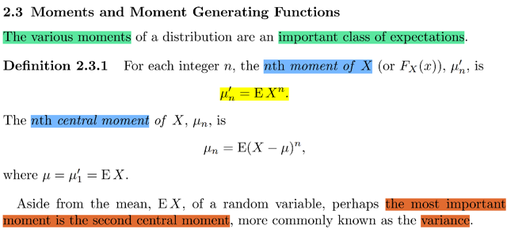</kbd>

> [!NOTE]
> Trong stat110 ta đã học về MGF với những kiến thức đại khái như sau
>
> Công thức của nó, hay định nghĩa của nó là M(t) = Ee^tX
>
> Và cái tên của nó - moment generating function là bởi nó giúp ta tính ra
> moments của biến X. Còn nhớ, cụ thể là đạo hàm bậc n của M(t) chính là
> moment bậc n. HOặc dùng Taylor expand hàm M(t) thì  hệ số của hạng tử
> thứ n chính là moment bậc n.
>
> Ở đây đầu tiên gs Casella nói về khái niệm moment bậc n của X. kí hiệu
> là μ'n, được định nghĩa là EX^n.
>
> Bên cạnh đó còn có cái gọi là CENTRAL moment bậc n, kí hiệu là E(X - μ)^n
>
> Mà cái quan trọng nhất chính là central moment bậc 2: E(X - EX)^2, cái này
> như đã biết chính là Var(X)

 

<kbd>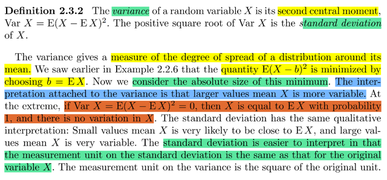</kbd>

🔗 **Related:** [2.2 EXPECTED VALUE](22_expected_value.md#node-98)

> [!NOTE]
> nói về định nghĩa của variance, như đã biết ở stat110, variance là cách 
> người ta đo độ phân tán dispersion của các possible value của X. Trong
> stat110 lập luận là ta có thể dùng E(X - EX). Tuy nhiên cái này sẽ bằng 0
> vì các giá trị đối nghịch dấu nhau sẽ cancel nhau. Nên ta có thể dùng 
> trị tuyệt đối, tuy nhiên cách làm này khiến hàm không khả vi,do đó người
> dùng bình phương: Var(X) = E[(X - EX)^2] và để đưa nó về cùng unit
> với X, ta sẽ dùng standard deviation SD(X) = √Var(X)
>
> Ở đây gs Casella nhắc lại về ý nghĩa của variance giúp đo độ phân tán.
> để rồi Var(X) càng lớn thì có nghĩa là X biến động nhiều (possible value của
> nó khác nhau nhiều). Nếu Var(X) = 0, tức là nó không biến động gì cả,
> và công thức cũng cho thấyd điều này E[(X - EX)^2] = 0 ⇔ X = EX, ⇨ giá
> trị của X là cố định

 

<kbd>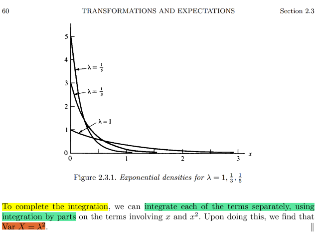</kbd>

<kbd></kbd>

<kbd>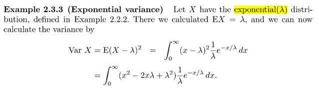</kbd>

> [!NOTE]
> Ta đã biết mean của Expo(λ) là λ. 
>
> (Chú ý là với notion trong sách Casella thì Expo(λ) thì pdf = (1/ λ) e^ -t/ λ 
> và tính ra mean sẽ là λ)
>
> Từ đó ta có thể tính VarX = E(X - λ)^2 theo LOTUS:
>
> = ∫0:inf (t - λ)^2 (1/λ) e^(-t/λ) dt
>
> = (1/λ) ∫0:inf (t^2  - 2tλ + λ^2) e^(-t/λ) dt
>
> = (1/λ) [ **∫0:inf t^2 e^(-t/λ) dt** + **∫0:inf (-2tλ) e^(-t/λ) dt** + **∫0:inf λ^2 e^(-t/λ) dt**]
>
> ====
>
> Tính cái thứ **3**: ∫0:inf λ^2 e^(-t/λ) dt 
>
> = λ^2 ∫0:inf e^(-t/λ) dt
>
> = λ^2 ∫0:inf  e^(-t/λ) dt 
>
> = λ^2 [-λe^(-t/λ)]0:inf  
>
> = λ^2 [-λ [e^(-t/λ)]0:inf ] 
>
> t → inf ⇨ e^(-t/λ) → 0; t → 0 ⇨ e^(-t/λ) → 1
>
> ⇨ .. = λ^2 (-λ) (-1) = λ^2 λ =**λ^3.** 
>
> Term 3 = λ^3
>
> Và ta sẽ dùng lại kết qủa: **∫0:inf e^(-t/λ) dt = λ**
>
>
> ====
>
> Tính cái thứ **2**: ∫0:inf (-2tλ) e^(-t/λ) dt
>
> = -2λ  ∫0:inf t e^(-t/λ) dt
>
> Xét ∫0:inf t e^(-t/λ) dt: Dùng i.b.p:
>
> Đặt u(t) = t ⇨ u'(t) = 1 
>
> v(t) = -λ e^(-t/λ) ⇨ v'(t) = e^(-t/λ)
>
> ⇨ ∫0:inf e^(-t/λ) t dt = t [-λ e^(-t/λ)]|0:inf - ∫0:inf -λ e^(-t/λ) .1.dt
>
> = -λt e^(-t/λ)|0:inf - (-λ) ∫0:inf e^(-t/λ) dt
>
> = -λt e^(-t/λ)|0:inf - (-λ) λ | Xài lại kết quả ở trên 
>
> = -λt e^(-t/λ)|0:inf + λ^2
>
> Khi t → inf ⇨ -λt e^(-t/λ) → 0 do  e^(-t/λ) → e^-inf = 0
>
> Khi t → 0 ⇨ -λt e^(-t/λ) → 0 
>
> nên kết qủa **∫0:inf t e^(-t/λ) dt = λ^2**, và term 2 = -2λ λ^2****
> ====
>
> Tính cái thứ **1**: ∫0:inf t^2 e^(-t/λ) dt
>
> Đặt u(t) = t^2 = u'(t) = 2t
>
> v(t) = - λ e^-t/λ ⇨ v'(t) = e^-t/λ
>
> ⇨ ∫0:inf t^2 e^(-t/λ) dt (= ∫0:inf v'(t) u(t) dt) = u(t)v(t)|0:inf - ∫0:inf v(t)u'(t)dt
>
> = t^2 (-λ e^-t/λ) |0:inf - ∫0:inf (-λ e^-t/λ) 2t dt
>
> = t^2 (-λ e^-t/λ) |0:inf  + 2λ ∫0:inf (e^-t/λ) t dt
>
> = t^2 (-λ e^-t/λ) |0:inf  + **2λ λ^2**| Dùng kết quả ∫0:inf t e^(-t/λ) dt = **λ^2**
>
> Khi t → inf ⇨ t^2 (-λ e^-t/λ) → 0
>
> Khi t → 0 ⇨ t^2 (-λ e^-t/λ) ⇨ 0
>
> Kết quả term 3 là **2λ λ^2**
>
> Tổng hợp lại:
>
> = (1/λ)[ 2λ λ^2  - 2λ λ^2 + λ^3] = (1/ λ) (λ^3) = **λ^2**

 

<kbd>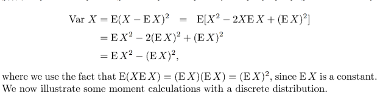</kbd>

<kbd></kbd>

<kbd>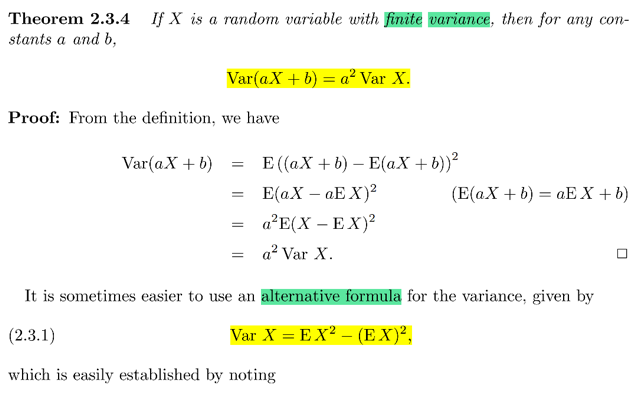</kbd>

> [!NOTE]
> Tiếp là tính chất của variance, stat110 đã biết. Var(c + X) =
> Var(X) và Var(cX) = c^2 Var(X)
>
> Chứng minh rất đơn giản:
>
> Var(c + X) theo công thức = E[(c + X) - E(c+X)]^2 
>
> = E[c + X - Ec - EX]^2 = E[X - EX]^2 = Var(X) | Ec = c do c
> là constant
>
> Var(cX) = E[cX - E(cX)]^2 = E[cX - cEX]^2 = E[c^2[X - EX]^2] 
>
> = c^2E[X - EX]^2 = c^2 Var(X)
>
> ====
>
> Và công thức thứ hai của Var(X) xuất phát từ
>
> VarX = E[X - EX]^2 = E[X^2 -2XEX + (EX)^2]
>
> = E[X^2] -E[2XEX] + E[(EX)^2] | do linearity
>
> = EX^2 - 2EXEX + (EX)^2
>
> = **EX^2 - (EX)^2**

 

<kbd>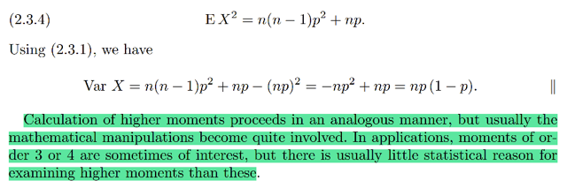</kbd>

<kbd></kbd>

<kbd>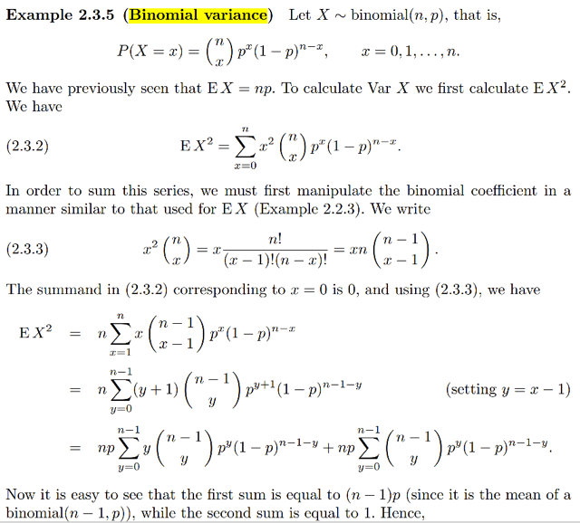</kbd>

> [!NOTE]
> Thử tính Variance của X ~ Bin(n, p)
>
> Trong stat110 mình đã học tới 3 cách để tính Var(X) của Bin(n, p).
>
> Một cách khác chính là dựa vào story của X là tổng của n iid Bern(p)
> indicator rv Ij. Và mgf của tổng hai independent rv bằng TÍCH mgf
> Nên ta sẽ tính mgf của Bern(p):
>
> M(t) = E[e^tX] (X ~ Bern(p))
>
> Theo LOTUS, Eg(X) = Σx g(x)P(X=x) = e^(t*1)P(X=1) + e^(t*0)P(X=0)
>
> = pe^t + q
>
> Do đó, mgf của Y = TÍCH n Bern(p) rvs sẽ là Πi=1:n (pe^t + q) 
>
> = (pe^t + q)^n
>
> Để tính VarY ta chỉ việc tính 2nd moment: EY^2 để ráp vào công thức
> VarY = EY^2 - (EY)^2 với EY đã biết bằng np
>
> d/dt (pe^t + q)^n = d/d(pe^t + q) (pe^t + q)^n . d/dt (pe^t + q)
>
> = n(pe^t + q)^(n-1) pe^t
>
> Đạo hàm lần nữa:
>
> d/dt [n(pe^t + q)^(n-1) pe^t]
>
> = n d/dt [(pe^t + q)^(n-1)] . pe^t + n(pe^t + q)^(n-1) . d/dt [pe^t]
>
> = n (n-1) [(pe^t + q)^(n-2)] . pe^t . pe^t + n(pe^t + q)^(n-1) . pe^t
>
> Tại t = 0
>
> = n (n-1) [(pe^0 + q)^(n-2] . pe^0 . pe^0 + n(pe^0 + q)^(n-1) . pe^0
>
> = n (n-1) [(p + q)^(n-2)] . p^2 + n(p + q)^(n-1) . p
>
> = n (n-1) [(1)^(n-2)] . p^2 + n(1)^(n-1) . p
>
> = n (n-1) p^2 + np
>
> ⇨ VarY = n (n-1) p^2 + np - (np)^2 
>
> = nnp^2 - np^2 + np - (np)^2  = n^2p^2 - np^2 + np - n^2p^2 
>
> = - np^2 + np = np(1-p) = **npq**

> [!NOTE]
> Cách dễ nhất là dùng tính chất độc lập của các Bern(p) indicator r.v
>
> Đại khái là xuất phát từ công thức của Cov(X, Y) = E[(X-EX)(Y-EY)]
>
> Nếu X, Y độc lập thì E(XY) = ∫∫ xyfXY(x,y)dxdy
>
> = ∫∫ xyfX(x)fY(y)dxdy | do X, Y độc lập thì joint pdf bằng tích marginal pdf
>
> = ∫∫ xfX(x)yfY(y)dxdy | sắp xếp lại
>
> = ∫xfX(x)dx ∫yfY(y)dy | tính tích phân theo y trước, đưa x ra ngoài
>
> = EXEY
>
> Cov(X, Y) = E[(X-EX)(Y-EY)]. Nếu X, Y độc lập thì X-EX và Y-EY cũng
> độc lập do đó E[(X-EX)(Y-EY)] = E(X-EX)E(Y-EY) theo cái tính chất trên
>
> Và  E(X-EX) và E(Y - EY)thì đều bằng 0 
>
> Do đó nếu X, Y độc lập thì covariance bằng 0.
>
> ===
>
> Tiếp ta đã biết Var(X) = E[(X-EX)^2], và nó cũng chính là
>
> E[(X - EX)(X - EX)], soi chiếu theo công thức của Cov(X,Y) = E[(X - EX)(Y - EY)]
>
> thì ta thấy E[(X - EX)(X - EX)] CHÍNH LÀ Cov(X, X)
>
> Vậy Var(X) = Cov(X, X)
>
> Từ đó Var(X + Y) = Cov(X + Y, X + Y)
>
> Và ta mới dùng tính chất của bilinearity (tức là giữ một bên thì bên còn lại 
> tuyến tính) 
>
> Cov (A + B, C + D)
>
> = Cov(A, C + D) + Cov(B, C + D)
>
> = Cov(A, C) + Cov(A, D) + Cov(B, C) + Cov(B, D)
>
> Vậy Cov(X + Y, X + Y) = Cov(X + Y, X) + Cov(X + Y, Y) 
>
> = Cov(X, X) + Cov(Y, X) + Cov(X, Y)  + Cov(Y, Y) 
>
> = Cov(X, X) + 2Cov(X, Y)  + Cov(Y, Y) 
>
> **Vậy Var(X +Y) = Var(X) + Var(Y) + 2 Cov(X, Y)
>
> Ta mới dùng tiếp kết quả ở trên là khi X, Y độc lập thì Cov(X, Y) = 0
>
> Vậy khi đó Var(X + Y) = Var(X) + Var(Y)**====
>
> Áp dụng điều này vào bài toán tính Variance của X ~ Bin(n, p), thì X là tổng
> của n indicator rv Bern(p) iid
>
> ⇨ Var(X) = Var(Σj-1:n Ij) = Σj Var(Ij) 
>
> =Xét variance của Ij ~ Bern(p), tính EIj^2 = 1^2p + 0^2.q = p
>
> ⇨ Var(Ij) = EIj^2 - (EIj)^2 = p - p^2 = p (1-p) = **pq
>
> Vậy Var(X) = Σj Var(Ij) = Σj=1:n pq = npq
>
> Cái điểm mấu chốt ở đây là dùng sự thạt rằng nếu X, Y đoc lập thì Var tổng
> bằng tổng Var. Mà muốn vậy thì phải: 
>
> 1) Xây dựng công thức Var(X + Y) 
>
> 2) Chứng minh X, Y đoc lap thì Cov bằng 0**

> [!NOTE]
> Cách thứ 3 là xài định nghĩa và pmf:
>
> pmf của Bin(n, p) : P(X=k) = (n choose k) p^kq^(n-k)
>
> Để tính Var(X) ta cần tính EX^2:
>
> Dùng LOTUS = Σk k^2 (n choose k) p^kq^(n-k)
>
> Dùng identity: k(n choose k) = n(n-1 choose k-1)
>
> (ôn nhanh: Đó là số possible outcome khi chọn một group k người và thủ lĩnh
> của nó từ n người. Có hai cách làm: 
>
> A) 1) Chọn group trước: có (n choose k) cách. 2) Chọn thủ lĩnh của nó: có k cách 
> ⇨ (n choose k)k. 
>
> B) 1) Chọn thủ lĩnh trước: có n cách 2) Chọn k-1 người bỏ vào thành group: Có
> (n - 1 choose k - 1) cách. ⇨ n(n-1 choose k-1)
>
> Vậy hai cái đó bằng nhau.
>
> Quay lại đây Σk k^2 (n choose k) p^kq^(n-k) = Σk k n(n-1 choose k-1) p^kq^(n-k)
>
> = Σk k n(n-1 choose k-1) p^kq^(-k)
>
> = n Σk k (n-1 choose k-1) p^kq^(n-k) | Đưa n ra
>
> = n Σk=0,1..n k (n-1 choose k-1) p^kq^(n-k)
>
> = n Σk=1,2..n k (n-1 choose k-1) p^kq^(n-k) | vì k = 0 thì hạng tử cũng = 0
>
> Đăt y = k-1 
>
> = n Σy=0,1..,n-1 (y+1) (n-1 choose y) p^(y+1)q^(n-y-1)
>
> = np Σy=0,1..,n-1 (y+1) (n-1 choose y) p^(y)q^(n-y-1)
>
> = npΣy=0,1..,n-1 y (n-1 choose y) p^(y)q^(n-y-1) + 
>
> np Σy=0,1..,n-1 (n-1 choose y) p^(y)q^(n-y-1)
>
> = np [Expected value của một Bin(n-1, p)] + np [Σ mọi PMF của rv ~ Bin(n-1,p)]
>
> = **np [(n-1)p] + np . 1
>
> ⇨ VarX = n(n-1)p^2 + np - (np)^2 = npq**

 

<kbd>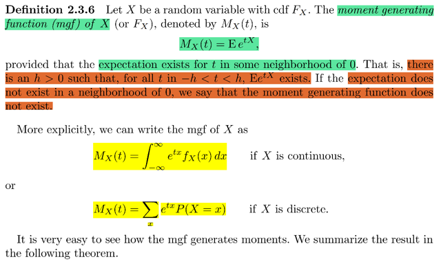</kbd>

> [!NOTE]
> định nghĩa về mgf thì stat110 đã biết rồi, MX(t) = E[e^tX]. Và ở đây gs nhấn
> mạnh điều kiện là trong khoảng gần 0 thì phải tồn tại E của e^tX, thì khi đó
> mới gọi là MX(t) tồn tại.
>
> Dễ thấy dùng LOTUS ta có dạng khai triển

 

<kbd>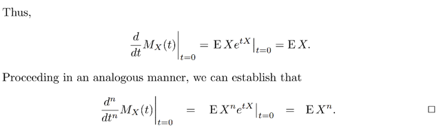</kbd>

<kbd></kbd>

<kbd>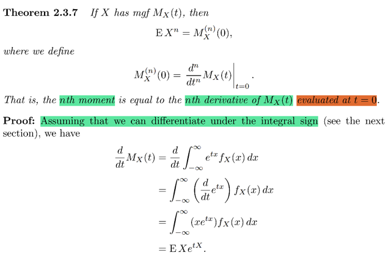</kbd>

> [!NOTE]
> Tiếp theo là một theorem đã học trong stat110, đó là đạo hàm cấp n của mgf,
> evaluate tại 0 chính là moment thứ n của X, EX^n.
>
> Chứng minh cũng đơn giản:
>
> Đạo hàm cấp 1 của mgf, d/dt MX(t) = d/dt ∫-inf:inf e^txfX(x)dx (đây là công
> dạng khai triển của Ee^tX với X là continous rv
>
> Đến đây dùng kiến thức mà stat110 cũng đã nhắc đến là một số function
> well behave thì ta có thể đưa dấu đạo hàm vào trong tích phân (phần sau Casella
> sẽ nói rõ hơn) Do đó ta có:
>
> = ∫-inf:inf d/dt e^txfX(x) dx
>
> Tính cái này d/dt e^txfX(x) thì chú ý là đang đạo hàm theo t, nên fX(x) là hằng số.
>
> = fX(x) d/dt e^tx = fX(x) d/d(e^tx) e^tx . d/dt tx = fX(x) . e^tx . x
>
> Kết qủa là ∫-inf:inf fX(x) e^tx x dx = ∫-inf:inf xe^tx fX(x)  dx
>
> Đây chính là E[Xe^tX]
>
> Rồi, đây chỉ là hàm số đạo hàm cấp 1 của mgf, nó là một hàm số, theo t. Và
> ta sẽ evaluate hàm số này tại t = 0: E[Xe^0] = EX chính là mean, là 1st moment.
>
> Làm tương tự, thử với đạo hàm cấp 2:
>
> Đạo hàm lần nữa: d^2/dt^2 MX(x) = d/dt E[Xe^tX]
>
> d/dt ∫-inf:inf xe^tx fX(x) dx = ∫-inf:inf d/dt xe^tx fX(x) dx
>
> = ∫-inf:inf x (d/dt e^tx) fX(x) dx
>
> = ∫-inf:inf x (e^tx . x) fX(x) dx
>
> = ∫-inf:inf x^2 (e^tx) fX(x) dx = E[X^2e^tX]
>
> ⇨ d^2/dt^2 MX(x)|t=0 = d/dt E[Xe^tX] | t = 0 = E[X^2 e^0] = EX^2
>
> Tương tự ta sẽ có n'th derivative của mgf là n'th moment của X

 

<kbd>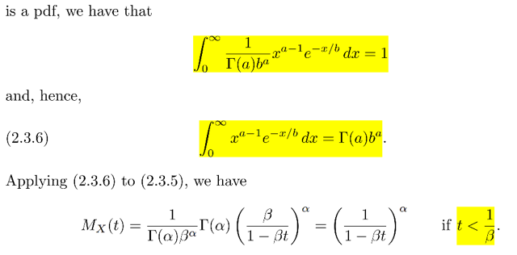</kbd>

<kbd>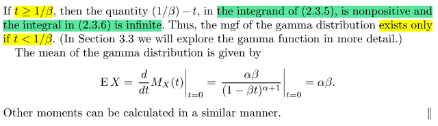</kbd>

<kbd></kbd>

<kbd></kbd>

<kbd>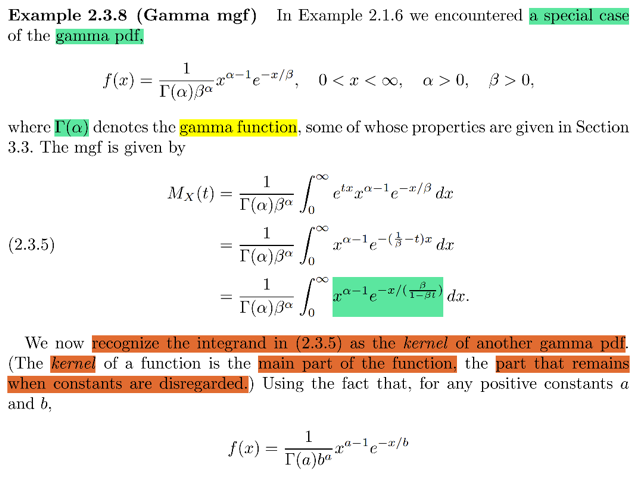</kbd>

> [!NOTE]
> ví dụ này là cơ hội để ôn lại một cái đã học bên stat110. tính mgf của 
> Gamma distribution. 
>
> pdf của nó là f(x) = [1/Γ(α)β^α  x^(α-1) e^-x/β  với x  ∈ (0, inf) α, β > 0
>
> Thế thì mgf = M(t) = Ee^tX = ∫-inf:inf e^tx [1/Γ(α)β^α] x^(α-1) e^-x/β dx
>
> = [1/Γ(α)β^α]  ∫-inf:inf e^tx x^(α-1) e^-x/β dx
>
> = [1/Γ(α)β^α]  ∫-inf:inf x^(α-1) e^(tx-x/β) dx
>
> = [1/Γ(α)β^α]  ∫-inf:inf x^(α-1) e^[x(t-1/β)] dx
>
> = [1/Γ(α)β^α]  ∫-inf:inf x^(α-1) e^[x(βt-1)/β] dx
>
> = [1/Γ(α)β^α]  ∫-inf:inf x^(α-1) e^[x/β/(βt-1)] dx
>
> = [1/Γ(α)β^α]  ∫-inf:inf x^(α-1) e^[-x/β/(1-βt)] dx
>
> Tới đây ta mới dùng một luận điểm quan trọng: Đó là cái integrand
> (hàm bên trong tích phân) nó có dạng của một Gamma pdf với param
> khác, mà gs gọi nó là kernel của một γ pdf khác
>
> Cụ thể nó giống pdf của một Gamma distribution: 
>
> Γ(a, b). pdf = 1/ [Γ(a) b^a] x^(a - 1) e^-x/b
>
> với tham số a = α , b = β/(1-β)
>
> Mà với pdf thì để nó valid ta luôn có ∫-inf:inf f(x)dx = 1
>
> Do đó ∫-inf:inf  1/ [Γ(a) b^a] x^(a - 1) e^-x/b dx = 1
>
> ⇔ 1/ [Γ(a) b^a] ∫-inf:inf  x^(a - 1) e^-x/b dx = 1
>
> ⇔  ∫-inf:inf  x^(a - 1) e^-x/b dx = Γ(a) b^a
>
> Vậy ∫-inf:inf x^(α-1) e^[-x/β/(1-β)] dx = Γ(a) b^a =**Γ(α - 1) [β/(1-β)]^α
>
> ⇨ M(t) = [1/Γ(α)β^α]Γ(α - 1) [β/(1-β)]^α
>
> Rút gọn trở thành (1/1 - βt)^α**====
>
> Một vấn đề quan trọng. Đó là xét cái tích phần này:
>
> [1/Γ(α)β^α]  ∫-inf:inf x^(α-1) e^[-x/β/(1-β)] dx
>
> cụ thể là e^[-x/β/(1-β)] , thì với x dương, β dương, thì nếu 1 - βt dương
> luon (tức t < 1/ β) thì cái trong hàm mũ e là âm.
>
> Và khi x → inf thì e^[-x/β/(1-β)] sẽ → 0. Giúp cho cái tích phân nó
> CONVERGE (khái niệm converge của tích phân có thể sẽ học sâu hơn
> ở MIT 18.01)
>
> Do đó, khi t < 1/β thì mgf tồn tại
>
> ngược lại thì tích phân này explode, = inf → mgf ko tồn tại
>
> ====
>
> Cuối cùng là ta thử tính mean của Gamm(a, b): Lấy đạo hàm cấp 1 của 
> mgf:
>
> d/dt (1/1 - βt)^α = d/d [(1 - βt)^-α]
>
> = d/d(1 - βt) [(1 - βt)^-α] . d/dt (1 - βt)
>
> = (-α) (1 - βt)^(-α-1) (- β)
>
> = (-α) 1/[(1 - βt)^(α+1)] (- β)
>
> = **αβ / (1 - βt)^(α+1)
>
> Và evaluate tại 0: EX = d/dt M(t) | t=0 = αβ**

 

<kbd>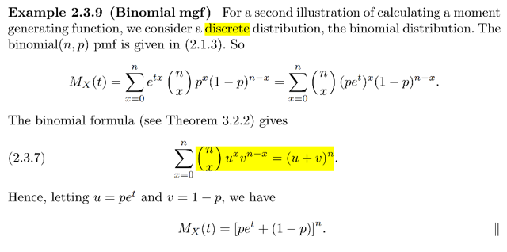</kbd>

> [!NOTE]
> Qua mgf của Bin(n, p). Ta biết pmf của nó là P(X=k) = (n choose k) p^k q^(n-k) (dựa
> vào story của nó ta dễ dàng chứng minh lại công thức pmf: 
>
> Cực vắn tắt: X=k sẽ là intersection của n iid Bern(p) trial, có k success với xác suất p, 
> n - k failure với xác suất q. Và X=k là tập có (n choose k) p.o tương ứng với (n choose k) 
> cách chọn vị trí của các success trial)
>
> P(X=k) = P({s ∈ Ω: X(s) = k}) = P({s ∈ Ω: s = 'S,S..F,S' - tức chuỗi Bern trial có k success,  
> n-k failure }), theo định nghĩa của probability function = Σ {s trong tập trên} P({s})
>
> P({s}) thì là P({Sx...xx, xSx..xx, xxFx..x,..})
>
> tức là intersection của k event có dạng 1 ví trị nào đó là success, còn lại không care
> (và k event thì có k vị trí khác nhau). Và n-k event tương tự nhưng với failure.
>
> và các event này độc lập do các Bern trial độc lập nên P sẽ = tích các P.
>
> Và xét P({Sxx.xxx}) cũng chính là P({Bern trial đầu tiên success}) = p 
>
> Và P({xxFx..x}) = q
>
> Nên P({s}) = p^k q^(n-k)
>
> Còn cái tổng thì dễ thấy sẽ có (n choose k) hạng tử tương ứng với có n choose k)
> cách chọn một bộ vị trí của các success event (cũng là bằng n choose n-k luôn)
>
> ====
>
> Thế thì mgf = Ee^tX = dùng LOTUS = Σk e^tkP(X=k) = Σk e^tk (n choose k) p^k
> q^(n-k)
>
> = Σk e^tk (n choose k) p^k q^(n-k)
>
> Tới đây ta sẽ nhớ / nhận ra cái binomial theorem để tìm cách đưa về:
>
> (u + v)^n = **Σk=0:n** **(n choose k)** u^**k** v^**(n-k)** 
>
> = **Σk (n choose k)** (e^t)**^**k  p^**k** q^(**n-k)**
>
> = Σk (n choose k) (pe^t)^k q^(n-k)
>
> Và kết quả có ngay **(pe^t + q)^n**

 

<kbd>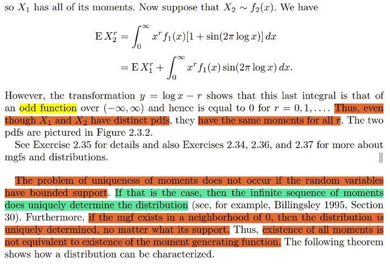</kbd>

<kbd></kbd>

<kbd>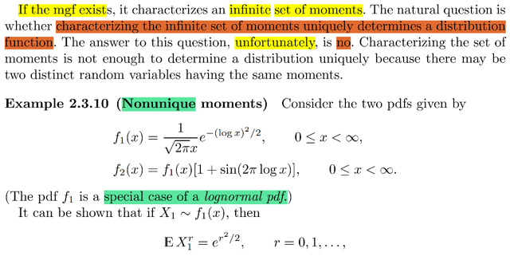</kbd>

> [!NOTE]
> ko có gì khó hiểu, đại ý là gs nhắc lại tác dụng chính của mgf không phải chỉ
> là để generate moment, Mà nó còn có thể tương tự như pdf, cdf: Giúp xác
> định distribution.
>
> Tuy nhiên có câu hỏi đặt ra là, vậy nếu như ta tìm ra bộ moment của một
> random variable thì liệu có thể dựa vào đó để kết luận distribution của  rv đó
> ko (ý là, có phải với distribution khác nhau thì bộ moment của rv sẽ khác
> nhau không).
>
> Thì câu trả lời là không, mới lấy ví dụ về hai pdf khác nhau này. Và dễ dàng
> chứng minh rằng công thức của n'th moment của chúng đều giống nhau.
> Cho thấy không thể dựa vào công thức của các moment  để kết luận
> distribution
>
> Tuy nhiên, nếu như random variable có SUPPORT SET BỊ CHẶN
> (BOUNDED SUPPORT) (CHƯA HIỂU LẮM)
>
> HOẶC mgf tồn tại trong khoảng lân cận của 0 thì ta có thể dựa vào mgf để
> kết luận distribution.

 

<kbd>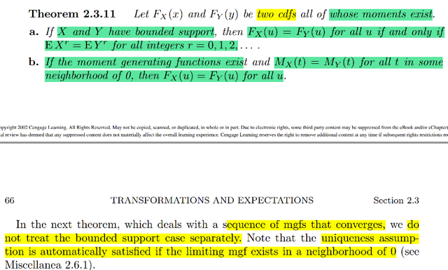</kbd>

> [!NOTE]
> Theorem này chính là điều vừa nói: Nếu rvs X, Y có bounded support thì nếu
> chúng có bộ moment giống nhau thì cdf của chúng bằng nhau (tại mọi điểm)
> có nghĩa là chúng cùng distribution,
>
> Và nếu mgf của chúng đều tồn tại thì khi mgf của chúng bằng nhau tại mọi
> điểm thì cdf cũng vậy (ý là nếu mgf tồn tại thì dùng mgf có thể kết luận
> distritbution)

 

<kbd>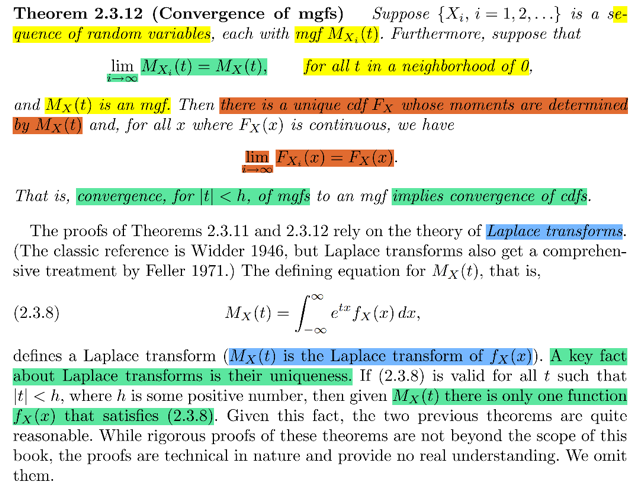</kbd>

> [!NOTE]
> Hiểu đại khái là theorem này nói rằng, nếu ta xét một chuỗi các rv X1, X2...
> Xi. mà mỗi cái có mgf là MX1(t), MX2(t)...MXi(t)...cũng như cdf là FX1(x),
> FX2(x)....FXi(x)
>
> Thì nếu như lim i → inf MXi(t) = MX(t)
>
> Và nếu MX(t) cũng là mgf thì khi đó ta cũng có điều tương tự với cdf:
>
> lim i → inf FXi(x) = FX(x)
>
> Và lúc này FX(x) sẽ là cdf của một biến nào đó mà mgf của nó chính là
> MX(t)
>
> Phần chứng minh gs nói là sẽ dựa vào Laplace transformation, mà ông
> cho là ko cần thiết
>
> mà Laplace transformation đơn giản chính là khi ta tính mgf bằng công thức
>
> M(t) = ∫-inf:inf e^tx fX(x)dx thì M(t) chính là Laplace transformation của fX(x)

 

<kbd>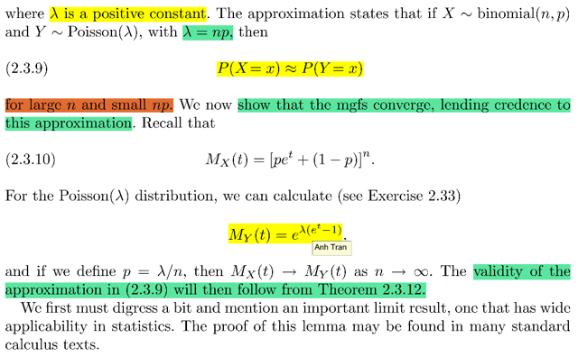</kbd>

<kbd></kbd>

<kbd>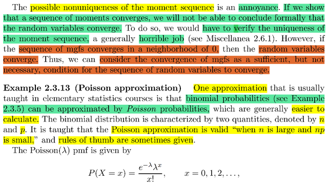</kbd>

> [!NOTE]
> đại khái là trong stat110 mình đã nghe gs nói về việc Bin(n, p) khi n lớn và
> p nhỏ thì nó sẽ trở thành Pois(λ = np)., và trong class đó gs cũng đã chứng
> minh pdf của np sẽ converge về pdf của Pois(np)
>
> Thử làm lại: X~Bin(n, p) ta có 
>
> P(X=k) = (n choose k) p^k q^(n-k)
>
> khai triển ra = n!/k!(n-k)! p^k q^(n-k)
>
> Đặt p = λ/n
>
> = n!/[k!(n-k)!] (λ^k/n^k) q^(n-k)
>
> = n!/[n^kk!(n-k)!] (λ^k) q^(n-k)
>
> = n(n-1)..(n-k+1) / [(n^k)k!] (λ^k) (1 - λ/n)^(n-k)
>
> Đưa mấy cái ko dính tới n lên trước:
>
> = (λ^k / k!) [n(n-1)..(n-k+1) / (n^k)]  (1 - λ/n)^(n-k)
>
> = (λ^k / k!) [n(n-1)..(n-k+1) / (n^k)]  (1 - λ/n)^n / (1 - λ/n)^k
>
> Và xét limit của ba cái này khi n → inf
>
> 1) lim n → inf [n(n-1)..(n-k+1) / (n^k)] 
>
> = lim n → inf (n/n)[(n-1)/n][(n-2)/n]..[(n-k+1)/n] 
>
> mẫu số → inf, mỗi thừa số đều → 1
>
> nên cả cục → 1
>
> 2) (1 - λ/n)^k: khi n → inf thì -λ / n → 0 ⇨ (1 - λ/n)^k → 1
>
> 3) (1 - λ/n)^n:
>
> Cái này thì trong bài stat110 mình vận dụng công thức:
>
> (1 + x/n)^n sẽ tiến về e^x khi n → infinity
>
> Do đó: (1 - λ/n)^n → e^(-λ)
>
> Kết quả là cả đám sẽ → (λ^k / k!) e^(-λ) 1/1
>
> = λ^k e^(-λ) / k! Đây chính là pdf của Pois(λ)

> [!NOTE]
> Còn ở trong sách này thì gs Casella đưa ra chứng minh là mgf của 
> X~ Bin(n,p) sẽ converge về mgf của Y ~ Pois(np)
>
> Hồi nãy ta đã có mgf của Bin(n, p) = [pe^t + q]^n
>
> Rồi với Y~Pois(λ) có pmf f(k) = λ^k e^-λ / k!, thì ta thử xem mgf nó là gì:
>
> MY(t) = Ee^tY = Σk=0,1,..inf e^tk λ^k e^(-λ) / k!
>
> = e^(-λ) Σk=0,1,..inf e^tk λ^k / k!
>
> Xét Σk=0,1,..inf e^tk λ^k / k!
>
> = Σk=0,1,..inf (e^t)^k λ^k / k!
>
> = Σk=0,1,..inf (λe^t)^k / k! 
>
> Dùng kiến thức Taylor expansion của hàm f
>
> Taylor expand tại a của f(x):
>
> f(x) = Σ [đạo hàm cấp n của f, evaluate tại a] x^n / n!
>
> ⇨ e^x = Σ [đạo hàm cấp n của e^x, evaluate tại a] x^n / n!
>
> = Σ (e^x | x=a) x^n / n!
>
> Từ đó, chọn a = 0:
>
> e^x = Σ e^0 x^n / n! 
>
> ⇔ **e^x = Σ x^n / n!**Do đó e^(λe^t) = Σ (λe^t)^n / n!
>
> Hay dùng k thay cho n: e^(λe^t) = Σ (λe^t)^k / k!
>
> Vậy M(t) = e^(-λ) Σk=0,1,..inf (λe^t)^k / k!  
>
> = e^(-λ) e^(λe^t) = e^(λe^t - λ) = **e^[λ(e^t - 1)] 
>
> ====
>
> Trên cơ sở đó ta thử xem lim của mgf của Bin(n, p) khi n → inf:**Khi n → inf thì [pe^t + q]^n = [pe^t + 1 - p]^n sẽ → ?
>
> Đặt λ = np ⇨ p = λ / n
>
> ⇨ [pe^t + 1 - p]^n = [(λ/n)e^t + 1 - (λ/n)]^n
>
> = [1 + (λ/n)(e^t - 1)]^n
>
> = [1 + (e^t - 1)λ/n)]^n 
>
> Áp dụng công thức limit nổi tiếng lim n→inf (1 + x/n)^n = e^x
>
> Ta có lim n→inf [1 + (e^t - 1)λ/n)]^n  = e^[(e^t - 1)λ] = **e^[λ(e^t - 1)]
>
> Kết qủa cho thấy khi n→ inf tìh mgf của Bin(n,p) → mgf của Pois(np)**

 

<kbd>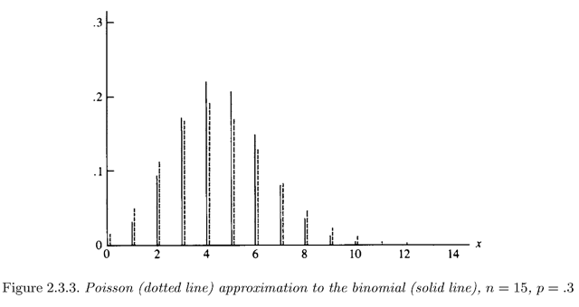</kbd>

<kbd></kbd>

<kbd>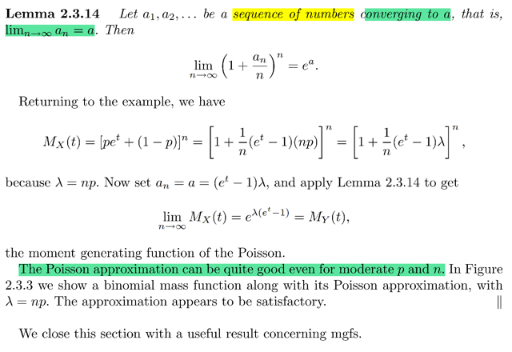</kbd>

> [!NOTE]
> Phần tiếp theo chính là gs Casella nói về cái công thức limit quan trọng
> vừa rồi: lim n→inf (1 + an/n)^n = e^a
>
> Cũng như là biểu đồ cho thấy với n = 15 thì Pois và Bin có thể xấp xỉ
> nhau tốt thế nào

 

<kbd>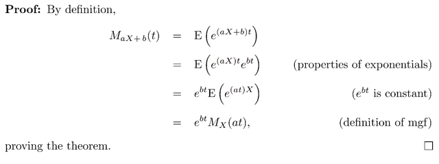</kbd>

<kbd></kbd>

<kbd>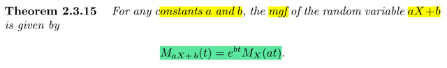</kbd>

🔗 **Related:** [5.5 CONVERGENCE CONCEPTS](55_convergence_concepts.md#node-410)

> [!NOTE]
> Kết thúc là một công thức khá hữu ích liên quan đến mgf (hình như stat110
> chưa thấy nói)
>
> M_aX+b(t) = e^bt MX(at)
>
> Thử tự chứng minh 
>
> Theo định nghĩa: MY(t), với Y = aX + b, = Ee^tY = Ee^t(aX + b)
>
> = Ee^(taX + tb) = E[e^(taX)(e^tb)] 
>
> = (e^tb)E[e^(taX)] | e^tb là constant đưa ra E
>
> = (e^tb)M_X(at)

 

