# 2.4 Differentiating under integral

📊 **Progress:** `16` Notes | `27` Screenshots

---
<a id="node-121"></a>

<p align="center"><kbd>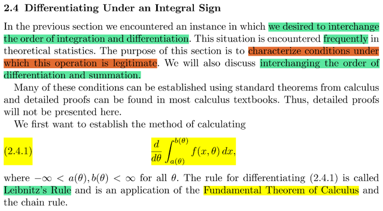</kbd></p>

> [!NOTE]
> Đại khái là phần này sẽ bàn về một vấn đề rất hay gặp trong xác suất
> thống kê là việc tính đạo hàm của một tích phân. Và cụ thể là ta sẽ bàn
> về những điều kiện  cần thiết để việc đưa đạo hàm vào trong tích phân
> được hợp lệ.
>
> Thì gs nói cái này dựa trên Leibnitz's rule và là một ứng dụng của FTC
>
> Sẵn ôn lại về FTC: Trong MIT 18.01 đã học: FTC2 nói rằng khi một hàm
> G(x) được định nghĩa bởi `∫-inf:` xf(t)dt thì G chính là nguyên hàm của f
> `d/dx` G(x) `=` f(x), hay G'(x) `=` f(x). Chú ý nó có nghĩa là đạo hàm theo x
> của G ta sẽ được một hàm số G', hay `d/dx` G. Và nó sẽ bằng với hàm f
> tại mọi điểm x. 
>
> FTC1 thì cho biết, nếu G(x) là nguyên hàm của f(x): Tức `d/dx` G(x) `=` f(x)
> thì `∫a:b` f(x)dx `=` G(b) `-` G(a)

<br>

<a id="node-122"></a>

<p align="center"><kbd>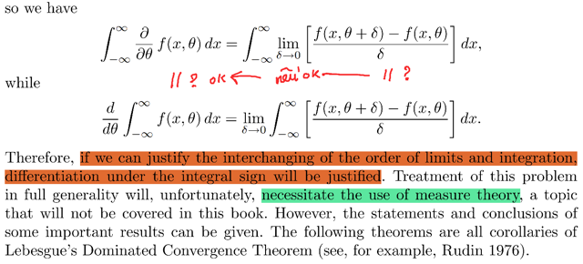</kbd></p>

<p align="center"><kbd></kbd></p>

<p align="center"><kbd>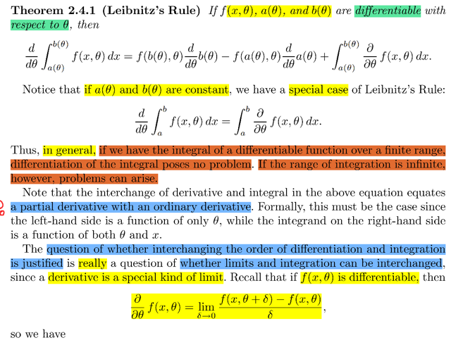</kbd></p>

> [!NOTE]
> Ta sẽ học về Leibnitz rule: 
>
> ```text
> Đại khái là nếu có f(x, θ), a(θ), b(θ) đều khả vi đối với θ (tức tồn tại
> ```
> đạo hàm đối với `θ)` thì
>
> ```text
> d/dθ ∫a(θ):b(θ) f(x,θ)dx
> ```
>
> ```text
> = f(b(θ, θ))d/dθ b(θ) - f(a(θ), θ) d/dθ a(θ) + ∫a(θ):b(θ) ∂/∂θ f(x, θ)dx
> ```
>
> Nếu a , b là constant thì dĩ nhiên hai cái đầu bằng 0.
>
> ```text
> Nên d/dθ ∫a:b f(x, θ)dx = ∫a:b d/dθ f(x, θ)dx
> ```
>
> Khúc dưới chưa hiểu lắm, nhưng đại khái ý là gs nêu vấn đề rằng
> liệu có thể biện minh (justify) cho việc đổi vị trí của tích phân và
> đạo hàm như trong theorem trên hay không.
>
> Thì ông nói câu hỏi này thực chất là liệu có thể biện minh cho việc
> đổi vị trí của tích phân và limit không, vì bản chất đạo hàm chỉ là
> một dạng đặc biệt của limit.
>
> Cái này thì mình hoàn toàn hiểu.
>
> MIT 18.01 đã học định nghĩa của đạo hàm (hàm đơn biến f(x))
> evaluate tại x: `d/dx` f(x) | x, hay f'(x):
>
> ```text
> lim δx → 0 [f(x + δx) - f(x)] / δx , tức là giá trị của difference quotient
> ```
> tại limit của `δx`
>
> Với hàm đa biến f(x, `θ)` ta cũng có tương tự, partial derivative của
> f wrt `θ` evaluate tại x, `θ`  sẽ được định nghĩa là:
>
> ```text
> ∂/∂θ f(x, θ) = lim δ → 0 [f(x, θ + δ) - f(x, θ)] / δ
> ```
>
> `====`
>
> Vậy thì theo định nghĩa đạo hàm như vậy, có bản chất là một cái lim
>
> thì ta sẽ thấy:
>
> **d/dθ `∫-inf:inf` f(x, θ)dx:** 
>
> thì ta sẽ coi cái tích phân như một hàm số thôi:
>
> ```text
> = lim δ → 0 [∫-inf:inf f(x, θ + δ)dx - ∫-inf:inf f(x, θ)dx] / δ
> ```
>
> `=` **lim `δ` → 0 `[∫-inf:inf` [f(x, `θ` `+` `δ)` `-` f(x, `θ)]dx]` `/` δ**Còn **∫-inf:inf `∂/∂θ` f(x, θ)dx:** 
>
> thì lại áp dụng định nghĩa đạo hàm là
> một cái lim vào cái integrant:
>
> **= `∫-inf:inf` lim `δ` → 0 [f(x, `θ` `+` `δ)` `-` f(x, `θ)]` `/` δ**Vậy từ đó nếu ta chứng minh :
>
> ```text
> lim δ → 0 [∫-inf:inf [f(x, θ + δ) - f(x, θ)]dx] / δ BẰNG CÁI
> ```
>
> ```text
> ∫-inf:inf lim δ → 0 [f(x, θ + δ) - f(x, θ)] / δ
> ```
>
> THÌ TA SẼ BIỆN MINH ĐƯỢC CHO :
>
> ```text
> d/dθ ∫-inf:inf f(x, θ)dx BẰNG ∫-inf:inf ∂/∂θ f(x, θ)dx
> ```
>
> Có nghĩa là, nếu chứng minh được việc ta có thể đổi chỗ giữa
> tích phân là limit, thì sẽ biên minh được cho việc đổi chỗ giữa
> tích phân và đạo hàm
>
> Và để chứng mih cái này gs cho rằng cần công tục measure theoru

<br>

<a id="node-123"></a>

<p align="center"><kbd>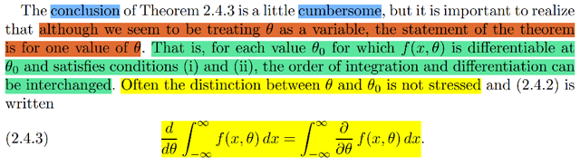</kbd></p>

<p align="center"><kbd>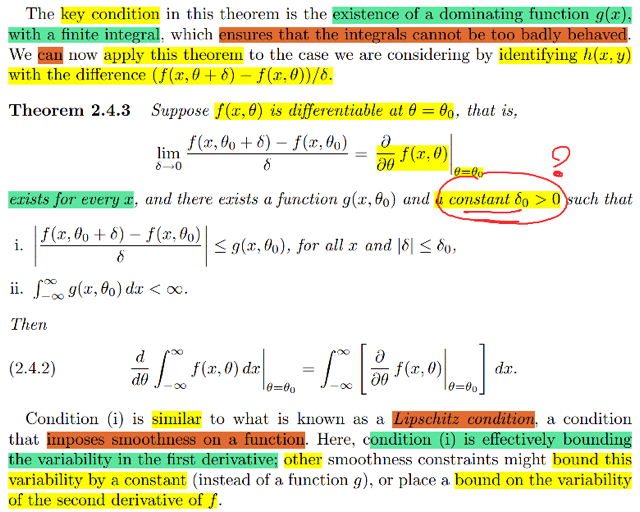</kbd></p>

<p align="center"><kbd></kbd></p>

<p align="center"><kbd></kbd></p>

<p align="center"><kbd>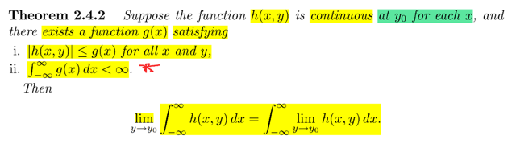</kbd></p>

> [!NOTE]
> Đại khái là theorem 2.4.2 nói rằng: Cho rằng ta có function h(x, y) **liên tục tại y0**
> **với mỗi giá trị của x**. Và **gỉa sử** ta **có một function g(x)** sao cho:
>
> **với mọi x, y thì |h(x, y)|** **đều nhỏ hơn g(x)** và quan trọng hơn là **tích phân của g(x)
> là xác định**. Khi đó TA CÓ THỂ ĐỔI CHỖ TÍCH PHÂN VÀ LIMIT:
>
> **lim y → y0 `∫-inf:inf` h(x, y) dx `=` `∫-inf:inf` lim y → y0 h(x, y)dx**
> Mình chỉ tạm hiểu có theorem này chứ ko thấy chứng minh.
>
> Thế thì cái ý chính là, áp dụng cái theorem trên với hàm h(x, y) cụ thể hơn:
>
> ```text
> h(x, θ) = ∂/∂θ f(x, θ) | θ = θ0
> ```
>
> (Dĩ nhiên theo định nghĩa ta đã biết:
>
> `∂/∂θ` f(x, `θ)` | `θ` `=` `θ0` chính là **lim `δ` → 0 [f(x, `θ0` `+` `δ)` `-` f(x, `θ0]` `/` `δ` )**
>
> thì ta có theorem (nhấn mạnh, ta chỉ là đang nhắc lại theorem 2.4.2 với hàm
> ```text
> h(x, θ) = ∂/∂θ f(x, θ) | θ = θ0 thôi:
> ```
>
> Giả sử **tồn tại** **g(x, θ0)** và **hằng số `δ0` > 0 (CHƯA HIỂU TẠI SAO)** sao cho:
>
> i) |[f(x, `θ0` `+` `δ)` `-` f(x, `θ0]` `/` `δ|` ≤ g(x, `θ0)` với**mọi x**và **|δ| ≤ δ0** | cái này tương ứng với 
>
> điều kiện |h(x, y)| < g(x) với mọi x, y
>
> ```text
> ii) ∫-inf:inf g(x, θ0) dx < inf | cái này tương ứng với điều kiện ∫-inf:inf g(x) dx < inf
> ```
>
> KHi đó ta có quyền **đổi chỗ tích phân và limit:**
>
> ```text
> lim δ → 0 ∫-inf:inf { [f(x, θ0 + δ) - f(x, θ0] / δ } dx
> ```
>
> ```text
> = ∫-inf:inf { lim δ → 0 [f(x, θ0 + δ) - f(x, θ0] / δ } dx
> ```
>
> ```text
> Vế trái lim δ → 0 ∫-inf:inf { [f(x, θ0 + δ) - f(x, θ0] / δ } dx
> ```
>
> tương ưng với lim y → y0 `∫-inf:inf` h(x, y) dx, 
>
> ```text
> thì nó chính là d/dθ ∫-inf:inf f(x, θ)dx | θ = θ0
> ```
>
>
> ```text
> Vế phải ∫-inf:inf { lim δ → 0 [f(x, θ0 + δ) - f(x, θ0] / δ } dx
> ```
>
> tương ứng với `∫-inf:inf` lim y → y0 h(x, y)dx
>
> thì nó chính là
>
> ```text
> ∫-inf:inf [∂/∂θ f(x, θ) | θ = θ0] dx
> ```
>
> Do đó ta có:
>
> **d/dθ `∫-inf:inf` f(x, `θ)dx` | `θ` `=` `θ0` `=` `∫-inf:inf` `[∂/∂θ` f(x, `θ)` | `θ` `=` `θ0]` dx**====
>
> NÓI CHUNG KHÚC Ở TRÊN TẠM HIỂU NÓ NÓI VỀ THEOREM CHO PHÉP
> TA ĐỔI CHỖ TÍCH PHÂN VÀ LIMIT KHI THỎA ĐIÈU KIỆN CẦN THIẾT
>
> Và cái điều kiện i) gs cho rằng trông giống một thứ mà mình đã gặp trong 
> EE364A: LIPCHITZ condition.
>
> Đại khái, Lipschitz condituous là một..condition, rằng hàm số không có sự thay
> đổi độ dốc quá đột ngột, và nó thể hiện điều này bằng một cái bound của đạo
> hàm cấp 2: khi di chuyển từ x đến y thì đạo hàm cấp hai không được thay đổi
> quá nhanh: ||∇^2f(x) `-` ∇^2f(y)||2 ≤ L||x `-` y||2 với L là constant nào đó.
>
> `====`
>
> Quay lại đây, đại ý là cái theorem đó nó nói về `/` áp dụng cho một điểm `θ0` mà
> ở đó hàm f khả vi. Vậy nên với mọi `θ` mà f khả vi thì ta đều có cái này.
>
> Dẫn tới với mọi `θ` sao cho f(x, `θ)` khả vi tại `θ,` ta có 
>
> ```text
> [ d/dθ ∫-inf:inf f(x, θ)dx | θ = θ ] = ∫-inf:inf [∂/∂θ f(x, θ) | θ = θ] dx
> ```
>
> Hay **d/dθ `∫-inf:inf` f(x, `θ)dx` `=` `∫-inf:inf` `[∂/∂θ` f(x, `θ)` dx**

> [!NOTE]
> Ở ĐAY CÓ CHỖ CHƯA HIỂU LÀ TẠI
> SAO PHẢI CÓ MỘT  GIỚI HẠN `|δ|` ≤ `δ0`

<br>

<a id="node-124"></a>

<p align="center"><kbd>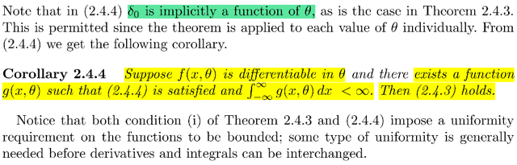</kbd></p>

<p align="center"><kbd></kbd></p>

<p align="center"><kbd>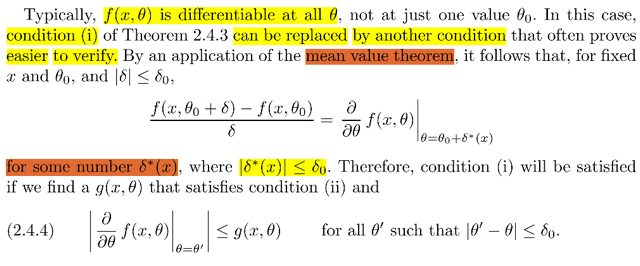</kbd></p>

> [!NOTE]
> đại khái là mit 1801 đã học về mean value theorem, đại ý của nó là độ
> dốc trung bình giữa hai điểm a, b sẽ bằng độ dốc của hàm số tại một
> điểm nào đó trong đạon a, b.
>
> Áp dụng vào đây, ta có thể làm cho điều kiện i tương đương với:
>
> Điều kiện i là (tồn tại g(x, `θ0)` sao cho với mọi x và `|δ|` ≤ `δ0:` thì:
>
> ```text
> |[f(x, θ0 + δ) - f(x, θ0] / δ| ≤ g(x, θ0)
> ```
>
> Thế thì vế trái chính là độ dóc trung bình của f tại a `=` (x, `θ0)` và b `=` (x, 
> `θ0` `+` `δ)`
>
> Nên ta có thể thay nó bằng độ dốc tại một điểm nào đó giữa hai điểm này:
>
> ```text
> Thể hiện điểm nào đó đó bởi (x, θ0 + δ*(x)), tại sao lại là θ0 + δ*(x), vì
> ```
> ```text
> cái điểm ở giữa (x, θ0) và (x, θ0 + δ) mà độ dốc bằng độ dốc trung bình
> ```
> của hai điểm này sẽ có dạng (x, `θ0` `+` gì đó) và cái yếu tố "gì đó" ở đây
> không cố định mà sẽ phụ thuộc x.
>
> và độ dốc (theo phương `θ)` của f tại đó:
>
> ```text
> ∂/∂θ f(x, θ) | θ = θ0 + δ*(x)
> ```
>
> ```text
> Ta sẽ cần điều kiện δ*(x) ≤ δ0 vì yêu cầu là mọi |δ| đều ≤ δ0 nên δ*(x) cũng
> ```
> phải thỏa
>
> Vậy điều kiện i có thể thay thế bằng:
>
> ```text
> | ∂/∂θ f(x, θ) | θ = θ0 + δ*(x) | ≤ g(x, θ0)
> ```
>
> ```text
> mà nêú đạt θ' = θ0 + δ*(x) với |δ*(x)| ≤  δ0 ⇔ |θ' - θ0| = |δ*(x)| ≤ δ0
> ```
>
> ```text
> thì cái trên ⇔ | ∂/∂θ f(x, θ) | θ = θ' | ≤ g(x, θ0) với |θ' - θ0| ≤ δ0
> ```
>
> Do đó mới nói nếu tồn tại g(x, `θ)` sao cho thỏa cái điều kiện tương đương
> với i vừa rồi, và điều kiện ii, thì ta sẽ có quyền đổi chỗ tích phân và đạo hàm
>
>
> `====`
>
> Và đơn giản Hệ quả 2.4.4 là nói lại cái vừa rôi, rằng nếu f(x, `θ)` khả vi tại 
> ```text
> θ và tồn tại g(x, θ) sao cho | ∂/∂θ f(x, θ) | θ = θ' | ≤ g(x, θ0) với |θ' - θ0| ≤ δ0
> ```
> và điều kiện ii) của Theorem 2.4.3: `∫-inf:inf` g dx < inf thì Theorem 2.4.3 sẽ
> thỏa
>
> VÀ NÓI CHUNG CẢ HAI THEOREM ĐỀU NÓI VỀ ĐIỀU KIỆN NÀO ĐÓ
> VỀ TÍNH ĐỒNG ĐỀU CỦA HÀM SỐ PHẢI ĐƯỢC GIỚI HẠN (Ý LÀ
> NÓ PHẢI NẰM TRONG KHUON KHỔ CHO PHÉP NÀO ĐÓ VỀ TÍNH 
> ĐỒNG ĐỀU) ĐỂ CHO PHÉP TÍCH PHÂN VÀ ĐẠO HÀM CÓ THỂ ĐỔI CHỖ

<br>

<a id="node-125"></a>

<p align="center"><kbd>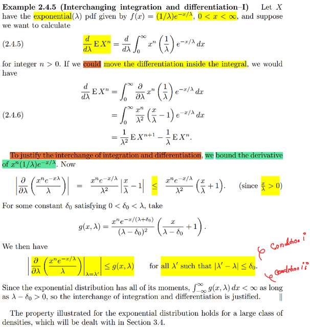</kbd></p>

> [!NOTE]
> Nói chung là một ví dụ áp dụng mấy cái định lí vừa rồi, cụ thể là ta sẽ 
> tính đạo hàm của EX^n, với X ~ Expo(λ) để rồi bài toán này cần đạo
> hàm của một tích phân. Và ta sẽ đưa đạo hàm vào tích phân và biện
> minh điều này bằng cách chỉ ra rằng ta có thể thỏa hai điều kiện
> của theorem hồi nãy,
>
> Thử xem tại sao có kết quả 2.4.6:
>
> Bài toán là tính `d/dλ` EX^n, tức là đạo hàm theo λ của n'th moment của
> X ~ Expo(λ). Với expo mình đã biết pdf của nó là `(1/λ)` `e^-x/λ` (nhớ lại
> việc khai triển pdf của Expo ta sẽ dùng story của nó: Thời gian chờ
> nhận email đầu tiên, với số email nhận trong khoảng thời gian t sẽ
> là một rv N ~ Pois(λt). Từ đó ta xây dựng cdf của T `=` P(T ≤ t) `=` 1 `-` P(T > t)
> `=` 1 `-` P(N `=` 0) và áp dụng pmf của Pois(λ) vào sẽ giúp ta có cdf của T, 
> lấy đạo hàm ta sẽ có pdf)
>
> Thế thì áp dụng LOTUS: EX^n `=` `∫-inf:inf` x^n fX(x)dx với domain của pdf
> expo là (0, inf) nên EX^n `=` **∫0:inf x^n `(1/λ)` `e^-x/λ` dx**Ta tính: `d/dλ` `∫0:inf` x^n `(1/λ)` `e^-x/λ` dx
>
> ```text
> = ∫0:inf d/dλ [x^n (1/λ) e^-x/λ] dx
> ```
>
> ```text
> = ∫0:inf x^n d/dλ [ (1/λ) e^-x/λ] dx (1)
> ```
>
> ```text
> Tính d/dλ [ (1/λ) e^-x/λ] = d/dλ [ (e^-x/λ) / λ) ]:
> ```
>
> ```text
> Dùng quotient rule: (u/v)' = u'v - v'u/v)
> ```
>
> Bản chất cũng chỉ là product rule: 
>
> (uz)' `=` u'z `+` uz' 
>
> ```text
> với z(x) = 1/v(x) = v(x)^-1 ⇨ z'(x) = d/dv z . d/dx v = -v^-2v' = -v'/v^2
> ```
>
> ⇨ `(u/v)'` `=` `u'/v` `+` u `(-v'/v^2)` `=` **(u'v `-` uv')/v^2**⇨ `d/dλ` [ `(e^-x/λ)` `/` λ) ] `=` { `d/dλ` `e^(-x/λ)` . λ  `-`  `e^(-x/λ)` `d/dλ` [λ] } `/` λ^2
>
> ```text
> =  { d/d(-x/λ) e^(-x/λ) . d/dλ (-x/λ) . λ  -  e^(-x/λ) . 1 } / λ^2
> ```
>
> ```text
> =  { e^(-x/λ) . -x d/dλ (1/λ) . λ  -  e^(-x/λ) } / λ^2
> ```
>
> ```text
> =  { e^(-x/λ) . -x (-1/λ^2) . λ  -  e^(-x/λ) } / λ^2
> ```
>
> ```text
> =  { e^(-x/λ) . x (1/λ)  -  e^(-x/λ) } / λ^2
> ```
>
> ```text
> =  { e^(-x/λ) [ (x/λ)  -  1] } / λ^2
> ```
>
> ```text
> =   (1/ λ^2) [ (x/λ)  -  1] e^(-x/λ)
> ```
>
> ```text
> Do đó (1) = ∫0:inf x^n (1/ λ^2) [ (x/λ)  -  1] e^(-x/λ) ] dx
> ```
>
> ```text
> = ∫0:inf [ x^n (1/ λ^2) (x/λ) e^(-x/λ)  -  x^n (1/ λ^2) 1 e^(-x/λ) ] dx
> ```
>
> ```text
> = ∫0:inf [ x^n (1/ λ^2) (x/λ) e^(-x/λ) ] dx  - ∫0:inf [ x^n (1/ λ^2) e^(-x/λ) ] dx
> ```
>
> ```text
> = (1/ λ^2) ∫0:inf [ x^n+1 (1/λ) e^(-x/λ) ] dx  - (1/ λ) ∫0:inf [ x^n (1/λ)e^(-x/λ) ] dx
> ```
>
> =**EX^(n+1) `/` λ^2  `-`  `EX^n/` λ**

> [!NOTE]
> Bây giờ để biện minh thì ta cần chứng minh gì?
>
> Theo theorem vừa nãy ta cần chứng mình:
>
> ```text
> 1)  | ∂/∂θ f(x, θ) | θ = θ' | ≤ g(x, θ0) với |θ' - θ0| ≤ δ0
> ```
>
> Ở đây f chính là **x^n `(1/λ)` e^-x/λ**(integrant của tích phân)
>
> ```text
> Thế thì ∂/∂λ [ x^n (1/λ) e^-x/λ ] như vừa tính =
> ```
>
> ```text
> x^n  ∂/∂λ [ (1/λ) e^-x/λ ]  = x^n (1/ λ^2) [ (x/λ)  -  1] e^(-x/λ)
> ```
>
> `=` **[ x^n `e^(-x/λ)` `/` λ^2] [ `(x/λ)`  `-`  1]
>
> ⇨**| `∂/∂λ` [ x^n `(1/λ)` `e^-x/λ` ] |
>
> `=` | [ x^n `e^(-x/λ)` `/` λ^2] [ `(x/λ)`  `-`  1] | ****= [ x^n `e^(-x/λ)` `/` λ^2] | [ `(x/λ)`  `-`  1] |  (vì cái cục trước đó dương cả
> rồi)****≤ [ x^n `e^(-x/λ)` `/` λ^2] [ `(x/λ)`  `+`  1]  |
>
> CHƯA HIỂU TẠI SAO
>
> QUAY LẠI SAU. NHƯNG NÓI CHUNG LÀ CHO THẤY THỎA HAI
> CONDITIONS DO ĐÓ BIỆN MINH ĐƯỢC CHO CÁCH LÀM ĐỔI CHỖ
> TÍCH PHÂN VÀ ĐẠO HÀM

> [!NOTE]
> QUAY LẠI SAU

<br>

<a id="node-126"></a>

<p align="center"><kbd>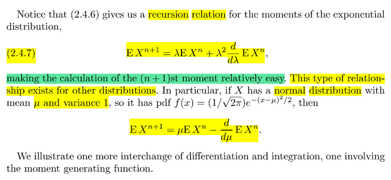</kbd></p>

> [!NOTE]
> Đại khái là kết quả vừa rồi
>
> ```text
> d/dλ EX^n = EX^(n+1) / λ^2  -  EX^n/ λ
> ```
>
> ```text
> ⇔ EX^(n+1) / λ^2 =  EX^n/ λ + d/dλ EX^n
> ```
>
> giúp ta có công thức để tính moment bậc cao hơn từ moment bậc trước đó
> của expo
>
> Và tính chất này cũng xuất hiện ở một số distribyution khác ví dụ `N(μ` ,1)

<br>

<a id="node-127"></a>

<p align="center"><kbd>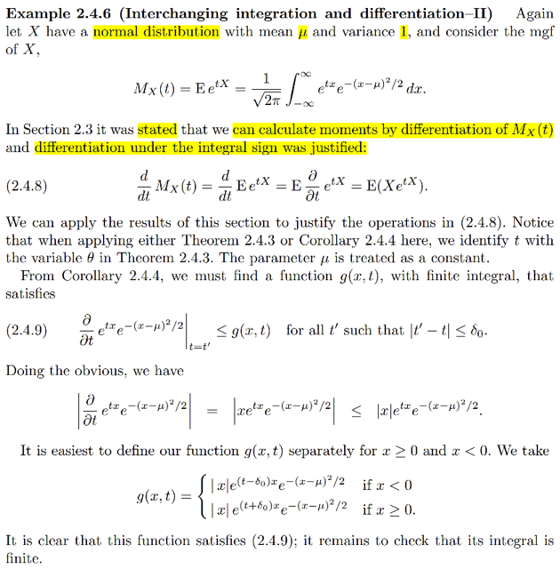</kbd></p>

> [!NOTE]
> QUAY LẠI SAU.
>
> CƠ BẢN LÀ BIỆN MINH ĐỐI VỚI N(0, 1) THÌ TA CŨNG CÓ THỂ ĐỔI CHỖ
> TÍCH PHÂN VÀ ĐẠO HÀM

> [!NOTE]
> QUAY LẠI SAU

<br>

<a id="node-128"></a>

<p align="center"><kbd>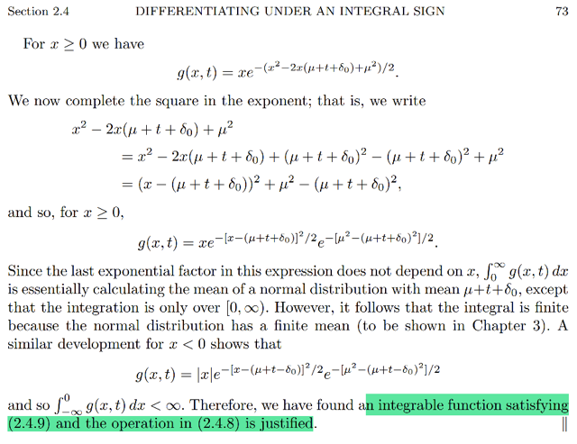</kbd></p>

> [!NOTE]
> QUAY LẠI SAU

<br>

<a id="node-129"></a>

<p align="center"><kbd>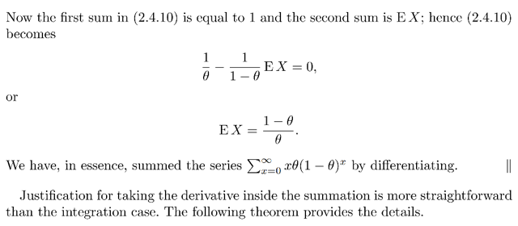</kbd></p>

<p align="center"><kbd></kbd></p>

<p align="center"><kbd>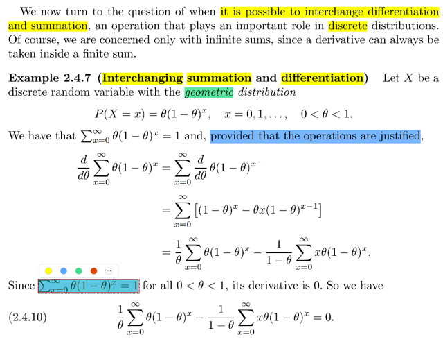</kbd></p>

> [!NOTE]
> Tiếp theo là biện minh cho việc đổi chỗ giữa `Σ` và tích phân, xuát hiện nhiều
> khi ta làm việc vói  discrete rv
>
> CHÚ Ý RẰNG, CÁI VIỆC BIỆN MINH CHỈ CẦN KHI ĐANG XÉT TỔNG VÔ
> HẠN HẠNG TỬ `(Σx=0:inf)` CÒN VỚI TỔNG HỮU HẠN THÌ KHỎI CẦN,
> LUÔN LUÔN CÓ THỂ ĐỔI CHỖ ĐƯỢC
>
> Thế thì đầu tiên ta gặp lại Geometric distribution. Còn nhớ trong stat110
> r.v ~ `Geom(θ)` có story là số lần fail cho đến khi success lần đầu trong
> bối cảnh là chuỗi vô tận các `Bern(θ)` trial 
>
> Và nó có hai dạng là theo convention có hoặc không có tính lần success.
>
> Thử lập luận ra pmf của nó từ story này. Trong sách này theo convention ko 
> tính success vào. 
>
> Thử tìm P(X `=` x), dễ thấy x sẽ chỉ có possible value rời rạc 0,1,.....(nếu không 
> tính success) hoặc (1,2....nếu có tính success)
>
> Để cho dễ ví dụ x `=` 5
>
> (X `=` 5) sẽ có nghĩa là có 5 lần fail trước khi success. Như vậy nó chính là chuỗi
> kết quả của các Bern(p) trial có dạng: FFFFFS
>
> ⇨ (X `=` 5) `=` {s ∈ `Ω:` s có dạng FFFFFS}
>
> và nó chính là intersection của các set sau:
>
> {s ∈ `Ω:` s có dạng F...}, và cũng chính là ("trial thứ nhất ra F")
>
> {s ∈ `Ω:` s có dạng *F...}, và cũng chính là ("trial thứ hai ra F")
>
> {s ∈ `Ω:` s có dạng **F...}, và cũng chính là ("trial thứ ba ra F")
>
> {s ∈ `Ω:` s có dạng ***F...}, và cũng chính là ("trial thứ tư ra F")
>
> {s ∈ `Ω:` s có dạng ****F...}, và cũng chính là ("trial thứ năm ra F")
>
> {s ∈ `Ω:` s có dạng *****S}, và cũng chính là ("trial thứ sau ra S")
>
> Mà các Bern(p) trial độc lập nên các set trên cũng độc lập
>
> ⇨ P intersection  `=` tích các P
>
> Vậy P(X `=` 5) `=` P[{s ∈ `Ω:` s có dạng F...} ∩ {s ∈ `Ω:` s có dạng *****S}]
>
> `=` P({s ∈ `Ω:` s có dạng F...})*...*P({s ∈ `Ω:` s có dạng *****S})
>
> `=` P("trial thứ nhất ra F")*...*P("trial thứ năm ra F")*P("trial thứ sau ra S")
>
> Mà P("trial thứ nhất ra F") thì cũng bằng P("trial ra F") vì các trial độc lập nên
> thứ mấy không quan trọng. Tương tự với mấy cái kia
>
> ```text
> = (1-θ)(1-θ)(1-θ)(1-θ)(1-θ) θ = (1-θ)^5θ
> ```
>
> Khái quát lên ta có **P(X `=` x) `=` θ(1-θ)^x**

> [!NOTE]
> ```text
> Rồi ông nói Σx θ(1 - θ)^x = 1, cái này đơn giản chỉ là vì tính valid của pmf
> ```
>
> Thế thì **giả sử có thể biện minh cho đạo hàm của tổng bằng tổng đạo hàm**
>
> ```text
> khi đó ta sẽ tính ra d/dθ Σx θ(1 - θ)^x, và dùng sự thật vốn dĩ cái này sẽ bằng 0
> ```
> vì  đã nói ở trên cái tổng này bằng 1, từ đó ta có công thức 2.4.10. Thử làm lại
>
> ```text
> d/dθ Σx θ(1 - θ)^x = Σx d/dθ [ θ(1 - θ)^x ]
> ```
>
> ```text
> = Σx [ (d/dθ θ) (1 - θ)^x + θ d/dθ (1 - θ)^x ] | product rule
> ```
>
> ```text
> = Σx [ (1) (1 - θ)^x + θ d/d(1 - θ) (1 - θ)^x . d/dθ (1 - θ)  | chain rule
> ```
>
> ```text
> = Σx [(1 - θ)^x + θ x(1 - θ)^(x-1) (-1) ]
> ```
>
> ```text
> = Σx [(1 - θ)^x - θ x(1 - θ)^(x-1) ]
> ```
>
> ```text
> = Σx [ (θ/θ) (1 - θ)^x - θ x(1 - θ)^(x-1) ]
> ```
>
> ```text
> = Σx (θ/θ) (1 - θ)^x - Σx θ x(1 - θ)^(x-1)
> ```
>
> `=` **(1/θ) `Σx` `θ(1` `-` `θ)^x` `-` `[1/(1` `-` `θ)]` `Σx` `θx(1` `-` θ)^x**Như đã nói cái này sẽ bằng 0: 
>
> ```text
> (1/θ) Σx θ(1 - θ)^x - [1/(1 - θ)] Σx θx(1 - θ)^x = 0
> ```
>
> ```text
> Mà Σx θ(1 - θ)^x chính là 1 vì đây là tổng giá trị của pmf trên
> ```
> mọi possible value của X.
>
> ```text
> Và Σx θx(1 - θ)^x = Σx x θ(1 - θ)^x chính là EX:
> ```
>
> ```text
> ⇨ Ta có: (1/θ) 1 - [1/(1 - θ)] EX = 0
> ```
>
> ⇔ `1/θ` `-` `EX/(1` `-` `θ)` `=` 0 ⇨ **EX `=` (1 `-` `θ)` `/` θ**

<br>

<a id="node-130"></a>

<p align="center"><kbd>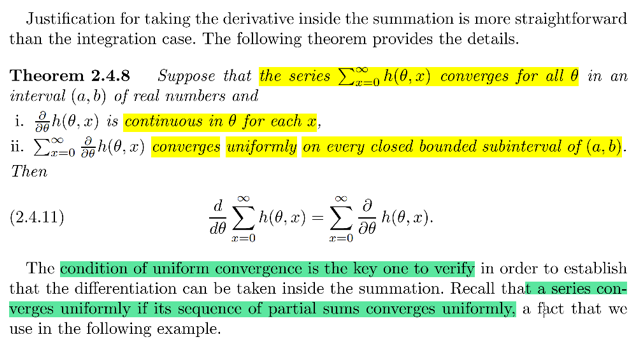</kbd></p>

> [!NOTE]
> Theorem này sẽ cho phép biện minh việc có thể đổi chỗ giữa dấu tích
> phân và `Σ`
>
> ```text
> Đại khái là điều kiện là tổng Σx=0:inf h(θ,x) converge với mọi θ nằm trong
> ```
> khoảng số thực (a, b) đồng thời i) `h(θ,` x) liên tục tại `θ` với mỗi x.
>
> ```text
> và ii) Σ ∂/∂θ h(θ, x) converge uniformly trên mọi closed bounded
> ```
> `sub-interval` of (a, b)
>
> CHƯA HIỂU

<br>

<a id="node-131"></a>

<p align="center"><kbd>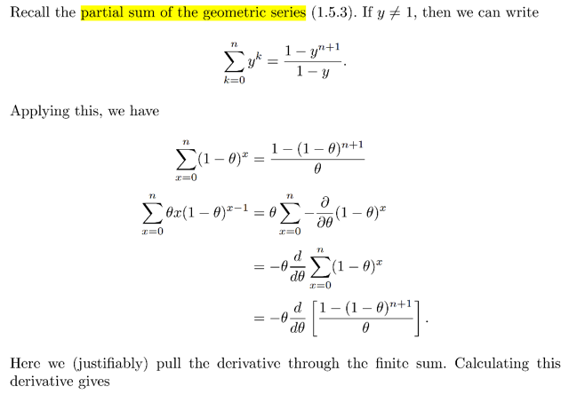</kbd></p>

<p align="center"><kbd>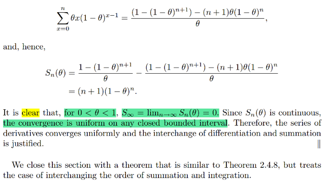</kbd></p>

<p align="center"><kbd>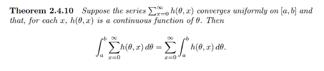</kbd></p>

<p align="center"><kbd></kbd></p>

<p align="center"><kbd></kbd></p>

<p align="center"><kbd></kbd></p>

<p align="center"><kbd>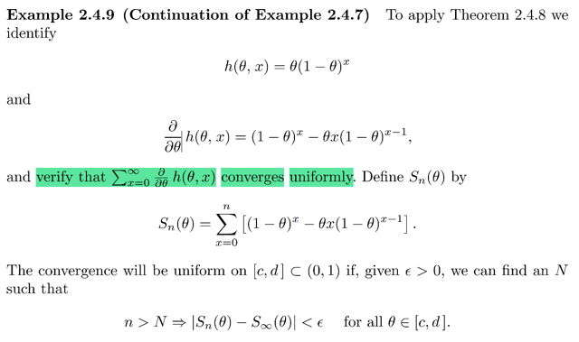</kbd></p>

> [!NOTE]
> Đại khái là để biện minh cho việc đổi chỗ tích phân và `Σ` khi ta tính
> Expectation của Geometric distribution hồi nãy. thì theo theorem này, 
> ta cần phải cho thấy nó thỏa i) `∂/∂θ` `h(θ,` x) liên tục với mội x và ii) 
> ```text
> Σx=0:inf ∂/∂θ h(θ, x) hội tụ uniformly ... (khúc này chưa hiểu)
> ```
>
> ```text
> Theo kết quả hồi nãy ta đã có: Với h = θ(1 - θ)^x
> ```
>
> ```text
> ⇨ ∂/∂θ h(θ, x) = (θ/θ) (1 - θ)^x - Σx θ x(1 - θ)^(x-1)
> ```
>
> ```text
> Xét tổng Sn(θ) = Σx=0:n [(1 - θ)^x - θx(1 - θ)^(x - 1)]
> ```
>
> Đây là cái ta cần chứng minh nó hội tụ uniformly gì đó
>
> ```text
> = Σx=0:n (1 - θ)^x - Σx=0:n θx(1 - θ)^(x - 1)
> ```
>
> Áp dụng công thức partial `Σ` của geometric series:
>
> ```text
> Σk=1:n t^(k-1) = (1 - t^n) / (1 - t)
> ```
>
> Cũng là:
>
> ```text
> Σk=0:n-1 t^k = (1 - t^n) / (1 - t)
> ```
>
> ⇨ **Σk=0:n y^k `=` (1 `-` `y^(n+1))` `/` (1 `-` y) (1)**Áp dụng vào hạng tử thứ 1 `Σx=0:n` (1 `-` `θ)^x`
>
> ```text
> = (1 - y^(n+1)) / (1 - y) với y = (1 - θ), k = x
> ```
>
> ```text
> = (1 - (1 - θ)^(n+1)) / (1 - (1 - θ))
> ```
>
> =**(1 `-` (1 `-` `θ)^(n+1))` `/` θ**Và hạng tử thứ 2 `Σx=0:n` `θx(1` `-` `θ)^(x` `-` 1)
>
> ```text
> = θ Σx=0:n x(1 - θ)^(x - 1)
> ```
>
> ```text
> = θ Σx=0:n x(1 - θ)^(x - 1)
> ```
>
> ```text
> = θ Σx=0:n - ∂/∂θ (1 - θ)^x | vì ∂/∂θ (1 - θ)^x = x(1 - θ)^(x - 1)
> ```
>
> ```text
> = - θ Σx=0:n ∂/∂θ (1 - θ)^x
> ```
>
> Ở đây là tổng hữu hạn, nên ta được quyền đưa dấu đạo hàm ra ngoài
>
> ```text
> = - θ d/dθ Σx=0:n (1 - θ)^x | Đưa ra ngoài thì chuyển thành kí hiệu đạo hàm
> ```
>
> Lí do là vì: Ở bên trong, thì (1 `-` `θ)^x` là hàm của `θ` và x. Nên đạo hàm 
> của nó đối với `θ` là đạo hàm partial derivative. Còn xét cả cái tổng, thì
> nó không còn là hàm theo x nữa, mà chỉ còn là hàm theo `θ.` Nên chỉ cần
> kí hiệu đạo hàm
>
> ```text
> = - θ d/dθ Σk=0:n y^k  với y = (1 - θ), k = x
> ```
>
> ```text
> = - θ d/dθ (1 - y^(n+1)) / (1 - y) | Áp dụng (1)
> ```
>
> ```text
> = - θ d/dθ (1 - (1 - θ)^(n+1)) / (1 - (1 - θ))
> ```
>
> ```text
> = - θ d/dθ (1 - (1 - θ)^(n+1)) / θ
> ```
>
> `=` **- `θ` `d/dθ` [ (1 `-` (1 `-` `θ)^(n+1))` `/` `θ]` 
>
> Tính cái đạo hàm này: `d/dθ` [ (1 `-` (1 `-` `θ)^(n+1))` `/` θ]**Có thể dùng quotient rule, ko khó nên bỏ qua khỏi tự làm đi****Kết quả `Σx=0:n` `θx(1` `-` `θ)^(x-1)`  `=` ...
>
> Và **Sn(θ) `=` (n `+` 1)(1 `-` `θ)^n`
>
> KHÚC NÀY MỚI QUAN TRỌNG ĐÂY:
>
> RẤT DỄ ĐỂ THẤY NẾU 0 < `θ` < 1 thì 1 `-` `θ` cũng vậy, nên khi n → inf thì 
> (n `+` 1)(1 `-` `θ)^n` sẽ → 0
>
> VÀ DÙ theta `θ` bằng bao nhiêu trong khoảng (0,1) thì lim n → inf `Sn(θ)`
> đều bằng 0 
>
> DO ĐÓ, Ở ĐÂY TA CÓ `Sn(θ)` LIÊN TỤC, VÀ CONVERGENCE IS UNIFORM
> TRONG ĐOẠN (0, 1) (LÀ CLOSED BOUNDED INTERVAL)
>
> Vậy nó thỏa theorem trên từ đó biện minh cho việc hoán đổi.**

<br>

