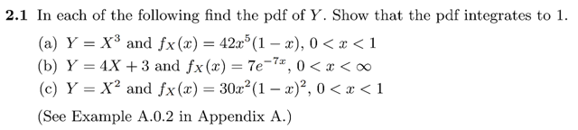
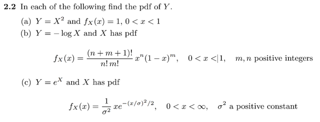

# 2.5 Ex

📊 **Progress:** `3` Notes | `2` Screenshots

---
<a id="node-133"></a>

<p align="center"><kbd></kbd></p>

> [!NOTE]
> Hướng làm: để tìm pdf của Y `=` g(X), rõ ràng ta sẽ dùng cách lập luận gốc
> để xây dựng cdf của Y:
>
> ```text
> P(Y ≤ y) = P(g(X) ≤ y) = P({x ∈ ΩX: g(x) ≤ y}) | ΩX là range / sample space
> ```
> của X
>
> ```text
> = Σ x ∈ {x ∈ ΩX: g(x) ≤ y} P(X = x)
> ```
>
> Nếu gọi A là tập {t ∈ `ΩY:` t ≤ y}, cũng chính là `(-inf,` y] thì tập  {x ∈ `ΩX:` g(x)
> ≤ y} chính là ginv(A) `=` ginv({t ∈ `ΩY:` t ≤ y})
>
> ⇨ có thể ghi là `Σ` x ∈ `ginv((-inf,` y]) P(X `=` x)
>
> Ở đây X là continuous rv thì công thức tương đương là:
>
> `=` `∫` x ∈ `ginv((-inf,` y]) fX(x)dx
>
> Nên câu chuyện là xác định `ginv((-inf,` y]).
>
> `====`
>
> Thế thì xét `∫` {x: g(x) ≤ y} fX(x)dx
>
> Nếu hàm g(x) **đơn điệu tăng**: thì g(x) ≤ y ⇔ ginv(g(x)) ≤ ginv(y) ⇔ x ≤ ginv(y)
>
> Khi đó {x: g(x) ≤ y} `=` {x: x ≤ ginv(y)} `=` x ∈ `(-inf:` ginv(y))
>
> ```text
> ⇨ ∫ {x: g(x) ≤ y} fX(x)dx = ∫-inf: ginv(y) fX(x)dx và đây chính là FX(ginv(y))
> ```
> tức cdf của X evaluate tại ginv(y), nên:
>
> FY(y) `=` FX(ginv(y))
>
> ```text
> Ta biết fY(y) = d/dy FY(y) = d/dy FX(ginv(y))
> ```
>
> `=` `d/dx` FX(ginv(y)) . `d/dy` x 
>
> **= fX(ginv(y)) `d/dy` ginv(y)**(Hay fX(ginv(y)) `dx/dy)`
>
> ```text
> -----
> ```
>
> Còn khi g(x) **đơn điệu giảm**: g(x) ≤ y ⇔ ginv(g(x)) `=` x ≥ ginv(y)
>
> ⇨ {x: g(x) ≤ y} `=` {x: x ≤ ginv(y)} `=` x ∈ (ginv(y), inf)
>
> ⇨ `∫` {x: g(x) ≤ y} fX(x)dx `=` `∫ginv(y):inf` fX(x)dx 
>
> ```text
> Và đây chính là 1 - ∫-inf: ginv(y) fX(x)dx  (bởi lẽ ∫-inf:inf fX(x)dx = 1)
> ```
>
> mà cái này `∫-inf:` ginv(y) fX(x)dx, lại chính là FX(ginv(y))
>
> ⇨ FY(y) `=` 1 `-` FX(ginv(y))
>
> Tương tự, lấy đạo hàm ta có fY(y):
>
> ```text
> fY(y) = d/dy FY(y) = d/dy [1 - FX(ginv(y))]
> ```
>
> ```text
> = - d/dy FX(ginv(y)) = -d/dx FX(ginv(y)) d/dy ginv(y)
> ```
>
> `=` `-` fX(ginv(y)) `d/dy` ginv(y)
>
> Vậy kết luận:
>
> f**Y(y) `=` fX(ginv(y)) `d/dy` ginv(y) khi hàm g đơn điệu tăng
>
> và `-` fX(ginv(y)) `d/dy` ginv(y) khi hàm g đơn điệu giảm
>
> Gom lại là: fX(ginv(y)) `|d/dy` ginv(y)| 
>
> Còn khi nó không đơn điệu thì ko tính được**

> [!NOTE]
> Câu a) g(x) `=` x^3 ≤ y
>
> Xét hàm g(x) `=` x^3:
>
> `d/dx` g(x) `=` 3x^2, và với 0 < x < 1 thì `d/dx` g(x) đều dương ⇨ Theo mean
> value theorem cho thấy hàm số tăng liên tục trong khoảng (0, 1)
>
> ⇨ hàm g(x) là hàm đơn điệu tăng
>
> ⇨ g(x) `=` x^3 ≤ y ⇔ x ≤ `y^1/3`
>
> ```text
> ⇨ {x ∈ ΩX: g(x) = x^3 ≤ y} = {x ∈ ΩX: x ≤ y^1/3}
> ```
>
> Do đó:
>
> ```text
> FY(y) = P(Y ≤ y) = ∫ {x ∈ ΩX: x ≤ y^1/3} fX(x)dx = ∫-inf y^1/3 fX(x)dx
> ```
>
> Và cái này chính là `FX(y^1/3)`
>
> ```text
> Nên fY(y) = d/dy FY(y) = d/dy [∫-inf y^1/3 fX(x)dx]
> ```
>
> ```text
> = d/dy FX(y^1/3) =
> ```
>
> ```text
> = d/dx FX(y^1/3) d/dy x
> ```
>
> ```text
> = fX(y^1/3) d/dy y^1/3
> ```
>
> ```text
> = fX(y^1/3) 1/3y^(-2/3)
> ```
>
> ```text
> Vậy fY(y) = (1/3) fX(y^1/3) y^(-2/3)
> ```
>
> Thay fX(x) `=` 42x^5(1 `-` x)
>
> ```text
> ⇨ fY(y) = (1/3) 42(y^1/3)^5 [1 - y^1/3] y^(-2/3)
> ```
>
> ```text
> = (42/3) (y^5/3) [1 - y^1/3] y^(-2/3)
> ```
>
> ```text
> = (42/3) (y) [1 - y^1/3]
> ```
>
> `=` 14(y `-` `y^4/3)`
>
> Với x ∈ (0, 1) ⇨ y ∈ (0, 1)
>
> `====`
>
> Thử chứng minh `∫-inf:inf` fY(y)dy `=` 1:
>
> ```text
> ∫-inf:inf fY(y)dy = ∫0:1 14(y - y^4/3) dy
> ```
>
> ```text
> = 14 ∫0:1 (y - y^4/3) dy
> ```
>
> ```text
> = 14 [ (1/2)y^2 - (3/7)y^7/3)] |0:1
> ```
>
> ```text
> = 14 [1/2 - 3/7)]
> ```
>
> `=` 7 `-` 6 `=` 1
>
> b) QUAY LẠI LÀM SAU

> [!NOTE]
> QUAY LẠI SAU LÀM CÂU B, C

<br>

<a id="node-134"></a>

<p align="center"><kbd></kbd></p>

<br>

