# 3.1&2 Discrete distribution

📊 **Progress:** `29` Notes | `44` Screenshots

---

<kbd>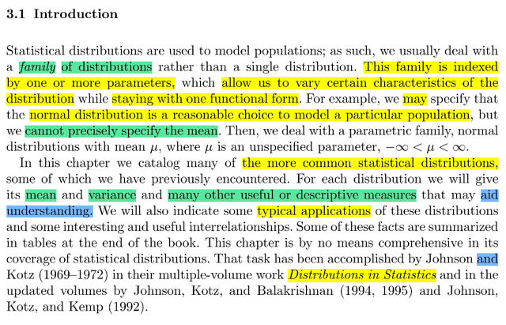</kbd>

> [!NOTE]
> đại khái là ...

 

<kbd>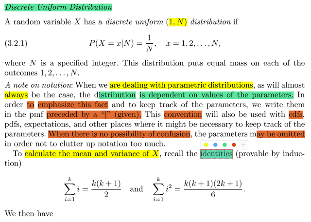</kbd>

<kbd>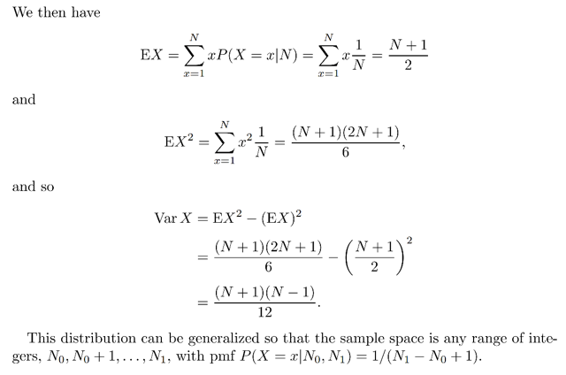</kbd>

<kbd></kbd>

<kbd></kbd>

<kbd>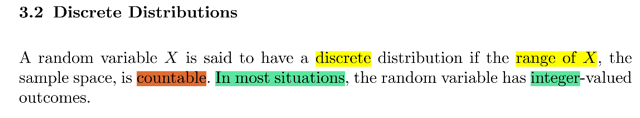</kbd>

> [!NOTE]
> Đầu tiên như ta đã biết, rv gọi là discrete nếu như range của nó countable (nó có
> thể infinite, ví dụ như Bin(n,p) có possible value finite nhưng Geometric thì không
> nhưng đều là discrete
>
> Thế thì discrete distribution đầu tiên mà ta chưa từng gặp ở stat110 (chỉ học về
> continuous uniform) là discrete uniform. Có pmf P(X = x | N) = 1/N x = 1,2....N
>
> Ở đây gs lưu ý, khi làm việc với parametric distribution, thì hầu như ta luôn  phụ
> thuộc vào giá trị của parameters. Nên để nhấn mạnh điều này thì ta sẽ ghi là |N,
> để ý là, với giá trị của N thì pmf của X: fX(x) = 1/N
>
> Cái này đã từng gặp trong stat110 khi trong một ví dụ gs Blizstein có nói đến vụ,
> với việc biết N thì X ~ Bin(p, N)
>
> Thế thì trước khi đi tính mean và variance gs đề nghị nhớ lại một só identity:
>
> Σ i=1:k = k(k + 1)/2 và
>
> Σi=1:k i^2 = k(k+1)(2k+1)/6
>
> Đây là tổng các dãy số đã học ở lớp 10, có thể chứng minh bằng quy nạp
> (induction) QUAY LẠI SAU
>
> Từ đó thử tìm mean và variance:
>
> Mean thì ta stat110 dạy rằng nhớ ý nghĩa là weighted average các possible value
> của X với weight là xác suất:
>
> EX = Σx=1,2...N xP(X=x) =  Σx=1,2...N x (1/N) = (1 + 2 + ..N)/N 
>
> = [N(N+1)/2]/N |dùng identity ở trên Σi=1:k i = k(k+1)/2
>
> ⇨ EX = (N+1)/2
>
> Để tính Var ta tính EX^2 luôn (Để dùng công thức thức 2 của Var(X) 
>
> = EX^2 - (EX)^2)
>
> EX^2 thì dùng LOTUS = Σx=1,2...N x^2 P(X = x) = Σx=1,2...N x^2/N 
>
> = [N(N+1)(2N+1)/6]/N
>
> = (N+1)(2N+1)/6]
>
> Từ đó Var(X) = EX^2 - (EX)^2 = (N+1)(2N+1)/6] - [(N+1)/2]^2
>
> =

 

<kbd>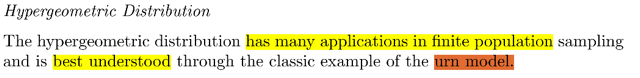</kbd>

<kbd></kbd>

<kbd>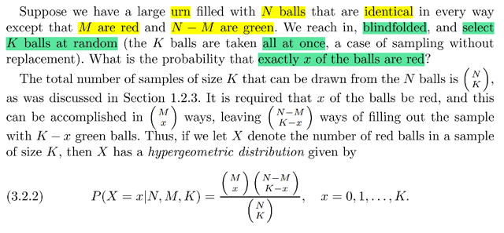</kbd>

> [!NOTE]
> Mình gặp lại Hypergeometric distribution. Nhớ lại trong stat110, distribution
> này có story tương tự như Bin(n, p) đó là đếm số thử nghiệm thành công
> nhưng khác một điểm quan trọng.
>
> Với Bin(n, p), story của nó là số Bern(p) thành công trong chuỗi n
> Bern(p) trial iid. Và để cho thấy sự giống nhau với Hypergeometric, ta cũng
> có thể coi tương tự sampling lần luợt n banh từ lọ có hai loại trắng đỏ. với tỉ
> lệ banh đỏ trong tổng số là p. Và ta quan tâm đến số banh đỏ có được
> (tương đương Bern(p) trial success) Và điểm quan trọng là, sampling có
> hoàn lại. Để mỗi lần bốc đều có tỉ lệ ra banh đỏ như nhau, độc lập nhau.
> PMF của Binomial đã lập luận mấy lần ở trên, nên ko nói ở đây nữa.'
>
> Và stat110 hay dùng Bin(n, p) để chỉ có n Bern(p) trial. Vậy để giống như mô
> tả về urn model trong sách ta có thể gọi số banh đỏ bốc được trong  K banh
> có N banh trong đó có M banh đỏ (để p = M/N) là Bin(K, M/N)
>
> Thế thì với Hypergeometric, điểm khác biệt là sampling KHÔNG hoàn lại và
> hình ảnh là thay vì lấy lần lượt (lấy xong bỏ vào lại) như Binomial. Thì với
> Hgeom, ta sẽ lấy cùng lúc K banh, hoặc, lấy xong bỏ ra không hoàn lại.
>
> Điều này khiến xác suất bốc được banh trong mỗi lần bốc (nếu lấy từng cái)
> sẽ khác nhau và bị ảnh hưởng bởi kết quả của lần bốc trước. Do đó, nó
> không còn là Binomial nữa.
>
> Thử lập luận PMF của Hypergeometric:
>
> (X=x) mang ý nghĩa là trong K banh bốc ra thì có x banh đỏ.
>
> Experiment là bốc K banh từ lọ có N banh và ta không quan tâm thứ tự của
> banh, thì số possible outcome là (N choose K)
>
> Vì việc sampling K banh là hoàn toàn ngẫu nhiên nên các possible outcome
> đều có xác suất xảy ra là bằng nhau. Từ đó P({s}) = 1 / (N choose K) (do
> axiom 2: P(Ω) = Σ {s ∈ Ω} P({s}) = 1 ⇨ P({s}) = 1 / (tổng p.o))
>
> Còn X=x thì có bản chất là = {s ∈ Ω: "có x banh đỏ"},
>
> ⇨ P(X=x) = P({s ∈ Ω: "có x banh đỏ"})
>
> = Σ {s ∈ Ω: "có x banh đỏ"} P({s}) = Σ {s ∈ Ω: "có x banh đỏ"} [1 / (N choose
> K)]
>
> Do đó ta chỉ cần tính xem có bao nhiêu cách chọn set K banh trong đó có x
> banh đỏ: Dễ thấy vì ta có M banh đỏ nên sẽ có (M choose x) cách chọn một
> set x banh đỏ. Với mỗi một cách chọn đó, ta có (N - M) choose (K - x) cách
> chọn một set K - x banh trắng còn lại.
>
> Vậy số cách chọn set có x banh đỏ trong lọ có N banh là: **(M c x)(N - M c K -
> x)
>
> Kết qủa P(X=x) = (M choose x)(N - M choose K - x) 1 / (N choose K)]
>
> Như đã nói ta sẽ ghi là P(X=x|N,M,K) để nhấn mạnh các parameter của
> distribution**====
>
> Như vậy có thể nhận xét, với Bin(n, p) thì ta sẽ dùng story là chuỗi n Bern(p)
> trial Còn với Hypergeometric thì dùng urn model trong đó ta lấy k banh ra
> cùng lúc và quan tâm số cách lấy mà có x banh đỏ. Thay vì nói theo kiểu lấy
> từng banh ra không hoàn lại sẽ thấy khó hình dung hơn

 

<kbd>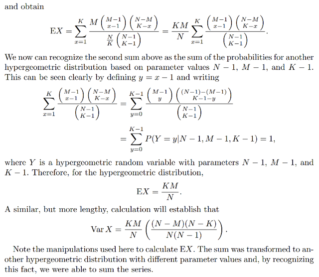</kbd>

<kbd></kbd>

<kbd>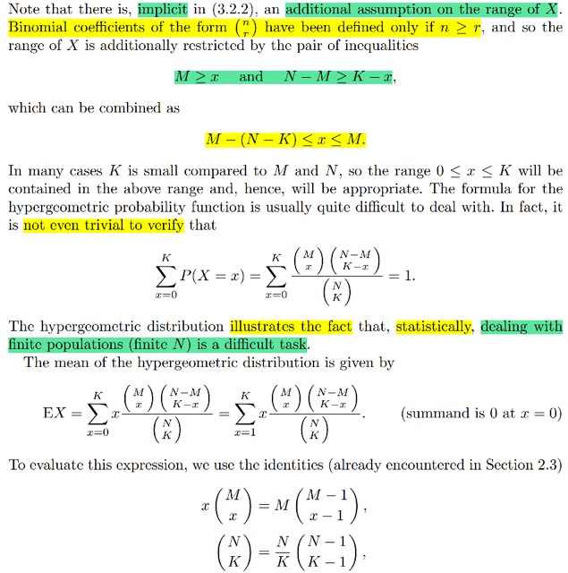</kbd>

> [!NOTE]
> Rồi, đại khái là công thức nhị thức (n choose k) sẽ ngầm giả định n > k
> nên trong pmf của Hgeom ta có giả định ngầm là M ≥ x, N - M ≥ K - x
>
> Rồi, gs cho biết cái Hypergeometric là một ví dụ minh họa cho việc
> làm việc với discrete finite distribution là rất khó nhằn. Ví dụ như ngay
> cả việc chứng minh Σx=0:K P(X=x) = 1 (tính valid của pmf) cũng ko phải
> là dễ.
>
> Thử tính EX:
>
> EX = Σx=0:K xP(X=x) = Σ x (M choose x)(N - M choose K - x) 1 / (N choose K)]
>
> ta sẽ dùng một identity quen thuộc xây dựng từ câu chuyện đếm số cách chọn
> một nhóm k người từ đám n người, và chọn leader: Có hai cách làm:
>
> Chọn leader trước: n cách ⇨ chọn k-1 người để thành nhóm: (n-1 choose k-1)
> cách ⇨ Có n(n-1 choose k-1) cách chọn.
>
> Chọn nhóm trước: (n choose k) cách ⇨ chọn người leader: k cách
> ⇨ Có k(n choose k) cách,
>
> Vậy**k(n choose k) = n(n-1 choose k-1)**Cái identity thứ hai là (n choose k) = (n/k) (n-1 choose k-1) là sao?
>
> Đơn giản là vì công thức 
>
> (n choose k) = n! / (k!(n-k)!) 
>
> = n(n-1)! / k(k-1)!(n-k)!****= n(n-1)! / k(k-1)!(n-1-(k-1))!
>
> = [n/k] [(n-1)!/(k-1)!(n-1)-(k-1))!]
>
> = (n/k) [(n-1) choose (k-1)]****Áp dụng vào 
>
> ⇨ x (M choose x) = M(M-1 choose x-1)
>
> ⇨ EX = Σ M(M-1 choose x-1)(N - M choose K - x) 1 / (N choose K)]
>
> = Σ M(M-1 choose x-1)(N - M choose K - x) 1 / [N/K] (N -1choose K-1)]
>
> = (KM / N) **Σ (M-1 choose x-1)(N - M choose K - x) 1 / (N -1choose K-1)]**Và cái Σ thứ hai là Σ pmf của một hypergeometric khác, do đó kết qủa của
> nó sẽ là 1
>
> Vậy EX = (KM / N)**VARIANCE QUAY LẠI SAU**

 

<kbd>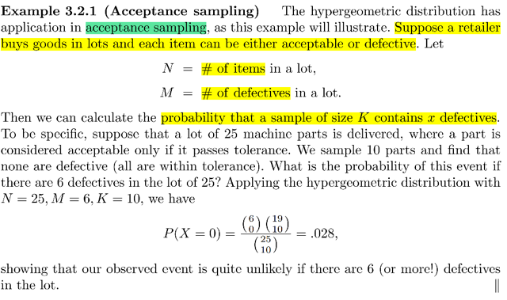</kbd>

> [!NOTE]
> Một ví dụ áp dụng
> hypergeometric

> [!NOTE]
> QUAY LẠI SAU

 

<kbd>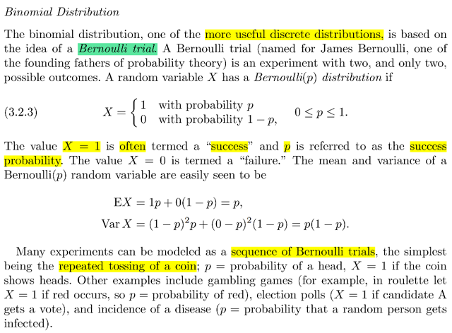</kbd>

> [!NOTE]
> Mở đầu nói về Bern(p) rv.
> Cái này quá dễ rồi

 

<kbd>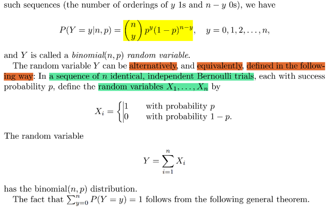</kbd>

<kbd></kbd>

<kbd>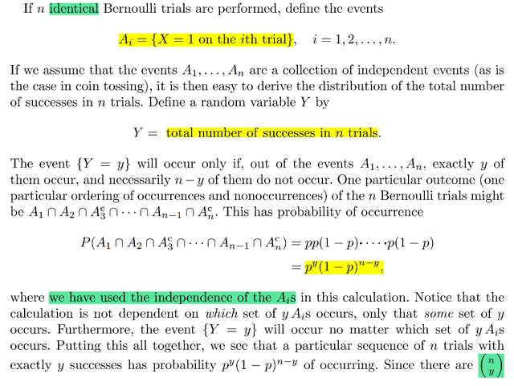</kbd>

> [!NOTE]
> Bin(n, p) thì quá rành rồi, và ở đây cũng chỉ nói y như stat110, đó là ta 
> có thể hiểu nó theo 2 story: Chuỗi n Bern(p) event A1, A2...An. Mà xác
> xuất xảy ra là p. Và X sẽ là số event xảy ra.
>
> Story thứ hai là gắn mỗi event Ai với một indicator rv Xi. Thì X chính là
> tổng Xi.
>
> PMF của nó thì đã lập luận nhiều lần nên ko nhắc lại nữa

 

<kbd>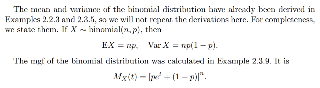</kbd>

<kbd></kbd>

<kbd>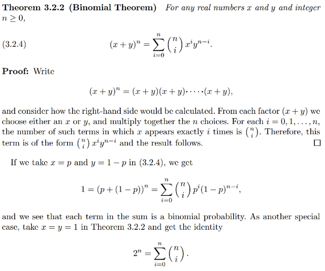</kbd>

> [!NOTE]
> Rồi, ta mới gặp lại cái định lý nhị thức: (x+y)^n = Σi=0:n (n choose i) x^i y^(n-i)
>
> Thế thì để hiểu vì sao nó ra bên phải:
>
> ta sẽ thể hiện (x+y)^n = (x+y)(x+y)...(n lần)...(x+y)
>
> để rồi khi khai triển ra, có phải là với mỗi trong n thừa số, ta sẽ chọn hoặc x hoặc 
> y để nhân không 
>
> Do đó dễ thấy để có x^1 thì có nghĩa là 1 trong số đó chọn x, và số còn lại chọn y.
> và dễ thấy có (n choose 1) các chọn nơi mà x được chọn. Nên hệ số gắn với
> x^1y^(n-1) khi khai triển cái tổng này ra sẽ là (n choose 
>
> Tương tự để có x^2 thì có nghĩa là có 2 nơi (trong n thừa số) chọn x, n-2 nơi còn
> lại chọn y. Và như vậy có (n choose 2) cách chọn 2 nơi cho x. Nên hệ số gắn
> với hạng tử x^2y^(n-2) sẽ là (n choose 2)
>
> Tương tự như vậy thì hệ số của x^ky^(n-k) chính là (n choose k)
>
> Và do đó khi khai triển ra thì nó sẽ là Σk=1:n (n choose k)x^ky^(n-k)
>
> ====
>
> Và trường hợp chọn x = p, y = 1 - p, ta sẽ có x + y = 1 và 
>
> Khi đó 1^n = Σk=1:n (n choose k) p^k (1-p)^(n-k) và đây chính là tính valid của
> binomial pmf khi tổng xác suất bằng 1
>
> Mean của Bin là np var = npq cũng như mgf MX(t) = [pe^t + (1-p)]^n 
> đã chứng minh cả rồi

 

<kbd>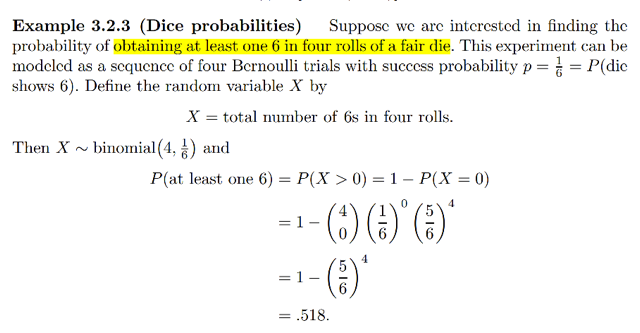</kbd>

> [!NOTE]
> Qua bài toán tung 4 con xí ngầu, và muốn xác suất của việc có ít nhất một con 
> ra 6 nút.
>
> Cái này đã gặp trong stat110, hình như là bài toán Newton Perp gì đó.
>
> Thử lập luận lại:
>
> Ta sẽ xét event Ac = "không có con nào ra 6" tức là complement của event A 
> cần tính xác suất. 
>
> Nếu gọi Ii là event con xí ngầu thứ i không ra 6 thì 
>
> Ac = I1 ∩ I2 ∩ I3 ∩ I4.
>
> Soi kĩ một chút chỗ này: 
>
> Ac có bản chất là {s ∈ Ω: s đều có dạng là 4 xí ngầu đều khác 6}
>
> còn Ii có bản chất là {s ∈ Ω: s đều có dạng là con xí ngầu thứ i khác 6}
> nên một possible outcome (kết quả của tung 4 xí ngầu) mà con nào cũng ra khác
> 6 thì nó sẽ thuộc cả 4 tập I1, I2, I3, I4.
>
> ⇨ P(Ac) = P(I1 ∩ I2 ∩ I3 ∩ I4). Và vì các lần tung xí ngầu là độc lập nên các 
> event I1, I2, I3, I4 độc lập. Do đó theo định nghĩa về event độc lập thì xác suất
> của joint event bằng tích xác suất của chúng:
>
> ⇨ P(Ac) = P(I1 ∩ I2 ∩ I3 ∩ I4) = Π1:4 P(Ii)
>
> Giờ xét P(Ii):
>
> Như đã nói tập Ii = {s ∈ Ω: s đều có dạng là con xí ngầu thứ i khác 6}
>
> ví dụ I1 sẽ là {s ∈ Ω: s = 1xxx or s = 2xxx or ...s = 5xxx}
>
> = {s ∈ Ω: s = 1xxx} ∪ {s ∈ Ω: s = 2xxx} ∪...∪ {s ∈ Ω: s = 5xxx}
>
> Thế thì
>
> P(I1) = P({s ∈ Ω: s = 1xxx or s = 2xxx or ...s = 5xxx})
>
> = P({s ∈ Ω: s = 1xxx} ∪ {s ∈ Ω: s = 2xxx} ∪...∪ {s ∈ Ω: s = 5xxx})
>
> và đây là union của các disjoint event, nên axiom 3 cho ta:
>
> = P({s ∈ Ω: s = 1xxx}) + P({s ∈ Ω: s = 2xxx}) +...+ P({s ∈ Ω: s = 5xxx})
>
> Xét P({s ∈ Ω: s = 1xxx}) theo định nghĩa hàm xác suất:
>
> = Σ {s ∈ Ω: s = 1xxx} P({s}). 
>
> Để tính P({s}) ta lập luận rằng việc tung xí ngầu là hoàn toàn ngẫu 
> nhiên nên xác suất của một possible outcome đều như nhau (equally likely). 
> Nên dùng axiom 1: P(Ω) = 1 ⇔ Σ{s ∈ Ω} P({s}) = 1 ⇔ P({s}) = 1/tổng số po
>
> Có bao nhiêu possible outcome khi tung 4 xí ngầu
>
> Ta phải trả lời hai câu hỏi: 
>
> Có quan tâm thứ tự không và có hoàn lại hay không.
>
> Thì việc 4 tung xí ngầu này sẽ giống như ta tung xí ngầu 4 lần, và cũng giống như
> ta bốc từ lọ có 6 trái banh đánh số 1 đến 6, và bốc 4 lần theo lối có hoàn lại.
> Đó là đã trả lời được vụ có hoàn lại hay không.
>
> Còn có quan tâm thứ tự hay không, thì phải xem ta quan tâm event gì: Đó là 
> số outcome mà thằng đầu tiên ra 1 nút. Do đó ta có quan tâm thứ tự.
>
> Vậy có quan tâm thứ tự và sampling có hoàn lại thì công thức là n^k: 6^4
>
> Vậy P({s}) = 1 / 6^4
>
> Từ đó quay lại tính P(I1) = Σ {s ∈ Ω: s = 1xxx} P({s}), chỉ việc đếm số po trong
> tập này:
>
> Bài toán sẽ là, trong 6^4 po có dạng xxxx thì có bao nhiêu cái có dạng 1xxx?
>
> Vậy thì giống như settting: Chọn 4 lần, từ lọ có 6 banh đánh số từ 1 đến 6 thì
> có mấy cách chọn để ra kết quả là 1xxx
>
> Muốn vậy thì lần 1 phải ra 1, chỉ có 1 cách chọn.
>
> Còn số cách chọn của chuỗi xxx thì giống như trên, nó sẽ ra 6^3.
>
> Vậy có 6^3 po trong event ({s ∈ Ω: s = 1xxx}) và P(P({s ∈ Ω: s = 1xxx})) 
> = 6^3 P({s}) = 6^3 / 6^4 = 1/6.
>
> Hoàn toàn tương tự, ta có thể tính P({s ∈ Ω: s = 2xxx}) = 1/6, ...
>
> Nên P(I1) = P({s ∈ Ω: s = 1xxx}) + P({s ∈ Ω: s = 2xxx}) +...+ P({s ∈ Ω: s = 5xxx})
>
> = 5/6
>
> Và làm tương tự cũng sẽ thấy P(I2) = P(I3) = P(I4) = 5/6
>
> Dẫn đến P(Ac) = Π P(Ii) = (5/6)^4 từ đó P(A) = 1 - (5/6)^4

> [!NOTE]
> Tất nhiên có cách làm nhanh hơn khi nhận ra rằng:
>
> set / event {s ∈ Ω: s có có dạng 1xxx} thật ra tương ứng 1-1
> với event "lần tung thứ nhất ra 1" tức là chỉ xét riêng lần tung
> thứ nhất.
>
> Vì nếu nó xảy ra, thì outcome của sample gốc thuộc tập trên
> sẽ xảy ra và ngược lại.
>
> Nên P{s ∈ Ω: s có có dạng 1xxx} = P(lần tung thứ nhất ra 1)
> và vì các lần tung không liên quan gì nhau nên nó cũng bằng
> P(tung xí ngầu ra 1) = 1/6
>
> Có nghĩa là, ta đã chuyển việc tính xác suất của một event 
> trong sample space gốc thành tính xác suất của một event
> trong một sample space khác chỉ liên quan đến tung một xí
> ngầu.
>
> Và lập luận tương tự ta cũng có P({s ∈ Ω: s có có dạng 2xxx}) 
> = 1/6
>
> Và có thể gom luôn lại để tính 
>
> P(s ∈ Ω: s có có dạng lần tung thứ nhất khác 6) = P(tung xí ngầu
> lần 1 không ra 6) = P(tung xí ngầu không ra 6) = 5/6
>
> Từ đó rút ngắn cách tính đi đáng kể.
>
> =====
>
> Tuy nhiên cách tính nhanh nhất đó là:
>
> Nhận ra rằng các lần tung xí ngầu là độc lập, và nếu chỉ quan tâm
> đến việc có ra 6 hay không thì coi như ta có 4 Bern(p) trial với
> p = 1/6 là xác suất ra 6 ở mỗi lần tung. Và nếu ta quan tâm X là
> số lần ra 6 thì dễ thấy X chính là random variable ~ Binomial (4, 1/6)
>
> Để rồi cái event mà ta muốn tính xác suất, tức Ac: (ko có lần nào ra 6) 
> chính là event X = 0.
>
> Từ đó chỉ việc ráp pmf của Bin(n, p) vào:
>
> P(X=k) = (n choose k)p^k(1-p)^(n-k)
>
> = (4 choose 0)(1/6)^0(1-1/6)^4 
>
> = 1*1*(5/6)^4 = (5/6)^4
>
> ⇨ P(A) = **1 - (5/6)^4**

 

<kbd>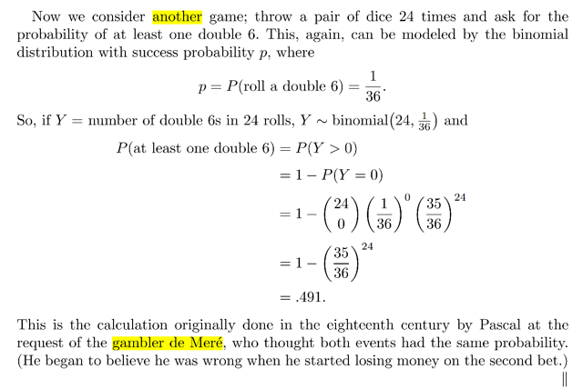</kbd>

> [!NOTE]
> Rồi, tương tự nếu ta đặt bài toán là tung một cặp xí ngầu 24 lần và tính xác
> suất của việc ra ít nhất hai con 6.
>
> Thì ta có thể tính một bài toán dài như vừa rồi nhưng cũng có thể làm rát
> đơn giản. Đây chỉ là ta quan tâm số lần thành công của 24 Bern(p) trial độc
> lập với xác suất thành công mỗi trial là 1/36 (là xác suất của việc tung 2 xí
> ngầu đều ra 6)
>
> Do đó số lần thành công Y ~ BIn(24, 1/36) từ đó dễ dàng tính được P(có ít
> nhất 1 lần thành công) = 1 - P(ko lần nào thành công)
>
> = 1 - P(Y = 0) = 1 - (24 choose 0) (1/36)^0 (1 - 1/36)^24
>
> **= 1 - (35/36)^24**
>
> Và ý cuối (stat110 cũng đã từng nói nhưng hơi khó hiểu là thầy Blizstein nói
> đó là bài toán Newton-Perp, nơi ông Pepr gì đó đem bài toán này đi hỏi
> Newton) đó là ta thấy kết quả nhỏ hơn hồi nãy. Đây là điều mà hồi xưa ông
> Pascal tính ra và ngạc nhiên vì ông ban đầu ông cho rằng nó bằng nhau.

 

<kbd>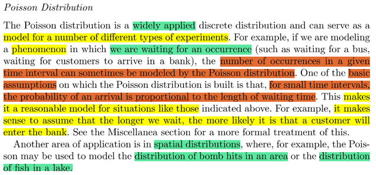</kbd>

> [!NOTE]
> Rồi gặp lại Poison distribution. Có một story mà giúp mình nhớ luôn
> hai distribution là liên hệ giữa Poisson và Exponential distribution
>
> Đó là khi ta muốn xét quãng thời gian phải chờ trước khi nhận được
> email đầu tiên: T, thì T sẽ ~Expo. Và liên hệ nó với Số email nhận
> được trong một khoảng thời gian t: N ~Pois(λt). Để từ đó ta xây dựng
> CDF của T bằng P(T ≤ t) = 1 - P(T > t) = 1 - P(N = 0) rồi áp công thức
> của Poisson pmf vô để xây dựng cdf của T.
>
> Thế thì trong story đó, người ta cho số email nhận được trong khoảng
> thời gian t là một Pois(λt) để t càng dài thì tham số của Pois càng lớn
> (thì xác suất cũng sẽ lớn)
>
> Thế thì ở đây gs nói Poisson distribution đại khái là được dùng rất
> rộng rãi. Vì giả định cơ bản của Pois là thời gian càng dài thì xác suất
> xảy ra càng lớn mà trong thực tế có nhiều trường hợp phù hợp với giả
> định này.
>
> Ngoài ra gs còn nhắc đến việc có thể ứng dụng nó trong spatial distribution.
> Như distribution của bom rơi trong một vùng. Cái này ta liên hệ với stat110
> gs Blizstein từng nói về câu chuyện mưa rơi: Chia vùng ra thành nhiều ô
> nhỏ thì số ô càng nhiều xác suất mưa rơi trúng càng ít.

 

<kbd>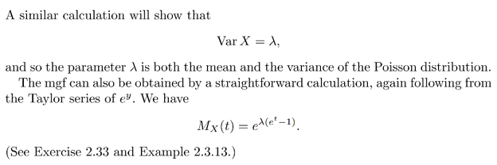</kbd>

<kbd></kbd>

<kbd>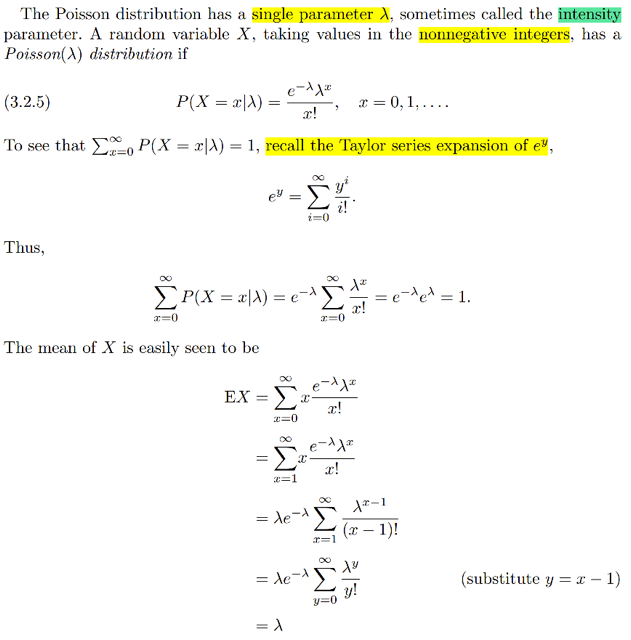</kbd>

> [!NOTE]
> Rồi pmf của Pois P(X = x| λ) = e^-λ λ^x / x! ; x = 0,1...
>
> Thử làm lại việc check Σx P(X=x) = 1
>
> Σx e^-λ λ^x / x!
>
> Ta sẽ vận dụng Taylor series của e^x:
>
> Taylor series của f(x) tại x = a sẽ là:
>
> f(x) = Σn [đạo hàm cấp n của f]|x=a x^n / n!
>
>  Với f(x) = e^x thì đạo hàm cấp bao nhiêu cũng là e^x
>
> ⇨ e^x = Σn=1,2.. e^x)|x=a x^n / n!
>
> = Σn e^a x^n / n!
>
> Chọn a = 0 ⇨ e^x =  Σn e^0 x^n / n! = **Σn x^n / n!
>
> Áp dụng vào đây:**Σx e^-λ λ^x / x! ****
> = e^-λ Σx λ^x / x! | đưa e^-λ ra ngoài
>
> Xét Σx λ^x / x!, thì áp dùng e^x = Σn x^n / n!
>
> thì Σx λ^x / x! cũng như Σn λ^n / n! (đổi kí hiệu thôi)
>
> nó chính là e^λ 
>
> Vậy ta có e^-λ Σx λ^x / x!  = e^-λ e^λ = e^0 = **1**

> [!NOTE]
> Rồi thử tính EX:
>
> EX = Σx xP(X=x)
>
> = Σx=0:inf x e^-λ λ^x / x! 
>
> = Σx=1:inf x e^-λ λ^x / x!  | vì x = 0 thì hạng tử cũng = 0
>
> = Σx=1:inf e^-λ λ^x / (x-1)! 
>
> = λ Σx=1:inf e^-λ (λ^x / λ) / (x-1)! 
>
> = λ Σx=1:inf e^-λ λ^(x-1) / (x-1)! 
>
> Đặt z = x - 1 ⇨ x = 1:inf ⇨ z = 0:inf
>
> ... = λ Σz=0:inf e^-λ λ^z / z! và cái này = λ vì cái tổng là
> tổng mọi possible value của poisson nên 1
>
> Kết quả là EX = λ

> [!NOTE]
> Var X và MGF QUAY
> LẠI LÀM SAU

 

<kbd>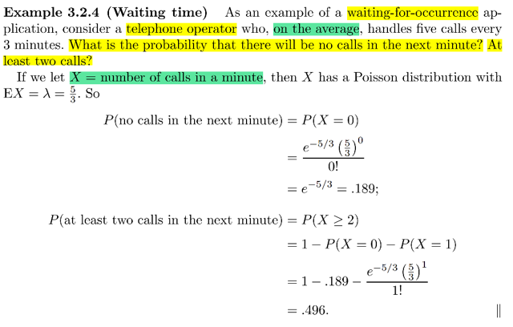</kbd>

> [!NOTE]
> đại khái là đây là một ví dụ của ứng dụng chờ một sự kiện xuất hiện.
> Cụ thể là một người trực điện thoại sẽ nhận trung bình 5 cuộc gọi 
> trong mỗi 3 phút. Câu hỏi là xác suất **trong phút tiếp theo** không có
> cuộc gọi nào. Và xác suất có ít nhất hai cuộc.
>
> Mấu chốt là, đây là bối cảnh phù hợp để ta coi X = "số cuộc gọi nhận
> được trong khoảng thời gian MỘT phút" là một Pois(λ)
>
> Và ở đây ta có trung bình có 5 call / 3 phút ⇨ trung bình một phú có
> 5/3 call ⇨ EX = λ = 5/3
>
> Nên P(trong phút tiếp theo không có call nào) = P(X = 0)
>
> = e^-λ λ^0 / 0! = **e^-5/3**Và P(trong phút tiếp theo có ít nhất 2 call) = 1 - P(X = 1 ∪ X = 2)
> = 1 - P(X = 1) + P(X = 2) (axiom 3) = 1 - e^-λ λ^1 / 1! + e^-λ λ^2 / 2!
>
> Nói chung ko khó hiểu gì lắm

 

<kbd>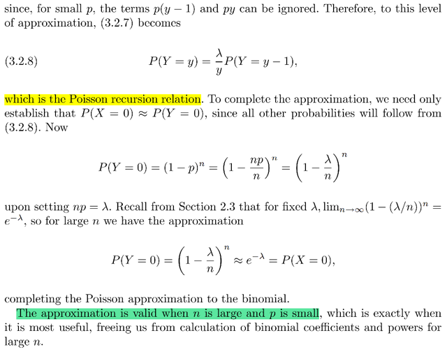</kbd>

<kbd></kbd>

<kbd>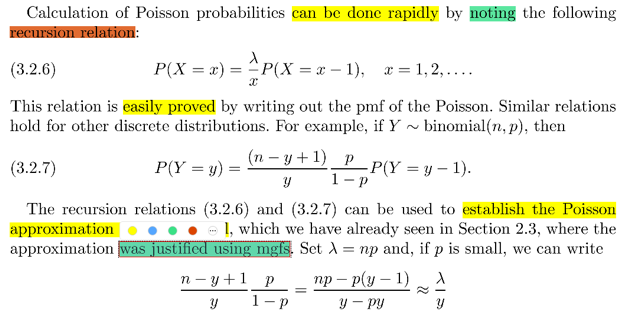</kbd>

> [!NOTE]
> Đại khái là ta sẽ có công thức recursion (đệ quy) rất hữu ích khi tính toán
> với poisson:
>
> P(X = x) = λ/x P(X = x - 1)
>
> Chứng minh rất nhanh: P(X = x) = e^-λ λ^x / x!   
>
> = e^-λ λ^(x-1) λ / x(x-1)!
>
> = (λ/x) e^-λ λ^(x-1)/(x-1)! 
>
> = (λ/x) P(X = x-1)
>
> Tương tự với Y~Bin(n, p) cũng có công thức tương tự:
>
> P(Y = y) = [ (n - y + 1)/y ][ p / 1 - p]P(Y = y - 1)
>
> Chứng minh QUAY LẠI SAU
>
> Nhờ đó mà ta sẽ chứng minh được là nếu n lớn và p nhỏ thì Bin(n, p)
> sẽ xấp xỉ Pois(np) vốn đã chứng minh bằng MGF rồi.
>
> Khi n lớn, p nhỏ:
>
> [(n - y + 1)/y ][p / 1 - p] P(Y = y - 1)
>
> = [p(n - y + 1)/y(1 - p)] P(Y = y - 1)
>
> = [pn - py + p)/(y - py)] P(Y = y - 1)
>
> Nếu p nhỏ thì np - py + p ≈ np CHƯA HIỂU LẮM
>
> y - py ≈ y
>
> Nên đại khái  là nó sẽ ≈ np / y P(Y = y - 1)
>
> ,,,QUAY LẠI SAU

> [!NOTE]
> QUAY LẠI LÀM SAU

 

<kbd>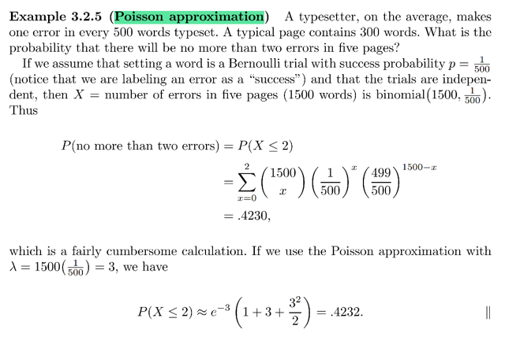</kbd>

> [!NOTE]
> Đại khái là trung bình cứ 500 từ sẽ có một lỗi (đánh máy). Một trang có
> 300 từ. Hỏi xác suất của việc ko có nhiều hơn hai lỗi trong 5 trang.
>
> Đặt số lỗi trong 5 trang là X.
>
> Thì cơ bản là ta có bài toán: có 5x300 =1,500 Bern(p) trial iid. Với p
> là xác suất đánh lỗi ở một từ. Với việc người ta cho biết trung bình **500
> từ** sẽ có **1** lỗi ⇨ xác suất **1**từ gặp lỗi là 1/500
>
> vây X dễ thấy nó có thể coi là Bin(1500, 1/500). Và để tính xác suất
> không có hơn 2 lỗi, tức là chỉ 0 hoặc 1 lỗi ⇨ P(X = 0 ∪ X = 1)
>
> = (1500 choose 0) (1/500)^0 (1 - 1/500)^1500
>
> + (1500 choose 1) (1/500)^1 (1 - 1/500)^1499
>
> tính ra sẽ là 0.423
>
> TUY NHIÊN, ta thấy trong binomial này n lớn (1500), p nhỏ (1/500)
> nên ta có thể xấp xỉ Y bằng Pois(np = 1500/500 = 3) để dùng pmf của
> Pois:
>
> P(X = 0) + P(X = 1)
>
> = e^(-3) 3^0 / 0! + e^(-3) 3^1/1!
>
> = .4232

 

<kbd>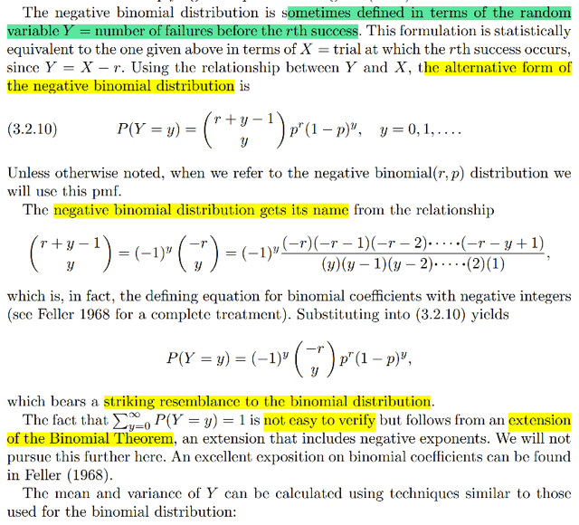</kbd>

<kbd></kbd>

<kbd>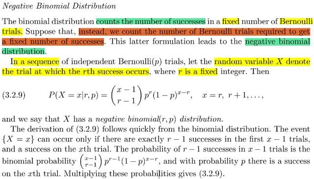</kbd>

> [!NOTE]
> Đại khái là ta sẽ gặp một distribution cũng đã được học ở stat110, nhưng ở
> đây Casella cho cách nhìn khác về nó từ đó lập luận khác để ra pmf dựa vào Bin
>
> Nếu story của Bin(n, p) là số trial success trong n iid Bern(p) trials thì
> story của Negative Binomial sẽ là số Bern(p) trial cần thiết để có r success
> (tức là tham số của distribution là r và p)
>
> Lập luận của pmf của nó như sau:
>
> Xét event (X = x), hay, cần y trial để có r success, nó sẽ là 
>
> {s ∈ Ω: s có dạng là chuỗi **có r success + x - r failure** và **S đứng cuối**}
>
> Ví dụ như r = 3, x = 5 ⇨ X = 5 là set các p.o có dạng có 3 success, 2 failure với
> S đứng cuối: SSFFS, SFFSS, FFSSS. 
>
> Không thể có SSFSF hay SSSFF vù cái đầu sẽ thuộc X = 4, và cái sau
> thuộc X = 3
>
> Do đó nó là intersection của :
>
> A = {s ∈ Ω: s có dạng là chuỗi có r - 1 success + x - r + 1 failure}
>
> và B = {s ∈ Ω: s có dạng chuỗi có x kết quả với S đứng cuối}
>
> Thế thì event đầu tiên, chính là event Y = r - 1 với Y ~ Bin(x-1, p)
>
> ⇨ P(X = x) = P(A ∩ B) = P(A)P(B) | do A, B độc lập, dễ thấy
>
> P(A) thì = P(Y = r-1) = (x-1 choose r-1)p^(r-1)(1-p)^(x-r)
>
> P(B) bằng xác suất của một trial ra success: P(B) = p
>
> Vậy P(X = x) = (x-1 choose r-1)p^(r-1)(1-p)^(x-r) p
>
> = **(x-1 choose r-1)p^r(1-p)^(x-r)**Với công thức này ta thấy cần có những giả định x - 1 ≥ r - 1 ⇨ x ≥ r
>
> nên X sẽ có các possible value từ r, r + 1....

> [!NOTE]
> Tiếp theo đại khái là gs nói về cách nhìn nhận khác của negative binomial đây
> cũng chính là cách nhìn trong stat110 về nó: Số failure trial trước khi có đủ r
> success. (quan tâm đến số event tổng cộng đến khi có r success thì cũng y như
> có bao nhiêu failure đến khi có r success mà thôi)
>
> Thử lập luận pmf: (Đây cũng là lập luận xây dựng pmf của Negative Binomial
> trong stat110):
>
> Xét event Y = y thì bản chất nó là {s ∈ Ω: s có dạng là chuỗi có y failure, và r
> success và quan trọng là cái cuối cùng là success event và chuỗi y
> + r -1 trước đó có r success và y failure ta không care thứ tự của chúng
>
> Ví dụ với r = 3, thì Y = 2 thì nó là set {s ∈ Ω: s = FFSSS or FSSFS or ...}
>
> = {s = FFSSS} ∪ {s = FSSFS} ...
>
> ⇨ P(X = 5) = P({s = FFSSS} ∪ {s = FSSFS}...) và vì các event disjoint nên
>
> = P({s = FFSSS}) + P({s = FSSFS}) + ...
>
> Xét một event {s = FFSSS} nó sẽ là intersection của:
>
> {s = F****} ∩ {s = *F***} = ∩ {s = **S**} = {s = ***S*} = {s = ****S}
>
> ⇨ P({s = FFSSS})
>
> = P({s = F****} ∩ {s = *F***} = ∩ {s = **S**} = {s = ***S*}  = {s = ****S})
>
> Vì các trial là độc lập nên các event này cũng độc lập:
>
> ⇨ Vế phải = P({s = F****})P({s = *F***})P({s = **S**})P({s = ***S*})P({s = ****S})
>
> Và P({s = F****}) thì chính là xác suất của trial đầu tiên fail, và cũng là xác suất
> một trial fail, = 1 - p
>
> Tương tự với các event kia, để vế phải = (1 - p)^2p^3
>
> ⇨ P({s = FFSSS}) = (1 - p)^2p^3
>
> Có thể thấy với {s = FSSFS}...., lập luận tương tự để thấy nó cũng là intersection
> của các trial độc lập, và xác suất  tích của xác suất của 3 success và 2 failure để
> = (1 - p)^2p^3
>
> Vậy P(X = 5) = (1 - p)^2p^3 + (1 - p)^2p^3 + ...
>
> = [tổng số các event có dạng 3 success, 2 failure với S đứng cuối] (1 - p)^2p^3
>
> Công việc còn lại là đến số lượng các event này:
>
> Vì S đứng cuối đã cố định rồi, nên bài toán chỉ còn lại là có bao nhiêu cách xắp
> xếp vị trí cho 2 success và 2 failure vào 4 vị trí, và ta ko cần phân biệt các
> success với nhau cũng như các failure với nhau.
>
> Dễ thấy số cách chọn vị trí cho 4 thằng cũng chính là số cách chọn vị trí cho 2
> thằng success hoặc failure. Và ta ko care phân biệt hai thằng success với nhau
> nên đây sẽ là số cách chọn set 2 vị trí trong 4 vị trí (để bỏ hai thằng success vào),
> với mỗi cách chọn như vậy thì hai thằng failure chỉ việc đi vào hai cái còn lại.
>
> Số cách chọn 2 vị trí trong 4 vị trí: (4 choose 2). Với mỗi cách chọn, chỉ có một
> cách chọn vị trí cho 2 failure trial
>
> Do đó: Kết quả là (4 choose 2)*1 = (4 choose 2) khái quát sẽ là (r + y - 1 choose
> y)
>
> Vậy kết quả cuối cùng là:
>
> (4 choose 2)(1 - p)^2p^3 , hay
>
> **P(Y = y) = (r + y - 1 choose y) (1 - p)^y p^r**

> [!NOTE]
> KHÚC NÓI VỀ CÁI TÊN
> NEGATIVE QUAY LẠI SAU

 

<kbd>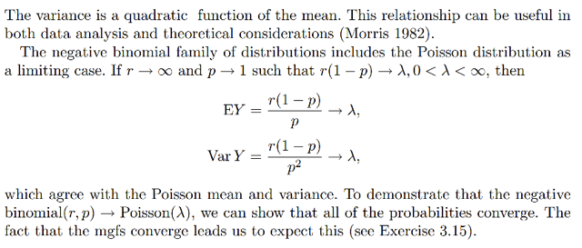</kbd>

<kbd></kbd>

<kbd>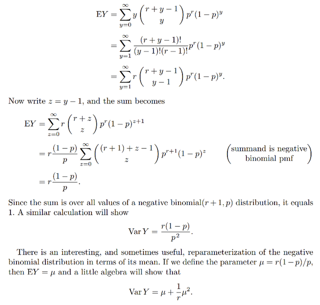</kbd>

> [!NOTE]
> Phần tính mean và var
>
> EY = Σy yP(Y=y) = Σy=0,1... y(r + y - 1 choose y) (1 - p)^y p^r }
>
> = Σy=1,2... { y(r + y - 1 choose y) (1 - p)^y p^r } | vì y = 0 thì hạng tử cũng = 0
>
> = Σy=1,2... { [(r + y - 1)! / (y - 1)! (r - 1)!] (1 - p)^y p^r }   | công thức của (n choose k)
>
> = Σy=1,2... { [(r + y - 1)! r / (y - 1)! r(r - 1)!] (1 - p)^y p^r }  | nhân & chia cho r
>
> = r Σy=1,2... { [(r + y - 1)! / (y - 1)! r!] (1 - p)^y p^r } | r đưa ra ngoài, r(r-1)! = r!
>
> = r Σy=1,2... { [(r + y - 1)! / (y - 1)! r!] (1 - p)^y p^r }
>
> = r Σy=1,2... { (r + y - 1 choose y - 1) (1 - p)^y p^r } (1)
>
> Đặt z = y - 1
>
> (1) = r Σy=1,2... { (r + z choose z) (1 - p)^(z + 1) p^r }
>
>  = r (1 - p) Σy=1,2... { (r + z choose z) (1 - p)^z p^r } | đưa 
>
>  = [ r (1 - p)/p ] Σy=1,2... { (r + 1 + z - 1) choose z) (1 - p)^z p^(r +1) }
>
> = r (1 - p)/p * 1
>
> NÓI CHUNG CHỨNG MINH CÁI NÀY KHÁ LẰNG NHẰNG CHỈ CẦN NẮM Ý CHÍNH
> LÀ RÁNG ĐƯA CÁI Σ VỀ DẠNG CỦA Σ MỌI POSSIBLE VALUE CỦA MỘT CÁI
> NEGATIVE BINOMIAL KHÁC LÀ ĐƯỢC
>
> Đại ý là ta có thể đặt μ = r(1-p)/p thì thấy Variance sẽ là quadratic function
> của mean.
>
> Và khi r → inf, p → 1 (tức, là cho số trial tăng lên, để r tăng lên, và xác
> suất thành công của một trial nhỏ xuống) thì cả variance và mean đều
> converge về cùng một giá trị λ, cho thấy nó cũng giống như Binomial
> sẽ converge về Pois khi n lớn và p nhỏ

 

<kbd>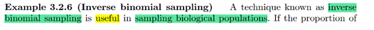</kbd>

<kbd></kbd>

<kbd>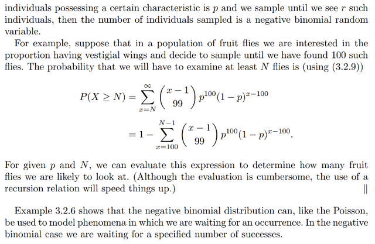</kbd>

> [!NOTE]
> một ví dụ đại khái là cho thấy ứng dụng của negative binomial distribution.
>
> Bài toán đặt ra sẽ là, giả sử loài ruồi giấm có một tính chất là bị thoái hóa cánh
> và xác suất để một con bị cái này là p. Câu hỏi là nếu ta muốn thu thập được r
> con có tính chất này thì xác suất mà ta cần thu thập ít nhất là N mẫu là bao
> nhiêu
>
> Đọc đề là thấy nó hoàn toàn phù hợp vói câu chuyện của negative binomial
> distribution: vì story của random variable tuân theo phân phối này là số Bern(p)
> trial cần thiết để có đủ r kết quả success. Ở đây mỗi con ruồi được thu thập sẽ
> giống như một Bern(p) trial, để rồi nó có thể có hoặc không bị tính chất thoái
> hóa cánh. Nếu nó có, ta có một success event, ngược lại ta có một failure.
>
> Do đó nếu gọi Y là số mẫu cần thu thập để đạt số ruồi dấm là r thì Y sẽ là một
> random variable tuân theo Negative Binomial (r, p) có pmf P(Y = y) như vừa
> chứng minh xong = (r + y - 1 choose y) (1 - p)^y p^r
>
> Thế thì quay lại đề bài là ta cần tính xác suất mà ta cần thu thập ít nhất N mẫu
> thì chính là P(Y ≥ N)
>
> Chuyển sang complement: = 1 - P(Y < N)
>
> = Σy=r, r+1...N-1 [1 - P(Y = N)]
>
> = **Σy=r, r+1...N-1 [1 - (r + y - 1 choose y) (1 - p)^y p^r]**

 

<kbd>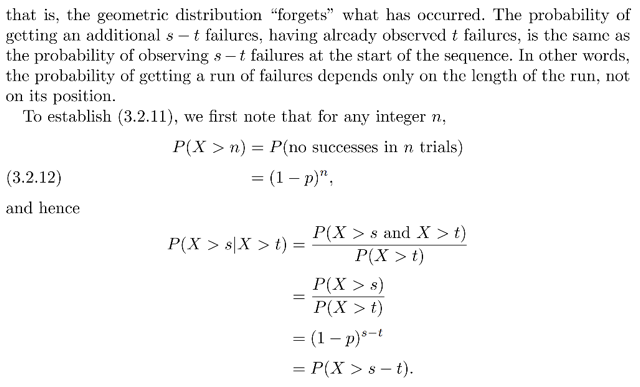</kbd>

<kbd></kbd>

<kbd>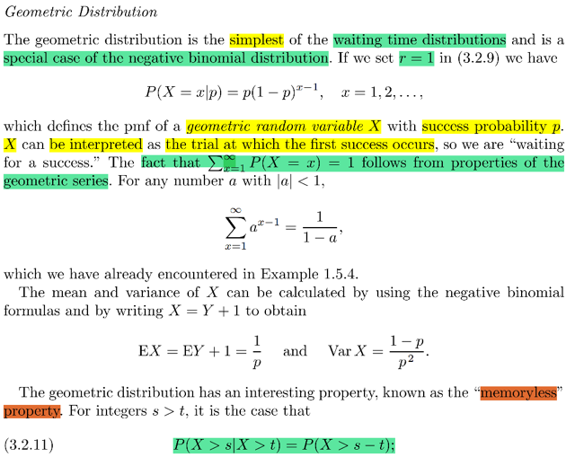</kbd>

> [!NOTE]
> Rồi, với Geometric, ta nhớ stat110 đã học rằng story của nó là tổng số trial
> cần thiết của chuỗi Bern(p) trial cho đến khi có success đầu tiên.
>
> Và có hai convention: có tính success vào hoặc không. Nếu không tính,
> thì nó cũng là số failure cần thiết trước khi có success đầu tiên. Và khi đó
> nó sẽ là dạng đặc biệt của Negative Binomial khi r = 1.
>
> Trong sách này, khi giáo sư Casella định nghĩa nó là tổng số trial cần thiết
> để có success đầu tiên thì ta hiểu là ta sẽ theo convention sau
>
> Và sau khi đã biết về negative binomial thì dễ thấy cái này chính là
> Negative Binomial (r = 1, p)
>
> Do đó áp dụng pmf của neg bin (1, p) ta có:
>
> P(Y = y) = (r + y - 1 choose y) (1 - p)^y p^r
>
> = (1 + y - 1 choose y) (1 - p)^y p^1
>
> = (y choose y) (1 - p)^y p
>
> =(1 - p)^y p
>
> và đó cũng là  pmf của Geometric:
>
> P(X=x|p) = (1-p)^x p
>
> Lập luận nhanh: event có x lần fail cho đến khi thất thành công đầu tiên thì
> chỉ có một cách là chuỗi Bern(p) trial phải chính xác là FFF (x-1 lần) FFS
> Từ đó P(FFF...FS) = P(F)P(F)...x-1 lần P(F)PS = P(F)^(x-1) P(S) =
> **p(1-p)^(x-1)**====
>
> Tính valid của pmf đến từ việc chuỗi số điều hòa hội tụ về 1 (XEM LẠI VỀ
> VỤ  NÀY SAU)
>
> ====
>
> Tính mean và variance:
>
> EX = EY + 1 Là sao? Là vì ở trên đã nói, Geometric là số trial cần thiết
> để có 1 success. Và nếu gọi Y là negative binomial r = 1, p thì nó là số failure
>  cần thiết để có 1 success.
>
> Khi đó dĩ nhiên X = Y + 1 ⇨ EX = EY + E1 = EY + 1
>
> ráp công thức của mean của negative binomial vào:
>
> EX = r(1-p)/p + 1 = (1-p)/p + 1 = (1-p+p)/p = 1/p
>
> Còn variance:
>
> Stat110 đã học tính chất của variance Var(X + c) = Var(X).
>
> Chứng minh rất nhanh: Var(X + c) = E(X + c)^2 - [E(X + c)]^2
>
> = E(X^2 + 2Xc + c^2) - [E(X + c)]^2
>
> = E(X^2) + E(2Xc) + E(c^2) - [EX + Ec]^2
>
> = E(X^2) + 2cE(X) + c^2 - [EX+ c]^2
>
> = E(X^2) + 2cE(X) + c^2 - [(EX)^2 + 2cEX + c^2]
>
> = E(X^2) + 2cE(X) + c^2 - (EX)^2 - 2cEX - c^2
>
> = E(X^2) - (EX)^2 đây chính là Var(X)
>
> Var(X) = Var(Y + 1) = Var(Y) = r(1 - p)/p^2 = **(1 - p)/p^2**

> [!NOTE]
> Tiếp theo là nói về tính chất Memoryless. Mình nhớ stat110 đã học, rằng
> exponential là cái continuous distribution duy nhất có tính chất này. Nó thể hiện
> bởi P(T > s + t | T > t) = P(T > s) với ý nghĩa là  sau khi đã chờ đến mốc t rồi (| T >
> t) thì chờ thêm đến mốc s + t (T > s + t) chỉ y như chờ từ mốc 0 đến mốc s (T > s)
> thôi
>
> Và cũng có nói Geometric là phiên bản discrete của expo, cũng có tính chất này.
>
> Ta sẽ chứng minh nó thỏa equation trên:
>
> P(X > s + t | X > t) = P(X > s)
>
> Trước hết ta cần nhớ lại ý nghĩa của conditional probability. P(A|B) mang ý nghĩa
> là B đã xảy ra, nên sample space bây giờ trở thành B và việc A có xảy ra hay
> không chỉ còn là đồng nghĩa với việc A ∩ B có xảy ra hay không. Và điều này phản
> ánh trong công thức P(A|B) = P(A ∩ B) / P(B). Trong đó sở dĩ cần chia cho P(B)
> chỉ là để normalize giúp giữ các tính chất thỏa axiom như tổng xác suất bằng 1
>
> Do đó nếu chỉ xét (X > s + t) thì bản chất nó là (ý là thể hiện theo original sample
> space) = {p ∈ Ω: X(p) > s + t}
>
> (Chỗ này tạm dùng p thay cho s để chỉ possible outcome)
>
> Nhưng vì X > t đã xảy ra nên sample space sẽ thu hẹp về {p ∈ Ω: X(p) > t}
>
> ⇨ event (X > s + t | X > t) sẽ là tập **{p**∈**{p**∈**Ω: X(p) > t}: X(p) > s + t} (1)**.
>
> Xác suất của tập này: 
>
> ====
>
> Dừng một chút, theo định nghĩa của hàm xác suất:
>
> P({p ∈ Ω: p ∈ A}) = Σp ∈ {p ∈ Ω: p ∈ A} P({p})  với P({p}) là xác suất của possible
> outcome trong sample space gốc.
>
> Vậy giờ, với việc B đã xảy ra, sample space thu hẹp về B thì
>
> P({p ∈ B: p ∈ A}) = Σp ∈ {p ∈ B: p ∈ A} P({p}) với  P({p}) lúc này là xác suất của 
> outcome trong sample space MỚI, LÀ B.
>
> Và nếu ta dùng kí hiệu p1 để chỉ possible outcome khi xét trong sample space gốc,
> p2 chỉ outcome khi xét trong sample space mới thì P({p1}) không bằng P({p2})
>
> Giả sử cho đơn giản ta có equally likely: Vì P(Ω) = 1 ⇔ Size(Ω) * P(p1) = 1
>
> ⇨ P({p1}) = 1/ Size(Ω)
>
> Tương tự P({p2}) = 1 / Size(B)
>
> ⇨ P({p1}) / P({p2}) = [1/ Size(Ω)] / [1 / Size(B)] = Size(B) / Size(Ω)
>
> ⇨ P({p2}) = [Size(Ω) / Size(B)] P({p1}) = P({p1}) / [Size(B) / Size(Ω)] 
>
> = P({p1}) / P(B)
>
> Vậy P({p2}) = P({p1}) / P(B) có nghĩa là xác suất cuả outcome khi xét trong sample
> space mới bằng xác suất của outcome đó trong sample space gốc chia cho P(B)
>
> Nên P(A | B) = P({p ∈ B: p ∈ A}) = Σp ∈ {p ∈ B: p ∈ A} P({p2}) = 
>
> = Σp ∈ {p ∈ B: p ∈ A} P({p1}) / P(B)
>
> = [ Σp ∈ {p ∈ B: p ∈ A} P({p1}) ] / P(B) 
>
> Mà {p ∈ B: p ∈ A} = {p ∈ Ω: p ∈ B and p ∈ A} = {p ∈ Ω: p ∈ A} ∩ {p ∈ Ω: p ∈ B}
>
> ⇨ [ Σp ∈ {p ∈ B: p ∈ A} P({p1}) ] / P(B) 
>
> = [ Σp ∈ {p ∈ Ω: p ∈ A} ∩ {p ∈ Ω: p ∈ B} P({p1}) ] / P(B) 
>
> và đây chính là P(A ∩ B) / P(B)
>
> Thật ra vừa rồi mình đã lập luận lại công thức P(A|B) = P(A ∩ B) / P(B) là định
> nghĩa của conditional probability
>
> =====
>
> Quay lại event (X > s + t | X > t) = {p ∈ {p ∈ Ω: X(p) > t}: X(p) > s + t} 
>
> P(X > s + t | X > t) = P({p ∈ {p ∈ Ω: X(p) > t}: X(p) > s + t})
>
> như lập luận trên nó bằng:
>
> P(X > s + t | X > t) = Σp ∈ {p ∈ B: X(p) > s + t} P({s}) / P(B) (*)
>
> với B = {p ∈ Ω: X(p) > t} và P({s}) là xác suất của outcome trong sample 
> space gốc
>
> ====
>
> Thế thì xét {p ∈ B: X(p) > s + t} = {p ∈ Ω: X(p) > t} ∩ {p ∈ Ω: X(p) > s + t}
>
> Thế thì, nói "trong số những thằng p mà X(p) > t, xét những đứa có X(p) > s + t"
> thì cũng y như nói "xét những đứa p mà X(p) > t và X(p) > s + t"
>
> Nên tập này {p ∈ {p ∈ Ω: X(p) > t}: X(p) > s + t}
>
> có thể thể hiện / cũng chính là = {p ∈ Ω: X(p) > t and X(p) > s + t}
>
> và nó là intersection của hai set {p ∈ Ω: X(p) > t} ∩ {p ∈ Ω: X(p) > s + t}
>
> Vậy **{p**∈**B: X(p) > s + t}** = **{p**∈**Ω: X(p) > s + t} ∩ {p**∈**Ω: X(p) > t}**
>
> (*) trở thành:
>
> P(X > s + t | X > t) = Σp ∈ {**p**∈**B: X(p) > s + t}** P({s}) / P(B) 
>
> = Σp ∈ **{p**∈**Ω: X(p) > s + t} ∩ {p**∈**Ω: X(p) > t}** P({s}) / P(B) (**)
>
> Và Σp ∈ {p ∈ Ω: X(p) > s + t} ∩ {p ∈ Ω: X(p) > t} P({s}), CHÍNH LÀ:
>
> **P(X > s + t ∩ X > t)**
>
> Vậy **P(X > s + t | X > t)** = P(X > s + t ∩ X > t) / P(B) 
>
> **= P(X > s + t ∩ X > t) / P(X > t)**
> ====
>
> Tiếp xét một possible outcome p bất kì trong {p ∈ Ω: X(p) > s + t}: tức p thỏa X(p)
> > s + t, mà vì s > 0 nên suy ra X(p) > t, và điều này chứng tỏ possible  outcome đó
> cũng nằm trong {p ∈ Ω: X(p) > t}
>
> Vậy đây là cơ sở để kết luận  {p ∈ Ω: X(p) > s + t} là tập con của  {p ∈ Ω: X(p) > t}
>
> Và từ đó {p ∈ Ω: X(p) > s + t} ∩ {p ∈ Ω: X(p) > t} = {p ∈ Ω: X(p) > s + t}
>
> ⇨  Vậy nếu thế nó vào (**):
>
> P(X > s + t | X > t) = Σp ∈ {p ∈ B: X(p) > s + t} P({s}) / P(B) 
>
> = Σp ∈ {p ∈ Ω: X(p) > s + t} ∩ {p ∈ Ω: X(p) > t} P({s}) / P(B) 
>
> = Σp ∈{p ∈ Ω: X(p) > s + t} P({s}) / P(B)
>
> = P(X > s + t | X > t) = P(X > s + t) / P(X > t) (***)

> [!NOTE]
> Tiếp ..ta đã có P(X > s + t | X > t) = P(X > s + t) / P(X > t) (***)
>
> Nên nhớ đây là công thức chung:
>
> Bây giờ mới thế công thức của Geometric vào, để chứng minh nó 
> = P(X > s)
>
> Xét (X > s + t), với việc X ~ Geometric là số trial cho đến khi có success
> đầu tiên thì event X > s + t có nghĩa là từ trial đầu đến s + t đều là failure.
>
> Nói cách khác (X > s + t) = {p ∈ Ω, p có dạng là chuỗi có s + t failure } 
>
> ⇨ P(X > s + t) = P(intersection của s + t failure) 
>
> = (1 - p)^(s+t)
>
> Tương tự P(X > t) = (1 - p)^t
>
> Vậy P(X > s + t | X > t) = P(X > s + t) / P(X > t) 
>
> = (1 - p)^(s+t) / (1 - p)^t
>
> = (1 - p)^(s+t - t) 
>
> **= (1 - p)^s Và đây cũng chính là P(X > s)
>
> Vậy chứng minh xong P(X > s + t | X > t) = P(X > s) cho thấy Geometric
> có tính MEMORYLESS**

 

<kbd>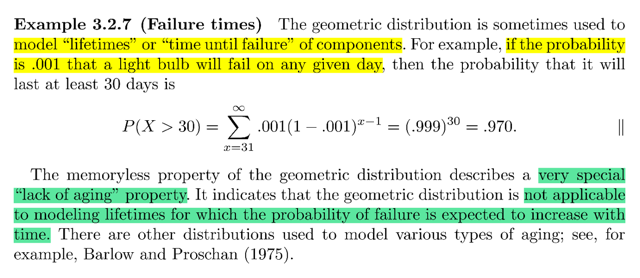</kbd>

> [!NOTE]
> một ví dụ của geometric: đại khái là cho xác suất của việc bóng đèn bị  hư
> (success) trong một ngày nào đó bất kì đều là p = 0.001 Tính xác suất của việc
> bóng đèn sẽ ko hư (failure) trong vòng ít nhất 30 ngày
>
> Thì dễ thấy đây là chuỗi bern(p) trial độc lập.
>
> Cái ta cần tính là bóng đèn sẽ ko hư (failure) trong vòng ít nhất 30 ngày, đặt X
> là số ngày cho đến khi bóng hư, thì nó sẽ ~ Geo(p)
>
> Và event bóng không hư trong ít nhất 30 ngày dịch ra chính là
>
> "số ngày đến khi hư" > 30
>
> tức X > 30
>
> ⇨ P(X > 30) = Σx = 31,32..inf P(X = x)
>
> = Σx = 31,32..inf p(1-p)^(x-1)
>
> Tính kiểu này sẽ rất khó
>
> Chỉ cần thấy X > 30 = tập tất cả chuỗi sao cho 30 cái đầu tiên đều là fail
>
> ⇨ P(X > 30) = (1-p)^30
>
> ====
>
> Cuối cùng là cái mà gs Blizstein đã từng nhắc đến. Đại khái là khi ta deal với
> các vấn đề ví dụ như trên mà xác suất bóng hư mỗi ngày đều ko đổi thì mới
> dùng tính memoryless được.
>
> Còn nếu áp dụng vào case ví dụ như con người thì ví dụ xác suất bị chết mỗi
> ngày nó sẽ thay đổi, càng già xác suất càng cao nên sẽ sai khi tính xác suất ví
> dụ như sống thọ hơn 50 năm (như kiểu tính xác suất bóng đèn cháy hơn 30
> ngày) sẽ là sai

 

