# 3.3 Continuous distribution

📊 **Progress:** `31` Notes | `52` Screenshots

---

<kbd></kbd>

<kbd></kbd>

<kbd>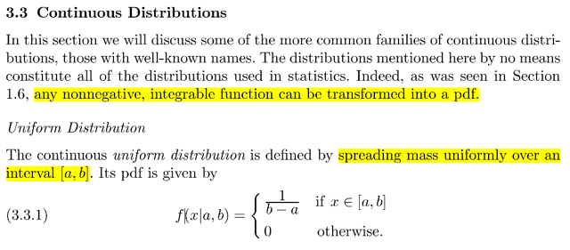</kbd>

> [!NOTE]
> Gặp lại Uniform(a, b) có pdf = constant c trên mọi điểm thuộc (a, b)
>
> Dựa vào tính valid của pmdf: ∫a:b cdx = 1 ⇔ cx|a:b = 1 ⇔ cb - ca = 1
>
> ⇔ c = 1/(b-a)
>
> ⇨ fX(x) = 1/(b-a) nếu x ∈ (a, b) và bằng 0 nếu x nằm ngoài (a, b)
>
> Thử tính EX:
>
> ∫-inf:inf xfX(t)dt = ∫a:b xf(x)dx = ∫a:b x/(b-a)dx = [1/(b-a)] ∫xdx = [1/(b-a)] x^2/2 |a:b
>
> = [1/(b-a)] (b^2 - a^2)/2 = [1/(b-a)] (b-a)(b+a)/2 = **(b+a)/2**Thử tính Var(X):
>
> EX^2 = ...[1/(b-a)] ∫x^2dx = [1/(b-a)] x^3/3 |a:b = [1/(b-a)] (b^3 - a^3)/3
>
> = [1/(b-a)] (b−a)(b2+ab+a2)
>
> = (b2+ab+a2)/3
>
> ⇨ Var(X) = EX^2 - (EX)^2 = (b2+ab+a2)/3 - (b+a)^2/4
>
> = 4(b2+ab+a2)/12 - 3(b+a)^2/12
>
> = (4b2+4ab+4a2) - (3b^2+6ab+3a^2) ] / 12
>
> = (4b2+4ab+4a2 - 3b^2-6ab-3a^2) ] / 12
>
> = (b2 + a2 - 2ab) ] / 12 = **(b-a)^2/12**Trong sách giáo sư tính var(X) theo công thức thứ nhất:
>
> Var(X) = E[(X - EX)^2], thì đây giống như tính mean của Y = (X - EX)^2
>
> Áp dụng lotus: EY = ∫-inf:inf (x-EX)^2f(x)dx  EX = constant = (a+b)/2
>
> = ∫-inf:inf (x-EX)^2f(x)dx
>
> = ∫a:b (x-EX)^2[1/(b-a)]dx
>
> = [1/(b-a)] ∫a:b (x-EX)^2dx
>
> = [1/(b-a)] ∫a:b [x^2 - 2xEX + (EX)^2]dx
>
> = [1/(b-a)] [ ∫a:b x^2dx - 2EX∫a:b xdx + (EX)^2∫a:b dx ]
>
> = [1/(b-a)] [ ∫a:b x^2dx - 2EX x^2/2 |a:b + (EX)^2 x |a:b ]
>
> = [1/(b-a)] [ ∫a:b x^3/3 |a:b - EX (b^2 - a^2) + (EX)^2 (b - a) ]
>
> = [1/(b-a)] [ (b^3 - a^3)/3 - EX (b^2 - a^2) + (EX)^2 (b - a) ]
>
> = [1/(b-a)] [ (b - a)(b2 + ab + a^2)/3 - EX (b - a)(b + a) + (EX)^2 (b - a) ]
>
> = (b2 + ab + a^2)/3 - EX(b + a) + (EX)^2 
>
> = (b2 + ab + a^2)/3 - [(a+b)/2](b + a) + (a+b)^2/4
>
> = (b2 + ab + a^2)/3 - (a+b)^2/2 + (a+b)^2/4
>
> = (b2 + ab + a^2)/3 - (a+b)^2/4
>
> = (b2 + ab + a^2)/3 - (a^2+b^2+2ab)/4
>
> = [4(b2 + ab + a^2) - 3(a^2+b^2+2ab)]/12
>
> = [4b2 + 4ab + 4a^2 - 3a^2 - 3b^2 - 6ab]/12
>
> = [b2 + a^2 - 2ab]/12
>
> = **(b-a)^2/12**

 

<kbd>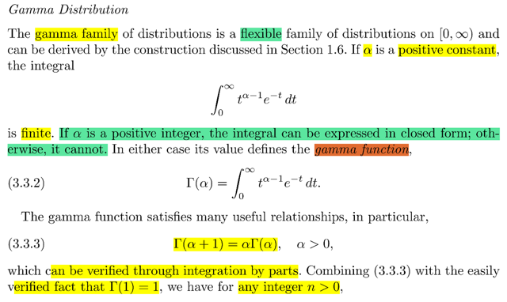</kbd>

> [!NOTE]
> Gặp lại Γ distribution.
>
> đầu tiên nói về Γ function: Γ(α) = ∫:inf t^(α-1)e^-t dt
>
> Nếu α là số nguyên dương thì integral có thể thể hiện ở dạng closed form
> (ý này tạm biết vậy chứ chưa hiểu tại sao, và hơi khác với stat110 cho 
> rằng α phải là số thực dương thì function xác định)
>
> Thế thì đại khái nói là Γ function có một số relationship hữu ích:
>
> Γ(α + 1) =  αΓ(α) (stat110 cũng nói về tính chất này nhưng ko chứng minh)
>
> Casella cũn ko chứng minh nhưng cho rằng có thể verified bằng integration
> by part, thử làm xem được ko:
>
> Đầu tiên có lẽ cần ôn lại integration by part, mình có thể ko nhớ công thức 
> nhưng biết gốc rễ của nó là product ruletrong đạo hàm:
>
> Thể hiện ở dạng vi phân: d(uv) = (du)v + udv
>
> nên u = u(x) ⇨ du = u'(x)dx, v = v(x) ⇨ dv = v'(x)dx. d(uv) = (uv)'(x)dx
>
> ⇨ (uv)'(x)dx = u'(x)dxv(x) + u(x)v'(x)dx ⇔ (uv)'(x) = u'(x)v(x) + u(x)v'(x)
>
> hay ta hay thấy viết gọn là (uv)' = u'v + uv'
>
> Thế thì từ (uv)'(x) = u'(x)v(x) + u(x)v'(x), tích phân hai vế:
>
> ∫(uv)'(x)dx = ∫u'(x)v(x)dx + ∫u(x)v'(x)dx
>
> ⇨  vế trái chính là uv: Vì sao:
>
> Theo định nghĩa của antiderivative: Nếu G'(x) = f(x) thì ∫f(x)dx = G(x)
> Ở đây f(x) = (uv)'(x), hay d/dx u(x)v(x) thì đương nhiên u(x)v(x) là nguyên hàm
> của f(x) ⇨ ∫f(x)dx = u(x)v(x)
>
> ⇨ u(x)v(x) = ∫u'(x)v(x)dx + ∫u(x)v'(x)dx
>
> ⇨ ∫u'(x)v(x)dx = u(x)v(x) - ∫u(x)v'(x)dx
>
> hoặc  ∫u(x)v'(x)dx = u(x)v(x) - ∫u'(x)v(x)dx
>
> ⇔  **∫udv = uv - ∫vdu**
> ====
>
> Giờ ta cần chứng minh Γ(α + 1) = α Γ(α)
>
> ⇔ ∫0:inf t^α e^-t dt = α ∫0:inf t^(α - 1)e^-tdt
>
> Bắt đầu từ vế trái:
>
> ∫0:inf t^α e^-t dt
>
> Đặt u = t^α ⇨ du = αt^(α-1)dt . dv = e^-tdt ⇨ v = -e^-t
>
> ⇨ ∫0:inf u dv, áp dụng công thức i.b.p = u(t)v(t) | 0:inf - ∫0:inf vdu
>
> = t^α (-e^-t) | 0:inf - ∫0:inf (-e^-t)αt^(α-1)dt
>
> Xét cái này ∫0:inf (-e^-t)αt^(α-1)dt 
>
> = -α ∫0:inf (e^-t)t^(α-1)dt
>
> = -α **∫0:inf t^(α-1)(e^-t)dt**    Đây chính là  -α Γ(α -1) 
>
> Còn cái hạng tử đầu tiên t^α (-e^-t) | 0:inf:
>
> t → inf ⇨ t^α → inf và -t → -inf ⇨ e^-t → 0 . Vậy t^α (-e^-t) → 0
>
> Và như vậy t^α (-e^-t) | 0:inf - ∫0:inf (-e^-t)αt^(α-1)dt 
>
> = 0 - (- α Γ(α)) = **α Γ(α)** Chứng minh xong

> [!NOTE]
> Tiếp, từ tính chất này ta sẽ chứng minh Γ(1) = 1:
>
> Γ(1) = 1 Γ(0) = 1 ∫0:inf t^(1-1)e^-tdt
>
> = 1 ∫0:inf t^(0)e^-tdt
>
> = ∫0:inf e^-tdt
>
> = -e^-t | 0:inf
>
> t → inf ⇨ -t → -inf ⇨ e^-t → 0
>
> t → 0 ⇨ -e^-t → -e^0 = -1
>
> ⇨ -e^-t | 0:inf  = 0 - (-1) = 1
>
> Từ đó ta có công thức Γ(n) = (n - 1)!:
>
> Γ(a + 1) = a Γ(a)
>
> Γ(n) = (n-1) Γ(n-1)
>
> = (n-1) (n-2) Γ(n-2)
>
> = (n-1) (n-2) (n-3) Γ(n-3)
>
> =....
>
> = (n-1) (n-2) (n-3) .... 2 1 Γ(1)
>
> = (n-1) (n-2) (n-3) .... 2 1 1
>
> = (n-1) (n-2) (n-3) .... 2 1
>
> = (n-1)!
>
> Một công thức hữu ích khác sẽ gặp lại trong 3.3.15

 

<kbd>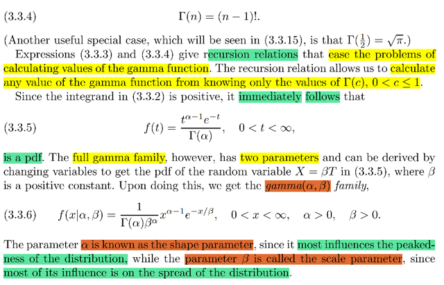</kbd>

> [!NOTE]
> Đại khái là những công thức recursion giúp tính toán với γ function sẽ dễ
> dàng hơn.
>
> Cũng như là sau khi biết hàm Γ(α) = ∫0:inf t^(α-1)e^-t dt thì dĩ nhiên t^(α-1)e^-t/Γ(α)
> sẽ là valid cho một pdf vì tích phân từ 0:inf bằng 1 và bản thân hàm t^(α-1)e^-t 
> là số dương nên thỏa pdf ≥ 0
>
> ====
>
> Tuy nhiên pdf đầy đủ của họ gia đình Γ có thêm một param nữa, là β: 
>
> f(x|α, β) = [1/(Γ(α)β^α] x^(α-1)e^(-x/β)  
>
> Đại khái là f(t) = t^(α-1)e^-t/Γ(α) chính là pdf của T ~ Γ(α, 1)
>
> Nếu đặt X = βT, tức là scale T bởi β thì ta sẽ có X ~ Γ(α, β). vì sao?
>
> Mình có thể áp dụng transformation theorem:
>
> fY(y)dy = fX(x)dx là dạng tuy ko đúng như giúp mình dễ nhớ:
>
> ⇨ fY(y) = fX(x) |dx/dy| = fX(ginv(y)) |d/dy ginv(y)|
>
> ở đây là Y =  g(X) = βX ⇨ X = ginv(Y) = Y/β 
>
> Và hàm g là hàm monotonic increasing vì β dương
>
> nên áp dụng công thức trên ta sẽ có fY(y) = fX(y/β) d/dy (y/β)
>
> Thay Y bằng X, X bằng T:
>
> fX(x) = fT(x/β) d/dx (x/β) = fT(x/β) (1/β)
>
> = [ (x/β)^(α-1) e^-(x/β) / Γ(α) ] (1/β)
>
> = [x^(α-1) / β^(α-1)] e^-(x/β) / Γ(α)β 
>
> = [x^(α-1) e^-(x/β) / [ Γ(α)ββ^(α-1) ]
>
> **= [x^(α-1) e^-(x/β) / [ Γ(α) β^(α) ]
>
> Và đây là công thức pdf của Γ(α, β)**Với α sẽ ảnh hưởng đến hình dạng của distribution còn β ảnh hưởng đến độ
> phân tán của distribution

 

<kbd>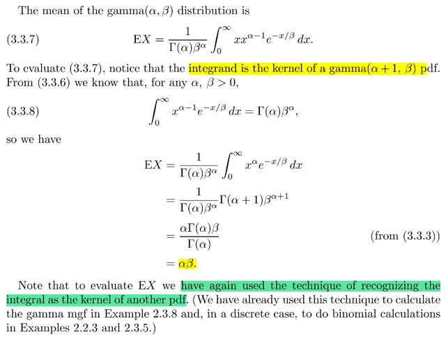</kbd>

> [!NOTE]
> EX (mean / average/ expected value / expectation)
>
> Theo định nghĩa EX = "weighted sum" tổng (Σ) có gán trọng số các possible
> values  của X với weight  chính là xác suất tương ứng X
>
> (discrete rv)
>
> Σ{x=x1,x2...} **xP(X=x)** = x1P(X=x1) + x2P(X=x2) + ...
>
> (continuous r.v)
>
> ∫-inf:inf **x** fX(x) dx
>
> = **∫-inf:inf x [x^(α-1) e^-(x/β) / [ Γ(α) β^(α) ] dx**= ∫-inf:inf  [x^α e^-(x/β) / [ Γ(α) β^(α) ] dx       | x x^(α-1) = x
>
> = 1/ [ Γ(α) β^(α) ] **∫-inf:inf  x^α e^-(x/β) dx**
>
> Gamma(α, β), pdf fX(x) = x^(**α-1**) e^-(x/β) / [ **Γ(α)** **β^(α)** ]
>
> Γ(α+1, β),  fX(x) = x^(α) e^-(x/β) / [ Γ(α+1) β^(α+1) ]
>
> = [ Γ(α+1) β^(α+1) ] / [ Γ(α) β^(α) ] ∫-inf:inf  x^α e^-(x/β) / [ Γ(α+1) β^(α+1) ] dx
>
> Xét ∫-inf:inf  x^α e^-(x/β) / [ Γ(α+1) β^(α+1) ] dx = 1 do tính valid của pdf
>
> = [ Γ(α+1) β^α β ] / [ Γ(α) β^(α) ] 
>
> = [ α Γ(α) β^α β ] / [ Γ(α) β^(α) ] 
>
> EX = **αβ**
> Recursion: Γ(α+1) = α Γ(α)

 

<kbd>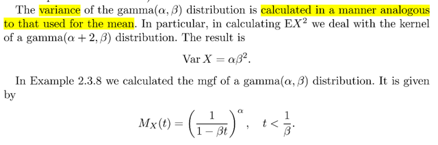</kbd>

> [!NOTE]
> Var(X) "spreading"
>
> Var(X) = E[(X-EX)^2],
>
> = E[(X^2 - 2XEX + (EX)^2] | (a + b)^2
>
> = E(X^2) - E(2XEX) + E[(EX)^2] | linearity
>
> = E(X^2) - E(2XEX) + (EX)^2   | (EX)^2 là constant, E(c) = c
>
> = E(X^2) - 2EXE(X) + (EX)^2   | E(cX) = cEX
>
> Var(X) dạng thứ hai = E(X^2) - (EX)^2 
>
> Tính E(X^2):
>
> LOTUS là **Law Of The Unconscious Statistician 
>
> X, pmf/pdf**EX = Σ{mọi possible value của X} xP(X=x)**Y = g(X) = X^2
>
> EY =**Σy yP(Y=y)**EY = Σ{mọi possible value của X} g(x)P(X=x) 
>
> Eg(X) = Σ{mọi possible value của X} g(x)P(X=x) 
>
> E(X^2) = ∫-inf:inf x^2 fX(x)dx**= ∫-inf:inf x^2 x^(α-1) e^-(x/β) / [ Γ(α) β^(α) ] dx****= 1/ [ Γ(α) β^(α) ] **∫-inf:inf x^(α + 1) e^-(x/β) dx 
>
> (**Γ(α, β), pdf fX(x) = x^(α-1) e^-(x/β) / [ Γ(α) β^(α) ]**Γ(α+2, β)**, pdf fX(x) = \/x^(α+1) e^-(x/β) / [ Γ(α+2) β^(α+2) ])\/
>
> = 1/ [ Γ(α) β^(α) ] ∫-inf:inf x^(α + 1) e^-(x/β)  [ Γ(α+2) β^(α+2) ] /  [ Γ(α+2) β^(α+2) ] dx
>
> = [ Γ(α+2) β^(α+2) ] / [ Γ(α) β^(α) ] ∫-inf:inf x^(α + 1) e^-(x/β) / [ Γ(α+2) β^(α+2) ] dx
>
> ∫-inf:inf \/**x^(α + 1) e^-(x/β) / [ Γ(α+2) β^(α+2) ]**\/ dx = 
>
> Theo điều kiện hợp lệ của pdf, tích phân trên phải = 1
>
> ⇨ **EX^2** = **[ Γ(α+2) β^(α+2) ] / [ Γ(α) β^(α) ]**=****[ Γ(α+2) β^2 ] / [ Γ(α) β^(α) ] 
>
> = [ (α+1) α Γ(α) β^2 ] / [ Γ(α) ] | recursion Γ(a + 1) = a Γ(a)
>
> = **α(α+1) β^2**====
>
> Var(X) = EX^2  - (EX)^2 = α(α+1) β^2  - (αβ)^2
>
> = β^2 [α(α+1) - α^2] = β^2 [α^2 + α  - α^2]
>
> ⇨ Var(X) = **αβ^2**

 

<kbd>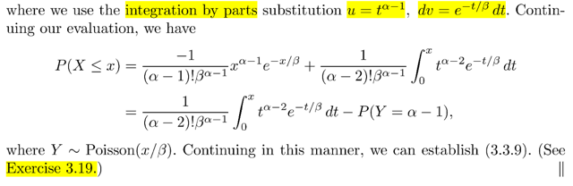</kbd>

<kbd></kbd>

<kbd>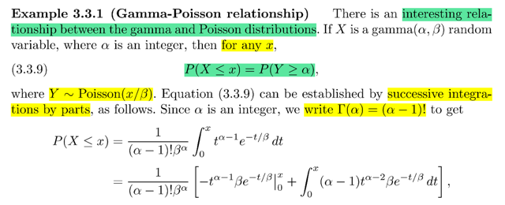</kbd>

> [!NOTE]
> Stat110: Pois(λ) pmf P(X=k) = e^-λ λ^k / k!
>
> Y ~ Pois(x/β), X ~ Gamma (α, β)
>
> P(X ≤ x) = P(Y ≥ α)
>
> P(X ≤ x): cdf của X at x
>
> theo định nghĩa pdf fX(x)
>
> P(X ∈ A) = ∫A fX(x)dx
>
> A = (-inf: x]
>
> P(X ≤ x) = ∫-inf:x fX(t)dt   | u dummies name
>
> = ∫-inf:x fX(t)dt
>
> = {1/ [ Γ(α) β^(α) ]} **∫-inf:x t^(α-1) e^-(t/β) dt**= {1/ [ Γ(α) β^(α) ]} ∫0:x t^(α-1) e^-(t/β) dt
>
> Tính ∫0:x t^(α-1) e^-(t/β) dt
>
> Integration by part
>
> Product rule của derivative:
>
> d(uv) = (du)v + udv
>
> u(x), v(x) : g(x) = u(x)v(x)
>
> **d/dx g(x)** = d/dx u(x)v(x) =**[d/dx u(x)] v(x) + u(x) [d/dx v(x)]**∫d/dx g(x)dx = ∫[d/dx u(x)] v(x)dx + ∫u(x) [d/dx v(x)]dx
>
> ∫d/dx g(x)dx = g(x) = u(x)v(x)
>
> Định nghĩa nguyên hàm (anti-derivative):
>
> G'(x) = f(x) ⇨ ∫f(x)dx = G(x)
>
> u(x)v(x) = ∫u'(x) v(x)dx + ∫u(x) v'(x) dx
>
> ⇨ uv = ∫vdu + ∫udv ⇨ **∫udv = uv - ∫vdu**
>
> =====
>
> ∫0:x t^(α-1) e^-(t/β) dt
>
> u(t) = t^(α-1) ⇨ d/dt u(t) = d/dt t^(α-1) = **(α-1)t^(α-2)**
>
> ⇨ du = (α-1)t^(α-2) dt
>
> dv = e^-(t/β) dt ⇨ v(t) = (-β) e^-(t/β)
>
> ⇨ v(t) = (-β) e^-(t/β) ⇨ d/dt v(t) = (-β) e^-(t/β) . (-1/β) = e^-(t/β))
>
> Áp dụng  ∫a:b udv = uv|a:b - ∫vdu|a:b
>
> tích phân cần tính = **t^(α-1) (-β) e^-(t/β) - ∫(-β) e^-(t/β) (α-1)t^(α-2) dt**
>
> = -t^(α-1) β e^-(t/β) |0:x + ∫0:x β e^-(t/β) (α-1)t^(α-2) dt
>
> 1) -t^(α-1) β e^-(t/β) |0:x
>
> = -x^(α-1) β e^-(x/β) - [-0^(α-1) β e^-(0/β)]
>
> = **-x^(α-1) β e^-(x/β)**2) ∫0:x β e^-(t/β) (α-1)t^(α-2) dt
>
> QUAY LẠI SAU

> [!NOTE]
> Đại khái là một theorem cho biết quan hệ giữa Gamma và Poisson
> distribution

> [!NOTE]
> QUAY LẠI SAU

 

<kbd>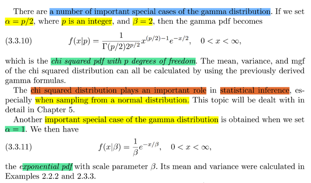</kbd>

🔗 **Related:** [3.6 INEQUALITIES](36_inequalities.md#node-211)

> [!NOTE]
> đại khái là một số trường hợp đặc biệt của Γ distribution 
>
> α = p/2, β = 2: Chi squared pdf với degree of freedom p
>
> Chi - squared có vai trò quan trọng trong suy luận thống kê (chap 5 đi sâu)
>
> α = 1 ⇨ Expo(β)
>
> fX(x) = (1/β ) e^-(x/β)
>
> Ở stat110 Expo(λ) pdf =**λ e^- λx**

 

<kbd></kbd>

<kbd></kbd>

<kbd>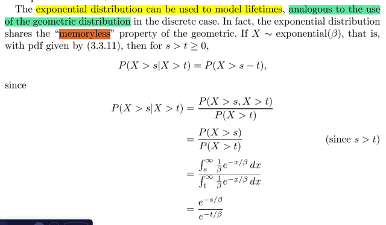</kbd>

> [!NOTE]
> Đại khái là như đã biết từ stat110, expo random variable có story là thời
> gian chờ đợi một sự kiện xảy ra (ví dụ như chờ email đến)
>
> Story này khiến nó tương tự như Geometric distribution - có story là số
> **Bern(p) trial cần thiết** cho đến khi có **trial success** đầu tiên, để rồi thời
> gian chờ cho tới khi có email cũng giống một chuỗi khoảnh khắc (đơn vị
> thời gian) cho đến khi nhận được email vậy.
>
> X ~ Geom(p)
>
> Chuỗi các Bernoulli(p) trials
>
> Binomial(n, p): Số trial success trong n iid Bern(p) trials 
>
> Geometric(p): Số trial cần thiết cho đến khi có một trials
>
> Và cũng như geometric distribution, có tính MEMORYLESS; thể hiện
> bởi equation: P(X > s + t | X > t) = P(X > s) mà ta đã chứng minh bữa trước
>
> Thì Expo distribution cũng có tính chất này, mang ý nghĩa là, sau khi đã chờ
> môt khoảng thời gian t rồi thì chờ thêm đến s + t thì cũng y như chờ từ đầu
> đến s.
>
> Nói cho dễ hiểu thì, khi đã chờ một khoảng thời gian t rồi, thì việc phải chờ
> s + t cũng y như chờ từ đầu đến s
>
> Hay, cụ thể hơn, khi đã chờ 8 tiếng rồi thì việc chờ 9 tiếng cũng y như ta chờ
> thêm 1 tiếng vậy

> [!NOTE]
> Chứng minh tính Memoryless của Expo:
>
> P(X > s + t | X > t) = P(X > s)
>
> P(X > s + t | X > t)
>
> Dùng **định nghĩa của conditional probability**: P(A|B) = P(A ∩ B) / P(B)
>
> P(X > s + t | X > t) = P[(X > s + t) ∩ (X > t)] / P(X > t) (1)
>
> Xét P[(X > s + t) ∩ (X > t)]
>
> (X > s + t) event / subse t của sample space Ω 
>
> = {s ∈ Ω: X(s) > s + t}
>
> vì s > 0 ⇨ s + t > t ⇨ X(s) > s + t > t
>
> **X(s) > s + t ⇨ X(s) > t
>
> Nếu s (possible outcome) mà thỏa X(s) > s + t, thì dĩ nhiên nó cũng
> thỏa X(s) > t
>
> ⇨ s**∈**{s**∈**Ω: X(s) > s + t} ⇨ s**∈**{s**∈**Ω: X(s) > t}
>
> Suy ra {s**∈**Ω: X(s) > s + t}**⊂**{s**∈**Ω: X(s) > t}
>
> ⇨ (X > s + t)**⊂**(X > t)**
> ⇨ **(X > s + t)**∩**(X > t) = (X > s + t)**  | Dùng theorem nếu A ⊂ B ⇨ A ∩ B = A
>
> ⇨ **P[(X > s + t) ∩ (X > t)] = P(X > s + t)**
>
> Vậy **P(X > s + t | X > t) = P(X > s + t) / P(X > t)**(*) P(X > s + t) = ∫s+t:inf fX(x)dx = ∫s+t:inf (1/β)e^-x/βdx
>
> = (1/β) ∫s+t:inf e^-x/β dx
>
> = (1/β) [nguyên hàm của e^-x/β] | s+t : inf
>
> = (1/β) [(-β) e^-x/β] | s+t : inf
>
> = [-e^-x/β] | s+t : inf
>
> x → inf ⇨ -x → -inf ⇨ -e^-x/β → 0
>
> x → s+t ⇨ -e^-x/β → -e^-(s+t)/β   
>
> ⇨ .. = 0 - [-e^-(s+t)/β] = **e^-(s+t)/β**
>
> (*) **P(X > t)** = ∫t:inf fX(x)dx = ∫t:inf (1/β)e^-x/βdx
>
> = (1/β) ∫t:inf e^-x/β dx
>
> = (1/β) [nguyên hàm của e^-x/β] | t:inf
>
> = (1/β) [(-β) e^-x/β] | t : inf
>
> = [-e^-x/β] | t : inf
>
> x → inf ⇨ -x → -inf ⇨ -e^-x/β → 0
>
> x → t ⇨ -e^-x/β → -e^-(t)/β   
>
> ..= 0 - [-e^-(t)/β] = **e^-(t)/β** 
>
>
> Lắp vô: **P(X > s + t | X > t)** = P(X > s + t) / P(X > t) 
>
> = [e^-(s+t)/β] / [e^-(t)/β]
>
> = **e^(-s)/β**
>
> Ở trên đã tính P(X > t) = e^-(t)/β
>
> ⇨ e^(-s)/β = **P(X > s)
>
> Chứng minh xong: P(X > s + t | X > t) = P(X > s)**

 

<kbd>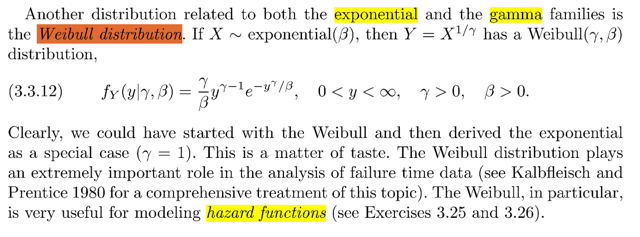</kbd>

> [!NOTE]
> QUAY LẠI SAU

 

<kbd>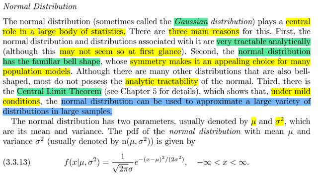</kbd>

> [!NOTE]
> đại ý là Normal distribution đóng vai tròn quan trọng trong statistic vì 3 lí do: 1)
> Nó rất tractable analytically (tạm dịch là dễ uốn nắn dù chưa hiểu lắm) 2) Nó có
> dạng hình chuông với tính đối xứng và mặc dù có nhiều distribution khác cũng
> có dạng hình chuông nhưng vì tính chất 1 nên nó được ưng hơn. Và 3) là có
> một định lí gọi là Central Limit Theorem mà ta sẽ học ở chap 5 cho biết rằng
> dưới một số điều kiện nào đó thì hầu hết các distribution đều có thể được
> approximate bởi normal distribution khi có nhiều sample
>
> Về pdf của Normal thì stat110 mình cũng đã học, nhớ lại trong lớp đó, gs bắt
> đầu với standard normal trước N(0, 1) với pdf đơn giản là 1/√2π e^-x^2/2 Trong
> đó ta cũng có thể hiểu yếu tố 2π ở đâu ra: Đó là khi ta lấy cái kernel, tức
> e^-x^2/2 và dùng điều kiện valid của pdf để tích phân từ -inf đến inf của pdf phải
> bằng 1.
>
> Từ đó giải bài toán tích phân ta sẽ cho ra kết quả là √(2π) nên normalizing
> constant phải là 1/√2π
>
> Sau đó từ standard normal ta có thể suy ra công thức của normal N(μ, σ^2)
>
> Thử tự làm lại để ôn tập:
>
> Thế thì như đã nói: Ta sẽ tính ∫-inf:inf e^-x^2/2dx. Và mình nhớ gs Blizstein có
> nói rằng cái tích phân này sẽ không thể nào tính được.
>
> Và ta sẽ dùng một cái trick để giải tích phân này, đó là:
>
> Tính tích của hai cái tích phân: X ~ N(0,1) và Y cũng ~ N(0,1)
>
> ∫-inf:inf e^-x^2/2dx ∫-inf:inf e^-y^2/2dy
>
> = ∫-inf:inf e^-x^2/2dx ∫-inf:inf e^-y^2/2dy
>
> Ta có thể đưa cái tích phân đầu tiên vào trong, có thể làm điều này là vì, cái tích
> phân của x chỉ là hằng số đối với y.
>
> =  ∫-inf:inf [ ∫-inf:inf e^-x^2/2 dx ] e^-y^2/2dy
>
> =  ∫-inf:inf [ ∫-inf:inf e^-x^2/2 e^-y^2/2 dx dy | sắp xếp lại
>
> =  ∫-inf:inf [ ∫-inf:inf e^(-x^2 -y^2)/2 dx dy
>
> =  ∫-inf:inf [ ∫-inf:inf e^-(x^2+y^2)/2 dx dy
>
> Tới đây đổi hệ tọa độ thành tọa độ cực (polar coordinate), một kiến thức  đã
> học trong MIT 18.02:
>
> Lập luận sẽ là thế này, bản chất khi tính tích phân kép ∫a:b ∫c:d f(x,y)dxdy thì
> thực ra ta đang tính thể tích của phần không gian giới hạn bởi đồ thị hàm số f(x,
> y), mặt xy và các mặt bên hông thì giới hạn bởi vùng A trong mặt phẳng  xy, ví
> dụ như x từ a đến b, và y từ c đến d.
>
> Thế thì, ý nghĩa của tích phân là ta chia vùng thể tích cần tính thành vô số
> những hình hộp chữ nhật có đáy là dA = dxdy, chiều cao là f(x,y), và tính tổng
> các thể tích đó
>
> Vậy thì, khi chuyển sang tọa độ cực (polar coordinate), từ toạ độ Cartesian ta
> sẽ cần chuyển đổi các yếu tố này.
>
> Trong tọa độ cực, tọa độ một điểm sẽ biểu diễn bởi khoảng cách từ điểm đến
> gốc r  và góc θ. Liên hệ với x, y qua: x = r cos(θ), y = r sin(θ)
>
> ⇨ e^-(x^2 + y^2)/2 = e^-[r^2 cos^2(θ) + r^2 sin^2(θ)] / 2
>
> = e^-r^2/2 (sin^2(θ) + cos^2(θ) = 1)
>
> Và limit của tích phân cũng cần cập nhật: Vì A ở đây là toàn mặt phẳng xy, nên
> limit của tích phân theo r là 0: inf, và của θ là 0: 2π
>
> Nên tích phân cần tính theo Polar coordinate sẽ là:
>
> ∫0:2π ∫0:inf e^-r^2/2 drdθ
>
> Nhưng nếu làm vậy ta sẽ bỏ xót một điểm quan trọng: dxdy như đã nói ở trên
> chính là dA, nhưng dr dθ không bằng dA, mà dA trong tọa độ cực là gì:
>
> Để trả lời câu hỏi đó thì đầu tiên nên hỏi dA là gì, dA trong Cartesian là một
> phần diện tích thay đổi khi x thay đổi dx, và y thay đổi dy: dA là hình chữ nhật
> giới hạn bởi x=x, x=x+dx, y = y, y = dy ⇨ nó là hình chữ nhật cạnh  dx, dy ⇨
> dA = dxdy.
>
> Nhưng trong tọa độ cực, khi r thay đổi dr, và θ thay đổi dθ, vùng diện tích  có
> dạng vành khuyên, chứ không phải hình chữ nhật. Ta phải tính diện tích này
> theo dr và dθ: Thì thật ra ta có thể coi như nó xấp xỉ là hình chữ nhật, chỉ có
> điều cạnh của nó ko phải là dr, dθ. Mà thay vào đó một cạnh đúng là dr nhưng
> cạnh kia là độ dài cung bán kính r, góc dθ. Công thức tính cung như vậy là gì:
>
> Với góc 2π, chiều dài cung là 2πr ⇨ với góc dθ chiều dài cùng là dθr
>
> Vậy là xong, dA cần tính chính là **rdθdr**====
>
> Đó là một cách lập luận dễ nhớ cho việc thấy rằng vì sao phải có r.
>
> Còn có thể lập luận một cách tổng quát hơn: QUAY LẠI SAU (XEM LẠI 1802)****Do đó tích phân cần tính là**∫0:2π ∫0:inf e^-r^2/2 r drdθ:**Tới đây, dùng u substitution: Đặt u = -r^2/2 ⇨ du = -(1/2)rdr = -rdr
>
> e^-r^2/2 r dr = - e^u du
>
> Update limit tích phân r → 0 ⇨ u → 0; r → inf ⇨ u → - inf
>
> ∫0:-inf -e^u du = -e^u |0:-inf. 
>
> u → -inf ⇨ -e^u → 0 ;  u → 0; -e^u → -1
>
> Vậy tích phân trên bằng 0 - (-1) = 1
>
> Nên ta có tích phân: ∫0:2π ∫0:-inf -e^u du dθ  = ∫0:2π 1 dθ = ∫0:2π dθ   
>
> = θ | 0:2π = **2π 
>
> Vậy ta đã tính tích của hai cái tích phân cần tính
>
> (tức ∫-inf:inf e^-x^2/2dx ∫-inf:inf e^-y^2/2dy)
>
> ra = 2π 
>
> ⇨ cái tích phân cần tính là ∫-inf:inf e^-x^2/2dx sẽ = √2π 
>
> Vậy để có valid pdf của N(0,1) thì cái nó phải phải là (1/√2π) e^-x^2/2**

> [!NOTE]
> Rồi, sau khi có pdf của N(0, 1) ta sẽ tìm pdf của N(μ, σ^2):
>
> Với Z ~ N(0, 1), ta sẽ tìm pdf của N(μ, σ^2), với việc nó có
> mean là μ, và variance là σ^2 thì  
>
>  X = μ + σZ
>
> Ta sẽ dùng transformation theorem:
>
> fY(y) = fX(ginv(y)) |d/dy ginv(y)|
>
> Với X = g(Z) = μ + σZ ⇨ Z = (X - μ)/σ  ⇨ ginv(x) = (x - μ)/σ  
>
> ⇨ fX(x) = fZ(ginv(x)) |d/dz ginv(x)|
>
> = fZ((x - μ)/σ) |d/dx (x - μ)/σ|
>
> = (1/√2π) e^-z^2/2  | x = (x - μ)/σ) . (1/σ)
>
> = (1/σ√2π) e^-[(x - μ)/σ]^2/2 
>
> **= (1/σ√2π) e^-[(x - μ)^2/2σ^2]  
>
> Đây chính là công thức pdf của N(μ, σ)**

 

<kbd>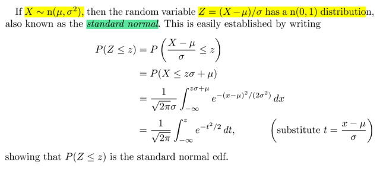</kbd>

> [!NOTE]
> Rồi, trong sách lại nói về chiều ngược lại, là nếu ta có X ~ N(μ, σ^2) thì 
> Z = (X - μ)/σ  (đây cũng gọi là standardization) sẽ ~N(0, 1)
>
> Thử tự làm: Đầu tiên Z = (X - μ) / σ ⇨ X = σZ + μ 
>
> Dĩ nhiên là ta sẽ tìm pdf của Z: Tức P(Z < z)
>
> Như đã biết Z < z bản chất của nó khi thể hiện trong sample space là 
> {s ∈ S: Z(s) < z}
>
> Thế thì Z(s) < z ⇔ Z(s)σ < σz (vì σ là số ko âm)
>
> ⇔ Z(s)σ + μ < σz + μ, vế trái chính là X(s) 
>
> nói cách khác ta có ⇔ X(s) < σz + μ 
>
> Từ đó suy ra tập {s ∈ S: Z(s) < z} = {s ∈ S: Z(s)σ + μ < σz + μ}
>
> cũng chính là tập {s ∈ S: X(s) < σz + μ}, và đây là (X < σz + μ) 
>
> ⇨ P(Z < z) = P(X < σz + μ), và cái này thì có thể tính nhờ pdf của X
>
> = ∫-inf: (σz + u) fX(x)dx 
>
> = ∫-inf: (σz + u) (1/σ√2π) e^-[(x - μ)^2/2σ^2] dx
>
> Đặt t = (x - μ) / σ ⇨ dt = dx / σ ⇨ dx = σdt  
>
> x → -inf ⇨ t → -inf   ; x → σz + u → t → (σz + u - μ) / σ = z
>
> e^-[(x - μ)^2/2σ^2 = e^-[(x - μ)^2/σ^2]/2 = e^-t^2/2
>
> tích phân trên trở thành = ∫-inf: z (1/σ√2π) e^-t^2/2 σdt
>
> = ∫-inf:z (1/√2π) e^-t^2/2 dt
>
> Vậy P(Z < z), tức là FZ(z), và giả sự gọi fZ(z) là pdf của Z thì P(Z < z)
> sẽ được tính bởi ∫-inf:z fZ(t)dt
>
> Thế mà nay ta đã chứng minh P(Z < z) = ∫-inf:z (1/√2π) e^-t^2/2 dt
>
> Thì từ đó có thể suy ra fZ(t) = (1/√2π) e^-t^2/2
>
> hay fZ(z) = (1/√2π) e^-z^2/2.
>
> Mà đây, cũng chính là pdf của N(μ, σ^2) với μ = 0, σ = 1 (vì thế hai param
> này vào pdf của thì sẽ ra (1/√2π) e^-z^2/2.
>
> Từ đó có thể kết luận Z ~ N(0, 1)

 

<kbd>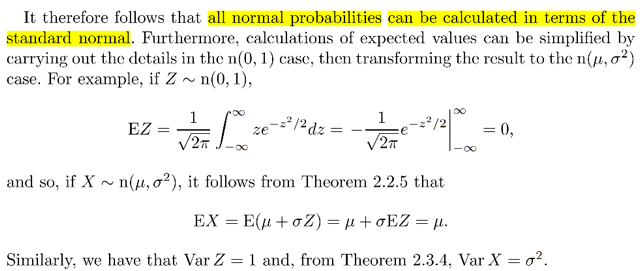</kbd>

> [!NOTE]
> đại khái là từ việc ta có pdf của Z ~ N(0,1), mà với cái này ta có thể dễ dàng 
> chứng minh EZ của nó bằng 0. Thì sau đó có thể dùng linearity để thấy 
> EX = E(σZ + μ) = σEZ + μ = 0 + μ = μ 
>
> Chứng minh EZ = 0: EZ = ∫-inf:inf zfZ(z)dz = ∫-inf:inf (1/√2π) ze^-z^2/2 dz 
>
> = (1/√2π) ∫-inf:inf ze^-z^2/2 dz
>
> = (1/√2π) ∫-inf:inf z e^-z^2/2 dz
>
> Nhớ rằng, cái tích phân này thì tính được, có thể tìm nguyên hàm, còn
> nếu ko có z, chỉ có e^-z^2/2 , thì mới ko tính được, phải dùng trick hồi nãy
>
> Đặt u = e^-z^2/2 ⇨ du/dz = d/d(-z^2/2) e^-z^2/2 . d/dz (-z^2/2)
>
> = e^-z^2/2 . (-z) = - z e^-z^2/2 ⇨ du = - z e^-z^2/2 dz
>
> z → -inf hay inf ⇨ - z^2/2 → -inf ⇨ u = e^-z^2/2 → 0
>
> ⇨ (1/√2π) ∫0:0 -du = 0
>
> Tương tự, thử tính Var(Z):
>
> EZ^2 =  ∫-inf:inf z^2fZ(z)dz = ∫-inf:inf (1/√2π) z^2 e^-z^2/2 dz
>
> = (1/√2π) ∫-inf:inf z^2 e^-z^2/2 dz
>
> u = z ⇨ du = dz
>
> dv = z e^-z^2/2 dz ⇨ v = - e^-z^2/2
>
> ∫udv = uv - ∫vdu
>
> ∫-inf:inf z^2 e^-z^2/2 dz = (∫-inf:inf udv) 
>
> = z(-e^-z^2/2) |-inf:inf + ∫-inf:inf (-e^-z^2/2) dz | đây chính là uv - ∫vdu
>
> Chú ý là, dù thể hiện ở dạng u,v, du, dv, nhưng thực ra ta vẫn đang tính
> các tích phân theo z, nên ko cần đổi limit
>
> **Tính z(-e^-z^2/2) |-inf:inf:**
>
> z → -inf/+inf ⇨ -z^2/2 → -inf ⇨ e^-z^2/2 → 0 ⇨ z(-e^-z^2/2) → 0
>
> ⇨ z(-e^-z^2/2) |-inf:inf = 0 - 0 = 0
>
> **Tính ∫-inf:inf (- e^-z^2/2) dz:**
>
> Cái tích phân này muốn tính phải dùng trick
> và như lúc tìm normalizing constant của pdf N(0,1) ta thấy cái tích phân
> ∫-inf:inf e^-x^2/2dx sẽ = √2π
>
> ⇨ ∫-inf:inf (-e^-z^2/2) dz = -√2π
>
> Vậy EZ^2 = (1/√2π) ∫-inf:inf z^2 e^-z^2/2 dz
>
> = (1/√2π) [z(-e^-z^2/2) |-inf:inf + ∫-inf:inf (-e^-z^2/2) dz]
>
> = (1/√2π) [0 - (- √2π)] = (1/√2π)√2π = 1
>
> Vậy Var(Z) = 1
>
> ⇨ Var(X) = Var(σZ + μ) 
>
> = Var(σZ) | do Var(X + c) = Var(X)
>
> =  σ^2 Var(Z) = **σ^2**

 

<kbd>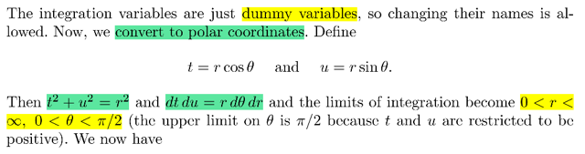</kbd>

<kbd>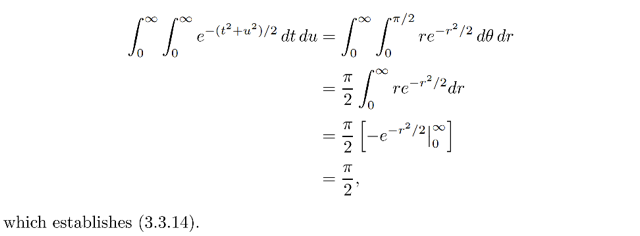</kbd>

<kbd></kbd>

<kbd></kbd>

<kbd>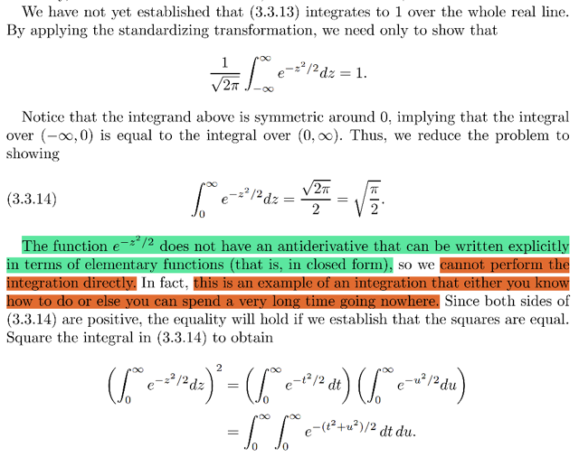</kbd>

> [!NOTE]
> Phần này nói về cách tính cái tích phân ∫-inf:inf e^-z^2/2dz, mình đã làm rồi.
>
> (ở đây giáo sư Casella làm ngược lại với giáo sư Blizstein, ông Bliz trong
> stat110 thì giới thiệu pdf của N(0,1) trước. Nói rằng ta chỉ cần nhớ nó có
> dạng c e^-z^2/2. Xong ta mới dùng tính valid của pdf để để tìm c, bằng cách
> tính cái tích phân ∫-inf:inf e^-z^2/2dz. Từ đó suy ra công thức của N(μ, σ^2)...
>
> Ở đây thì giới thiệu pdf của N(μ, σ^2) trước, rồi mới đến N(0,1), và tính tích
> phân trên đến chứng minh tính validity của pdf
>
> Nói chung với Normal distribution thì cái mấu chốt là nhớ cái trick để deal với
> cái tích phân này ∫-inf:inf e^-z^2/2dz

 

<kbd>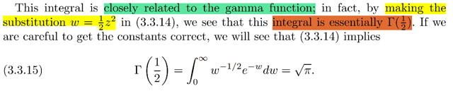</kbd>

> [!NOTE]
> Ở đây nói cái tích phân ∫-inf:inf e^-z^2/2 dz 
>
> = 2 ∫0:inf e^-z^2/2 dz (vì tính đối xứng do e^-z^2/2 là hàm chẵn)
>
> có liên quan đến hàm Γ.
>
> Nếu thay w = z^2/2 ⇨ w^1/2 = z/√2 ⇨ z = (√2) w^1/2
>
> ⇨ e^-z^2/2 = e^-w
>
> Cũng suy ra  dw = zdz ⇔ dz = dw/z = dw / [(√2) w^1/2] 
>
> = (1/√2) dw w^(-1/2)
>
> z → 0 ⇨ w → 0; z → + inf ⇨ w → inf
>
> ⇨ 2 ∫0:inf e^-z^2/2 dz = ∫0:inf e^-w (1/√2) dw w^(-1/2)
>
> = (2/√2) ∫0:inf e^-w w^(-1/2)  dw
>
> Bài trước đã học Γ function: Γ(α) = ∫:inf t^(α-1)e^-t dt
>
> Vậy thì ∫0:inf e^-w w^(-1/2) dw 
>
> nếu thay w bằng t (vốn chỉ là dummy variable)
>
> ∫0:inf e^-t t^(-1/2) dt thì thấy rằng nó chính là Γ(1/2)
>
> ====
>
> Vậy 2 ∫0:inf e^-z^2/2 dz = (2/√2) ∫0:inf e^-w w^(-1/2)  dw
>
> = (2/√2) Γ(1/2)
>
> Và cái tích phân ∫-inf:inf e^-z^2/2 dz  đã chứng minh là bằng √2π 
>
> ⇨ √2π  = (2/√2) Γ(1/2) = √2 Γ(1/2)
>
> ⇨ Γ(1/2) = √π

 

<kbd>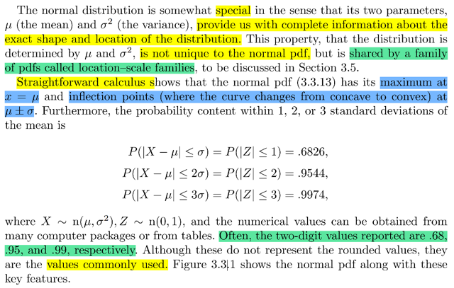</kbd>

> [!NOTE]
> Đại khái là nói rằng normal distribution có điểm đặc biệt là 2 param của nó
> cho biết toàn bộ thông tin của hình dàng và vị trí của distribution, và không
> chỉ có Normal mới có mà thuộc một họ các pdf gọi là location-scale
> families
>
> Họ nói tiếp dùng calculus ta có thể chứng minh rằng pdf sẽ đạt max tại
> μ: Là sao?
>
> Theo MIT 1801 (vì đang xét univariate distribution, hàm fX(x) chỉ là hàm
> đơn biến nên chỉ cần nhắc đến 1801), thì để tìm cực trị thì đầu tiên ta tìm
> điểm critical point nơi đạo hàm cấp 1 bằng 0. Sau đó để xem nó là cực tiểu
> hay cực đại thì xét giá trị của cực trị cũng như giá trị tại limit / boundary
> Hoặc cách khác là tìm cực trị rồi dùng second derivative test
>
> Ở đây ta có f(x) = (1/σ√2π) e^-[(x - μ)^2/2σ^2]
>
> Tính d/dx f(x):
>
> d/dx (1/σ√2π) e^-[(x - μ)^2/2σ^2] 
>
> = (1/σ√2π) d/dx e^-[(x - μ)^2/2σ^2]
>
> = (1/σ√2π) d/d(-[(x - μ)^2/2σ^2]) e^-[(x - μ)^2/2σ^2] . d/dx (-[(x - μ)^2/2σ^2])
>
> = (1/σ√2π) e^-[(x - μ)^2/2σ^2] . d/dx (-[(x - μ)^2/2σ^2])
>
> Xét d/dx (-[(x - μ)^2/2σ^2]) = - (1/2σ^2) d/dx (x - μ)^2
>
> = - (1/2σ^2) 2(x - μ) = - (x - μ)/σ^2
>
> ⇨ .. = (1/σ√2π) e^-[(x - μ)^2/2σ^2] [-(x - μ)/σ^2]
>
> = - (1/σ^2σ√2π) e^-[(x - μ)^2/2σ^2] [(x - μ)]
>
> = - (1/σ^3√2π) e^-[(x - μ)^2/2σ^2] [(x - μ)]
>
> d/dx = 0 ⇔ e^-[(x - μ)^2/2σ^2] [(x - μ)] = 0
>
> Dễ thấy x = μ là một nghiệm thỏa phương trình
>
> Khi x → -inf/inf thì e^-[(x - μ)^2/2σ^2] → 0 nên tại +/-inf thì đạo
> hàm f(x) cũng bằng 0
>
> Ta sẽ cần xét giá trị hàm số tại critical point và limit
>
> f(μ) = (1/σ√2π) e^-[(μ - μ)^2/2σ^2] = (1/σ√2π) e^0 = 1/σ√2π
>
> x → +/- inf → -[(x - μ)^2/2σ^2] → -inf ⇨ e^-[(μ - μ)^2/2σ^2] → 0
>
> ⇨ f(x) → 0
>
> Vậy kết luận hàm f đạt cực trị tại x = μ.
>
> ====
>
> Một cách khác nếu ko muốn kiểm tra giá trị hàm tại cực hạn:
>
> Tính đạo hàm cấp 2 d^2/dx^2 tại μ:
>
> d/dx f'(x) = d/dx {- (1/σ^3√2π) e^-[(x - μ)^2/2σ^2] [(x - μ)] }
>
> = - (1/σ^3√2π)  d/dx {e^-[(x - μ)^2/2σ^2] [(x - μ)] }
>
> Tính cái này, d/dx {e^-[(x - μ)^2/2σ^2] [(x - μ)]
>
> Dùng product rule:
>
> = d/dx {e^-[(x - μ)^2/2σ^2]} [(x - μ)] + {e^-[(x - μ)^2/2σ^2]} d/dx (x - μ)
>
> = e^-[(x - μ)^2/2σ^2] [-2(x - μ)/2σ^2] (x - μ) + e^-[(x - μ)^2/2σ^2] 
>
> = e^-[(x - μ)^2/2σ^2] [-(x - μ)^2/σ^2] + e^-[(x - μ)^2/2σ^2] 
>
> = e^-[(x - μ)^2/2σ^2] { [-(x - μ)^2/σ^2] + 1}
>
> ⇨ d^2/dx^2 f(x) = - (1/σ^3√2π)  e^-[(x - μ)^2/2σ^2] { [-(x - μ)^2/σ^2] + 1}
>
> Evaluate tại μ: 
>
>
> - (1/σ^3√2π) e^-[(μ - μ)^2/2σ^2] { [-(μ - μ)^2/σ^2] + 1}
>
> = - (1/σ^3√2π) e^0 { 0 + 1} = - (1/σ^3√2π) ⇨ hàm concave down tại μ 
> chứng tỏ μ là local maximum, và với ta chỉ có một cực trị thì nó cũng là
> global maximum

 

<kbd>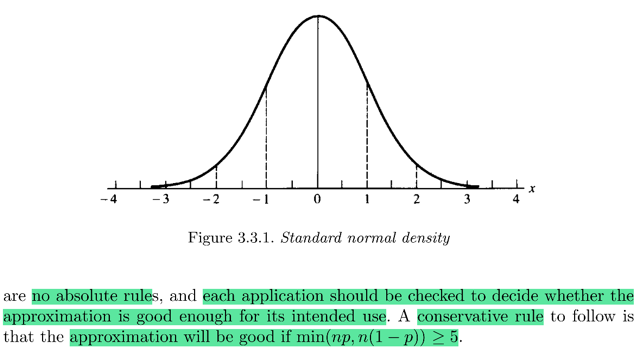</kbd>

<kbd></kbd>

<kbd>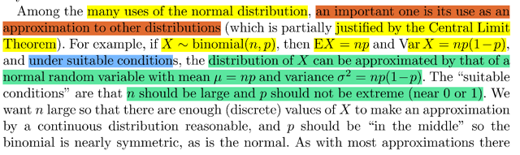</kbd>

> [!NOTE]
> Đại khái nói là một ứng dụng quan trọng của Normal là dùng để approximate 
> distribution khác.
>
> Ví dụ như X ~ binomial(n, p) và n lớn, p không quá gần 0 hay 1 thì khi đó
> X có thể được coi như một N(μ = np, σ^2 = npq)

 

<kbd>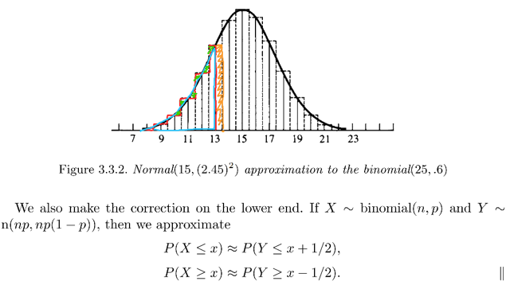</kbd>

<kbd></kbd>

<kbd>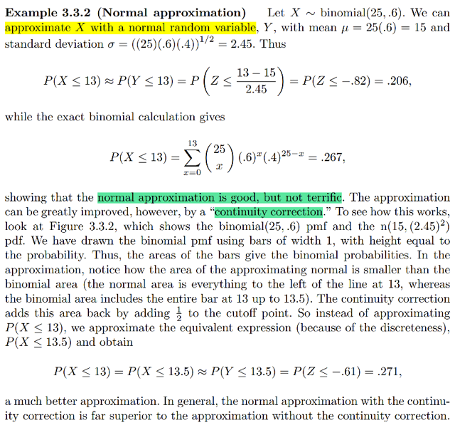</kbd>

> [!NOTE]
> QUAY LẠI SAU, nhưng đại ý là một ví dụ cho thấy ta có thể dùnf Normal để 
> xấp xỉ  cho Bin nếu thỏa điều kiện.
>
> Tuy nhiên nó ko hoàn hảo lắm.
>
> Và có thể khắc phục bằng cái gọi là continuity correction.

> [!NOTE]
> QUAY LẠI SAU

 

<kbd>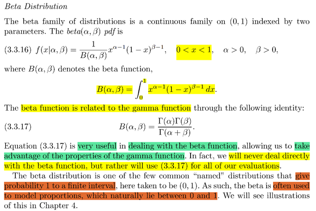</kbd>

> [!NOTE]
> Đại khái nói về β distribution, pdf của nó, và định nghĩa của hàm Beta (α,
> β), mà bản thân nó có liên hệ với hàm Gamma thông qua: Beta (α, β) =
> Γ(α) Γ(β) / Γ(α + β)
>
> **f(x) = 1/B(α, β) x^(α-1)(1-x)^(β-1) ; x**∈**(0,1) α , β > 0**
>
> Nói sơ rằng Β là một continuous distribution mà để toàn bộ  giá trị xác
> suất trong một vùng **hữu hạn, cụ thể là (0,1)** (ý là, khác với Γ (0, inf)
> Normal (-inf, inf)) thì với β x chỉ trong khoảng (0, 1)
>
> Nên nó sẽ thường được dùng để mô hình hóa yếu tố tỉ lệ (proportion),
> DỄ HIỂU VÌ TỈ LỆ THÌ TỰ NHIÊN SẼ CÓ GIÁ TRỊ TỪ 0 ĐẾN 1

 

<kbd>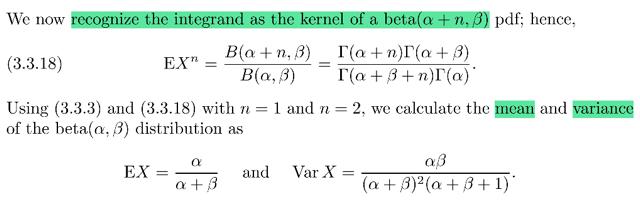</kbd>

<kbd>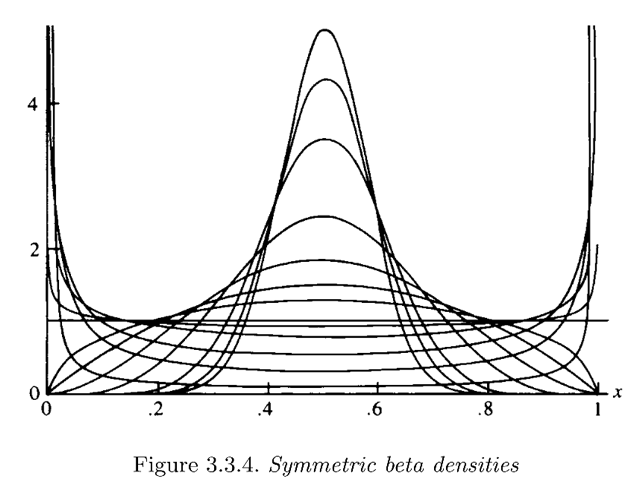</kbd>

<kbd>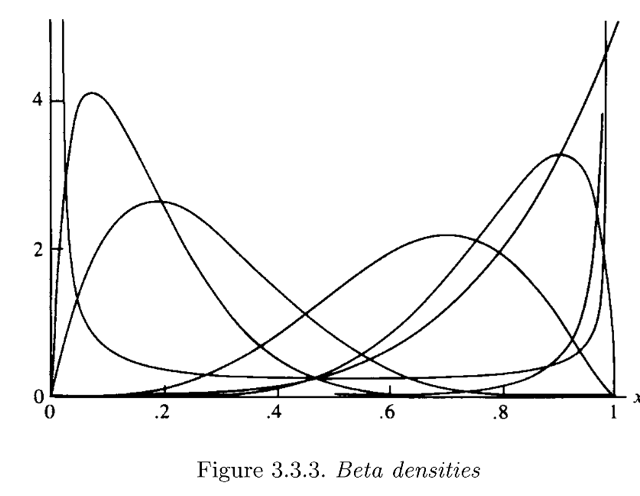</kbd>

<kbd></kbd>

<kbd></kbd>

<kbd></kbd>

<kbd>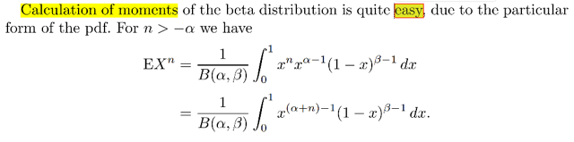</kbd>

> [!NOTE]
> Đại khái là với Βeta pdf thì vì cái dạng của nó có x^..(1-x)^.. nên rất dễ để tính
> moment, từ đó tính mean và variance:
>
> Là vầy, như đã biết để tính moment, tức là EX^n, theo lotus ta sẽ tính:
>
> EX^n = ∫-inf:inf x^n fX(x)dx 
>
> = ∫0:1 x^n [1/B(α, β)] x^(α-1) (1-x)^(β-1) dx  | vì pdf fX(x) 0 khi x nằm ngoài (0,1)
>
> = [1/B(α, β)] ∫0:1 x^n x^(α-1) (1-x)^(β-1) dx | Đưa constant ra ngoài
>
> = [1/B(α, β)] ∫0:1 x^(α+n-1) (1-x)^(β-1) dx  | nhập x^n và x^(α-1)
>
> Và x^(α+n-1) (1-x)^(β-1) là integrant của tích phân, thì dễ thấy nó chính là 
> hạt nhân, của một Β pdf với param là α+n và β
>
> Do đó bằng cách bổ sung thêm normalizing constant: 1/B(α + n, β) (dĩ nhiên
> phải nhân thêm và chia bớt) ta có:
>
> = [B(α+n, β)/B(α, β)] ∫0:1 [1/B(α+n, β)] x^(α+n-1) (1-x)^(β-1) dx 
>
> Khi đó ∫0:1 [1/B(α+n, β)] x^(α+n-1) (1-x)^(β-1) dx  = 1 theo tính validity của pdf
>
> Kết quả EX^n = [B(α+n, β)/B(α, β)], 
>
> áp dụng identity B(α, β) = Γ(α) Γ(β) / Γ(α + β) ta có:
>
> EX^n = Γ(α+n) Γ(β) / Γ(α + n + β)  / {Γ(α) Γ(β) / Γ(α + β)}
>
> = [Γ(α+n) Γ(β) Γ(α + β)] / [Γ(α + n + β) Γ(α) Γ(β)]
>
> **= [Γ(α+n) Γ(α + β)] / [Γ(α + n + β) Γ(α)]**====
>
> Dĩ nhiên từ đó ta có mean, là moment bậc nhất EX = [Γ(α+1) Γ(α + β)] / [Γ(α + 1 + β) Γ(α)] 
>
> Dùng identity của Γ: Γ(α + 1) = α Γ(a)
>
> ⇨ EX = [αΓ(α) Γ(α + β)] / [(α + β)Γ(α + β) Γ(α)]
>
> = **α / (α + β)**====
>
> EX^2 = [Γ(α+2) Γ(α + β)] / [Γ(α +2 + β) Γ(α)] 
>
> = [(α + 1)Γ(α + 1) Γ(α + β)] / [(α + 1 + β)Γ(α + 1 + β) Γ(α)] 
>
> = [(α + 1) α Γ(α) Γ(α + β)] / [(α + 1 + β)(α + β)Γ(α + β) Γ(α)] 
>
> = [(α + 1) α ] / [(α + 1 + β)(α + β)] 
>
> Var(X) = EX^2 - (EX)^2 = [(α + 1) α ] / [(α + 1 + β)(α + β)] - α / (α + β)
>
> ...= αβ / [(α + β)^2(α + 1 + β)]

 

<kbd>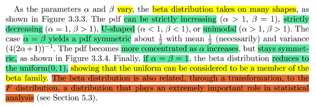</kbd>

> [!NOTE]
> đại khái là với các giá trị thay đổi của param thì Β distirbution sẽ có hình
> dạng thay đổi với đủ kiểu, có khi chỉ tăng, có khi chỉ giảm, có khi đối xứng
> và có khi trở thành Unif(0,1)
>
> Và nó cũng liên hệ với một trong những distribution cực kì quan trọng của
> statistical inference là F distribution mà ta sẽ học ở chap 5

 

<kbd>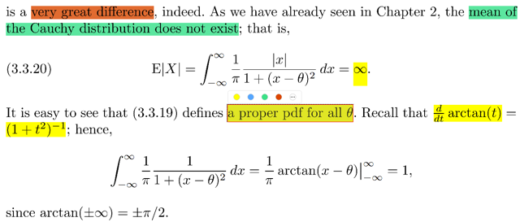</kbd>

<kbd></kbd>

<kbd>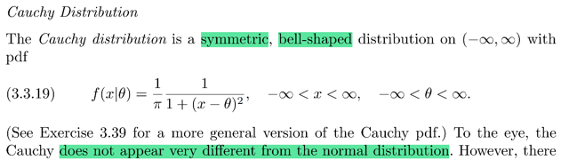</kbd>

> [!NOTE]
> Ta gặp lại Cauchy distribution.
>
> (Khi ôn lại bài 20 - 30 của stat110 ta sẽ gặp lại nó lần nữa) 
>
> Ở đây gs nói đại khái là nó có bell shape giống Normal nhưng thật ra lại rất
> khác Normal.
>
> Nó cũng là cái distribution quái quỷ mà ta nhớ gs Blizstein nói rằng nó ko
> có mean (mean X = inf)
>
> Tuy nhiên dĩ nhiên pdf của nó vẫn hợp lệ ∫-inf:inf (1/π) 1/[1 + (x - θ)^2] dx = 1
>
> Thử tính xem:
>
> ∫-inf:inf (1/π) 1/[1 + (x - θ)^2] dx
>
> = (1/π) ∫-inf:inf 1/[1 + (x - θ)^2] dx
>
> = (1/π) ∫-inf:inf [1 + (x - θ)^-2] dx
>
> Dùng kiến thức là d/dt arctan(t) = 1/(1 + t^2)
>
> ⇨ d/dx arctan(x - θ) = d/d(x - θ) arctan(x - θ) . d/dx (x - θ)
>
> = 1/[1 + (x - θ)^2] . 1 = 1/[1 + (x - θ)^2]
>
> ⇨ **Nguyên hàm (anti derivative) của 1/[1 + (x - θ)^2] là arctan(x - θ)**
>
> ⇨ = (1/π) ∫-inf:inf [1 + (x - θ)^-2] dx
>
> = (1/π) [nguyên hàm của 1 + (x - θ)^-2] | -inf: inf
>
> **= (1/π) arctan(x - θ) | -inf: inf
>
> x → inf, arctan(x - θ) → π/2**
>
> x → -inf, arctan(x - θ) → -π/2
>
> ⇨ kết quả = (1/π) (π/2 - (- π/2)) = 1

 

<kbd>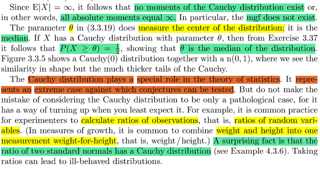</kbd>

> [!NOTE]
> θ, param của Cauchy chính là median, theo định nghĩa median là mốc
> hay x mà 50% thời gian X có giá trị lớn hơn mốc này.
>
> Cái này mình đã lập luận một lần rồi.
>
> Bản chất là câu chuyện giữa cdf F và Finv 
>
> cdf, F(x) sẽ mang ý nghĩa là P(X < x), nó lấy vào một mốc / con số x và cho ra
> xác suất mà X nằm dưới mốc này, ví dụ như con số đưa vào là 10 mà F(x)
> trả ra 50%, tức là sẽ có 50% giá trị của X sẽ là từ 10 trở xuống.
>
> thì inverse của nó Finv(y) sẽ làm ngược lại, nó nhận vào một con số phần trăm
> và trả ra mộc con số cột mốc mà bao nhiêu phần trăm thời gian giá trị của X
> sẽ nằm dưới mức đó
>
> Do đó, nói về median, nó chính là cái output của Finv khi input là 50%, để rồi
> 50% thời gian , hay 50% possible value của X sẽ dưới mốc median này.
>
> Tương tự, ta sẽ có các mốc khác như 25% percentile, là cái mốc output khi input
> của Finv là 0.25, để rồi có nghĩa là 25% giá trị possible value của X sẽ nằm
> dưới cái mốc 25% percentile.
>
> Vậy để chứng minh θ là median ta sẽ chức minh nó là thứ mà Finv của Cauchy
> trả ra khi input là 50%:
>
> θ = Finv(0.5)
>
>  Hoặc cũng có thể chứng minh bằng cách chứng minh θ là cái input của F để
> nó trả ra 0.5: FX(θ) = 0.5 ⇔ P(X < θ) = 0.5
>
> dùng pdf ta tính: 
>
> P(X < θ) = ∫-inf: θ fX(x)dx
>
> = ∫-inf:θ (1/π) (1/[1+(x - θ)^2]) dx
>
> = (1/π) ∫-inf:θ (1/[1+(x - θ)^2]) dx
>
> Dùng cái ở trên đã biết, nguyên hàm của 1/[1 + (x - θ)^2] là arctan(x - θ)
>
> tích phân trên = (1/π) arctan(x - θ) |-inf:θ 
>
> = (1/π) [ arctan(θ - θ) - arctan(-inf - θ) ] 
>
> = (1/π) [ arctan(0) - arctan(-inf ) ] 
>
> arctan(0) là ? ta nhớ định nghĩa của tan và arctan: tan(x) = y ⇔ x = arctan(y)
> ⇨ arctan(0) là cái mà có tan = 0, tức tan(x) = 0 ⇔ sin(x)/cos(x) = 0 ⇨ x = 0
>
> arctan(-inf) thì bằng -π/2
>
> ⇨ .. = (1/π) [0 - (-π/2)] = π/2π = 1/2
>
> ====
>
> Đại khái gs cho biết Cauchy cũng đóng vai trò cực kì quan trọng trong statistic
> Một hành động hay gặp là ta sẽ cần model tỉ lệ giữa hai random variable.
> Và thú vị là hai standard normal chia nhau sẽ là một Cauchy. Mình sẽ gpặ lại

 

<kbd>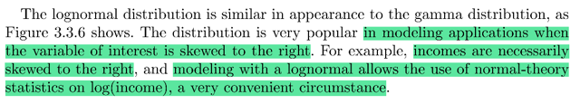</kbd>

<kbd></kbd>

<kbd>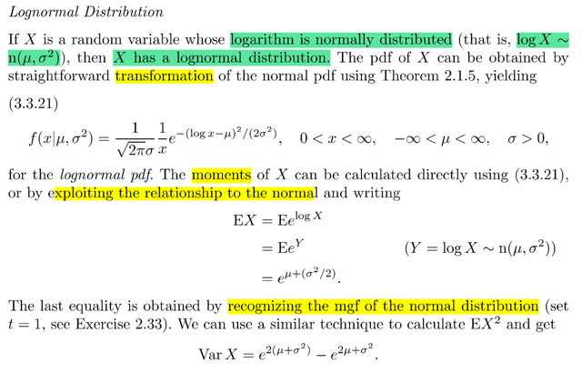</kbd>

> [!NOTE]
> Ta qua một distribution mà stat110 chưa gặp, nhưng trong EE364A thì có nghe
> nói rồi: Log normal. Đơn giản là nếu log X ~ N(μ, σ^2) thì X ~ log normal.
> Gs cho rằng có thể derive pdf dùng transformation từ pdf của Normal, thử làm
> xem:
>
> Ta có Y = logX sẽ là một N(μ, σ^2) theo định nghĩa của log normal ở trên.
> và ta đã biết pdf của Y: fY(y) = (1/σ√2π) e^-[(y - μ)^2/2σ^2]
>
> Rồi, ôn lại về transformation theorem ko bao giờ là thừa, nhưng làm ngắn gọn
> Y = g(X) ⇔ ginv(Y) = X, với y = g(x) = log x ⇨ x = ginv(y) = e^y.
> Thế thì FY(y) = P(Y < y) = P(g(X) < y) = P({s ∈ S: g(X)(s) < y})
>
> = P({s ∈ S: X(s) < ginv(y)}) nếu g monotonic increasing
>
> = P({s ∈ S: X(s) > ginv(y)}) nếu g monotonic decreasing
>
> Ở đây g là log x là hàm monotonic increasing
>
> ⇨ ta đi nhánh trên, ..= P({s ∈ S: X(s) < ginv(y)}) và cái này = P(X < ginv(y))
>
> = FX(ginv(y))
>
> Vì FY(y) theo định nghĩa P(Y < y), tính toán bởi pdf của Y sẽ là ∫-inf: y fY(t)dt
> nên với định nghĩa FY(y) như vậy, = ∫-inf: y fY(t)dt thì theo FTC part 1:
>
> d/dy F(t)|(t=y) = fY(y)   | cố tình ghi d/dy F(t)|(t=y) để nhắc nhở rằng d/dy F(y) là
> giá trị của hàm số đạo hàm của F tại y.
>
> Nên từ đây ta có fY(y) = d/dy FY(y) = d/dy FX(ginv(y)).
>
> Dùng chain rule, = d/d(ginv(y)) FX(ginv(y)) . d/dy ginv(y)
>
> again, ghi thế này cho hiểu bản chất: d/du FX(u) | u = ginv(y) . d/dy ginv(y) 
>
> với d/du FX(u) | u = ginv(y) có nghĩa là giá trị của đạo hàm hàm FX evaluate tại
> ginv(y). Mà d/du FX(u), hay d/dx FX(x) cũng được, chính là fX(x).
>
> Nên ta có fX(ginv(y)) d/dy ginv(y)
>
> Với ginv(y) = e^y ⇨ d/dy e^y = e^y.
>
> Vậy fY(y) = fX(e^y) e^y 
>
> ⇔ (1/σ√2π) e^-[(y - μ)^2/2σ^2]  = fX(e^y) e^y 
>
> ⇔  (1/σ√2π) e^-[(y - μ)^2/2σ^2] / e^y = fX(e^y)
>
> ⇔ fX(e^y) = (1/e^yσ√2π) e^-[(y - μ)^2/2σ^2] 
>
> **⇔ fX(x) = (1/σ√2π) (1/x) e^-[(log(x) - μ)^2/2σ^2]** | x = e^y
>
> Đây chính là pdf của log normal

> [!NOTE]
> Thử tính moment:
>
> Như đã biết, moment có công thức là mX(t) = Ee^tX
>
> Dùng LOTUS, Ee^tX = ∫-inf:inf e^tx fX(x)dx
>
> Nhưng có cách làm nhanh hơn, vì ta biết log X ~ N(μ, σ^2)
>
> ⇨ Y = log X thì mgf của Y là e^(μt+σ^2/2)
>
> ⇨ EX = Ee^logX = Ee^Y
>
> Và Ee^Y chính là Ee^Yt | t = 1 tức là mgf của Y evaluate tại t = 1
>
> Áp dụng công thức mgf của Normal μ, σ là e^[μt + σ^2t^2/2] ta có thể suy
> ra **Ee^Y = e^(μ + σ^2/2)
>
> Vậy EX =  e^(μ + σ^2/2)**Tương tự, EX^2 = E(e^logX)^2 = E(e^2logX = E(e^2Y)
>
> = E(e^tY) | t = 2
>
> = e^(2μ+2^2σ^2/2)
>
> = e^2(μ+σ^2)
>
> ⇨ EX^2 = e^2(μ+σ^2)
>
> ⇨ Var(X) = EX^2 - (EX)^2
>
> = e^2(μ+σ^2) -  [e^(μ + σ^2/2)]^2
>
> **= e^2(μ+σ^2) -  e^(2μ + σ^2)
>
> Đoạn cuối nói về việc log normal khá giống γ. Và cũng rất phổ biến trong
> việc mô hình những biến số bị lệch phải ví dụ như income
>
> Đồng thời nó cũng cho phép dùng normal theo log (hiểu đại khái là vây) rất
> thuận tiện**

 

<kbd>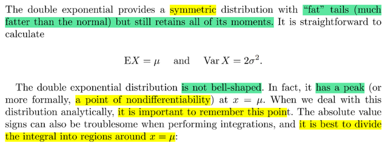</kbd>

<kbd>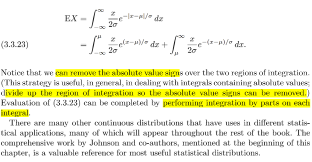</kbd>

<kbd></kbd>

<kbd></kbd>

<kbd>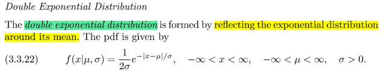</kbd>

> [!NOTE]
> QUAY LẠI SAU

 

