# 3.4 Exponential families

📊 **Progress:** `12` Notes | `20` Screenshots

---
<a id="node-183"></a>

<p align="center"><kbd>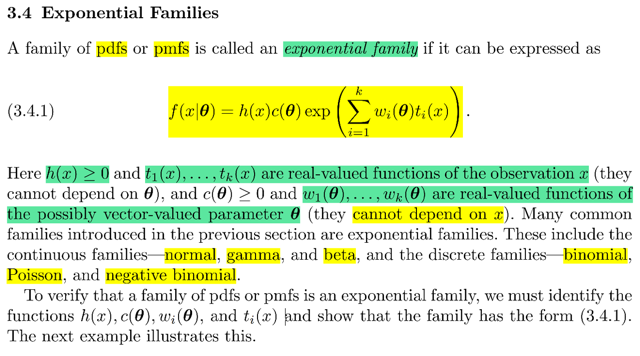</kbd></p>

> [!NOTE]
> đại khái là những pdf hay pmf mà c**ó dạng như sau** sẽ được gọi là thuộc
> họ **gia đình exponential**: 
>
> ```text
> f(x|θ) = h(x) c(θ) exp(Σi wi(θ)ti(x))
> ```
>
> với **h(x)** ≥ 0, **ti(x)** ≥ 0 là **real value function** của observation x.
>
> còn **wi**(**θ**) là r**eal-valued function** của "possibly" `vector-valued` parameter **θ**.
>
> nói possibly ý là `θ` có thể là vector hoặc scalar (nên mới dùng in đậm để chỉ
> vector)
>
> Vậy thì đại ý là, rất nhiều các distribution families thuộc loại continous như
> normal, `γ,` `β,` hoặc rời rạc như binomial, Poisson .. để thuộc exponential
> families
>
> Nói chung khi vào ví dụ sẽ hiểu

<br>

<a id="node-184"></a>

<p align="center"><kbd>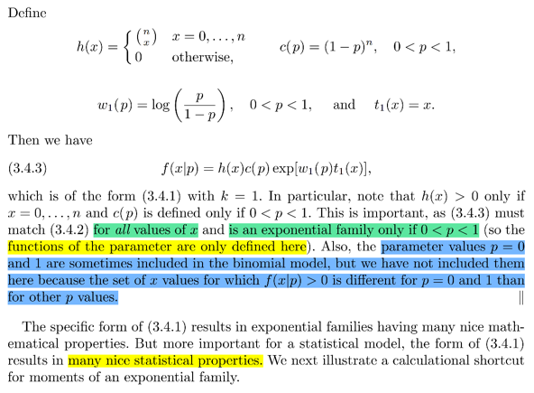</kbd></p>

<p align="center"><kbd></kbd></p>

<p align="center"><kbd>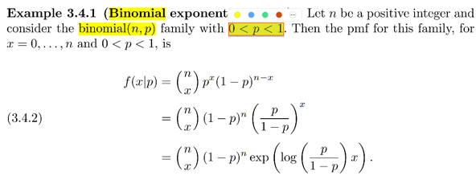</kbd></p>

> [!NOTE]
> Chứng minh **Binomial** thuộc **exponential family**,
>
> bằng các**h biến đổi**chút xíu ta sẽ thấy**pdf của nó có dạng khái quát 
> của expo families**
> ```text
> f(x|θ) = h(x) c(θ) exp Σi=1:k wi(θ) ti(x):
> ```
>
> Như đã biết**pmf của bin(n, p)**: f(x|p) `=` **(n choose x) p^x(1-p)^(n-x)**
>
> ```text
> tách (1-p)^(n-x) = (1-p)^n / (1-p)^x
> ```
>
> ```text
> = (n choose x) p^x (1-p)^n / (1-p)^x
> ```
>
> ```text
> = (n choose x) (1-p)^n [p^x / (1-p)^x]   | gom p^x và 1/ (1-p)^x lại
> ```
>
> ```text
> = (n choose x) (1-p)^n [p/(1-p)]^x
> ```
>
> ```text
> = (n choose x) (1-p)^n exp [ log [p/(1-p)]^x ]  | n = e^log(n)
> ```
>
> ```text
> = (n choose x) (1-p)^n exp [x log [ p/(1-p) ]]   | log n^a = a log(n)
> ```
>
> Đặt h(x) `=` (n choose x) với x `=` 0,1....n và h(x) `=` 0 khi x khác 0,1...n
>
> `c(θ)` chính là c(p) `=` `(1-p)^n`
>
> ```text
> wi(θ) chính là w1(p) = p/(1-p)
> ```
>
> ti(x) chính là t1(x) `=` x
>
> Trong trường hợp này k `=` 1

<br>

<a id="node-185"></a>

<p align="center"><kbd>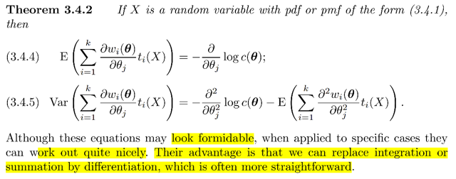</kbd></p>

> [!NOTE]
> đại khái là **exponential family sẽ có theorem này**. Tuy nhìn ghê gớm nhưng
> khi áp dụng vào sẽ **rất tiện lợi** đặc biệt là do ta có thể **đổi chỗ giữa tích phân
> và `Σ` với đạo hàm**

<br>

<a id="node-186"></a>

<p align="center"><kbd>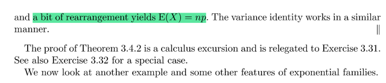</kbd></p>

<p align="center"><kbd></kbd></p>

<p align="center"><kbd>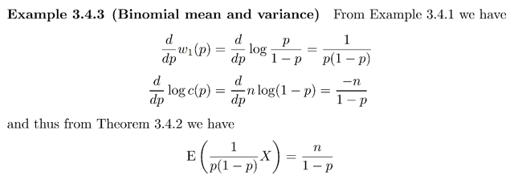</kbd></p>

> [!NOTE]
> Ví dụ **áp dụng theorem này với Bin(n, p)**:
>
> **d/dp w1(p)** với bin(n, p),  w1(p) `=` **log p/(1-p)**
>
> ```text
> ⇨ d/dp w1(p) = d/dp log p/(1-p)
> ```
>
> Dùng chain rule:
>
> ```text
> = d/d[p/(1-p)] log p/(1-p) . d/dp [p/(1-p)]
> ```
>
> ```text
> = 1/[p/(1-p)] . [ [(d/dp p) . (1-p) - p . [d/dp (1-p)] / (1-p)^2]
> ```
>
> ```text
> = [(1-p)/p] . [ [1 . (1-p) - p . [-1] / (1-p)^2]
> ```
>
> ```text
> = [(1 - p) / p] . [ (1 - p + p) / (1 - p)^2 ]
> ```
>
> ```text
> = [1 / p] . [ 1 / (1 - p) ]
> ```
>
> `=` 1 `/` [ p (1 `-` p) ]
>
> ```text
> d/dp log c(p) = d/dp log (1 - p)^n
> ```
>
> `=` `d/dp` n log (1 `-` p)
>
> `=` n `d/dp` log (1 `-` p)
>
> `=` n `(-1)/(1` `-` p) `=` **- n `/` (1 `-` p)
>
> ```text
> Áp dụng theorem ta sẽ có E { [ 1 / [ p (1 - p) ] X } =  - [- n / (1 - p)]
> ```
>
> ```text
> ⇔ [ 1 / [ p (1 - p) ] EX = n / (1 - p) | linearity
> ```
>
> ⇔ (1 `/` p) EX `=` n | linearity
>
> ⇔ EX `=` np**====
>
> Kết quả này giống như kết qủa của expected value của Binomial (n, p) 
> mà ta có thể chứng minh bằng story proof như trong stat110 hay
> dùng công thức.
>
> Ôn lại cách chứng minh story proof của thầy Blizstein:
>
> Bắt đầu từ việc lập luận rằng nếu X ~ Binomial(n, p) thì ý nghĩa của
> nó là số trial success trong chuỗi có n Bern(p) trials iid (độc lập và
> có chung marginal distribution)
>
> Khi đó, nếu gọi `I_1` là indicator random variable đại diện cho trial thứ
> ```text
> nhất, thì I_1 = 1 khi trial success và I_1 = 0 khi nó fail.
> ```
>
> Tất nhiên `I_1` sẽ là Bern(p) random variable.
>
> Tương tự như vậy với `I_2,` `...I_n.`
>
> ```text
> Khi đó Đương nhiên X = I_1 + I_2 + ...I_n
> ```
>
> ```text
> ⇨ EX = E(I_1 + I_2 + ...I_n)
> ```
>
> dùng tính linearity của kì vọng
>
> ```text
> = EI_1 + EI_2 + ...EI_n
> ```
>
> Xét `EI_1` , theo công thức của kì vọng, nó là tổng các possible value
> của random variable, với trọng số là xác suất tương ứng:
>
> EX `=` `Σ{các` possible value x của X} `xP(X=x)`
>
> ```text
> ⇨ EI_1 = 1*P(I_1 = 1) + 0*P(I_1 = 0)
> ```
>
> ```text
> = P(I1 = 1). Và vì I_1 như đã nói là ~ Bern(p) ⇨ P(I1 = 1) = p
> ```
>
> ```text
> Tương tự như vậy EI_2 = p, ... EI_n = p
> ```
>
> ⇨ EX `=` p `+` `p+` ... p `=` **np**

<br>

<a id="node-187"></a>

<p align="center"><kbd>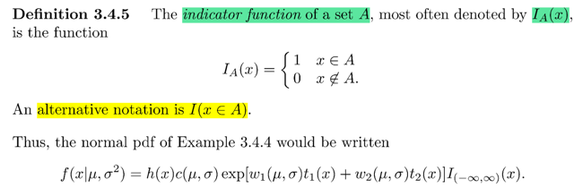</kbd></p>

<p align="center"><kbd>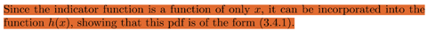</kbd></p>

<p align="center"><kbd></kbd></p>

<p align="center"><kbd></kbd></p>

<p align="center"><kbd>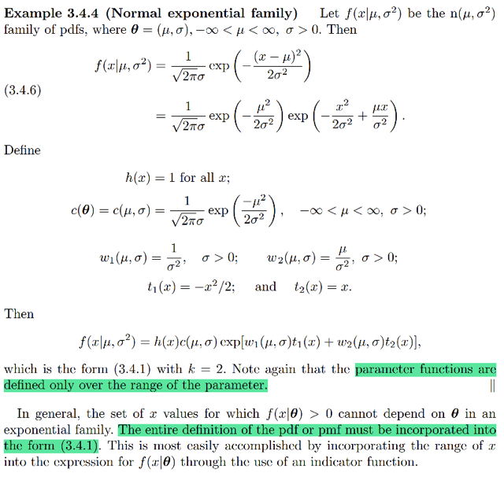</kbd></p>

> [!NOTE]
> Thử với **normal** xem nó**có đúng là có dạng exponential family** không:
>
> f(x| `μ,` `σ^2)` `=` **1/[(√2π)σ] exp `[-` (x `-` `μ)^2` `/` `2σ^2` ]**
>
> ráng nhớ **dạng tổng quát của exponential families**:
>
> **h(x) `c(θ)` exp `Σi` `wi(θ)` ti(x)**
>
> ```text
> ... = 1 * 1/[(√2π)σ] exp [ - (x^2 - 2xμ + μ^2) / 2σ^2 ]   |  khai triển (x - μ)^2 ra thôi
> ```
>
> `=` 1 * 1 `/` `[(√2π)σ]` exp [ `-` x^2 `/` `2σ^2` `+` `2xμ` `/` `2σ^2` **- `μ^2` `/` 2σ^2** ]  | chia mỗi hạng tử cho
> `2σ^2`
>
> `=` 1 * 1 `/` `[(√2π)σ]` exp [ `-` x^2 `/` `2σ^2` `+` `2xμ` `/` `2σ^2` ] exp ( **- `μ^2` `/` 2σ^2** )  | e^(a `+` b) `=` e^a
> e^b
>
> ```text
> = 1 * 1 / [(√2π)σ] exp ( - μ^2 / 2σ^2 ) exp [ - x^2 / 2σ^2 + xμ / σ^2 ]  | đưa exp ( - μ^2 / 2σ^2
> ```
> )
>
> lên trước thôi
>
> **= 1 * 1 `/` `[(√2π)σ]` exp ( `-` `μ^2` `/` `2σ^2` ) exp [ `(1/σ^2)` `(-x^2/2)` `+` `(μ` `/` `σ^2)` (x) ]** ⇨ Có nghĩa
> là đến đây ta đã có thể thấy pdf của normal có dạng của exponential family:
>
> Với:
>
> h(x) `=` 1
>
> `c(θ)` `=` **1 `/` `[(√2π)σ]` exp `(-` `μ^2` `/` `2σ^2` )**   `-inf` < `μ` < inf, `σ` > 0
>
> ```text
> w1(μ, σ) = 1 / σ^2  | σ > 0
> ```
>
> t1(x) `=` `-x^2/2`
>
> ```text
> w2(μ, σ) =  μ / σ^2  | σ > 0
> ```
>
> t2(x) `=` x
>
> DO ĐÓ, CÓ THỂ THẤY RẰN**G PDF CỦA NORMAL CÓ DẠNG CỦA EXPO FAMILY**:
>
> ```text
> f(x) = h(x) c(μ, σ) exp { w1(μ, σ)t1(x) + w2(μ, σ)t2(x) }
> ```
>
> Gs LƯU Ý LÀ **HÀM C CHỈ DEFINE TRONG RANGE CỦA PARAMETER** **Ý là, domain của hàm `c(θ),` cụ thể ở đây là 1 `/` `[(√2π)σ]` exp `(-` `μ^2` `/` `2σ^2` ) sẽ chỉ
> xác định với `-inf` < `μ` < inf và `σ` > 0 vì trong normal pdf thì `σ` phải dương.**
> VÀ MỘT ĐIỂM QUAN TRỌNG, ĐẠI Ý LÀ NÓI RẰNG, MỌI GIÁ TRỊ KHẢ DĨ CỦA X ĐỀU
> PHẢI ĐÚNG
>
> Ý LÀ, VỚI MỌI x, THÌ f(x) ĐỀU PHẢI CÓ THỂ ĐƯỢC THỂ HIỆN BỞI DẠNG CHUNG CỦA
> EXPO FAMILIES
>
> DO ĐÓ GIẢ SỬ VỚI **EXPONENTIAL DISTRIBUTION** VỚI **f(x) chỉ có giá trị dương khi 0 <
> x < inf và bằng 0 khi x < 0** đi. Thì làm sao để **TÍCH HỢP ĐIỀU NÀY VÀO để cho thấy pdf
> của X luôn có thể thể hiện ở dạng generic**
>
> Câu trả lời là dùng**Indicator function**:
>
> Đại khái là với ví dụ này, thì ta đặt indicator function `I_A(x)` `=` 1 khi x ∈ A, và `=` 0 khi x not ∈
> A.
>
> Khi đó với exponential pdf thì ta sẽ thể hiện nó ở dạng:
>
> f(x|λ) `=` h(x) c(λ) exp { `Σi` wi(λ)ti(x) } **I(0, inf)(x)**
>
> và khi đó nhập h(x) với I(0, inf)(x) để có h(x) `=` h(x)I(0, inf)(x) thì từ đó ta đã tích hợp range
> của X vào, để cho thấy dù với x nào thì f(x) cũng đều được có thể thể hiện ở dạng general
> form của expo family
>
> Tương tự, với Normal ở trên thì ta có:
>
> f(x|λ) `=` `I(-inf,` inf)(x) h(x) c(λ) exp { `Σi` wi(λ)ti(x) }

<br>

<a id="node-188"></a>

<p align="center"><kbd>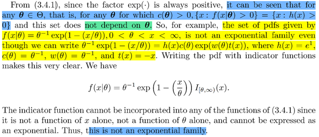</kbd></p>

> [!NOTE]
> Đại ý là công thức tổng quát của expo families  h(x) `c(θ)` exp `Σi` `wi(θ)` ti(x)
>
> vì exp (..) luôn dương (hàm mũ ta nhớ x → `-inf` thì f → 0, x → inf thì f → inf)
> `c(θ)` thì yêu cầu là luôn dương rồi.
>
> Thành ra việc f > 0 chỉ còn phụ thuộc h > 0. Nói cách khác, tập {x: f(x| `θ)` > 0}
> (trong bài trước mình còn nhớ tập này gọi là support set) chính là tập {x: h(x) 
> > 0} và tập này ko phụ thuộc `θ.`
>
> Do đó từ đặc điểm này mà nếu dù cho có pdf nào đó mà có thể thể hiện được
> ở dạng chung  h(x) `c(θ)` exp `Σi` `wi(θ)` ti(x) trên mà support của f KHÔNG ĐỘC
> LẬP với `θ` thì nó ko phải là expo famillies.
>
> Mà một ví dụ là bộ pdf có dạng `θ^-1` exp(1 `-` x `/` `θ),` với **0 < `θ` < x < inf
>
> VÀ Ý LÀ, NẾU MÀ TA CÓ pdf kiểu này, với điều kiện của x là phải > `θ` như
> vậy thì nó ko phải là expo families vì khi ta thể hiện theo cách có tích 
> hợp range vào:
>
> ```text
> thì nó sẽ là f(x | θ) = θ^-1 exp(1 - x / θ)I(θ, inf)(x) mà khi đó, ta ko còn có
> ```
> dạng tổng quát của expo families nữa vì trước `exp(Σ)` ko còn là tích của
> hai hàm một cái chỉ phụ thuộc x : f(x) và một cái chỉ phụ thuộc `θ:` `c(θ)` 
> vì ở đây ta có `I(θ,` inf)(x) phụ thuộc cả hai**

<br>

<a id="node-189"></a>

<p align="center"><kbd>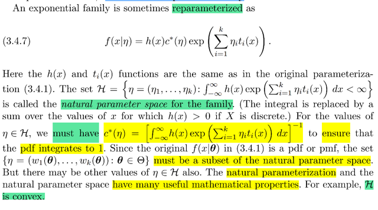</kbd></p>

> [!NOTE]
> QUAY LẠI SAU
> KHI XEM VÍ DỤ

<br>

<a id="node-190"></a>

<p align="center"><kbd>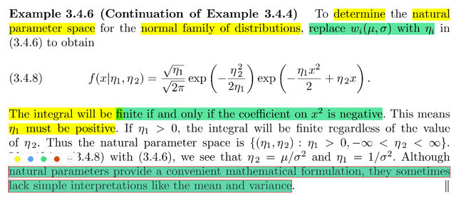</kbd></p>

> [!NOTE]
> Đại khái là như bài trước mình đã thấy rằng có thể phân tích  pdf của
> Normal để trở  thành dạng:
>
> ```text
> f(x| μ, σ) = h(x) c(μ, σ) exp [Σi wi(μ, σ) ti(x)]
> ```
>
> ```text
> Cụ thể là = 1 * {1 / [(√2π)σ] exp ( - μ^2 / 2σ^2 ) } exp [ (1/σ^2) (-x^2/2) + (μ /
> ```
> `σ^2)` (x) ]
>
> h(x) `=` 1
>
> ```text
> c(θ) = 1 / [(√2π)σ] exp ( μ^2 / 2σ^2 )   -inf < μ < inf, σ > 0
> ```
>
> ```text
> w1(μ, σ) = 1 / σ^2  | σ > 0
> ```
>
> t1(x) `=` `-x^2/2`
>
> ```text
> w2(μ, σ) =  μ / σ^2  | σ > 0
> ```
>
> t2(x) `=` x
>
> Vậy thì expo families còn có thể thể hiện ở dạng:
>
> f(x|η) `=` h(x) c(η) exp `[Σi` ηi ti(x) ]
>
> Xem thử với Normal thì nó ntn:
>
> Thế thì ta thấy rằng ở dạng thứ hai, bên trong exp, là linear combination
> của các ti(x) với các coefficient ηi, và hàm c sẽ là hàm theo các ηi:
>
> ```text
> Như vậy là ta sẽ đặt η1 = w1(μ, σ) = 1/σ^2; η2 = w2(μ, σ) = μ/σ^2
> ```
>
> ```text
> ⇨ √η1 = 1/σ ⇨ σ = 1 / √η1;
> ```
>
> ```text
> Thay vào η2 = μ/σ^2 ⇔ η2 = μ η1 ⇨ μ = η2 / η1
> ```
>
> Vậy pdf của Normal thể hiện bằng:
>
> ```text
> 1 * {1 / [(√2π) (1 / √η1)] exp ( - μ^2 / 2σ^2 ) } exp [ η1 (-x^2/2) + η2 (x) ]
> ```
>
> ```text
> = 1 * {1 / [ √2π / √η1] } exp ( - μ^2 / 2σ^2 ) } exp [ η1 (-x^2/2) + η2 (x) ]
> ```
>
> ```text
> = (√η1 / √2π) exp ( - μ^2 / 2η1 ) } exp [ - (η1x^2/2) + η2 x ]
> ```
>
> Thế thì đại khái là để tích phân `∫-inf:inf` h(x) c(η) exp `Σi` ηi ti(x) dx không
> explode thì cần η1 dương
>
> KHÔNG HIỂU VÌ SAO?
>
> Thử giải thích thế này nhé: khi ta tính `∫-inf:inf` h(x) exp `Σi` ηi ti(x) dx đối với
> Normal
>
> ```text
> nó sẽ là ∫-inf:inf exp (- η1x^2/2 + η2 x) dx
> ```
>
> Như đã biết, ý nghĩa của tích phân là diện tích của vùng giới hạn bởi đồ thị
> ```text
> hàm số ở đây là exp (- η1x^2/2 + η2 x) với x trải dài từ -inf đến inf
> ```
>
> Thế thì nếu đây là exp(x), thì chắc chắn tích phân này explode vì rõ ràng là
> khi x → `+inf` thì e^x → inf. Nên diện tích của vùng dưới đồ thị e^x sẽ → inf
> ```text
> Thật vậy ∫-inf:inf e^x dx = e^x|-inf:inf. x → inf e^x → inf, x → 0 → e^x → 0
> ```
> ```text
> ⇨ e^x|-inf:inf = inf - 0 = inf
> ```
>
> ```text
> Nhưng ở đây x → -inf ⇨ - η1 x^2/2 + η2 x → -inf và x → inf ⇨ - η1 x^2/2 +
> ```
> η2 x → `-inf` khi η1 dương và `+inf` khi η1 âm (bởi lẽ khi η1 dương thì khi x →
> inf, `-` η1 `x^2/2` sẽ → `-inf` nhanh hơn là η2 x → inf, nên tổng của chúng sẽ →
> `-inf)`
>
> ```text
> Và như vậy nếu η1 dương thì khi x → +/- inf thì - η1 x^2/2 + η2 x đều →
> ```
> ```text
> -inf  Điều này sẽ khiến e^u (với u = - η1 x^2/2 + η2 x) sẽ → 0. Nên diện tích
> ```
> bên dưới  đường cong sẽ hội tụ về giá trị hữu hạn chứ không thể tăng vô
> hạn.
>
> Ngược lại thì sẽ giống như ở case e^x, diện tích sẽ tăng vô hạn, tức tích
> phân  explode.
>
> QUAY LẠI SAU KHI HỌC HẾT 18.01

> [!NOTE]
> QUAY LẠI SAU KHI HỌC HẾT 18.01

<br>

<a id="node-191"></a>

<p align="center"><kbd>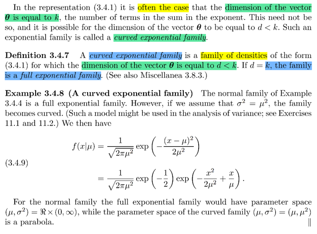</kbd></p>

> [!NOTE]
> Đại khái là khi dimension của `θ` bằng với số hạng tử trong exponent thì ta
> gọi đó là full exponent family, ngược lại khi nhỏ hơn thì ta gọi là curved
> exponent family.
>
> Với normal distribution ta thấy rằng có hai param là `μ` và `σ` , nên `θ` có
> ```text
> dimension = 2, thì ta cũng đã thấy có hai hạng tử w1(μ, σ)t1(x) và w2(μ,
> ```
> `σ)t2(x).` Do đó  nó là full exponent family
>
> ```text
> Còn nếu mà μ = σ, ta vẫn có hai hạng tử trong Σ nhưng θ chỉ còn có dim
> ```
> `=` 1. Nên nó là curved exponent family.
>
> KHÚC NÓI VỀ PARAM SPACE KO HIỂU

<br>

<a id="node-192"></a>

<p align="center"><kbd>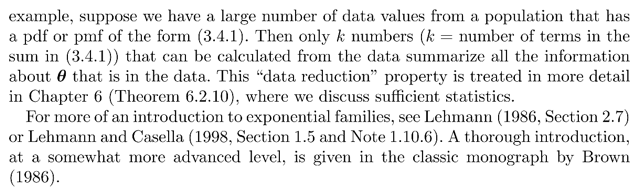</kbd></p>

<p align="center"><kbd></kbd></p>

<p align="center"><kbd>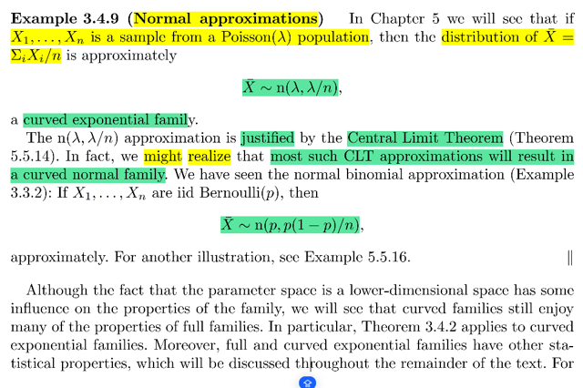</kbd></p>

> [!NOTE]
> Đại khái là, qua chương 5 ta sẽ học rằng nếu X1, X2...Xn là một sample
> (một set các random sample, mà mỗi cái cũng là random variable vì có thể
> mang các giá trị khác nhau) được sampling từ Poisson(λ) thì mean của nó
> `(X_bar,` gọi là sample mean, dĩ nhiên cũng là một rv) sẽ CÓ THỂ APPROX
> BỞI N(λ, `λ/n)` và cái này sẽ được biện minh bởi CENTRAL LIMIT
> THEOREM, và đó (n λ, `λ/n)` là một curved normal family
>
> VÀ GS CHO RẰNG SỰ THẬT LÀ PHẦN LỚN CÁC APPROX BỞI NORMAL
> SẼ ĐỀU LÀ CURVED NORMAL (tức là mean và variance giống nhau, chỉ 
> khác scale)
>
> KHÚC DƯỚI KO HIỂU

> [!NOTE]
> KHÚC DƯỚI KO HIỂU

<br>

