# 3.5 Location And Scale Families

📊 **Progress:** `12` Notes | `22` Screenshots

---

<kbd>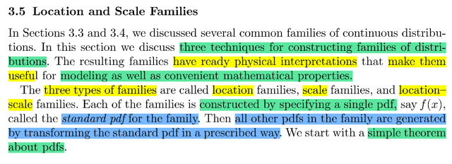</kbd>

> [!NOTE]
> Đại khái là phần này mình sẽ học cách **xây dựng distribution family**.
> Bao gồm 3 loại: location / scale / location & scale.
>
> Khi xây dựng ta **sẽ xây dựng một pdf chuẩn**, thì **các member khác
> sẽ chỉ là transform từ pdf chuẩn**. Đại ý là vậy

 

<kbd>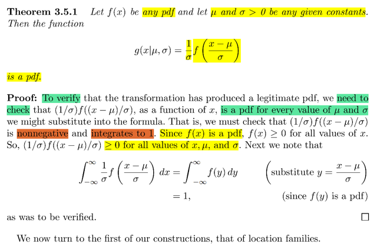</kbd>

> [!NOTE]
> đầu tiên đại khái là ta sẽ học một **Theorem** nói rằng, nếu**f(x) là pdf**
> thì  **f[(x - μ) / σ] / σ** **CŨNG LÀ MỘT PDF** với mọi μ, σ bất kì
>
> Để chứng minh thì như đã biết từ stat110, ta phải chứng minh nó **không
> âm** và tích phân ∫-inf:inf pdf = 1
>
> Chứng minh ko âm thì dễ rồi, vì **f là pdf** nên **dĩ nhiên f[(x - μ) / σ]  phải
> không âm** **với mọi μ σ, và vì σ ko âm** ⇨ (1/ σ) f[(x - μ) / σ] **cũng
> không âm**
>
> Chứng minh **∫-inf:inf (1/ σ) f[(x - μ) / σ] = 1**
>
> tích phân trên = (1/ σ) ∫-inf:inf f[(x - μ) / σ] dx
>
> Đặt y = (x - μ) / σ ⇔ dy = dx / σ ⇔ dx = σ dy
>
> Và tích phân trở thành σ ∫-inf:inf f(y)dy 
>
> thì tích phân bây giờ là trên mọi possible value của y nên 
> và đây phải bằng 1 ⇨ σ ∫-inf:inf f(y)dy = σ 
>
> kết quả là ∫-inf:inf (1/ σ) f[(x - μ) / σ] = 1

 

<kbd>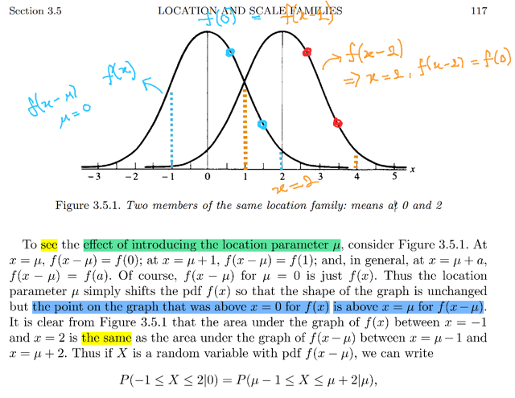</kbd>

<kbd></kbd>

<kbd>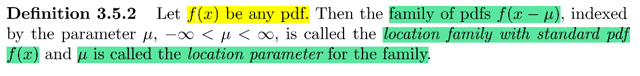</kbd>

> [!NOTE]
> Ta có một định nghĩa: Nói rằng cho f(x) là một **pdf**, thì **f(x - μ) với μ**∈**(-inf, inf)**
> được gọi là **LOCATION FAMILY VỚI PDF STANDARD f(x)**. Và μ được gọi là
> l**ocation parameter** của family
>
> Dừng lại một chút, hãy hiểu là đây LÀ ĐỊNH NGHĨA CỦA LOCATION FAMILY
> VÀ NÓ **CHO TA MỘT CÔNG CỤ ĐỂ TẠO RA, XÂY DỰNG NÊN MỘT
> FAMILY CÁC DISTRIBUTION** mà trong đó bắt đầu với một valid pdf f(x) thì
> f(x - μ) với μ khác nhau cũng là pdf của các distribution, mà cùng nhau tụi nó
> tạo thành một gia đình các distribution mà cái gia đình này thuộc loại "
> **location** **family**"
>
> Và nhờ việc ta **đã chứng minh** nếu **f là pdf thì f(x - μ) / σ cũng là pdf** nên 
> **f(x - μ) hoàn toàn hợp lệ là pdf** khỏi thắc mắc
>
> Việc giới thiệu **location param** sẽ tạo **hiệu qủa**là **các distribution được shift
> bởi location param μ** và **hình dạng của distribution không đổi**. Cái dòng
> highlight màu xanh dương đơn giản ý là những điểm trên đồ thị mà ở bên
> phải trục x = 0 trong đồ thị cũ f(x) sẽ trở thành những ở bên phải trục x = μ
> điểm trên đồ thị mới f(x - μ)
>
> Và cũng dễ hiểu **diện tích trong vùng [-1, 2]** của đồ thị f(x) sẽ **bằng diện tích
> trong vùng [1, 4]**của đồ thị f(x - μ)
>
> thể hiện bằng P(-1 ≤ X ≤ 2|0) = P(1 ≤ X ≤ 4|μ) với X bên trái ~ f(x) và X bên
> phải ~ f(x - μ)

 

<kbd>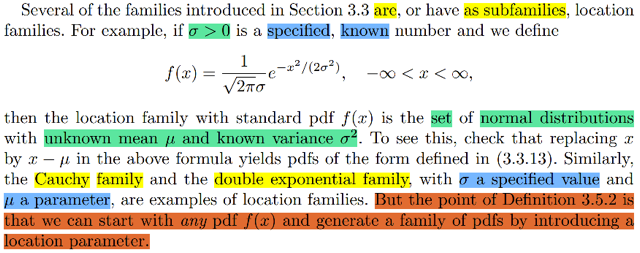</kbd>

> [!NOTE]
> Ở đây gs nói là có nhiều cái distribution mà ta đã biết thật ra chính là
> location family
>
> Ví dụ như nếu **cho trước giá trị đã biết σ** thì 
>
> **f(x) = (1/σ√2π) e^-x^2/2σ^**2 sẽ là standard pdf CỦA MỘT LOCATION 
> FAMILY. 
>
> Bởi vì xét f(x - μ) = (1/σ√2π) e^-(x-μ)^2/2σ^2, thì nó sẽ có dạng là pdf của
> Normal(μ, σ^2) ở trang 3.3.13, và công thức f(x) chính là Standard Normal. 
>
> Và **với normal, thì μ cũng là mean**. Nên trong location family này,**các 
> member sẽ khác nhau ở location thì cũng là khác nhau ở mean.**
>
> Tuong tự với Cauchy hay double exponential cũng vậy
>
> NHƯNG CÁI CHÍNH PHẢI HIỂU, NHƯ ĐÃ NHẤN MẠNH TRONG NOTE
> TRƯỚC, ĐÓ LÀ TA CÓ MỘT ĐỊNH NGHĨA **MANG ĐẾN MỘT CÔNG CỤ**ĐÓ LÀ: 
>
> **CHỈ CẦN CÓ MỘT PDF f(x) THÌ f(x - μ) VỚI μ KHÁC NHAU SẼ
> TẠO CHO TA MỘT FAMILY CÁC DISTRIBUTION CÓ CHUNG DẠNG
> NHƯNG KHÁC LOCATION**,
>
> MÀ TRONG TRƯỜNG HỢP CỦA NORMAL THÌ NÓ **ĐẶC BIỆT HƠN  LÀ
> LOCATION CÙNG CHÍNH LÀ MEAN** MÀ ĐIỀU NÀY CÓ ĐƯỢC LÀ **DO
> CÁCH CHỌN / XÂY DỰNG PDF** CỦA NÓ
>
> ĐỂ RỒI NẾU NÓI VỀ NORMAL VỚI σ ĐÃ BIẾT THÌ TA CÓ FAMILY CÁC
> NORMAL CÙNG VARIANCE NHƯNG KHÁC NHAU VỀ MEAN

 

<kbd>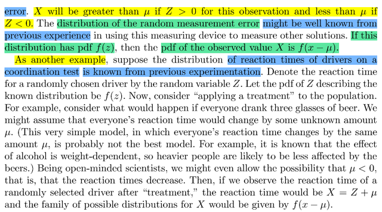</kbd>

<kbd></kbd>

<kbd>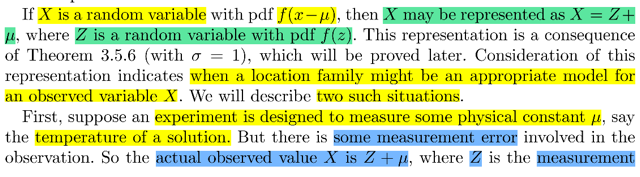</kbd>

> [!NOTE]
> Ở đây có một điểm kiến thức rất quan trọng mà mình sẽ được hưởng lợi về
> sau. Đó là ta có **hệ quả của một định lí** mà lát nữa sẽ gặp, và hệ quả đó là
>
> nếu **Z có pdf là f(z)** thì nếu X có**pdf của X là f(x - μ) thì X sẽ có thể thể hiện
> bởi Z: X = Z + μ**
>
> Để rồi điểm kiến thức quan trọng là VIỆC XEM XÉT CÁCH THỂ HIỆN TRÊN
> SẼ CHO THẤY KHI NÀO MỘT LOCATION FAMILY CÓ THỂ LÀ LỰA CHỌN
> PHÙ HỢP CHO MÔ HÌNH XÁC SUẤT CỦA MỘT BIẾN NGẪU NHIÊN X NÀO
> ĐÓ
>
> Lấy ví dụ trong đó ta muốn thiết lập một experiment để **đo lường một hằng số
> μ nào đó**. Nhưng **sự đo có sai số** t**hể hiện** bởi **random variable Z**. Dẫn tới
> **giá trị quan sát thấy** của yếu tố cần đo sẽ **bị ảnh hưởng bởi sai số**, nên **với
> các giá trị sai số khác nhau (Z)** thì **giá trị quan sát thấy của yếu tố cần đo
> cũng khác nhau luôn**, tức là **nó cũng là random variable**, đặt là **X**. Và quan hệ
> giữa X, Z, μ thể hiện bởi: **X = Z + μ**
>
> Để rồi nếu sai số dương, tức rv Z mang giá trị > 0 thì giá trị đo được (tức là gía 
> trị của X) sẽ là lớn hơn μ, ngược lại nếu sai số âm thì giá trị đo được sẽ nhỏ 
> hơn μ.
>
> Đây chính là **hoàn cảnh phù hợp để áp dụng location family**. Với theorem trên
> nói rằng khi **X = Z + μ** thì nếu ta đ**ã biết pdf của Z là fZ(z)**. ta sẽ suy 
> ra**pdf của X là fX(x) = fZ(x - μ)**
>
> CASE THỨ HAI CHƯA HIỂU

 

<kbd>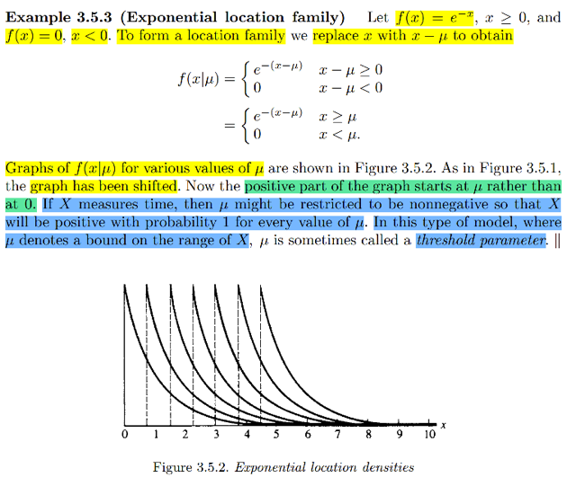</kbd>

> [!NOTE]
> một ví dụ, đại khái là lấy ví dụ **f(x) = e^-x** nếu **x ≥ 0** và **f(x) = 0 nếu
> x < 0**Thì **bằng cách thay x bằng x - μ**, tức là giới thiệu, đưa vào
> location parameter μ thì ta sẽ có một **location family f(x|μ) = f(x - μ) =
> e^(x - μ)** nếu **x ≥ μ** và f(x|μ) = **f(x - μ) = 0** nếu **x < μ.**
>
> Cần nhấn mạnh: f(x) = e^-x là standard pdf của location family, mà
> các thành viên sẽ có pdf là f(x|μ) = e^-(x-μ) (= f(x - μ)). Ví dụ gọi X là
> thằng có pdf chuẩn, ta có fX(x) = f(x) = e^-x. Và Y là thằng trong family 
> với μ=μY thì pdf của Y sẽ là fY(y) = f(x|μ) = fX(x - μY) 
>
> Rồi, vẽ đồ thị ra với μ  khác nhau, thì đại ý là ta cũng thấy chúng chỉ là
> được tịnh tiến. Để rồi phần dương của đồ thị (ý là phần đồ thị mà mang
> giá trị dương, nằm trên trục x) sẽ bắt đầu tại x ≥ μ thay vì x ≥ 0.
>
> Một điểm nữa đó là gs giả sử ta đang dùng distribution family này để mô
> hình hóa một biến số thể hiện thời gian. thì vì thời gian thì ko âm nên μ
> sẽ ko được âm.
>
> Nói sơ về việc cái này gọi là **threshold parameter, tạm biết vậy**

 

<kbd>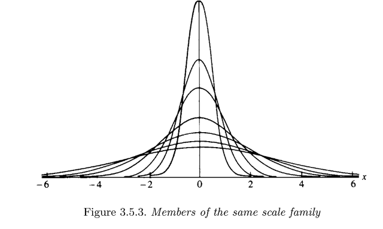</kbd>

<kbd></kbd>

<kbd>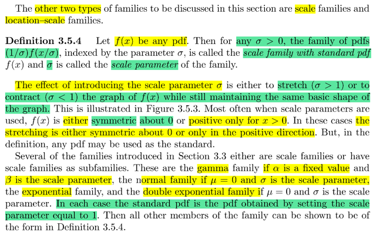</kbd>

> [!NOTE]
> Dạng thứ hai, là scale families, định nghĩa là, với pdf f(x), thì với **σ dương**
> bất kì,**(1/σ)f(x/σ)** sẽ tạo thành một family thuộc loại **scale family** với standard
> pdf f(x) với σ được gọi là **scale** **parameter**
>
> Rồi, cái hiệu quả của việc khác nhau scale param là nó**kéo dãn hoặc bóp
> cái distribution lại** nhưng vẫn **giữ nguyên hình dạng cơ bản.**
>
> **Thường** **thường** scale param sẽ được dùng khi f(x) có dạng đối xứng quanh
> 0 (như normal (0, σ) hoặc có dạng "chỉ dương khi x > 0".
>
> Vài ví dụ là Normal (0, σ^2) hay Γ(α fixed, β)

 

<kbd>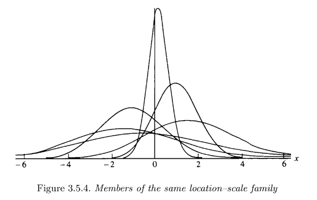</kbd>

<kbd></kbd>

<kbd>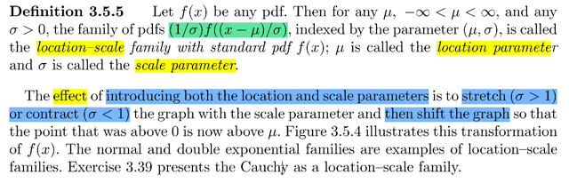</kbd>

🔗 **Related:** [8.3 METHODS OF EVALUATING TEST](83_methods_of_evaluating_test.md#node-697)

> [!NOTE]
> Tương tự, nếu f(x) là pdf thì **(1/σ)f[(x-μ)/σ]** sẽ là family thuộc loại
> **location-scale** với standard pdf là **f(x)**, **μ** gọi là **shift** parameter,
> σ gọi là **scale** parameter
>
> **Hiệu ứng**của việc đưa thêm / giới thiệu thêm cả scale và shift param là
> để **stretch** / **contract** (σ > 1 / < 1) đồ thị của distribution, sau đó thì
> **shift nó để dời location** hay nói như trong sách là để nhưng điểm trên
> đồ thị vốn nằm bên phải trục x = 0 nay sẽ thành nằm bên phải trục x = μ

 

<kbd>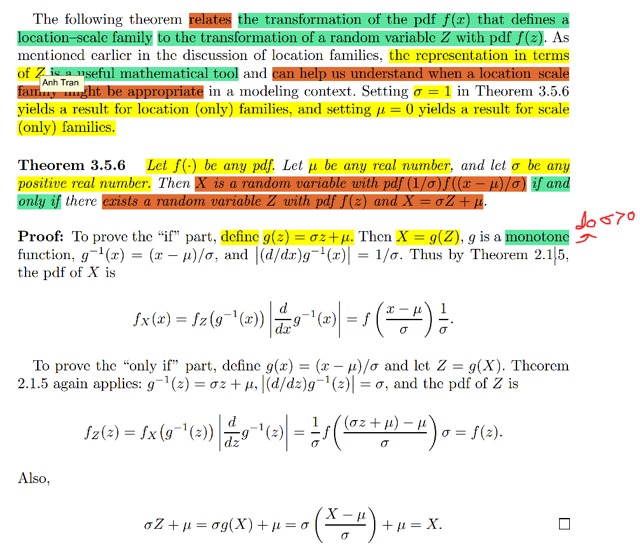</kbd>

🔗 **Related:** [5.2 Σ OF RANDOM VARIABLES FROM A RANDOM SAMPLE](52_σ_of_random_variables_from_a_random_sample.md#node-351)

🔗 **Related:** [5.5 CONVERGENCE CONCEPTS](55_convergence_concepts.md#node-411)

🔗 **Related:** [6.2 THE SUFFICIENT PRINCIPLE](62_the_sufficient_principle.md#node-506)

🔗 **Related:** [8.3 METHODS OF EVALUATING TEST](83_methods_of_evaluating_test.md#node-697)

> [!NOTE]
> Nói về cái theorem 3.5.6: Ý nghĩa của nó là NÓ LIÊN KẾT VIỆC
> TRANSFORMATION CỦA PDF TRONG MỘT LOCATION-SCALE
> FAMILY VỚI VIỆC TRANSFORMATION CỦA VARIABLE
>
> đại khái là cho f(.) là pdf bất kì, μ là số thực bất kì, σ là số dương bất kì.
> Thì: 
>
> Z là rv ~ f(z) ⇔ X = σZ + μ sẽ ~ fX(x) = f[(x - μ)/σ] / σ
>
> Nói bằng lời là: nếu như ta có Z có pdf là f(z) thì khi đặt ra random variable
> X = σZ + μ thì pdf của X sẽ là fX(x) = f[(x - μ)/σ] / σ. Và ngược lại, nếu
> ta có X có pdf fX(x) = f[(x - μ)/σ] / σ thì thằng Z quan hệ với X bởi X = σZ + μ
> sẽ có pdf là f(z)
>
> Chứng minh đại khái là vầy:
>
> Chứng minh chiều đi:
>
> Ta có Z ~ f(z), ta sẽ chứng minh fX với X = σZ + μ  sẽ = f[(x - μ)/σ]
>
> Chỉ cần áp dụng transformation theorem nói rằng:
>
> nếu Y = g(X) thì fY(y) = fX(x) |dx/dy|
>
> Ở đây X = g(Z) = σZ + μ, Tức hàm x = g(u) = σu + μ ⇔ u = ginv(x)
>
> = (x - μ) / σ
>
> fX(x) = fZ(z) |dz/dx|
>
> fZ(z) dĩ nhiên là f(z)
>
> Còn  |dz/dx| = |d ginv(x) / dx| vì g là hàm monotone increasing nên  =
> d/dx (x - μ) / σ  = 1/σ
>
> Vậy fX(x) = f(z) / σ = f[(x - μ)/σ] / σ . Đây là chứng minh xong chiều đi.
>
> ====
>
> Ngược lại, nếu ta có X = σZ + μ với pdf fX(x) = f[(x - μ)/σ] / σ
>
> Thử tìm fZ:
>
> Áp dụng theorem: Z = g(X) = (X - μ) / σ  ⇔ X = ginv(Z) = Z σ + μ
>
> ⇨ ginv(u) = σ u + μ
>
> fZ(z) = fX(x) | dx / dz |
>
> = fX(x) | d ginv(z) / dz |
>
> = f[(x - μ)/σ] / σ . ( d ginv(z) / dz ) do ginv monoton increasing
>
> = f[(x - μ)/σ] / σ . d/dz (σ z + μ)
>
> = f[(z σ + μ  - μ)/σ] / σ . σ
>
> = f[(z σ)/σ]
>
> = f(z). Chứng minh xong

 

<kbd>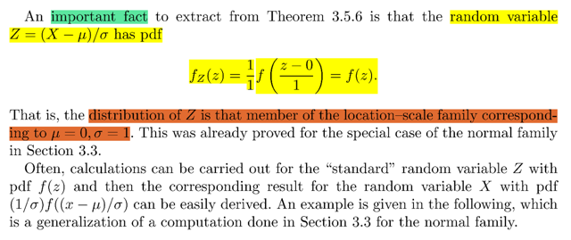</kbd>

> [!NOTE]
> Đại khái là một cái hệ quả từ theorem vừa rồi, nói rằng nếu ta có X~ fX(x) 
> = f[(x - μ) / σ] / σ  thì Z (quan hệ với X bởi X = σZ + μ, hay Z = (X - μ) / σ)
> sẽ chính là thành viên của family với μ = 0, σ = 1
>
> Vì sao, vì theorem vừa rồi đã nói theo chiều ngược rằng nếu có X có
> fX(x) = f[(x - μ) / σ] / σ thì với Z sao cho X = σZ + μ thì pdf của Z sẽ là f(x)
> mà như vậy, pdf của Z chính là standard pdf của location scale family
> có pdf là  f[(x - μ) / σ] / σ mà standard pdf f(x) là cái ứng với μ = 0, σ = 1
>
> Nói chung cái này là cái mà gs Blizstein bên stat110 đã nói: Thường ta sẽ
> bắt đầu với **pdf của standard rv Z**trước rồi từ đó ta sẽ d**erive pdf của 
> X nhờ theorem này dễ dàng.**

 

<kbd>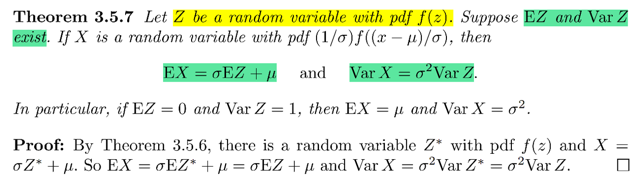</kbd>

> [!NOTE]
> Theorem: cho Z là rv có pdf là f(z) Giả sử EZ, VarZ tồn tại. Thì nếu X có pdf 
> (1 / σ) f[(x - μ) / σ] thì EX = σ EZ + μ và  VarX= σ^2 Var(Z)
>
> Chứng minh đơn giản là bằng cách áp dụng theorem vừa rồi nói rằng nếu pdf
> của X có dạng như vậy thì suy ra phải có một rv Z sao cho X = σZ + μ  mà pdf
> của Z là f. Áp dụng expectation hai vế: EX = E(σZ + μ) = σEZ + μ. Chứng minh
> xong cái thứ nhất.
>
> Cái thứ hai: Áp dụng var hai vế:
>
> Var(X) = Var(σZ + μ) = σ^2 Var(Z). (Dùng tính chất của variance) 
>
> Chứng minh xong

 

<kbd></kbd>

<kbd></kbd>

<kbd>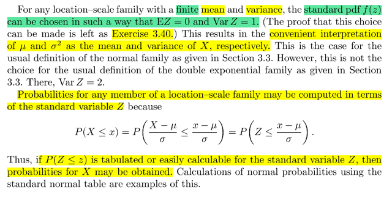</kbd>

> [!NOTE]
> đại khái họ nói là, với location - scale family với mean  và variance finite
> thì ta có thể CHỌN PDF f(z) SAO CHO EZ = 0 VÀ VAR(Z) = 1.
>
> ĐỂ CHỨNG MINH CÁI NÀY THÌ NÓ LÀ BÀI TẬP.
>
> CÁI NÀY CHÍNH LÀ ĐÚNG VỚI TRƯỜNG HỢP CỦA NORMAL
> DISTRIBUTION KHI TA CÓ pdf của N(0, 1) là là (1/√2π) e^-z^2/2, nó có
> mean EZ = 0, VarZ = 1
>
> Điều này dẫn tới việc khi ta áp dụng theorem 3.5.7, với X thuộc
> distribution có shift param μ, scale param variance thì
>
> EX sẽ bằng như theorem vừa rồi = σ EZ + μ = μ , VarX = σ^2VarZ = σ^2*1
> = σ^2
>
> CÓ NGHĨA LÀ, μ CHÍNH LÀ MEAN VÀ σ^2 CHÍNH LÀ VARIANCE  của X
>
> CHỖ NÀY HƠI DỄ NGÁO:
>
> Ý CỦA TÁC GIẢ LÀ, **VÌ TA CHỌN PDF CỦA MỘT FAMILY SAO CHO
> ỨNG VỚI SCALE PARAM ΜU = 0, SCALE PARAM VARIANCE  = 1 THÌ
> EZ CŨNG BẰNG 0, VARIANCE CŨNG BÀNG 1 MÀ NHỜ ĐÓ đối với
> member khác có scale / shift param là σ và μ thì chúng cũng chính là
> mang ý nghĩa là mean và variance của X RẤT TIỆN LỢI**Nhớ rằng trong location scale family thì μ và σ chỉ là shift và scale
> param, không mặc định là mean và variance. Chẳng qua là với normal
> distribution, bằng cách xây dựng pdf standard f(z) - vốn là cái có 
> shift param là 0 và scale param là 1 - sao cho nó có mean cũng là 0,
> và variance cũng là 1 thì tự nhiên cái families này sẽ có mean cũng 
> trùng với shift param μ và standard deviation trùng với scale param σ

 

