# 3.6 Inequalities

📊 **Progress:** `10` Notes | `15` Screenshots

---
<a id="node-207"></a>

<p align="center"><kbd>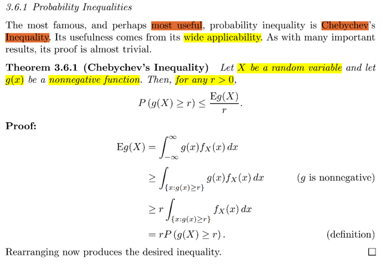</kbd></p>

🔗 **Related:** [5.5 CONVERGENCE CONCEPTS](55_convergence_concepts.md#node-393)

> [!NOTE]
> Đại khái là cái bất đẳng thức hữu ích nhất chính là Chebyshev: Cho hàm g(x)
> là hàm không âm, thì với mọi số dương r thì P(g(X) ≥ r) ≤ Eg(X) `/` r
>
> Chứng minh rất đơn giản:
>
> Ta sẽ xem vế phải: Eg(X), theo LOTUS, `=` `∫-inf:inf` g(x)fX(x)dx
>
> Mà vì fX(x) là pdf nên không âm, và g(x) cũng ko âm, nên g(x)fX(x) không âm
> do đó `∫-inf:inf` g(x)fX(x)dx, vốn mang ý nghĩa là diện tích của phần bao quanh
> bởi đồ thị hàm số và trục x, xét từ `-inf` đến inf, thế thì vì phần đồ thị luôn nằm
> trên trục x nên đương nhiên là khi xét trong một phạm vi nhỏ hơn là {x: g(x) >
> r} thì diện tích sẽ nhỏ hơn.
>
> Do đó `∫-inf:inf` g(x)fX(x)dx ≥ `∫{x:g(x)` ≥ r} g(x)fX(x)dx
>
> Mà đến đây thì ta có thể có tiếp kết quả `∫{x:g(x)` ≥ r} g(x)fX(x)dx ≥ `∫{x:g(x)` ≥ r}
> rfX(x)dx vì đơn giản là sử dụng sự thật là đang xét tích phân trong đoạn mà
> g(x) ≥ r
>
> ```text
> ∫{x:g(x) ≥ r} g(x)fX(x)dx ≥ ∫{x:g(x) ≥ r} rfX(x)dx = r ∫{x:g(x) ≥ r} fX(x)dx
> ```
>
> Và cái này `∫{x:g(x)` ≥ r} fX(x)dx là gì?
>
> chính là P({x: g(x) ≥ r}) và nó chính là P(g(X) ≥ r) vì theo định nghĩa P(g(X) ≥ r)
> `=` P({x: g(x) ≥ r}) chứ gì nữa.
>
> Vậy ta có  `∫-inf:inf` g(x)fX(x)dx ≥ P({x: g(x) ≥ r})
>
> ⇔ Eg(X) ≥ rP(g(X) ≥ r) ⇔ **Eg(X)/r ≥ P(g(X) ≥ r)
>
> (Trong stat110 thì hình như gs Blizstein gọi đây là Markov inequality)**

<br>

<a id="node-208"></a>

<p align="center"><kbd>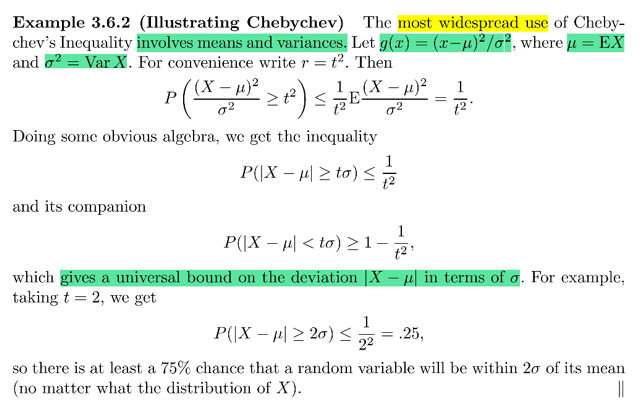</kbd></p>

> [!NOTE]
> Đại khái là cái bdt này áp dụng nhiều nhất là dính tới mean và variance:
>
> ```text
> Cho g(x) = (x - μ)^2 / σ^2, μ = EX, σ^2 - VarX, viết constant r ở dạng t^2
> ```
> cho tiện
>
> ÁP dụng Chebyshev's inequality:
>
> P(g(X) ≥ r) ≤ Eg(X) `/` r
>
> ```text
> P((X - μ)^2 / σ^2 ≥ t^2) ≤ E[(X - μ)^2 / σ^2] / t^2
> ```
>
> ```text
> Xét vế phải E[(X - μ)^2 / σ^2] = E[(X^2 + μ^2 - 2Xμ) / σ^2]
> ```
>
> ```text
> = [E(X^2) + Eμ^2 - 2μEX)] / σ^2
> ```
>
> ```text
> = [E(X^2) + μ^2 - 2μ^2)] / σ^2
> ```
>
> ```text
> = [E(X^2) - μ^2)] / σ^2
> ```
>
> ```text
> = [E(X^2) - (EX)^2)] / σ^2
> ```
>
> ```text
> = Var(X) / σ^2 = σ^2 / σ^2 = 1
> ```
>
> ```text
> ⇨ (1) ⇔ P((X - μ)^2 / σ^2 ≥ t^2) ≤ 1 / t^2 (2)
> ```
>
> ```text
> Mà xét event (X - μ)^2 / σ^2 ≥ t^2
> ```
>
> ```text
> Về bản chất nó là event trong sample space gốc: {s ∈ Ω: (X({s}) - μ)^2 /
> ```
> `σ^2` ≥ t^2}
>
> ```text
> Mà [X({s}) - μ]^2 / σ^2 ≥ t^2
> ```
>
> ```text
> ⇔ |X({s}) - μ) / σ| ≥ t
> ```
>
> ```text
> Nên {s ∈ Ω: (X({s}) - μ)^2 / σ^2 ≥ t^2}
> ```
>
> ```text
> = {s ∈ Ω: |X({s}) - μ) | ≥ σt}
> ```
>
> Chính là (|(X `-` `μ)|` ≥ `σt)`
>
> Do đó ta có (2) ⇔ **P(|(X `-` `μ)|` ≥ `σt)`  ≤ 1 `/` t^2**
>
> ⇨ **P(|(X `-` `μ)|` ≤ `σt)`  ≥ 1 `-` 1 `/` t^2
>
> Và cái này ý nghĩa là: Nó đem lại một lower bound cho độ lệch  |X `-` `μ|` 
> theo `σ`
>
> ```text
> Ví dụ với t = 1, bất đẳng thức cho ta biết P(|(X - μ)| ≤ σ) ≥ 1 - 1 / 1 = 0
> ```
>
> mang ý nghĩa là độ lệch giữa giá trị quan sát được của X với `μ` phải luôn
> nhỏ hơn `σ`
>
> ```text
> Với t = 2: P(|(X - μ)| ≥ 2σ) ≤ 1/2^2 = 0.25 nói rằng sẽ có 25% thời gian X
> ```
> mang giá trị mà độ lệch của nó so với `μ` là lớn hơn 2σ**

<br>

<a id="node-209"></a>

<p align="center"><kbd>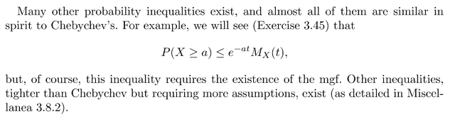</kbd></p>

<p align="center"><kbd></kbd></p>

<p align="center"><kbd>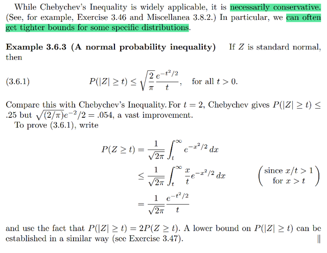</kbd></p>

> [!NOTE]
> Đại khái là một ví dụ minh họa cho nhận định rằng tuy bất đẳng thức
> Chebyshev được dùng rộng rãi nhưng nó tương đối là bảo thủ.
>
> Trong một số distribution, ta có thể có được bound chặt hơn là cái
> bound có từ Chebyshev.

> [!NOTE]
> QUAY LẠI SAU

<br>

<a id="node-210"></a>

<p align="center"><kbd>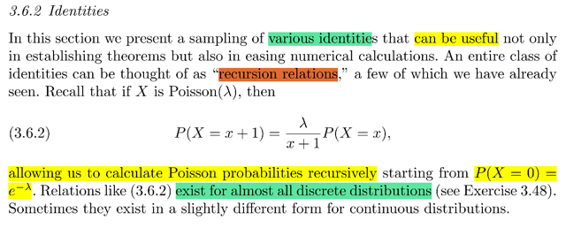</kbd></p>

> [!NOTE]
> Phần này là nói về một số identities (tạm hiểu là một số công thức sẵn có)
> rất hữu ích trong nhiều việc tính toán hoặc chứng minh định lý.
> Và có thể xem đây là một bộ các identity có dạng "recursion relation" tức
> là mối quan hệ đệ quy.
>
> ```text
> Ví dụ như với Pois(λ) : P(X = x + 1) = λ/(x+1) P(X=x) cho phép ta tính xác
> ```
> suất của Poisson recursively bắt đầu từ P(X `=` 0)
>
> Thử chứng minh lại xem:
>
> ```text
> Ta biết pmf của Pois(λ) fX(k) = P(X = k) = e^-λ λ^k / k! λ > 0 và k = 0,1,...
> ```
>
> ```text
> P(X = k + 1) = e^-λ λ^(k+1) / (k+1)!
> ```
>
> ```text
> = e^-λ λλ^k / (k+1)k! = [λ / (k+1)] [ e^-λ λ^k / k! ]
> ```
>
> ```text
> = [λ / (k+1)] P(X = k) chứng minh song
> ```
>
> Nói chung là gs cho biết hầu hết các distribution rời rạc đều có identity
> kiểu này

<br>

<a id="node-211"></a>

<p align="center"><kbd>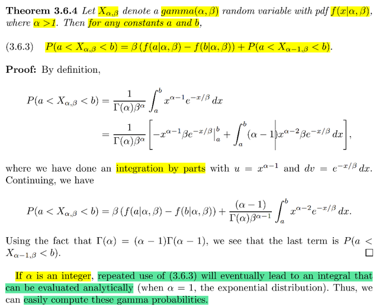</kbd></p>

🔗 **Related:** [3.3 Continuous distribution](33_continuous_distribution.md#node-164)

> [!NOTE]
> Theorem 3.6.4 là nói về một identity như vậy của Γ distribution
> ```text
> Cho X_α, β ~ Γ(α, β) pdf f(x|α,β) và α > 1. Với mọi a, b ta đều có:
> ```
>
> ```text
> P(a < X_α, β < b) = βf(a|α, β) - f(b|α, β) + P(a < X_α-1, β) < b)
> ```
>
> Thử chứng minh:
>
> ```text
> Theo định nghĩa thì P(a < X_α, β < b) = ∫a:b f(x|α,β) dx
> ```
>
> ```text
> = ∫a:b [1/Γ(α)β^α] x^(α-1)e^-x/β dx
> ```
>
> ```text
> = [1/Γ(α)β^α]  ∫a:b x^(α-1)e^-x/β dx  (*) | Đưa constant ra
> ```
>
> Xét cái tích phân, dùng integration by part:
>
> (công thức là:
>
> ```text
> duv = du v + u dv ⇨ ∫d(uv) = ∫ (du v + u dv) =  ∫du v + ∫u dv
> ```
>
> ⇨ uv `=` `∫vdu` `+` `∫udv` ⇔ **∫udv `=` uv `-` ∫vdu**)**Đặt u `=` `x^(α-1)` ⇨**du `=` `(α-1)x^(α-2)dx`
>
> Và dv `=` `e^-x/β` dx ⇨ **v `=` `(-β)` e^-x/β**
>
> ```text
> ⇨ ∫a:b x^(α-1)e^-x/β dx
> ```
>
> ```text
> = x^(α-1) (-β) e^-x/β | a:b - ∫(-β) e^-x/β (α-1)x^(α-2)dx
> ```
>
> ```text
> = - β x^(α-1) e^-x/β | a:b + ∫ β e^(-x/β) (α-1)x^(α-2)dx
> ```
>
> `=` `-` `[β` **b^(α-1) e^-b/β** `-` `β` **a^(α-1) e^-a/β]** `+` `∫` `β` `e^(-x/β)` `(α-1)x^(α-2)dx`
>
> `=` `β` [**a^(α-1) e^-a/β** `-` **b^(α-1) e^-b/β**] `+` `∫` `β` `e^(-x/β)` `(α-1)x^(α-2)dx` (1)
>
> `====`
>
> ```text
> f(x | α, β) = [1/Γ(α)β^α] x^(α-1)e^-x/β
> ```
>
> ```text
> ⇨ f(a| α, β) = [1/Γ(α)β^α] a^(α-1)e^-a/β
> ```
>
> ```text
> ⇨ a^(α-1)e^-a/β = f(a| α, β) Γ(α)β^α
> ```
>
> ```text
> f(b| α, β) = [1/Γ(α)β^α] b^(α-1)e^-b/β
> ```
>
> ```text
> ⇨ b^(α-1)e^-b/β = f(b| α, β) Γ(α)β^α
> ```
>
> `====`
>
> ```text
> ⇨ (1) = β [f(a| α, β) Γ(α)β^α - f(b| α, β) Γ(α)β^α] + ∫ β e^(-x/β) (α-1)x^(α-2)dx
> ```
>
> ```text
> = Γ(α)β^α β [f(a| α, β) - f(b| α, β)] + ∫a:b β e^(-x/β) (α-1)x^(α-2)dx
> ```
>
> ```text
> ⇨ (*) = β [f(a| α, β) - f(b| α, β)] + [1/Γ(α)β^α] ∫a:b β e^(-x/β) (α-1)x^(α-2)dx
> ```
>
> `=` **β [f(a| `α,` `β)` `-` f(b| `α,` `β)]` `+` `[(α-1)/Γ(α)β^(α-1)]` `∫a:b` `x^(α-2)` `e^(-x/β)` dx
>
> Dùng identity đã biết `Γ(α)` `=` (α-1)Γ(α-1)**⇨ `[(α-1)/Γ(α)β^(α-1)]` `∫a:b` `x^(α-2)` `e^(-x/β)` dx
>
> ```text
> = [(α-1)/(α-1)Γ(α-1)β^(α-1)] ∫a:b x^(α-2) e^(-x/β) dx
> ```
>
> ```text
> = [1/Γ(α-1)β^(α-1)] ∫a:b x^(α-2) e^(-x/β) dx
> ```
>
> ```text
> = ∫a:b [1/Γ(α-1)β^(α-1)] x^(α-2) e^(-x/β) dx
> ```
>
> **Ỏ trong tích phân (kernel) chính là pdf của `Γ(α-1,` `β)` nên tích phân này
> chính là `P(α` < `X_α-1,` `β` < β)**Vậy cuối cùng ta có:
>
> ```text
> β [f(a | α, β) - f(b | α, β)] + P(α < X_α-1, β < β)
> ```
>
> `====`
>
> Ý cuối nói rằng nếu `α` là số nguyên, lặp lại identity này nhiều lần sẽ dẫn đến
> một cái tích phân mà ta có thể tính được (evaluated analytically) vì với
> `α` `=` 1, thì Γ(1, `β)` chính là exponential distribution (theo link)

<br>

<a id="node-212"></a>

<p align="center"><kbd>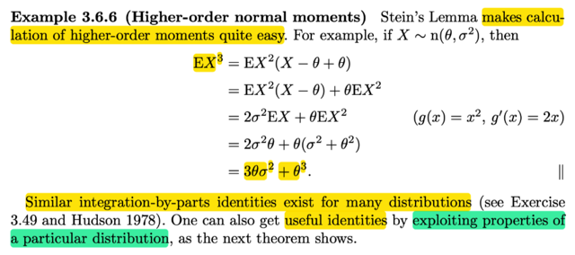</kbd></p>

<p align="center"><kbd></kbd></p>

<p align="center"><kbd>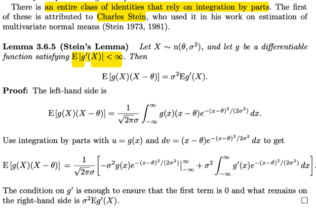</kbd></p>

> [!NOTE]
> Đại khái là gs cho biết có một loạt các identities dựa trên integration by part.
> Đầu tiên ta sẽ học về Bổ đề Stein's: Nói rằng cho X ~ `n(θ,` `σ^2)` và hàm g
> ```text
> khả vi thỏa E|g'(X)| < inf. Khi đó E[g(X)(X - θ)] = σ^2Eg'(X)
> ```
>
> Thử tính `E[g(X)(X` `-` `θ)]`
>
> ```text
> theo định nghĩa và lotus: = ∫-inf:inf g(x)(x - θ)fX(x)dx
> ```
>
> ```text
> =  ∫-inf:inf g(x)(x - θ) [1/σ√2π] e^[-(x - θ)^2/2σ^2] dx
> ```
>
> ```text
> = [1/σ√2π]  ∫-inf:inf g(x) (x - θ) e^[-(x - θ)^2/2σ^2] dx
> ```
>
> Đặt u `=` g(x), du `=` g'(x)dx. 
>
> ```text
> dv = (x - θ) e^[-(x - θ)^2/2σ^2] dx
> ```
>
> ```text
> ⇨ v(x) = -σ^2 e^[-(x - θ)^2/2σ^2]
> ```
>
> ```text
> (vì d/dx v(x) = d/dx { -σ^2 e^[-(x - θ)^2/2σ^2] }
> ```
>
> ```text
> = -σ^2 d/dx e^[-(x - θ)^2/2σ^2]
> ```
>
> ```text
> = -σ^2 d/d [-(x - θ)^2/2σ^2] e^[-(x - θ)^2/2σ^2] . d/d(x - θ) [-(x - θ)^2/2σ^2] . d/dx (x - θ)
> ```
>
> ```text
> = -σ^2 e^[-(x - θ)^2/2σ^2] . (1/2σ^2) [-2(x - θ)] . 1
> ```
>
> ```text
> = (x - θ) e^[-(x - θ)^2/2σ^2]
> ```
>
> ```text
> Áp dụng integration by part: ∫udv = uv - ∫vdu
> ```
>
> ```text
> ⇨ ∫-inf:inf g(x) (x - θ) e^[-(x - θ)^2/2σ^2] dx
> ```
>
> ```text
> = g(x) [-σ^2 e^[-(x - θ)^2/2σ^2] ] |-inf:inf - ∫-inf:inf [-σ^2 e^[-(x - θ)^2/2σ^2] ] g'(x)dx.
> ```
>
> ```text
> = - σ^2 g(x) e^[-(x - θ)^2/2σ^2]  |-inf:inf - ∫-inf:inf [-σ^2 e^[-(x - θ)^2/2σ^2] ] g'(x)dx.
> ```
>
> Và xét cái term đầu:
>
> ```text
> x → +inf ⇨ e^[-(x - θ)^2/2σ^2] →  - σ^2 g(x) e^[-(x - θ)^2/2σ^2]   → 0
> ```
>
> (vì hàm g có độ dốc trung bình hữu hạn thể hiện bởi `E|g'(X)|` < inf) nên khi x
> → inf, do hàm g(x) có thể tăng nhưng vì exponential term → 0 nhanh nên
> kết quả vẫn → 0.
>
> tương tự x → `-inf` thì cả term cũng → 0
>
> Vậy term đầu bằng 0.
>
> ```text
> Term sau: ∫-inf:inf [-σ^2 e^[-(x - θ)^2/2σ^2] ] g'(x)dx.
> ```
>
> `=` `σ^2` `∫-inf:inf` g'(x) `e^[-(x` `-` `θ)^2/2σ^2]` dx `=` **σ^2 Eg'(X)
>
> Thế thì áp dụng cái bổ đề này giúp tính moment bậc cao của normal
> dễ dàng: QUAY LẠI SAU**

<br>

<a id="node-213"></a>

<p align="center"><kbd>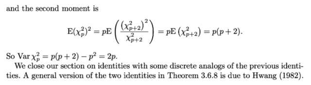</kbd></p>

<p align="center"><kbd></kbd></p>

<p align="center"><kbd>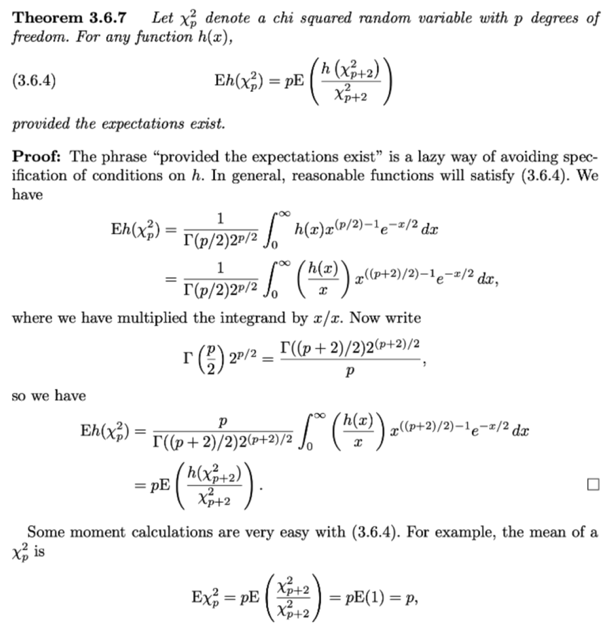</kbd></p>

> [!NOTE]
> QUAY LẠI SAU

<br>

<a id="node-214"></a>

<p align="center"><kbd>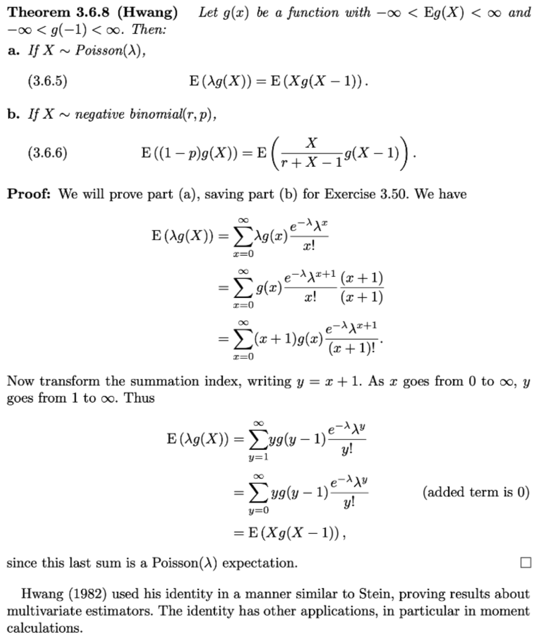</kbd></p>

> [!NOTE]
> QUAY LẠI SAU

<br>

<a id="node-215"></a>

<p align="center"><kbd>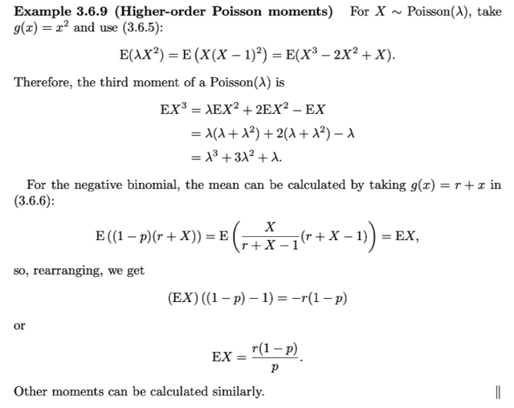</kbd></p>

> [!NOTE]
> QUAY LẠI SAU

<br>

