# 4.1 Joint & Marginal Distribution

📊 **Progress:** `14` Notes | `25` Screenshots

---
<a id="node-218"></a>

<p align="center"><kbd>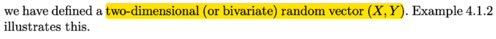</kbd></p>

<p align="center"><kbd></kbd></p>

<p align="center"><kbd>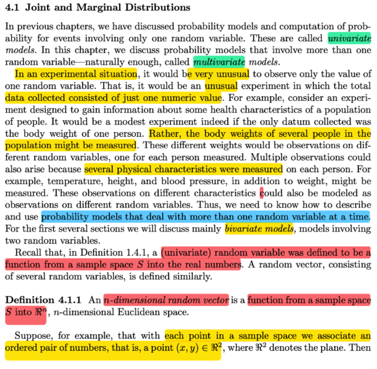</kbd></p>

> [!NOTE]
> đại ý là trong thực tế rất hiếm khi ta chỉ dùng univariate model (chỉ có  một
> random variable)
>
> Thế thì tương tự như khi ta định nghĩa (univariate) random variable là một
> FUNCTION map giữa possible outcome trong sample space với trục số
> thực. Thì với `n-dimensional` random variable vector, cũng có thể hiểu nó là
> FUNCTION, map giữa sample space và không gian R^n

<br>

<a id="node-219"></a>

<p align="center"><kbd>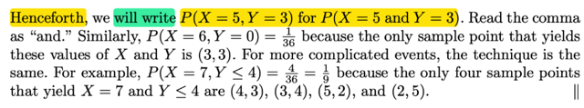</kbd></p>

<p align="center"><kbd></kbd></p>

<p align="center"><kbd>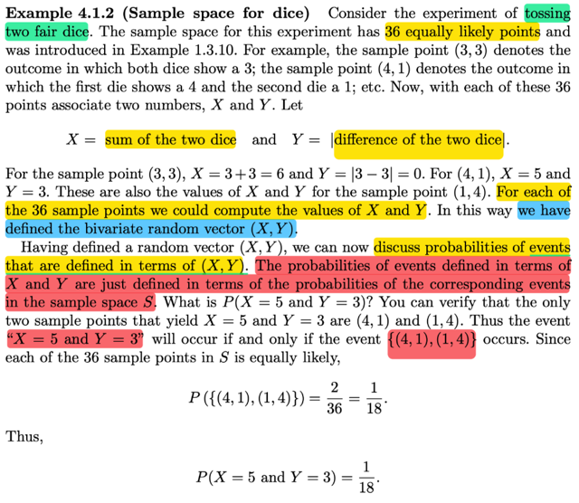</kbd></p>

> [!NOTE]
> đại khái là một ví dụ về việc ta định nghĩa ra một bivariate random vector (X, Y)
> dựa vào sample space là không gian các possible outcome khi ta tung 2 xí
> ngầu. Thì với mỗi possible outcome, ta tính tổng (X) và trị tuyệt đối của hiệu (Y)
> hai nút khi đó mỗi một possible outcome sẽ được MAP với một 2D vector (X, Y)
>
> Tất nhiên phép mapping không unique, vì có thể có hai possible outcome cùng
> map với một vector (X, Y).
>
> Thế thì, điểm quan trọng là, giống như trong univariate case, ta định nghĩa của
> event  thể hiện bởi random variable, thì ở đây cũng vậy, event thể hiển bởi
> random variable vector  (X, Y) VỀ BẢN CHẤT, LÀ `EVENT/SUBSET` CỦA
> SAMPLE SPACE GỐC.
>
> ĐIỀU NÀY RẤT QUAN TRỌNG, VIỆC HIỂU BẢN CHẤT SẼ GIÚP ÍCH RẤT
> NHIỀU.
>
> Ví dụ Khi tính xác suất của việc (X, Y) `=` (5, 3), mô tả event X `=` 5 và Y `=` 3,
> và đây là event thể hiện trong sample space của random variable vector (X,Y)
> hay range của (X, Y). Nhưng bản chất của nó chính là {s ∈ `Ω:` (X, Y)({s}) `=` (5, 3)} 
> trong đó ta hiểu (X, Y) mang bản chất là một vector function.
>
> Khi đó dễ thấy set này sẽ có các possible outcome là {1, 4} {4, 1}
>
> ```text
> theo định nghĩa hàm xác suất, thì P((X, Y) = (5, 3)) = P({s ∈ Ω: (X, Y)({s}) = (5, 3)} )
> ```
>
> ```text
> = Σ{s ∈ {s ∈ Ω: (X, Y)({s}) = (5, 3)}} P({s})
> ```
>
> `=` `Σ` }s ∈ {{1, 4} {4, 1}}} P({s})
>
> Và các possible outcome của việc tung hai xí ngầu là hoàn toàn equally likely
> nên dễ thấy (dựa vào axiom 1,2) P({s}) sẽ là `1/36`
>
> ```text
> ⇨ P((X,Y) = (5,3)) = 2 * 1/36 =0 = 1/18
> ```

<br>

<a id="node-220"></a>

<p align="center"><kbd>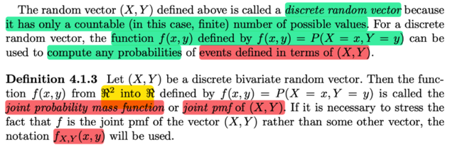</kbd></p>

> [!NOTE]
> Đại khái là với X, Y define như vậy thì nó chỉ có các giá trị khả dĩ rời rạc 
> (discrete) nên (X, Y) gọi là discrete bivariate random variable vector.
>
> Và từ đó ta có khái niệm JOINT PMF, nó sẽ là một R^n → R function, 
> giúp cho biết JOINT PROBABILITY của một EVENT THỂ HIỆN BỞI 
> (X, Y)
>
> (có thể thấy `/` hiểu phải nói rõ event thể hiện bởi X, Y là bởi event này
> có bản chất là event trong sample space gốc, để luôn nhắc nhở ta 
> về bản chất của một event)
>
> Và để ghi cho rõ thì giống như khi ta ghi fX(x) là pmf `/` pdf của X thì 
> ta sẽ ghi fX,Y(x, y) là joint `pmf/pdf` của X, Y

<br>

<a id="node-221"></a>

<p align="center"><kbd>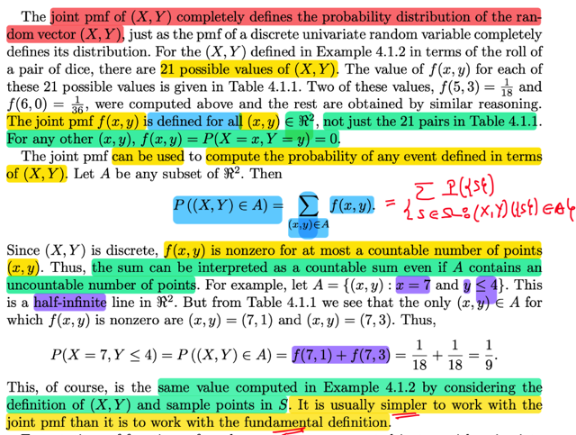</kbd></p>

> [!NOTE]
> Rồi, đại khái là như pmf của univariate random variable cũng giúp
> define toàn bộ distribution của univariate rv thì joint pmf cũng vậy.
>
> Và giống như pmf của X GIÚP TA TÍNH XÁC SUẤT CỦA MỘT
> EVENT DEFINED THEO X, P(X ∈ A) `=` `Σ` {x ∈ A} fX(x) thì joint pmf
> của (X, Y) cũng giúp ta tính xác suất của joint event của X, Y:
>
> P((X, Y) ∈ A) `=` `Σ{(x,` y) ∈ A} fX,Y(x, y)
>
> Dĩ nhiên là vì bản chất vẫn chỉ là xác suát của tập {s ∈ `Ω:` (X, Y)({s})
> ∈ A}
>
> MỘT ĐIỂM NỮA MÀ STAT110 CÓ THỂ CHƯA NÓI:
>
> Rằng (X, Y) có bản chất là function map giữa sample space (đang ví
> dụ thí nghiệm tung 2 xí ngầu) chỉ có 21 giá trị khả dĩ, dẫn đến hàm
> fX,Y sẽ mang  giá trị dương tại 21 điểm (x, y) này, nhưng phải hiểu
> là tập xác định của nó vẫn là toàn không gian, với (x, y) không thuộc
> 21 cặp giá trị này (nhắc lại đây là tổng và trị tuyệt đối của hiệu hai xí
> ngầu) thì đơn giản là fX,Y `=` 0, phản ảnh ý nghĩa là các event này ko
> bao giờ xảy ra (ví dụ ko thể nào có tổng `=` 100, hiệu `=` 1 được
>
> VÀ MỘT ĐIỂM QUAN TRỌNG NỮA, LÀ DÙ NHƯ VỪA NÓI TẬP A,
> CÓ THỂ LÀ TẬP VÔ SÓ ĐIỂM, NHƯNG VÌ PMF CHỈ KHÁC 0 Ở
> HỮU HẠN ĐIỂM NÊN CÁI TỔNG `Σ` TRONG CÔNG THỨC (1) CHỈ
> LÀ TỔNG HỮU HẠN
>
> Ví dụ tính P(X `=` 7, Y ≤ 4) , dĩ nhiên tập A ở đây là gì: {x, y: x `=` 7, y ≤ 4}
> và đây là một nửa đường thẳng, có vô số điểm.
>
> Theo định nghĩa trên P((X,Y) ∈ A) `=` `Σ` {(x, y) ∈ A} fX,Y(x,y)
>
> như đã nói, dù tập A vô số điểm nhưng chỉ có hai điểm là fX,Y(x,y) dương
> còn lại bằng 0 hết, đó là tại (7,1) (7,3) 
>
> ```text
> ⇨ P(X = 7, Y ≤ 4) = f(7,1) + f(7,3) = 1/18 + 1/18 = 1/9
> ```
>
> Cái này là nhìn vào pmf của mọi
> possible values của (X, Y), nhưng cũng dễ dàng giải thích theo sample gốc)
>
> P(X `=` 7, Y ≤ 4) `=` P({s ∈ `Ω:` (X, Y){s} ∈ A})
>
> `=` `Σ` {s ∈ `Ω:` (X, Y){s} ∈ A} P({s})
>
> `=` `Σ` {s ∈ {4,3}, {5,2}} P({s})  | vì chỉ có hai outcome này mới thỏa X `=` 7, Y < 4
>
> `=` 2 * `(1/18)` | do possible outcome equally likely

<br>

<a id="node-222"></a>

<p align="center"><kbd>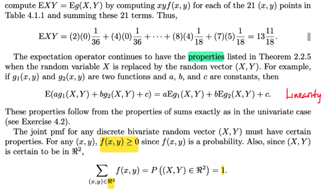</kbd></p>

<p align="center"><kbd></kbd></p>

<p align="center"><kbd>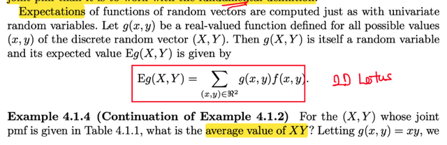</kbd></p>

> [!NOTE]
> Đại khái là expected value của bivariate random variable cũng được define
> tương tự: Như đã biết với ý nghĩa là mean, nó sẽ là weighted average của
> các possible values của (X, Y) với weight là joint pmf tương ứng.
>
> `E(X,` Y) `=` `Σ` {(x,y) ∈ R^2} (x, y) fX,Y(x, y)
>
> `=` `Σ{(x,` y) ∈ R^2} (fX,Y(x, y) x, fX,Y(x, y) y) | ta nhân scalar fX,Y(x, y) cho
> từng  component của (x, y)
>
> `=` `(Σ{(x,` y) ∈ R^2} fX,Y(x, y) x, `Σ{(x,` y) ∈ R^2} fX,Y(x, y) y)
>
> (bứớc này chỉ là tổng của các vector là vector các tổng của các phần tử
> ```text
> tương ứng   <x1, y1> + <x2, y2> = <x1 + x2, y1 + y2>)
> ```
>
> Xét phần tử thứ nhất: `Σ{(x,` y) ∈ R^2} fX,Y(x, y) x
>
> Ta có thể tách nó thành 2 tổng: `Σ` {x ∈ R} `Σ` {y ∈ R} fX,Y(x, y) x
>
> `=` `Σ` {x ∈ R} x `Σ` {y ∈ R} fX,Y(x, y)  | Đưa x ra ngoài cái tổng của y
>
> `=` `Σ` {x ∈ R} x fX(x) | Ở đây, khi marginalized joint pmf trên mọi possible value
> của y thì ta có marginal pmf của X
>
> Và còn lại chính là EX
>
> Tượng tự component thứ hai chính là EY
>
> Vậy `E(X,` Y) (tức là expected value của bivariate random variable (X, Y)  là
> (EX, EY)
>
> `====`
>
> Và tương ứng với LOTUS, thì ở đây ta cũng có 2D LOTUS, giúp ta tính
> expected value của một g(x,y). Giả sử g là vector → R function, 
>
> Eg(X,Y) `=` `Σ` {(x, y) ∈ R^2} g(x,y) fX,Y(x,y)
>
> Một ví dụ cũng dễ hiểu ko có gì
>
> Sau đó là TÍNH CHẤT LINEARITY
>
> Cuối cùng là, tương tự, tính pmf của fX là `Σ` mọi possible value của x phải
> bằng 1, thì `Σ` mọi possible value của (x,y) tức R^2 của joint pmf cũng bằng 1
>
> Từ đó cho phép định nghĩa joint pmf bất kì

<br>

<a id="node-223"></a>

<p align="center"><kbd>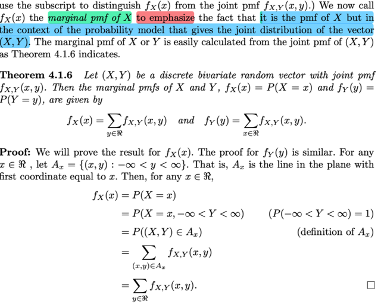</kbd></p>

> [!NOTE]
> đại khái là khi tổng joint pmf với mọi possible value của X thì ta sẽ có 
> marginal pmf của Y và ngược lại.
>
> Ở đây cũng nhấn mạnh rằng marginal pmf của X thì chính là pmf của
> X (trong vai trò là unvariate pmf), chỉ là thêm chữ marginal để nhấn mạnh rằng
> ta có được nó là từ việc marginalizing joint pmf
>
> Phần chứng minh cũng đơn giản, mình có thể tự chứng minh như sau bằng
> cách thể hiện ở sample space
>
> fX(x) `=` P(X `=` x)
>
> `=` P({s ∈ `Ω:` X(s) `=` x})
>
> Mà {s ∈ `Ω:` X(s) `=` x} dĩ nhiên là tập con của `Ω`
>
> ```text
> ⇨ {s ∈ Ω: X(s) = x} = {s ∈ Ω: X(s) = x} ∩ Ω
> ```
>
> `Ω` lại có thể thể hiện ở dạng:
>
> `Ω` `=` {s ∈ `Ω:` Y(s) ∈ R} , vì đây là cách thể hiện sample space ban đầu bởi range
> của Y
>
> Và đến lượt nó, nó sẽ là ∪nion của mọi event ứng với các possible value của y:
>
> ```text
> {s ∈ Ω: Y(s) ∈ R} = ∪ {mọi possible value y cuả Y} {s ∈ Ω: Y(s) = y}
> ```
>
> ```text
> ⇨ {s ∈ Ω: X(s) = x} = {s ∈ Ω: X(s) = x} ∩ {∪ {mọi possible value y cuả Y} {s ∈ Ω: Y(s) = y}
> ```
>
> Vế phải ta sẽ phân phối vô:
>
> ```text
> = ∪ {mọi possible value y cuả Y} [ {s ∈ Ω: X(s) = x} ∩ {s ∈ Ω: Y(s) = y} ]
> ```
>
> ```text
> = ∪ {mọi possible value y cuả Y} [ {s ∈ Ω: X(s) = x, Y(s) = y} ]
> ```
>
> và đây chính là:
>
> `=` ∪ {mọi possible value y cuả Y} (X `=` x, Y `=` y)
>
> ```text
> Vậy P(X = x) = P({s ∈ Ω: X(s) = x}) = P(∪ {mọi possible value y cuả Y} (X = x, Y = y))
> ```
>
> Tiếp ta mới dùng axiom 3: Xác suất của các disjoint event (rõ ràng cách event 
> (X `=` x, Y `=` y) disjoint) `=` tổng xác suất của từng event
>
> ```text
> ... = Σ {mọi possible value y cuả Y} P(X = x, Y = y)
> ```
>
> và đây chính là `Σ` {mọi possible value của Y} fX,Y(x, y)

<br>

<a id="node-224"></a>

<p align="center"><kbd>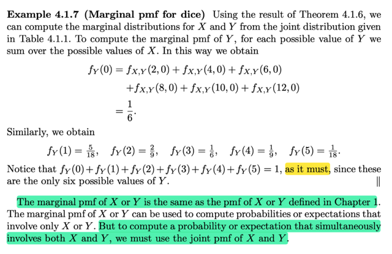</kbd></p>

> [!NOTE]
> Đại khái là quay lại ví dụ dice rolling để tính marginal pmf fY tại Y `=` 0
> dĩ nhiên là ta sẽ tổng mọi fX,Y(x, 0).
>
> Làm tương tự với các possible value khác của Y là 1,2,3,4,5. Thì tất
> nhiên `Σy` fY(y) phải bằng 1 rồi.
>
> Lí do là vì đã nói marginal pmf cảu Y cũng chính là pmf của Y

<br>

<a id="node-225"></a>

<p align="center"><kbd>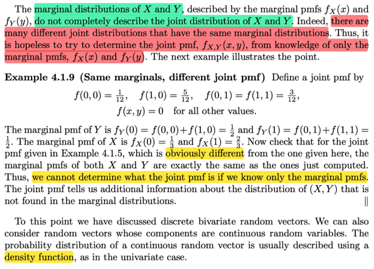</kbd></p>

> [!NOTE]
> Đại ý là gs nhấn mạnh rằng chỉ dựa vào marginal pmf thì không đủ để
> mô tả `/` hiểu hết về joint distribution.
>
> Lấy ví dụ cho một joint pmf hoàn toàn khác với joint pmf của ví dụ hồi
> nãy nhưng tính ra marginal pmf thì Y CHANG.
>
> CÓ NGHĨA LÀ CÓ RẤT NHIỀU JOINT PMF KHÁC NHAU VẪN CÓ THỂ
> CHO RA CÙNG MARGINAL PMF.

<br>

<a id="node-226"></a>

<p align="center"><kbd>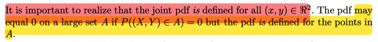</kbd></p>

<p align="center"><kbd></kbd></p>

<p align="center"><kbd>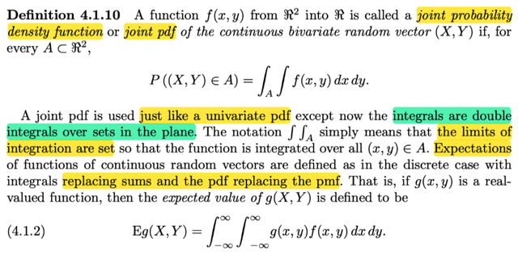</kbd></p>

🔗 **Related:** [5.6 GENERATING RANDOM SAMPLE](56_generating_random_sample.md#node-452)

> [!NOTE]
> đối với continuous random variable vector (X, Y) thì ta sẽ có joint pdf
>
> Từ đó giúp tính xác suất của event thể hiện theo X, Y, ví dụ (X, Y) ∈ A
> sẽ bằng `∫∫A` fX,Y(x,y)dxdy
>
> Tại sao lại là như vậy?
>
> Vì fX,Y(x, y) là hàm mật độ xác suất,  nên để tính xác suất trên một set
> A ta sẽ tích phân kép trên vùng A. Điều này tương tự như với univariate
> case fX(x), để tính xác suất trên vùng A P(X ∈ A) ta sẽ tích phân trên
> vùng A của pdf của X: `∫A` fX(x)dx ĐÂY DỰA TRÊN ĐỊNH NGHĨA CỦA PDF:
>
> Mình nên lập luận từ từ như sau:
>
> Đầu tiên hết là ta có định nghĩa của cdf: FX(k) `=` P(X ≤ k), đây là định nghĩa
> của hàm cdf. Rồi với discrete random variable, ta có định nghĩa của
> pmf fX(k) `=` P(X `=` k). Từ đó ta có liên hệ giữa cdf và pmf:
>
> ```text
> P(X ≤ k) = P({s ∈ Ω: X(s) ≤ k}) = P({s ∈ Ω, x ≤ k: X(s) = x})
> ```
>
> `=` P(∪_{x ≤ k} {s ∈ `Ω:` X(s) `=` x})
>
> ```text
> = Σ_{x ≤ k} P({s ∈ Ω: X(s) = x}) | Dùng axiom 3
> ```
>
> `=` `Σ{x` ≤ k} P(X `=` x)
>
> `=` `Σ_(x` ≤ k} fX(x)
>
> Thế thì, chuyển qua continuous random variable thì pmf fX(k) `=` 0
>
> ```text
> Lí do: Lấy một ε rất nhỏ, ta có (X = k) ⊂ (k - ε < X ≤ k) ⇨ P(X = k) ≤ P(k - ε < X ≤ k)
> ```
>
> Xét set X ≤ k, không khó để thấy nó bằng 
>
> ```text
> (X ≤ k - ε) U (k - ε ≤ X ≤ k)
> ```
>
> X ≤ k về bản chất là {s ∈ `Ω:` X(s) ≤ k},
>
> ```text
> Mà X(s) ≤ k ⇔ X(s) ≤ k - ε or k - ε< X(x) ≤ k
> ```
>
> ```text
> ⇨ {s ∈ Ω: X(s) ≤ k} = {s ∈ Ω: X(s) ≤ k - ε or k - ε < X(x) ≤ k}
> ```
>
> ```text
> = {s ∈ Ω: X(s) ≤ k - ε} U {s ∈ Ω: k - ε < X(x) ≤ k}
> ```
>
> ```text
> ⇨ X ≤ k + ε = X ≤ k - ε U k - ε ≤ X ≤ k
> ```
>
> ```text
> ⇨ P(X ≤ k + ε) = P(X ≤ k - ε U k - ε ≤ X ≤ k )
> ```
>
> ```text
> = P(X ≤ k - ε) +  P(k - ε ≤ X ≤ k) | vì hai set này disjoint
> ```
>
> ⇨ **P(k `-` `ε` ≤ X ≤ k `+` `ε)` `=` P(X ≤ k `+` `ε)` `-` P(X ≤ k `-` `ε)`
>
> và cũng là FX(k `+` `ε)` `-` FX(k `-` ε)**Vậy tới đây ta có P(X `=` k) ≤ FX(k `+` `ε)` `-` FX(k `-` ε)****⇨ lim `ε` → 0 P(X `=` k) ≤ lim `ε` → 0 P(k `-` `ε` ≤ X ≤ k) `=`  lim `ε` → 0 [ FX(k) `-` FX(k `-` `ε)` ]
>
> ```text
> vì khi ε → 0 thì P(k - ε ≤ X ≤ k + ε) → P(k ≤ X ≤ k) và dĩ nhiên đây là P(X = k)
> ```
>
> ```text
> ⇨ P(X = k) = lim ε → 0 FX(k + ε) - FX(k - ε)
> ```
>
> ```text
> = lim ε → 0 FX(k + ε) - FX(k - ε).
> ```
>
> ```text
> = lim ε → 0 FX(k + ε) - lim ε → 0 FX(k - ε)
> ```
>
> `=` FX(k) `-` FX(k) `=` 0
>
> ```text
> Lí do là vì tính right continuous của cdf khiến lim ε → 0 FX(k + ε) = FX(k)
> ```
>
> ```text
> và tính left continuous của cdf khiến lim ε → 0 FX(k - ε) = FX(k)
> ```
>
> Vậy với continuous random variable P(X `=` k) ≤ 0 → P(X `=` k) `=` 0 do tính ko âm
>
> DO ĐÓ, NGƯỜI TA MỚI ĐỊNH NGHĨA PDF: Đó là hàm fX(x) sao cho tương
>
> ```text
> ứng với discrete case P(X ∈ (-inf, k)) = FX(k) = Σ{x ≤ k} P(X = x)
> ```
>
> ```text
> thì với continuous: P(X ∈ (-inf, k)) = FX(k) = ∫-inf:k fX(x)dx
> ```
>
> NHẮC LẠI, ĐÂY LÀ CÁCH TA ĐỊNH NGHĨA RA PDF CỦA X.
>
> Thế thì vì định nghĩa như vậy nên FX(x) `=` `∫-inf:x` fX(t)dt
>
> và FCT2 nói rằng: khi hàm G(x) được định nghĩa là `∫-inf:x` f(t)dt thì G là nguyên
> hàm của f và do đó `d/dx` G(x) `=` f(x)
>
> Áp dụng vào đây ta có FX(x) `=` `∫-inf:x` fX(t)dt nên FX là nguyên hàm của fX
> ⇨ `d/dx` FX(x) `=` fX(x)
>
> Và nhờ FTC1: nói rằng khi ta có G(x) là nguyên hàm của f(x) thì 
> `∫a:b` f(x)dx  `=` G(b) `-` G(a)
>
> Nhờ vậy áp dụng vào xác suất ta có thể tính P(X ∈ [a, b])
>
> vì (dễ thấy) nó bằng P(x ∈ `(-inf,` b)) `-` P(x ∈ `(-inf,` a))
>
> `=` FX(b) `-` FX(a) mà FX là nguyên hàm của fX nên áp dụng điều vừa nói 
> ta có thể có P(a ≤ X ≤ b) `=` `∫a:b` fX(x)dx
>
> KHÁI QUÁT LÊN THÌ P(X ∈ A) `=` `∫A` fX(x)dx
>
> Và áp dụng tương tự cho joint pdf thì ta P((X,Y) ∈ A) `=` `∫∫A` fX,Y(x,y)dxdy

<br>

<a id="node-227"></a>

<p align="center"><kbd>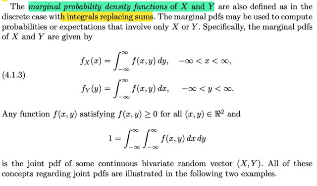</kbd></p>

> [!NOTE]
> Công thức expected value cũng tương tự:
>
> Với discrete Eg(X, Y) `=` `Σ` {mọi possible value (x, y) của (X,Y)} g(x, y) fX,Y(x, y)
>
> dĩ nhiên có thể tách thành
>
> `Σ` {mọi possible value x của X} `Σ` {mọi possible value y của Y} g(x, y) fX,Y(x, y)
>
> (vì sao, vì bản chất chỉ là đổi chỗ dấu ngoặc, ví dụ  f(x1,y1)  `+` f(x2,y1) `+` f(x1, y2) `+`
> f(x2, y2)
>
> nếu viết thế này thì nó là **Σ(mọi possible value của (x,y) f(x,y)**
>
> ```text
> nếu thêm dấu ngoặc:  [f(x1,y1) + f(x1, y2)] + [f(x2,y1) +  + f(x2, y2)]
> ```
>
> thì nó chính là `Σx=x1,` x2 f(x, y1) `+` f(x, y2), và tiếp tục dùng kí hiệu tổng với cái tổng
> ở trong sẽ cho ta **Σx=x1, x2 `Σy=y1,y2` f(x, y)
>
> Vậy thì qua continuous case thì nó là:
>
> `∫-inf:inf` `∫-inf:inf` g(x, y)fX,Y(x,y)dxdy**====**Và tương tự discrete ta cũng có:
>
> ```text
> ∫-inf:inf ∫-inf:inf fX,Y(x,y)dxdy = 1
> ```
>
> Có thể thắc mắc vì sao `∫-inf:inf` fX(x)dx `=` 1?
>
> Đó là vì áp dụng lí luận trên ta có F(inf) `-` `F(-inf)`
>
> `=` P(X < inf)  `-` P(X < `-inf)`
>
> `=` P({s**∈**Ω: X(s) < inf}) `-` P({s**∈**Ω: X(s) < `-inf}`
>
> `=` `P({Ω})` `-` P({**∅}**)
>
> `=` 1 `-` 0 `=` 1**

<br>

<a id="node-228"></a>

<p align="center"><kbd>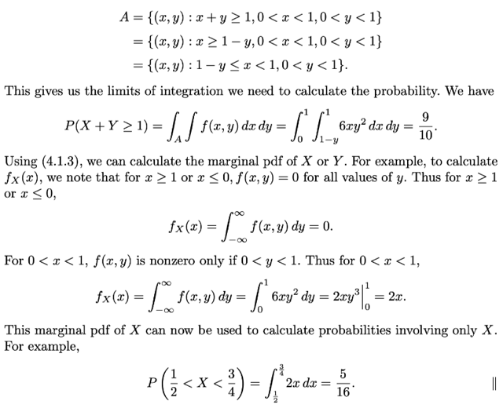</kbd></p>

<p align="center"><kbd></kbd></p>

<p align="center"><kbd>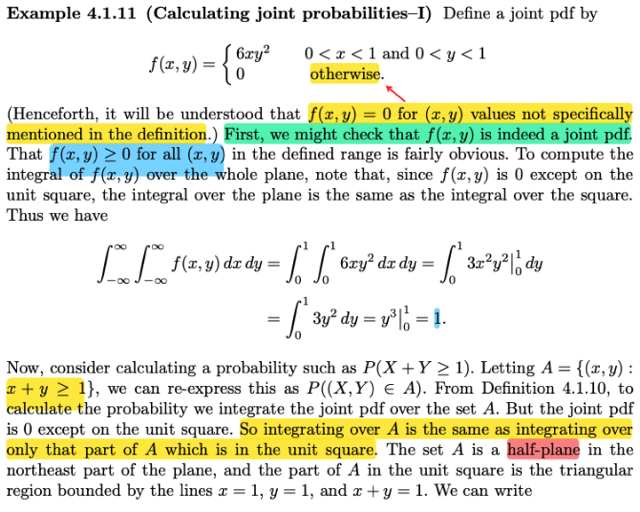</kbd></p>

> [!NOTE]
> QUAY LẠI SAU, nhưng đại khái là hai ví dụ về việc dùng joint pdf để tính
> xác suất của event (X, Y) ∈ A

> [!NOTE]
> QUAY LẠI SAU

<br>

<a id="node-229"></a>

<p align="center"><kbd>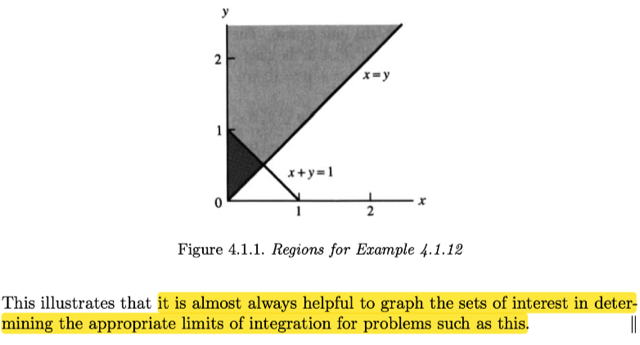</kbd></p>

<p align="center"><kbd></kbd></p>

<p align="center"><kbd>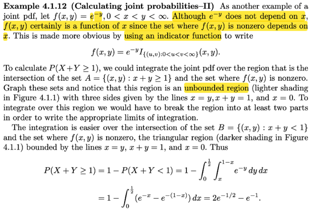</kbd></p>

> [!NOTE]
> QUAY LẠI SAU

<br>

<a id="node-230"></a>

<p align="center"><kbd>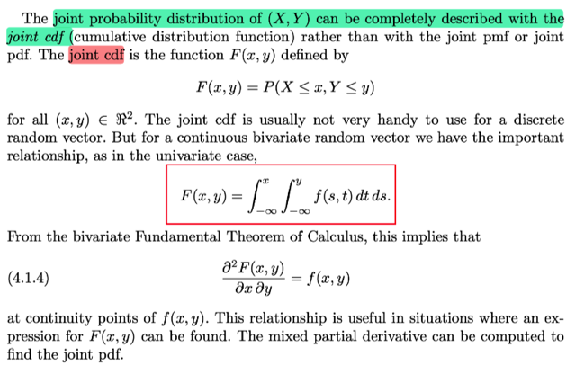</kbd></p>

> [!NOTE]
> QUAY LẠI SAU

<br>

