# 4.2 Conditional Distributions & Independent

📊 **Progress:** `19` Notes | `36` Screenshots

---
<a id="node-232"></a>

<p align="center"><kbd>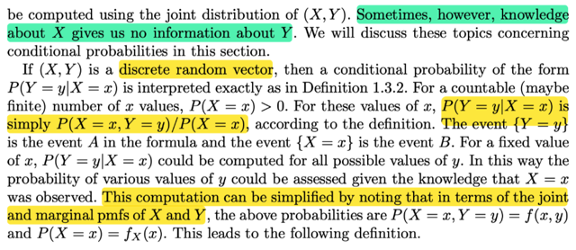</kbd></p>

<p align="center"><kbd></kbd></p>

<p align="center"><kbd>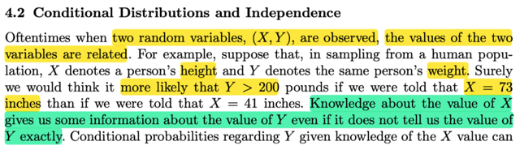</kbd></p>

> [!NOTE]
> đại khái là trong các thực nghiệm, khi lấy mẫu (các observed values) của
> các biến ngẫu nhiên thì có khi gía trị của chúng có quan hệ (relate) nhau.
>
> Ví dụ như nếu X là chiều cao, Y là cân nặng, và ta lấy mẫu `=` chọn ngẫu
> nhiên người nào đó và đo hai giá trị này thì có thể sẽ thấy sự quan hệ này.
>
> Cụ thể là người mà cao trên 1m8 thì sẽ có nhiều khả năng là nặng hơn 70 kg
> hơn là người cao có 1m4.
>
> Thế thì, như vậy việc biết gía trị của thằng này có thể giúp biết thông tin nào
> đó về giá trị của thằng kia, tức là đang nói về xác suất dựa trên điều kiện,
> ví dụ P(Y `=` y | X `=` x)
>
> Thế thì với biến rời rạc, ta có thể dùng một định nghĩa của conditional probab
> P(A|B) `=` P(A ∩ B) `/` P(B)
>
> để áp dụng vào đây thì A chính là Y `=` y, B là X `=` x, từ đó ta có:
>
> ```text
> P(Y = y| X = x) = P(Y = y, X = x) / P(X = x) thì tử số chính là join pmf của X, Y
> ```
> (evaluate tại x, y)
>
> Nên ta có thể viết theo notation của joint pmf, và marginal 
>
> fY(y) `=` fX,Y(x,y) `/` fY(y)

<br>

<a id="node-233"></a>

<p align="center"><kbd>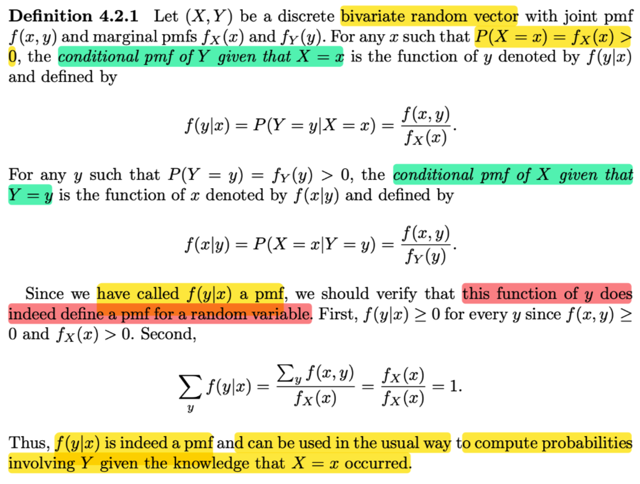</kbd></p>

> [!NOTE]
> rồi, đây là định nghĩa của conditional pmf X, Y:
>
> ```text
> fY|X(y|x) = P(Y = y| X = x) = fX,Y(x,y) / fX(x)
> ```
>
> (chú ý là trong sách ko ghi fX,Y(x,y) mà chỉ ghi f(x, y) đơn giản là việc ghi như vậy hay ko
> là tùy, mục đích chỉ là để nói rõ pmf của biến nào, ở đây dĩ nhiên f(x,y) là joint pmf của X,
> Y. còn fX(.) phải ghi rõ vì nó là pmf của X, khác với fY(.) là pmf của Y.
>
> Rồi, một điểm nữa stat110 cũng đã từng nghe đó là conditional pmf LÀ MỘT PMF, ý là, nó
> hoàn toàn hợp lệ trong vai trò pmf, thông qua việc ta có thể chứng minh nó ko âm và tổng
> pmf với mọi possible values là 1.
>
> Chứng minh dễ thôi `Σ{mọi` possible value y của Y} fY|X(y|x)
>
> `=` `Σ{mọi` possible value y của Y} fX,Y(x, y) `/` fX(x)
>
> mà ta đã học `Σ{mọi` possible value y của Y} fX,Y(x, y) chính là fX(x)
>
> ```text
> (ôn lại nhanh ko thừa: X = x bản chất là {s ∈ Ω: X(s) = x}, cái này là tập con của Ω nên nó
> ```
> ```text
> = {s ∈ Ω: X(s) = x} ∩ Ω, Ω có thể thể hiện bởi:
> ```
>
> ```text
> Ω = ∪ {mọi possible value của y} {s ∈ Ω: Y(s) = y}
> ```
>
> ```text
> ⇨ {s ∈ Ω: X(s) = x} = {s ∈ Ω: X(s) = x} ∩ ∪ {mọi possible value của y} {s ∈ Ω: Y(s) = y}
> ```
>
> ```text
> dùng distribution law: = ∪ {mọi possible value y của Y} [ {s ∈ Ω: X(s) = x} ∩ {s ∈ Ω: Y(s) = y}
> ```
> ]
>
> ```text
> = ∪ {mọi possible value y của Y} [ {s ∈ Ω: X(s) = x, Y(s) = y }
> ```
>
> `=` ∪ {mọi possible value y của Y} (X `=` x, Y `=` y)
>
> ```text
> ⇨ P(X = x) = P({s ∈ Ω: X(s) = x}) = P(∪ {mọi possible value y của Y} (X = x, Y = y))
> ```
>
> ```text
> Đây là ∪nion của các disjoint event, nên = Σ{mọi possible value y của Y} (X = x, Y = y).
> ```
> Chứng minh xong)
>
> Cái chính muốn nhấn mạnh là vì fY|X(y|x) là valid pmf nên nó hoàn toàn có thể giúp xác
> định distribution của Y khi biết giá trị của X

<br>

<a id="node-234"></a>

<p align="center"><kbd>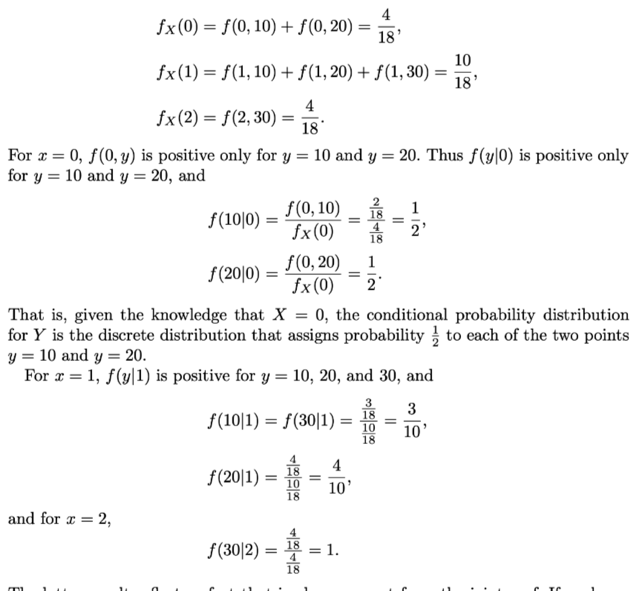</kbd></p>

<p align="center"><kbd>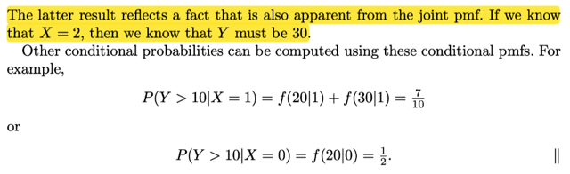</kbd></p>

<p align="center"><kbd></kbd></p>

<p align="center"><kbd></kbd></p>

<p align="center"><kbd>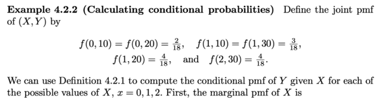</kbd></p>

> [!NOTE]
> Một ví dụ cũng đơn giản, đại khái là người ta cho một joint pmf (tại các
> possible  value của X, Y). ta sẽ tính f(y|x) tại các possible value của X.
>
> Đầu tiên là ta sẽ tính các marginal pmf của X, để có fX(x) tại các p.v của X
>
> Sau đó áp dụng fY|X(y|x) `=` fX,Y(x,y) `/` fX(x).
>
> Có điểm đáng chú ý là, khi define joint pmf thì f(2, 30) `=` `4/18,` và chỉ có cặp
> giá trị  X `=`  2, Y `=` 30 là nơi duy nhất xuất hiện hai giá trị này.
>
> Từ đó khi tính fY|X(y|2) ta tính ra `=` 1, và nói lên rằng khi biết X `=` 2 thì chắc
> chắn Y `=` 1, phản ảnh sự thật vừa nói trên rằng Y `=` 30 chỉ xuất hiện trong
> cặp X `=` 2, Y `=` 30.
>
> Tương tự, trong định nghĩa của joint pmf cho ta biết có hai cặp x, y mà y `=` 20
> ```text
> là (X=0, Y=10), (X=0, Y=20) với xác suất là như nhau = 2/18. Điều này phản
> ```
> ```text
> ảnh vào fY|X: là f(10|0) bằng 1/2, thể hiện rằng khi biết X=0 thì 50-50 là Y = 10
> ```
> hoặc 20

<br>

<a id="node-235"></a>

<p align="center"><kbd>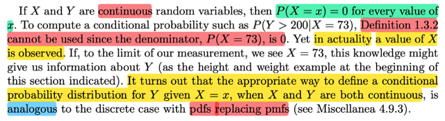</kbd></p>

> [!NOTE]
> Rồi, nói tới việc khi X, Y là continuous rv  thì sao. Vấn đề là như ta đã biết, khi
> đó P(X `=` x) `=` 0
>
> (vì sao? chứng minh nhanh:
>
> (X `=` x) ⊂ (x `-` `ε` < X ≤ x) nên dựa vào một theorem đã biết trước đây nói rằng
> nếu A ⊂ B ⇨ P(A) ≤ P(B) (chứng minh: A ⊂ B ⇨ A ∩ B `=` A,  P(B) `=` P(B ∩ A) `+`
> P(B ∩ Ac) ⇨ P(B) `=` P(A) `+` P(B ∩ Ac) ≥ P(A) do P(B ∩ Ac) ≥ 0 theo axiom 1)
>
> ⇨ P(X `=` x) ≤ P(x `-` `ε` < X ≤ x)
>
> ```text
> Xét (x-ε < X ≤ x) về bản chất nó là {s ∈ Ω: x - ε < X(s) ≤ x} mà cái này thì sao:
> ```
>
> ```text
> X(s) ≤ x ⇔ X(s) ≤ x - ε hoặc x - ε < X(s) < X(s) ≤ x
> ```
>
> ```text
> ⇨ {s ∈ Ω: X(s) ≤ x} = {s ∈ Ω: X(s) ≤ x - ε hoặc x - ε < X(s) < X(s) ≤ x}
> ```
>
> ```text
> Vế phải = {s ∈ Ω: X(s) ≤ x} ∪ {s ∈ Ω: x - ε < X(s) < X(s) ≤ x} | vì  định nghĩa của
> ```
> union giữa hai set
>
> ```text
> Vậy ta có P({s ∈ Ω: X(s) ≤ x}) = P({s ∈ Ω: X(s) ≤ x - ε} ∪ {s ∈ Ω: x - ε < X(s) ≤
> ```
> x})
>
> và vế phải là ∪ hai set disjoint nên theo axiom 2:
>
> ```text
> ... = P({s ∈ Ω: X(s) ≤ x - ε}) + P({s ∈ Ω: x - ε < X(s) < X(s) ≤ x})
> ```
>
> ```text
> Từ đó ta có: P(X ≤ x) = P(X ≤ x - ε) + P(x - ε < X ≤ x)
> ```
>
> ```text
> ⇔  P(x - ε < X ≤ x) = P(X ≤ x) - P(X ≤ x - ε)
> ```
>
> ```text
> Vế phải lúc này chính là hiệu của cdf của X evaluate tại x + ε  và x - ε : FX(x) -
> ```
> FX(x `-` `ε)`
>
> ```text
> Vậy quay lại bên trên ta có: P(X = x) ≤ P(x - ε < X ≤ x) = FX(x) - FX(x - ε)]
> ```
>
> với mọi `ε,` do đó nó phải đúng ở giới hạn `ε` → 0
>
> ```text
> lim ε → 0  P(X = x) = P(X = x) ≤ lim ε → 0 FX(x) - FX(x - ε)
> ```
>
> ```text
> = FX(x) -  lim ε → 0 FX(x - ε)
> ```
>
> Do **tính chất liên tục**của cdf **đối với biến ngẫu nhiên liên tục**. Tính chất
> này, theo mit 1801 nói rằng right continuous: lim x → `x0+` f(x) `=` f(x0)
>
> ```text
> Ở đây lim ε → 0 FX(x - ε) = lim x - ε → - F(x - ε) = FX(x)
> ```
>
> ```text
> Do đó kết quả là P(X = x) ≤ 0 mà P(X = x) cũng ≥ 0 ⇨ P(X = x) = 0
> ```
>
> ```text
> Có thể từ ghi luôn P(x - ε < X < x + ε) = F(x + ε) - F(x - ε) luôn ko?
> ```
>
> Có thể, khi nhắc đến định nghĩa của pdf, là cái function fX sao cho `∫-inf:` x
> fX(t)dt `=` FX(x), khi đó với định nghĩa này, dựa vào FTC1 nói rằng khi ta có
> ```text
> G(x) định nghĩa bởi ∫-inf:x f(t)dt thì G là  nguyên hàm của f: d/dx G(x) = f(x).
> ```
> Áp dụng vào đây ta có `d/dx` FX(x) `=` fX(x). Và áp dụng tiếp FTC2 nói rằng nếu
> G(x) là nguyên hàm của f(x) thì `∫a:b` f(x)dx `=` G(b) `-` G(a). Do đó áp dụng vào
> việc ta đã có FX(x) là nguyên hàm của fX(x) thì ta có quyền có kết luận:
>
> ```text
> ∫x-ε:x+ε fX(x)dx = FX(x+ε) - FX(x-ε)
> ```
>
> `====`
>
> Quay lại đây. gs nói rằng cách tiếp cận đối với continuous rv đối với
> conditional probability  sẽ là ta thay conditional pmf bằng conditional pdf

<br>

<a id="node-236"></a>

<p align="center"><kbd>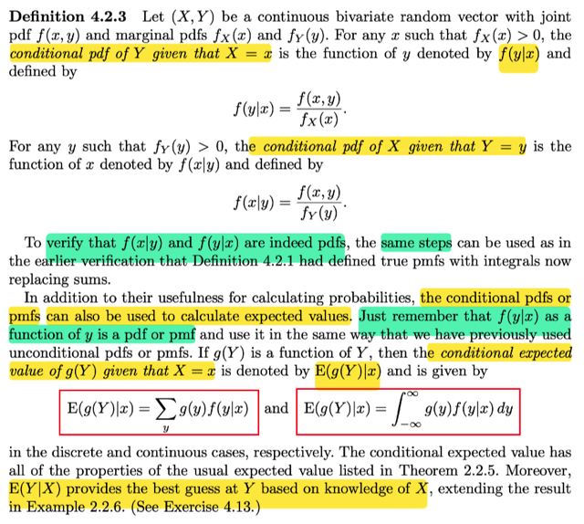</kbd></p>

> [!NOTE]
> Định nghĩa về **conditional pdf của Y given value của X:**
>
> fY|X(y|x) `=` fX,Y(x,y) `/` fX(x)
>
> Và gs cho rằng ta cũng có thể chứng minh nó là pdf valid theo cách
> tương tự trước.
>
> Và cho phép ta tính CONDITIONAL EXPECTATION: `E(g(Y)|x)` hoàn toàn
> tương tự như khi ta tính Eg(Y) `=` `Σy` g(y)fY(y) nếu Y là discrete rv hoặc
> `∫-inf:inf` g(y)fY(y)dy nếu Y là continuous rv.
>
> Thì nay ta thay bằng conditional `pmf/pdf:`
>
> ```text
> Eg(Y)|x = Σy g(y)fY|X(y|x) hoặc ∫-inf:inf g(y)fY|X(y|x)dx
> ```
>
> Và cái này mang ý nghĩa tương tự như ý nghĩa của Eg(Y) là best guess
> cho giá trị của g(Y) thì Eg(Y)|x mang ý nghĩa là best guess của g(Y) khi
> biết X `=` x

<br>

<a id="node-237"></a>

<p align="center"><kbd>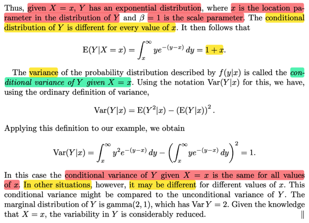</kbd></p>

<p align="center"><kbd></kbd></p>

<p align="center"><kbd>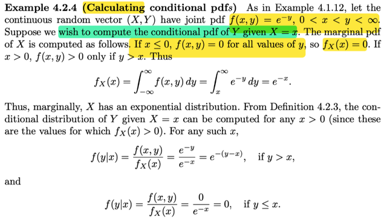</kbd></p>

> [!NOTE]
> Đại khái là ta trong một ví dụ trước đây ta có joint pdf: f(x, y) `=` `e^-y,` 0 < x < y <
> inf
>
> Thế thì để tính fY|X(y|x) `=` fX,Y(x,y) `/` fX(x)
>
> Trước tiên ta tính fX(x), như đã biết bằng cách "marginalize" mọi possible value
> của y:
>
> fX(x) `=` `∫-inf:inf` f(x,y)dy
>
> mà f(x,y) bằng `e^-y` khi x < y inf, còn khi x < 0 hoặc 0 < x nhưng 0 < y < x thì f(x,
> y) `=` 0 (định nghĩa của f(x,y) như vậy thì có nghĩa là khi thỏa điều kiện 0 < x < y
> thì f(x,y) `=` `e^-y` còn nếu không thỏa thì f(x,y) `=` 0, tập xác định vẫn là R^2 (x ∈
> `(-inf,inf),` y ∈ `(-inf:inf))`
>
> ```text
> Do đó tích phân trên = ∫x:inf e^-ydy = [nguyên hàm của e^-y]|x:inf
> ```
>
> ```text
> = -e^-y|x:inf. y → inf ⇨ -y → -inf ⇨ -e^-y → 0  ; y → x → -e^-y → -e^-x
> ```
>
> ```text
> ⇨ .. = 0 - (-e^-x) = e^-x
> ```
>
> Và như vậy fX(x) `=` `e^-x` cho thấy X đơn lẻ là một Expo(1), ta nhớ pdf của
> ```text
> Expo(λ) fX(x)  = λ e^-λx hay Expo(β) = (1/β) e^-x/β
> ```
>
> ```text
> ⇨ fY|X(y|x) = fX,Y(x,y) / fX(x) = e^-y / e^-x = e^[-y+x] = e^(x-y)
> ```
>
> Dĩ nhiên phải ghi rõ là **fY|X(y|x) `=` e^(x-y)** khi x < y
>
> Còn khi y ≤ x thì fY|X(y|x) `=` 0 do f(x, y) `=` 0 rồi
>
> `====`
>
> Từ kết quả fY|X(y|x) `=` `e^-(y-x)` ta mới nhận xét rằng given giá trị x của X ta sẽ 
> biết Y là một Expo và gía trị x của X cho biết location (location parameters)
> là sao? Bởi vì bài trước về location family đã học, f(x `-` `μ)` sẽ định nghĩa ra một
> gia đình các distribution có cùng dạng, chỉ khác nhau location. Nên với các x
> ```text
> khác nhau e^-(y-x) tức f(y-x) với f(u) = e^-u là pdf của expo(1), sẽ làm nên một
> ```
> location family các expo distribution có cùng scale nhưng khác location
>
> ```text
> E(Y|X=x) = ∫-inf:inf y fY|X(y|x)dy
> ```
>
> ```text
> = ∫-inf:inf y e^-(y-x)dy
> ```
>
> ```text
> = ∫x:inf y e^-(y-x)dy
> ```
>
> Đặt du `=` y ⇨ du `=` dy
>
> ```text
> dv = e^-(y-x) ⇨ v = - e^-(y-x)
> ```
>
> ```text
> Áp dụng tích phân từng phần (integration by part) ∫udv = uv - ∫vdu
> ```
>
> ```text
> ∫x:inf y e^-(y-x)dy ( = ∫udv) = (uv - ∫vdu) = y[-e^-(y-x)] |x:inf - ∫x:inf-e^-(y-x)dy
> ```
>
> ```text
> = y[-e^-(y-x)] |x:inf - [e^-(y-x) |x:inf]
> ```
>
> ```text
> y → inf ⇨ e^-(y-x) → e^-inf = 0 ⇨ y[-e^-(y-x)] → 0
> ```
>
> ```text
> y → x ⇨ e^-(y-x) → e^0 = 1 ⇨ y[-e^-(y-x)] → -x
> ```
>
> term 1 `=` **x**, term 2 `=` [0 `-` 1] `=` -**1**
>
> Kết quả là là **x `+` 1**

> [!NOTE]
> Tiếp theo là một cái mà stat110 mình chưa thấy, nhưng cũng ko quá khó
> hiểu: conditional variance `Var(Y|x)`
>
> Thế thì, variance, có công thức (thứ hai) là `Var(Y)` `=` EY^2 `-` (EY)^2
>
>
>
> vậy thì với variance condition on x, đơn giản là ta chỉ việc tính theo công
> thức của variance chỉ có điều dùng conditional expectaton của Y given value 
> của X `=` x:
>
> ```text
> Var(Y|X=x) = E(Y^2|x) - [E(Y|x)]^2
> ```
>
> ```text
> Với E(Y^2|x) áp dùng công thức vừa rồi Eg(Y)|x = ∫-inf:inf g(y)fY|X(y|x)dx
> ```
>
> ```text
> = ∫-inf:inf y^2 e^-(y-x)dy, để tính tích phân này lại dùng integration by part
> ```
>
> ```text
> = ∫x:inf y^2 e^-(y-x)dy | nhắc lại ko thừa, vì condition pdf fY|X(y|x) = 0 khi y < x
> ```
> nên thu hẹp cận của tích phân lại
>
> ```text
> Đặt u = y^2 ⇨ du = 2ydy, dv = e^-(y-x)dy ⇨ v = -e^-(y-x)
> ```
>
> ```text
> ⇨ ta có .. = y^2[-e^-(y-x)]|x:inf - ∫x:inf -e^-(y-x) 2ydy
> ```
>
> ```text
> = y^2[-e^-(y-x)]|x:inf +2 ∫x:inf y e^-(y-x) dy
> ```
>
> ```text
> Áp dụng kết quả hồi nãy: ∫x:inf y e^-(y-x) dy = 1 + x
> ```
>
> ```text
> Còn term 1: y → inf ⇨ e^-(y-x) → e^-inf = 0 ⇨ y^2[-e^-(y-x)] → 0
> ```
>
> ```text
> y → x ⇨ y^2[-e^-(y-x)] → x^2[-e^0] = -x^2
> ```
>
> ```text
> ⇨ term 1 = 0 - (- x^2) = x^2
> ```
>
> ```text
> Vậy tích phân = x^2 + 2(1+x) = x^2 + 2 + 2x
> ```
>
> ```text
> Còn cái [E(Y|x)]^2 = (1 + x)^2 = 1 + x^2 + 2x
> ```
>
> ```text
> Vậy Var(Y) = x^2 + 2 + 2x - [1 + x^2 + 2x]
> ```
>
> ```text
> = x^2 + 2 + 2x - 1 - x^2 - 2x
> ```
>
> `=` **1
>
> KẾT QUẢ NÀY CHO THẤY VARIANCE CỦA `Y|X=x` là như nhau với mọi
> giá trị của X.**Và gs cho biết marginal distribution của Y là Γ(2,1) tức variance của nó bằng 
> 2 thì điểm nhấn mạnh ở đây là bằng việc biết giá trị của X, dù là bao nhiêu
> cũng được, đều khiến variability của Y tức mức biến động của Y thể hiện qua
> EY|x chỉ còn bằng 1, tức giảm một nửa
>
> Thử xem marginal pdf của Y, xem tại sao là Γ(2,1)?
>
> Để có pdf của Y ta cũng marginalize join pdf mọi possible value của x:
>
> fY(y) `=` `∫-inf:inf` f(x,y)dx
>
> ```text
> = ∫-inf:inf e^(-y) dx
> ```
>
> Như đã nói joint pdf sẽ `=` 0 khi x < 0, và chỉ có giá trị ko âm khi x < y, nên limit
> của tích phân này sẽ là 0:y:
>
> ```text
> ∫0:y e^(-y) dx = e^(-y) ∫0:y dx
> ```
>
> `=` `e^(-y)` [x|0:y] `=` `e^-y` (y `-` 0) `=` **y e^-y**
>
> Kết qủa fY(y) `=` `e^(-y)` y
>
> ```text
> Γ(α, β) có pdf f(y | α, β) = [1/Γ(α)β^α] y^(α-1) e^-y/β
> ```
>
> ```text
> Γ(2, 1) có pdf =  [1/Γ(2)1^2] y^(2-1) e^-y/1 = y^2 e^-y / Γ(2)
> ```
>
>  `=` y^2 `e^-y` `/` [1Γ(1)] `=` **y^2 e^-y**
>
> ```text
> (áp dụng tính chất  Γ(a+1) = a Γ(a), và Γ(n) = (n-1)! ⇨ Γ(1) = 0! = 1
> ```
>
> Vậy có thể thấy đúng là Y ~ gamma (2, 1)

<br>

<a id="node-238"></a>

<p align="center"><kbd>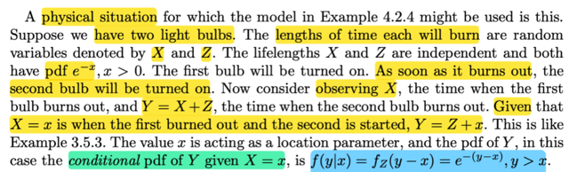</kbd></p>

> [!NOTE]
> Rồi, đại khái là người ta ví dụ rằng một tính huống thực tế mà ta có thể  áp dụng
> mô hình vừa rồi: Là cho X, Z là thời gian cháy của hai bóng đèn và cả hai đều ~
> pdf `=` `e^-x.`
>
> Bóng thứ nhất được bật, và khi nó cháy xong, bóng thứ hai sẽ được bật. Và thời
> điểm bóng thứ hai cháy xong sẽ là Y `=` X `+` Z
>
> Vậy thì, đại khái là khi bóng thứ nhất cháy xong (tức là bị hư, bị đứt), thì đương
> nhiên đó là khi ta ghi nhận (quan sát `/` observe) giá trị cụ thể của X. Khi đó, Y sẽ
> là `=` x `+` Z
>
> Và như đã biết, với x khác nhau thì Z `+` x sẽ làm thành một location family
>
> Bài trước ta cũng đã học một theorem nói rằng:
>
> ```text
> Z có pdf là f, thì X = σZ + μ  ⇔ pdf của X là fX(x) = (1/σ) f[(x - μ) / σ]
> ```
>
> Nên ở đây Y `=` Z `+` x, với Z có pdf fZ ⇨ pdf của Y sẽ là fZ(y `-` x)
>
> ```text
> Mà fZ(t) = e^-t (đề bài cho X, Z đều ~pdf e^-x dĩ nhiên ta đều hiểu ý là  fZ(z) =
> ```
> ```text
> e^-z, fX(x) = e^-x) = e^-z | z = y - x = e^-(y-x)
> ```
>
> Do đó dựa trên giá trị cụ thể quan sát thấy x của X, thì Y sẽ `=` Z `+` x có pdf là fY(y)
> ```text
> = fZ(y-x). Cho nên ta nói fY|X(y|x) = fZ(y-x) = e^-(y-x)
> ```
>
> Sẵn chứng minh lại cái theorem trên cho nhớ:
>
> Chứng minh chiều đi (điều kiện cần):
>
> ```text
> Ta có Z ~ f, X = σZ + μ cần chứng minh fX = (1/σ) f[(x - μ) / σ]:
> ```
>
> Dùng transformation theorem thôi:
>
> ```text
> Bản chất là: Ta thử xem nếu X = σZ + μ thì cdf của nó là gì:
> ```
>
> Xét cdf của X, FX(x) dĩ nhiên theo định nghĩa của cdf, nó là P(X ≤ x)
>
> P(X ≤ x) `=` P({s ∈ `Ω:` X(s) ≤ x})
>
> ```text
> Mà X = σZ + μ ⇨ X(s) = σZ(s) + μ
> ```
>
> ```text
> ⇨ .. = P({s ∈ Ω: σZ(s) + μ ≤ x}) = P({s ∈ Ω: Z(s) ≤ (x - μ)/σ}) | vì σ ko âm
> ```
>
> ```text
> và đây chính là P(Z ≤ (x - μ) / σ), và cũng là cdf của Z, evaluate tại (x - μ) / σ
> ```
>
> ```text
> = FZ((x - μ) / σ)
> ```
>
> ```text
> Vậy thì: FX(x) = FZ((x - μ) / σ)
> ```
>
> Đạo hàm hai vế ta có:
>
> ```text
> d/dx FX(x) = d/dx FZ((x - μ) / σ)
> ```
>
> Vế trái, theo định nghĩa của pdf của X là hàm fX sao cho `∫-inf:x` fX(t)dt `=` FX(x) và
> FTC1 cho ta FX là nguyên hàm của fX ⇨ `d/dx` FX(x) `=` fX(x)
>
> ```text
> Áp dụn chain rule cho vế phải, đặt z = (x - μ) / σ
> ```
>
> ```text
> ⇨ vế phải = d/dx FZ(z) = d/dz FZ(z) . d/dx (z)
> ```
>
> `=` fZ(z) (1 `/` `σ)`  | đạo hàm theo z của cdf của Z chính là pdf của Z, và như đề ra
>
> ban đầy, là f
>
> ```text
> = (1/σ) fZ([(x - μ) / σ])
> ```
>
> ```text
> = (1/σ) f([(x - μ) / σ])   Chứng minh xong điều kiện cần
> ```
>
> Thật ra ta có thể áp dụng ngay transformation theorem:
>
> fX(x) `=` fZ(z) `|dz/dx|`
>
> ```text
> với X = g(Z) = σZ + μ ⇨ Z = ginv(X) = (X - μ) / σ
> ```
>
> Và hàm g là hàm đồng biến tăng nên công thức trên trở thành:
>
> ```text
> fX(x) = fZ(z) dz/dx = f(z) d ginv(x)dx = f(ginv(x)) d/dx ginv(x)
> ```
>
> ```text
> ginv(x) = (x - μ) / σ, d/dx ginv(x) = d/dx (x - μ) / σ = 1 / σ
> ```
>
> ```text
> = f((x - μ) / σ) (1 / σ) Chứng minh xong
> ```
>
> Điều kiện đủ:
>
> ```text
> Có X với pdf fX(x) = (1/σ) f([(x - μ) / σ]) chứng minh tồn tại Z có pdf là f với quan
> ```
> ```text
> hệ  X = Zσ + μ
> ```
>
> ```text
> Chỉ việc xem thử pdf của Z = (X - μ) / σ là gì?
> ```
>
> Lập luận như ở trên:
>
> ```text
> FZ(z) = P(Z < z) = P({s ∈ Ω: Z(s) ≤ z}) = P({s ∈ Ω: [X(s) - μ] / σ ≤ z})
> ```
>
> ```text
> = P({s ∈ Ω: X(s) ≤ zσ + μ}) = P(X ≤ z σ + μ) | những dấu bằng này là vì σ ko âm
> ```
> nên
>
> ta đang xét cùng một event
>
> ```text
> và P(X ≤ z σ + μ) chính là FX(zσ + μ)
> ```
>
> ```text
> ⇨ FZ(z) = FX(zσ + μ)
> ```
>
> ```text
> ⇨ d/dz FZ(z) = d/dz FX(zσ + μ)
> ```
>
> ```text
> ⇔ fZ(z) = d/dz FX(zσ + μ) = d/dx FX(zσ + μ) d/dz (zσ + μ)
> ```
>
> ```text
> = fX(zσ + μ) . σ
> ```
>
> ```text
> = (1/σ) f([(zσ + μ - μ) / σ]) . σ
> ```
>
> `=` **f(z)
>
> Vậy là fZ(z)**  `=` f(z) ⇨ fZ `=` f, hay f là pdf của Z với quan hệ giữa X Z: X `=` `σZ` `+` `μ`

<br>

<a id="node-239"></a>

<p align="center"><kbd>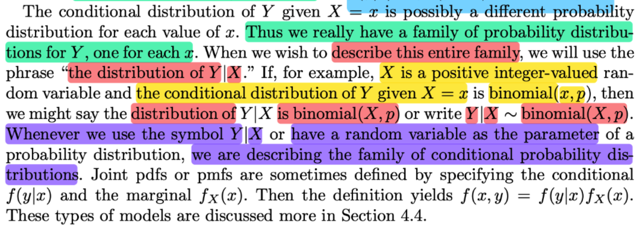</kbd></p>

> [!NOTE]
> Ở đây là một kiến thức quan trọng mà stat110 có nói sơ rồi nhưng vì ở sách
> này mình mới được học về distribution family nên nó rõ hon:
>
> ```text
> Đại khái là, như vừa rồi ta đã thấy một ví dụ fY|X(Y|X=x) = e^-(y-x) với ý nghĩa
> ```
> là nếu biết giá trị cụ thể x của X thì ta sẽ có distribution của Y là một thành
> viên cụ thể của một expo family thuộc loaị location family với location param là
> x.
>
> Giả sử trong case khác, với observed value x của X, thì `Y|X=x` là một
> binomial(x, p) sẽ là một thành viên của một family.
>
> VẬY THÌ NẾU TA MÔ TẢ `/` MUỐN THỂ HIỆN TOÀN BỘ FAMILY NÀY, THÌ TA
> SẼ DÙNG CÁCH KÍ HIỆU LÀ Y|X ~ bin(X, p)
>
> Chỗ này có thể thấy lạ lẫm khi lần đầu tiên ta thấy một random variable nằm ở
> vị trí của param.
>
> Đã quen với bin(n, p) từ stat110, và nhớ về story của X ~ bin(n, p) là số trial
> bern(p) success trong n iid trials.
>
> Vậy thì ở đây, số trials cũng là một random variable, để rồi tùy vào giá trị cụ
> thể  của nó thì Y|X ~ bin(X, n) sẽ là một random variable thuộc một thành viên
> cụ thể của family này
>
> **DO ĐÓ, BẤT CỨ KHI NÀO TA THẤY RANDOM VARIABLE XUẤT HIỆN TẠI
> VỊ TRÍ CỦA MỘT PARAMETERS THÌ ĐÓ LÀ KHI TA ĐANG MÔ TẢ MỘT
> FAMILY CÁC DISTRIBUTION. Đây là một nhận định cực kì quan trọng,**

<br>

<a id="node-240"></a>

<p align="center"><kbd>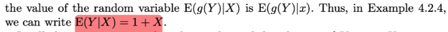</kbd></p>

<p align="center"><kbd></kbd></p>

<p align="center"><kbd>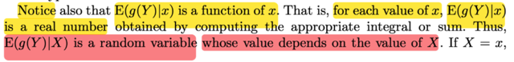</kbd></p>

> [!NOTE]
> Một điểm kiến thức cũng cực kì quan trọng, cái này thì stat110 đã thấy rồi.
> Đó là nói về `E(g(Y)|x)` và `E(g(Y)|X)`
>
> `E(g(Y)|x),` hay `E(g(Y)|X=x)` là một con số xác định, là constant. Vì sao, vì khi
> có giá trị cụ thể x của X thì `E[g(Y)|x]` như đã biết tính bằng:
>
> `Σ{mọi` possible value y của discrete rv Y} g(y)fY|X(y, x)
>
> hoặc `∫-inf:inf` g(y)fY|X(x,y)dy
>
> Thì dĩ nhiên nó sẽ ra một con số, chứ ko còn phụ thuộc cái gì nữa.
>
> Nhưng dĩ nhiên là với mỗi giá trị khác nhau x của X, thì con số kết quả kia
> sẽ khác nhau, do đó nó giống như nhưng possible value của một random
> variable vậy, nên mới nói `E[g(Y)|X]` là một random variable.
>
> ```text
> Và như hồi nãy ta thấy E{g(Y)|X=x} = 1 + x, nên với các possible value
> ```
> khác nhau của X thì `E[g(Y)|X=x]` có các possible value tương ứng là 1 `+` x
>
> Nên điều đó cho thấy `E[g(Y)|X]` `=` 1 `+` X

<br>

<a id="node-241"></a>

<p align="center"><kbd>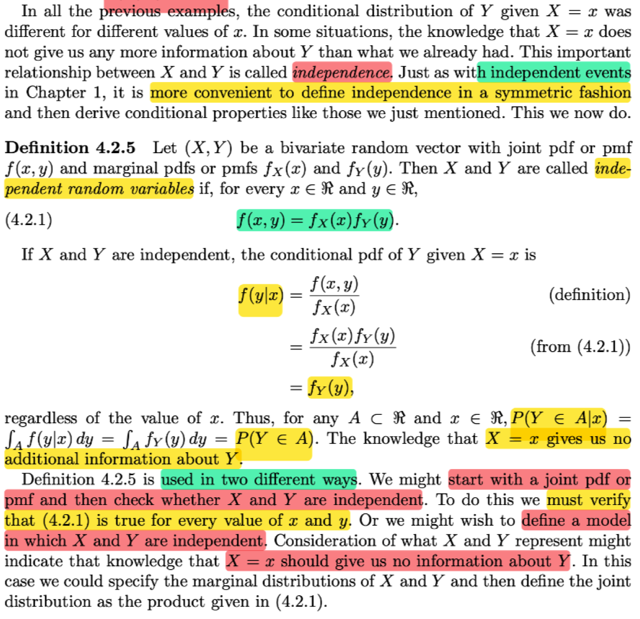</kbd></p>

> [!NOTE]
> Tiếp theo là định nghĩa về independent random variable: Hai random
> variable được gọi là independent khi joint pmf `/` pdf của nó bằng tích các
> marginal pmf `/` pdf: fX,Y(x, y) `=` fX(x)fY(y)
>
> ```text
> Khi đó fY|X(y|x) = fX,Y(x,y) / fX(x) = fX(x)fY(y)/fX(x) = fY(y)
> ```
>
> Đại khái là từ đó ta có hai áp dụng:
>
> MỘt là bắt đầu dùng để chứng minh tính độc lập: Ta sẽ bắt đầu với joint
> `pmf/pdf`  và chứng minh nó là tích của marginal `pmf/pdf` với mọi giá trị
> của X, Y.
>
> Hai là ta có marginal `pdf/pmf` và nhờ việc nhận định rằng rv độc lập thì ta
> có thể tính ra joint pmf mà ko cần xây dựng công thức `/` biết công thức
> của joint `pmf/pdf`

<br>

<a id="node-242"></a>

<p align="center"><kbd>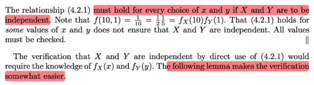</kbd></p>

<p align="center"><kbd></kbd></p>

<p align="center"><kbd>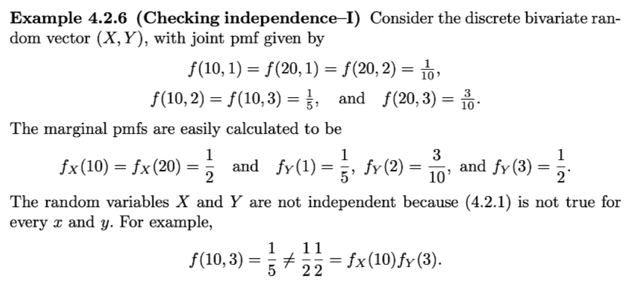</kbd></p>

> [!NOTE]
> Một ví dụ đại khái là cho giá trị của joint pmf tại các (cặp) possible values của
> X, Y (cũng là các possible value của random variable vector (X, Y)). Thì từ
> đó ta tính marginal pmf của X, Y. Và cho thấy rằng joint pmf không bằng tích
> marginal pmf với mọi giá trị x, y. Nên X, Y ko đọc lập

<br>

<a id="node-243"></a>

<p align="center"><kbd>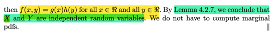</kbd></p>

<p align="center"><kbd></kbd></p>

<p align="center"><kbd>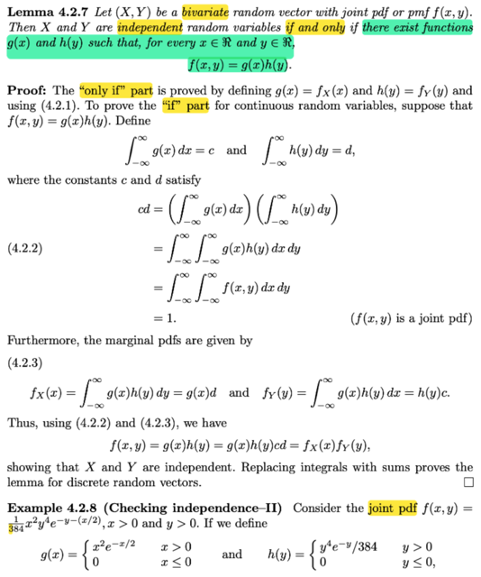</kbd></p>

> [!NOTE]
> Rồi, đại khái là nếu như ta muốn dùng định nghĩa nói rằng nếu hai 
> random variable độc lập thì joint `pmf/pdf` của chúng bằng tích marginal
> `pmf/pdf` của chúng) để chứng minh tính độc lập của chúng
> , thì ta sẽ phải biết về `pmf/pdf` của random variable (vì như vừa nói
> định nghĩa trên cho ta 2 cách ứng dụng, để chứng minh tính độc lập:
>
> một là, ta có marginal `pdf/pmf,` ta sẽ xây dựng joint `pmf/pdf` và cho thấy
> nó bằng tích của marginal `pdf/pmf` với mọi possible value. Rõ ràng 
> cách này như đã nói trên, ta phải biết marginal `pdf/pmf` của chúng trước.
>
> hai là, ta có joint pmf, ta sẽ chứng minh nó là tích của marginal `pdf/pmf.`
>
> Nói chung cả hai cách đều phải biết marginal pmf cụ thể là gì.
>
> Thế thì ở đây, bổ đề này sẽ cho phép ta chứng minh tính độc lập của
> hai random variable MÀ KO CẦN BIẾT marginal `pdf/pmf` của chúng.
>
>
> Đại khái bổ đề này nói là:
>
> tồn tại hàm g(x) và h(y) sao cho với mọi x, y thuộc R
> thì f(x,y) `=` g(x)h(y). ⇔ Hai biến độc lập
>
> Có nghĩa là với bổ đề này, ta hoàn toàn ko cần biết đến marginal `pmf/pdf`
>
> Để chứng minh thì như sau, chứng minh chiều ⇨ (điều kiện cần, if part)
>
> Ko có gì khó hiểu cả:
>
> Chứng minh chiều đi, tức là ta đã g(x), h(y) sao cho với mọi x, y ta đều có
> g(x)h(y) `=` f(x, y) thì suy ra fX(x)gY(y) `=` f(x,y) từ đó suy ra X, Y độc lập. 
>
> Thế thì chứng minh như sau:
>
> ```text
> Ta sẽ đặt tích phân này ∫-inf:inf g(x)dx = c, là constant và ∫-inf:inf h(y)dy = d
> ```
>
> (sau khi thảo luận với GPT thì nó nói trong tình huống này ta phải assume
> implicitly rằng các function g(x), h(y) có tính chất khiến các tích phân này
> là constant)
>
> ```text
> Thế thì khi đó ta có thể có cd = ∫-inf:inf g(x)dx ∫-inf:inf h(y)dy
> ```
>
> ```text
> = ∫-inf:inf ∫-inf:inf g(x)h(y)dxdy | cơ bản là vì g(x) ko liên quan đến y nên
> ```
> ta được phép đưa `∫-inf:infg(x)dx` vào trong tích phân của y
>
>
> Lúc này, dùng g(x)h(y) `=` f(x,y)
>
> ```text
> = ∫-inf:inf∫-inf:inf f(x,y)dxdy
> ```
>
> Và vì (ban đầu ta đã nói `/` đã có) f(x,y) LÀ MỘT JOINT PDF, nên dĩ nhiên
> tích phân này phải bằng 1 do tính valid của một pdf
>
> Vậy cd `=` 1.
>
> Rồi, bây giờ tính maginal pdf của X, Y:
>
> ```text
> fX(x) = ∫-inf:inf f(x,y)dy | đây là điều ta đã có / có quyền sử dụng do những
> ```
> bài trước đã chứng minh rằng khi marginalized joint pdf trên mọi giá trị của
> một biến thì ta sẽ có marginal pdf của biến kia
>
> ```text
> = ∫-inf:inf g(x)h(y)dy | again, đây là dùng điều kiện mà ta có f(x,y) = g(x)h(y)
> ```
>
> `=` g(x) `∫-inf:inf` h(y)dy
>
> `=` g(x) d
>
> ```text
> Tương tự fY(y) = ∫-inf:inf g(x)h(y)dx = h(y) ∫-inf:inf g(x)dx = h(y) c
> ```
>
> ```text
> ⇨ fX(x)fY(y) = g(x) d h(y) c = g(x)h(y) cd = f(x,y) . 1 = f(x,y)
> ```
>
> Vậy điều này suy ra X, Y độc lập theo định nghĩa bữa trước.
>
> Còn chiều ngược lại (điều kiện đủ) khi ta cần chứng minh nếu X, Y độc
> lập thì tồn tai g(x) h(y) sao cho thõa g(x)h(y) `=` f(x,y) với mọi x, y thì đơn
> giản là bằng cách chọn g(x), h(y) là marginal pdf của X, và Y, thì vì X, Y
> độc lập nên dĩ nhiên theo định nghĩa ta có fX(x)fY(y) `=` fX,Y(x,y) với mọi
> x, y. Vậy suy ra ta đã tìm được g(x), h(y) rồi.
>
> `====`
>
> Với discrete rv thì thay `∫` bằng `Σ` là xong
>
> Một ví dụ ngắn cho thấy nhờ bổ đề này mà dù ko cần biết marginal pdf
> của X, Y mà chỉ cần chỉ ra hàm g(x) và h(y) thỏa g(x)h(y) `=` f(x,y) với mọi
> x, y là đủ để kết luận X, Y độc lập

<br>

<a id="node-244"></a>

<p align="center"><kbd>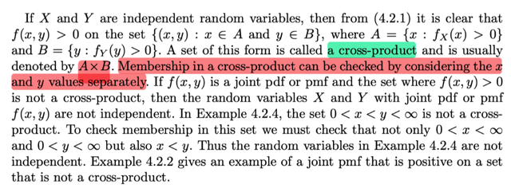</kbd></p>

> [!NOTE]
> Rồi, thì đại khái là phần này ý nói rằng, ta có một hệ quả của định nghĩa
> về biến ngẫu nhiên độc lập, lập luận như sau:
>
> Ta biết rằng nếu X, Y độc lập, thì fX,Y(x,y) `=` fX(x)fY(y).
>
> Vậy fX,Y(x,y) > 0 ⇔ fX(x)fY(y) > 0
>
> ⇔ fX(x) > 0 và fY(y) > 0  | ta có kết luận này vì pdf phải ko âm 
>
> Vậy subset {(x,y): f(x,y) > 0} `=` {x: fX(x) > 0, fY(y) > 0}
>
> `=` {x: x ∈ {x: fX(x) > 0}, y ∈ {y: fY(y) > 0}}
>
> đặt chúng là A, và B
>
> `=` {x: x ∈ A, y ∈ B} 
>
> Và tập {x,y x ∈ A, y ∈ B} gọi là cross product, kí hiệu là A x B
>
> Điều này có nghĩa là, 
>
> NẾU X. Y ĐỘC LẬP THÌ TẬP {x,y: f(x,y) > 0} phải bằng với tập AxB
>
> nếu điều này ko xảy ra, thì chứng tỏ X, Y ko độc lập
>
> Vậy áp dụng hệ quả này vào các ví dụ trước:
>
> Ở ví dụ thứ 4.2.4 nơi mà ta có f(x,y) `=` `e^-y,` 0 < x < y < inf
>
> Thì mình thấy, sau khi đã có marginal pdf fX(x) `=` `e^-x,` 0 < x < inf
>
> ```text
> fY(y) = fY|X(y|x)fX(x) = e^-(y-x)e^-x = e^-y+x-x = e^-y
> ```
>
> thì {x,y: f(x,y) > 0} `=` {0 < x < y < inf}
>
> trong khi đó AxB (cross product) là:
>
> ```text
> A = {x: fX(x) > 0} = (0:inf), vì marginal pdf của X là fX(x) = e^-x sẽ mang
> ```
> giá trị dương khi x > 0 (chú ý, hàm `e^-x` thì xác định trên mọi x ∈ R,
> nhưng khi xét pdf thì ta sẽ chỉ quan tâm miền của x mà pdf dương,
> gọi là support set)
>
> ```text
> B = {y: fY(y) > 0} = (0:inf), tương tự, vì fY(y) = e^-y, mang giá trị dương
> ```
> khi y > 0
>
> Vậy có nghĩa là gì: CÓ NGHĨA LÀ ĐỂ XÁC ĐỊNH XEM x, y CÓ THUỘC
> AxB KHÔNG THÌ CHỈ CẦN XEM XÉT x có > 0, y có > 0 KHÔNG, NẾU CÓ
> TỨC LÀ x, y thuộc AxB.
>
> TRONG KHI ĐÓ, ĐỂ XÁC ĐỊNH XEM x, y CÓ THUỘC TẬP {(x,y): f(x, y) > 0}
> KHÔNG, THÌ YÊU CẦU LÀ 0 < x < y . DO ĐÓ TẬP NÀY KHÔNG PHẢI LÀ
> AxB, TỪ ĐÓ KẾT LUẬN X, Y KO ĐỘC LÂP

<br>

<a id="node-245"></a>

<p align="center"><kbd>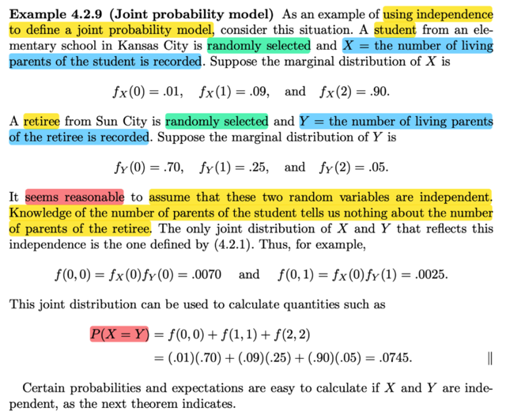</kbd></p>

> [!NOTE]
> Đại khái là ví dụ này minh họa cho ứng dụng thứ hai của cái định nghĩa
> về independent random variable.
>
> Như đã nói, ứng dụng thứ hai của nó, là giả sử ta có marginal `pdf/pmf`
> của X, Y thì nếu biết X, Y độc lập thì ta có thể dùng nó để tính joint pmf
>
> Cụ thể là ví dụ này X là số cha mẹ còn sống của một sinh viên chọn
> ngẫu nhiên ở Kansas city, còn Y là số cha mẹ còn sống của một `ông/bà`
> già được chọn ngẫu nhiên ở Kansas city.
>
> (Khi đã hiểu rõ X, Y bản chất chỉ là function, map giữa sample space 
> và real number thì ta ko có gì khó hiểu ở đây hết: s sẽ là một student
> được chọn ngẫu nhiên, X(s) sẽ cho ra số cha mẹ còn sống của anh ta
> `/chị` ta. Vậy nên với s khác nhau (người được chọn khác nhau) thì X(s)
> sẽ có các giá trị khác nhau. Nên với một người thì số cha mẹ còn sống 
> của anh ta là hằng số, nhưng bản chất của yếu tố "variable" chính là 
> nằm trong việc thực hiện random experiment: chọn ngẫu nhiên một người)
>
> Thế thì dĩ nhiên là trong tình huống này, chẳng có lí do gì để phải nghi
> ngờ có sự liên hệ nào giữa số cha mẹ còn sống của một sinh viên được
> chọn ngẫu nhiên với số cha mẹ còn sống của một người đã về hưu chọn
> ngẫu nhiên cả.
>
> Do đó ta có thể assume X, Y independent.
>
> Và nhờ việc đã có marginal pdf của X, Y tại các possible value. nên ta có
> thể tính joint pdf P(X `=` Y)
>
> ```text
> Tất nhiên để hiểu tại sao trong sách tính ra P(X=Y) = f(0,0) + f(1,1) + f(2,2) thì
> ```
> bản chất là như vầy:
>
> `(X=Y)` `=` {s ∈ S: X(s) `=` Y(s)} với s phải hiểu là việc chọn một
> cặp `student-retiree,` thì X(s) là số cha mẹ còn sống của student 
> còn Y(s) là số cha mẹ còn sống của retiree (chứ ko phải có hai experiment
> với hai sample space một cái cho X một cái cho Y nhé)
>
> ```text
> và set này {s ∈ S: X(s) = Y(s)} = ∪ {a} {s ∈ S: X(s) = a, Y(s) = a}
> ```
>
> `=` ∪ {a ∈ R} {s ∈ S: X(s) `=` a} ∩  {s ∈ S: Y(s) `=` a}
>
> `=` P(∪ {a ∈ R} {s ∈ S: X(s) `=` a, Y(s) `=` a})
>
> ```text
> = Σ{a ∈ R} P({s ∈ S: X(s) = a, Y(s) = a}) | theo axiom 2
> ```
>
> ```text
> = Σ{a ∈ R} P(X=a, Y=a)
> ```
>
> `=` `Σ{a` ∈ R} fX,Y(a,a)
>
> `=` `Σ{a` ∈ R} fX(a)fY(a)
>
> từ đó thế các giá trị fX, fY vô để có kết quả

<br>

<a id="node-246"></a>

<p align="center"><kbd>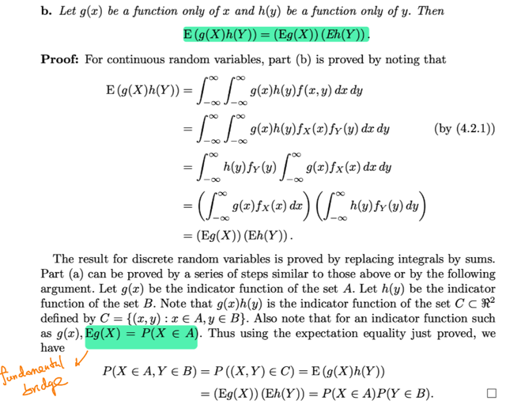</kbd></p>

<p align="center"><kbd></kbd></p>

<p align="center"><kbd>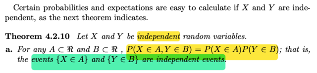</kbd></p>

> [!NOTE]
> đại khái là theorem nói rằng ta có X,Y độc lập thì
>
> a) P(X ∈ A, Y ∈ B) `=` P(X ∈ A)P(Y ∈ B) với mọi A, B ∈ R
>
> b) Cho g(x) là function chỉ theo x, h() là function chỉ theo y thì `E[g(X)h(Y)]` `=`
> Eg(X)Eh(X)
>
> Để chứng minh thì gs chứng minh phần b trước:
>
> Đại khái là vầy: Đầu tiên dùng công thức mà stat110 giáo sư Blizstein  gọi
> là 2D LOTUS
>
> Lập luận từ gốc sẽ là theo định nghĩa của expected value, mang ý nghĩa là
> weighted average của các possible value của random variable, với weight
> là xác suất tương ứng của possible value đó. Thể hiện qua công thức của
> ```text
> EX = Σx xP(X=x) với discrete r.v hay ∫-inf:inf xfX(x)dx với continuous r.v.
> ```
>
> Thế thì để tính Eg(X), LOTUS cho phép ta ko cần tìm `pmf/pdf` của `Y=g(X)`
> mà chỉ cầ thay x trong các công thức trên bởi g(x):
>
> ```text
> Eg(X) = Σx g(x)P(X=x)  or ∫-inf:inf g(x)fX(x)dx
> ```
>
> Tương tự như vậy, với random variable vector:
>
> ```text
> E(X,Y) = Σx Σy (x,y) P(X=x, Y=y) hay ∫-inf:inf (x,y) fX,Y(x,y)dxdy
> ```
>
> Thì 2D LOTUS cũng cho phép ta ko cần có joint `pdf/pmf` của g(X,Y)
>
> Ý là nếu g(X,Y) là vector → vector function, để output của nó cũng là một
> random variable vector ví dụ (U, V) `=` g(X, Y), thì ta ko cần phải tìm joint
> pmf `/` pdf của U, V, mà chỉ cần thay (x,y) bằng g(x,y):
>
> ```text
> Eg(X,Y) = Σx Σy g(x,y)P(X=x, Y=y)
> ```
>
> Hoặc nếu nó là vector → scalar function, thì cũng ko cần tìm pdf của Z `=`
> g(X,Y) mà chỉ dùng công thức trên
>
> Áp dụng vào đây, hiện ta cần Eg(X)h(Y), thì đây có thể coi là k(X,Y)
>
> `=` g(X)h(Y) là vector → scalar function. g(X)h(Y) là một random variable
>
> ```text
> Eg(X)h(Y) = ∫-inf:inf∫-inf:inf g(x)h(y)f(x,y)dxdy
> ```
>
> ```text
> = ∫-inf:inf∫-inf:inf g(x)h(y)fX(x)fY(y)dxdy
> ```
>
> ```text
> = ∫-inf:inf g(x)fX(x)dx ∫-inf:infh(y)fY(y)dy  |
> ```
>
> Đây chính là Eg(X) . Eh(Y) Chứng minh xong part b
>
> `====`
>
> Để chứng minh part a:
>
> Cách 1:
>
> P(X ∈ A, Y ∈ B) `=` `∫A∫BfX,Y(x,y)dxdy`
>
> ```text
> = ∫A∫B fX(x)fY(y)dxdy | dùng tính độc lập của X, Y: fX,Y(x,y) = fX(x)fY(y)
> ```
>
> `=` `∫AfX(x)dx` `∫BfY(y)dy`
>
> | bước này đơn giản là tách ra: cái gì ko liên quan đến y thì đưa ra ngoài
> tích phân theo y
>
> `=` P(X ∈ A) P(Y ∈ B) Chứng minh xong
>
> Cách 2:
>
> Đại khái là dùng indicator function g(x) của set A: có nghĩa là x ∈ A thì g(x)
> `=` 1, ngược lại x `=` 0.
>
> Thế thì ta thấy thế này, khi xem xét indicator function này, với một giá trị cụ
> thể x, ví dụ `=` 5 của X thì g(5) là giá trị cụ thể, bằng 1 nếu x ∈ A, 0 nếu
> ngược lại. Và dĩ nhiên 5 thì thuộc A hoặc ko, nên g(5) `=` 1 hoặc 0, nhưng
> giá trị của nó là fix.
>
> Nhưng với các giá trị khả dĩ khác nhau của X, thì g(X) sẽ mang các
> possible  value khác nhau, cho nên NÓ LÀM MỘT RANDOM VARIABLE,
> và dễ thấy nó  có hai possible value là 0, 1. Nên NÓ LÀ MỘT BERNOULLI
> RANDOM VARIABLE
>
> Hoặc đơn giản hơn ta chỉ việc lập luận rằng, apply một function lên một
> random  variable ta có một random variable mới, mà ở đây function này là
> indicator function.
>
> Thế thì, như vậy g(X) là indicator random variable GẮN VÓI EVENT `/` SET
> A, ĐỂ RỒI KHI X ∈ A, TỨC EVENT A XẢY RA THÌ g(X) `=` 1, CÒN EVENT
> A KHÔNG XẢY RA THÌ g(X) `=` 0.
>
> Theo 1D LOTUS ta có Eg(X) `=` `Σ` {mọi possible value của g(X)} g(x) `P(X=x)`
>
> ```text
> = Σ {mọi possible value x không thuộc A} g(x) P(X=x) + Σ {mọi possible
> ```
> value của x ∈ A} `g(x)P(X=x)`
>
> ```text
> = Σ {mọi possible value x không thuộc A} 0 P(X=x) + Σ {mọi possible value
> ```
> của x ∈ A} 1 `P(X=x)`
>
> `=` `Σ` {mọi possible value của x ∈ A} 1 `P(X=x)`
>
> Và cái này đương nhiên là P(X ∈ A)
>
> Vậy Eg(X) `=` P(X ∈ A) và ta nhớ nó chính là FUNDAMENTAL BRIDGE đã
> học trong Stat110
>
> ```text
> Nói rằng : Với indicator random variable gắn với event A, I_A thì E(I_A) =
> ```
> P(A)
>
> Vậy quay lại đây: tương tự ta define h(y) là indicator function của event Y
> ∈ B
>
> Thế thì Đăt set C `=` {(x, y): x ∈ A, y ∈ B}
>
> Dễ thấy k(x,y) `=` g(x)h(y) là indicator function của set C
>
> P(X ∈ A, Y ∈ B) `=` P({(x, y): x ∈ A, y ∈ B}) `=` P((X,Y) ∈ C)
>
> áp dụng fundamental bridge với k(X,Y) `=` g(X)h(Y) là indicator r.v của set C
>
> P((X,Y) ∈ C) `=` `E[g(X)h(Y)]`
>
> tới đây dùng lại kết qủa mà ta dùng để chứng minh part 1, nó sẽ `=` Eg(X) .
> Eh(Y)
>
> `=` và g(X) như đã nói là indicator random variable của event X ∈ A ⇨ Eg(X)
> `=` P(X ∈ A)
>
> tương tự Eh(Y) `=` P(Y ∈ B)
>
> Kết quả chứng minh xong

<br>

<a id="node-247"></a>

<p align="center"><kbd>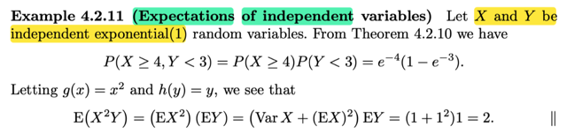</kbd></p>

> [!NOTE]
> Ví dụ 4.2.11 đơn giản là minh họa cho theorem vừa rồi, với việcv ta có hai
> random variable độc lập X, Y, giúp để tính P(X ≥ 4, Y < 3) chỉ việc tính
> P(X ≥ 4) P(Y < 3)
>
> Còn `E(X^2Y)?`
>
> Thì áp dụng part b của theorem: `E[g(X)h(Y)]` `=` Eg(X) Eh(Y)
>
> ⇨ `E(X^2Y)` `=` EX^2 EY
>
> ```text
> EX^2 thì dùng công thức VarX = EX^2 - (EX)^2 ⇨ EX^2 = VarX + (EX)^2
> ```
> thế EX, VarX, EY vào thôi vì cho X, Y là Expo(1) ta nhớ với expo(λ) thì
> expected value và variance đều là λ ⇨ kết quả là (1 `+` 1)1 `=` 2
>
> Chứng minh lại cái trên cho vui:
>
> ```text
> EX = ∫-inf:inf x fX(x)dx = ∫0:inf x λ e^-λx dx = ∫0:inf x λ e^-λx dx
> ```
>
> ```text
> Dùng integration by part: Đặt dv = λ e^-λx dx ⇨ v = -e^-λx, u = x ⇨ du = dx
> ```
>
> ```text
> ⇨ tích phân (=∫udv) = uv - ∫vdu = -xe^(-λx) |0:inf - ∫[-e^-λx]dx
> ```
>
> ```text
> = -xe^(-λx) |0:inf + ∫0:inf e^(-λx)dx
> ```
>
> ```text
> = -xe^(-λx) |0:inf + (-1/λ)e^(-λx) |0:inf
> ```
>
> ```text
> x → inf ⇨ e^(-λx) ⇨ e^-inf = 0 ⇨ -xe^(-λx) → 0
> ```
>
> x → 0 ⇨ `e^(-λx)` ⇨ `-xe^(-λx)` → 0
>
> ⇨ term 1 `=` 0 
>
> x → inf ⇨ `e^(-λx)` → `e^-inf` `=` 0 
>
> x → 0 ⇨ `e^(-λx)` → 1
>
> ```text
> ⇨ term 2 = 0 - (-1/λ) = 1/λ
> ```
>
> Kết quả EX `=` `1/λ` 
>
> `Var(X)` `=` cũng làm tương tự

<br>

<a id="node-248"></a>

<p align="center"><kbd>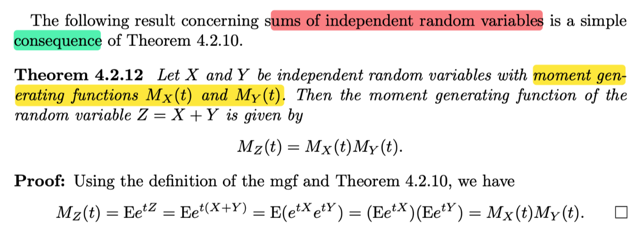</kbd></p>

> [!NOTE]
> Qua theorem liên quan đến tổng của independent random variable:
>
> Cho X, Y độc lập với mgf MX(t) MY(t) thì với Z `=` X `+` Y thì MX(t) 
> `=` MX(t) MY(t)
>
> Chứng minh như sau:
>
> Theo định nghĩa mgf: MX(t) `=` `E[e^tX]`
>
> ```text
> ⇨ MX(t) = E[e^tZ] = E[e^t(X+Y)] = E(e^tX e^tY) | đơn giản là tính chất hàm mũ
> ```
>
> ```text
> Xét E(e^tX e^tY), thì nó chính là E[g(X)h(Y)] với g(X) = e^tX, h(Y) = e^tY
> ```
>
> Áp dụng part b của theorem vừa rồi ta có:
>
> `...=` Ee^tX . Ee^tY  và đây chính là MX(t) . MY(t)
>
> Nhận xét là nhờ cái theorem đó mà chứng minh cái này rất khỏe

<br>

<a id="node-249"></a>

<p align="center"><kbd>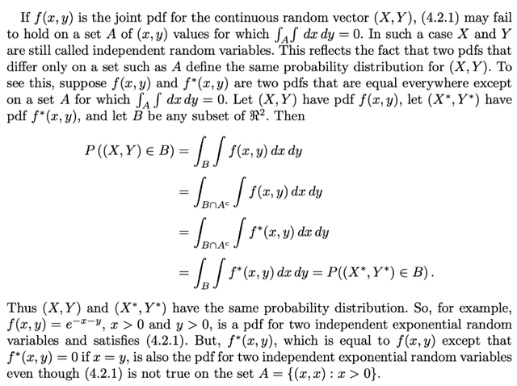</kbd></p>

<p align="center"><kbd></kbd></p>

<p align="center"><kbd>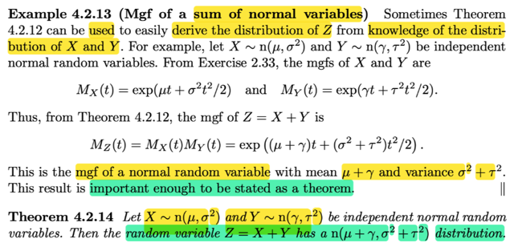</kbd></p>

🔗 **Related:** [5.3 SAMPLING FROM THE NORMAL DISTRIBUTION](53_sampling_from_the_normal_distribution.md#node-361)

> [!NOTE]
> ```text
> Ứng dụng theorem vừa rồi vào X ~ normal(μ1, σ1^2)  và Y~ normal(μ2, σ2^2)
> ```
>
> Ta có Z `=` X `+` Y. thì mgf MZ(t) `=` MX(t)MY(t)
>
> ```text
> Với X ~ normal(μ, σ^2) thì MX(t) = exp(μt + σ^2t^2/2).
> ```
>
> (Chứng minh như sau: 
>
> Nếu ko nhớ công thức pdf của `normal(μ,` `σ^2)` thì nhớ pdf của Z ~ normal(0,1) 
>
> ```text
> fZ(x) = (1/√2π) e^-z^2/2
> ```
>
> ...

<br>

