# 4.3 Bivariate Transformation

📊 **Progress:** `23` Notes | `34` Screenshots

---

<kbd>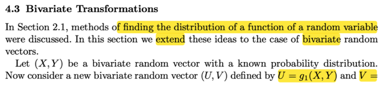</kbd>

<kbd></kbd>

<kbd>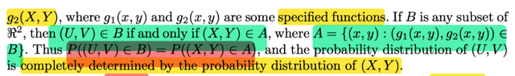</kbd>

> [!NOTE]
> Ok, phần này sẽ mở rộng ý tưởng khi mà ta có transformation theorem giúp
> tìm distribution của random variable Y = g(X) từ distribution của X sang cho
> random variable vector, cụ thể là bivariate random variable (X, Y)
>
> Thế thì, ta xét (U, V) với U = g1(X, Y), V = g2(X, Y), Dĩ nhiên U, và V là kết
> quả của việc apply function g1, g2 lên hai random variable X, Y nên nó là
> random variable, và (U, V) là random variable vector.
>
> Rồi, vậy thì người ta xét set B là tập con của R^2 và set A định nghĩa như sau:
>
> A = {(x,y) ∈ R^2: (g1(x,y), g2(x,y)) ∈ B}
>
> Khi đó ta sẽ có **P((U,V)**∈**B) = P((X,Y)**∈**A)**, là sao?
>
> ====
>
> Đầu tiên, có lẽ có chút cần nói cho thông não: Giả sử ta có event A = {x ∈ R: x
> < 0} với x là possible value của X. Vậy thì event (X ∈ A) có phải cũng là một
> với event A hay không?
>
> A, như định nghĩa, là {x ∈ R: x < 0}, với x là possible value của X, ta có thể "
> translate" event này, set này sang original sample space, chính là **{s**∈**Ω:
> X(s) < 0} (1)**
>
> Vậy thì bây giờ xét event X ∈ A, về bản chất nó chính là event sau đây
>
> {s ∈ Ω: X(s) ∈ A}, mà X(s) ∈ A ⇔ X(s) thỏa điều kiện X(s) ∈ R và X(s) < 0
>
> ⇨  {s ∈ Ω: X(s) ∈ A} cũng là {s ∈ Ω: X(s) ∈ R, X(s) < 0} X(s) ∈ R là điều đương
> nhiên vì định nghĩa của X là function mapping từ s ∈ Ω và x ∈ R, nên ta có thể
> ghi là:
>
> **{s**∈**Ω: X(s) < 0}**  **(2)
>
> Từ (1) và (2) giúp ta thấy rõ event X**∈**A chính là event A, để nói P(X**∈**A) cũng = P(A) mà ko cần phải lăn tăn gì nữa**
>
> ====
>
> (U,V) ∈ B có bản chất là {s ∈ Ω: (U(s), V(s)) ∈ B}
>
> = {s ∈ Ω: (g1(X,Y)(s), g2(X,Y)(s)) ∈ B} | vì U = g1(X, Y), V = g2(X,Y)
>
> Mà g1(X,Y)(s) cũng chính là g1(X(s), Y(s)) bởi bản chất X, Y là function nên
> g1(X,Y) cũng là function, nên việc apply function g(X,Y) lên s thì cũng y như
> apply function g lên kết quả sau khi apply function X, Y lên  s (ở đây có thể có
> tên gọi, hay định lý nào đó cho tính chất này: Chính xác  thì đơn giản g1(X,Y)
> là HÀM HỢP - COMPOSITION OF FUNCTION)
>
> Như vậy {s ∈ Ω: (g1(X,Y)(s), g2(X,Y)(s)) ∈ B}
>
> = {s ∈ Ω: (g1(X(s),Y(s)), g2(X(s),Y(s))) ∈ B}
>
> Và event trên có thể được thể hiện bởi sample space của X,Y:
>
> = {s ∈ Ω: X(s) = x, Y(s) = y, g1(x,y), g2(x,y) ∈ B}
>
> và đây chính là định nghĩa của tập A, là **{(x,y)**∈**R^2: (g1(x,y), g2(x,y))**∈**B}**
>
> Từ đó ta thấy event (U,V) ∈ B CŨNG CHÍNH LÀ event A,
>
> mà event A, theo cách lí luận tương tự khi ta lí luận ra rằng X ∈ A cũng chính
> là A thì nay A cũng chính là (X,Y) ∈ A
>
> Do đó (U,V) ∈ B cũng chính là (X,Y) ∈ A
>
> Do vậy **P((U,V)**∈**B) = P((X,Y)**∈**A,**

> [!NOTE]
> Chỗ này có lẽ phải ghi ra một điểm quan trọng:
>
> Tập các possible value của rv X và support set của X:
>
> Khi tìm hiểu thì thông thường người ta cho rằng nó là một. Nhưng cũng có khi người ta cho
> rằng possible value rộng hơn support set.
>
> Dù là ở trường hợp thì support set theo định nghĩa là tập mà trong đó pmf/pdf DƯƠNG.
>
> Nên nếu coi như possible value set là support set thì ta sẽ có thể nói rằng mọi possible
> value đều có xác suất dương. Nhưng nếu không, thì chưa chắc dương vậy thôi.
>
> Một điểm nữa mà có thể trước đây mình ít để ý, ví dụ như khi nói về X ~ Pois có pmf fX(x)
> = λ^x e^-λ / x! với x = 0,1,2,...thì x = 0,1,2...chính là support set của X, hoặc khi nói Y ~
> Expo(λ) có pdf fY(y) = λe^(-λy) với y > 0 thì {y > 0} chính là đang nói về support set của Y
> chứ ko phải domain của của hàm  pdf vì rõ ràng domain của fY(y) là (-inf:inf) chứ không
> phải chỉ là y > 0,  nhưng dễ thấy với hàm mũ thì nó chỉ dương khi y > 0 thôi
>
> Vậy thì trong sách ở đây nói rằng (X,Y) là vector biến ngẫu nhiên rời rạc, nên tập các giá trị
> (x,y) có pmf fX,Y(x,y) dương chỉ là một tập đếm được (countable). Thì đúng rồi, ko care
> trong sách này người ta có đang theo convention là tập các possible value của (X,Y) chính
> là support set hay không, thì dù theo hay không theo thì vì bản chất chúng là các giá trị rời
> rạc nên support set cũng phải là tập các giá trị rời rạc và như vậy chúng sẽ có thể đếm
> được, và như định nghĩa thì tại đó joint pmf dương. Ý là chỗ này chả có gì khó hiểu cả, ko
> cần phải lăn tăn câu hỏi là tập support set có phải là tập các possible value hay không
>
> Thế thì vì tập A, (là tập support set của (X,Y)) chỉ chứa bộ các điểm đếm được  nên map
> chúng nó qua B thì tập B dĩ nhiên cũng phải đếm được.
>
> Và để ý chi tiết họ gọi B là tập các possible value của (U,V) cho thấy ở sách này người ta
> đang đồng nhất SUPPORT SET VÀ POSSIBLE VALUE SET hòan toàn phù hợp với quy
> ước chung

 

<kbd>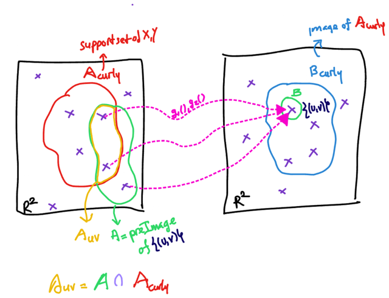</kbd>

<kbd></kbd>

<kbd>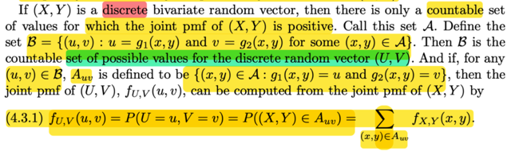</kbd>

> [!NOTE]
> đại khái là đoạn mở đầu vừa rồi, chú ý là, định nghĩa của tập A, chỉ là tập chứa (x,y) sao
> cho thông qua g1, g2,  nó được map với B. Để từ đó P((X, Y) ∈ A) = P((U,V) ∈ B), chỉ vậy
> thôi. chứ A, B chưa biết là cái gì cả
>
> Thế thì, bây giờ ta mới quay lại câu chuyện là ta đang đi tìm joint pdf/pmf của U, V với U
> = g1(X,Y), V = g2(X,Y) khi biết distribution của X,Y  Và ta sẽ xét discrete case trước, tức
> X, Y là biến rời rạc. Mà vì X, Y rời rạc thì đương nhiên random variable vector (X,Y) cũng
> có các possible value (x, y) rời rạc. Và cũng vì giá trị của (X,Y) rời rạc thì khiến giá trị khả
> dĩ của (g1(X,Y), g2(X,Y)) cũng rời rạc nốt ⇨ (U,V) cũng là biến rời rạc.Chuyện này ko có
> gì khó hiểu
>
> Thế thì, lập luận ở đây là, vì possible value của (X,Y) rời rạc nên dĩ nhiên cái tập chứa
> các possible value (x,y) sao cho fX,Y(x,y) dương, SẼ CŨNG CHỈ CHỨA CÁC PHẦN TỬ
> RỜI RẠC. Và theo định nghĩa của từ COUNTABLE đó là nó FINITE hoặc INFINITE
> NHƯNG DISCRETE
>
> Do đó mới nói là tái tập mà chứa các (x,y) sao cho joint pmf dương là COUNTABLE.
>
> Thế thì ta sẽ đặt nó là A_curly, và theo định nghĩa nó chính là support set của (X,Y), vì nó
> đã chứa mọi (x,y) khiến fX,Y(x,y) > 0
>
> Rồi, tới đây nhắc lại mục đích một tí, với rv vector discrete (U,V) thì distribution của nó
> thể hiện qua pmf, và mình đang đi tìm joint distribution của (U,V) nên lẽ dĩ nhiên mình sẽ
> tìm cách xây dựng joint pmf, tức là fU,V(u,v) mà bản thân nó có ý nghĩa là P(U=u,V=v)
>
> Thế thì lúc mở đầu họ mào đầu cho ta cái vụ P((U,V) ∈ B) = P((X,Y) ∈ A) chính là để ta
> áp dụng vào việc xây dựng P(U=u,V=v)
>
> Thế thì, nếu B là R^2 thì A = {(x,y) ∈ R^2: (g1(x,y), g2(x,y)) ∈ R^2}
>
> ⇨ P((U,V) ∈ B) = P((X,Y) ∈ A) và với A là tập con của R^2 thì ko có gì đảm bảo fX,Y
> dương trên cả, vì nếu dựa vào fXY để tìm fUV mà fXY = 0 thì có ích gì chứ. Có nghĩa là
> mình phải dựa trên fXY, với fXY dương kìa
>
> Do đó mình hiểu của việc tại sao phải chọn B_curly, cho vai trò của B, với B_curly = {(u,
> v): u = g1(x,y), v = g2(x,y) với some (x,y) ∈ A_curly}
>
> Vì khi đó, ta có thể có fU,V(u,v) trên B_curly (tức (u,v) ∈ B_curly) dương
>
> Thế thì xét một (u,v) ∈ B_curly, thì mình mới định nghĩa ra {(x,y) ∈ A_curly: g1(x,y) = u,}
> g2(x,y) = v} và ta gọi nó là Auv và mục đích là chứng minh fU,V tại (u,v) có thể được tính
> bởi fXY tại Auv
>
> Vậy chứng minh thế nào: Đơn giản là áp dụng điều ta đã có, là nếu A là tiền ảnh của B
> thì P((U,V) ∈ B) = P((X,Y) ∈ A).
>
> Ở đây vai trò của B chính là **point set {(u,v)}**  với (u,v) là một điểm trong B_curly (thay
> vì trong R^2, giúp đảm bảo rằng fU,V(u,v) dương).
>
> Vậy khi B là point set trên thì cái gì đóng vai A, theo định nghĩa của tiền ảnh thì A =  {(x,y)
> ∈ R^2: g1(x,y) = u, g2(x, y) = v}
>
> Nhưng dễ thấy tập A này là union của:
>
> {(x,y) ∈ A_curly: g1(x,y) = u, g2(x, y) = v} ∪ {(x,y) ∈ R^2\\A_curly: g1(x,y) = u, g2(x, y) = v}
>
> và chính là Auv ∪ {(x,y) ∈ R^2\\A_curly: g1(x,y) = u, g2(x, y) = v}
>
> Gọi {(x,y) ∈ R^2\\A_curly: g1(x,y) = u, g2(x, y) = v} là Auv_plus
>
> Nên áp dụng vào, ta có P((U,V) ∈ {(u,v)}) = P((X,Y) ∈ A)
>
> = P(Auv ∪ Auv_plus)
>
> = P(Auv) + P(Auv_plus)
>
> = P((X,Y) ∈ Auv) + P((X,Y) ∈ Auv_plus)
>
> Và vì Auv_plus ∩ A_curly = ∅ do định nghĩa của nó nên (X,Y) ∈ Auv_plus sẽ nằm ngoài
> A_curly, mà A_curly là support set ⇨ P((X,Y) ∈ Auv_plus) = 0
>
> Vậy P((U,V) ∈ {(u,v), (u,v) là điểm trong B_curly} = P((X,Y) ∈ Auv)
>
> ⇔ P(U=u,V=v) = P((X,Y) ∈ Auv)
>
> Vài nhận xét
>
> Auv cũng là tập con của A_curly (vì ngay định nghĩa đã nói Auv: = {(x,y) ∈ A_curly....} rồi
>
> Và Auv cũng là tập con của A (tức preimage của B={(u,v), với (u,v) là point trong B_curly},
> bởi A define là {(x,y) ∈ R^2: g1(x,y) = u, g2(x,y) = v}
>
> (nhưng sẽ là sai nếu nói A_curly là tập con của A nhé, vì nó ko liên quan gì cả)
>
> TÓM LẠI TA CÓ: P(U=u, V=v) = P({(x,y) ∈ Auv}) và đây cũng là P((X,Y) ∈ Auv)
>
> ⇔ **P(U=u, V=v) = Σ{(x,y)**∈**Auv} P(X=x, Y=y) = Σ{(x,y)**∈**Auv} fX,Y(x,y)**

> [!NOTE]
> RẤT CẦN CHÚ Ý: 
>
> A = {(x,y) ∈ R^2: g1(x,y) = u, g2(x,y) = v}
>
> A_CURLY = {(x,y): fX,Y(x,y) > 0}
>
> Auv = {(x,y) ∈ A_curly: g1(x,y) = u, g2(x,y) = v}
>
> Nên Auv ⊂ A_curly, Auv ⊂ A
>
> ⇨ Auv = A ∩ A_curly

> [!NOTE]
> discrete case, ta chọn B là point set {(u,v)} với (u,v) ∈ B_curly
> từ đó A - tiền ảnh của tập này, sẽ là tập các điểm rời rạc gồm
> hai phần: 
>
> 1) những điểm (map với (u,v)) trong A_curly, gọi là Auv
>
> 2) những điểm (map với (u,v)) ngoài A_curly
>
> Từ đó chứng minh P(U=u,V=v) = P((X,Y) ∈ Auv)

 

<kbd>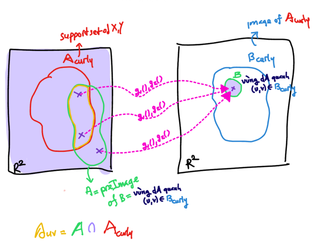</kbd>

<kbd></kbd>

<kbd>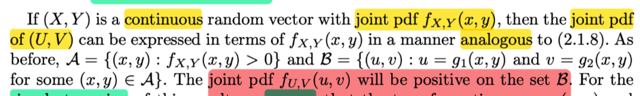</kbd>

> [!NOTE]
> Rồi thế thì ở đây (U,V), (X,Y) là các discrete vector. Nên các member  A_curly
> và B_curly sẽ chứa các điểm rời rạc, dù có thể cũng có vô hạn số lượng,
> nhưng vẫn là countable
>
> Còn nếu xét (U,V), (X,Y) **continuous** thì hai tập này sẽ chứa v**ô hạn điểm liên
> tục** và ta sẽ **ko chọn B là point set trong B_curly** nữa vì lúc này pmf = 0
>
> Tuy nhiên A_curly và B_curly vẫn vậy, là set mà fX,Y dương trên đó (A_curly)
> và B_curly là {(u,v) ∈ R^2: u = g1(x,y), v = g2(x,y), (x,y) ∈ A_curly}. Nói cách
> khác B_curly là ảnh (image) của A_curly
>
> Và câu hỏi đặt ra đầu tiên là tại sao joint pdf của U,V lại dương trên B_curly?
>
> Ta xét một vùng có diện tích rất nhỏ có diện tích dA quanh điểm (u,v) trong
> B_curly, và cho nó đóng vai trò của B.
>
> Thì A, tiền ảnh của nó, sẽ là {(x,y) ∈ R^2: (g1(x,y), g2(x,y)) ∈ B}, nhớ rằng B
> đang là vùng rất nhỏ xung quanh điểm (u,v) thuộc B_curly
>
> Theo đó ta có P((U,V) ∈ B) = P((X,Y) ∈ A)
>
> Vậy thì lúc này ta có thể chứng minh A sẽ có giao với A_curly: Bởi vì xét
> những điểm thuộc A_curly mà g1(x,y), g2(x,y) ∈ B (B, hiện là vùng rất nhỏ
> quanh (u,v) thuộc B_curly ⇨ B ⊂ B_curly) ⇨ những điểm này cũng thuộc A.
> Nên A_curly ∩ A khác ∅.
>
> Do đó khi nói về  ((X,Y) ∈ A) ta có thể tách nó thành:
>
> ((X,Y) ∈ (A_curly ∩ A) ∪ (X,Y) ∈ A_curly_complement ∩ A)
>
> Để rồi P((X,Y) ∈ A)
>
> = P((X,Y) ∈ (A_curly ∩ A) + P((X,Y) ∈ A_curly_complement ∩ A)
>
> Và nhờ P((X,Y) ∈ (A_curly ∩ A) > 0 nên ta suy ra P((X,Y) ∈ A) > 0
>
> ⇨ P((U,V) ∈ B) ⇨ ∫B fU,V(u,v)dudv > 0 ⇨ fU,V(u,v) > 0
>
> Mà điều này đúng với mọi điểm (u,v) thuộc B_curly, cũng như đúng với mọi
> vùng có diện tích vô cùng nhỏ dA bao quanh (u,v) nên ta lập luận tương tự để
> suy ra fU,V(u,v) LUÔN DƯƠNG TRÊN B_CURLY

> [!NOTE]
> LƯU Ý ĐÂY LÀ Ở PAGE 158, MÌNH VIẾT LUÔN Ở ĐÂY ĐỂ LIỀN MẠCH
> SUY NGHĨ TỪ DISCRETE CASE SANG CONTINUOUS CASE

> [!NOTE]
> Continues: Ta ko xét B là point set {(u,v)} thuộc B_curly nữa. Mà xét 
> B là vùng dA quanh (u,v) thuộc B.
>
> Thì tiền ảnh của B lúc này, tức là A lúc này ko phải tập các điển rời rạc
> nhưng cũng sẽ gồm 2 phần:
>
> - phần nằm trong A_curly, (thích thì gọi là Auv cũng được nhưng phải
> hiểu nó map với các điểm trong dA quanh (u,v) chứ ko phải là map
> với point (u,v))
>
> - phần nằm ngoài A_curly
>
> Từ đó ta chứng minh fU,V(u,v) dương trên B_curly

 

<kbd>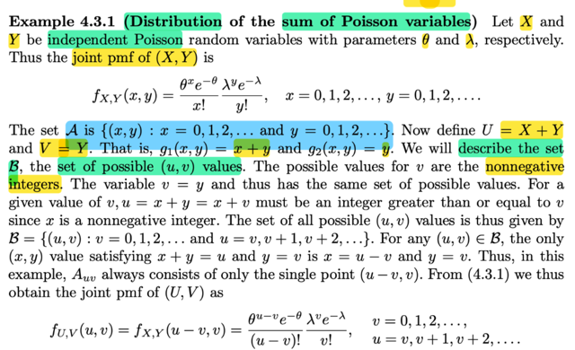</kbd>

> [!NOTE]
> Qua ví dụ này, ta có X, Y là rv **độc lập** ~ **Pois(λ)** và **Pois(θ)** Thế thì đầu tiên
> tại sao fX,Y(x,y) lại có công thức như vậy và \/A\/ lại như vậy?
>
> Là vì X, Y độc lập nên ta **có quyền** **construct joint pmf = tích marginal pmf**⇨ **fX,Y(x,y) = fX(x) fY(y)** = (θ^x e^-θ / x!)(λ^y e^-λ / y!)
>
> Rồi, **set \/A**\/ là gì, như đã nói đây là **support set của (X, Y)** (là **set** **mà joint pmf
> dương** thì chính là support set). Thế thì như đã nói, khi ghi x = 0,1,2...
> hay y = 0,1,2...khi đưa ra công thức của pmf thì nó chính là support set
> Vậy tập thuộc R^2 mà fX,Y(x,y) dương, với việc fX,Y(x,y) cũng là fX(x)fY(y)
> thì chính là tập (x,y) thuộc R^2 sao cho fX(x) dương và fY(y) dương.
> Vậy thì đó chính là **{(x,y): x**∈**support set của X, y**∈**support set của Y}**
>
> Và do vậy nó chính là **{(x,y): x = 0,1,2..., y = 0,1,2...}**
>
> ====
>
> Rồi, thế thì đặt **U = g1(X, Y) = X + Y**, **V = g2(X, Y) = 0X + 1Y = Y**
>
> Thử xem \/B\/ - tập possible value / support set của (U, V) là gì:
>
> dĩ nhiên với Y có các possible value 0,1,2..thì V = Y cũng vậy ⇨ V có các 
> possible value 0,1,2....
>
> với X có các possible value 0,1,2...thì U = X + Y sẽ có các possible value
> thể hiện theo v: v, 1 + v, 2 + v với v = 0,1,2...
>
> **Auv** là gì? Định nghĩa Auv = {(x,y) ∈ A: g1(x,y) = u, g2(x,y) = v}
>
> = {(x,y) ∈ A: x + y = u, y = v} = **{(x,y)**∈**A: x = u - v, y = v}** và đây 
> đơn gỉản là **(u - v, v)** tức là single point
>
> Như vậy áp dụng lí thuyết ở trên ta có joint pmf của (U,V):
>
>  P(U=u,V=v) = fU,V(u,v)) = P((X,Y) ∈ Auv)
>
> = Σ{(x,y) ∈ Auv}  fX,Y(x,y) 
>
> = Σ{(x,y) = (u-v, v)}  fX,Y(x,y) 
>
> = fX,Y(u-v, v) 
>
> = **(θ^(u-v) e^-θ / (u-v)!)(λ^v e^-λ / v!)**
> với **support set B là v = 0,1,2.., u = v,1 + v, 2 + v,...
>
> PHẢI HIỂU RẰNG, NÓI RẰNG XÁC ĐỊNH JOINT DISTRIBUTION CỦA
> (U,V) THÌ VIỆC CẦN LÀM LÀ 
>
> 1)TÌM CÔNGT THỨC CỦA JOINT PMF/PDF VÀ 
>
> 2) SUPPORT SET CỦA NÓ**

 

<kbd>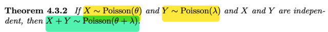</kbd>

<kbd></kbd>

<kbd>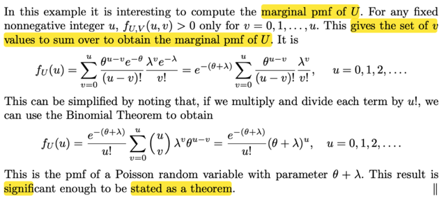</kbd>

> [!NOTE]
> rồi, thế thì tiếp theo đại khái là vầy, ta đã có**joint pmf của U,V**. Thì như đã
> biết bằng cách **marginalizing fU,V(u,v)** trên **mọi possible values của V**, ta
> sẽ có marginal pmf của U. Thế thì, vấn đề là V có các possible value là 0,1,2...
> ... (vì V = Y), Tuy nhiên, một điểm quan trọng đó là dĩ nhiên ta sẽ **chỉ cần lấy
> những possible value v của V nào mà fU,V(u,v) dương thôi**, vì tại các giá trị
> khác thì fU,V(u,v) = 0 rồi.
>
> Thế thì, xét cái pmf fU,V(u,v) =  (θ^(u-v) e^-θ / (u-v)!)(λ^v e^-λ / v!)
>
> sắp xếp lại [θ^(u-v) e^-(θ+λ) λ^v] / [(u-v)!v!] thì thấy**tử số gồm lũy thừa của  θ
> và λ là hai số dương nên nó luôn dương**, và **e^-(θ+λ) thì cũng luôn dương**
> nốt (nhớ ko, với e^x thì x→ -inf thì e^x → 0).
>
> **Chỉ có mẫu số**, **có (u-v)!v! thì v! thì luôn dương rồi**, vì v chỉ có các gía trị
> 0,1,2...nên nhỏ nhất là 0! thì bởi qui ước vẫn bằng 1 > 0.
>
> Còn (u-v)!, **theo quy ước** nếu **a < 0 thì a! KHÔNG XÁC ĐỊNH**, nên nếu**v > u thì (u-v)! KHÔNG XÁC ĐỊNH (UNDEFINED)** dẫn tới bản thân hàm số
> g(u,v) = (θ^(u-v) e^-θ / (u-v)!)(λ^v e^-λ / v!) SẼ **UNDEFINED**
>
> Nhưng vì fU,V(u,v) là đang xét một **joint pmf**, nên **BY CONVENTION**, nó
> sẽ  **BẰNG 0**
>
> Vậy nếu **v > u thì fU,V(u,v) = 0**, Do đó ta sẽ**chỉ tính Σ với v từ 0 đến u**:
>
> Nên ta sẽ có fU(u) = Σv=0,1,..u fU,V(u,v)
>
> = Σv=0,1,2..u [θ^(u-v) e^-(θ+λ) λ^v] / [(u-v)!v!]
>
> = e^-(θ+λ) Σv=0,1,2..u [θ^(u-v) λ^v] / [(u-v)!v!] | đưa e^-(θ+λ) ra vì ko liên quan
> đến v
>
> = [e^-(θ+λ) / u!] Σv=0,1,2..u [u!/(u-v)!v!] [θ^(u-v) λ^v]  | nhân và chia u! để bên
> trong
>
> ta có (u choose v)
>
> = [e^-(θ+λ) / u!] Σv=0,1,2..u (u choose v) [θ^(u-v) λ^v]
>
> = [e^-(θ+λ) / u!] Σv=0,1,2..u (u choose v) [θ^(u-v) λ^v]
>
> Và xét cái Σv=0,1,2..u (u choose v) [θ^(u-v) λ^v], áp dụng**Binomial
> Theorem**, nó chính
>
> là (θ + λ)^u
>
> ⇨ ... = e^-(θ+λ) (θ + λ)^u / u!
>
> Và tới đây có thể thấy **marginal pmf của U** CÓ DẠNG CỦA MỘT
> **POISSON(θ+λ)**

 

<kbd>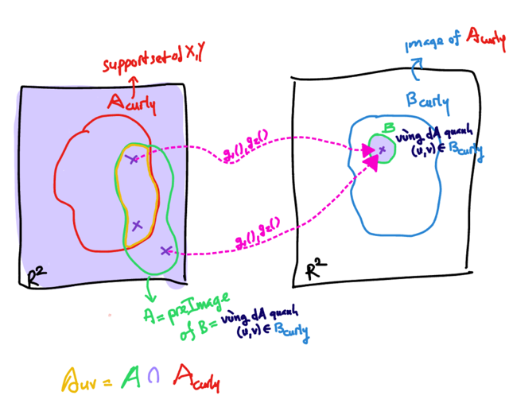</kbd>

<kbd></kbd>

<kbd>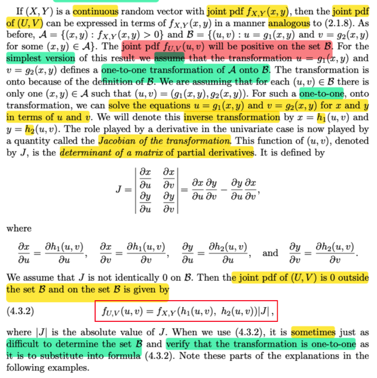</kbd>

> [!NOTE]
> Thế thì ở đây học sẽ **giả sử dùng quan hệ mapping từ A_curly đến
> B_curly là 1-1**
> Tức là như vừa rồi mình có nói, với u,v ∈ B_curly thì tồn tại x,y thuộc
> A_curly sao cho nó được map với u,v. Có thể có nhiều (x,y) được map
> với (u,v), và trong cái đám này có thể có nhiều x,y thuộc A_curly và cũng
> có thể không thuộc A_curly.
>
> Vậy bây giờ mình giả sử với một u,v thuộc B_curly thì sẽ chỉ có một x,y
> trong A_curly (ngoài ra ko còn cái nào khác) là được map với u,v thôi.
>
> (chú ý là vẫn có thể khi xét từ R^2 → B_curly thì quan hệ ko 1-1 nhưng
> xét A_curly → B_curly thì thỏa, như hình minh họa cho thấy mapping
> giữa R^2 → B ko 1-1)
>
> Khi đó đại khái là từ việc u = g1(x,y), v = g2(x,y) thì ta**có thể GIẢI RA x,
> y theo u, v**: x = h1(u,v); y = h2(u,v). Và**x, y là duy nhất**. Vậy mới thấy
> cần giả định trên, vì nếu không thì có thể giải ra nhiều x,y mà chưa chắc
> nó đã thuộc A_curly
>
> Từ đó ta sẽ có công thức cho phép ta tính joint pdf của U,V thông qua
> quan hệ giữa fU,V(u,v) với fX,Y(x,y):
>
> fU,V(u,v) = fX,Y(x,y) |J| = fX,Y(h1(u, v), h2(u, v)) |J|
>
> Với J là matrix of partial derivative ∂(x,y)/∂(u,v)
>
> Qua công thức này ta có thể tìm joint pdf của U,V từ joint pdf của X,Y  có
> điều ko phải lúc này cũng dễ verify rằng mapping là 1-1 và ko dễ để xác
> định B_curly là set gì?

> [!NOTE]
> Tới đây thử ôn lại và lập luận xem tại sao lại lòi ra một cái Jacobian of 
> the transformation.
>
> Trong MIT 18.02 đã học, khi ta chuyển tích phân từ biến x, y sang u, v
> thì một việc cần làm là chuyển dA = dxdy sang dA' = dudv, cụ thể là cần
> tính scaling factor.
>
> Khi đổi biến, dĩ hiên ta sẽ đặt u là hàm theo x, y: u = u(x, y), tức u là hàm 
> theo x,y, và v cũng vậy: v = v(x, y)
>
> Thế thì, TOTAL DIFFERENTIAL (VI PHÂN TOÀN PHẦN) cho ta:
>
> du = ∂u/∂x dx + ∂u/∂y dy 
>
> dv = ∂v/∂x dx + ∂v/∂y dy
>
> Nếu thay vi phân bằng các khoảng rất nhỏ ta sẽ có approximation:
>
> Δu ≈ ∂u/∂x Δx + ∂u/∂y Δy 
>
> Δv ≈ ∂v/∂x Δx + ∂v/∂y Δy
>
> Thể hiện ở dạng vector:
>
> [Δu, Δv]T ≈ [∂u/∂x ∂u/∂y; ∂v/∂x ∂v/∂y] [Δx, Δy]T
>
> Đặt J = [∂u/∂x ∂u/∂y; ∂v/∂x ∂v/∂y]
>
> Và như vậy một vector trong (x, y) coordinate. sẽ được biến thành vector
> J [x, y]T trong (u, v) coordinate
>
> Xét một hình chữ nhật ΔA có các cạnh là Δx, Δy. Tại các điểm (vector):
>
> (0,0), (Δx, 0), (Δx, Δy), (0, Δy) 
>
> Ta có: khi chuyển sang hệ trục uv nó sẽ thành các điểm:
>
> [∂u/∂x ∂u/∂y; ∂v/∂x ∂v/∂y] (0,0) = (0,0)
>
> [∂u/∂x ∂u/∂y; ∂v/∂x ∂v/∂y] (Δx, 0) = (∂u/∂x Δx, ∂v/∂x Δx) 
>
> [∂u/∂x ∂u/∂y; ∂v/∂x ∂v/∂y] (0, Δy) = (∂u/∂y Δy, ∂v/∂y Δy)
>
> [∂u/∂x ∂u/∂y; ∂v/∂x ∂v/∂y] (Δx, Δy) = (∂u/∂x Δx + ∂u/∂y Δy, ∂v/∂x Δx + ∂v/∂y Δy)
>
> Thì hình chữ nhật ΔA trong x,y coordinate trở thành hình bình hành ΔA'
> trong u,v coordinate với các điểm góc như trên:
>
> Diện tích của ΔA' sẽ là **TRỊ TUYỆT ĐỐI CỦA DETERMINANT** của hai vector 
>
> (∂u/∂x Δx, ∂v/∂x Δx) và (∂u/∂y Δy, ∂v/∂y Δy):
>
> = |∂u/∂x Δx ∂v/∂y Δy - ∂u/∂y Δy ∂v/∂x Δx|
>
> = |∂u/∂x ∂v/∂y ΔxΔy - ∂u/∂y ∂v/∂x ΔxΔy| 
>
> = |(∂u/∂x ∂v/∂y - ∂u/∂y ∂v/∂x) ΔxΔy|
>
> = |(∂u/∂x ∂v/∂y - ∂u/∂y ∂v/∂x)| ΔxΔy
>
> Và có thể thấy đó chính là det |J| . ΔxΔy
>
> Như vậy, scaling factor giữa dA và dA' là |J|: dA' = |J|dA
>
> ⇨ dudv = |J| dxdy
>
> ⇨ dxdy = dudv / |J| với J = ∂(u,v)/∂(x,y)
>
> Cũng có thể thay bằng 1 / |∂(u,v)/∂(x,y)| = |∂(u,v)/∂(x,y)_inv| = |∂(x,y)/∂(u,v)|
>
> Từ đó ta có dxdy = |∂(x,y)/∂(u,v)| dudv
>
> Vậy khi đổi biến tích phân từ x, y sanh u, v ta sẽ thay dxdy = |∂(x,y)/∂(u,v)| dudv
>
> ∂(x,y)/∂(u,v) là Jacobian matrix - matrix partial derivative của x, y đối với u, v
>
> Thế thì liên quan gì đến fU,V và fX,Y..
>
> Đó là vì, nếu xét trên một phạm vi vô cùng nhỏ dA=dxdy quanh x,y 
>
> thì P(X,Y ∈ dA) ≈ fX,Y(x,y)dxdy 
>
> (vì dA rất nhỏ ta có thể xấp xỉ nó bởi công thức này)
>
> vùng dA này khi biến đổi qua hệ tọa độ sẽ thành vùng dB quanh u, v:
>
> P(U,V ∈ dB) = fU,V(u,v)dudv
>
> Và xác xuất này phải bằng nhau (*) tương tự như P(U,V ∈ B) = P(X,Y ∈ A)
>
> nên:
>
> fX,Y(x,y)dxdy = fU,V(u,v)dudv
>
> ⇔ fX,Y(x,y)|∂(x,y)/∂(u,v)| dudv = fU,V(u,v)dudv
>
> ⇔ **fX,Y(x,y)|∂(x,y)/∂(u,v)| = fU,V(u,v)
>
> Thực ra ta phải lập luận thêm hai ý:
>
> 1) Tại sao lại xét hình chữ nhật (0,0), (Δx, 0), (Δx, Δy), (0, Δy)
>
>
> 2) Tại sao sau khi biến đổi qua u,v coordinate, nó lại thành hình bình hành
> (nhờ vậy mà ta cùng công thức det của hai vector):
>
> Câu 1 là để cho đơn giản thôi
>
> Câu 2 này có thể nhìn thấy qua:**[∂u/∂x ∂u/∂y; ∂v/∂x ∂v/∂y] (0,0) = (0,0)
>
> [∂u/∂x ∂u/∂y; ∂v/∂x ∂v/∂y] (Δx, 0) = (∂u/∂x Δx, ∂v/∂x Δx) 
>
> [∂u/∂x ∂u/∂y; ∂v/∂x ∂v/∂y] (0, Δy) = (∂u/∂y Δy, ∂v/∂y Δy)
>
> [∂u/∂x ∂u/∂y; ∂v/∂x ∂v/∂y] (Δx, Δy) = (∂u/∂x Δx + ∂u/∂y Δy, ∂v/∂x Δx + ∂v/∂y Δy)****thì nếu gọi v1 = (∂u/∂x Δx, ∂v/∂x Δx) , v2 = (∂u/∂y Δy, ∂v/∂y Δy)
>
> thì (∂u/∂x Δx + ∂u/∂y Δy, ∂v/∂x Δx + ∂v/∂y Δy)  chính là v1 + v2 ⇨ 4 điểm 
>
> tạo thành hình bình hành

> [!NOTE]
> Quan hệ giữa A_curly và B_curly lúc này là 1-1, nhưng giữa R^2 →
> B_curly vẫn có thể là ko phải 1-1

 

<kbd>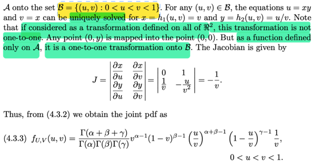</kbd>

<kbd></kbd>

<kbd>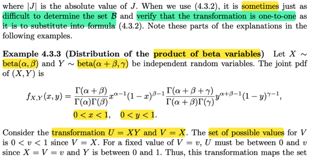</kbd>

> [!NOTE]
> Qua ví dụ này, **X ~ beta(α, β)**. **Y ~ beta (α + β, γ)** và **độc lập**
>
> Như đã biết pdf của β(α, β) f(x) = Γ(α + β)/Γ(α) Γ(β) x^(α-1)(1-x)^β
>
> với **0 < x < 1**. Again, giờ ta đã hiểu hơn define x ∈ (0, 1) chính là nói về
> **support set**, nơi mà**f(x) sẽ luôn dương** (ngoài khoảng này thì pdf = 0)
>
> Và ko có gì phải nói lại, vì X, Y **independent** nên **joint pdf = tích marginal pdf**.
>
> Thế thì vì fX(x) chỉ dương khi x ∈ (0,1), fY(y) chỉ dương khi y ∈ (0,1) nên
> đương nhiên fX(x)fY(y) = fX,Y(x, y) chỉ dương khi 0 < x,y < 1
>
> Tức A_curly = x, y ∈  {(x,y): 0<x<1, 0<y<1} (đó là hình vuông trong R^2)
>
> Thế thì mới đặt U = g1(X,Y) = XY, V = g2(X,Y) = X
>
> ta sẽ xem thử **B_curly, theo định nghĩa, là ảnh của A_curly, là set nào**,
>
> và **mapping giữa A_curly và B_curly  có one-to-one ko**?
>
> Vì V = X, mà support set của X là (0,1) thì giá trị của V cũng thuộc (0,1)
>
> Và U = XY = VY, mà support set của X là (0,1), còn V có giá trị thuộc (0,1)
>
> nên U ∈ (0, v)
>
> Chỗ này nhắc lại, nên chú ý rằng, nói x ∈ (0,1) là đang nói support set của X nơi
> mà fX(x) > 0, tương tự y ∈ (0,1) cũng vậy.
>
> Còn đang lập luận để cho ra ví dụ như v ∈ (0,1)  u ∈ (0,v) **là đang xác định
> tập B_curly, ảnh của A_curly** = {g1(x,y), g2(x,y) với (x,y) ∈ A_curly}
>
> (B_curly, là ảnh của A_curly và ta đã chứng minh trên đó joint pdf của U,V duơng,
> tuy nhiên nó chỉ là tập con của support set U,V chứ chưa chắc là toàn bộ support
> set)
>
> Vậy tập **B_curly là {(u,v)**∈**R^2: 0 < v < 1, 0 < u < v}**
>
> Thế thì từ u = **g1**(x,y) = **xy**, v = **g2**(x,y) = **x**
>
> ⇨ x = **h1**(u, v) = **v**; u = vy ⇨ y = **h2**(u,v) = **u/v**
>
> Thế thì, ở đây gs nhấn mạnh là:
>
> Nếu xét mapping bởi hàm g1(x,y) = xy, g2(x,y) =  x với (x,y) từ**toàn R^2 tới
> B_curly** thì nó **KHONG PHẢI LÀ mapping 1-1** (tức là mapping giữa R^2 và
> B_curly KHÔNG  PHẢI 1-1) vì điểm bất kì (0,y) nào cũng được map với (0,0)
>
> nhưng vì **chỉ xét trong phạm vi tập A_curl**y là {0<x<1;0<y<1}
>
> nên việc **mapping từ A_curly tới B_curly là 1-1 mapping**.
>
> Rồi, tính J thì dễ rồi = -1/v
>
> Từ đó theo công thức trên ta có fU,V(u,v) = fX,Y(x,y) |∂(x,y)/∂(u,v)|
>
> = fX,Y(h1(u,v),h2(u,v)) |∂(x,y)/∂(u,v)|

 

<kbd>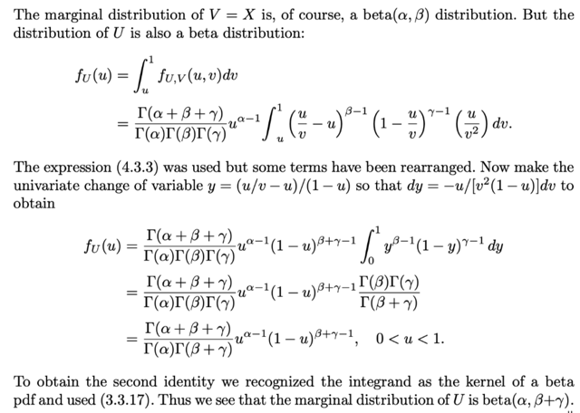</kbd>

> [!NOTE]
> Tiếp theo là tính **fU(u)** bằng cách **marginalizing fU,V(u,v) trên mọi possible
> value của v** (tức khoảng (0,1)) cho thấy**U cũng là β random variable**
>
> QUAY LẠI SAU

> [!NOTE]
> QUAY LẠI SAU

 

<kbd>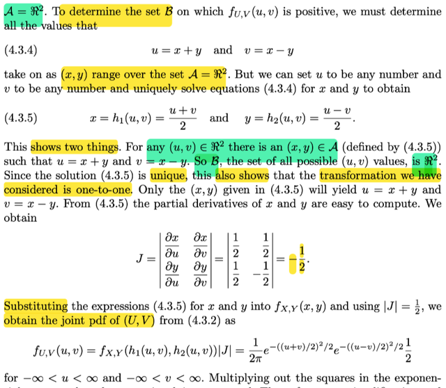</kbd>

<kbd>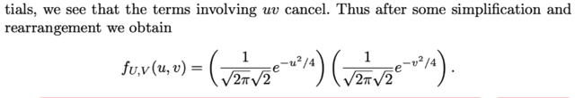</kbd>

<kbd></kbd>

<kbd></kbd>

<kbd>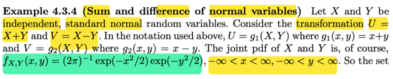</kbd>

> [!NOTE]
> qua ví dụ này, (nói trước một tí, nhớ rằng ta đang bàn về việc transform vector
> random variable (X,Y) thành (U, V) qua hàm g1, g2, và ta muốn tìm distribution (cụ
> thể là joint distribution của (U,V) từ joint distribution của X,Y nhờ vào cái theorem
> (4.3.2) lúc nãy
>
> Mà khi làm vậy, ta phải làm hai việc:
>
> Đó là: Tìm tập B_curly (ảnh của A_curly - support set của X,Y) và tính det của J
>
> Thế thì, ở đây cho **X, Y là hai standard normal r.v độc lập** (đương nhiên μ = 0, σ
> = 1). Và U = X + Y, V = X - Y
>
> Vậy thì đầu tiên phải nói là với normal, ta nhớ nó sẽ có hình chuông với hai cái
> đuôi kéo dài tiệm cận 0 khi kéo ra vô cùng, cũng chính là**pdf của normal sẽ
> dương VỚI MỌI x**. Nên ta thấy khi ghi công thức của normal distribution pdf,
> fX(x) = ... thì người ta ghi **-inf < x < inf**
>
> Và tương tự Y cũng vậy, do đó **dễ thấy support set của (X,Y) là toàn bộ R^2**: A
> = R^2
>
> Thế thì ta sẽ tìm B: theo định nghĩa là **{x+y, x-y với x, y**∈**A = R^2}**
>
> Giáo sư Casella đề nghị lập luận như sau:
>
> Cứ lấy u, v bất kì, thì từ u = x + y, v = x - y ⇨ x = (u + v)/2, y = (u - v)/2
>
> và ĐIỀU QUAN TRỌNG LÀ, **x, y này CHẮC CHẮC**∈**A_curly**, đơn giản vì
> A_curly .. LÀ **TOÀN BỘ R^2**. Vậy nên, cái ông u,v bất kì kìa CHẮC CHẮC LÀ
> THUỘC B_curly (vì định nghĩa của B_curly là (g1(x,y),g2(x,y)) với (x,y) ∈ A_curly
> mà) Thế mà ta đã bắt đầu bằng việc chọn u, v bất kì, để rồi đều cho thấy nó thuộc
> B_curly, ĐIỀU NÀY GIÚP KẾT LUẬN B_curly CHÍNH LÀ R^2
>
> (cũng ko khó để chứng minh theo kiểu phản chứng nếu muốn)
>
> Rồi, bên cạnh đó, từ việc chọn u, v bất kì (mà nay ta đã biết "bất kì" thì cũng  là
> thuộc B_curly), ta giải ra x = (u + v)/2 (tức h1(u, v)) và y = (u - v)/2 tức h2(u, v) mà
> rõ ràng cái này cho thấy x, y là unique, chứng tỏ mapping giữa A, và B là 1-1
>
> TÓM LẠI, X**ÁC ĐỊNH ĐƯỢC B_curly** CHÍNH LÀ **R^2**, VÀ **CHỨNG MINH ĐƯỢC
> MAPPING LÀ 1-1**.
>
> Nên ta có thể áp dụng công thức để tính joint pdf của U,V:
>
> fU,V(u,v) = fX,Y(x,y) |∂(x,y)/∂(u,v)|
>
> Dĩ nhiên với X,Y độc lập thì fX,Y(x,y) là tích hai marginal normal pdf,  còn det
> Jacobian thì tính quá dễ rồi.
>
> từ đó ta có như trong sách với ghi chú -inf < u và v < inf thể hiện set B_curly là R^2
>
> Tiếp, **thu gọn fU,V(u,v)** lại ta sẽ thấy nó có dạng **TÍCH CỦA HAI FUNCTION MỘT
> CÁI THEO u, MỘT CÁI THEO v.**
>
> TỚI ĐÂY LÀ CHỖ ĐÁNG CHÚ Ý:
>
> Nếu không có **bổ đề 4.2.7** (nói rằng X,Y độc lập ⇔ ta có thể tìm được hàm g, h sao
> cho fX,Y(x,y) = g(x)h(y) với mọi (x,y)) thì việc ta đi đến kết quả joint pdf của U,V có
> dạng tích của hai normal pdf một cái của U, một cái của **V LÀ KHÔNG ĐỦ CƠ SỞ
> ĐỂ KẾT LUẬN U, V ĐỘC LẬP VÀ U, V LÀ NORMAL**
>
> Vì định nghĩa nói rằng nếu X, Y độc lập thì joint pdf  = tích của marginal pdf CHỈ
> CHO TA HAI HỆ QUẢ / HAY HAI CÁCH ÁP DỤNG:
>
> 1) **Có marginal pdf/pmf của X, Y rồi, tức fX(x), và fY(y)**, thì ta nếu ta biết X, Y độc
> lập thì ta **CÓ THỂ** **VIẾT NGAY JOINT PDF/PMF CỦA X,Y: f(x,y) = fX(x)fY(y)**
>
> 2) Nếu ta **đã có pdf/pmf của X, Y**. Và **cũng đã có joint pdf/pmf của X,Y**. Thì bằng
> cách **chứng minh fX,Y(x,y) = fX(x)fY(y) với mọi x, y**thì ta có thể **SUY RA X, Y ĐỘC
> LẬP**
> Và ta thấy trong cả hai ứng dụng trên **ĐỀU YÊU CẦU PHẢI BIẾT / ĐÃ BIẾT PDF
> PMF CỦA X, Y RỒI.**
> Thế mà, ở đây TA CHƯA BIẾT MARGINAL PDF CỦA U, V LÀ GÌ, và cũng ko biết
> chúng có độc lập ko (mà dù có biết chúng độc lập, thì cũng ko có quyền kết luận từ
> fU,V(u,v) = f1(u)f2(v) thì f1(u) chính là fU(u), f2(v) chính là fV(v))
>
> NHƯNG NHỜ BỔ ĐỀ 4.2.7, THÌ VIỆC TA CÓ fU,V(u,v) = g(u) h(v) với mọi u, v **THÌ
> TA ĐƯỢC PHÉP SUY RA U, V ĐỘC LẬP.**

> [!NOTE]
> Khi đã kết luận U, V độc lập, ta sẽ **marginalizing fU,V(u,v) over mọi possible
> value của v để có marginal pdf của U**
>
> fU(u) = ∫-inf:inf fU,V(u,v)dv
>
> = ∫-inf:inf [(1/√2π√2)e^-u^2/4][(1/√2π√2)e^-v^2/4] dv
>
> = [(1/√2π√2)e^-u^2/4] ∫-inf:inf [(1/√2π√2)e^-v^2/4] dv | Đưa phần ko dính v ra
>
> = [(1/√2π√2)e^-u^2/4] ∫-inf:inf [(1/√2π√2)e^-v^2/4] dv
>
> Xét tích phân ∫-inf:inf [(1/√2π√2)e^-v^2/4] dv bằng cách nhận ra integrant là
> pdf của normal(0,2) ...
>
> (Vì với pdf của normal(μ, σ^2): f(x) = 1/σ√2π e^-(x-μ)^2/2σ^2 
>
> ⇨ pdf normal(0, 2) = 1/√2√2π e^-(x-0)^2/2(√2^2) = **1/√2√2π e^-x^2/4)**
>
> Chú ý normal(0, 2) tức là μ = 0, σ^2 = 2 ⇨ σ = √2
>
> ..ta sẽ **suy ra tích phân này = 1**
>
> Từ đó fU(u) = (1/√2π√2)e^-u^2/4, và tiếp tục lập luận rằng **vì pdf của U có dạng
> của một normal (0, 2) nhờ đó kết luận U ~ normal(0,2).**
>
> Và đến lúc này với viêc U, V độc lập, fU,V(u,v) = f1(u) f2(v) 
>
> (tức [(1/√2π√2)e^-u^2/4] [(1/√2π√2)e^-v^2/4])
>
>  và đã chứng minh f1(u) chính là fU(u) ⇨ fV(v) = (1/√2π√2)e^-v^2/4 và từ đó
> suy ra V cũng là normal(0, 2)

 

<kbd>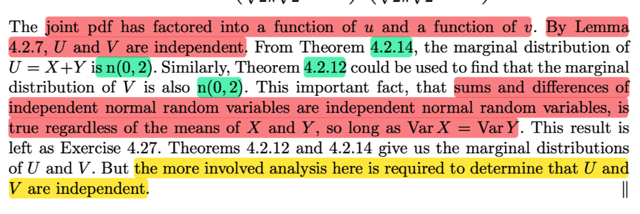</kbd>

> [!NOTE]
> Rồi thế thì đại khái ở đây giáo sư Casella muốn nói rằng ta hoàn toàn có thể
> dùng Theorem 4.2.14 và 4.2.12 để có ngay marginal pdf của U và V: fU(u), fV(v).
> Nhưng vấn đề là, để cho thấy được U, V độc lập, thì ta vẫn phải xây dựng joint
> pdf của U, V thông qua transformation. Khi đó, như đã nói, khi đã ra kết quả là
> fU,V(u,v) có dạng tích của hai hàm theo u và v riêng biệt thì dùng bổ đề 4.2. cho
> ta kết luận U, V độc lập (sau đó thì như mình đã làm, có thể khỏi dùng theorem
> 4.2.14,4.2.12 mà chỉ cần làm bước marginalizing để có fU, fV)
>
> Vậy thử xem nếu áp dụng Theorem 4.2.14 thì sao:
>
> Đơn giản là theorem đó nói rằng nếu X, Y độc lập và là normal(μ1, σ1^2) và
> normal(μ2, σ2^2) thì X + Y sẽ là normal (μ1 + μ2, σ1^2 + σ2^2) Vậy nên dùng cái
> này ta suy ra ngay U ~ normal (0 + 0, 1 + 1) = normal(0,2)
>
> Còn để có marginal pdf của V = X - Y thì gs đề nghị dùng theorem 4.2.12 nói
> rằng mgf của Z = X + Y với X, Y independent: MZ(t) = MX(t)MY(t)
>
> Vậy thì ta mới xét mgf của V = X + (-Y)
>
> Để rồi dùng theo một theorem nữa là nếu X, Y độc lập thì X, -Y cũng độc lập. Từ
> đó theo theorem 4.2.12 MZ(t) = MX(t)M(-Y)(t)
>
> = E[tX] E[t(-Y)]
>
> = ráp công thức của mgf vào, ta sẽ có kết quả cho thấy Z có mgf của n(0,2)
>
> ====
>
> Bên stat111 mình nhớ là gs Blitzstein có cách làm khác là chứng minh nếu Y là
> n(μ, σ^2) thì -Y cũng vậy ngay lập tức chứng minh -Y cũng là n(0,1) thì ngay lập
> tức ta dùng 4.2.14 để kết luận X-Y cũng là n(0,2)
>
> Chứng minh: Đặt Y = g(X) = -X với X ~ N(μ, σ^2) ⇨ X = -Y = ginv(Y)
>
> Dùng transformation theorem:
>
> fY(y) = fX(x) |dx/dy| = fX(ginv(y) |d/dy ginv(y)|
>
> = (1/√2π) e^-(x)^2/2. | d/dy (-y) |
>
> = (1/√2π) e^-x^2/2. | -1 |
>
> = (1/√2π) e^-(-y)^2/2
>
> = (1/√2π) e^-y^2/2
>
> ⇨ Y ~ n(0,1)

 

<kbd>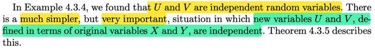</kbd>

<kbd></kbd>

<kbd>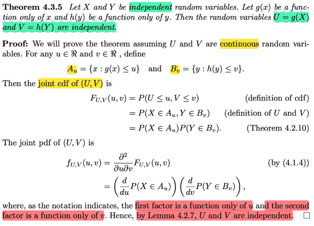</kbd>

> [!NOTE]
> Rồi, qua một theorem đơn giản nhưng rất quan trọng. là nếu X, Y độc lập
> rồi U = g(X), V = h(Y) với g và h chỉ là hàm theo x và y thì khi đó U, V độc
> lập.
>
> Chứng minh cũng ko có gì khó hiểu.
>
> Bắt đầu với việc xây dựng joint cdf (giả sử U, V là continuous rvs) :
>
> Đầu tiên thì ta define Au = {x ∈ R: g(x) ≤ u} và Bv = {y ∈ R: h(y) ≤ v}
>
> FU,V(u,v), theo định nghĩa nó là P(U ≤ u, V ≤ v)
>
> = P(g(X) ≤ u, h(Y) ≤ v)
>
> Xét (g(X) ≤ u, h(Y) ≤ v) = (g(X) ≤ u) ∩ (h(Y) ≤ v)
>
> = {s ∈ Ω: g(X)(s) ≤ u} ∩ {s ∈ Ω: h(Y)(s) ≤ v}
>
> = {s ∈ Ω: g(X(s)) ≤ u} ∩ {s ∈ Ω: h(Y(s)) ≤ v} 
>
> = {x ∈ R: g(x) ≤ u} ∩ {y ∈ R: h(y) ≤ v} 
>
> = (X ∈ Au ∩ Y ∈ Bv)
>
> ⇨ = P(g(X) ≤ u, h(Y) ≤ v) = P(X ∈ Au ∩ Y ∈ Bv)
>
> và tính theo joint pdf của X,Y:
>
> = ∫Au ∫Bv fX,Y(x,y)dxdy
>
> = ∫Au ∫Bv fX(x)fY(y)dxdy
>
> = ∫Au fX(x)dx ∫BvfY(y)dy | do X Y độc lập nên joint pdf = tích marginal pdf
>
> = P(X ∈ Au) P(Y ∈ Bv)
>
> Vậy FU,V(u,v) = P(X ∈ Au) P(Y ∈ Bv)
>
> Lấy đạo hàm theo u,v ta sẽ có 
>
> ∂^2/∂u∂v FU,V(u,v) = fU,V(u,v) = ∂^2/∂u∂v P(X ∈ Au) P(Y ∈ Bv)
>
> Thế thì tới đây xét :
>
> ∂^2/∂u∂v [P(X ∈ Au) P(Y ∈ Bv)]
>
> cơ bản nó là:
>
> ∂/∂u [∂/∂v [P(X ∈ Au) P(Y ∈ Bv)]] | tức là lấy đạo hàm theo v trước, giữ u fixed
> rồi đạo hàm theo u sau
>
> Thế thì khi giữ u fixed, thì P(X ∈ Au) là constant nên có thể đưa ra ngoài:
>
> ∂/∂u { P(X ∈ Au) [∂/∂v P(Y ∈ Bv)] }
>
> Tiếp, khi tính đạo hàm theo u thì giữ v fixed, nên cả cụm này [∂/∂v P(Y ∈ Bv)] 
> là constant đưa ra ngoài:
>
> [∂/∂v P(Y ∈ Bv)] [∂/∂u P(X ∈ Au)]
>
> Kết quả có thể thấy fU,V(u,v) = [∂/∂v P(Y ∈ Bv)] [∂/∂u P(X ∈ Au)] là **tích của
> hai function k(v) =  [∂/∂v P(Y**∈**Bv)] chỉ phụ thuộc v và l(u) = ∂/∂u P(X**∈**Au
> chỉ phụ thuộc u**. Nên theo BỔ ĐỀ 4.2.7 nói rằng khi mà joint pdf của X, Y
> có thể được thể hiện ở dạng tích của hai hàm số mà mỗi hàm chỉ theo một
> biến thì có thể kết luận chúng độc lập. Vậy U, V độc lập.
>
>
> Một điểm nữa có thể nói thêm là Vì sao ∂^2/∂x∂y F(x,y) lại là joint pdf f(x,y)
>
> Bởi vì theo định nghĩa của cdf: FX(x) = P(X ≤ x). Và hàm pdf fX(x) được 
> định nghĩa là hàm fX(x) sao cho: FX(x) = ∫-inf:x fX(t)dt. Mà theo FTC1, 
> khi hàm G(x) được  định nghĩa bởi ∫-inf:x f(t)dt thì G là nguyên hàm của f
> ⇨ d/dx G(x) = f(x).
>
> Tương tự như vậy định nghĩa của joint cdf của X, Y là hàm số thể hiện xác 
> suất này: P(X ≤ x, Y ≤ y) = FX,Y(x,y)
>
> Và định nghĩa của joint pdf là hàm fX,Y sao cho: P((X,Y) ∈ A) 
>
> = ∫∫A fX,Y(x,y)dxdy 
>
> ⇨  P(X ≤ x, Y ≤ y) = ∫∫A fX,Y(t,j)dxdy với A = {(t,j) ∈ R^2: -inf < t ≤ x, -inf < j ≤ y)}
>
> Thế thì, gs đã nói trong 4.1.4, rằng **BIVARIATE FCT** cho phép ta có:
>
> ∂^2F(x,y)/∂x∂y = f(x,y)

 

<kbd>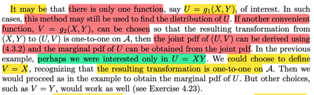</kbd>

> [!NOTE]
> Đoạn này đại khái nói là có khi ta chỉ quan tâm U = g1(X,Y) thôi, ý là chỉ quan
> tâm đến một random variable mới là kết quả của việc apply function g1 nào
> đó lên X, Y thôi chứ ko phải là ta có cặp rv U,V nào cả. Thì khi đó, thật ra ta
> vẫn đơn giản là CHỌN MỘT V DEFINE BỞI g2 ĐƠN GIẢN NÀO ĐÓ ví dụ V
> = g2(X,Y) = X, **Miễn sao là support set của X,Y (\/A_curly)\/ được mapping
> 1-1 với  (B_curly)**, thì  từ đó ta lại áp dụng theorem trên để tìm joint
> distribution của U, V và marginalizing over v để có marginal pdf/pmf của U.

 

<kbd>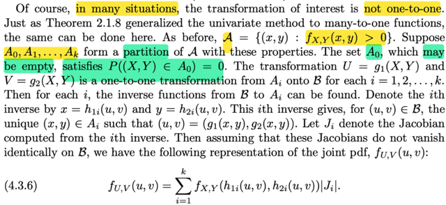</kbd>

> [!NOTE]
> Đại khái là, ở đây nói về tình huống mà ta không có mapping 1-1 từ A_curly
> (tức tập support của X,Y) đến B_curly
>
> Ôn lại một chút, ta đang ở đây là nói về việc ta muốn tìm joint distribution của
> (U,V) với U = g1(X, Y), V = g2(X, Y) từ / nhờ joint distribution của X,Y
>
> Thế thì, ta sẽ dựa vào một điều có thể chứng minh rằng: Nếu A là tập tiền
> ảnh của B: A = {(x,y) ∈ R^2: (g(x,y), h(x,y)) ∈ B} thì P((X,Y) ∈ A) = P((U,V) ∈
> B) và từ đó tạo cơ sở để ta xây dựng joint distribution của U,V dựa trên X,Y
>
> Cụ thể ta sẽ dựa trên mapping giữa A_curly, support set của X,Y và B_curly
> là ảnh của A_curly để từ đó xây dựng, tuy nhiên điều kiện của theorem trước
> là mapping phải 1-1, tức là với u,v  ∈ B_curly (tất nhiên theo định nghĩa của
> B_curly thì phải có x,y nào đó của A_curly mà u = g1(x,y), v = g2(x,y)) thì ta
> có thể giải ra được x = h1(u,v), y = h2(u,v)
>
> Vậy thì ở đây nói tới tình huống mà ko có mapping 1-1
>
> ====
>
> Thế thì đại khái là ta sẽ giải quyết bằng cách dùng một khái quát của vấn đề
> tương tự với transformation đơn biến. Y = g(X). Đó là theorem 2.1.8, nói rằng
> Nếu như range của X (X_curly, chứa các possible value của X, là tập con
> của R, nhưng như đã từng nói, nó ko nhất thiết là support set, hiểu đơn giản
> là có thể chứa xi là mapping từ si: xi = X(si), với si là một possible outcome
> trong sample space, nhưng outcome này có thể không bao giờ xảy ra, P({si})
> = 0, khi đó fX(xi) = 0)
>
> Thế thì, quay lại vấn đề, là có khi g(x) không map 1-1 giữa X_curly và Y_curly
> (Y_curly là range của Y) nên không dùng theorem này được:
>
> fY(y) = fX(ginv(y)) | d/dy ginv(y) |
>
> Nhưng ta có thể có theorem 2.1.8 để chữa cháy:
>
> Nói nói rằng nếu như ta có thể thỏa các điều kiện sau:
>
> X_curly có thể chia thành một partition tức là bộ các set A0, A1,...Ak không giao
> nhau và ∪ = X_curly. Với P(X ∈ A0) = 0, và trên các A1,A2,...thì hàm g sẽ hành
> xử theo kiểu nó sẽ là kết quả của các hàm gi khác nhau trên các Ai khác nhau,
> ví dụ như g(x) với x trên A1 sẽ = g1(x), g(x) với x trên A2 sẽ = g2(x)....
> Bên cạnh đó, yêu cầu quan trọng là các hàm gi trên các set Ai phải đơn điệu
> (monotone), để với xi ∈ Ai sao cho y = gi(xi) thì xi = gi_inv(y)
>
> Và quan trọng hơn nữa là x ∈ Ai với i nào thì g(x) cũng ∈ Y_curly
>
> Khi đó theorem cho ta:
>
> fY(y) với y ∈ Y_curly, = **Σi fX(gi_inv(y)) |d/dy gi_inv(y)|**và = 0 khi y không ∈ Y_curly
>
> ====
>
> Vậy thì ở đây tương tự, ta có khái quát của theorem 2.1.8, nói rằng: Nếu như 
> mapping giữa A_curly và B_curly không 1-1, nhưng A_curly có thể hình thành
> một partition: A0,A1,....Ak sao cho P((X,Y) ∈ A0) = 0 Còn trên các A1,A2,...ta
> có các transformation U = g1(X,Y), V = g2(X,Y) mapping 1-1, tức là ví dụ với
> x,y ∈ A1, u,v = (g1(x,y), g2(x,y)) ∈ B_curly ⇨ có thể tìm ngược lại x,y từ u, v:
> x = h1i(u,v), y = hi2(u,v)
>
> Khi đó, gọi Ji là Jacobian của inverse thứ i, tức là:
>
> nó là matrix các partial derivative của ∂(x, y) / ∂(u, v) với quan hệ giữa x,y và u,v
> define trên tập Ai
>
> Thêm một assumption nữa là Jacobian ko vanish identically trên B_curly (!???)
>
> Khi đó theorem cho ta **fU,V(u,v) = Σ fX,Y(h1i(u,v), h2i(u,v)) | Ji |**

 

<kbd>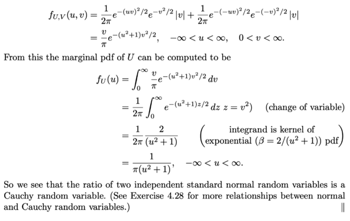</kbd>

<kbd></kbd>

<kbd>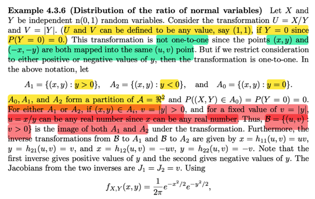</kbd>

> [!NOTE]
> Vô ví dụ này, X,Y ~ n(0,1), U = X/Y, V = |Y|, ở đây không map 1-1 giữa A_curly
> và B_curly vì sao, vì ví dụ như cả (x,y) và (-x,-y) đều được map với u,v = x/y, |y|
> (do x/y cũng = -x/-y và |y| cũng bằng |-y|)
>
> Nhưng ở tình huống này ta có thể có bối cảnh có thể áp dụng áp dụng  theorem
> vừa rồi như sau
>
> Đầu tiên A_curly là gì? theo định nghĩa nó là {(x,y) ∈ R^2: fX,Y(x,y) > 0} Ta chưa
> biết joint pdf fX,Y. Nhưng vì đề bài cho X, Y độc lập ta có thể suy ra ngay fX,Y(x,
> y) = fX(x)fY(y), và từ đó fX,Y(x,y) > 0 ⇔ fX(x) > 0 và fY(y) > 0 ⇔ x ∈ support set
> của X và y ∈ support set của Y  cũng chính là x ∈ R, y ∈ R, hay (x,y) ∈ R^2. Lí do
> là vì X và Y đều ~n(0,1) có pdf dương tại mọi điểm thuộc R. Tóm lại A_curly là
> R^2.
>
> Thế thì trên R^2, ta có thể chia ra thành một partition như sau:
>
> A0 = {x,y ∈ R^2, y = 0}, A1 = {x,y ∈ R^2: y < 0} và A2 = {x,y ∈ R^2: y > 0}
>
> 1) Xem thử A0 có thỏa là P((X,Y) ∈ A0) = 0 không? Dĩ nhiên là thỏa, vì  P((X,Y) ∈
> A0) sẽ được tính bởi ∫∫A0 fX,Y(x,y)dxdy và vì A0 là 1 đường thẳng nên kết quả
> này = 0
>
> 2) Xem thử mapping giữa g(x,y) = x/y và h(x,y) = |y| từ A1, A2 đều map tới
> B_curly không? Mà nếu vậy phải xem B_curly là gì?
>
> B_curly theo định nghĩa là set {u=g(x,y), v=h(x,y) với x,y ∈ A_curly} tức là {(x/y,
> |y|) với (x,y) ∈ A_curly}.
>
> Vậy thì đại khái là, nếu ta có v có giá trị = |y| > 0 và u = x/y thì đây có thể là kết
> quả mapping từ (x,y) ∈ A1 hoặc từ A2
>
> ví dụ v = 3, u = 1 thì nó có thể là v = |-3|, u = -3/-3, tức (-3,-3) ∈ A1 → (u,v) ∈
> B_curly hoặc v = |3|, u = 3/3, tức mapping từ (3,3) ∈ A2 → (u,v) ∈ B_curly
>
> Nên đại khái là nó thỏa yêu cầu này: A1,A2 đều được map với B_curly bởi g1,
> g2
>
> 3) Xem thử trên A1, A2 thì ta có mapping 1-1 không?
>
> Có, vì nếu ta có u = x/y, v = |y| với x, y ∈ A1, tức là ta biết y âm, thì ta suy ra y =
> -v, x = uy = -uv
>
> Còn nếu ta có u = x/y, v = |y| với x,y ∈ A2, tức là ta biết y dương thì suy ra y = v,
> x = uv
>
> Đều là mapping 1-1
>
> Như vậy là có thể dùng theorem trên để tìm joint pdf của U,V
>
> Trước hết cần xác định J1 , J2
>
> J1 = ∂(x, y) / ∂(u, v) trên A1. Trên A1 thì như trên đã nói
>
> y = -v, tức h21(u,v) = -v,
>
> x = -uv, tức h11(u,v) = -uv
>
> ⇨ J1 = [∂x/∂u, ∂x/∂v; ∂y∂u, ∂y/∂v] = [-v, -u; 0, -1] ⇨ |det J1| = -v*-1 -0*(-u) = v
>
> J2 = ∂(x, y) / ∂(u, v) trên A2. Trên A2 thì như trên đã nói
>
> y = v, tức h22(u,v) = v,
>
> x = uv, tức h12(u,v) = uv
>
> ⇨ J2 = [∂x/∂u, ∂x/∂v; ∂y∂u, ∂y/∂v] = [v, u; 0, 1] ⇨ |det J1| = v*1 - 0*(u) = |v|
>
> Áp dụng ta có:
>
> fU,V(u,v) = fX,Y(h11(u,v), h21(u,v) |J1| + fX,Y(h12(u,v), h22(u,v)) |J2|
>
> Với fX,Y(x,y) = fX(x) fY(y) = (1/√2π) e^-x^2/2 (1/√2π) e^-y^2/2
>
> = (1/2π) e^-(x^2+y^2)/2
>
> ....
>
> Tính tiếp như sách ,.. = (v/π) e^-(u^2+1)v^2/2 -inf < u < inf, 0 < v < inf
>
> Từ đó tính marginal pdf của U 1/[π(u^2 + 1)] -inf < u < inf

 

