# 4.4 Hierarchical Model & Mixture Distribution

📊 **Progress:** `11` Notes | `27` Screenshots

---
<a id="node-266"></a>

<p align="center"><kbd>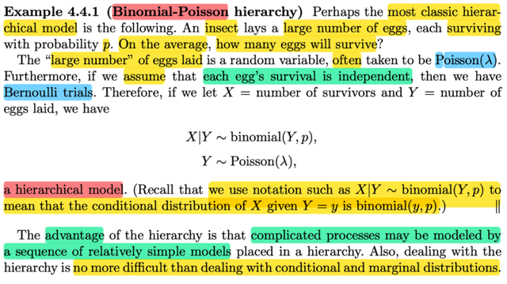</kbd></p>

<p align="center"><kbd></kbd></p>

<p align="center"><kbd>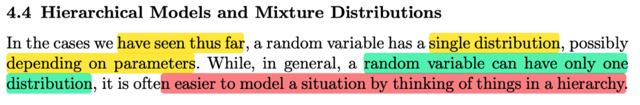</kbd></p>

> [!NOTE]
> ở đây ta sẽ được biết khái niệm mới, đại khái là ví dụ như ta có bối cảnh là
> con gà (hay đàn gà) đẻ trứng, số trứng đẻ ra bao nhiêu thì ko biết (tức là nó
> là một random variable), đặt random variable cho cái này là Y. Thì thông
> thường ta sẽ assume nó là một Pois(λ) rv.
>
> Thế thì, giả sử các trứng đều có tỉ lệ nở là p và độc lập nhau, khi đó dễ thấy
> việc trứng có nở hay ko là một Bern(p) rv và ta có một chuỗi các Bern(p) iid
> và khi ta quan tâm tổng số trứng nở (dĩ nhiên cũng là rv) thì nó chính là bối
> cảnh của Binomial(Y, p) Để rồi ta sẽ "ghi như vầy":
>
> X|Y ~ binomial(Y, p) và Y ~ Pois(λ)
>
> Đây chính là một HIERARCHICAL MODEL, mang ý nghĩa là Y là một
> Pois(λ) rv, và nếu biết giá trị của Y thì X|Y là một binomial(Y, p) rvs
>
> Thế thì ƯU ĐIỂM CỦA CÁI NÀY LÀ NÓ GIÚP THỂ HIỆN MỘT QUÁ TRÌNH
> PHỨC TẠP BỞI MỘT CHUỖI CÁC MODEL ĐƠN GIẢN.

<br>

<a id="node-267"></a>

<p align="center"><kbd>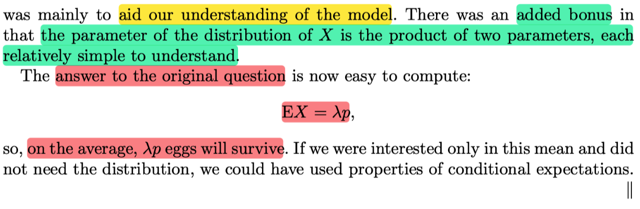</kbd></p>

<p align="center"><kbd></kbd></p>

<p align="center"><kbd>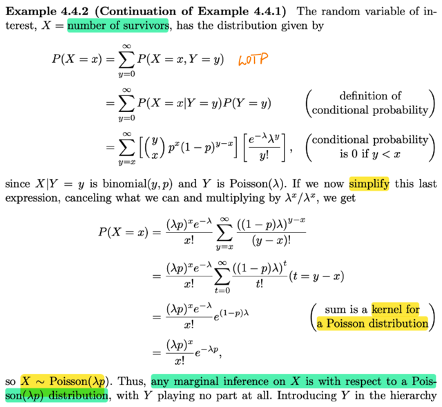</kbd></p>

> [!NOTE]
> Rồi k0 có gì khó hiểu, P(X `=` x) ta sẽ marginalizing over mọi possible value
> của X, Y:
>
> ```text
> P(X = x) = Σ {mọi possible value y của Y} P(X = x, Y = y) mà Y như đã nói,
> ```
> ```text
> là một Pois(λ), pmf = e^-λ λ^y / y!, với các y = 0,1,2...inf (again, đây là
> ```
> support set)
>
> ```text
> ⇨ P(X = x) = Σy=0,1..inf  P(X = x, Y = y)
> ```
>
> Dùng theorem conditional event probability P(X `=` x, Y `=` y)
>
> ```text
> = P(X = x | Y = y)P(Y = y)
> ```
>
> P(Y `=` y) chính là pmf của Y evaluate tại y: `e^-λ` λ^y `/` y!
>
> P(X `=` x | Y `=` y) thì như đã nói, X|Y ~ binomial(Y, p), hay `X|Y=y` ~ Binomial(y, p)
> ⇨ P(X `=` x | Y `=` y) `=` pmf của bin(y, p) evaluate tại x:
>
> (pmf của bin(n, p) f(k) `=` (n choose `k)p^k(1-p)^(n-k))`
>
> ```text
> = (y choose x)p^x(1-p)^(y-x) [e^-λ λ^y / y!]
> ```
>
> ⇨ P(X `=` x) `=` **Σy=0,1..inf (y choose `x)p^x(1-p)^(y-x)` `e^-λ` λ^y `/` y!**
>
> Thu gọn cái này: (Làm sau) 
>
> ta sẽ có `P(X=x)` `=` **(λp)^x `e^-(λp)` `/` x! CHO THẤY X CHÍNH LÀ Pois(λp)
>
> Nhờ vậy ta biết ngay EX `=` λp (EX của Pois(λ) `=` λ)**và câu trả lời cho câu hỏi là trung bình có bao nhiêu trứng nở sẽ là λp

<br>

<a id="node-268"></a>

<p align="center"><kbd>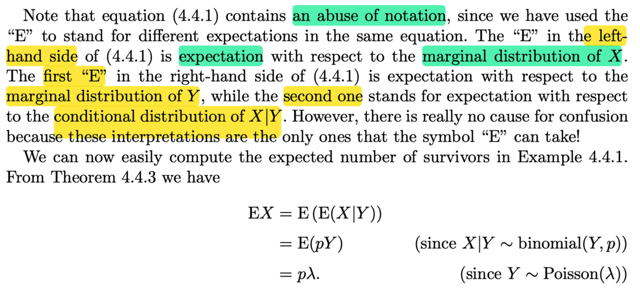</kbd></p>

<p align="center"><kbd></kbd></p>

<p align="center"><kbd>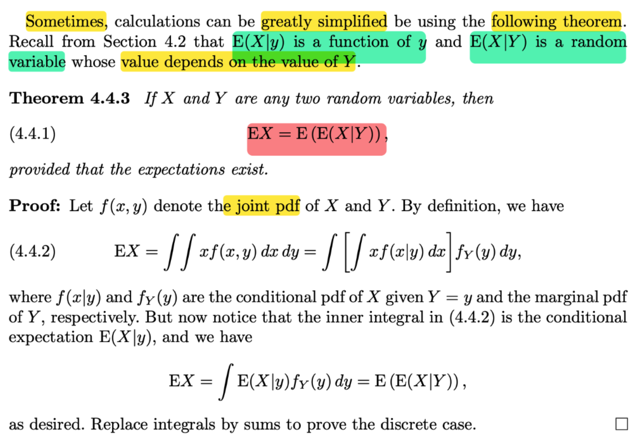</kbd></p>

> [!NOTE]
> Đại khái là bài trước ta đã biết `E(X|Y)` là random variable trong khi đó
> `E(X|y)` là function của y
>
> Vì sao, vì `E(X|y)` mang ý nghĩa là với Y `=y,` thì EX là bao nhiêu. cách tính
> vẫn là weight `Σ` mọi possible value của X với Y `=` y
>
> `=` `∫{mọi` possible value xcủa X với `Y=y}` xfX|Y(x|y)
>
> Đây là hàm số theo y.
>
> Vậy với các giá trị khác nhau của Y thì hàm số này ra các giá trị khác
> nhau, nên nó cũng là một random variable. Hoặc nói cách khác, `E(X|Y)`
> là ta apply hàm số này cho random variable Y, nên dĩ nhiên được một rv
> mới
>
> Thế thì có theorem EX `=` `E[E(X|Y)]` chứng minh rất đơn giản:
>
> Trong sách làm với continuous, mình thử làm discrete
>
> EX `=` `Σ{mọi` x} `xP(X=x)`
>
> ```text
> = Σ{mọi x} xΣ{mọi y} P(X=x, Y=y)    | P(X=x) = Σ{mọi y} P(X=x, Y=y)
> ```
>
> ```text
> = Σ{mọi x} xΣ{mọi y} P(X=x|Y=y)P(Y=y) | conditional prob thoerem
> ```
>
> ```text
> = Σ{mọi x} Σ{mọi y} xP(X=x|Y=y)P(Y=y) | có quyền đổi chỗ hai tổng
> ```
>
> ```text
> = Σ{mọi y} P(Y=y) Σ{mọi x} xP(X=x|Y=y) | P(Y=y) không phụ thuộc x, đưa ra
> ```
>
> ```text
> = Σ{mọi y} P(Y=y)E(X|y)
> ```
>
> ```text
> = Σ{mọi y} E(X|y)P(Y=y) và như đã nói E(X|y) là function theo y, gọi là g(y)
> ```
>
> ```text
> thì cái đang có ở đây chính là = Σ{mọi y} g(y)P(Y=y) và nó chính là E(g(Y))
> ```
>
> `=` `E[E(X|Y)]`
>
> Đã hiểu chứng minh này thì ta hiểu mấy chữ `E` này khác nhau chỗ nào.
>
> ```text
> Vậy thì áp dụng theorem này EX cần tính sẽ = E[E(X|Y)] mà E(X|Y) là
> ```
> expected value của X|Y `-` là một bin(Y,p) ⇨ `E(X|Y)` `=` Yp
>
> ```text
> ⇨ E[E(X|Y)] = E[Yp]
> ```
>
> `=` pEY (linearity) 
>
> `=` pλ (do Y ~ Pois(λ) KẾT QUẢ CŨNG RA NHƯ HỒI NÃY KHI TA KIỂU NHƯ
> CHỨNG MINH X ~ POIS(λp)

<br>

<a id="node-269"></a>

<p align="center"><kbd>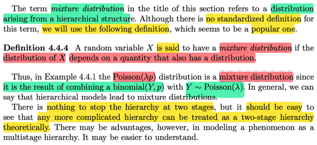</kbd></p>

> [!NOTE]
> đại khái là cái TERM MIXTURE DISTRIBUTION trong tựa đề phần này ám chỉ
> một DISTRIBUTION HIỆN LÊN TỪ CẤU TRÚC PHÂN TẦNG, (ví dụ như khi ta
> tìm ra rằng X sẽ là Pois(λp) nếu như X|Y ~ Bin(Y, p) (đọc là khi biết giá trị của
> Y thì X là một binomial (y,p), và Y là một Pois(λ))
>
> và tác giả nói rằng dù ko có định nghĩa chính thức về cái này nhưng ta sẽ chấp
> nhận định nghĩa rằngTA SẼ NÓI RẰNG X CÓ MIXTURE DISTRIBUTION NẾU
> NHƯ DISTRIBUTION CỦA NÓ PHỤ THUỘC VÀO MỘT ĐẠI LƯỢNG KHÁC
> MÀ BẢN THÂN ĐẠI LƯỢNG ĐÓ CŨNG CÓ DISTRIBUTION
>
> (Ví dụ như X có distribution Bin(Y,p), tức phụ thuộc vào đại lương Y, mà bản
> thân Y cũng có distribution (Pois(λ))
>
> Thế thì gs nói rằng ko lí do gì mà CHỈ CÓ 2 TẦNG, nhưng sẽ dễ hơn nếu ta
> xem xét một hệ nhiều tầng theo từng chuỗi 2 tầng

<br>

<a id="node-270"></a>

<p align="center"><kbd>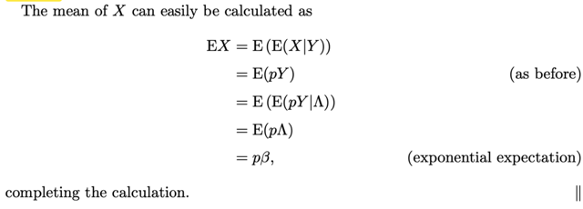</kbd></p>

<p align="center"><kbd>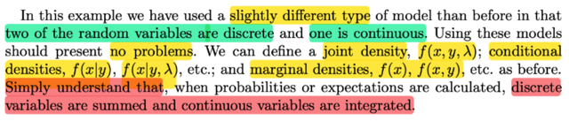</kbd></p>

<p align="center"><kbd></kbd></p>

<p align="center"><kbd></kbd></p>

<p align="center"><kbd>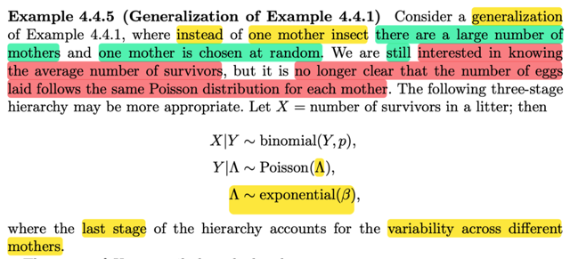</kbd></p>

> [!NOTE]
> Rồi ví dụ này đại khái giả sử bối cảnh đẻ trứng (nãy mình dùng gà đẻ, thật ra
> ở đây đang nói về côn trùng) để cho rằng số trứng đẻ ra (cũng là random
> variable) sẽ ~ Pois(λ), thì bây giờ cho rằng ta sẽ bắt đầu với việc CHỌN MỘT
> CON GÀ MÁI TỪ NHIỀU GIỐNG GÀ KHÁC NHAU. Để rồi số trứng đẻ ra còn
> phụ thuôc  vào giống gà nữa.
>
> Có nghĩa là số trứng đẻ ra Y  ko phải là pois(λ) với λ cố định đã biết, mà nó
> cũng là random variable, phụ thuộc vào việc con gà mái thuộc giống nào
> được chọn (giả định là mỗi giống gà có tỉ lệ đẻ khác nhau)
>
> Lúc này cấu trúc phân tầng sẽ như sau:
>
> X|Y ~ binomial(Y, p) | biết Y thì số trứng nở sẽ ~ bin(Y,p)
>
> Y ~ Pois(Λ) | biết Λ thì tổng số trứng đẻ ra sẽ là một Pois(Λ)
>
> Λ ~ `expo(β)` và bản thân Λ sẽ ~ `expo(β),` mà giá trị của nó đến từ việc chọn
> một gà mái ngẫu nhiên
>
> ```text
> Thế thì khi đó EX = E(EX|Y) = E(pY) = pEY như kết quả trên
> ```
>
> thì đến đây EY `=` `E(EY|Λ)` (vì distribution của Y sẽ phụ thuộc Λ
>
> `=` `E(Λ)` | vì `E(Y|Λ)` là expected value của một Pois(Λ), nên expected của nó là
> Λ
>
> ⇨ EX `=` pE(EY|Λ) `=`  pE(Λ)
>
> ```text
> = pβ   | Do expected value của một  rv Λ ~ expo(β) = β
> ```
>
> `====`
>
> Gs nói thêm trong ví dụ vừa rồi, mình có một mô hình (hierarchy model) mà
> trong đó vừa có cả discrete rv (X ~ binomial(Y, p), Y ~ Pois(Λ)) vừa có cả
> continuous rv (Λ ~ `Expo(β))` nhưng ko vấn đề gì. Chỉ cần nhớ khi tính
> expected value hay marginalizing  thì với discrete rv ta sẽ `Σ` , còn continuous
> rv ta sẽ `∫`

<br>

<a id="node-271"></a>

<p align="center"><kbd>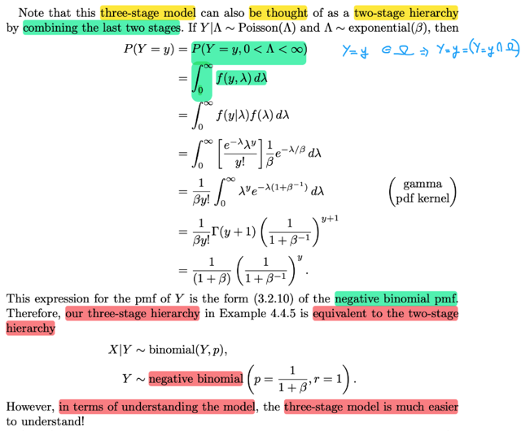</kbd></p>

> [!NOTE]
> Tiếp theo, đại khái là một mô hình 3 cấp có thể được chuyển thành mô
> hình 2 cấp bằng cách kết hợp hai cấp dưới.
>
> Ví dụ như ở đây Y ~ Pois(Λ), Λ ~ `Expo(β),` ta có thể kết hợp hai cấp
> này lại (cơ bản là với việc nếu biết giá trị Λ vốn là một `Expo(β)` rv, thì
> Y sẽ là một Pois(Λ) rv, thì bản thân nó (marginal) là một rv gì)
>
> Tức là ta tìm marginal pmf của Y:
>
> fY(y) `=` P(Y `=` y) bằng cách marginalizing joint distribution của Y, Λ over 
> mọi possible value của Λ: 
>
> Mà Λ ~ `Expo(β)` ⇨ support set của Λ là (0:inf) (nhắc lại ko thừa, thường
> thì ta có convention là nói về possible value của rv là nói về tập mà trong
> đó `pdf/pmf` dương (tức support set), nhưng cũng có sách nói khác, rằng
> possible value cũng có thể là giá trị mà `pdf/pmf` `=` 0. Nhưng dù thế nào,
> thì khi marginalizing over mọi possible value, thì dễ thấy rằng ta cũng sẽ
> chỉ tính những cái mà `pdf/pmf` dương. Nói cách khác, cũng chỉ là marginalizing
> trên support set.
>
> Vậy P(Y `=` y) `=` `∫0:inf` fY,Λ(y,λ)dλ.
>
> Tất nhiên ta ko biết fY,Λ(y,λ) là cái gì nhưng có thể dùng conditional theorem:
>
> `=` `∫0:inf` fY|Λ(y|λ)fΛ(λ) dλ.  
>
> fY|Λ(y|λ) là gì, như đã nói, NẾU BIẾT GIÁ TRỊ CỤ THỂ λ CỦA Λ, thì Y|Λ  ~ Pois(Λ)
> nên fY|Λ(y|λ) là pmf của Pois(λ) `=` `e^-λ` λ^y `/` y!
>
> ```text
> Còn fΛ(λ) là marginal pdf của Λ, là một Expo(β), pdf fΛ(λ) = (1/β) e^-λ/β
> ```
>
> ```text
> ⇨ P(Y=y) = ∫0:inf [e^-λ λ^y / y!] (1/β) e^-λ/β dλ
> ```
>
> ```text
> = (1/βy!) ∫0:inf e^-λ λ^y e^-λ/β dλ | đưa /βy! ko dính tới y ra ngoài
> ```
>
> ```text
> = (1/βy!) ∫0:inf e^(-λ-λ/β) λ^y dλ
> ```
>
> ```text
> = (1/βy!) ∫0:inf e^-λ(1+1/β) λ^y dλ
> ```
>
> ```text
> = (1/βy!) ∫0:inf λ^y e^-λ(1+β^-1) dλ
> ```
>
> ```text
> Tới đây xem lại pdf của X ~ Γ(α, β) fX(x) = [1/Γ(α)β^α] x^(α-1)e^-x/β
> ```
>
> nên λ^y có dạng của `x^(α-1)`
>
> ```text
> e^-λ(1+β^-1) có dạng của e^-x/β
> ```
>
> ```text
> ⇨ ở đây ta có  e^-λ(1+β^-1) là kernel của Γ(y+1, 1/(1+β^-1))
> ```
>
> ```text
> = Γ(y+1, 1/(1+1/β)) = Γ(y+1, β/(β+1))
> ```
>
> nên bằng cách nhân thêm và chia bớt cho normalizing constant:
>
> ```text
> Γ(y+1) [β/(β+1)]^(y+1)  / Γ(y+1) [β/(β+1)]^(y+1)
> ```
>
> ```text
> ⇨ Γ(y+1) [β/(β+1)]^(y+1) ∫0:inf [1/ Γ(y+1) [β/(β+1)]^(y+1) ] λ^y e^-λ(1+β^-1) dλ
> ```
>
> ```text
> = Γ(y+1) [β/(β+1)]^(y+1)
> ```
>
> Và cộng với `1/βy!` ở trước nữa ta có kết quả là
>
> ```text
> P(Y=y) = (1/βy!) Γ(y+1) [β/(β+1)]^(y+1)    đây là như trong sách rồi,
> ```
>
> ```text
> chỉ là β/(β+1) = 1/(1+β^-1) thôi
> ```
>
> ```text
> Thu gọn: (1/βy!) Γ(y+1) [β/(β+1)]^(y+1)
> ```
>
> Dùng identity: Γ(n) `=` `(n-1)!` 
>
> `=` (1/β**y!**) **y!** `[β/(β+1)]^y` `[β/(β+1)]`
>
> `=` (1/**β**) `[1/(1+β^-1)]^y` [**β**/(β+1)]
>
> ```text
> = (1/1) [1/(1+β^-1)]^y [1/(β+1)]
> ```
>
> ```text
> =  [1/(1+β^-1)]^y [1/(β+1)]
> ```
>
> `=` **[1/(β+1)] `[1/(1+β^-1)]^y` 
>
> ```text
> Và đây chính là pmf của NEGATIVE BINOMIAL p = 1/(1+β) r = 1
> ```
>
> ```text
> Do đó Y ~ negative binomial p = 1/(1+β) r = 1
> ```
>
> Và mô hình 3 tầng này cũng chính là mô hình 2 tầng: X ~ binomial(Y, p) 
>
> ```text
> Y ~ negative bino(p = 1/(1+β) r = 1)
> ```
>
> NHƯNG DÙNG MÔ HÌNH 3 TẦNG THÌ DỄ HIỂU HƠN**

<br>

<a id="node-272"></a>

<p align="center"><kbd>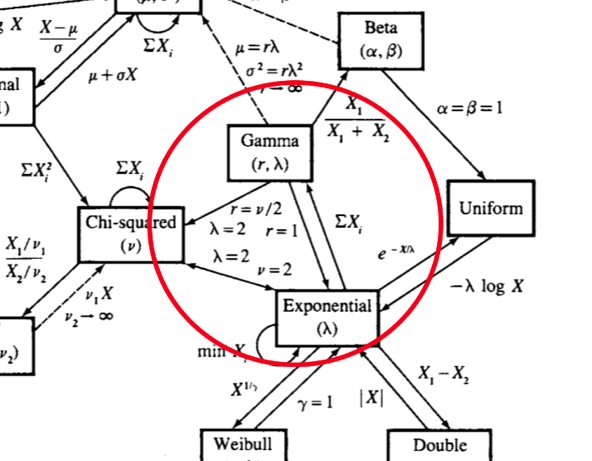</kbd></p>

<p align="center"><kbd></kbd></p>

<p align="center"><kbd>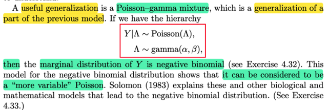</kbd></p>

> [!NOTE]
> Đại khái là khái quát hơn ví dụ vừa rồi Y ~ Pois(Λ), Λ ~ `Expo(β)` thì ta có
> Y ~ Pois(Λ), Λ ~ `gamma(α,` `β)`
>
> ```text
> (Expo(β) chính là Γ(α, β) với α = 1)
> ```

<br>

<a id="node-273"></a>

<p align="center"><kbd>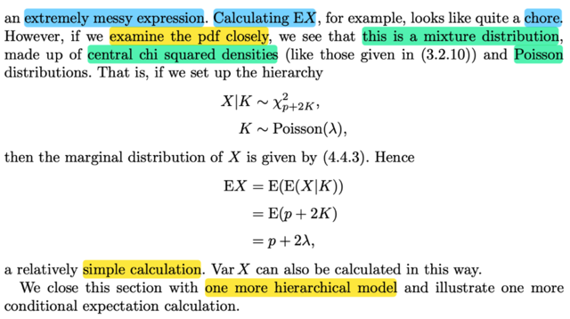</kbd></p>

<p align="center"><kbd></kbd></p>

<p align="center"><kbd>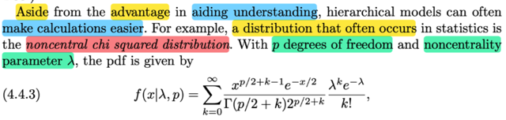</kbd></p>

> [!NOTE]
> QUAY LẠI SAU,
>
> Nhưng đại ý là, một ví dụ minh họa cho việc mô hình phân tầng có ngoài tác
> dụng giúp ta hiểu hơn (kiểu như hiểu ví dụ như biết giá trị của Λ thì Y là rv
> có distrib gì, rồi biết giá trị của Y thì X là rv distrib gì) thì nó còn giúp đơn giản
> hóa tính toán.
>
> Ở đây đại khái là nói về một phân phối xác suất cũng hay gặp trong statistic
> là NONCENTRAL CHI SQUARED.
>
> pdf của nó nhìn rất phức tạp, nhưng nhìn kĩ vào sẽ thấy bản chất nó là một
> mô hình 2 tầng:
>
> X|K ~ `Chi-Square` tham số p `+` 2K
>
> và K ~ Pois(λ)
>
> Để từ đó nếu giả sử muốn tính EX ta chỉ việc áp dụng Adam's Law:
>
> EX `=` `E[E(X|K)]` 
>
> ```text
> X|K là Chi-Square p + 2K, với Chi-Square(p) thì expected value = p
> ```
>
> ⇨ `E[X|K]` `=` p `+` 2K
>
> ```text
> Và ⇨ EX = E(p + 2K) = p + 2EK = p + 2λ  (expected value của Pois(λ) = λ)
> ```
>
> Nếu mà tính bằng cách dùng pmf thì rất khó

<br>

<a id="node-274"></a>

<p align="center"><kbd>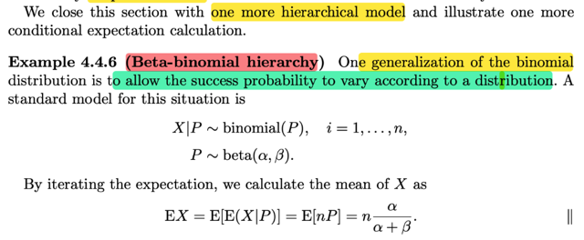</kbd></p>

> [!NOTE]
> Cuối cùng họ nói về một mô hình phân tầng nữa gọi là `Βeta-binomial:` Đại
> khái đó là khi ta cho success rate trong binomial(n, p) tức là p thay vì fixed
> thì nay cũng là một random variable ~ `β(α,β)` 
>
> Trong sách ghi X|P ~ binomial(P), i `=` 1,2...n (cứ hiểu là X|P ~ bin(n, P))
> và P ~ `β(α,` `β)`
>
> ```text
> Nhớ lại pdf của β(α, β) f(x|α, β) = 1/Beta(α, β) x^(α-1) (1-x)^(β-1) với
> ```
> 0 ≤ x ≤ 1, `α` > 0, `β` > 0
>
> thì again, ghi x ∈ [0,1] chính là nói về support set, đồng nghĩa chỉ có trên
> đoạn này thì pdf mới dương và cũng chính là nói giá trị của một `β(α,` `β)` chỉ
> có thể nằm trong đoạn 0,1 mà thôi.
>
> Từ đó mình hiểu rằng tại so P có thể được mô hình bởi một beta distribution
> vì dĩ nhiên vai trò của P là success rate của Bern trial nên nó phải ∈ [0,1]
>
> Thế thì với mô hình này thì EX là gì:
>
> Áp dụng EX `=` `E[E(X|P)]` với X|P là một binomial(n, P) ta biết story của nó
> là `Σ` của n Bern(P) trials
>
> ```text
> ⇨ E(X|P) = Σi E(I_i|P) với I_i ~ Bern(P), có expected value là P (expected
> ```
> value của bern(p) là p)
>
> `=` nP
>
> ⇨ EX `=` `E[nP]` 
>
> `=` nEP | linearity
>
> ```text
> = n α/(α + β) | mean của β(α, β) là α/(α + β)
> ```

<br>

<a id="node-275"></a>

<p align="center"><kbd>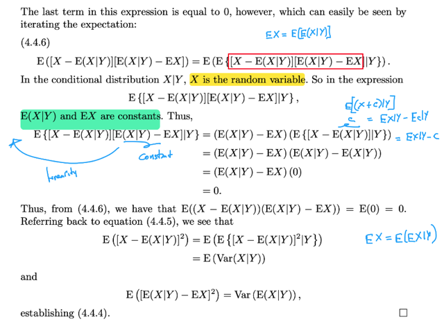</kbd></p>

<p align="center"><kbd></kbd></p>

<p align="center"><kbd>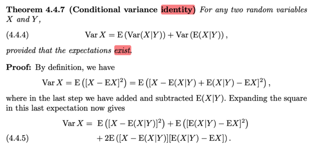</kbd></p>

🔗 **Related:** [7.3 METHODS OF EVALUATING ESTIMATORS](73_methods_of_evaluating_estimators.md#node-632)

> [!NOTE]
> Qua một identity cũng đã từng gặp trong stat110:
>
> ```text
> Var(X) = E(Var(X|Y)) + Var(E(X|Y))
> ```
>
> Chứng minh như vầy:
>
> Đầu tiên dùng công thức thứ 1 của `Var(X):`
>
> ```text
> Var(X) = E[X - EX]^2
> ```
>
> cộng thêm trừ bớt `E(X|Y)`
>
> ```text
> Var(X) = E[X - EX|Y + EX|Y - EX]^2
> ```
>
> ```text
> = E[(X - EX|Y) + (EX|Y - EX)]^2
> ```
>
> ```text
> = E{ (X - EX|Y)^2 + (EX|Y - EX)^2 + 2(X - EX|Y)(EX|Y - EX) } | khai triển (a + b)^2
> ```
>
> ```text
> = E(X - EX|Y)^2 + E(EX|Y - EX)^2 + 2E(X - EX|Y)(EX|Y - EX) | linearity
> ```
>
> Xét `E(X` `-` EX|Y)(EX|Y `-` EX)
>
> Dùng identity EX `=` `E[E(X|Y)]`
>
> ```text
> ⇨ E[(X - EX|Y)(EX|Y - EX)] = E[E[(X - EX|Y)(EX|Y - EX)|Y]] (Coi X = (X -
> ```
> EX|Y)(EX|Y `-` EX) )
>
> Thế thì nhìn cái này `E[(X` `-` EX|Y)(EX|Y `-` EX)|Y], ta lập luận như vầy:
>
> vì khi đã condition on Y, tức là biết giá trị của Y thì EX|Y như đã biết sẽ là một
> constant Bản thân EX|Y là random variable, cũng như EX|y là hàm số theo y, nhưng
> biết giá trị của Y thì EX|Y sẽ ko còn là random variable nữa, vì EX|Y chỉ là apply
> hàm EX|y lên Y. Và EX thì dĩ nhiên là constant. nên EX|Y `-` EX cũng là constant, do
> đó ta có thể đưa ra ngoài theo tính linearity
>
> ```text
> Thành ra E[(X - EX|Y)(EX|Y - EX)|Y] = (EX|Y - EX) E[(X - EX|Y)|Y]
> ```
>
> Rồi xét `E[(X` `-` EX|Y)|Y] thì với việc biết Y như đã nói EX|Y là constant, do đó ta đang
> ```text
> có  chính là E[(X + c)|Y] = EX|Y + Ec|Y = EX|Y + c
> ```
>
> ```text
> ⇨ E[(X - EX|Y)|Y] = EX|Y - EX|Y = 0
> ```
>
> ```text
> Vậy E[(X - EX|Y)(EX|Y - EX)|Y] = 0
> ```
>
> ```text
> Và Var(X) = E(X - EX|Y)^2 + E(EX|Y - EX)^2
> ```
>
> Xét term đầu tiên:
>
> ```text
> E[(X - EX|Y)^2] , cũng áp dụng EX = E[EX|Y]
> ```
>
> ```text
> = E{E[(X - EX|Y)^2|Y]}
> ```
>
> Thì `E[(X` `-` EX|Y)^2|Y] chính là `Var(X|Y)`
>
> Vậy `E[(X` `-` EX|Y)^2] `=` `E{E[(X` `-` EX|Y)^2|Y]} `=` **E[Var(X|Y)]**
>
> Đây là công thức đã được nói sơ qua ở Stat110, lecture 27. Nói chung là không có gì
> phức tạp, chỉ là ta mở rộng từ định nghĩa của variance `Var(X)` `=` EX^ `-` (EX)^2
> sang `Var(X|Y)` `=` EX^2|Y `-` (^2EX|Y)
>
> ```text
> Hoặc Var(X) = E[X - EX]^2 sang Var(X|Y) = E[X - EX|Y]^2|Y
> ```
>
> Xét term thứ hai: `E(EX|Y` `-` EX)^2
>
> Như đã nói nhiều lần EX|Y là một random variable, thì mean của nó là gì, là `E[EX|Y]`
> ```text
> mà theo Adam's Law chính là EX Vậy E(EX|Y - EX)^2 chính là E(EX|Y - E[EX|Y])^2
> ```
>
> và đây là công thức của variance **Var(EX|Y)**
>
> ```text
> Vậy Var(X) = E(X - EX|Y)^2 + E(EX|Y - EX)^2
> ```
>
> **⇔ `Var(X)` `=` `E[Var(X|Y)]` `-` Var(EX|Y)**

<br>

<a id="node-276"></a>

<p align="center"><kbd>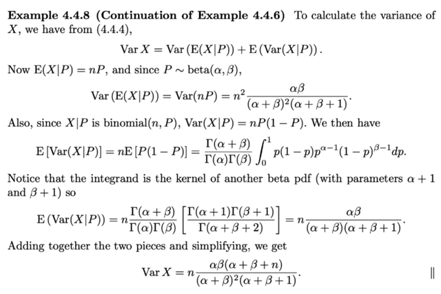</kbd></p>

> [!NOTE]
> Áp dụng identity này giúp ta tính VarX của mô hình phân cấp lúc nãy X ~ binomial(n, P)
> P ~ `β(α,` `β)`
>
> ```text
> Var(X) = Var[E(X|P)] + E[Var(X|P)]
> ```
>
> X|P ~ binomial(n, P) mà binomial n,p thì ta biết có variance là npq
>
> và mean là np
>
> ```text
> ⇨ Var[E(X|P)] = Var(nP)
> ```
>
> ```text
> = n^2Var(P) | Var(cX) = c^2 Var(X)
> ```
>
> ```text
> Với P ~ β(α, β) ⇨ Var(P) = αβ/[(α+β)^2(α+β+1)]
> ```
>
> ```text
> ⇨ n^2Var(P) = n^2 αβ/[(α+β)^2(α+β+1)]
> ```
>
> ```text
> E[Var(X|P)] = E[nP(1-P)]
> ```
>
> `=` `nE[P(1-P)]` 
>
> Để tính cái này thì dùng lotus thôi (đây là Eg(P) với g(P) `=` `P(1-P)`
>
> ```text
> E[P(1-P)] = ∫0:1 p(1-p)fP(p)dp
> ```
>
> ```text
> = ∫0:1 p(1-p) Γ(α+β)/Γ(α)Γ(β) p(1-p) p^(α-1)(1-p)^(β-1)dp
> ```
>
> ....QUAY LẠI SAU

<br>

